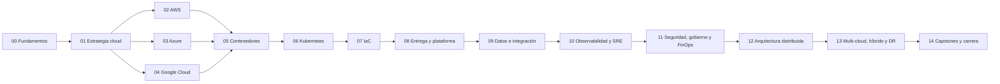

<div align="center">

# ☁️ Multi-Cloud Engineering Program

## **15 partes · 180 clases · de cero a ingeniería cloud experta**

**Programa educativo en español para aprender cloud engineering de extremo a extremo:
fundamentos, AWS, Azure, Google Cloud, contenedores, Kubernetes, IaC, entrega continua,
datos, SRE, seguridad, FinOps, arquitectura distribuida, nube híbrida y multi-cloud.**

[](https://github.com/vladimiracunadev-create/multi-cloud-engineering-program/actions/workflows/ci.yml)
[](CHANGELOG.md)
[](classes/README.md)
[](docs/SYLLABUS.md)
[](LICENSE)

[📚 Clases](classes/README.md) · [🧭 Rutas](learning-paths/README.md) ·
[📅 Syllabus](docs/SYLLABUS.md) · [🧪 Laboratorios](labs/README.md) ·
[🏗️ Capstones](capstones/README.md) · [📖 Bibliografía](docs/BIBLIOGRAPHY.md)

</div>

---

## ✅ Estado verificable

| Superficie | Estado |
|---|---|
| Currículo | ✅ 180/180 clases, numeración continua 001–180 |
| Contrato por clase | ✅ teoría + evaluación + metadatos + laboratorio |
| Laboratorios | ✅ 180 entrypoints sobre un motor local determinista |
| Partes | ✅ 15/15 índices con secuencia, evaluación y bibliografía |
| CLI | ✅ catálogo, inspección y ejecución de laboratorios |
| Portal | ✅ buscador, filtros y progreso local |
| Calidad | ✅ validador estricto y pruebas unitarias |
| Cuentas cloud | ⚪ opcionales; los labs base no crean recursos ni costos |

## 🎯 Qué es este programa

Es un currículo **modular y secuencial** inspirado en el patrón pedagógico de los repositorios
de aprendizaje de Vladimir Acuña: clases numeradas, evidencia reproducible, profundidad
bibliográfica, proyectos acumulativos y superficies distintas para alumno, docente y evaluador.

Cada clase incluye:

- propósito y resultados de aprendizaje verificables;
- conceptos, modelo mental, diagrama y desarrollo guiado;
- ejemplo trabajado con restricciones de disponibilidad, datos y presupuesto;
- laboratorio ejecutable, prueba negativa y evidencia JSON;
- reto con criterio de aceptación y escala de evaluación;
- errores frecuentes, seguridad, costo, FAQ y referencias.

La nube se enseña como disciplina de ingeniería. AWS, Azure y Google Cloud aparecen como
implementaciones concretas de contratos que primero se comprenden de forma neutral.

## 🗺️ Mapa del programa



## 🗂️ Las 15 partes

| # | Parte | Clases | Resultado principal |
|---:|---|---:|---|
| 00 | Fundamentos de computación, redes y Linux | 001–012 | Servicio local reproducible |
| 01 | Principios, estrategia y adopción cloud | 013–024 | ADR de migración |
| 02 | AWS: plataforma esencial | 025–036 | Aplicación de tres capas en AWS |
| 03 | Azure: plataforma esencial | 037–048 | Aplicación de tres capas en Azure |
| 04 | Google Cloud: plataforma esencial | 049–060 | Aplicación de tres capas en GCP |
| 05 | Contenedores, Docker y OCI | 061–072 | Stack endurecido y observable |
| 06 | Kubernetes y plataformas administradas | 073–084 | Plataforma portable EKS/AKS/GKE |
| 07 | Infraestructura como código | 085–096 | Infraestructura multiambiente |
| 08 | Entrega continua y platform engineering | 097–108 | Fábrica de software multi-cloud |
| 09 | Datos, mensajería, serverless e integración | 109–120 | Pipeline orientado a eventos |
| 10 | Observabilidad, SRE y confiabilidad | 121–132 | Operación por SLO de CloudShop |
| 11 | Seguridad, gobierno, cumplimiento y FinOps | 133–144 | Landing zone con guardrails |
| 12 | Arquitectura cloud-native y distribuida | 145–156 | Architecture review con ADR |
| 13 | Multi-cloud, híbrido, migración y DR | 157–168 | Continuidad activa-pasiva |
| 14 | Plataformas avanzadas, capstones y carrera | 169–180 | Defensa y portafolio profesional |

➡️ [Abrir el índice completo de las 180 clases](classes/README.md).

## 🚀 Inicio rápido

Solo necesitas Python 3.11 o superior:

```bash
python scripts/validate_repository.py --strict
python -m unittest discover -s tests -v
python classes/part-00-foundations-computing-networking-linux/001-computacion-digital-y-modelo-mental-de-la-nube/lab.py
```

Para usar la CLI:

```bash
python -m pip install -e .
multicloud-program catalog
multicloud-program show 001
multicloud-program run 001 --seed 42
```

Portal local:

```bash
python -m http.server 8080
```

Abre `http://localhost:8080/site/`.

## 🧪 Filosofía de laboratorio

Los laboratorios base son locales, deterministas y sin credenciales. Enseñan primero el
contrato observable: requisito, decisión, estado, evidencia, prueba negativa y limitación.
Después, cada ruta pide trasladar el mismo contrato a un sandbox de proveedor.

El programa nunca confunde una simulación con producción. Desplegar en una cuenta real exige
validar cuotas, latencia, permisos, fallos regionales, facturación y políticas vigentes.

## 📚 Pauta basada en libros

La secuencia está guiada por obras como *Cloud Strategy*, *Cloud Native Patterns*,
*Designing Data-Intensive Applications*, *Infrastructure as Code*, *Continuous Delivery*,
*Kubernetes: Up and Running*, *Site Reliability Engineering*, *Practical Cloud Security*,
*Cloud FinOps*, *Team Topologies* y documentación oficial de cada proveedor.

Las referencias orientan profundidad y orden conceptual. El contenido del programa tiene
redacción original y no reproduce los libros. Consulta el [mapa bibliográfico](docs/BIBLIOGRAPHY.md).

## 🧭 Rutas por perfil

- Cloud Engineer: fundamentos → proveedor principal → contenedores → IaC → SRE.
- DevOps Engineer: fundamentos → contenedores → Kubernetes → IaC → entrega → SRE.
- Platform Engineer: Kubernetes → IaC → entrega → seguridad → plataforma avanzada.
- Cloud Architect: estrategia → tres proveedores → datos → seguridad → arquitectura → multi-cloud.
- SRE: fundamentos → Kubernetes → entrega → observabilidad → arquitectura distribuida.
- Cloud Security / FinOps: estrategia → proveedores → IaC → seguridad, gobierno y FinOps.

Las dependencias y clases exactas están en [learning-paths/README.md](learning-paths/README.md).

## ⚖️ Límites honestos

- El programa prepara criterio y portafolio; no concede certificaciones oficiales.
- Los laboratorios locales no sustituyen pruebas en cuentas reales autorizadas.
- Precios, nombres de servicios, límites y certificaciones cambian: verifica documentación oficial.
- Multi-cloud no es un objetivo automático; debe justificarse por continuidad, regulación o negocio.
- Ningún ejemplo educativo prueba cumplimiento, seguridad o disponibilidad de producción.

## 🔍 Origen pedagógico correcto

La reconstrucción se basó específicamente en:

- [Artificial Intelligence Evolution Program](https://github.com/vladimiracunadev-create/artificial-intelligence-evolution-program)
- [Blockchain Learning Path](https://github.com/vladimiracunadev-create/blockchain-learning-path)
- [Python Data Science Program](https://github.com/vladimiracunadev-create/python-data-science-program)
- [Modern Cybersecurity Program](https://github.com/vladimiracunadev-create/modern-cybersecurity-program)

El análisis de patrones y las decisiones adoptadas están documentados en
[docs/REPOSITORY_RESEARCH.md](docs/REPOSITORY_RESEARCH.md).

## 📄 Licencia

[MIT](LICENSE). Libros, documentación de proveedores y servicios externos conservan sus
respectivas licencias y términos.
