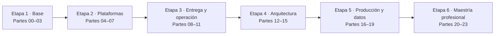
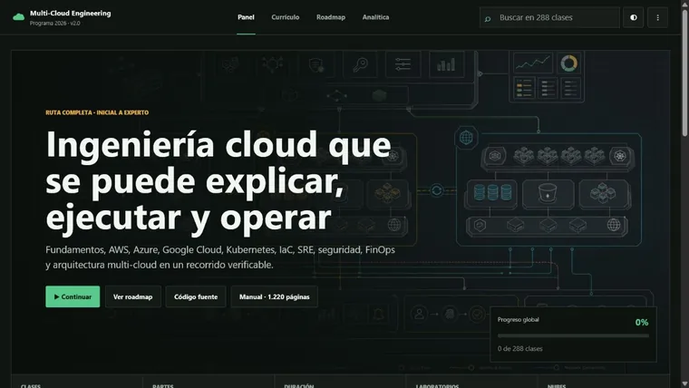
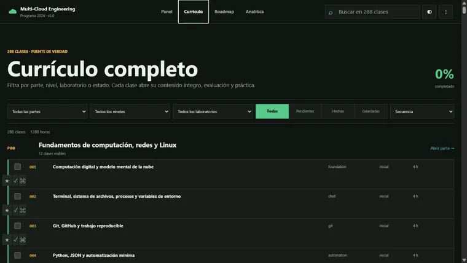
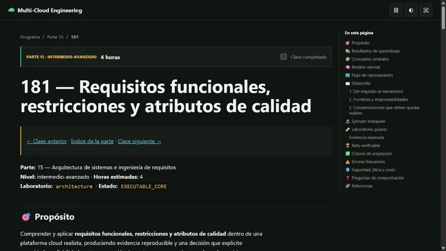

<div align="center">

# ☁️ Multi-Cloud Engineering Program

## **288 clases · 24 partes · 1.288 horas · de cero a arquitectura cloud experta**

**El programa de ingeniería multi-cloud más completo en español — desde computación, redes y Linux hasta Kubernetes, IaC, SRE, FinOps, arquitectura distribuida y operación productiva en AWS, Azure y Google Cloud.**

[](https://github.com/vladimiracunadev-create/multi-cloud-engineering-program/actions/workflows/ci.yml)
[](https://vladimiracunadev-create.github.io/multi-cloud-engineering-program/)
[](https://github.com/vladimiracunadev-create/multi-cloud-engineering-program/actions/workflows/security.yml)

[](CHANGELOG.md)
[](classes/README.md)
[](site/downloads/multi-cloud-engineering-manual-v2.0.pdf)
[](LICENSE)

[🌐 Portal](https://vladimiracunadev-create.github.io/multi-cloud-engineering-program/) ·
[📚 Índice de las 288 clases](classes/README.md) ·
[📕 Manual completo (PDF)](site/downloads/multi-cloud-engineering-manual-v2.0.pdf) ·
[📅 Syllabus](docs/SYLLABUS.md) ·
[🗺️ Roadmap](ROADMAP.md) ·
[🤝 Contribuir](CONTRIBUTING.md) ·
[🔐 Seguridad](SECURITY.md)

**Cobertura por proveedor:**
[AWS](classes/part-02-aws-core-platform/README.md) ·
[Azure](classes/part-03-azure-core-platform/README.md) ·
[Google Cloud](classes/part-04-gcp-core-platform/README.md) ·
[Kubernetes](classes/part-06-kubernetes-managed-platforms/README.md) ·
[Terraform](classes/part-07-infrastructure-as-code-configuration/README.md)

</div>

---

> [!WARNING]
> **Costo y seguridad.** Los laboratorios base **no crean recursos cloud** y no requieren tarjeta ni credenciales. Para practicar en cuentas reales usa un sandbox autorizado con presupuesto, alertas, credenciales temporales, etiquetas y destrucción verificada. Nunca ejecutes un despliegue que no puedas explicar, observar y retirar.

## 🎯 Qué es esto

Un currículo **secuencial, basado en libros y orientado a evidencia**: 288 clases numeradas (001→288) agrupadas en 24 partes, desde principiante absoluto hasta decisiones de arquitectura y operación en producción. Cada clase es una carpeta con un `README.md` completo que incluye:

- 🎯 **Propósito** y **resultados de aprendizaje verificables**.
- 🧩 **Conceptos centrales** y **modelo mental** del mecanismo.
- 🗺️ **Flujo de razonamiento** en diagrama Mermaid.
- 📖 **Desarrollo guiado** con fronteras, responsabilidades y compensaciones visibles.
- 🔬 **Ejemplo trabajado** con números concretos.
- 🧪 **Laboratorio ejecutable** (`lab.py`) con evidencia JSON reproducible.
- 🏆 **Reto verificable** con **criterio de aceptación** explícito.
- ⚠️ **Errores frecuentes** (síntoma → causa → corrección).
- 🛡️ **Seguridad, ética y costo** de lo que se acaba de construir.
- ❓ **Preguntas de comprobación** y 🔗 **referencias** a la literatura del área.

## ✅ Estado verificable

| Superficie | Cobertura |
|---|---|
| 📚 Currículo | 288/288 clases; numeración continua 001–288 en 24 partes |
| 🏆 Evaluación | 288 rúbricas de clase + criterios transversales + defensa final |
| 🧪 Práctica | 288 entrypoints ejecutables, evidencia JSON, fallos controlados y cost gates |
| 📕 Manual | 1.486 páginas generadas desde 607 archivos fuente versionados |
| 🖥️ Portal | PWA instalable, buscador, filtros, rutas, progreso local y modo offline |
| 🏗️ Arquitectura | Requisitos, ADR, C4, sistemas distribuidos, integración, resiliencia y DR |
| 🔧 Calidad | CI multi-OS/Python, validadores, pruebas, CodeQL, Bandit, pip-audit y Gitleaks |
| ☁️ Cuentas cloud | Opcionales; los recorridos locales no requieren credenciales ni generan costos |

## 🗺️ El recorrido en 6 etapas



| Etapa | Partes | Competencia que construye |
|---|---:|---|
| 1️⃣ Base de ingeniería | 00–03 | Computación, redes, Linux, estrategia cloud, AWS y Azure |
| 2️⃣ Plataformas y automatización | 04–07 | Google Cloud, contenedores, Kubernetes e IaC |
| 3️⃣ Entrega y operación | 08–11 | CI/CD, platform engineering, datos, SRE, seguridad y FinOps |
| 4️⃣ Arquitectura de sistemas | 12–15 | Distribuidos, multi-cloud, requisitos, C4, ADR y trade-offs |
| 5️⃣ Producción multi-proveedor | 16–19 | Redes avanzadas y arquitecturas productivas en AWS, Azure y GCP |
| 6️⃣ Maestría profesional | 20–23 | Datos e IA, incidentes, especializaciones y capstones por industria |

## 🗂️ Las 24 partes

Cada parte tiene su **propio README** con narrativa, resultados de aprendizaje y enlaces a sus 12 clases.

| # | Parte | Clases | Resultado principal | README |
|---:|---|---:|---|---|
| 00 | Fundamentos de computación, redes y Linux | 001–012 | Servicio local reproducible | [📘 leer](classes/part-00-foundations-computing-networking-linux/README.md) |
| 01 | Principios, estrategia y adopción cloud | 013–024 | ADR de migración | [📘 leer](classes/part-01-cloud-principles-strategy-adoption/README.md) |
| 02 | AWS: plataforma esencial | 025–036 | Aplicación de tres capas en AWS | [📘 leer](classes/part-02-aws-core-platform/README.md) |
| 03 | Azure: plataforma esencial | 037–048 | Aplicación de tres capas en Azure | [📘 leer](classes/part-03-azure-core-platform/README.md) |
| 04 | Google Cloud: plataforma esencial | 049–060 | Aplicación de tres capas en GCP | [📘 leer](classes/part-04-gcp-core-platform/README.md) |
| 05 | Contenedores, Docker y OCI | 061–072 | Stack endurecido y observable | [📘 leer](classes/part-05-containers-docker-oci/README.md) |
| 06 | Kubernetes y plataformas administradas | 073–084 | Plataforma portable EKS/AKS/GKE | [📘 leer](classes/part-06-kubernetes-managed-platforms/README.md) |
| 07 | Infraestructura como código | 085–096 | Infraestructura multiambiente | [📘 leer](classes/part-07-infrastructure-as-code-configuration/README.md) |
| 08 | Entrega continua y platform engineering | 097–108 | Fábrica de software multi-cloud | [📘 leer](classes/part-08-continuous-delivery-platform-engineering/README.md) |
| 09 | Datos, mensajería, serverless e integración | 109–120 | Pipeline orientado a eventos | [📘 leer](classes/part-09-data-messaging-serverless-integration/README.md) |
| 10 | Observabilidad, SRE y confiabilidad | 121–132 | Operación por SLO de CloudShop | [📘 leer](classes/part-10-observability-sre-reliability/README.md) |
| 11 | Seguridad, gobierno, cumplimiento y FinOps | 133–144 | Landing zone con guardrails | [📘 leer](classes/part-11-security-governance-finops/README.md) |
| 12 | Arquitectura cloud-native y distribuida | 145–156 | Architecture review con ADR | [📘 leer](classes/part-12-cloud-native-distributed-architecture/README.md) |
| 13 | Multi-cloud, híbrido, migración y DR | 157–168 | Continuidad activa-pasiva | [📘 leer](classes/part-13-multicloud-hybrid-disaster-recovery/README.md) |
| 14 | Plataformas avanzadas, capstones y carrera | 169–180 | Defensa y portafolio profesional | [📘 leer](classes/part-14-advanced-platform-capstones-career/README.md) |
| 15 | Arquitectura de sistemas e ingeniería de requisitos | 181–192 | Diseño completo de CloudShop | [📘 leer](classes/part-15-systems-architecture-engineering/README.md) |
| 16 | Redes cloud avanzadas, híbridas y edge | 193–204 | Red multi-región y multi-cloud | [📘 leer](classes/part-16-advanced-cloud-networking-edge/README.md) |
| 17 | AWS en producción | 205–216 | CloudShop productivo en AWS | [📘 leer](classes/part-17-aws-production-architecture/README.md) |
| 18 | Azure en producción | 217–228 | CloudShop productivo en Azure | [📘 leer](classes/part-18-azure-production-architecture/README.md) |
| 19 | Google Cloud en producción | 229–240 | CloudShop productivo en GCP | [📘 leer](classes/part-19-gcp-production-architecture/README.md) |
| 20 | Datos, analítica, IA y agentes | 241–252 | Asistente operativo gobernado | [📘 leer](classes/part-20-cloud-data-ai-platforms/README.md) |
| 21 | Operación y respuesta a incidentes | 253–264 | Centro de operaciones CloudShop | [📘 leer](classes/part-21-cloud-operations-automation/README.md) |
| 22 | Especializaciones y certificaciones | 265–276 | Defensa técnica por rol | [📘 leer](classes/part-22-specializations-certifications-career/README.md) |
| 23 | Capstones por industria | 277–288 | Game day y defensa final | [📘 leer](classes/part-23-industry-capstones/README.md) |

➡️ **[Ver el índice plano de las 288 clases](classes/README.md)**

## 🧪 Laboratorios y proyectos

Cada clase trae un `lab.py` ejecutable que **no toca ninguna nube**: genera un contrato JSON determinista con escenario, decisión, evidencia, prueba negativa, unidad de costo y límites explícitos. La misma semilla produce siempre el mismo resultado, en Windows, macOS, Linux y CI.

```bash
python classes/part-10-observability-sre-reliability/126-sli-slo-sla-y-presupuesto-de-error/lab.py --seed 42
```

| 🧭 Recorrido práctico | Qué produce |
|---|---|
| 🧪 **288 laboratorios de clase** | `lab_result.json`, prueba negativa y artefacto en `evidence/` |
| 🛒 **CloudShop** | Arquitectura evolutiva desde servicio local hasta operación multi-cloud |
| ☁️ **Sandboxes por proveedor** | Contrato de presupuesto, identidad, etiquetas, validación y destrucción |
| 🏗️ **Terraform local** | Grafo, plan, estado, drift, pruebas y contrato multiambiente |
| ⚙️ **Kubernetes** | Manifiestos, políticas, entrega, observabilidad, fallo y recuperación |
| 📊 **Plataforma de datos e IA** | Ingesta, calidad, gobierno, MLOps/LLMOps y agente con límites humanos |
| 🚨 **Game days** | Escenario de incidente, comando, comunicación, recuperación y postmortem |
| 🏆 **12 capstones de industria** | Retail, finanzas, salud, sector público, media, IoT, SaaS, datos e IA |

[Catálogo de laboratorios](labs/README.md) ·
[Capstones](capstones/README.md) ·
[Modelos de amenaza y costo](docs/THREAT_MODELS.md)

## 🖥️ Portal de aprendizaje

El portal se genera desde el mismo catálogo y los mismos Markdown que el manual, así que nunca se desincroniza. Es una **PWA instalable**: funciona offline, guarda progreso y favoritos en tu navegador y no requiere cuenta ni rastrea nada.

| Panel y continuidad | Currículo de 288 clases | Clase y navegación interna |
|---|---|---|
|  |  |  |

[Abrir panel](https://vladimiracunadev-create.github.io/multi-cloud-engineering-program/) ·
[Abrir currículo](https://vladimiracunadev-create.github.io/multi-cloud-engineering-program/#curriculum) ·
[Abrir roadmap](https://vladimiracunadev-create.github.io/multi-cloud-engineering-program/#roadmap) ·
[Abrir clase 181](https://vladimiracunadev-create.github.io/multi-cloud-engineering-program/classes/181.html)

## 📕 Manual integral

¿Prefieres el curso entero en un solo documento, para leer de corrido o estudiar sin conexión? El manual PDF contiene **todos los contenidos docentes del curso**, no un resumen:

- 📄 **1.486 páginas A4** con índice y marcadores navegables;
- 📚 siete guías pedagógicas y bibliográficas centrales;
- 🗂️ 24 introducciones de parte y **288 lecciones completas**;
- 🏆 **288 evaluaciones** con preguntas, reto, aceptación y escala;
- 📊 tablas, diagramas Mermaid conservados como especificación y bloques de código;
- 🔒 manifiesto SHA-256 que detecta si alguna de las **607 fuentes** cambió después de generarlo.

📥 **[Descargar el manual completo](site/downloads/multi-cloud-engineering-manual-v2.0.pdf)** ·
[🎞️ Presentación (PPTX)](site/downloads/multi-cloud-engineering-program-v2.0.pptx) ·
[🔍 Manifiesto de integridad](output/pdf/manual-manifest.json)

> Se genera con `python scripts/generate_manual.py`, así que siempre refleja el contenido actual del repositorio.

## 🏆 Evaluación verificable

La evaluación se apoya en **evidencia y defensa**, no en marcar temas como leídos.

| Dimensión | Evidencia mínima |
|---|---|
| 🏗️ Diseño | Requisitos, restricciones, alternativa descartada y ADR |
| ⚙️ Implementación | Código o configuración reproducible y versionada |
| 📡 Operación | Telemetría, prueba de fallo, recuperación y runbook |
| 🛡️ Seguridad | Identidad, mínimo privilegio, amenaza y riesgo residual |
| 💰 Economía | Unidad de costo, presupuesto, sensibilidad y ownership |
| 🗣️ Comunicación | Decisión defendible, límites explícitos y trazabilidad |

[Rúbrica transversal](docs/ASSESSMENT_RUBRIC.md) ·
[Guía del estudiante](docs/STUDENT_GUIDE.md) ·
[Guía docente](docs/INSTRUCTOR_GUIDE.md)

## 🧭 Rutas por rol

| Rol | Núcleo recomendado | Evidencia de salida |
|---|---|---|
| ☁️ **Cloud Engineer** | 00–07, 10, proveedor productivo | Plataforma reproducible y operable |
| 🚀 **DevOps / Delivery Engineer** | 00, 05–10, 21 | Pipeline, despliegue, SLO y rollback |
| 🏗️ **Platform Engineer** | 05–08, 10–12, 14 | Golden path y plataforma como producto |
| 📡 **Site Reliability Engineer** | 00, 06, 08, 10, 12, 21 | SLO, game day, runbook y postmortem |
| 🛡️ **Cloud Security Engineer** | 01–07, 11, 16, 21 | Landing zone, políticas y threat model |
| 💰 **FinOps Practitioner** | 01–04, 07, 11, 20 | Modelo de costo y gobierno económico |
| 📊 **Data / AI Cloud Engineer** | 02–04, 09, 12, 20 | Plataforma de datos e IA gobernada |
| 🧠 **Solutions Architect** | 01–04, 10–19, 23 | Architecture review y defensa ejecutiva |

Las dependencias exactas están en [learning-paths/README.md](learning-paths/README.md) y el mapeo de credenciales en [docs/CERTIFICATION_MAP.md](docs/CERTIFICATION_MAP.md).

## 🚀 Cómo usar el programa

1. **Sigue el orden.** La numeración es secuencial por diseño: cada clase asume la anterior. Empieza por la [guía del estudiante](docs/STUDENT_GUIDE.md) o elige una [ruta profesional](learning-paths/README.md).
2. **Predice antes de ejecutar.** Antes de cada laboratorio, escribe qué resultado y qué fallo esperas. Comparar la predicción con la evidencia es donde ocurre el aprendizaje.
3. **Conserva la evidencia.** Ejecuta localmente, guarda el `lab_result.json` y responde la evaluación de la clase.
4. **Defiende cada parte.** Al cerrar una parte, defiende el artefacto y actualiza tu progreso.
5. **Usa cuentas cloud solo al llegar al sandbox** correspondiente, y siempre con el cost gate aplicado.
6. **Cierra con CloudShop**, un capstone industrial y la defensa final.

**Inicio local:**

```bash
python scripts/validate_repository.py --strict
python -m unittest discover -s tests -v
python classes/part-00-foundations-computing-networking-linux/001-computacion-digital-y-modelo-mental-de-la-nube/lab.py
```

**CLI y portal:**

```bash
python -m pip install -e ".[site]"
multicloud-program catalog          # las 288 clases
multicloud-program show 181         # metadatos de una clase
multicloud-program run 181 --seed 42 # ejecutar su laboratorio
multicloud-program progress         # progreso portable
multicloud-program certificate --name "Tu Nombre"
python scripts/generate_site.py && python -m http.server 8080
```

## ✅ Calidad y CI

El repositorio no se publica a ciegas: cada `push` y cada PR pasan por integración continua que valida estructura, enlaces, codificación y build del sitio. Nada llega a `main` en rojo, y el sitio se verifica **después** de publicarse.

| ⚙️ Workflow | Qué cubre |
|---|---|
| 🧪 [ci.yml](.github/workflows/ci.yml) | Validación estricta, pruebas, CLI y compatibilidad multi-OS/Python |
| 🚀 [pages.yml](.github/workflows/pages.yml) | Genera, valida y publica el portal — y comprueba el sitio **ya desplegado** |
| 🔒 [security.yml](.github/workflows/security.yml) | Bandit, pip-audit y Gitleaks programados |
| 🔎 [codeql.yml](.github/workflows/codeql.yml) | Análisis estático de seguridad |
| 📦 [release.yml](.github/workflows/release.yml) | Artefactos, checksums y publicación versionada |

Los mismos validadores corren en local antes de subir:

```bash
python scripts/validate_repository.py --strict  # 288 clases + enlaces internos
python scripts/validate_site.py                 # artefacto de Pages completo
python scripts/validate_manual.py               # páginas, cobertura y hash de las 607 fuentes
```

## 👩‍🏫 Para instructores

El repositorio incluye secuencia de sesiones, resultados observables, instrumentos de evaluación, criterios de aceptación y material para cohortes. El instructor puede usar el catálogo como fuente única, asignar rutas por perfil y evaluar artefactos con la misma rúbrica.

[📐 Metodología docente](docs/METHODOLOGY.md) ·
[👩‍🏫 Guía del instructor](docs/INSTRUCTOR_GUIDE.md) ·
[📅 Syllabus](docs/SYLLABUS.md)

<details>
<summary><b>📚 Base bibliográfica — las obras que ordenan cada parte</b></summary>

<br>

El programa usa libros para ordenar conceptos y profundidad; **toda la redacción es original y no reproduce sus textos**. La documentación oficial vigente complementa cada implementación.

| Área | Obras guía |
|---|---|
| Fundamentos y redes | *How Linux Works* · *Computer Networking: A Top-Down Approach* · *Pro Git* |
| Estrategia y arquitectura cloud | *Cloud Strategy* · *Cloud Native Patterns* · *Fundamentals of Software Architecture* |
| Sistemas distribuidos y datos | *Designing Data-Intensive Applications* · *Building Microservices* · *Release It!* |
| Contenedores y Kubernetes | *Docker Deep Dive* · *Kubernetes: Up and Running* · *Kubernetes Patterns* |
| IaC y entrega | *Infrastructure as Code* · *Continuous Delivery* · *Accelerate* |
| SRE y operación | *Site Reliability Engineering* · *The Site Reliability Workbook* · *Observability Engineering* |
| Seguridad y gobierno | *Practical Cloud Security* · *Threat Modeling* · marcos Well-Architected |
| FinOps y organización | *Cloud FinOps* · *Team Topologies* · *Platform Engineering* |
| Evolución y decisiones | *Building Evolutionary Architectures* · *Software Architecture: The Hard Parts* |

[Mapa bibliográfico completo y relación por partes](docs/BIBLIOGRAPHY.md)

</details>

## 🎯 Qué es y qué no es este programa

<table>
<tr>
<td valign="top" width="50%">

### ✅ Lo que sí es

- 📚 un currículo **secuencial y completo** de 288 clases con 288 evaluaciones;
- 🧪 práctica **reproducible y sin costo**: 288 laboratorios ejecutables con evidencia JSON;
- ☁️ una progresión **neutral primero** y luego aplicada a AWS, Azure y GCP;
- 🏗️ arquitectura, sistemas distribuidos, operación, seguridad y economía cloud;
- 🌐 material **abierto y offline-friendly** (manual PDF + portal PWA), en español.

</td>
<td valign="top" width="50%">

### ❌ Lo que no es

- 🚫 una lista de enlaces ni un catálogo de nombres de servicios;
- 🚫 un curso limitado a un solo proveedor;
- 🚫 una promesa de producción sin validar en cuentas reales;
- 🚫 preparación mecánica para un examen de certificación;
- 🚫 una certificación oficial ni una garantía laboral.

</td>
</tr>
</table>

## ⚖️ Límites honestos

- El programa prepara **criterio y portafolio**; no concede certificaciones oficiales.
- Los laboratorios locales enseñan contratos, pero **no sustituyen** pruebas autorizadas en cloud.
- Precios, límites, servicios y exámenes cambian: consulta siempre documentación oficial vigente.
- Multi-cloud solo se justifica por requisitos **medibles** de negocio, regulación o continuidad.
- Ningún ejemplo educativo demuestra por sí mismo seguridad, cumplimiento o disponibilidad.
- La profundidad real exige ejecutar, fallar, recuperar, medir y **defender** cada decisión.

## 💡 Idea fuerza

> La nube no se domina memorizando catálogos. Se domina conectando **requisitos con mecanismos**, mecanismos con **evidencia** y evidencia con **decisiones** operables, seguras y económicamente claras.

## 🔍 Programas hermanos

[🛡️ Ciberseguridad Moderna](https://github.com/vladimiracunadev-create/modern-cybersecurity-program) ·
[🧠 AI Evolution](https://github.com/vladimiracunadev-create/artificial-intelligence-evolution-program) ·
[🐍 Python Data Science](https://github.com/vladimiracunadev-create/python-data-science-program) ·
[⛓️ Blockchain Learning Path](https://github.com/vladimiracunadev-create/blockchain-learning-path) ·
[🌐 Polyglot Programming](https://github.com/vladimiracunadev-create/polyglot-programming-labs)

El análisis comparativo y las decisiones adoptadas están en [docs/REPOSITORY_RESEARCH.md](docs/REPOSITORY_RESEARCH.md).

## 📄 Licencia

[MIT](LICENSE) para el código · [contenido educativo](CONTENT_LICENSE.md) para el material del curso. Úsalo, modifícalo y compártelo.

---

<div align="center">

**Aprende · construye · falla con control · recupera · mide · defiende**

[⬆️ Empezar por el índice de las 288 clases](classes/README.md)

<br>

**¿Te resulta útil? ⭐ Dale una estrella al repo.**

[](https://github.com/vladimiracunadev-create/multi-cloud-engineering-program/stargazers)
[](https://github.com/vladimiracunadev-create/multi-cloud-engineering-program/network/members)
[](https://github.com/vladimiracunadev-create)

Hecho con 🧠 y ☕ por [Vladimir Acuña](https://github.com/vladimiracunadev-create)

</div>
