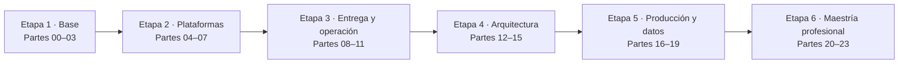
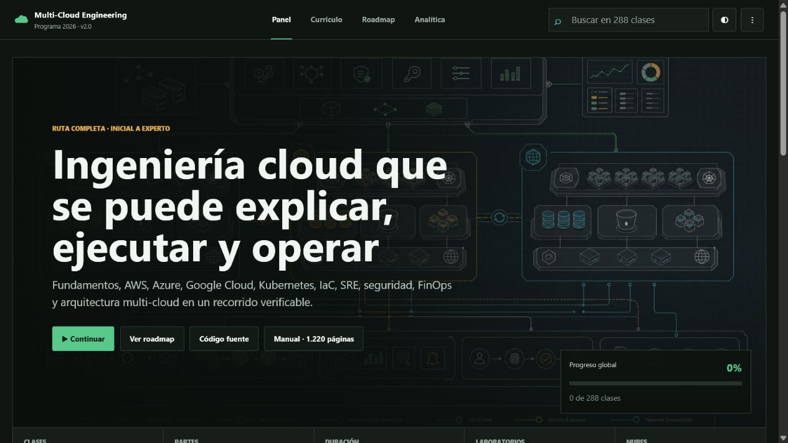
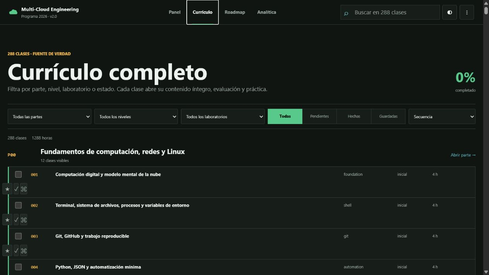
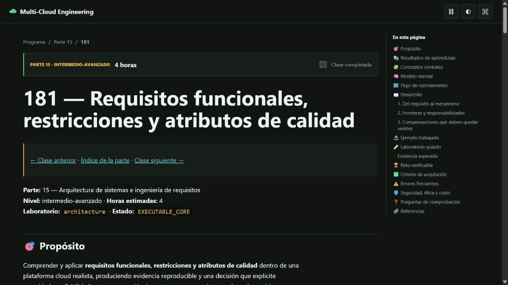

<div align="center">

# ☁️ Multi-Cloud Engineering Program

## **24 partes · 288 clases · 1.288 horas · de cero a arquitectura cloud experta**

Programa educativo integral en español para aprender ingeniería cloud de extremo a extremo:
fundamentos, AWS, Azure, Google Cloud, arquitectura de sistemas, contenedores, Kubernetes,
IaC, entrega continua, datos e IA, SRE, seguridad, FinOps, nube híbrida y multi-cloud.

[](https://github.com/vladimiracunadev-create/multi-cloud-engineering-program/actions/workflows/ci.yml)
[](https://vladimiracunadev-create.github.io/multi-cloud-engineering-program/)
[](https://github.com/vladimiracunadev-create/multi-cloud-engineering-program/actions/workflows/security.yml)
[](CHANGELOG.md)
[](classes/README.md)
[](site/downloads/multi-cloud-engineering-manual-v2.0.pdf)
[](LICENSE)

[](classes/part-02-aws-core-platform/README.md)
[](classes/part-03-azure-core-platform/README.md)
[](classes/part-04-gcp-core-platform/README.md)
[](classes/part-06-kubernetes-managed-platforms/README.md)
[](classes/part-07-infrastructure-as-code-configuration/README.md)
[](pyproject.toml)

[🌐 Portal](https://vladimiracunadev-create.github.io/multi-cloud-engineering-program/) ·
[📚 288 clases](classes/README.md) · [🧭 Rutas](learning-paths/README.md) ·
[📅 Syllabus](docs/SYLLABUS.md) · [🧪 Laboratorios](labs/README.md) ·
[🏗️ Capstones](capstones/README.md) · [📖 Bibliografía](docs/BIBLIOGRAPHY.md) ·
[Manual PDF](site/downloads/multi-cloud-engineering-manual-v2.0.pdf) ·
[Presentación](site/downloads/multi-cloud-engineering-program-v2.0.pptx)

</div>

> [!WARNING]
> Los laboratorios base no crean recursos cloud. Para practicar en cuentas reales usa un
> sandbox autorizado, presupuesto, alertas, credenciales temporales, etiquetas y destrucción
> verificada. Nunca ejecutes un despliegue que no puedas explicar, observar y retirar.

## 🎯 Qué es este programa

Es un currículo **secuencial, basado en libros y orientado a evidencia**. Sigue el patrón
pedagógico de los programas de aprendizaje de Vladimir Acuña: clases numeradas, teoría
original, práctica reproducible, evaluación explícita, proyectos acumulativos y una ruta
desde principiante absoluto hasta decisiones de arquitectura y operación en producción.

| Sí es | No es |
|---|---|
| Un curso completo con 288 lecciones y evaluaciones | Una lista de enlaces o nombres de servicios |
| Una progresión neutral y luego aplicada a AWS, Azure y GCP | Un curso limitado a un solo proveedor |
| Laboratorios locales seguros más extensión opcional a sandbox | Una promesa de producción sin validar cuentas reales |
| Arquitectura, sistemas distribuidos, operación, seguridad y costo | Solo preparación mecánica para certificaciones |
| Un portafolio verificable con ADR, runbooks y capstones | Una certificación oficial o garantía laboral |

Cada clase contiene propósito, resultados verificables, conceptos, modelo mental, diagrama,
desarrollo guiado, ejemplo trabajado, laboratorio, prueba negativa, evidencia, reto, rúbrica,
errores frecuentes, preguntas de comprobación y referencias.

## ✅ Estado verificable

| Superficie | Cobertura |
|---|---|
| Currículo | 288/288 clases; numeración continua 001–288 |
| Evaluación | 288 rúbricas de clase + criterios transversales + defensa final |
| Práctica | 288 entrypoints, evidencia JSON, fallos controlados y cost gates |
| Manual | 1.220 páginas; 607 fuentes; 288 clases y 288 evaluaciones |
| Portal | PWA, páginas completas, buscador, filtros, rutas, progreso y analítica |
| Arquitectura | Requisitos, ADR, C4, sistemas distribuidos, integración, resiliencia y DR |
| Calidad | CI multi-OS/Python, validadores, pruebas, CodeQL, Bandit, pip-audit y Gitleaks |
| Cuentas cloud | Opcionales; los recorridos locales no requieren credenciales ni generan costos |

## 🗺️ Mapa completo



| Etapa | Partes | Competencia que construye |
|---|---:|---|
| 1. Base de ingeniería | 00–03 | Computación, redes, Linux, estrategia cloud, AWS y Azure |
| 2. Plataformas y automatización | 04–07 | Google Cloud, contenedores, Kubernetes e IaC |
| 3. Entrega y operación | 08–11 | CI/CD, platform engineering, datos, SRE, seguridad y FinOps |
| 4. Arquitectura de sistemas | 12–15 | Distribuidos, multi-cloud, requisitos, C4, ADR y trade-offs |
| 5. Producción multi-proveedor | 16–19 | Redes avanzadas y arquitecturas productivas en AWS, Azure y GCP |
| 6. Maestría profesional | 20–23 | Datos e IA, incidentes, especializaciones y capstones por industria |

## 🗂️ Las 24 partes

| # | Parte | Clases | Resultado principal |
|---:|---|---:|---|
| 00 | Fundamentos de computación, redes y Linux | 001–012 | Servicio local reproducible |
| 01 | Principios, estrategia y adopción cloud | 013–024 | ADR de migración |
| 02 | AWS: plataforma esencial | 025–036 | Aplicación de tres capas en AWS |
| 03 | Azure: plataforma esencial | 037–048 | Aplicación de tres capas en Azure |
| 04 | Google Cloud: plataforma esencial | 049–060 | Aplicación de tres capas en GCP |
| 05 | Contenedores, Docker y OCI | 061–072 | Stack endurecido y observable |
| 06 | Kubernetes y plataformas administradas | 073–084 | Plataforma portable EKS/AKS/GKE |
| 07 | Infraestructura como código | 085–096 | Infraestructura multiambiente |
| 08 | Entrega continua y platform engineering | 097–108 | Fábrica de software multi-cloud |
| 09 | Datos, mensajería, serverless e integración | 109–120 | Pipeline orientado a eventos |
| 10 | Observabilidad, SRE y confiabilidad | 121–132 | Operación por SLO de CloudShop |
| 11 | Seguridad, gobierno, cumplimiento y FinOps | 133–144 | Landing zone con guardrails |
| 12 | Arquitectura cloud-native y distribuida | 145–156 | Architecture review con ADR |
| 13 | Multi-cloud, híbrido, migración y DR | 157–168 | Continuidad activa-pasiva |
| 14 | Plataformas avanzadas, capstones y carrera | 169–180 | Defensa y portafolio profesional |
| 15 | Arquitectura de sistemas e ingeniería de requisitos | 181–192 | Diseño completo de CloudShop |
| 16 | Redes cloud avanzadas, híbridas y edge | 193–204 | Red multi-región y multi-cloud |
| 17 | AWS en producción | 205–216 | CloudShop productivo en AWS |
| 18 | Azure en producción | 217–228 | CloudShop productivo en Azure |
| 19 | Google Cloud en producción | 229–240 | CloudShop productivo en GCP |
| 20 | Datos, analítica, IA y agentes | 241–252 | Asistente operativo gobernado |
| 21 | Operación y respuesta a incidentes | 253–264 | Centro de operaciones CloudShop |
| 22 | Especializaciones y certificaciones | 265–276 | Defensa técnica por rol |
| 23 | Capstones por industria | 277–288 | Game day y defensa final |

➡️ [Consulta el índice navegable de las 288 clases](classes/README.md).

## 📚 Base bibliográfica

El programa usa libros para ordenar conceptos y profundidad; toda la redacción es original y
no reproduce sus textos. La documentación oficial vigente complementa cada implementación.

| Área | Obras guía |
|---|---|
| Fundamentos y redes | *How Linux Works*; *Computer Networking: A Top-Down Approach*; *Pro Git* |
| Estrategia y arquitectura cloud | *Cloud Strategy*; *Cloud Native Patterns*; *Fundamentals of Software Architecture* |
| Sistemas distribuidos y datos | *Designing Data-Intensive Applications*; *Building Microservices*; *Release It!* |
| Contenedores y Kubernetes | *Docker Deep Dive*; *Kubernetes: Up and Running*; *Kubernetes Patterns* |
| IaC y entrega | *Infrastructure as Code*; *Continuous Delivery*; *Accelerate* |
| SRE y operación | *Site Reliability Engineering*; *The Site Reliability Workbook*; *Observability Engineering* |
| Seguridad y gobierno | *Practical Cloud Security*; *Threat Modeling*; marcos Well-Architected |
| FinOps y organización | *Cloud FinOps*; *Team Topologies*; *Platform Engineering* |
| Evolución y decisiones | *Building Evolutionary Architectures*; *Software Architecture: The Hard Parts* |

[Mapa bibliográfico completo y relación por partes](docs/BIBLIOGRAPHY.md).

## 📕 Manual integral

El manual PDF contiene **todos los contenidos docentes del curso**, no un resumen:

- 1.220 páginas A4 con índice y marcadores navegables;
- siete guías pedagógicas y bibliográficas centrales;
- 24 introducciones de parte;
- 288 lecciones completas;
- 288 evaluaciones con preguntas, reto, aceptación y escala;
- tablas, diagramas Mermaid conservados como especificación y bloques de código;
- manifiesto SHA-256 que detecta si las fuentes cambiaron después de generarlo.

**[Descargar el manual completo](site/downloads/multi-cloud-engineering-manual-v2.0.pdf)** ·
[Ver manifiesto de integridad](output/pdf/manual-manifest.json) ·
[Generador reproducible](scripts/generate_manual.py)

## 🧪 Laboratorios y proyectos

| Recorrido práctico | Qué produce |
|---|---|
| 288 laboratorios de clase | `lab_result.json`, prueba negativa y artefacto en `evidence/` |
| CloudShop | Arquitectura evolutiva desde servicio local hasta operación multi-cloud |
| Sandboxes por proveedor | Contrato de presupuesto, identidad, etiquetas, validación y destrucción |
| Terraform local | Grafo, plan, estado, drift, pruebas y contrato multiambiente |
| Kubernetes | Manifiestos, políticas, entrega, observabilidad, fallo y recuperación |
| Plataforma de datos e IA | Ingesta, calidad, gobierno, MLOps/LLMOps y agente con límites humanos |
| Game days | Escenario de incidente, comando, comunicación, recuperación y postmortem |
| 12 capstones de industria | Retail, finanzas, salud, sector público, media, IoT, SaaS, datos e IA |

[Abrir catálogo de laboratorios](labs/README.md) ·
[Abrir capstones](capstones/README.md) ·
[Revisar seguridad y costos](docs/THREAT_MODELS.md)

## 🏆 Evaluación verificable

La evaluación se apoya en evidencia y defensa, no en marcar temas como leídos.

| Dimensión | Evidencia mínima |
|---|---|
| Diseño | Requisitos, restricciones, alternativa descartada y ADR |
| Implementación | Código o configuración reproducible y versionada |
| Operación | Telemetría, prueba de fallo, recuperación y runbook |
| Seguridad | Identidad, mínimo privilegio, amenaza y riesgo residual |
| Economía | Unidad de costo, presupuesto, sensibilidad y ownership |
| Comunicación | Decisión defendible, límites explícitos y trazabilidad |

[Rúbrica transversal](docs/ASSESSMENT_RUBRIC.md) ·
[Guía del estudiante](docs/STUDENT_GUIDE.md) ·
[Guía docente](docs/INSTRUCTOR_GUIDE.md)

## 🖥️ Portal de aprendizaje

El portal se genera desde el mismo catálogo y los mismos Markdown del manual. Permite buscar,
filtrar, guardar clases, marcar progreso, abrir evaluaciones y laboratorios, explorar el roadmap
CloudShop y revisar analítica sin crear una cuenta.

| Panel y continuidad | Currículo de 288 clases | Clase y navegación interna |
|---|---|---|
|  |  |  |

[Abrir panel](https://vladimiracunadev-create.github.io/multi-cloud-engineering-program/) ·
[Abrir currículo](https://vladimiracunadev-create.github.io/multi-cloud-engineering-program/#curriculum) ·
[Abrir roadmap](https://vladimiracunadev-create.github.io/multi-cloud-engineering-program/#roadmap) ·
[Abrir clase 181](https://vladimiracunadev-create.github.io/multi-cloud-engineering-program/classes/181.html)

## 🚀 Cómo usarlo

1. Ejecuta el diagnóstico y lee la [guía del estudiante](docs/STUDENT_GUIDE.md).
2. Sigue la secuencia completa o elige una [ruta profesional](learning-paths/README.md).
3. Antes de cada laboratorio, predice el resultado y el fallo esperado.
4. Ejecuta localmente, conserva evidencia y responde la evaluación de la clase.
5. Al final de cada parte, defiende el artefacto y actualiza tu registro de progreso.
6. Usa cuentas cloud solo al llegar al sandbox correspondiente y aplica el cost gate.
7. Completa CloudShop, un capstone industrial y la defensa final.

Inicio local:

```bash
python scripts/validate_repository.py --strict
python -m unittest discover -s tests -v
python classes/part-00-foundations-computing-networking-linux/001-computacion-digital-y-modelo-mental-de-la-nube/lab.py
```

CLI y portal:

```bash
python -m pip install -e ".[site]"
multicloud-program catalog
multicloud-program show 181
multicloud-program run 181 --seed 42
python scripts/generate_site.py
python -m http.server 8080
```

## 🧭 Rutas por rol

| Rol | Núcleo recomendado | Evidencia de salida |
|---|---|---|
| Cloud Engineer | 00–07, 10, proveedor productivo | Plataforma reproducible y operable |
| DevOps / Delivery Engineer | 00, 05–10, 21 | Pipeline, despliegue, SLO y rollback |
| Platform Engineer | 05–08, 10–12, 14 | Golden path y plataforma como producto |
| Site Reliability Engineer | 00, 06, 08, 10, 12, 21 | SLO, game day, runbook y postmortem |
| Cloud Security Engineer | 01–07, 11, 16, 21 | Landing zone, políticas y threat model |
| FinOps Practitioner | 01–04, 07, 11, 20 | Modelo de costo y gobierno económico |
| Data / AI Cloud Engineer | 02–04, 09, 12, 20 | Plataforma de datos e IA gobernada |
| Solutions Architect | 01–04, 10–19, 23 | Architecture review y defensa ejecutiva |

Las dependencias exactas aparecen en [learning-paths/README.md](learning-paths/README.md) y
el mapeo de credenciales en [docs/CERTIFICATION_MAP.md](docs/CERTIFICATION_MAP.md).

## 👩‍🏫 Para instructores

El repositorio incluye secuencia de sesiones, resultados observables, instrumentos de
evaluación, criterios de aceptación y material para cohortes. El instructor puede usar el
catálogo como fuente única, asignar rutas por perfil y evaluar artefactos con la misma rúbrica.

[Metodología docente](docs/METHODOLOGY.md) ·
[Guía del instructor](docs/INSTRUCTOR_GUIDE.md) ·
[Syllabus](docs/SYLLABUS.md)

## 🔧 Calidad y workflow

| Workflow | Control |
|---|---|
| `ci.yml` | Validación estricta, pruebas, CLI y compatibilidad multi-OS/Python |
| `pages.yml` | Generación, validación y publicación de GitHub Pages |
| `security.yml` | Bandit, pip-audit y Gitleaks programados |
| `codeql.yml` | Análisis estático de seguridad |
| `release.yml` | Artefactos, checksums y publicación versionada |
| `validate_manual.py` | Páginas, cobertura, hash del PDF y hash agregado de 607 fuentes |

## ⚖️ Límites honestos

- El programa prepara criterio y portafolio; no concede certificaciones oficiales.
- Los laboratorios locales enseñan contratos, pero no sustituyen pruebas autorizadas en cloud.
- Precios, límites, servicios y exámenes cambian; consulta documentación oficial vigente.
- Multi-cloud solo se justifica por requisitos medibles de negocio, regulación o continuidad.
- Ningún ejemplo educativo demuestra por sí mismo seguridad, cumplimiento o disponibilidad.
- La profundidad real exige ejecutar, fallar, recuperar, medir y defender cada decisión.

## 🔍 Referentes pedagógicos

- [Artificial Intelligence Evolution Program](https://github.com/vladimiracunadev-create/artificial-intelligence-evolution-program)
- [Blockchain Learning Path](https://github.com/vladimiracunadev-create/blockchain-learning-path)
- [Python Data Science Program](https://github.com/vladimiracunadev-create/python-data-science-program)
- [Modern Cybersecurity Program](https://github.com/vladimiracunadev-create/modern-cybersecurity-program)
- [Proyectos AWS con GitHub Actions](https://github.com/vladimiracunadev-create/proyectos-aws)
- [Proyectos AWS con GitLab CI](https://gitlab.com/vladimir.acuna.dev-group/proyectos-aws-gitlab)

El análisis comparativo y las decisiones adoptadas están en
[docs/REPOSITORY_RESEARCH.md](docs/REPOSITORY_RESEARCH.md).

## 💡 Idea fuerza

> La nube no se domina memorizando catálogos. Se domina conectando requisitos con mecanismos,
> mecanismos con evidencia y evidencia con decisiones operables, seguras y económicamente claras.

<div align="center">

**Aprende · construye · falla con control · recupera · mide · defiende**

[GitHub](https://github.com/vladimiracunadev-create) ·
[Portal](https://vladimiracunadev-create.github.io/multi-cloud-engineering-program/) ·
[Contribuir](CONTRIBUTING.md) · [Seguridad](SECURITY.md) · [MIT](LICENSE)

</div>
