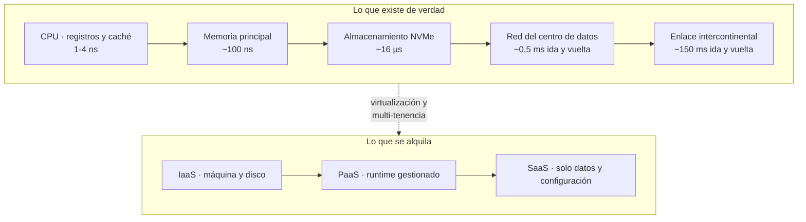

# 001 — Computación digital y modelo mental de la nube

> **Inicio del programa** · [Índice de la parte](../README.md) · [002 · Terminal, sistema de archivos, procesos y variables de entorno →](../../part-00-foundations-computing-networking-linux/002-terminal-sistema-de-archivos-procesos-y-variables-de-entorno/README.md)

**Parte:** 00 — Fundamentos de computación, redes y Linux<br>
**Nivel:** inicial · **Horas estimadas:** 4<br>
**Laboratorio:** `foundation` · **Estado:** `EXECUTABLE_CORE`

## 🎯 Propósito

Construir el modelo mental que sostiene todo el programa: qué ejecuta realmente una máquina, por qué la latencia y no la velocidad del procesador domina el diseño de un sistema distribuido, y qué cambia exactamente cuando ese cómputo se alquila en lugar de comprarse. Sin este modelo, «la nube» se aprende como un catálogo de nombres comerciales que caduca cada dieciocho meses.

## 📚 Resultados de aprendizaje

Al finalizar podrás:

1. **Situar** una operación en la jerarquía de memoria y estimar su coste en órdenes de magnitud, de 1 ns a 150 ms.
2. **Aplicar** las cinco características esenciales de NIST SP 800-145 para decidir si un servicio es realmente cloud o solo hosting renombrado.
3. **Distinguir** IaaS, PaaS y SaaS como fronteras de responsabilidad operativa, no como niveles de comodidad.
4. **Calcular** un presupuesto de latencia extremo a extremo y detectar qué componente lo consume.
5. **Explicar** por qué la elasticidad cambia la unidad económica de la infraestructura: de activo amortizado a gasto por consumo.

## 🧩 Conceptos centrales

| Concepto | Comprensión verificable |
|---|---|
| `latencia` | Tiempo entre emitir una petición y recibir la primera respuesta. Está acotada por la velocidad de la luz en fibra (~200.000 km/s), así que ninguna optimización de software reduce el mínimo físico entre dos ciudades. |
| `ancho de banda` | Volumen transferido por unidad de tiempo. Se compra; la latencia no. Añadir ancho de banda no acelera una petición pequeña, solo permite más peticiones simultáneas. |
| `elasticidad` | Capacidad de aprovisionar y liberar recursos en minutos siguiendo la demanda. Es lo que convierte capacidad ociosa en coste evitado; sin ella, la nube es un centro de datos con factura mensual. |
| `multi-tenencia` | Varios clientes compartiendo el mismo hardware con aislamiento lógico. Explica a la vez el precio (se amortiza entre muchos) y la clase de riesgo (vecino ruidoso, escapes del hipervisor). |
| `modelo de servicio` | Dónde se traza la línea entre lo que administra el proveedor y lo que sigue siendo tuyo. IaaS te deja el sistema operativo; PaaS, el runtime; SaaS, solo los datos y la configuración. |

## 🧠 Modelo mental

Antes de alquilar infraestructura remota, aprende a observar una computadora local como un conjunto de procesos, redes, archivos, identidades y recursos medibles.

Aplicado a esta clase, separa siempre cuatro planos: **intención** (qué necesita el usuario),
**configuración** (qué declaramos), **estado observado** (qué existe de verdad) y
**evidencia** (cómo sabemos que cumple). Confundirlos produce diseños que se ven correctos
en un diagrama pero fallan al operar.

## 🗺️ Flujo de razonamiento



## 📖 Desarrollo

### 1. La jerarquía de memoria manda sobre el resto del diseño

Un procesador moderno ejecuta del orden de 10⁹ instrucciones por segundo y por núcleo, pero pasa la mayor parte del tiempo esperando datos. Los órdenes de magnitud que hay que tener memorizados, popularizados por Jeff Dean en *Latency Numbers Every Programmer Should Know*:

```text
referencia a caché L1                    ~1 ns
referencia a caché L2                    ~4 ns
referencia a memoria principal         ~100 ns   (100x L1)
lectura aleatoria en SSD NVMe           ~16 µs   (160x RAM)
ida y vuelta dentro del centro de datos ~0,5 ms  (31x SSD)
búsqueda en disco mecánico               ~2 ms
ida y vuelta California - Países Bajos  ~150 ms  (300x centro de datos)
```

Entre el primer y el último renglón hay un factor de **150 millones**. Esto tiene una consecuencia de diseño que se repetirá en las 288 clases: *mover el cómputo hacia los datos casi siempre gana a mover los datos hacia el cómputo*. Cuando en la parte 16 se estudien CDN y edge, y en la parte 12 la colocación de réplicas, la razón será siempre esta tabla.

### 2. La latencia tiene un suelo físico y el ancho de banda no

La luz viaja a 299.792 km/s en el vacío, pero en fibra óptica el índice de refracción la frena a unos **200.000 km/s**. Madrid–Nueva York son 5.760 km en línea recta:

```text
mínimo teórico ida     = 5.760 km / 200.000 km/s = 28,8 ms
mínimo teórico ida+vuelta                        = 57,6 ms
medido en la práctica                          ~ 85-100 ms
```

La diferencia entre 57,6 y ~90 ms son enrutamiento no geodésico, colas en routers y conmutación. Puedes optimizar esa parte; los 57,6 ms no. **Ninguna inversión hace que una petición Madrid–Nueva York baje de ~58 ms.** Por eso la respuesta a un problema de latencia rara vez es un servidor más rápido: es una réplica más cerca, una caché, o menos idas y vueltas.

El ancho de banda se comporta al revés: es una mercancía que se compra. Duplicar el caudal no acorta una petición de 2 KB, pero permite atender el doble de ellas.

### 3. Qué define a la nube según NIST, y qué no

La definición operativa la fija el **NIST SP 800-145** (Mell y Grance, 2011) con cinco características esenciales. Un servicio que no cumple las cinco es hosting, por mucho que se anuncie como cloud:

| Característica | Prueba concreta |
|---|---|
| Autoservicio bajo demanda | ¿Puedes aprovisionar sin abrir un ticket ni hablar con nadie? |
| Acceso amplio por red | ¿Se consume por protocolos estándar desde cualquier cliente? |
| Agrupación de recursos | ¿El proveedor reasigna capacidad entre clientes de forma opaca? |
| Elasticidad rápida | ¿Escala y libera en minutos, no en semanas? |
| Servicio medido | ¿Se factura por consumo observable y auditable? |

La quinta es la que más cuesta interiorizar y la que más aparece en la factura: si el recurso se mide, **cada decisión de arquitectura es también una decisión de coste**. Un bucle mal escrito en un centro de datos propio es capacidad desperdiciada; el mismo bucle en cloud es una línea en la factura del mes siguiente.

### 4. Los modelos de servicio son fronteras de responsabilidad

IaaS, PaaS y SaaS no son «niveles de facilidad». Son **dónde se corta la responsabilidad operativa**, y esa línea determina a quién despiertan de madrugada:

| Capa | On-premise | IaaS | PaaS | SaaS |
|---|---|---|---|---|
| Datos y acceso | tú | tú | tú | tú |
| Aplicación | tú | tú | tú | proveedor |
| Runtime y middleware | tú | tú | proveedor | proveedor |
| Sistema operativo | tú | tú | proveedor | proveedor |
| Virtualización, servidores, red física | tú | proveedor | proveedor | proveedor |

Observa la primera fila: **los datos y el control de acceso nunca cambian de dueño**. Ese es el núcleo del modelo de responsabilidad compartida que se estudia en la clase 010, y el origen de la mayoría de incidentes públicos atribuidos a «fallos del proveedor» que en realidad fueron configuraciones del cliente.

### 5. Elasticidad: el cambio económico, no el técnico

La virtualización existe desde los años sesenta (CP-40 de IBM, 1967). Lo que la nube añadió no fue la técnica sino el **modelo económico**: pasar de CAPEX amortizado a OPEX medido.

Supón un servicio con pico de 100 servidores durante 3 horas al día y 20 el resto:

```text
Compra:  100 servidores × 24 h × 30 días = 72.000 servidor-hora contratadas
Uso real: (100 × 3 + 20 × 21) × 30       = 21.600 servidor-hora útiles
utilización = 21.600 / 72.000 = 30 %
```

En compra pagas el 100 % y usas el 30 %. Con elasticidad pagas cerca del 30 %, a un precio unitario mayor. El punto de equilibrio depende de esa relación, no de la moda: **si tu carga es plana y predecible, comprar suele salir más barato**. Multi-cloud y elasticidad se justifican por requisitos medibles, nunca por defecto.

## 🔬 Ejemplo trabajado

**CloudShop necesita responder una página de producto en menos de 300 ms al percentil 95.** El equipo desglosa el presupuesto de latencia para un usuario en Santiago de Chile y un despliegue en la región `us-east-1` (Virginia), a unos 7.400 km:

```text
resolución DNS (con caché fría)               40 ms
handshake TLS 1.3 (1 RTT sobre ~120 ms)      120 ms
petición HTTP ida y vuelta                   120 ms
consulta a base de datos en la misma región    8 ms
renderizado en servidor                       25 ms
---------------------------------------------------
total                                        313 ms   ✗ incumple el SLO
```

El componente dominante no es la aplicación —33 ms entre consulta y render— sino los **240 ms de red**. Optimizar el código no salva el SLO: aunque el render bajara a 0 ms, quedarían 288 ms.

Dos intervenciones sobre la red:

```text
CDN en Santiago para el HTML (RTT 10 ms)
  DNS cacheado                    2 ms
  TLS al borde (1 RTT sobre 10)  10 ms
  HTTP al borde                  10 ms
  origen solo para datos (1 RTT)120 ms
  consulta + render               33 ms
  ----------------------------------
  total                         175 ms   ✓ cumple
```

**La decisión no fue «usar un CDN» sino reconocer que 240 de los 313 ms eran físicos y solo se atacan acercando el punto de terminación.** El coste añadido del borde se justifica contra los 138 ms recuperados; si el SLO hubiera sido 500 ms, el gasto no tendría defensa.

## 🧪 Laboratorio guiado

Ejecuta desde la raíz:

```bash
python classes/part-00-foundations-computing-networking-linux/001-computacion-digital-y-modelo-mental-de-la-nube/lab.py
```

El laboratorio selecciona el motor de práctica **`foundation`** y produce
`lab_result.json`. El escenario, sus comprobaciones y el artefacto esperado corresponden a
esta clase; no requiere credenciales y deja explícito qué debe revalidarse en un sandbox real.

1. Lee `exercise.steps` y formula una predicción antes de ejecutar.
2. Ejecuta la práctica y verifica todos los elementos de `checks`.
3. Provoca el caso de `negative_test` y explica la señal observada.
4. Materializa `mapa-de-componentes` en `evidence/` usando la plantilla indicada.
5. Para proveedor real, sigue `sandbox.requires`, registra costo y ejecuta `destroy`.

### Evidencia esperada

El artefacto principal es un mapa con fronteras, entradas, salidas y supuestos. Además, la entrega debe incluir el comando ejecutado,
la salida estructurada y una conclusión que no exceda lo observado.

## 🏆 Reto verificable

Construye **`mapa-de-componentes`** para el caso CloudShop. Incluye una alternativa descartada,
un supuesto que pueda falsarse, una prueba de fallo y una decisión de rollback.

## ✅ Criterio de aceptación

- [ ] `lab.py` termina con código 0 y genera JSON válido.
- [ ] La entrega conecta al menos tres requisitos con mecanismos verificables.
- [ ] Existe una prueba positiva y una prueba negativa con evidencia.
- [ ] Seguridad, costo y operación aparecen como decisiones, no como anexos.
- [ ] Se declara una limitación y una condición que obligaría a revisar el diseño.
- [ ] Otra persona puede repetir el recorrido sin conocimiento tácito.

## ⚠️ Errores frecuentes

| Síntoma | Causa probable | Corrección |
|---|---|---|
| El sistema es lento y se responde comprando instancias más grandes | Se confundió latencia con capacidad de cómputo | Desglosa el presupuesto de latencia por componente antes de escalar; si domina la red, más CPU no cambia nada. |
| «Migramos a la nube» pero la factura supera al centro de datos anterior | Se replicó una carga plana sin usar elasticidad | Calcula la utilización real; si es estable y alta, la nube solo compensa por otros motivos (alcance, servicios gestionados, continuidad). |
| Se asume que el proveedor protege los datos | Se leyó el modelo de servicio como nivel de comodidad y no como frontera de responsabilidad | Sitúa cada capa en la tabla de responsabilidad; datos y acceso siguen siendo tuyos en IaaS, PaaS y SaaS. |
| Una prueba local va rápida y en producción no | En local todo cabe en RAM y la red es de 0 ms | Mide con las latencias reales entre zonas y regiones; la jerarquía de memoria del entorno de pruebas no es la de producción. |
| Se llama cloud a un servidor alquilado por meses | No se aplicaron las cinco características de NIST | Comprueba autoservicio, elasticidad y medición; si faltan, las decisiones de coste y escala no aplicarán. |

## 🛡️ Seguridad, ética y costo

Trabaja con cuentas propias o sandboxes autorizados. No publiques secretos, identificadores
reales ni datos personales. Antes de crear recursos pagos define presupuesto, etiquetas y
comando de destrucción; después verifica que no queden recursos huérfanos. Los ejemplos
locales enseñan contratos, pero no certifican cumplimiento ni disponibilidad de producción.

## ❓ Preguntas de comprobación

1. ¿Cuántos órdenes de magnitud separan una referencia a caché L1 de una ida y vuelta intercontinental, y qué decisión de arquitectura se deriva de esa diferencia?
2. Un servicio tarda 400 ms y el equipo propone duplicar la CPU. ¿Qué medición pedirías antes de aprobar el gasto?
3. ¿Cuál de las cinco características de NIST es la que convierte cada decisión técnica en una decisión de coste, y por qué?
4. En un despliegue PaaS, ¿qué sigue siendo responsabilidad tuya y qué pasa a ser del proveedor?
5. Una carga usa el 85 % de su capacidad las 24 horas. ¿Qué argumento económico queda a favor de la nube, si es que queda alguno?

## 🔗 Referencias

- Mell, P. y Grance, T. (2011). *The NIST Definition of Cloud Computing*, SP 800-145. National Institute of Standards and Technology. <https://doi.org/10.6028/NIST.SP.800-145>
- Dean, J. (2009). *Latency Numbers Every Programmer Should Know* — cifras de referencia de la jerarquía de memoria. <https://static.googleusercontent.com/media/research.google.com/en//people/jeff/stanford-295-talk.pdf>
- Kurose, J. y Ross, K. (2021). *Computer Networking: A Top-Down Approach*, 8.ª ed., cap. 1.4 — retardo, pérdida y throughput.
- Barroso, L., Hölzle, U. y Ranganathan, P. (2018). *The Datacenter as a Computer*, 3.ª ed. — economía y utilización del centro de datos. <https://doi.org/10.2200/S00874ED3V01Y201809CAC046>
- Gray, J. (2008). *Distributed Computing Economics*. ACM Queue 6(3) — por qué conviene mover el cómputo hacia los datos. <https://doi.org/10.1145/1394127.1394131>
- Documentación oficial vigente del servicio implementado; registra URL y fecha de consulta.

---

> [Evaluación](assessment.md) · [Contrato de clase](lesson.yaml) · [Índice de la parte](../README.md)

**📥 Descargar:** [Parte 00 en PDF](../../../site/downloads/partes/manual-parte-00-foundations-computing-networking-linux.pdf) · [Manual integral](../../../site/downloads/multi-cloud-engineering-manual-v2.0.pdf)

| Anterior | Índice | Siguiente |
|---|---|---|
| **Inicio del programa** | [Parte 00](../README.md) · [Programa](../../README.md) | [002 · Terminal, sistema de archivos, procesos y variables de entorno →](../../part-00-foundations-computing-networking-linux/002-terminal-sistema-de-archivos-procesos-y-variables-de-entorno/README.md) |
