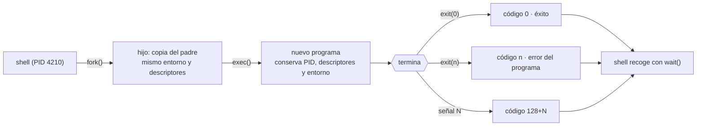

# 002 — Terminal, sistema de archivos, procesos y variables de entorno

> [← 001 · Computación digital y modelo mental de la nube](../../part-00-foundations-computing-networking-linux/001-computacion-digital-y-modelo-mental-de-la-nube/README.md) · [Índice de la parte](../README.md) · [003 · Git, GitHub y trabajo reproducible →](../../part-00-foundations-computing-networking-linux/003-git-github-y-trabajo-reproducible/README.md)

**Parte:** 00 — Fundamentos de computación, redes y Linux<br>
**Nivel:** inicial · **Horas estimadas:** 4<br>
**Laboratorio:** `shell` · **Estado:** `EXECUTABLE_CORE`

## 🎯 Propósito

Dominar la terminal como interfaz primaria de operación cloud: qué es realmente un proceso, cómo el kernel le entrega su entorno, y por qué los descriptores de fichero y las variables de entorno explican la mitad de los incidentes de despliegue. Toda la automatización posterior —contenedores, CI/CD, runbooks— es este modelo repetido a escala.

## 📚 Resultados de aprendizaje

Al finalizar podrás:

1. **Describir** el ciclo `fork` → `exec` → `wait` y qué hereda un proceso hijo de su padre.
2. **Predecir** qué variables de entorno ve un proceso según cómo se lanzó, y por qué un servicio systemd no ve tu `.bashrc`.
3. **Redirigir** stdout y stderr por separado y explicar por qué `2>&1 >f` no equivale a `>f 2>&1`.
4. **Interpretar** un código de salida y una señal de terminación para diagnosticar sin adivinar.
5. **Componer** una tubería que resuelva un problema real de operación sin scripts intermedios.

## 🧩 Conceptos centrales

| Concepto | Comprensión verificable |
|---|---|
| `proceso` | Instancia en ejecución de un programa, con su propio espacio de direcciones, tabla de descriptores y entorno. El kernel lo identifica por PID y lo relaciona con su padre por PPID. |
| `descriptor de fichero` | Entero que indexa la tabla de ficheros abiertos del proceso. Por convención 0 es stdin, 1 stdout y 2 stderr; el resto se asignan por orden. Redirigir es duplicar entradas de esa tabla, no mover datos. |
| `variable de entorno` | Par clave-valor copiado del padre al hijo en el momento del `exec`. La copia es unidireccional: un hijo no puede modificar el entorno del padre, lo que explica por qué `cd` debe ser un builtin del shell. |
| `código de salida` | Entero de 0 a 255 que devuelve un proceso al terminar. 0 significa éxito; 1-125 son errores del programa; 126 y 127 indican no ejecutable y no encontrado; 128+N significa terminado por la señal N. |
| `señal` | Notificación asíncrona del kernel a un proceso. SIGTERM (15) pide terminar y puede atraparse; SIGKILL (9) no es atrapable. Esa diferencia es la base del apagado ordenado en contenedores. |

## 🧠 Modelo mental

Antes de alquilar infraestructura remota, aprende a observar una computadora local como un conjunto de procesos, redes, archivos, identidades y recursos medibles.

Aplicado a esta clase, separa siempre cuatro planos: **intención** (qué necesita el usuario),
**configuración** (qué declaramos), **estado observado** (qué existe de verdad) y
**evidencia** (cómo sabemos que cumple). Confundirlos produce diseños que se ven correctos
en un diagrama pero fallan al operar.

## 🗺️ Flujo de razonamiento



## 📖 Desarrollo

### 1. Un proceso nace por copia y se transforma por reemplazo

En UNIX no existe «lanzar un programa» como operación única. Son dos llamadas:

1. **`fork()`** duplica el proceso actual. El hijo recibe una copia del espacio de direcciones, la tabla de descriptores y el entorno. Devuelve 0 en el hijo y el PID del hijo en el padre; ese es el único modo que tiene cada uno de saber quién es.
2. **`exec()`** reemplaza la imagen del proceso por otro programa **conservando** el PID, los descriptores abiertos y el entorno.

```bash
$ echo $$          # PID del shell actual
4210
$ bash -c 'echo $$; echo $PPID'
4877               # el hijo tiene PID nuevo
4210               # y recuerda a su padre
```

La consecuencia práctica aparece en cuanto se automatiza: **un proceso solo puede heredar hacia abajo**. Por eso `cd` no puede ser un binario —cambiaría el directorio de un hijo que muere inmediatamente— y por eso exportar una variable en un script no la deja disponible en la terminal que lo invocó.

### 2. El entorno se copia en el exec, no se consulta en vivo

El entorno es un vector de cadenas `CLAVE=valor` que se pasa al `exec`. Se copia **una vez**, en ese instante. Un proceso que lleva tres días corriendo tiene el entorno del momento en que arrancó, aunque el fichero de configuración haya cambiado.

```bash
$ VAR=solo_este_comando env | grep VAR    # prefijo: solo para esa invocación
VAR=solo_este_comando
$ VAR=local; env | grep VAR               # sin export: no llega al hijo
$ export VAR=heredable; env | grep VAR    # con export: sí llega
VAR=heredable
```

Esto explica el incidente más repetido en despliegues: **un servicio gestionado por systemd no lee `~/.bashrc` ni `~/.profile`**. Esos ficheros los interpreta el shell al iniciar sesión de forma interactiva, y systemd no arranca un shell de login. El comando funciona a mano y falla como servicio, con la misma imagen y el mismo binario. La variable hay que declararla en la unidad (`Environment=` o `EnvironmentFile=`), y en contenedores en el `ENV` del Dockerfile o el manifiesto.

### 3. Redirección: se duplican descriptores, y el orden importa

`>` no «envía» la salida a ningún sitio: hace que el descriptor 1 apunte al mismo fichero abierto que otro. Como es una asignación secuencial, el orden cambia el resultado:

```bash
# stderr se copia al destino ACTUAL de stdout (la terminal) y luego stdout va al fichero
$ comando 2>&1 > salida.log      # errores a la terminal, salida al fichero

# stdout va al fichero y DESPUÉS stderr se copia a ese mismo destino
$ comando > salida.log 2>&1      # ambos al fichero
```

Es la causa clásica de un log que «pierde» los errores. En Bash moderno, `&> fichero` hace lo correcto sin ambigüedad.

La separación stdout/stderr no es cosmética: es un **contrato**. stdout lleva el resultado destinado a la siguiente etapa de la tubería; stderr lleva diagnóstico destinado al operador. Un programa que escribe avisos en stdout rompe cualquier tubería que lo consuma.

### 4. Códigos de salida y señales: el lenguaje del diagnóstico

El código de salida es el único canal estructurado que un proceso tiene para decir qué pasó. Sus rangos están convenidos:

| Código | Significado | Aparece cuando |
|---|---|---|
| 0 | Éxito | Todo bien |
| 1-125 | Error del programa | Fallo de lógica o validación |
| 126 | Encontrado pero no ejecutable | Falta el bit de ejecución |
| 127 | Orden no encontrada | `PATH` incorrecto — típico en contenedores |
| 128+N | Terminado por la señal N | 137 = 128+9 (SIGKILL), 143 = 128+15 (SIGTERM) |

**El 137 merece memorizarse**: en Kubernetes casi siempre significa que el contenedor excedió su límite de memoria y el OOM killer lo mató. En la parte 06 aparecerá con ese nombre; aquí ya sabes de dónde sale el número.

La diferencia entre SIGTERM y SIGKILL define el apagado ordenado: el orquestador envía SIGTERM, espera un plazo de gracia (30 s por defecto en Kubernetes) y solo entonces envía SIGKILL. Un proceso que ignora SIGTERM pierde las conexiones en vuelo.

### 5. Tuberías: procesos concurrentes, no secuenciales

`a | b` no ejecuta `a` y después `b`. Arranca **ambos a la vez** y conecta el descriptor 1 de `a` con el 0 de `b` mediante un búfer del kernel de 64 KB. Cuando el búfer se llena, el escritor se bloquea; cuando se vacía, el lector se bloquea. Es control de flujo gratuito, y permite procesar ficheros mayores que la memoria disponible.

```bash
# Los cinco procesos que más memoria residente consumen
$ ps -eo pid,rss,comm --sort=-rss | head -6

# Las 10 IP con más peticiones en un log de acceso
$ awk '{print $1}' access.log | sort | uniq -c | sort -rn | head -10
```

El código de salida de una tubería es el del **último** comando, lo que oculta fallos intermedios. En scripts de operación esto es una trampa seria:

```bash
$ false | true; echo $?
0                              # el fallo desaparece
$ set -o pipefail
$ false | true; echo $?
1                              # ahora se propaga
```

`set -euo pipefail` al principio de cada script de despliegue evita que un fallo silencioso se declare éxito.

## 🔬 Ejemplo trabajado

**Un despliegue de CloudShop funciona a mano y falla como servicio.** El binario es el mismo y la imagen también. El operador ejecuta el diagnóstico en orden:

```bash
$ ./cloudshop-api
escuchando en :8080                      # a mano funciona

$ sudo systemctl start cloudshop
$ systemctl show cloudshop -p ExecMainStatus
ExecMainStatus=127
```

**127 = orden no encontrada.** No es un fallo de la aplicación: es que algo del `PATH` no está. Se compara el entorno de ambos contextos:

```bash
$ echo $PATH
/home/ops/.local/bin:/usr/local/bin:/usr/bin:/bin

$ sudo systemctl show cloudshop -p Environment
Environment=
$ sudo systemd-run --quiet --pipe /usr/bin/env | grep ^PATH
PATH=/usr/local/sbin:/usr/local/bin:/usr/sbin:/usr/bin:/sbin:/bin
```

La diferencia es `/home/ops/.local/bin`, que el shell interactivo añade desde `~/.profile` y systemd no. El binario auxiliar que invoca el servicio vive ahí.

Se corrige declarando la dependencia en la unidad, no exportando en un perfil:

```ini
[Service]
Environment="PATH=/usr/local/bin:/usr/bin:/bin"
ExecStart=/opt/cloudshop/bin/cloudshop-api
```

```bash
$ sudo systemctl restart cloudshop; systemctl show cloudshop -p ExecMainStatus
ExecMainStatus=0
```

**La lección no es el arreglo sino el método**: el código 127 acotó el problema a resolución de ruta antes de leer una sola línea de la aplicación. Un diagnóstico sin ese dato habría empezado por los logs de la aplicación, donde no había nada que ver.

## 🧪 Laboratorio guiado

Ejecuta desde la raíz:

```bash
python classes/part-00-foundations-computing-networking-linux/002-terminal-sistema-de-archivos-procesos-y-variables-de-entorno/lab.py
```

El laboratorio selecciona el motor de práctica **`shell`** y produce
`lab_result.json`. El escenario, sus comprobaciones y el artefacto esperado corresponden a
esta clase; no requiere credenciales y deja explícito qué debe revalidarse en un sandbox real.

1. Lee `exercise.steps` y formula una predicción antes de ejecutar.
2. Ejecuta la práctica y verifica todos los elementos de `checks`.
3. Provoca el caso de `negative_test` y explica la señal observada.
4. Materializa `bitacora-de-comandos` en `evidence/` usando la plantilla indicada.
5. Para proveedor real, sigue `sandbox.requires`, registra costo y ejecuta `destroy`.

### Evidencia esperada

El artefacto principal es una bitácora reproducible de comandos y resultados. Además, la entrega debe incluir el comando ejecutado,
la salida estructurada y una conclusión que no exceda lo observado.

## 🏆 Reto verificable

Construye **`bitacora-de-comandos`** para el caso CloudShop. Incluye una alternativa descartada,
un supuesto que pueda falsarse, una prueba de fallo y una decisión de rollback.

## ✅ Criterio de aceptación

- [ ] `lab.py` termina con código 0 y genera JSON válido.
- [ ] La entrega conecta al menos tres requisitos con mecanismos verificables.
- [ ] Existe una prueba positiva y una prueba negativa con evidencia.
- [ ] Seguridad, costo y operación aparecen como decisiones, no como anexos.
- [ ] Se declara una limitación y una condición que obligaría a revisar el diseño.
- [ ] Otra persona puede repetir el recorrido sin conocimiento tácito.

## ⚠️ Errores frecuentes

| Síntoma | Causa probable | Corrección |
|---|---|---|
| El comando funciona en la terminal y falla como servicio o en el contenedor | El entorno interactivo carga perfiles que systemd y Docker no leen | Declara las variables en la unidad (`Environment=`) o en el `ENV` de la imagen; nunca dependas de `.bashrc`. |
| El fichero de log no contiene los errores | Se escribió `2>&1 > f`, que copia stderr al destino anterior de stdout | Usa `> f 2>&1` o `&> f`; el orden de la redirección es una asignación secuencial. |
| Un script de despliegue termina en éxito pese a que un paso falló | El código de salida de una tubería es solo el del último comando | Empieza los scripts con `set -euo pipefail`. |
| El contenedor muere con código 137 y no hay error en la aplicación | 128+9: fue SIGKILL, casi siempre el OOM killer por exceder el límite de memoria | Revisa el límite de memoria y el consumo real; el problema es de recursos, no de código. |
| El servicio pierde peticiones en vuelo en cada despliegue | El proceso no atrapa SIGTERM y se le aplica SIGKILL al agotar el plazo de gracia | Atrapa SIGTERM, deja de aceptar conexiones nuevas y drena las abiertas antes de salir. |

## 🛡️ Seguridad, ética y costo

Trabaja con cuentas propias o sandboxes autorizados. No publiques secretos, identificadores
reales ni datos personales. Antes de crear recursos pagos define presupuesto, etiquetas y
comando de destrucción; después verifica que no queden recursos huérfanos. Los ejemplos
locales enseñan contratos, pero no certifican cumplimiento ni disponibilidad de producción.

## ❓ Preguntas de comprobación

1. ¿Por qué `cd` tiene que ser un builtin del shell y no puede ser un binario en `/usr/bin`?
2. Un proceso lleva tres días ejecutándose y alguien cambia una variable en `/etc/environment`. ¿La ve el proceso? ¿Por qué?
3. ¿Qué diferencia práctica hay entre `comando 2>&1 > f` y `comando > f 2>&1`?
4. Un contenedor termina con código 143 y otro con 137. ¿Cuál se apagó ordenadamente y cuál no?
5. ¿Qué añade `set -o pipefail` que `set -e` por sí solo no cubre?

## 🔗 Referencias

- The Open Group (2018). *POSIX.1-2017*, System Interfaces: `fork`, `execve`, `wait`. <https://pubs.opengroup.org/onlinepubs/9699919799/functions/fork.html>
- Kerrisk, M. *signal(7)* — Linux manual pages: catálogo de señales y semántica de SIGTERM y SIGKILL. <https://man7.org/linux/man-pages/man7/signal.7.html>
- Kerrisk, M. (2010). *The Linux Programming Interface*, caps. 24-27 — creación de procesos y ejecución de programas.
- systemd (2024). *systemd.exec(5)* — cómo se construye el entorno de un servicio. <https://www.freedesktop.org/software/systemd/man/systemd.exec.html>
- Ward, B. (2021). *How Linux Works*, 3.ª ed., caps. 1-2 — procesos, dispositivos y arranque.
- Documentación oficial vigente del servicio implementado; registra URL y fecha de consulta.

---

> [Evaluación](assessment.md) · [Contrato de clase](lesson.yaml) · [Índice de la parte](../README.md)

**📥 Descargar:** [Parte 00 en PDF](../../../site/downloads/partes/manual-parte-00-foundations-computing-networking-linux.pdf) · [Manual integral](../../../site/downloads/multi-cloud-engineering-manual-v2.0.pdf)

| Anterior | Índice | Siguiente |
|---|---|---|
| [← 001 · Computación digital y modelo mental de la nube](../../part-00-foundations-computing-networking-linux/001-computacion-digital-y-modelo-mental-de-la-nube/README.md) | [Parte 00](../README.md) · [Programa](../../README.md) | [003 · Git, GitHub y trabajo reproducible →](../../part-00-foundations-computing-networking-linux/003-git-github-y-trabajo-reproducible/README.md) |
