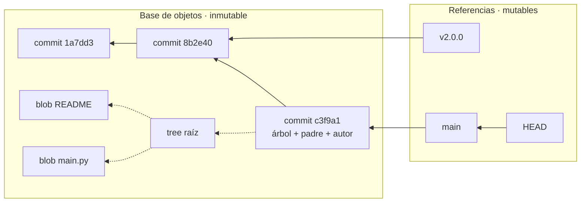

# 003 — Git, GitHub y trabajo reproducible

> [← 002 · Terminal, sistema de archivos, procesos y variables de entorno](../../part-00-foundations-computing-networking-linux/002-terminal-sistema-de-archivos-procesos-y-variables-de-entorno/README.md) · [Índice de la parte](../README.md) · [004 · Python, JSON y automatización mínima →](../../part-00-foundations-computing-networking-linux/004-python-json-y-automatizacion-minima/README.md)

**Parte:** 00 — Fundamentos de computación, redes y Linux<br>
**Nivel:** inicial · **Horas estimadas:** 4<br>
**Laboratorio:** `git` · **Estado:** `EXECUTABLE_CORE`

## 🎯 Propósito

Entender Git como un grafo dirigido acíclico de instantáneas inmutables direccionadas por contenido, no como una lista de parches. Esa diferencia explica por qué `rebase`, `revert` y `reset` hacen lo que hacen, y es la base de todo lo que viene después: GitOps, entrega continua, trazabilidad de auditoría y reproducibilidad de un despliegue.

## 📚 Resultados de aprendizaje

Al finalizar podrás:

1. **Explicar** cómo el hash SHA-1/SHA-256 de un commit se deriva de árbol, padres, autor y mensaje, y qué implica para la integridad del historial.
2. **Distinguir** `reset --soft`, `--mixed` y `--hard` por lo que hacen sobre HEAD, índice y árbol de trabajo.
3. **Elegir** entre `merge`, `rebase` y `revert` según si la rama es compartida y si el historial debe ser auditable.
4. **Recuperar** trabajo aparentemente perdido usando `reflog`, entendiendo por qué existe la ventana de recuperación.
5. **Diseñar** un flujo de ramas trazable que permita responder «qué código exacto había en producción el martes a las 14:00».

## 🧩 Conceptos centrales

| Concepto | Comprensión verificable |
|---|---|
| `objeto` | Unidad inmutable de almacenamiento en Git, nombrada por el hash de su contenido. Hay cuatro tipos: blob (contenido de fichero), tree (directorio), commit (instantánea con metadatos) y tag anotado. |
| `commit` | Objeto que apunta a un árbol completo, a cero o más padres, y lleva autor, fecha y mensaje. No guarda un diff: guarda el estado entero. Los diffs se calculan al vuelo comparando árboles. |
| `índice` | Área intermedia entre el árbol de trabajo y el repositorio, también llamada staging. Es un fichero binario que lista qué versión de cada ruta entrará en el próximo commit. |
| `referencia` | Puntero mutable a un commit. Las ramas y HEAD son referencias; por eso crear una rama cuesta 41 bytes y es una operación instantánea sea cual sea el tamaño del repositorio. |
| `reflog` | Registro local de todos los valores por los que ha pasado cada referencia. Permite recuperar commits que ya no alcanza ninguna rama, durante 90 días por defecto. |

## 🧠 Modelo mental

Antes de alquilar infraestructura remota, aprende a observar una computadora local como un conjunto de procesos, redes, archivos, identidades y recursos medibles.

Aplicado a esta clase, separa siempre cuatro planos: **intención** (qué necesita el usuario),
**configuración** (qué declaramos), **estado observado** (qué existe de verdad) y
**evidencia** (cómo sabemos que cumple). Confundirlos produce diseños que se ven correctos
en un diagrama pero fallan al operar.

## 🗺️ Flujo de razonamiento



## 📖 Desarrollo

### 1. Git guarda instantáneas, no diferencias

La intuición equivocada más extendida es que un commit almacena «lo que cambió». Almacena **el árbol completo del proyecto** en ese instante. Los ficheros que no cambiaron no se duplican: el árbol nuevo reutiliza los mismos objetos blob, porque están nombrados por el hash de su contenido.

```bash
$ git cat-file -p HEAD
tree a4f2c81e9b3d5a7c2f8e1b6d4a9c3e7f2b8d5a1c
parent 8b2e40d7c1a5f9e3b6d2a8c4f7e1b9d3a5c8e2f4
author Vladimir Acuña <...> 1785546717 -0300
committer Vladimir Acuña <...> 1785546717 -0300

Optimiza el README principal
```

El hash del commit se calcula sobre exactamente ese texto. Cambiar una coma del mensaje, la fecha o el padre produce un hash distinto. De ahí se sigue la propiedad que sostiene toda auditoría: **no se puede alterar historia pasada sin cambiar los identificadores de todo lo que vino después**. Si alguien reescribe un commit de hace un mes, los 200 commits posteriores cambian de hash y cualquier clon lo detecta.

### 2. Tres zonas y el comando que las mueve

Todo el modelo operativo de Git cabe en tres zonas y una tabla:

```text
árbol de trabajo  →  índice (staging)  →  repositorio (objetos)
        git add ──────┘         git commit ──────┘
```

`git reset` es un único comando que actúa sobre las tres según el modificador, y confundirlos es la causa habitual de trabajo perdido:

| Comando | HEAD | Índice | Árbol de trabajo | Uso típico |
|---|---|---|---|---|
| `reset --soft <c>` | mueve | intacto | intacto | Rehacer el mensaje o agrupar commits |
| `reset --mixed <c>` | mueve | reinicia | intacto | Deshacer un `add` (por defecto) |
| `reset --hard <c>` | mueve | reinicia | **descarta** | Descartar todo; es el único destructivo |

Solo `--hard` toca el árbol de trabajo. Los cambios no confirmados que destruye **no están en ningún objeto**, así que el reflog no los recupera: nunca llegaron a existir para Git.

### 3. Merge, rebase y revert: tres respuestas a preguntas distintas

No son alternativas de estilo. Responden a preguntas diferentes:

- **`merge`** crea un commit con dos padres. Preserva la historia tal como ocurrió y **no cambia hashes existentes**. Es la única opción segura sobre una rama que otros ya tienen.
- **`rebase`** reescribe: toma tus commits y los vuelve a aplicar sobre otra base, creando commits nuevos con hashes nuevos. Produce historia lineal y legible, pero **si la rama es compartida, todo el que la tenga verá divergencia**.
- **`revert`** crea un commit *nuevo* que deshace los efectos de otro. No borra nada. Es lo único aceptable para deshacer algo que ya está en producción o en una rama protegida.

La regla operativa, conocida como *golden rule of rebasing*: **no reescribas historia que otros puedan tener**. En la práctica: rebase libremente en tu rama local antes del primer push; después, merge o revert.

Para un repositorio con requisitos de auditoría —los de la parte 11— `revert` es obligatorio: deja constancia de que hubo un error y de cuándo se corrigió. Un `reset --hard` seguido de `push --force` borra esa evidencia.

### 4. El reflog: por qué casi nada se pierde de verdad

Cuando una rama deja de apuntar a un commit, ese commit queda *huérfano*: sigue en la base de objetos pero no lo alcanza ninguna referencia. El reflog registra cada movimiento de cada referencia, así que aún se puede llegar a él.

```bash
$ git reset --hard HEAD~3        # "perdí" tres commits
$ git reflog
c3f9a1 HEAD@{0}: reset: moving to HEAD~3
7d2b8e HEAD@{1}: commit: añade validación de contratos
$ git reset --hard HEAD@{1}      # recuperados
```

Los objetos huérfanos sobreviven hasta que `git gc` los recoge: **90 días** para los alcanzables desde el reflog y 30 para el resto, según `gc.reflogExpire`. Dos matices que importan en operación:

1. El reflog es **estrictamente local**. No se clona ni se envía. Un `push --force` que destruye commits en el servidor no deja reflog para quien clone después.
2. Solo registra lo que llegó a ser un commit. Cambios en el árbol de trabajo que nunca se confirmaron no aparecen.

### 5. Trazabilidad: del commit al artefacto desplegado

La pregunta que toda auditoría acaba haciendo es: *¿qué código exacto estaba corriendo cuando ocurrió el incidente?* Responderla exige una cadena sin huecos:

```text
commit (sha) → build (id) → artefacto (digest) → despliegue (revisión) → instante
```

Cada eslabón debe ser **inmutable y verificable**. Por eso en las partes 05 y 08 se insistirá en referenciar imágenes por digest (`sha256:...`) y no por etiqueta: una etiqueta como `:latest` o `:v2.0` es una referencia mutable —igual que una rama de Git— y puede apuntar a contenido distinto mañana.

El equivalente en Git es el **tag anotado**, que sí es un objeto con su propio hash, autor y mensaje, frente al tag ligero que es solo un puntero:

```bash
$ git tag -a v2.0.0 -m "Release 2.0.0"    # objeto, firmable y con metadatos
$ git tag v2.0.0                            # solo una referencia más
```

Para releases, el tag anotado y firmado (`-s`) es el que sostiene la afirmación «esto es lo que publicamos».

## 🔬 Ejemplo trabajado

**Un despliegue del martes rompió el checkout de CloudShop y hay que responder tres preguntas: qué se desplegó, quién lo aprobó y cómo se revierte sin perder la evidencia.**

Paso 1 — identificar el commit exacto que estaba en producción:

```bash
$ git log --format='%h %ad %an %s' --date=iso -3 v2.4.1
7d2b8e 2026-07-28 14:02:11 -0300  Ana Ruiz   Cambia el cálculo de impuestos
1a7dd3 2026-07-28 11:40:02 -0300  Luis Vega  Añade índice a pedidos
8b2e40 2026-07-27 17:15:44 -0300  Ana Ruiz   Actualiza dependencias
```

Paso 2 — confirmar que el artefacto desplegado corresponde a ese commit. La etiqueta no basta; se compara el digest:

```bash
$ git rev-parse v2.4.1
7d2b8e91c4a2f7d5b3e8a1c6f9d2b4e7a5c8f1d3
$ kubectl get deploy cloudshop -o jsonpath='{...image}'
registry/cloudshop@sha256:4f2a9c...
$ crane config registry/cloudshop@sha256:4f2a9c... | jq -r '.config.Labels."org.opencontainers.image.revision"'
7d2b8e91c4a2f7d5b3e8a1c6f9d2b4e7a5c8f1d3     # coincide
```

Paso 3 — aislar el cambio culpable con búsqueda binaria sobre el historial:

```bash
$ git bisect start v2.4.1 v2.4.0
$ git bisect run ./tests/checkout_smoke.sh
7d2b8e91 is the first bad commit
```

Con 3 commits bastan 2 pruebas; con 1.000 bastarían 10, porque `bisect` es logarítmico: ⌈log₂(1000)⌉ = 10.

Paso 4 — revertir **sin borrar**:

```bash
$ git revert 7d2b8e -m "Revierte el cálculo de impuestos: rompe el checkout"
[main 9e4c2a] Revert "Cambia el cálculo de impuestos"
```

El historial conserva ahora el error y su corrección. Un `reset --hard 1a7dd3 && push --force` habría dejado producción igual de sana **y la auditoría sin nada que leer**: no habría constancia de que el fallo existió, ni de cuánto tardó en detectarse.

## 🧪 Laboratorio guiado

Ejecuta desde la raíz:

```bash
python classes/part-00-foundations-computing-networking-linux/003-git-github-y-trabajo-reproducible/lab.py
```

El laboratorio selecciona el motor de práctica **`git`** y produce
`lab_result.json`. El escenario, sus comprobaciones y el artefacto esperado corresponden a
esta clase; no requiere credenciales y deja explícito qué debe revalidarse en un sandbox real.

1. Lee `exercise.steps` y formula una predicción antes de ejecutar.
2. Ejecuta la práctica y verifica todos los elementos de `checks`.
3. Provoca el caso de `negative_test` y explica la señal observada.
4. Materializa `repositorio-reproducible` en `evidence/` usando la plantilla indicada.
5. Para proveedor real, sigue `sandbox.requires`, registra costo y ejecuta `destroy`.

### Evidencia esperada

El artefacto principal es un historial pequeño, legible y verificable. Además, la entrega debe incluir el comando ejecutado,
la salida estructurada y una conclusión que no exceda lo observado.

## 🏆 Reto verificable

Construye **`repositorio-reproducible`** para el caso CloudShop. Incluye una alternativa descartada,
un supuesto que pueda falsarse, una prueba de fallo y una decisión de rollback.

## ✅ Criterio de aceptación

- [ ] `lab.py` termina con código 0 y genera JSON válido.
- [ ] La entrega conecta al menos tres requisitos con mecanismos verificables.
- [ ] Existe una prueba positiva y una prueba negativa con evidencia.
- [ ] Seguridad, costo y operación aparecen como decisiones, no como anexos.
- [ ] Se declara una limitación y una condición que obligaría a revisar el diseño.
- [ ] Otra persona puede repetir el recorrido sin conocimiento tácito.

## ⚠️ Errores frecuentes

| Síntoma | Causa probable | Corrección |
|---|---|---|
| Tras un `rebase` sobre una rama compartida, el equipo ve commits duplicados y conflictos repetidos | Se reescribieron hashes que otros ya tenían | Rebase solo antes del primer push; sobre ramas compartidas usa merge. |
| Se perdió trabajo con `reset --hard` y el reflog no lo recupera | Los cambios nunca se confirmaron, así que no existe objeto que recuperar | Confirma o usa `git stash` antes de cualquier operación destructiva. |
| Nadie puede decir qué código había en producción durante el incidente | El artefacto se referenció por etiqueta mutable en vez de por digest | Referencia imágenes por `sha256:` y graba el commit en una etiqueta OCI del artefacto. |
| El historial de la rama principal no permite auditar una corrección urgente | Se usó `reset --hard` y `push --force` en lugar de `revert` | Deshaz siempre con `revert` en ramas protegidas; deja el error visible junto a su corrección. |
| Un `git tag` no lleva autor ni fecha y no se puede firmar | Se creó un tag ligero, que es solo un puntero | Usa `git tag -a` (o `-s` para firmarlo) en cualquier release. |

## 🛡️ Seguridad, ética y costo

Trabaja con cuentas propias o sandboxes autorizados. No publiques secretos, identificadores
reales ni datos personales. Antes de crear recursos pagos define presupuesto, etiquetas y
comando de destrucción; después verifica que no queden recursos huérfanos. Los ejemplos
locales enseñan contratos, pero no certifican cumplimiento ni disponibilidad de producción.

## ❓ Preguntas de comprobación

1. Si un commit guarda el árbol completo, ¿por qué un repositorio con 10.000 commits no ocupa 10.000 veces el tamaño del proyecto?
2. ¿Cuál de los tres modos de `reset` puede destruir trabajo que el reflog no recuperará, y por qué precisamente ese?
3. Un compañero ya hizo pull de tu rama. ¿Qué te impide hacer `rebase` sobre ella y qué usarías en su lugar?
4. ¿Por qué desplegar `imagen:v2.0` no permite responder qué código corría el martes, y qué referencia lo permitiría?
5. Con 1.024 commits entre una versión buena y una mala, ¿cuántas pruebas necesita `git bisect` en el peor caso?

## 🔗 Referencias

- Chacon, S. y Straub, B. (2014). *Pro Git*, 2.ª ed., cap. 10 «Git Internals» — objetos, referencias y modelo de almacenamiento. <https://git-scm.com/book/en/v2/Git-Internals-Git-Objects>
- Git (2024). *git-reset(1)* — tabla oficial del efecto de cada modo sobre HEAD, índice y árbol de trabajo. <https://git-scm.com/docs/git-reset#_reset_pathspec>
- Git (2024). *git-bisect(1)* — búsqueda binaria automatizada sobre el historial. <https://git-scm.com/docs/git-bisect>
- Open Container Initiative (2024). *Image Specification* — anotaciones estándar, incluida `org.opencontainers.image.revision`. <https://github.com/opencontainers/image-spec/blob/main/annotations.md>
- Git (2024). *gitrevisions(7)* — sintaxis de `HEAD@{n}`, `~` y `^` para navegar el grafo. <https://git-scm.com/docs/gitrevisions>
- Documentación oficial vigente del servicio implementado; registra URL y fecha de consulta.

---

> [Evaluación](assessment.md) · [Contrato de clase](lesson.yaml) · [Índice de la parte](../README.md)

| Anterior | Índice | Siguiente |
|---|---|---|
| [← 002 · Terminal, sistema de archivos, procesos y variables de entorno](../../part-00-foundations-computing-networking-linux/002-terminal-sistema-de-archivos-procesos-y-variables-de-entorno/README.md) | [Parte 00](../README.md) · [Programa](../../README.md) | [004 · Python, JSON y automatización mínima →](../../part-00-foundations-computing-networking-linux/004-python-json-y-automatizacion-minima/README.md) |
