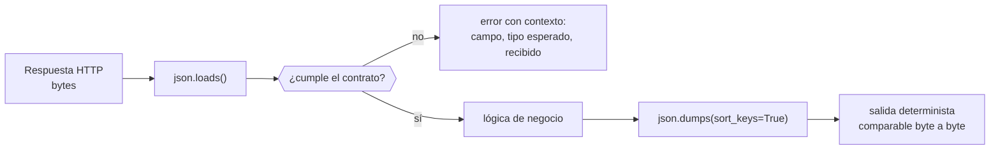

# 004 — Python, JSON y automatización mínima

> [← 003 · Git, GitHub y trabajo reproducible](../../part-00-foundations-computing-networking-linux/003-git-github-y-trabajo-reproducible/README.md) · [Índice de la parte](../README.md) · [005 · Redes por capas, TCP/IP, puertos y sockets →](../../part-00-foundations-computing-networking-linux/005-redes-por-capas-tcp-ip-puertos-y-sockets/README.md)

**Parte:** 00 — Fundamentos de computación, redes y Linux<br>
**Nivel:** inicial · **Horas estimadas:** 4<br>
**Laboratorio:** `automation` · **Estado:** `EXECUTABLE_CORE`

## 🎯 Propósito

Usar Python y JSON como el pegamento mínimo de la operación cloud: leer una respuesta de API, validar su forma antes de confiar en ella y producir salida estructurada que otro programa pueda consumir. Casi todos los `lab.py` del programa emiten JSON, y casi toda automatización real consiste en encadenar contratos de este tipo.

## 📚 Resultados de aprendizaje

Al finalizar podrás:

1. **Distinguir** los tipos de JSON de los de Python y anticipar las conversiones que rompen datos (enteros grandes, `None`, claves no textuales).
2. **Explicar** por qué los números en coma flotante de JSON no representan dinero y qué usar en su lugar.
3. **Validar** una estructura recibida antes de usarla, en vez de confiar en que la API cumple su documentación.
4. **Producir** salida determinista: mismas entradas y misma semilla producen bytes idénticos.
5. **Diferenciar** un fallo esperado, que se maneja, de uno inesperado, que debe propagarse con contexto.

## 🧩 Conceptos centrales

| Concepto | Comprensión verificable |
|---|---|
| `serialización` | Convertir estructuras en memoria a una secuencia de bytes transportable. JSON solo admite seis tipos: objeto, array, cadena, número, booleano y null; todo lo demás debe traducirse explícitamente. |
| `contrato de datos` | Acuerdo explícito sobre qué campos existen, de qué tipo son y cuáles son obligatorios. Sin él, un cambio en el productor rompe al consumidor en producción y no en pruebas. |
| `determinismo` | Propiedad por la que las mismas entradas producen exactamente la misma salida. Exige orden estable de claves, semilla fija en cualquier aleatoriedad y ausencia de marcas de tiempo en la salida comparada. |
| `idempotencia` | Propiedad por la que repetir una operación no cambia el resultado respecto de ejecutarla una vez. Es lo que hace seguro reintentar tras un error de red. |
| `excepción` | Mecanismo para señalar que una operación no puede completarse. Capturar `Exception` de forma genérica convierte un fallo diagnosticable en uno silencioso. |

## 🧠 Modelo mental

Antes de alquilar infraestructura remota, aprende a observar una computadora local como un conjunto de procesos, redes, archivos, identidades y recursos medibles.

Aplicado a esta clase, separa siempre cuatro planos: **intención** (qué necesita el usuario),
**configuración** (qué declaramos), **estado observado** (qué existe de verdad) y
**evidencia** (cómo sabemos que cumple). Confundirlos produce diseños que se ven correctos
en un diagrama pero fallan al operar.

## 🗺️ Flujo de razonamiento



## 📖 Desarrollo

### 1. JSON y Python no comparten sistema de tipos

El mapeo parece directo hasta que deja de serlo:

| JSON | Python al leer | Trampa |
|---|---|---|
| `object` | `dict` | Las claves siempre acaban siendo `str` |
| `array` | `list` | Las tuplas se serializan como array y vuelven como lista |
| `number` | `int` o `float` | No hay distinción en JSON: la decide el punto decimal |
| `true`/`false` | `bool` | — |
| `null` | `None` | — |

La conversión **no es reversible**:

```python
>>> import json
>>> json.loads(json.dumps({1: "a", (2, 3): "b"}))
{'1': 'a', '2, 3': 'b'}          # las claves se volvieron cadenas
>>> json.loads(json.dumps((1, 2)))
[1, 2]                            # la tupla ya no es tupla
```

En una automatización que lee un estado, lo modifica y lo vuelve a escribir, esto significa que **el ciclo no es una identidad**. Si el consumidor compara claves numéricas, el segundo ciclo falla y el primero no.

### 2. Los números de JSON no sirven para dinero

JSON no define precisión: la mayoría de implementaciones usan IEEE 754 de doble precisión, que es binario. Los decimales que no son suma de potencias de dos no tienen representación exacta:

```python
>>> 0.1 + 0.2
0.30000000000000004
>>> 0.1 + 0.2 == 0.3
False
```

Aplicado a una factura cloud con 43.200 líneas de consumo horario, el error se acumula. La corrección es no usar coma flotante para valores exactos:

```python
>>> from decimal import Decimal
>>> Decimal("0.1") + Decimal("0.2") == Decimal("0.3")
True
```

Hay un segundo límite, y es de interoperabilidad: JavaScript representa todos los números como *double*, así que solo garantiza enteros exactos hasta **2⁵³−1 = 9.007.199.254.740.991**. Un identificador de 64 bits enviado como número JSON pierde precisión al pasar por cualquier consumidor JavaScript. Por eso las APIs serias envían los identificadores grandes **como cadena**; en la parte 09 se verá la misma decisión en los sistemas de mensajería.

### 3. Validar antes de confiar

El error de automatización más caro es asumir que la respuesta tiene la forma documentada. Una API puede devolver 200 con un cuerpo distinto del esperado, y el fallo aparece tres capas más abajo, sin contexto:

```python
# frágil: revienta en otro sitio, con un KeyError sin pistas
costo = respuesta["data"]["billing"]["total"]

# explícito: falla donde está el problema y dice cuál es
def leer_costo(respuesta: dict) -> Decimal:
    for clave in ("data", "billing"):
        if clave not in respuesta:
            raise ValueError(f"falta '{clave}' en la respuesta; claves: {sorted(respuesta)}")
        respuesta = respuesta[clave]
    bruto = respuesta.get("total")
    if not isinstance(bruto, str):
        raise TypeError(f"'total' debía ser cadena decimal, llegó {type(bruto).__name__}")
    return Decimal(bruto)
```

La diferencia práctica: el primero produce `KeyError: 'billing'` a las 3 de la madrugada; el segundo dice qué campo falta y qué llegó en su lugar. En un runbook —parte 21— esa distinción es la diferencia entre cinco minutos y dos horas.

### 4. Determinismo: la propiedad que hace verificable un laboratorio

Los 288 laboratorios de este programa emiten un contrato JSON que debe ser **byte a byte idéntico** con la misma semilla. Tres condiciones lo garantizan:

```python
import json, random

random.seed(42)                       # 1. aleatoriedad reproducible
resultado = {"decision": "...", "evidencia": [...]}
print(json.dumps(resultado,
                 sort_keys=True,      # 2. orden estable de claves
                 ensure_ascii=False)) # 3. codificación estable
```

Sin `sort_keys`, Python conserva el orden de inserción y dos ejecuciones que construyen el diccionario por caminos distintos producen bytes distintos con el mismo contenido. Sin semilla, no hay repetición posible.

Lo que **nunca** debe entrar en una salida comparada es la hora actual: convierte cualquier comparación en un falso negativo. Si hace falta registrar el instante, va en un fichero aparte o en un campo excluido de la comparación.

### 5. Fallos esperados frente a fallos inesperados

Un error de red al llamar a una API es **esperado**: ocurre, y el código debe reintentar. Un `TypeError` porque una función recibió una lista donde esperaba un diccionario es **inesperado**: es un defecto, y ocultarlo lo hace indetectable.

```python
# destruye el diagnóstico: cualquier fallo se vuelve None
try:
    datos = pedir(url)
except Exception:
    datos = None

# maneja lo esperado y deja propagar lo demás
for intento in range(5):
    try:
        datos = pedir(url)
        break
    except (TimeoutError, ConnectionError) as e:
        espera = 2 ** intento + random.uniform(0, 1)   # 1, 2, 4, 8, 16 s + jitter
        log.warning("intento %d falló (%s); reintento en %.1f s", intento + 1, e, espera)
        time.sleep(espera)
else:
    raise RuntimeError(f"{url} no respondió tras 5 intentos")
```

El retroceso exponencial **con jitter** no es un detalle: sin el término aleatorio, mil clientes que fallan a la vez reintentan a la vez y mantienen caído el servicio que intentan usar. Es el *thundering herd*, y reaparece en las partes 10 y 21.

## 🔬 Ejemplo trabajado

**Un script de FinOps suma el consumo horario de CloudShop y su total no cuadra con la factura del proveedor.** La diferencia es de 0,37 USD sobre 8.412,55 — pequeña, pero impide cerrar el mes.

El script original:

```python
total = 0.0
for linea in json.loads(respuesta)["lineItems"]:
    total += linea["cost"]          # cost llega como número JSON
print(f"{total:.2f}")
```

Reproducción del error con las 720 líneas de un mes:

```python
>>> valores = [0.0117] * 720           # coste horario de una instancia pequeña
>>> sum(valores)
8.423999999999999
>>> float(Decimal("0.0117") * 720)
8.424
```

Sobre una línea el error es de 10⁻¹⁶; sobre 43.200 líneas de consumo mensual —60 recursos × 720 horas— el error acumulado alcanza el orden de los céntimos. **No es un fallo del proveedor: es que la suma se hizo en binario.**

Corrección, sumando en decimal y validando el tipo de entrada:

```python
from decimal import Decimal, ROUND_HALF_UP

total = Decimal("0")
for n, linea in enumerate(json.loads(respuesta)["lineItems"]):
    bruto = linea["cost"]
    if isinstance(bruto, float):
        raise TypeError(f"línea {n}: 'cost' llegó como float; exige cadena decimal")
    total += Decimal(str(bruto))
print(total.quantize(Decimal("0.01"), rounding=ROUND_HALF_UP))
```

```text
8412.55        # cuadra con la factura
```

La comprobación de tipo es deliberada: **convierte un error silencioso de céntimos en un fallo ruidoso en la primera línea**. Si el proveedor cambia el formato y empieza a enviar `cost` como número, el script se para en vez de producir un total plausible pero incorrecto.

## 🧪 Laboratorio guiado

Ejecuta desde la raíz:

```bash
python classes/part-00-foundations-computing-networking-linux/004-python-json-y-automatizacion-minima/lab.py
```

El laboratorio selecciona el motor de práctica **`automation`** y produce
`lab_result.json`. El escenario, sus comprobaciones y el artefacto esperado corresponden a
esta clase; no requiere credenciales y deja explícito qué debe revalidarse en un sandbox real.

1. Lee `exercise.steps` y formula una predicción antes de ejecutar.
2. Ejecuta la práctica y verifica todos los elementos de `checks`.
3. Provoca el caso de `negative_test` y explica la señal observada.
4. Materializa `script-de-diagnostico` en `evidence/` usando la plantilla indicada.
5. Para proveedor real, sigue `sandbox.requires`, registra costo y ejecuta `destroy`.

### Evidencia esperada

El artefacto principal es un script idempotente con salida estructurada. Además, la entrega debe incluir el comando ejecutado,
la salida estructurada y una conclusión que no exceda lo observado.

## 🏆 Reto verificable

Construye **`script-de-diagnostico`** para el caso CloudShop. Incluye una alternativa descartada,
un supuesto que pueda falsarse, una prueba de fallo y una decisión de rollback.

## ✅ Criterio de aceptación

- [ ] `lab.py` termina con código 0 y genera JSON válido.
- [ ] La entrega conecta al menos tres requisitos con mecanismos verificables.
- [ ] Existe una prueba positiva y una prueba negativa con evidencia.
- [ ] Seguridad, costo y operación aparecen como decisiones, no como anexos.
- [ ] Se declara una limitación y una condición que obligaría a revisar el diseño.
- [ ] Otra persona puede repetir el recorrido sin conocimiento tácito.

## ⚠️ Errores frecuentes

| Síntoma | Causa probable | Corrección |
|---|---|---|
| Un total monetario difiere en céntimos de la factura oficial | Se sumó en coma flotante IEEE 754, que no representa decimales exactos | Usa `Decimal` construido desde cadena y redondea solo al final. |
| Un identificador de 64 bits llega alterado al frontend | JavaScript solo garantiza enteros exactos hasta 2⁵³−1 | Transporta los identificadores grandes como cadena JSON. |
| Dos ejecuciones con la misma semilla producen ficheros distintos | El orden de claves depende del orden de inserción, o hay una marca de tiempo en la salida | Serializa con `sort_keys=True` y saca la hora de la salida comparada. |
| El script falla con `KeyError` en un punto que no tiene relación con la causa | Se accedió a campos anidados sin validar la forma recibida | Valida presencia y tipo en el borde, y falla con un mensaje que diga qué faltaba. |
| Tras un incidente, mil clientes reintentan a la vez y el servicio no levanta | Retroceso sin jitter: todos reintentan sincronizados | Añade un término aleatorio al retroceso exponencial. |

## 🛡️ Seguridad, ética y costo

Trabaja con cuentas propias o sandboxes autorizados. No publiques secretos, identificadores
reales ni datos personales. Antes de crear recursos pagos define presupuesto, etiquetas y
comando de destrucción; después verifica que no queden recursos huérfanos. Los ejemplos
locales enseñan contratos, pero no certifican cumplimiento ni disponibilidad de producción.

## ❓ Preguntas de comprobación

1. ¿Por qué `json.loads(json.dumps(d))` puede no devolver `d`? Da dos casos concretos.
2. Un endpoint devuelve `"id": 9007199254740993`. ¿Qué le ocurre a ese valor en un consumidor JavaScript y cómo se evita?
3. ¿Qué tres condiciones debe cumplir un laboratorio para que su salida sea comparable byte a byte?
4. ¿Cuándo es correcto capturar una excepción y cuándo hacerlo oculta un defecto?
5. Sin jitter, ¿qué le ocurre a un servicio que se recupera si mil clientes usan el mismo retroceso exponencial?

## 🔗 Referencias

- Bray, T., ed. (2017). *RFC 8259: The JavaScript Object Notation (JSON) Data Interchange Format* — sección 6 sobre los límites de precisión numérica. <https://www.rfc-editor.org/rfc/rfc8259#section-6>
- IEEE (2019). *Standard for Floating-Point Arithmetic (IEEE 754-2019)*. <https://doi.org/10.1109/IEEESTD.2019.8766229>
- Goldberg, D. (1991). *What Every Computer Scientist Should Know About Floating-Point Arithmetic*. ACM Computing Surveys 23(1). <https://doi.org/10.1145/103162.103163>
- Python Software Foundation (2024). *decimal — Decimal fixed-point and floating-point arithmetic*. <https://docs.python.org/3/library/decimal.html>
- Brooker, M. (2015). *Exponential Backoff and Jitter*. AWS Architecture Blog — datos comparados de las variantes de jitter. <https://aws.amazon.com/blogs/architecture/exponential-backoff-and-jitter/>
- Documentación oficial vigente del servicio implementado; registra URL y fecha de consulta.

---

> [Evaluación](assessment.md) · [Contrato de clase](lesson.yaml) · [Índice de la parte](../README.md)

| Anterior | Índice | Siguiente |
|---|---|---|
| [← 003 · Git, GitHub y trabajo reproducible](../../part-00-foundations-computing-networking-linux/003-git-github-y-trabajo-reproducible/README.md) | [Parte 00](../README.md) · [Programa](../../README.md) | [005 · Redes por capas, TCP/IP, puertos y sockets →](../../part-00-foundations-computing-networking-linux/005-redes-por-capas-tcp-ip-puertos-y-sockets/README.md) |
