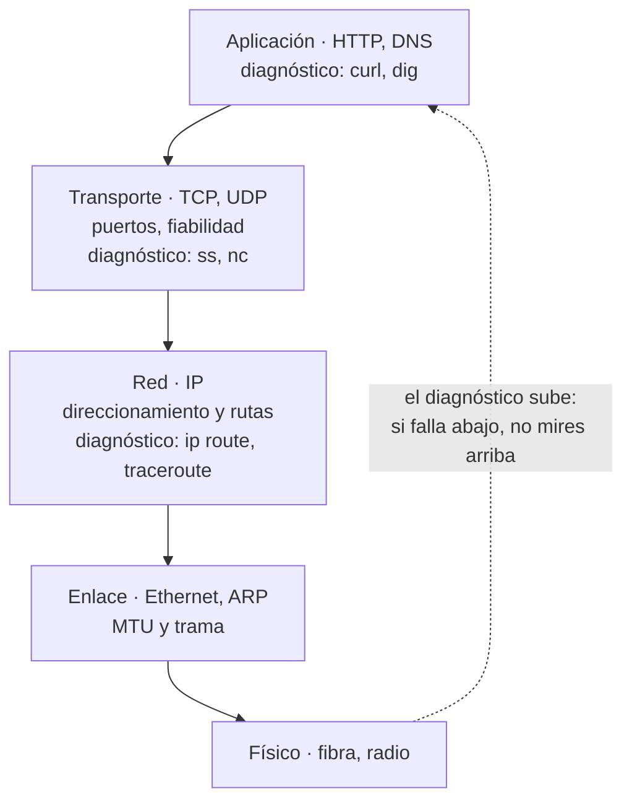

# 005 — Redes por capas, TCP/IP, puertos y sockets

> [← Clase anterior](../../part-00-foundations-computing-networking-linux/004-python-json-y-automatizacion-minima/README.md) · [Índice de la parte](../README.md) · [Clase siguiente →](../../part-00-foundations-computing-networking-linux/006-dns-http-https-y-tls-de-extremo-a-extremo/README.md)

**Parte:** 00 — Fundamentos de computación, redes y Linux<br>
**Nivel:** inicial · **Horas estimadas:** 4<br>
**Laboratorio:** `network` · **Estado:** `EXECUTABLE_CORE`

## 🎯 Propósito

Entender por qué una red se organiza en capas y qué garantiza cada una, para poder diagnosticar sin adivinar. Cuando en la parte 16 aparezcan VPC, tablas de rutas, NAT y balanceadores, todo será este modelo aplicado; y cuando un servicio «no responda», sabrás en qué capa mirar antes de tocar nada.

## 📚 Resultados de aprendizaje

Al finalizar podrás:

1. **Situar** un síntoma en la capa correcta y elegir la herramienta de diagnóstico que corresponde a esa capa.
2. **Explicar** qué garantiza TCP que UDP no, y qué cuesta esa garantía en tiempo de establecimiento.
3. **Identificar** una conexión por su cuádrupla y deducir cuántas conexiones simultáneas admite un cliente contra un mismo destino.
4. **Interpretar** los estados de un socket —`LISTEN`, `SYN_SENT`, `TIME_WAIT`— para distinguir un puerto cerrado de un filtrado.
5. **Calcular** el throughput máximo de una conexión TCP a partir de su ventana y su latencia.

## 🧩 Conceptos centrales

| Concepto | Comprensión verificable |
|---|---|
| `encapsulación` | Cada capa envuelve los datos de la superior con su propia cabecera y no interpreta el contenido. Es lo que permite cambiar de medio físico sin tocar la aplicación. |
| `socket` | Extremo de una comunicación, identificado por protocolo, IP y puerto. El sistema operativo lo expone como descriptor de fichero, de ahí que `read` y `write` funcionen sobre él igual que sobre un archivo. |
| `cuádrupla` | IP origen, puerto origen, IP destino y puerto destino. Identifica unívocamente una conexión TCP; dos conexiones pueden compartir tres de los cuatro valores pero no los cuatro. |
| `MTU` | Tamaño máximo de trama que un enlace transporta sin fragmentar. 1500 bytes en Ethernet estándar; los túneles restan espacio para su propia cabecera y son la causa habitual de conexiones que se establecen pero se cuelgan al transferir. |
| `ventana de recepción` | Bytes que el receptor declara poder aceptar sin confirmar. Junto con la latencia determina el techo de velocidad de una conexión TCP, independientemente del ancho de banda contratado. |

## 🧠 Modelo mental

Antes de alquilar infraestructura remota, aprende a observar una computadora local como un conjunto de procesos, redes, archivos, identidades y recursos medibles.

Aplicado a esta clase, separa siempre cuatro planos: **intención** (qué necesita el usuario),
**configuración** (qué declaramos), **estado observado** (qué existe de verdad) y
**evidencia** (cómo sabemos que cumple). Confundirlos produce diseños que se ven correctos
en un diagrama pero fallan al operar.

## 🗺️ Flujo de razonamiento



## 📖 Desarrollo

### 1. Cada capa garantiza una cosa y solo una

El valor del modelo por capas no es taxonómico: es que **acota dónde buscar**. Cada capa promete algo concreto y no se hace cargo de lo demás:

| Capa | Garantiza | No garantiza | Herramienta |
|---|---|---|---|
| Aplicación | Semántica del mensaje | Que llegue | `curl -v`, `dig` |
| Transporte (TCP) | Orden, integridad, entrega | Tiempo de llegada | `ss -tnp`, `nc -vz` |
| Transporte (UDP) | Nada más que multiplexar por puerto | Orden ni entrega | `nc -u` |
| Red (IP) | Mejor esfuerzo hacia un destino | Orden, entrega ni ruta estable | `ip route`, `traceroute` |
| Enlace | Entrega dentro de un mismo segmento | Nada fuera de él | `ip neigh`, `ping` con MTU |

La regla de diagnóstico es **de abajo hacia arriba**: si la capa 3 no alcanza el destino, leer logs de la aplicación es tiempo perdido. En la parte 21, los runbooks de triaje seguirán exactamente este orden.

### 2. TCP paga con tiempo lo que ofrece en garantías

TCP establece la conexión antes de enviar un solo byte útil, con el saludo de tres vías:

```text
cliente ──SYN──────────▶ servidor
cliente ◀─SYN+ACK─────── servidor
cliente ──ACK──────────▶ servidor      ya se pueden enviar datos
```

Eso es **un RTT completo** antes del primer byte. Con Madrid–Virginia a ~90 ms de ida y vuelta:

```text
TCP                        90 ms
TLS 1.2 (2 RTT)           180 ms
---------------------------------
total antes del primer byte 270 ms

TCP                        90 ms
TLS 1.3 (1 RTT)            90 ms
---------------------------------
total                     180 ms
```

Por eso TLS 1.3 no es una mejora cosmética: **elimina un RTT completo de cada conexión nueva**. Y por eso la reutilización de conexiones (`keep-alive`, pooling) importa tanto: amortiza ese coste entre muchas peticiones. Un cliente que abre y cierra conexión por petición paga 180 ms de peaje cada vez.

UDP no establece nada: el primer datagrama ya lleva datos. A cambio, la aplicación se hace cargo del orden, la pérdida y la congestión. Es la elección correcta para DNS, telemetría y voz, donde llegar tarde es peor que no llegar.

### 3. Puertos, cuádruplas y el límite real de conexiones

El puerto no identifica una conexión: identifica un **extremo**. La conexión es la cuádrupla completa, y por eso mil clientes pueden hablar con el puerto 443 del mismo servidor sin ambigüedad: difieren en IP y puerto de origen.

El límite aparece al revés, cuando **un cliente** abre muchas conexiones **al mismo destino**. Solo puede variar su puerto de origen, y el rango efímero de Linux es:

```bash
$ cat /proc/sys/net/ipv4/ip_local_port_range
32768	60999                  # 28.232 puertos disponibles
```

Un proxy o un pod que llama a un mismo backend tiene un techo de **28.232 conexiones simultáneas**, y en la práctica bastante menos porque cada cierre deja el puerto en `TIME_WAIT` durante 2×MSL (60 s en Linux):

```text
conexiones/s sostenibles ≈ 28.232 / 60 s ≈ 470 por segundo
```

Superado ese ritmo aparece `EADDRNOTAVAIL` y el síntoma es «la aplicación falla bajo carga sin error de la aplicación». La solución no es más CPU: es reutilizar conexiones. Este cálculo reaparecerá en las partes 06 y 16 al dimensionar NAT gateways, que tienen exactamente el mismo límite por IP.

### 4. El estado del socket dice qué falla

`ss` muestra en qué punto del protocolo se atascó la conexión, y cada estado apunta a una causa distinta:

```bash
$ ss -tnp state all '( dport = :443 )'
State       Recv-Q Send-Q  Local Address:Port   Peer Address:Port
ESTAB       0      0       10.0.1.5:51234       93.184.216.34:443
SYN-SENT    0      1       10.0.1.5:51240       10.0.9.9:443
TIME-WAIT   0      0       10.0.1.5:51201       93.184.216.34:443
```

| Síntoma | Estado observado | Causa probable |
|---|---|---|
| Rechazo inmediato | Nada, `ECONNREFUSED` | Puerto cerrado: nadie escucha, pero la IP responde |
| Cuelgue hasta timeout | `SYN-SENT` persistente | Filtrado: un firewall descarta en silencio |
| Conecta y se cuelga al transferir | `ESTAB` con `Send-Q` creciendo | MTU: el saludo cabe, los datos no |
| Falla solo con carga | Muchos `TIME-WAIT` | Agotamiento de puertos efímeros |

La distinción entre **rechazado y filtrado** es la más útil de todas: rechazado significa que llegaste al host y el servicio no está; filtrado significa que no llegaste. Son dos equipos distintos los que arreglan cada cosa.

### 5. El producto ancho de banda × retardo pone el techo

Una conexión TCP no puede ir más rápido que lo que permite su ventana dividida por el tiempo de ida y vuelta. El emisor manda una ventana y **espera confirmación** antes de continuar:

```text
throughput_máximo = ventana / RTT
```

Con la ventana clásica de 64 KB y un enlace transatlántico de 90 ms:

```text
65.536 bytes / 0,090 s = 728.178 B/s ≈ 5,8 Mbit/s
```

**Da igual que el enlace sea de 10 Gbit/s**: una sola conexión no pasará de 5,8 Mbit/s. Para llenar 1 Gbit/s con ese RTT hace falta:

```text
ventana = 1.000.000.000 bit/s × 0,090 s / 8 = 11,25 MB
```

De ahí el *window scaling* de RFC 7323, que permite ventanas de hasta 1 GB, y de ahí que las transferencias intercontinentales usen varias conexiones en paralelo. Cuando alguien diga «contratamos más ancho de banda y no mejoró», la respuesta suele estar en esta fórmula.

## 🔬 Ejemplo trabajado

**El servicio de pagos de CloudShop falla de forma intermitente contra el proveedor externo. Los logs de la aplicación solo dicen «timeout».** El operador diagnostica por capas, de abajo hacia arriba.

Capa 3 — ¿se alcanza el destino?

```bash
$ ip route get 203.0.113.40
203.0.113.40 via 10.0.0.1 dev eth0 src 10.0.1.5
$ traceroute -n 203.0.113.40 | tail -2
 7  198.51.100.9  12.4 ms
 8  203.0.113.40  14.1 ms          # alcanzable
```

Capa 4 — ¿se establece la conexión?

```bash
$ nc -vz 203.0.113.40 443
Connection to 203.0.113.40 443 port [tcp/https] succeeded!
```

Conecta. Así que no es ruta ni firewall. El fallo es intermitente y bajo carga, así que se mira el estado de los sockets **durante** el pico:

```bash
$ ss -tan state time-wait | wc -l
27891
$ ss -tan state all '( dport = :443 )' | grep -c ESTAB
412
$ dmesg | tail -1
TCP: request_sock_TCP: Possible SYN flooding... 
$ cat /proc/sys/net/ipv4/ip_local_port_range
32768	60999
```

**27.891 puertos en `TIME_WAIT` sobre 28.232 disponibles.** El servicio agota el rango efímero:

```text
disponibles          = 60.999 − 32.768 = 28.232
en TIME_WAIT         = 27.891  (98,8 %)
libres               =    341
ritmo sostenible     = 28.232 / 60 s ≈ 470 conexiones/s
ritmo observado en pico             ≈ 610 conexiones/s
```

El servicio abre una conexión TCP nueva por cada pago y la cierra. A 610 pagos por segundo pide 140 conexiones/s más de las que el sistema puede reciclar, y los `connect()` empiezan a devolver `EADDRNOTAVAIL`, que el cliente HTTP reporta como «timeout».

La corrección es reutilizar conexiones, no tocar el sistema operativo:

```python
sesion = requests.Session()          # pool persistente con keep-alive
adapter = HTTPAdapter(pool_maxsize=64)
sesion.mount("https://", adapter)
```

```bash
$ ss -tan state time-wait | wc -l
743                                   # de 27.891 a 743
```

**64 conexiones reutilizadas sustituyen a 610 por segundo.** Subir `net.ipv4.tcp_tw_reuse` habría escondido el síntoma un tiempo; el problema era de diseño del cliente, y estaba a dos capas de donde los logs decían.

## 🧪 Laboratorio guiado

Ejecuta desde la raíz:

```bash
python classes/part-00-foundations-computing-networking-linux/005-redes-por-capas-tcp-ip-puertos-y-sockets/lab.py
```

El laboratorio selecciona el motor de práctica **`network`** y produce
`lab_result.json`. El escenario, sus comprobaciones y el artefacto esperado corresponden a
esta clase; no requiere credenciales y deja explícito qué debe revalidarse en un sandbox real.

1. Lee `exercise.steps` y formula una predicción antes de ejecutar.
2. Ejecuta la práctica y verifica todos los elementos de `checks`.
3. Provoca el caso de `negative_test` y explica la señal observada.
4. Materializa `captura-y-mapa-de-red` en `evidence/` usando la plantilla indicada.
5. Para proveedor real, sigue `sandbox.requires`, registra costo y ejecuta `destroy`.

### Evidencia esperada

El artefacto principal es una topología con rutas, puertos y controles. Además, la entrega debe incluir el comando ejecutado,
la salida estructurada y una conclusión que no exceda lo observado.

## 🏆 Reto verificable

Construye **`captura-y-mapa-de-red`** para el caso CloudShop. Incluye una alternativa descartada,
un supuesto que pueda falsarse, una prueba de fallo y una decisión de rollback.

## ✅ Criterio de aceptación

- [ ] `lab.py` termina con código 0 y genera JSON válido.
- [ ] La entrega conecta al menos tres requisitos con mecanismos verificables.
- [ ] Existe una prueba positiva y una prueba negativa con evidencia.
- [ ] Seguridad, costo y operación aparecen como decisiones, no como anexos.
- [ ] Se declara una limitación y una condición que obligaría a revisar el diseño.
- [ ] Otra persona puede repetir el recorrido sin conocimiento tácito.

## ⚠️ Errores frecuentes

| Síntoma | Causa probable | Corrección |
|---|---|---|
| El servicio falla solo bajo carga y sin error propio de la aplicación | Agotamiento de puertos efímeros por abrir una conexión nueva por petición | Usa un pool con keep-alive; el techo es ~28.000 puertos y 60 s de TIME_WAIT por cierre. |
| La conexión se establece pero se cuelga al transferir datos | MTU insuficiente en un túnel: el saludo cabe en paquetes pequeños y los datos no | Prueba con `ping -M do -s` para hallar la MTU real y ajusta MSS clamping. |
| Se contrató más ancho de banda y la transferencia no mejoró | El techo lo pone ventana/RTT, no el caudal del enlace | Habilita window scaling o paraleliza conexiones; calcula el producto ancho de banda × retardo. |
| Se depuran logs de la aplicación durante una hora y el problema era de red | Se diagnosticó de arriba hacia abajo | Verifica ruta y establecimiento de conexión antes de leer la aplicación. |
| No se distingue si el puerto está cerrado o filtrado | Se interpretó cualquier fallo de conexión como lo mismo | Rechazo inmediato es puerto cerrado; cuelgue en SYN-SENT es filtrado. Son equipos distintos. |

## 🛡️ Seguridad, ética y costo

Trabaja con cuentas propias o sandboxes autorizados. No publiques secretos, identificadores
reales ni datos personales. Antes de crear recursos pagos define presupuesto, etiquetas y
comando de destrucción; después verifica que no queden recursos huérfanos. Los ejemplos
locales enseñan contratos, pero no certifican cumplimiento ni disponibilidad de producción.

## ❓ Preguntas de comprobación

1. ¿Cuántos RTT median entre el primer paquete y el primer byte útil con TCP + TLS 1.3, y cuántos con TLS 1.2?
2. Un pod abre conexiones a un solo backend. ¿Cuál es su techo teórico de conexiones simultáneas y de dónde sale ese número?
3. Con ventana de 64 KB y RTT de 200 ms, ¿cuál es el throughput máximo de una conexión, y cambia si contratas 10 Gbit/s?
4. ¿Qué diferencia operativa hay entre un `ECONNREFUSED` inmediato y un cuelgue en `SYN-SENT`?
5. Una conexión se establece y se cuelga al enviar un cuerpo grande. ¿Qué capa sospechas y con qué comando lo confirmas?

## 🔗 Referencias

- Kurose, J. y Ross, K. (2021). *Computer Networking: A Top-Down Approach*, 8.ª ed., caps. 3-4 — transporte y capa de red.
- Postel, J., ed. (1981). *RFC 793: Transmission Control Protocol* — saludo de tres vías y máquina de estados. <https://www.rfc-editor.org/rfc/rfc793>
- Borman, D. et al. (2014). *RFC 7323: TCP Extensions for High Performance* — window scaling y el producto ancho de banda × retardo. <https://www.rfc-editor.org/rfc/rfc7323>
- Rescorla, E. (2018). *RFC 8446: The Transport Layer Security (TLS) Protocol Version 1.3* — saludo de 1-RTT. <https://www.rfc-editor.org/rfc/rfc8446>
- Kerrisk, M. *ss(8)* y *tcp(7)* — estados de socket y parámetros del núcleo de Linux. <https://man7.org/linux/man-pages/man7/tcp.7.html>
- Documentación oficial vigente del servicio implementado; registra URL y fecha de consulta.

---

> [Evaluación](assessment.md) · [Contrato de clase](lesson.yaml) · [Índice de la parte](../README.md)
