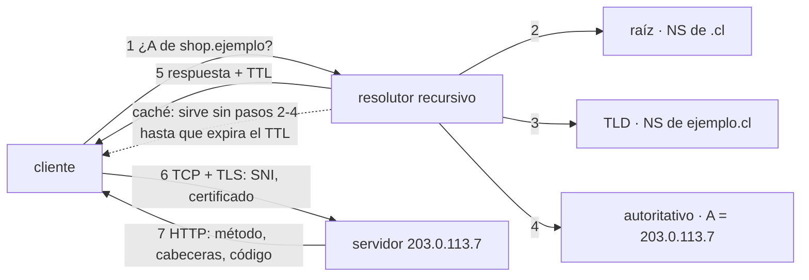

# 006 — DNS, HTTP, HTTPS y TLS de extremo a extremo

> [← Clase anterior](../../part-00-foundations-computing-networking-linux/005-redes-por-capas-tcp-ip-puertos-y-sockets/README.md) · [Índice de la parte](../README.md) · [Clase siguiente →](../../part-00-foundations-computing-networking-linux/007-linux-usuarios-permisos-servicios-y-logs/README.md)

**Parte:** 00 — Fundamentos de computación, redes y Linux<br>
**Nivel:** inicial · **Horas estimadas:** 4<br>
**Laboratorio:** `network` · **Estado:** `EXECUTABLE_CORE`

## 🎯 Propósito

Seguir una petición HTTPS desde el nombre hasta el byte: quién resuelve el nombre y con qué caché, qué negocia TLS y qué demuestra un certificado, y qué significan realmente los códigos y cabeceras de HTTP. Es el camino que recorren todas las peticiones del programa, y donde se originan la mayoría de incidentes de disponibilidad percibida.

## 📚 Resultados de aprendizaje

Al finalizar podrás:

1. **Trazar** una resolución DNS completa e identificar en qué caché se queda un cambio que «no se propaga».
2. **Explicar** qué demuestra un certificado TLS y qué no, y por qué el cifrado no implica confianza en el otro extremo.
3. **Elegir** un TTL de DNS en función de la ventana de conmutación que necesita tu plan de continuidad.
4. **Distinguir** un 502 de un 503 y de un 504 para saber a qué componente apunta cada uno.
5. **Diseñar** una política de caché HTTP que permita invalidar sin esperar a que expire.

## 🧩 Conceptos centrales

| Concepto | Comprensión verificable |
|---|---|
| `resolutor recursivo` | Servidor que hace el trabajo de consultar la cadena de autoridades en nombre del cliente y guarda el resultado en caché. Es quien realmente decide durante cuánto tiempo verás una respuesta antigua. |
| `TTL` | Segundos que un registro DNS puede permanecer en caché. Fija el suelo del tiempo de conmutación: con TTL de 3600, un cambio de IP tarda hasta una hora en verse, sin importar lo rápido que lo publiques. |
| `SNI` | Extensión de TLS que envía el nombre del host solicitado en claro dentro del saludo, para que un servidor con muchos certificados sepa cuál presentar. Al ir en claro, revela qué sitio visitas aunque el contenido vaya cifrado. |
| `cadena de confianza` | Secuencia de firmas desde el certificado del servidor hasta una raíz que el cliente ya considera fiable. Un certificado válido demuestra control del nombre, no honestidad del operador. |
| `caché condicional` | Mecanismo por el que el cliente pregunta «¿ha cambiado desde esta versión?» con `If-None-Match`. Si no cambió, el servidor responde 304 sin cuerpo, ahorrando la transferencia pero no el viaje. |

## 🧠 Modelo mental

Antes de alquilar infraestructura remota, aprende a observar una computadora local como un conjunto de procesos, redes, archivos, identidades y recursos medibles.

Aplicado a esta clase, separa siempre cuatro planos: **intención** (qué necesita el usuario),
**configuración** (qué declaramos), **estado observado** (qué existe de verdad) y
**evidencia** (cómo sabemos que cumple). Confundirlos produce diseños que se ven correctos
en un diagrama pero fallan al operar.

## 🗺️ Flujo de razonamiento



## 📖 Desarrollo

### 1. DNS: la caché que decide cuánto dura tu error

Una resolución completa recorre la jerarquía, pero **casi ninguna lo hace**: el resolutor responde desde caché. Esa caché es la que gobierna la realidad operativa.

```bash
$ dig +trace shop.ejemplo.cl A | tail -4
ejemplo.cl.     172800  IN  NS  ns1.ejemplo.cl.
shop.ejemplo.cl. 300    IN  A   203.0.113.7      # TTL de 300 s

$ dig shop.ejemplo.cl A +noall +answer
shop.ejemplo.cl. 187    IN  A   203.0.113.7       # quedan 187 s en caché
```

El TTL es una **decisión de arquitectura de continuidad**, no un parámetro técnico:

| TTL | Coste en consultas | Ventana de conmutación | Cuándo |
|---|---|---|---|
| 60 s | Alto | ≤ 1 min | Antes de una migración planificada |
| 300 s | Medio | ≤ 5 min | Servicios con failover DNS |
| 3600 s | Bajo | ≤ 1 h | Registros estables |
| 86400 s | Mínimo | ≤ 24 h | NS, MX, registros de verificación |

La regla operativa: **baja el TTL antes de necesitarlo**. Bajarlo a 60 s en mitad de un incidente no sirve, porque los resolutores siguen sirviendo la respuesta anterior con su TTL original. Hay que bajarlo con al menos un TTL antiguo de antelación.

Y hay un límite que no controlas: muchos resolutores públicos y sistemas operativos imponen mínimos propios e ignoran TTL muy bajos. **DNS es control de tráfico con granularidad de minutos, nunca de segundos**; por eso en la parte 13 el failover regional no se apoya solo en DNS.

### 2. Qué demuestra un certificado y qué no

TLS resuelve tres problemas distintos y conviene no confundirlos:

1. **Confidencialidad**: nadie en el camino lee el contenido.
2. **Integridad**: nadie lo modifica sin que se detecte.
3. **Autenticación del servidor**: hablas con quien dice el nombre.

El certificado solo aporta el tercero, y de forma acotada: prueba que **alguien demostró control sobre ese nombre de dominio** ante una autoridad en la que tu cliente confía. No dice nada sobre la honestidad del operador ni la seguridad de su código. Un sitio de phishing con certificado válido es exactamente eso: cifrado, íntegro y fraudulento.

```bash
$ openssl s_client -connect shop.ejemplo.cl:443 -servername shop.ejemplo.cl </dev/null 2>/dev/null \
  | openssl x509 -noout -subject -issuer -dates
subject=CN=shop.ejemplo.cl
issuer=C=US, O=Let's Encrypt, CN=R11
notBefore=Jul  2 00:00:00 2026 GMT
notAfter=Sep 30 23:59:59 2026 GMT
```

El `-servername` es SNI y **es obligatorio**: sin él, un servidor con varios certificados presenta el que tenga por defecto y el diagnóstico induce a error. Como SNI viaja en claro, un observador de red sabe qué sitio visitas aunque no vea el contenido; ECH (*Encrypted Client Hello*) es la respuesta en curso a esa fuga.

### 3. Los códigos HTTP dicen quién falló

Los códigos 5xx no son intercambiables: cada uno apunta a un componente distinto de la cadena, y confundirlos alarga los incidentes.

| Código | Significado | Quién falló |
|---|---|---|
| 500 | Error interno | La aplicación de origen: excepción no controlada |
| 502 | Puerta de enlace incorrecta | El proxy habló con el origen y recibió basura o nada |
| 503 | Servicio no disponible | El origen se declara saturado o en mantenimiento |
| 504 | Tiempo agotado en la puerta | El proxy esperó y el origen no respondió a tiempo |

La distinción práctica entre **502 y 504**: en el 502 el origen respondió algo inválido o cerró la conexión, así que hay que mirar sus logs; en el 504 no respondió nada dentro del plazo, así que hay que mirar su latencia y saturación. Buscar excepciones en el origen ante un 504 no lleva a ningún sitio, porque probablemente la petición sigue procesándose.

El 503 tiene un matiz que casi nadie usa: admite la cabecera `Retry-After`, que le dice al cliente cuándo volver. Sin ella, los clientes reintentan de inmediato y agravan la saturación que causó el 503 — el mismo *thundering herd* de la clase 004.

### 4. Caché HTTP: el viaje que no se hace

La petición más rápida es la que no ocurre. HTTP ofrece dos niveles, y elegir mal el primero condena a soportar contenido obsoleto:

```http
Cache-Control: public, max-age=31536000, immutable
```
Para recursos con huella en el nombre (`app.4f2a9c.js`): un año, sin revalidar. Como el nombre cambia con el contenido, **invalidar es publicar un nombre nuevo**; nunca hay que purgar nada.

```http
Cache-Control: no-cache
ETag: "7d2b8e91"
```
Para documentos que cambian (`index.html`): `no-cache` **no significa «no almacenar»**, significa «almacena pero revalida antes de usar». El cliente pregunta con `If-None-Match: "7d2b8e91"` y recibe `304 Not Modified` sin cuerpo si no cambió: se ahorra la transferencia, no el viaje.

Para prohibir el almacenamiento de verdad hace falta `no-store`, y solo tiene sentido en respuestas con datos personales o tokens.

El error clásico es servir `index.html` con `max-age` largo: entonces **una corrección urgente no llega hasta que expire**, y no hay forma de forzarlo desde el servidor. Por eso el patrón que se repetirá en las partes 16 y 17 es siempre el mismo: **HTML corto y revalidable, activos largos e inmutables con huella en el nombre**.

### 5. El coste completo de una petición en frío

Sumando lo anterior, la primera petición a un origen lejano paga varios peajes secuenciales:

```text
resolución DNS (caché fría)         1 RTT al resolutor + cadena
establecimiento TCP                 1 RTT
saludo TLS 1.3                      1 RTT
petición y respuesta HTTP           1 RTT
-------------------------------------------------
mínimo                              ≈ 4 RTT
```

Con un RTT de 90 ms son **360 ms antes de mostrar nada**, y ninguna optimización del servidor los reduce. Las palancas son todas de red:

- **Reutilizar la conexión** elimina TCP y TLS de las peticiones siguientes.
- **Acercar la terminación** (CDN, edge) reduce el RTT que multiplica a todo lo demás.
- **`0-RTT` de TLS 1.3** permite enviar datos en el primer paquete al reconectar, con la contrapartida de que esos datos son vulnerables a repetición: solo vale para peticiones idempotentes.

Es el mismo cálculo de la clase 001, ahora con los protocolos concretos que lo producen.

## 🔬 Ejemplo trabajado

**CloudShop migra su frontend a una IP nueva. El equipo publica el cambio a las 10:00 y a las 11:30 sigue habiendo usuarios llegando al servidor viejo.** Se acusa al proveedor de DNS.

Primero se comprueba qué publica la autoridad, sin pasar por caché:

```bash
$ dig @ns1.ejemplo.cl shop.ejemplo.cl A +noall +answer
shop.ejemplo.cl. 3600 IN A 203.0.113.44        # correcto, ya es la IP nueva
```

La autoridad está bien. Ahora qué ven los resolutores públicos:

```bash
$ dig @8.8.8.8 shop.ejemplo.cl A +noall +answer
shop.ejemplo.cl. 1187 IN A 203.0.113.7         # IP VIEJA, 1187 s restantes
$ dig @1.1.1.1 shop.ejemplo.cl A +noall +answer
shop.ejemplo.cl.  942 IN A 203.0.113.7
```

**El TTL era 3600 s.** Cuando se publicó el cambio, los resolutores ya tenían la respuesta anterior cacheada, cada uno con su reloj propio:

```text
publicación del cambio          10:00
peor caso: un resolutor cacheó a 09:59  →  expira a 10:59
ventana teórica de convergencia         →  hasta 11:00
observado a 11:30                       →  hay resolutores con TTL de 3600 s
                                            que refrescaron a 10:30
```

La aritmética explica el residual: cada resolutor que refresca justo antes del cambio arrastra una hora más. **El tiempo de convergencia no es el TTL: es hasta dos veces el TTL** si el cambio coincide con el peor momento de refresco.

Lo que debió hacerse, con un día de antelación:

```text
D-1 09:00  bajar TTL de 3600 a 60      (empieza a propagarse)
D-1 10:00  todos los resolutores tienen ya TTL de 60
D   10:00  cambiar la IP                (converge en ≤ 2 min)
D   12:00  restaurar TTL a 3600
```

En el incidente real, la mitigación no fue DNS sino red: se mantuvo el servidor viejo respondiendo con un `308 Permanent Redirect` hacia el nuevo hasta que la caché expiró.

**La lección: DNS no es un conmutador. Es una caché distribuida cuyo tiempo de reacción se decide con un TTL, y ese TTL hay que bajarlo antes de necesitarlo.** Por eso los planes de continuidad de la parte 13 no dependen de DNS para conmutaciones de segundos.

## 🧪 Laboratorio guiado

Ejecuta desde la raíz:

```bash
python classes/part-00-foundations-computing-networking-linux/006-dns-http-https-y-tls-de-extremo-a-extremo/lab.py
```

El laboratorio selecciona el motor de práctica **`network`** y produce
`lab_result.json`. El escenario, sus comprobaciones y el artefacto esperado corresponden a
esta clase; no requiere credenciales y deja explícito qué debe revalidarse en un sandbox real.

1. Lee `exercise.steps` y formula una predicción antes de ejecutar.
2. Ejecuta la práctica y verifica todos los elementos de `checks`.
3. Provoca el caso de `negative_test` y explica la señal observada.
4. Materializa `traza-de-solicitud` en `evidence/` usando la plantilla indicada.
5. Para proveedor real, sigue `sandbox.requires`, registra costo y ejecuta `destroy`.

### Evidencia esperada

El artefacto principal es una topología con rutas, puertos y controles. Además, la entrega debe incluir el comando ejecutado,
la salida estructurada y una conclusión que no exceda lo observado.

## 🏆 Reto verificable

Construye **`traza-de-solicitud`** para el caso CloudShop. Incluye una alternativa descartada,
un supuesto que pueda falsarse, una prueba de fallo y una decisión de rollback.

## ✅ Criterio de aceptación

- [ ] `lab.py` termina con código 0 y genera JSON válido.
- [ ] La entrega conecta al menos tres requisitos con mecanismos verificables.
- [ ] Existe una prueba positiva y una prueba negativa con evidencia.
- [ ] Seguridad, costo y operación aparecen como decisiones, no como anexos.
- [ ] Se declara una limitación y una condición que obligaría a revisar el diseño.
- [ ] Otra persona puede repetir el recorrido sin conocimiento tácito.

## ⚠️ Errores frecuentes

| Síntoma | Causa probable | Corrección |
|---|---|---|
| Se cambia una IP y horas después sigue llegando tráfico al servidor antiguo | El TTL alto estaba cacheado en los resolutores antes del cambio | Baja el TTL con al menos un TTL de antelación; cuenta hasta dos veces el TTL como ventana de convergencia. |
| `openssl s_client` muestra un certificado que no corresponde al sitio | Se omitió `-servername`, así que el servidor presentó su certificado por defecto | Incluye siempre SNI con `-servername` al diagnosticar hosts virtuales. |
| Se buscan excepciones en el origen ante un 504 y no aparece ninguna | El 504 significa que el origen no respondió a tiempo, no que fallara | Ante 504 mira latencia y saturación del origen; ante 502, sus logs de error. |
| Una corrección urgente del HTML no llega a los usuarios | Se sirvió el documento con `max-age` largo y no hay forma de invalidar desde el servidor | HTML con `no-cache` y ETag; activos inmutables con huella en el nombre. |
| Un 503 provoca una avalancha de reintentos que empeora la saturación | La respuesta no incluyó `Retry-After` y los clientes reintentaron de inmediato | Devuelve `Retry-After` y aplica retroceso con jitter en el cliente. |

## 🛡️ Seguridad, ética y costo

Trabaja con cuentas propias o sandboxes autorizados. No publiques secretos, identificadores
reales ni datos personales. Antes de crear recursos pagos define presupuesto, etiquetas y
comando de destrucción; después verifica que no queden recursos huérfanos. Los ejemplos
locales enseñan contratos, pero no certifican cumplimiento ni disponibilidad de producción.

## ❓ Preguntas de comprobación

1. Con un TTL de 3600 s, ¿cuál es el peor caso de convergencia tras cambiar una IP, y por qué no es una hora?
2. ¿Qué demuestra exactamente un certificado TLS válido, y qué afirmación sobre el sitio no respalda?
3. Un proxy devuelve 502 y otro 504. ¿En cuál mirarías los logs del origen y en cuál sus métricas de latencia?
4. ¿Por qué `no-cache` no impide almacenar, y qué cabecera sí lo impide?
5. ¿Cuántos RTT tiene una petición HTTPS en frío y cuáles se eliminan reutilizando la conexión?

## 🔗 Referencias

- Mockapetris, P. (1987). *RFC 1035: Domain Names — Implementation and Specification*. <https://www.rfc-editor.org/rfc/rfc1035>
- Rescorla, E. (2018). *RFC 8446: TLS 1.3* — saludo de 1-RTT, 0-RTT y sus riesgos de repetición. <https://www.rfc-editor.org/rfc/rfc8446>
- Fielding, R. y Reschke, J., eds. (2022). *RFC 9110: HTTP Semantics* — semántica de códigos de estado. <https://www.rfc-editor.org/rfc/rfc9110>
- Fielding, R. et al., eds. (2022). *RFC 9111: HTTP Caching* — `Cache-Control`, validadores y respuestas 304. <https://www.rfc-editor.org/rfc/rfc9111>
- Grigorik, I. (2013). *High Performance Browser Networking*, caps. 1-4 — coste en RTT de DNS, TCP y TLS. <https://hpbn.co/>
- Documentación oficial vigente del servicio implementado; registra URL y fecha de consulta.

---

> [Evaluación](assessment.md) · [Contrato de clase](lesson.yaml) · [Índice de la parte](../README.md)
