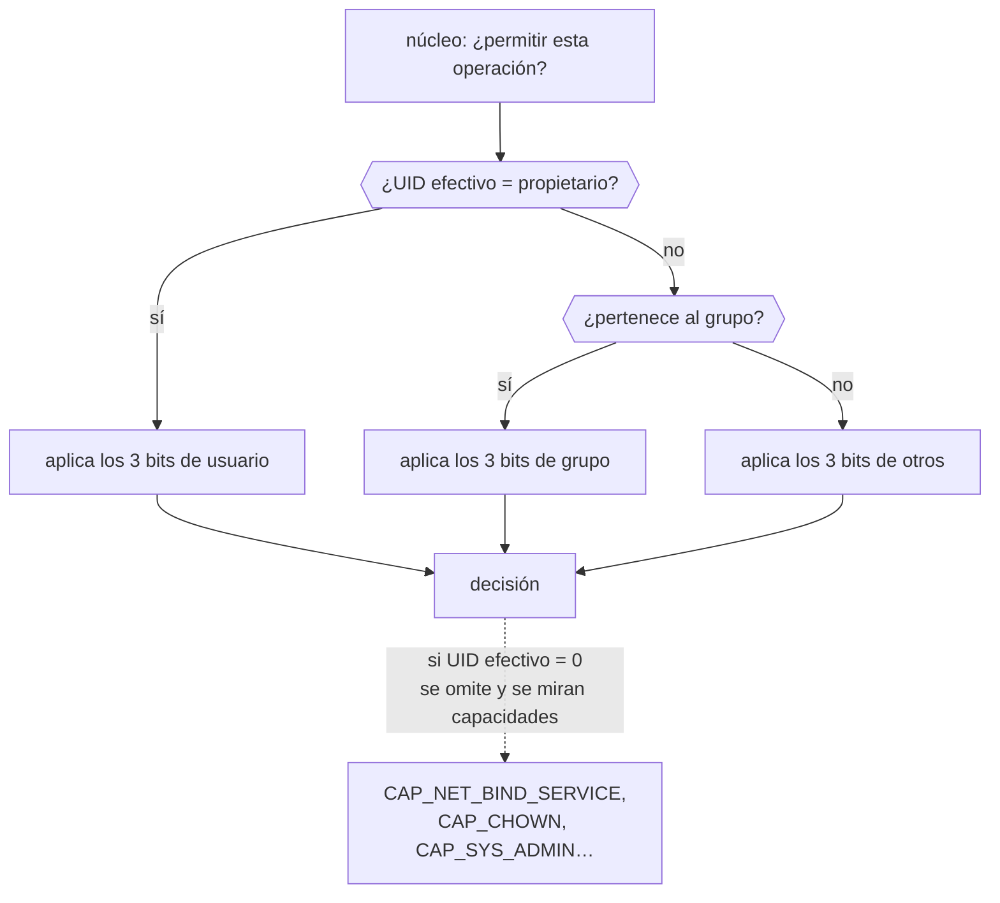

# 007 — Linux: usuarios, permisos, servicios y logs

> [← Clase anterior](../../part-00-foundations-computing-networking-linux/006-dns-http-https-y-tls-de-extremo-a-extremo/README.md) · [Índice de la parte](../README.md) · [Clase siguiente →](../../part-00-foundations-computing-networking-linux/008-virtualizacion-hipervisores-e-imagenes/README.md)

**Parte:** 00 — Fundamentos de computación, redes y Linux<br>
**Nivel:** inicial · **Horas estimadas:** 4<br>
**Laboratorio:** `linux` · **Estado:** `EXECUTABLE_CORE`

## 🎯 Propósito

Entender el modelo de identidad y privilegio de Linux, y el ciclo de vida de un servicio bajo systemd, porque son la base literal de todo lo que viene: los contenedores de la parte 05 son procesos Linux con espacios de nombres, y el mínimo privilegio de IAM en la parte 11 es esta misma idea trasladada a la nube.

## 📚 Resultados de aprendizaje

Al finalizar podrás:

1. **Descomponer** un modo de permisos octal y explicar por qué el bit de ejecución significa cosas distintas en fichero y en directorio.
2. **Sustituir** el uso de `root` por capacidades concretas, justificando cuál se necesita y por qué.
3. **Definir** una unidad de systemd con reinicio, límites y usuario propio, y explicar cada directiva.
4. **Consultar** logs con `journalctl` filtrando por unidad, prioridad y ventana temporal.
5. **Diagnosticar** un servicio que no arranca distinguiendo permisos, dependencias y configuración.

## 🧩 Conceptos centrales

| Concepto | Comprensión verificable |
|---|---|
| `UID efectivo` | Identificador con el que el núcleo evalúa cada comprobación de permiso. Puede diferir del UID real tras un `setuid`, y es el que importa para decidir si una operación se permite. |
| `capacidad` | Fragmento del poder histórico de root, otorgable por separado. `CAP_NET_BIND_SERVICE` permite abrir puertos bajo 1024 sin conceder las otras 40 capacidades que root arrastra. |
| `unidad` | Objeto que systemd gestiona: servicio, socket, temporizador, punto de montaje o destino. Se declara de forma descriptiva y systemd deduce el orden de arranque a partir de las dependencias. |
| `journal` | Registro binario, indexado y estructurado de systemd. Cada entrada lleva metadatos —unidad, PID, UID, prioridad— consultables como campos, no como texto. |
| `umask` | Máscara que se resta de los permisos por defecto al crear ficheros. Con umask 022, un fichero nace 644 y un directorio 755; explica por qué lo que creas no es de escritura para el grupo. |

## 🧠 Modelo mental

Antes de alquilar infraestructura remota, aprende a observar una computadora local como un conjunto de procesos, redes, archivos, identidades y recursos medibles.

Aplicado a esta clase, separa siempre cuatro planos: **intención** (qué necesita el usuario),
**configuración** (qué declaramos), **estado observado** (qué existe de verdad) y
**evidencia** (cómo sabemos que cumple). Confundirlos produce diseños que se ven correctos
en un diagrama pero fallan al operar.

## 🗺️ Flujo de razonamiento



## 📖 Desarrollo

### 1. Permisos: tres tríos y una regla que sorprende

Cada objeto del sistema de ficheros tiene propietario, grupo y tres tríos de bits. El núcleo evalúa **el primer trío que aplica y se detiene ahí**:

```bash
$ ls -l /opt/cloudshop/config.yaml
-rw-r----- 1 cloudshop cloudshop 412 Aug  1 09:12 config.yaml
#  ↑↑↑↑↑↑↑↑↑
#  rw-  usuario cloudshop: leer y escribir
#     r--  grupo cloudshop: solo leer
#        ---  otros: nada
```

En octal, `640`. La consecuencia contraintuitiva: **si eres el propietario y el trío de usuario deniega, no te salva pertenecer al grupo**. Un fichero `0640` propiedad de `ana` y grupo `ana` es ilegible para `ana` si el primer trío fuera `---`, aunque su grupo pueda leerlo.

El bit de ejecución significa cosas distintas según el objeto:

| Bit | En fichero | En directorio |
|---|---|---|
| `r` | Leer el contenido | **Listar** los nombres |
| `w` | Modificar el contenido | **Crear y borrar** entradas |
| `x` | Ejecutarlo | **Atravesarlo** para llegar a su interior |

De ahí dos efectos que confunden a diario:

- Un directorio `r--` deja ver los nombres pero **no consultar los metadatos** de lo que contiene: `ls` funciona y `ls -l` da «permiso denegado».
- Para borrar un fichero **no hace falta permiso sobre el fichero**, sino `w` sobre el directorio que lo contiene. Por eso `/tmp` lleva el *sticky bit* (`1777`): permite a todos crear, pero solo al propietario borrar lo suyo.

### 2. root no es un usuario: es la ausencia de comprobaciones

Cuando el UID efectivo es 0, el núcleo **omite** la comprobación de permisos. Eso no es un privilegio más: es no tener ninguno que aplicar. Linux fragmentó ese poder en unas 40 **capacidades** otorgables por separado:

| Capacidad | Permite | Uso legítimo |
|---|---|---|
| `CAP_NET_BIND_SERVICE` | Abrir puertos < 1024 | Un servidor web en el 80 |
| `CAP_CHOWN` | Cambiar el propietario | Gestores de paquetes |
| `CAP_SYS_ADMIN` | Montar, espacios de nombres… | **Casi equivale a root** |

El caso que se repite: un servicio quiere escuchar en el 443 y alguien lo ejecuta como root «porque si no, no puede». La alternativa correcta cede solo lo necesario:

```ini
[Service]
User=cloudshop
AmbientCapabilities=CAP_NET_BIND_SERVICE
CapabilityBoundingSet=CAP_NET_BIND_SERVICE
```

Si ese proceso resulta vulnerable, el atacante obtiene la capacidad de abrir puertos bajos y nada más: no puede leer `/etc/shadow`, ni cargar módulos, ni cambiar propietarios. **`CAP_SYS_ADMIN` es la excepción**: concederla equivale prácticamente a conceder root, y verla en un manifiesto debe activar la misma alarma que `privileged: true` en la parte 06.

### 3. systemd declara el estado deseado, no los pasos

Una unidad no describe cómo arrancar: describe **qué debe cumplirse**. systemd deduce el orden a partir de las dependencias y paraleliza el resto.

```ini
[Unit]
Description=API de CloudShop
After=network-online.target          # orden: después de que haya red
Wants=network-online.target          # dependencia débil: si falla, seguimos

[Service]
Type=notify                          # el proceso avisa cuando está listo
User=cloudshop
ExecStart=/opt/cloudshop/bin/api
Restart=on-failure                   # no reiniciar si salió con 0
RestartSec=5
StartLimitBurst=5                    # 5 intentos…
StartLimitIntervalSec=300            # …en 5 minutos, o se rinde

NoNewPrivileges=true                 # ningún hijo escala privilegios
ProtectSystem=strict                 # todo el sistema en solo lectura
ProtectHome=true
PrivateTmp=true                      # /tmp propio, aislado
ReadWritePaths=/var/lib/cloudshop    # única excepción de escritura
MemoryMax=512M

[Install]
WantedBy=multi-user.target
```

Dos distinciones que evitan incidentes:

- **`Requires` frente a `Wants`**: `Requires` arrastra la caída del dependiente si la dependencia falla; `Wants` no. Usar `Requires` a la ligera propaga fallos en cascada.
- **`After` no implica dependencia**: solo fija orden. Un servicio con `After=X` pero sin `Wants=X` arranca aunque X no exista.

`StartLimitBurst` merece atención: sin él, un servicio que falla al arrancar entra en bucle de reinicio consumiendo CPU. Con él, systemd se rinde y deja el fallo visible en vez de esconderlo tras reintentos infinitos.

### 4. El journal es estructurado: consúltalo como tal

`journalctl` no busca texto: filtra **campos indexados**. Tratarlo con `grep` desperdicia su ventaja y produce falsos negativos.

```bash
# Errores y peores de una unidad en la última hora
$ journalctl -u cloudshop -p err --since "1 hour ago"

# Solo el arranque actual, siguiendo en vivo
$ journalctl -u cloudshop -b -f

# Salida estructurada para automatizar
$ journalctl -u cloudshop -o json --since today | jq -r 'select(.PRIORITY<="3") | .MESSAGE'

# Qué escribió un PID concreto, aunque ya no exista
$ journalctl _PID=4877
```

Las prioridades siguen la escala syslog, de 0 (emergencia) a 7 (depuración); `-p err` incluye 0 a 3. Un servicio que escribe todo como `info` hace inútil este filtro: **la prioridad es parte del contrato del log**, igual que stdout y stderr lo eran en la clase 002.

Dos límites operativos que importan: el journal es **local y rotatorio**, con tamaño acotado por `SystemMaxUse`. Si el disco se llena, se descartan las entradas más antiguas. Por eso en la parte 10 los logs se envían fuera del host: **un log que solo existe en la máquina que falló no sirve para el postmortem**.

### 5. Diagnóstico de un servicio que no arranca

El orden ahorra horas, porque cada paso descarta una familia de causas:

```bash
$ systemctl status cloudshop          # 1. ¿qué dice systemd?
$ journalctl -u cloudshop -n 50 -p warning   # 2. ¿qué dijo el proceso?
$ systemd-analyze verify cloudshop.service   # 3. ¿la unidad es válida?
$ sudo -u cloudshop /opt/cloudshop/bin/api   # 4. ¿arranca a mano con ese usuario?
$ systemctl show cloudshop -p ExecMainStatus -p ExecMainCode
```

El paso 4 es el que más separa: si a mano funciona con el mismo usuario, el problema está en el **entorno de la unidad** —`PATH`, variables, directorio de trabajo, endurecimiento— y no en la aplicación. Es exactamente el fallo de la clase 002.

Los códigos más frecuentes y su lectura inmediata:

| `ExecMainStatus` | Causa habitual |
|---|---|
| 203 | `ExecStart` no existe o no es ejecutable |
| 200 | El directorio de trabajo no existe |
| 208 | `User=` no existe |
| 226 | El endurecimiento bloqueó una ruta necesaria |
| 1-125 | Fallo propio de la aplicación: ahora sí, mira sus logs |

Los códigos 200-241 son de systemd, no de tu programa: significan que **el proceso nunca llegó a ejecutarse**.

## 🔬 Ejemplo trabajado

**La API de CloudShop arranca en desarrollo y falla en el servidor nuevo. El log de la aplicación está vacío.**

```bash
$ systemctl status cloudshop
● cloudshop.service - API de CloudShop
     Active: failed (Result: exit-code)
    Process: 8812 ExecStart=/opt/cloudshop/bin/api (code=exited, status=226/NAMESPACE)
```

**226/NAMESPACE**: no es la aplicación. systemd impidió el arranque por el endurecimiento antes de ejecutar una sola línea. El log vacío ahora se explica: el proceso nunca corrió.

```bash
$ journalctl -u cloudshop -n 5 -p err
cloudshop.service: Failed to set up mount namespacing:
  /var/log/cloudshop: Read-only file system
```

La unidad declara `ProtectSystem=strict`, que monta todo el sistema en solo lectura, y la aplicación escribe en `/var/log/cloudshop`, que no está en las excepciones:

```bash
$ systemctl show cloudshop -p ProtectSystem -p ReadWritePaths
ProtectSystem=strict
ReadWritePaths=/var/lib/cloudshop
```

Hay dos correcciones posibles y **no son equivalentes**:

```ini
# A) Ampliar la excepción: mantiene el endurecimiento
ReadWritePaths=/var/lib/cloudshop /var/log/cloudshop

# B) Escribir al journal por stdout: elimina la necesidad
# (se quita la ruta de log de la aplicación; systemd captura stdout)
```

Se elige **B**. Razón operativa, no estética: un fichero de log local se pierde cuando la instancia se recicla, no rota solo, y llena el disco. Escribir a stdout deja que systemd lo estructure y que el recolector de la parte 10 lo envíe fuera del host. Es además lo que exigirá el contenedor de la parte 05, donde escribir logs a fichero es directamente un antipatrón.

Comprobación final del privilegio real que conserva el servicio:

```bash
$ systemctl restart cloudshop && systemctl show cloudshop -p ExecMainStatus
ExecMainStatus=0
$ grep CapEff /proc/$(systemctl show -p MainPID --value cloudshop)/status
CapEff:	0000000000000400          # solo CAP_NET_BIND_SERVICE
```

**`0x400` es el bit 10, exactamente `CAP_NET_BIND_SERVICE`.** Si esa API resultara vulnerable, el atacante hereda el poder de abrir puertos bajos y nada más. Ese es el mismo razonamiento que en la parte 11 se aplicará a un rol de IAM: no «qué necesita para funcionar», sino **qué obtiene quien lo comprometa**.

## 🧪 Laboratorio guiado

Ejecuta desde la raíz:

```bash
python classes/part-00-foundations-computing-networking-linux/007-linux-usuarios-permisos-servicios-y-logs/lab.py
```

El laboratorio selecciona el motor de práctica **`linux`** y produce
`lab_result.json`. El escenario, sus comprobaciones y el artefacto esperado corresponden a
esta clase; no requiere credenciales y deja explícito qué debe revalidarse en un sandbox real.

1. Lee `exercise.steps` y formula una predicción antes de ejecutar.
2. Ejecuta la práctica y verifica todos los elementos de `checks`.
3. Provoca el caso de `negative_test` y explica la señal observada.
4. Materializa `servicio-auditado` en `evidence/` usando la plantilla indicada.
5. Para proveedor real, sigue `sandbox.requires`, registra costo y ejecuta `destroy`.

### Evidencia esperada

El artefacto principal es un servicio con identidad, permisos y logs inspeccionados. Además, la entrega debe incluir el comando ejecutado,
la salida estructurada y una conclusión que no exceda lo observado.

## 🏆 Reto verificable

Construye **`servicio-auditado`** para el caso CloudShop. Incluye una alternativa descartada,
un supuesto que pueda falsarse, una prueba de fallo y una decisión de rollback.

## ✅ Criterio de aceptación

- [ ] `lab.py` termina con código 0 y genera JSON válido.
- [ ] La entrega conecta al menos tres requisitos con mecanismos verificables.
- [ ] Existe una prueba positiva y una prueba negativa con evidencia.
- [ ] Seguridad, costo y operación aparecen como decisiones, no como anexos.
- [ ] Se declara una limitación y una condición que obligaría a revisar el diseño.
- [ ] Otra persona puede repetir el recorrido sin conocimiento tácito.

## ⚠️ Errores frecuentes

| Síntoma | Causa probable | Corrección |
|---|---|---|
| Un servicio se ejecuta como root solo para escuchar en el puerto 443 | Se concedió todo el poder para obtener una capacidad concreta | Usa `User=` propio más `AmbientCapabilities=CAP_NET_BIND_SERVICE`. |
| El servicio falla con 226/NAMESPACE y el log de la aplicación está vacío | El endurecimiento de systemd bloqueó una ruta antes de ejecutar el proceso | Los códigos 200-241 son de systemd: revisa `ReadWritePaths` y `ProtectSystem`, no el código. |
| Un servicio que falla al arrancar consume CPU en bucle de reinicio | `Restart=always` sin límite de intentos | Usa `Restart=on-failure` con `StartLimitBurst` y `StartLimitIntervalSec`. |
| Tras un incidente no hay logs de la máquina afectada | El journal es local y rotatorio; se perdió con la instancia | Envía los logs fuera del host; el journal sirve para diagnóstico en vivo, no para postmortem. |
| Un usuario no puede borrar un fichero del que es propietario | Borrar exige `w` sobre el directorio contenedor, no sobre el fichero | Revisa los permisos del directorio; el sticky bit en `/tmp` explota justamente esta regla. |

## 🛡️ Seguridad, ética y costo

Trabaja con cuentas propias o sandboxes autorizados. No publiques secretos, identificadores
reales ni datos personales. Antes de crear recursos pagos define presupuesto, etiquetas y
comando de destrucción; después verifica que no queden recursos huérfanos. Los ejemplos
locales enseñan contratos, pero no certifican cumplimiento ni disponibilidad de producción.

## ❓ Preguntas de comprobación

1. Un fichero es `0640`, propiedad de `ana`, grupo `ana`. ¿Puede `ana` escribirlo? ¿Y si el trío de usuario fuera `---` y el de grupo `rw-`?
2. ¿Por qué `ls` funciona y `ls -l` falla en un directorio con permisos `r--`?
3. ¿Qué obtiene un atacante que compromete un proceso con `CAP_NET_BIND_SERVICE` frente a uno que corre como root?
4. ¿Qué diferencia práctica hay entre `Requires=` y `Wants=`, y cuál propaga fallos en cascada?
5. Un servicio devuelve `ExecMainStatus=226`. ¿Tiene sentido revisar el código de la aplicación? ¿Por qué?

## 🔗 Referencias

- Kerrisk, M. *capabilities(7)* — catálogo completo de capacidades de Linux y sus implicaciones. <https://man7.org/linux/man-pages/man7/capabilities.7.html>
- systemd (2024). *systemd.exec(5)* — directivas de endurecimiento: `ProtectSystem`, `ReadWritePaths`, `NoNewPrivileges`. <https://www.freedesktop.org/software/systemd/man/systemd.exec.html>
- systemd (2024). *systemd.service(5)* — códigos de salida 200-241 y política de reinicio. <https://www.freedesktop.org/software/systemd/man/systemd.service.html>
- systemd (2024). *journalctl(1)* — filtrado por campos, prioridades y arranque. <https://www.freedesktop.org/software/systemd/man/journalctl.html>
- Ward, B. (2021). *How Linux Works*, 3.ª ed., caps. 6-7 — arranque, systemd y configuración del sistema.
- Documentación oficial vigente del servicio implementado; registra URL y fecha de consulta.

---

> [Evaluación](assessment.md) · [Contrato de clase](lesson.yaml) · [Índice de la parte](../README.md)
