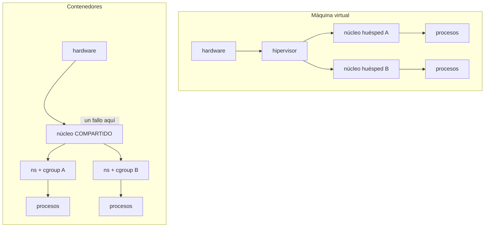

# 008 — Virtualización, hipervisores e imágenes

> [← Clase anterior](../../part-00-foundations-computing-networking-linux/007-linux-usuarios-permisos-servicios-y-logs/README.md) · [Índice de la parte](../README.md) · [Clase siguiente →](../../part-00-foundations-computing-networking-linux/009-apis-rest-autenticacion-y-contratos/README.md)

**Parte:** 00 — Fundamentos de computación, redes y Linux<br>
**Nivel:** inicial · **Horas estimadas:** 4<br>
**Laboratorio:** `virtualization` · **Estado:** `EXECUTABLE_CORE`

## 🎯 Propósito

Distinguir los tres mecanismos que la industria llama «virtualización» —máquinas virtuales, contenedores y microVM— por lo que realmente aíslan y lo que realmente cuestan. Sin esa distinción, la elección entre EC2, Fargate y Lambda en la parte 17 se hace por moda; con ella, se hace por requisito de aislamiento y perfil de arranque.

## 📚 Resultados de aprendizaje

Al finalizar podrás:

1. **Explicar** qué aísla un hipervisor que un espacio de nombres no, y qué superficie de ataque queda en cada caso.
2. **Comparar** tiempo de arranque, sobrecarga y densidad de VM, contenedor y microVM con órdenes de magnitud.
3. **Justificar** el uso de microVM cuando se ejecuta código de terceros no confiable.
4. **Describir** cómo el almacenamiento por capas hace que 50 contenedores de la misma imagen ocupen poco más que uno.
5. **Reconocer** que una imagen es una lista ordenada de capas más un manifiesto, y por qué el digest es su única referencia inmutable.

## 🧩 Conceptos centrales

| Concepto | Comprensión verificable |
|---|---|
| `hipervisor` | Capa que presenta hardware virtual a varios sistemas operativos huésped. De tipo 1 corre sobre el hardware desnudo; de tipo 2, sobre un sistema anfitrión. El aislamiento lo impone la CPU, no el software. |
| `espacio de nombres` | Mecanismo del núcleo Linux que da a un grupo de procesos su propia vista de un recurso: PID, red, montajes, usuarios. Aísla lo que se ve, no lo que se ejecuta: el núcleo sigue siendo compartido. |
| `cgroup` | Subsistema que limita y contabiliza CPU, memoria y E/S de un grupo de procesos. Complementa a los espacios de nombres: estos aíslan la vista y aquel reparte el recurso. |
| `microVM` | Máquina virtual reducida al mínimo dispositivo emulado para arrancar en decenas de milisegundos. Combina el aislamiento de hardware del hipervisor con un perfil de arranque cercano al del contenedor. |
| `capa` | Conjunto de diferencias del sistema de ficheros, inmutable y direccionado por su digest. Las imágenes que comparten una capa base la almacenan y descargan una sola vez. |

## 🧠 Modelo mental

Antes de alquilar infraestructura remota, aprende a observar una computadora local como un conjunto de procesos, redes, archivos, identidades y recursos medibles.

Aplicado a esta clase, separa siempre cuatro planos: **intención** (qué necesita el usuario),
**configuración** (qué declaramos), **estado observado** (qué existe de verdad) y
**evidencia** (cómo sabemos que cumple). Confundirlos produce diseños que se ven correctos
en un diagrama pero fallan al operar.

## 🗺️ Flujo de razonamiento



## 📖 Desarrollo

### 1. Dos aislamientos que no son comparables

La diferencia decisiva cabe en una frase: **una máquina virtual tiene su propio núcleo; un contenedor comparte el del anfitrión.**

En una VM, el huésped ejecuta su núcleo y el hipervisor le presenta hardware virtual. El aislamiento lo hace cumplir la propia CPU mediante extensiones de virtualización (Intel VT-x, AMD-V): para escapar hay que romper el hipervisor, que expone una interfaz reducida.

En un contenedor no hay huésped. Son procesos normales del anfitrión con una vista restringida por espacios de nombres y un reparto impuesto por cgroups. La superficie de ataque es **toda la interfaz de llamadas al sistema del núcleo Linux**: más de 300 llamadas, algunas con historial de vulnerabilidades de escalada.

```bash
$ docker run --rm alpine uname -r
6.8.0-45-generic          # el núcleo del anfitrión, no de la imagen
$ uname -r
6.8.0-45-generic          # idéntico
```

La imagen aporta bibliotecas y binarios; **el núcleo siempre es el del anfitrión**. De ahí tres consecuencias que reaparecerán en la parte 05: no se pueden ejecutar contenedores Windows sobre un núcleo Linux; un contenedor no puede cargar módulos; y una vulnerabilidad del núcleo afecta simultáneamente a todos los contenedores de esa máquina.

### 2. El coste del aislamiento, en números

Los órdenes de magnitud, no las cifras exactas, son lo que hay que retener:

| | Máquina virtual | Contenedor | microVM (Firecracker) |
|---|---|---|---|
| Arranque | 30-60 s | 50-200 ms | ~125 ms |
| Sobrecarga de memoria | 512 MB-2 GB | ~1-10 MB | < 5 MB |
| Densidad por host | decenas | miles | miles |
| Aislamiento | hardware | núcleo compartido | hardware |
| Núcleo | propio | del anfitrión | propio, reducido |

Una VM arranca lento porque hace lo mismo que una máquina física: firmware, cargador, núcleo, `init`, servicios. Un contenedor solo ejecuta un proceso más con una vista distinta.

**Firecracker** rompe la disyuntiva: elimina casi todos los dispositivos emulados —sin BIOS, sin USB, sin VGA— y deja solo lo mínimo. Arranca en unos 125 ms con menos de 5 MB de sobrecarga, y mantiene el aislamiento por hardware. Por eso AWS lo usa bajo Lambda y Fargate: **ejecutan código de clientes distintos en el mismo host y el aislamiento por núcleo compartido no sería aceptable**.

La regla de decisión: si ejecutas **tu** código, el contenedor basta. Si ejecutas código **de terceros que no controlas**, necesitas frontera de hardware.

### 3. Espacios de nombres y cgroups: qué aísla cada cosa

Un contenedor no es una primitiva del núcleo. Es la combinación de varios mecanismos independientes que se pueden usar por separado:

| Espacio de nombres | Aísla |
|---|---|
| `pid` | La tabla de procesos: dentro, tu proceso es el PID 1 |
| `net` | Interfaces, rutas, reglas de firewall y puertos |
| `mnt` | El árbol de montajes visible |
| `uts` | Nombre de host y de dominio |
| `ipc` | Colas de mensajes y memoria compartida |
| `user` | El mapeo de UID: root dentro puede ser un UID sin privilegios fuera |
| `cgroup` | La vista de la propia jerarquía de cgroups |

Se ven directamente:

```bash
$ docker run --rm -d --name demo alpine sleep 300
$ pid=$(docker inspect -f '{{.State.Pid}}' demo)
$ sudo ls -l /proc/$pid/ns/
lrwxrwxrwx net -> 'net:[4026532501]'      # espacio propio
lrwxrwxrwx pid -> 'pid:[4026532503]'
lrwxrwxrwx user -> 'user:[4026531837]'    # el MISMO del anfitrión
```

Ese último renglón es el hallazgo importante: por defecto **el espacio de usuarios no está aislado**, así que el UID 0 dentro del contenedor es el UID 0 del anfitrión. Si el proceso escapa, escapa como root. Activar `user` remapea root a un UID sin privilegios y es la mitigación más rentable frente a una fuga.

Los cgroups son la otra mitad: sin un límite de memoria, un contenedor consume la del anfitrión y el OOM killer mata **al que más memoria use**, que puede ser otro contenedor inocente. Ese es el origen del código 137 de la clase 002.

### 4. Capas: por qué 50 contenedores caben en el disco de uno

Una imagen es una **lista ordenada de capas inmutables**, cada una nombrada por el digest de su contenido, más un manifiesto que las enumera. Al arrancar, el runtime apila esas capas en solo lectura y añade encima una capa de escritura propia del contenedor, mediante *copy-on-write* con OverlayFS.

```bash
$ docker image inspect cloudshop:2.4 -f '{{range .RootFS.Layers}}{{println .}}{{end}}'
sha256:8e012198eba1...      # base: alpine 3.20
sha256:4f2a9c73b8d5...      # dependencias
sha256:7d2b8e91c4a2...      # aplicación
```

Si 50 contenedores usan esta imagen, las tres capas base se almacenan **una vez**. Cada contenedor solo añade lo que escribe:

```text
imagen                      180 MB   (compartida por los 50)
capa de escritura por contenedor ~2 MB
---------------------------------------------
50 contenedores              180 + 50×2 = 280 MB
50 VM con el mismo software  50 × 180  = 9.000 MB
```

De aquí sale una regla de construcción que dominará la parte 05: **ordena las capas de menos a más volátil**. Si copias el código antes de instalar dependencias, cualquier cambio de una línea invalida la capa de dependencias y obliga a reconstruirla y redescargarla entera.

Y de aquí sale también por qué el digest importa: una etiqueta como `:2.4` es mutable —puede reapuntarse mañana— mientras que `sha256:...` identifica exactamente ese contenido. Es la misma distinción entre rama y commit de la clase 003.

### 5. Qué elegir, y con qué criterio

La decisión se toma con dos preguntas, en este orden:

**1. ¿De quién es el código que se ejecuta?**
- Propio o auditado → contenedor.
- De terceros, sin auditar, o multi-cliente → frontera de hardware: VM o microVM.

**2. ¿Qué perfil de arranque exige la carga?**
- Larga vida, estado en disco, núcleo específico → VM.
- Efímera, escalado por ráfagas, sin estado → contenedor o microVM.

| Situación | Elección | Por qué |
|---|---|---|
| API propia con escalado horizontal | Contenedor | Arranque rápido, densidad alta, código confiable |
| Ejecutar plugins de clientes | microVM | Frontera de hardware entre inquilinos |
| Base de datos con disco y ajuste de núcleo | VM | Control del núcleo y del almacenamiento |
| Trabajo por lotes de minutos | Contenedor | Sobrecarga de arranque despreciable |
| Función invocada miles de veces por segundo | microVM | Aislamiento sin pagar 30 s de arranque |

Lo que **no** es criterio válido: «los contenedores son más modernos». Un contenedor y una VM resuelven problemas de aislamiento distintos, y el coste de equivocarse no aparece en las pruebas: aparece cuando alguien escapa del núcleo compartido.

## 🔬 Ejemplo trabajado

**CloudShop quiere ofrecer reglas de descuento programables por sus comercios: cada uno sube un fragmento de código que se ejecuta en cada compra.** El equipo propone contenedores «porque ya usamos Kubernetes». Se evalúa con las dos preguntas.

Pregunta 1 — ¿de quién es el código? De terceros y sin auditar. El aislamiento por núcleo compartido pone en juego toda la interfaz de llamadas al sistema:

```bash
$ docker run --rm alpine sh -c 'grep -c . /proc/kallsyms; ls /proc/sys/kernel | wc -l'
#  la superficie visible es la del núcleo del anfitrión
```

Se cuantifica el riesgo con datos, no con opinión. Escapes históricos por CVE de contenedores conocidos: CVE-2019-5736 (reescritura de `runc` desde el contenedor), CVE-2022-0492 (escalada por cgroups v1), CVE-2024-21626 (fuga de descriptor en `runc`). Todos permitieron ejecución en el anfitrión desde dentro.

Pregunta 2 — ¿qué perfil de arranque? Una regla se ejecuta por compra: **hasta 600 invocaciones por segundo en pico**, de unos 20 ms cada una. Una VM clásica queda descartada por aritmética:

```text
arranque de VM      ≈ 40 s
trabajo útil        ≈ 0,02 s
sobrecarga          = 40 / 0,02 = 2.000x    inviable
```

Y el modelo de preaprovisionamiento tampoco cierra:

```text
600 inv/s × 0,02 s = 12 ejecuciones concurrentes en media
VM preaprovisionadas para pico (×3)        = 36 VM permanentes
memoria: 36 × 1 GB de sobrecarga           = 36 GB solo de hipervisor
```

Con microVM:

```text
arranque de microVM ≈ 0,125 s
sobrecarga          = 0,125 / 0,02 = 6,25x   asumible con reutilización
memoria: 36 × 5 MB                          = 180 MB
```

**180 MB frente a 36 GB, con el mismo aislamiento de hardware.** Ese factor de 200 es lo que hace viable el producto.

Decisión registrada: **microVM por comercio, reutilizada entre invocaciones del mismo comercio y destruida al cambiar de comercio.** El contenedor se descarta no por rendimiento —sería mejor— sino porque el requisito es *ejecutar código no confiable de inquilinos distintos*, y ahí el núcleo compartido no es una frontera aceptable.

Límite explícito de la decisión: si en el futuro el código dejara de ser de terceros —por ejemplo, si se pasara a un lenguaje de reglas restringido que no permite ejecución arbitraria— la pregunta 1 cambiaría de respuesta y el contenedor volvería a ser correcto.

## 🧪 Laboratorio guiado

Ejecuta desde la raíz:

```bash
python classes/part-00-foundations-computing-networking-linux/008-virtualizacion-hipervisores-e-imagenes/lab.py
```

El laboratorio selecciona el motor de práctica **`virtualization`** y produce
`lab_result.json`. El escenario, sus comprobaciones y el artefacto esperado corresponden a
esta clase; no requiere credenciales y deja explícito qué debe revalidarse en un sandbox real.

1. Lee `exercise.steps` y formula una predicción antes de ejecutar.
2. Ejecuta la práctica y verifica todos los elementos de `checks`.
3. Provoca el caso de `negative_test` y explica la señal observada.
4. Materializa `comparativa-de-aislamiento` en `evidence/` usando la plantilla indicada.
5. Para proveedor real, sigue `sandbox.requires`, registra costo y ejecuta `destroy`.

### Evidencia esperada

El artefacto principal es una comparación medida de aislamiento y consumo. Además, la entrega debe incluir el comando ejecutado,
la salida estructurada y una conclusión que no exceda lo observado.

## 🏆 Reto verificable

Construye **`comparativa-de-aislamiento`** para el caso CloudShop. Incluye una alternativa descartada,
un supuesto que pueda falsarse, una prueba de fallo y una decisión de rollback.

## ✅ Criterio de aceptación

- [ ] `lab.py` termina con código 0 y genera JSON válido.
- [ ] La entrega conecta al menos tres requisitos con mecanismos verificables.
- [ ] Existe una prueba positiva y una prueba negativa con evidencia.
- [ ] Seguridad, costo y operación aparecen como decisiones, no como anexos.
- [ ] Se declara una limitación y una condición que obligaría a revisar el diseño.
- [ ] Otra persona puede repetir el recorrido sin conocimiento tácito.

## ⚠️ Errores frecuentes

| Síntoma | Causa probable | Corrección |
|---|---|---|
| Se ejecuta código de terceros en contenedores compartiendo núcleo | Se confundió aislamiento de vista con aislamiento de seguridad | Para código no confiable usa frontera de hardware: microVM o VM dedicada. |
| Un contenedor comprometido da acceso root al anfitrión | El espacio de nombres de usuario no estaba activado, así que UID 0 dentro es UID 0 fuera | Activa el remapeo de usuarios y ejecuta el proceso con un UID sin privilegios. |
| Un contenedor consume toda la memoria y el núcleo mata a otro distinto | No había límite de cgroup: el OOM killer elige por consumo, no por culpa | Define límites de memoria en todos los contenedores, no solo en los sospechosos. |
| Cada cambio de una línea de código reconstruye y redescarga cientos de MB | El código se copió antes de instalar dependencias e invalida la capa de estas | Ordena las capas de menos a más volátil: dependencias primero, código al final. |
| Un despliegue reproducible deja de serlo sin que nadie cambie nada | Se referenció la imagen por etiqueta mutable en vez de por digest | Fija `imagen@sha256:...` en todo lo que deba ser reproducible. |

## 🛡️ Seguridad, ética y costo

Trabaja con cuentas propias o sandboxes autorizados. No publiques secretos, identificadores
reales ni datos personales. Antes de crear recursos pagos define presupuesto, etiquetas y
comando de destrucción; después verifica que no queden recursos huérfanos. Los ejemplos
locales enseñan contratos, pero no certifican cumplimiento ni disponibilidad de producción.

## ❓ Preguntas de comprobación

1. ¿Qué aísla un hipervisor que un espacio de nombres no, y qué superficie de ataque queda en cada caso?
2. ¿Por qué no se pueden ejecutar contenedores Windows sobre un núcleo Linux, si la imagen trae todas sus bibliotecas?
3. Una carga se invoca 600 veces por segundo y dura 20 ms. ¿Por qué una VM clásica es inviable y una microVM no?
4. Por defecto, ¿qué UID del anfitrión corresponde a root dentro de un contenedor, y qué mitigación lo cambia?
5. ¿Por qué 50 contenedores de la misma imagen no ocupan 50 veces su tamaño en disco?

## 🔗 Referencias

- Agache, A. et al. (2020). *Firecracker: Lightweight Virtualization for Serverless Applications*. USENIX NSDI — cifras de arranque y sobrecarga. <https://www.usenix.org/conference/nsdi20/presentation/agache>
- Kerrisk, M. *namespaces(7)* — los siete espacios de nombres de Linux y su semántica. <https://man7.org/linux/man-pages/man7/namespaces.7.html>
- Kerrisk, M. *cgroups(7)* — límites, contabilidad y jerarquía de control de recursos. <https://man7.org/linux/man-pages/man7/cgroups.7.html>
- Open Container Initiative (2024). *Image Specification* — manifiesto, capas y direccionamiento por digest. <https://github.com/opencontainers/image-spec/blob/main/spec.md>
- Rice, L. (2020). *Container Security*, caps. 4-8 — espacios de nombres, capacidades y vectores de escape.
- Documentación oficial vigente del servicio implementado; registra URL y fecha de consulta.

---

> [Evaluación](assessment.md) · [Contrato de clase](lesson.yaml) · [Índice de la parte](../README.md)
