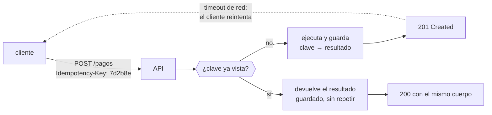

# 009 — APIs REST, autenticación y contratos

> [← Clase anterior](../../part-00-foundations-computing-networking-linux/008-virtualizacion-hipervisores-e-imagenes/README.md) · [Índice de la parte](../README.md) · [Clase siguiente →](../../part-00-foundations-computing-networking-linux/010-responsabilidad-compartida-y-pensamiento-de-riesgo/README.md)

**Parte:** 00 — Fundamentos de computación, redes y Linux<br>
**Nivel:** inicial · **Horas estimadas:** 4<br>
**Laboratorio:** `api` · **Estado:** `EXECUTABLE_CORE`

## 🎯 Propósito

Diseñar y consumir APIs HTTP tratando el contrato como la unidad que de verdad se despliega. Toda la nube se opera por API —la consola es solo un cliente más— y las decisiones de esta clase sobre idempotencia, paginación, autenticación y versionado son las que hacen que una automatización sobreviva a un reintento, a un fallo parcial y a un cambio del proveedor.

## 📚 Resultados de aprendizaje

Al finalizar podrás:

1. **Elegir** el método HTTP correcto a partir de sus propiedades de seguridad e idempotencia, no de la costumbre.
2. **Hacer idempotente** una operación que por naturaleza no lo es, mediante clave de idempotencia.
3. **Distinguir** autenticación de autorización y explicar qué prueba un token y qué no.
4. **Paginar** un conjunto grande sin perder ni duplicar elementos cuando la colección cambia durante el recorrido.
5. **Evolucionar** un contrato sin romper a los consumidores existentes, sabiendo qué cambio es compatible y cuál no.

## 🧩 Conceptos centrales

| Concepto | Comprensión verificable |
|---|---|
| `método seguro` | El que no altera el estado del servidor: GET, HEAD, OPTIONS. Permite que proxies y navegadores lo repitan o lo precarguen sin consecuencias, lo que a su vez prohíbe usar GET para operaciones con efecto. |
| `idempotencia` | Propiedad por la que N ejecuciones idénticas dejan el mismo estado que una. PUT y DELETE lo son por definición; POST no, y por eso necesita una clave explícita para poder reintentarse. |
| `clave de idempotencia` | Identificador único que el cliente genera y envía para que el servidor reconozca un reintento y devuelva el resultado original en vez de repetir el efecto. |
| `token portador` | Credencial que autoriza a quien la presente, sin más prueba. Quien lo roba lo puede usar: de ahí que su vida deba ser corta y su transporte siempre cifrado. |
| `cursor` | Marca opaca de posición en una colección, estable frente a inserciones y borrados. Sustituye al desplazamiento numérico, que salta o repite elementos cuando la colección cambia entre páginas. |

## 🧠 Modelo mental

Antes de alquilar infraestructura remota, aprende a observar una computadora local como un conjunto de procesos, redes, archivos, identidades y recursos medibles.

Aplicado a esta clase, separa siempre cuatro planos: **intención** (qué necesita el usuario),
**configuración** (qué declaramos), **estado observado** (qué existe de verdad) y
**evidencia** (cómo sabemos que cumple). Confundirlos produce diseños que se ven correctos
en un diagrama pero fallan al operar.

## 🗺️ Flujo de razonamiento



## 📖 Desarrollo

### 1. Los métodos tienen propiedades, no solo nombres

Elegir el método no es cuestión de estilo: sus propiedades determinan qué pueden hacer con la petición los proxies, los navegadores y las bibliotecas de reintento.

| Método | Seguro | Idempotente | Consecuencia práctica |
|---|---|---|---|
| GET | Sí | Sí | Cacheable; un proxy puede repetirlo sin avisar |
| HEAD | Sí | Sí | Como GET sin cuerpo; útil para comprobar existencia |
| PUT | No | **Sí** | Reintentable sin riesgo: sustituye el recurso entero |
| DELETE | No | **Sí** | Reintentable: borrar dos veces deja el mismo estado |
| POST | No | **No** | **No reintentable** sin protección adicional |
| PATCH | No | No garantizada | Depende del formato del parche |

La fila de GET explica un incidente clásico: exponer `GET /pedidos/42/cancelar` parece cómodo hasta que un precargador del navegador, un rastreador o un proxy lo visitan y cancelan pedidos que nadie pidió cancelar. **Si tiene efecto, no puede ser GET.**

Y la fila de POST explica el problema central de esta clase: es el único método común que no se puede reintentar con seguridad, y es justo el que se usa para crear pagos, pedidos y recursos.

### 2. Idempotencia: la propiedad que hace segura una red poco fiable

Un cliente envía `POST /pagos`, la red se corta antes de la respuesta y el cliente no sabe si el pago se ejecutó. Solo tiene dos opciones malas: reintentar y arriesgarse a cobrar dos veces, o no reintentar y arriesgarse a no cobrar.

La solución es que el **cliente** genere un identificador único por intención y lo repita en cada reintento:

```http
POST /pagos HTTP/1.1
Idempotency-Key: 7d2b8e91-c4a2-4f7d-9b3e-8a1c6f9d2b4e
Content-Type: application/json

{"pedido": "A-1042", "importe": "149.90", "moneda": "CLP"}
```

El servidor guarda la clave junto al resultado. Al recibirla de nuevo:

1. Si no la ha visto, ejecuta y persiste `clave → resultado` **en la misma transacción** que el efecto.
2. Si ya la vio y terminó, devuelve el resultado original sin repetir el cobro.
3. Si ya la vio y sigue en curso, responde `409 Conflict`.

El punto 1 es donde suele fallar la implementación: si el registro de la clave y el cobro no son atómicos, existe una ventana en la que el cobro ocurrió y la clave no se guardó, y el reintento cobra otra vez. **La clave debe persistirse en la misma transacción que el efecto que protege.**

Es el mismo mecanismo que en la parte 09 aparecerá como deduplicación en sistemas de mensajería, y por la misma razón: la entrega «exactamente una vez» no existe a nivel de red; se construye con idempotencia en el receptor.

### 3. Autenticación no es autorización

Son dos preguntas distintas y se resuelven en momentos distintos:

- **Autenticación**: ¿quién eres? Se resuelve una vez y produce una credencial.
- **Autorización**: ¿puedes hacer *esto* sobre *este* recurso? Se resuelve **en cada petición**.

Saltarse la segunda produce la vulnerabilidad más común de las APIs, catalogada como **BOLA** (*Broken Object Level Authorization*, primer puesto del OWASP API Security Top 10):

```python
# vulnerable: autentica pero no autoriza sobre el objeto
@app.get("/pedidos/{id}")
def ver(id: str, usuario = Depends(autenticar)):
    return db.pedidos.get(id)          # cualquiera autenticado ve CUALQUIER pedido

# correcto: la autorización es por objeto
@app.get("/pedidos/{id}")
def ver(id: str, usuario = Depends(autenticar)):
    pedido = db.pedidos.get(id)
    if pedido is None or pedido.cliente_id != usuario.cliente_id:
        raise HTTPException(404)        # 404, no 403: no revelar existencia
    return pedido
```

Devolver **404 en vez de 403** es deliberado: un 403 confirma que el recurso existe y permite enumerar identificadores ajenos. Es la misma lógica por la que un formulario de acceso no debe decir «esa contraseña es incorrecta» frente a «ese usuario no existe».

Los códigos correctos: **401** significa «no sé quién eres» y admite reintento con credenciales; **403** significa «sé quién eres y no puedes», y reintentar no ayuda.

### 4. Paginación: por qué el desplazamiento numérico pierde datos

`GET /pedidos?offset=100&limit=50` parece razonable y falla en cuanto la colección cambia durante el recorrido. Con orden descendente por fecha:

```text
t0  el cliente lee offset=0..49   (elementos 1-50)
t1  se insertan 3 pedidos nuevos al principio
t2  el cliente lee offset=50..99
    → los elementos 48, 49 y 50 se han desplazado y se REPITEN
    → si en vez de insertar se hubieran borrado 3, se PERDERÍAN
```

Y hay un segundo problema, de coste: `OFFSET 100000` obliga a la base de datos a leer y descartar cien mil filas antes de devolver la página. El coste crece linealmente con la profundidad.

La paginación por cursor usa una marca estable —la clave del último elemento— en vez de una posición:

```http
GET /pedidos?limit=50
{"datos": [...], "siguiente": "eyJ0IjoiMjAyNi0wOC0wMVQwOToxMiJ9"}

GET /pedidos?limit=50&cursor=eyJ0IjoiMjAyNi0wOC0wMVQwOToxMiJ9
```

La consulta pasa a ser `WHERE (creado, id) < (:t, :id) ORDER BY creado DESC, id DESC LIMIT 50`, que usa índice y **cuesta lo mismo en la página 1 que en la 10.000**. El cursor debe ser opaco para el cliente: si se documenta su estructura, se convierte en parte del contrato y ya no se puede cambiar.

El orden debe incluir un desempate único (`id`): sin él, dos filas con la misma marca de tiempo pueden repetirse o perderse en el corte de página.

### 5. Evolucionar sin romper: qué cambio es compatible

Un contrato desplegado tiene consumidores que no controlas. La distinción práctica:

| Cambio | ¿Compatible? | Por qué |
|---|---|---|
| Añadir un campo opcional a la respuesta | Sí | Los clientes ignoran lo que no conocen |
| Añadir un parámetro opcional | Sí | Su ausencia mantiene el comportamiento |
| Añadir un valor nuevo a un enumerado | **No** | Los clientes con `switch` exhaustivo fallan |
| Renombrar o eliminar un campo | No | Rotura directa |
| Cambiar un tipo (número → cadena) | No | Rotura de deserialización |
| Hacer obligatorio un campo opcional | No | Rotura para quien no lo enviaba |
| Endurecer una validación | No | Peticiones antes válidas empiezan a fallar |

La fila del enumerado es la que más sorprende: parece aditiva, pero un consumidor que hace exhaustivo sobre los valores conocidos falla al recibir uno nuevo. Por eso los contratos maduros documentan desde el principio que **los enumerados pueden crecer** y exigen un caso por defecto.

Cuando el cambio es incompatible, versionar. Y la regla que importa no es dónde poner la versión —ruta, cabecera o tipo de medio— sino **cuánto tiempo mantienes la anterior viva y cómo avisas**: una versión sin fecha de retirada publicada no es una versión, es deuda.

El campo `Deprecation` y `Sunset` (RFC 8594) permiten anunciarlo en la propia respuesta, para que el cliente se entere antes de romperse.

## 🔬 Ejemplo trabajado

**Durante una promoción, 1 de cada 400 clientes de CloudShop aparece cobrado dos veces.** El importe duplicado siempre coincide, y los dos cargos distan menos de 30 segundos.

La hipótesis es reintento sobre `POST` no idempotente. Se confirma en los logs:

```bash
$ jq -r 'select(.ruta=="/pagos") | [.trace, .pedido, .estado, .ms] | @tsv' pagos.jsonl | sort | head -4
4f2a9c  A-1042  timeout  30021
7d2b8e  A-1042  201      412
```

Dos trazas distintas para el mismo pedido: la primera agotó el plazo del cliente a los 30 s, **pero el servidor la completó** —el cargo existe— y el cliente reintentó con una petición nueva.

La aritmética del incidente:

```text
peticiones de pago en la promoción      48.000
timeout del cliente                       30 s
p99,8 de latencia del proveedor           31 s
peticiones que superan el timeout    ≈ 0,25 %  → 120
de ellas, completadas en el servidor ≈ 100 %  → 120 cobros dobles
observado                                       118
```

Cuadra: **el problema no es la tasa de error del proveedor, es que el timeout del cliente es menor que la cola de latencia del servidor.** Subir el timeout reduce la frecuencia pero no elimina la clase de fallo: siempre habrá una petición que se corte después de tener efecto.

Corrección con clave de idempotencia, generada por el cliente **una vez por intención** y reutilizada en los reintentos:

```python
clave = str(uuid.uuid4())            # fuera del bucle: la MISMA en cada reintento
for intento in range(3):
    try:
        r = sesion.post("/pagos", json=cuerpo,
                        headers={"Idempotency-Key": clave}, timeout=35)
        break
    except (TimeoutError, ConnectionError):
        time.sleep(2 ** intento + random.uniform(0, 1))
```

Y en el servidor, con la clave persistida en la **misma transacción** que el cargo:

```sql
BEGIN;
  INSERT INTO idempotencia (clave, estado) VALUES ($1, 'en_curso')
    ON CONFLICT (clave) DO NOTHING;
  -- si no insertó ninguna fila, es un reintento: devolver lo guardado
  INSERT INTO cargos (pedido, importe) VALUES ($2, $3);
  UPDATE idempotencia SET estado='hecho', respuesta=$4 WHERE clave=$1;
COMMIT;
```

Resultado tras el despliegue: **0 cobros dobles en 52.000 pagos** de la promoción siguiente, con 96 reintentos que devolvieron el resultado original en vez de repetir el cargo.

El detalle que decide todo es dónde se genera la clave: **fuera del bucle de reintento**. Generarla dentro produce una clave distinta por intento y deja el sistema exactamente igual de roto, con la ilusión de estar protegido.

## 🧪 Laboratorio guiado

Ejecuta desde la raíz:

```bash
python classes/part-00-foundations-computing-networking-linux/009-apis-rest-autenticacion-y-contratos/lab.py
```

El laboratorio selecciona el motor de práctica **`api`** y produce
`lab_result.json`. El escenario, sus comprobaciones y el artefacto esperado corresponden a
esta clase; no requiere credenciales y deja explícito qué debe revalidarse en un sandbox real.

1. Lee `exercise.steps` y formula una predicción antes de ejecutar.
2. Ejecuta la práctica y verifica todos los elementos de `checks`.
3. Provoca el caso de `negative_test` y explica la señal observada.
4. Materializa `cliente-api-verificado` en `evidence/` usando la plantilla indicada.
5. Para proveedor real, sigue `sandbox.requires`, registra costo y ejecuta `destroy`.

### Evidencia esperada

El artefacto principal es un contrato versionado con pruebas positivas y negativas. Además, la entrega debe incluir el comando ejecutado,
la salida estructurada y una conclusión que no exceda lo observado.

## 🏆 Reto verificable

Construye **`cliente-api-verificado`** para el caso CloudShop. Incluye una alternativa descartada,
un supuesto que pueda falsarse, una prueba de fallo y una decisión de rollback.

## ✅ Criterio de aceptación

- [ ] `lab.py` termina con código 0 y genera JSON válido.
- [ ] La entrega conecta al menos tres requisitos con mecanismos verificables.
- [ ] Existe una prueba positiva y una prueba negativa con evidencia.
- [ ] Seguridad, costo y operación aparecen como decisiones, no como anexos.
- [ ] Se declara una limitación y una condición que obligaría a revisar el diseño.
- [ ] Otra persona puede repetir el recorrido sin conocimiento tácito.

## ⚠️ Errores frecuentes

| Síntoma | Causa probable | Corrección |
|---|---|---|
| Se ejecutan acciones que nadie solicitó | Una operación con efecto se expuso como GET y la repitió un precargador o un proxy | GET debe ser seguro; usa POST, PUT o DELETE para cualquier cosa con efecto. |
| Un reintento tras timeout duplica un cobro | POST no es idempotente y no había clave de idempotencia | Genera la clave una vez por intención, fuera del bucle, y persístela en la misma transacción que el efecto. |
| Un usuario autenticado accede a datos de otro cambiando el identificador de la URL | Se autenticó pero no se autorizó por objeto (BOLA) | Comprueba la propiedad del recurso en cada petición y responde 404, no 403. |
| Un recorrido paginado repite o pierde elementos | Paginación por desplazamiento sobre una colección que cambia | Usa cursor opaco sobre una clave estable con desempate único. |
| Añadir un valor a un enumerado rompe consumidores en producción | Se asumió que todo cambio aditivo es compatible | Documenta desde el principio que los enumerados crecen y exige un caso por defecto en el cliente. |

## 🛡️ Seguridad, ética y costo

Trabaja con cuentas propias o sandboxes autorizados. No publiques secretos, identificadores
reales ni datos personales. Antes de crear recursos pagos define presupuesto, etiquetas y
comando de destrucción; después verifica que no queden recursos huérfanos. Los ejemplos
locales enseñan contratos, pero no certifican cumplimiento ni disponibilidad de producción.

## ❓ Preguntas de comprobación

1. ¿Por qué PUT y DELETE se pueden reintentar sin riesgo y POST no?
2. ¿En qué punto exacto debe persistirse la clave de idempotencia para que no quede una ventana de doble efecto?
3. Un usuario autenticado pide un recurso ajeno. ¿Por qué 404 es mejor respuesta que 403?
4. Explica con un ejemplo cómo la paginación por desplazamiento pierde un elemento cuando la colección cambia.
5. ¿Cuáles de estos cambios rompen a un consumidor: añadir un campo opcional, añadir un valor a un enumerado, hacer obligatorio un campo opcional?

## 🔗 Referencias

- Fielding, R. y Reschke, J., eds. (2022). *RFC 9110: HTTP Semantics*, secs. 9.2.1-9.2.2 — métodos seguros e idempotentes. <https://www.rfc-editor.org/rfc/rfc9110#section-9.2>
- Jena, J. et al. (2024). *The Idempotency-Key HTTP Header Field*, IETF draft — semántica y manejo de reintentos. <https://datatracker.ietf.org/doc/draft-ietf-httpapi-idempotency-key-header/>
- OWASP (2023). *API Security Top 10*, API1:2023 Broken Object Level Authorization. <https://owasp.org/API-Security/editions/2023/en/0xa1-broken-object-level-authorization/>
- Wilde, E. (2019). *RFC 8594: The Sunset HTTP Header Field* — anunciar la retirada de un contrato. <https://www.rfc-editor.org/rfc/rfc8594>
- Nottingham, M. (2022). *RFC 9205: Building Protocols with HTTP* — buenas prácticas de diseño sobre HTTP. <https://www.rfc-editor.org/rfc/rfc9205>
- Documentación oficial vigente del servicio implementado; registra URL y fecha de consulta.

---

> [Evaluación](assessment.md) · [Contrato de clase](lesson.yaml) · [Índice de la parte](../README.md)
