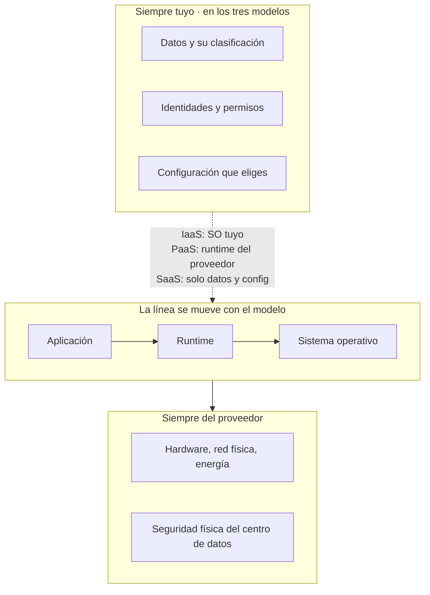

# 010 — Responsabilidad compartida y pensamiento de riesgo

> [← 009 · APIs REST, autenticación y contratos](../../part-00-foundations-computing-networking-linux/009-apis-rest-autenticacion-y-contratos/README.md) · [Índice de la parte](../README.md) · [011 · Costo, energía, capacidad y medición básica →](../../part-00-foundations-computing-networking-linux/011-costo-energia-capacidad-y-medicion-basica/README.md)

**Parte:** 00 — Fundamentos de computación, redes y Linux<br>
**Nivel:** inicial · **Horas estimadas:** 4<br>
**Laboratorio:** `security` · **Estado:** `EXECUTABLE_CORE`

## 🎯 Propósito

Trazar con precisión dónde termina la responsabilidad del proveedor y empieza la tuya, y convertir esa línea en un método de análisis de riesgo aplicable antes de escribir infraestructura. Es la clase que explica por qué casi ningún incidente público «de la nube» fue del proveedor, y la que fija el criterio con el que se juzgarán todas las decisiones de las 278 clases restantes.

## 📚 Resultados de aprendizaje

Al finalizar podrás:

1. **Situar** cualquier control concreto del lado correcto de la línea según el modelo de servicio contratado.
2. **Distinguir** disponibilidad del servicio, durabilidad del dato y confidencialidad, y qué garantiza el proveedor de cada una.
3. **Leer** un SLA identificando qué mide, qué excluye y cuál es la compensación real.
4. **Aplicar** un método de análisis de riesgo que produzca controles verificables en vez de una lista de miedos.
5. **Calcular** el riesgo residual de una decisión y declararlo explícitamente en vez de dejarlo implícito.

## 🧩 Conceptos centrales

| Concepto | Comprensión verificable |
|---|---|
| `responsabilidad compartida` | Reparto contractual de controles entre proveedor y cliente. El proveedor responde de la seguridad *de* la nube; el cliente, de la seguridad *en* la nube. La línea se mueve con el modelo de servicio, nunca desaparece. |
| `SLA` | Compromiso contractual con una métrica, un umbral y una compensación. Casi siempre mide disponibilidad del plano de servicio y excluye lo que más duele: tus datos, tu configuración y tu lucro cesante. |
| `durabilidad` | Probabilidad de que un objeto almacenado siga existiendo tras un periodo. Es independiente de la disponibilidad: un dato puede ser durable y estar inaccesible, o estar disponible y haber sido borrado por ti. |
| `riesgo residual` | Lo que queda después de aplicar los controles. No es un fallo del análisis: es el resultado esperado. Un diseño honesto lo nombra y dice quién lo acepta. |
| `radio de impacto` | Alcance de lo que se rompe cuando algo falla. Reducirlo —por celdas, cuentas o regiones— suele ser más barato y más eficaz que intentar evitar el fallo. |

## 🧠 Modelo mental

Antes de alquilar infraestructura remota, aprende a observar una computadora local como un conjunto de procesos, redes, archivos, identidades y recursos medibles.

Aplicado a esta clase, separa siempre cuatro planos: **intención** (qué necesita el usuario),
**configuración** (qué declaramos), **estado observado** (qué existe de verdad) y
**evidencia** (cómo sabemos que cumple). Confundirlos produce diseños que se ven correctos
en un diagrama pero fallan al operar.

## 🗺️ Flujo de razonamiento



## 📖 Desarrollo

### 1. Lo que nunca cambia de lado

El modelo de servicio mueve la línea, pero **tres cosas permanecen siempre del lado del cliente**, en IaaS, en PaaS y en SaaS:

1. **Los datos**: qué guardas, cómo los clasificas y cuánto tiempo los conservas.
2. **Las identidades y sus permisos**: quién puede hacer qué.
3. **La configuración que eliges**: si un bucket es público, lo hiciste público tú.

Esto explica un hecho incómodo: la inmensa mayoría de las brechas atribuidas públicamente a «la nube» fueron **configuraciones del cliente**, no fallos del proveedor. Almacenamiento expuesto sin autenticación, claves de acceso subidas a un repositorio público, permisos comodín concedidos «temporalmente» hace dos años.

Gartner lleva años sosteniendo la misma proyección: hasta 2025, en torno al **99 % de los fallos de seguridad en la nube serán culpa del cliente**. El dato importa menos que su consecuencia de diseño: **el trabajo de seguridad no está en elegir proveedor, está en el lado que te toca**.

El error simétrico también existe: asumir que nada hace el proveedor. El cifrado del disco físico, la destrucción segura de medios, el control de acceso al centro de datos y el parcheo del hipervisor no son tuyos y no deberías replicarlos.

### 2. Disponibilidad, durabilidad y confidencialidad son tres cosas distintas

Se confunden a diario y cada una tiene garantías, riesgos y controles diferentes:

| Propiedad | Pregunta | Garantía típica | Qué la rompe |
|---|---|---|---|
| Disponibilidad | ¿Puedo acceder ahora? | 99,9 %-99,99 % en SLA | Caída de zona, saturación, error de red |
| Durabilidad | ¿Seguirá existiendo? | 99,999999999 % anual (11 nueves) | **Un borrado tuyo**, no un fallo de disco |
| Confidencialidad | ¿Solo lo ve quien debe? | No hay SLA | Configuración, permisos, fuga de credenciales |

Los **once nueves** de durabilidad de un almacenamiento de objetos significan que la probabilidad anual de perder un objeto dado por fallo de infraestructura es 10⁻¹¹. Con 10 millones de objetos:

```text
pérdida esperada = 10.000.000 × 10⁻¹¹ = 0,0001 objetos al año
                 ≈ 1 objeto cada 10.000 años
```

Y sin embargo se pierden datos constantemente. La razón es que **la durabilidad no protege del borrado autorizado**: un `DELETE` con credenciales válidas, un ciclo de vida mal configurado o un ransomware con tus permisos destruyen el objeto sin que la infraestructura falle en absoluto.

De ahí que la copia de seguridad siga siendo tuya, con dos propiedades que la durabilidad no da: **versionado** —para volver atrás— e **inmutabilidad** —para que ni tus propias credenciales puedan borrarla—. Se retoma en la parte 21.

### 3. Leer un SLA por lo que excluye

Un SLA tiene tres partes y la tercera casi nunca es la que se recuerda:

1. **Métrica y umbral**: por ejemplo, 99,99 % mensual de disponibilidad del servicio.
2. **Compensación**: un porcentaje de crédito sobre lo facturado de *ese* servicio.
3. **Exclusiones**: lo que no cuenta como indisponibilidad.

La aritmética del umbral, en un mes de 30 días:

```text
99,9 %   → 43,2 min de caída permitida al mes
99,95 %  → 21,6 min
99,99 %  →  4,3 min
99,999 % →   26 s
```

El salto de 99,9 a 99,99 no es «un poco mejor»: exige reducir la ventana de fallo **diez veces**, lo que en la práctica obliga a redundancia entre zonas y a automatizar la conmutación, porque ninguna intervención humana cabe en 4,3 minutos.

Las exclusiones habituales, que conviene buscar antes de firmar:

- Indisponibilidad por **tu configuración** o tu código.
- Ventanas de mantenimiento anunciadas.
- Fuerza mayor y fallos de tu proveedor de red.
- Servicios en vista previa o beta.

Y la exclusión que más importa: **la compensación es un crédito de servicio, no una indemnización**. Si una caída de 4 horas te cuesta 80.000 USD en ventas, el SLA te devuelve un porcentaje de lo que pagaste por ese servicio ese mes —quizá 200 USD—. **El SLA no transfiere tu riesgo de negocio: acota el del proveedor.** Tu continuidad la pagas tú, con arquitectura.

### 4. Un método de riesgo que produce controles, no miedos

Una lista de amenazas sin estructura no sirve para decidir. Cinco preguntas, en orden, sí:

1. **¿Qué protegemos?** El activo, con su clasificación. «La base de datos» no es un activo; «los datos personales de clientes, categoría alta» sí.
2. **¿De quién y de qué?** Actor y capacidad: un atacante externo sin credenciales, un empleado con acceso legítimo, un error de operación, un fallo de infraestructura.
3. **¿Por dónde?** El vector concreto: credencial filtrada, permiso excesivo, dependencia comprometida, error de configuración.
4. **¿Qué control lo corta?** Preventivo, detectivo o correctivo, y **verificable**.
5. **¿Qué queda?** El riesgo residual, nombrado y aceptado por alguien con autoridad para aceptarlo.

La columna que separa un análisis útil de un documento decorativo es la cuarta: **cada control debe tener una prueba**. «Cifrado en tránsito» no es un control; «TLS 1.2 mínimo, verificado por una prueba automática que falla el despliegue si se acepta TLS 1.0» sí lo es.

Y los tres tipos no son intercambiables. Un control **preventivo** que falle en silencio es peor que uno **detectivo** que avise: el primero da confianza falsa. Por eso todo control preventivo necesita una prueba negativa —comprobar que efectivamente deniega— que es exactamente lo que hacen los `lab.py` de este programa.

### 5. Radio de impacto: contener sale más barato que evitar

Los fallos ocurren. La pregunta de diseño no es cómo evitarlos todos, sino **qué se rompe cuando ocurren**.

```text
Una cuenta, todo junto:        1 credencial comprometida → todo el negocio
Cuentas separadas por entorno: 1 credencial comprometida → un entorno
Cuentas por dominio + entorno: 1 credencial comprometida → un dominio de un entorno
```

La separación no impide la brecha; **acota su alcance**, y eso suele ser mucho más barato que intentar hacer la brecha imposible. Es el mismo razonamiento de la clase 007 sobre capacidades: no «qué necesita para funcionar», sino «qué obtiene quien lo comprometa».

Tres preguntas que hay que poder responder de cualquier diseño:

- **¿Qué se rompe si esto falla?** Si la respuesta es «todo», el diseño tiene un punto único de fallo aunque el componente sea redundante.
- **¿Cuánto tarda en detectarse?** Un fallo silencioso de días es peor que una caída ruidosa de minutos.
- **¿Se puede revertir?** Un cambio irreversible exige un nivel de control distinto al de uno reversible.

Estas tres preguntas son el guion de los ADR de la parte 12 y de los game days de la parte 21.

## 🔬 Ejemplo trabajado

**Un informe de exposición avisa a CloudShop de que un bucket con facturas de clientes es accesible sin autenticación.** El equipo quiere responder «el proveedor garantiza cifrado y once nueves». Se aplica el método.

**1. ¿Qué protegemos?** 412.000 facturas en PDF con nombre, RUT, dirección y detalle de compra. Clasificación: datos personales, categoría alta. Retención legal: 6 años.

**2. ¿De quién?** Actor externo sin credenciales. No hace falta más: el objeto es legible por cualquiera con la URL.

**3. ¿Por dónde?** Se reconstruye el vector:

```bash
$ aws s3api get-bucket-policy --bucket cloudshop-facturas | jq -r '.Policy' | jq '.Statement[0]'
{"Effect": "Allow", "Principal": "*", "Action": "s3:GetObject", ...}
$ aws cloudtrail lookup-events --lookup-attributes \
    AttributeKey=EventName,AttributeValue=PutBucketPolicy --max-items 1 \
    | jq -r '.Events[0] | "\(.EventTime) \(.Username)"'
2024-11-14T16:22:08Z  ci-deploy-role
```

**La política la puso un despliegue hace 21 meses.** El cifrado en reposo estaba activo todo el tiempo y no sirvió de nada: cifra frente a quien acceda al disco físico, no frente a quien hace una petición autorizada por la política. La durabilidad de once nueves tampoco: garantiza que el objeto no se pierda, no que no se lea.

Cuantificación de la exposición:

```text
objetos legibles                     412.000
ventana                21 meses ≈ 638 días
peticiones GET anónimas en los logs   1.847  (de 12 IP distintas)
```

**4. ¿Qué controles, y cómo se verifican?**

| Tipo | Control | Prueba |
|---|---|---|
| Preventivo | Bloqueo de acceso público a nivel de cuenta | Prueba negativa: intentar publicar y comprobar que falla |
| Preventivo | Política de organización que prohíbe `Principal: "*"` | Despliegue de prueba que debe ser rechazado |
| Detectivo | Alerta sobre cualquier `PutBucketPolicy` | Ejecutarla y verificar que notifica en < 5 min |
| Correctivo | Versionado + retención inmutable | Restaurar un objeto borrado en un simulacro |

Cada fila tiene una prueba ejecutable. La segunda columna sin la tercera es una intención, no un control.

**5. ¿Qué riesgo queda?** Los datos estuvieron expuestos 638 días y **eso no se puede revertir**: hay que asumir que fueron copiados y actuar en consecuencia —notificación a los afectados y a la autoridad, según la normativa aplicable—. Además, un operador con permiso legítimo sigue pudiendo exportarlos; ese riesgo se acota con registro de acceso y revisión periódica, no se elimina.

**La conclusión que importa: ni el cifrado ni la durabilidad protegían de esto, porque ninguno de los dos estaba del lado del problema.** El control que faltaba era de configuración, y la configuración es siempre del cliente en los tres modelos de servicio.

## 🧪 Laboratorio guiado

Ejecuta desde la raíz:

```bash
python classes/part-00-foundations-computing-networking-linux/010-responsabilidad-compartida-y-pensamiento-de-riesgo/lab.py
```

El laboratorio selecciona el motor de práctica **`security`** y produce
`lab_result.json`. El escenario, sus comprobaciones y el artefacto esperado corresponden a
esta clase; no requiere credenciales y deja explícito qué debe revalidarse en un sandbox real.

1. Lee `exercise.steps` y formula una predicción antes de ejecutar.
2. Ejecuta la práctica y verifica todos los elementos de `checks`.
3. Provoca el caso de `negative_test` y explica la señal observada.
4. Materializa `matriz-de-responsabilidad` en `evidence/` usando la plantilla indicada.
5. Para proveedor real, sigue `sandbox.requires`, registra costo y ejecuta `destroy`.

### Evidencia esperada

El artefacto principal es un control con amenaza, mitigación y evidencia. Además, la entrega debe incluir el comando ejecutado,
la salida estructurada y una conclusión que no exceda lo observado.

## 🏆 Reto verificable

Construye **`matriz-de-responsabilidad`** para el caso CloudShop. Incluye una alternativa descartada,
un supuesto que pueda falsarse, una prueba de fallo y una decisión de rollback.

## ✅ Criterio de aceptación

- [ ] `lab.py` termina con código 0 y genera JSON válido.
- [ ] La entrega conecta al menos tres requisitos con mecanismos verificables.
- [ ] Existe una prueba positiva y una prueba negativa con evidencia.
- [ ] Seguridad, costo y operación aparecen como decisiones, no como anexos.
- [ ] Se declara una limitación y una condición que obligaría a revisar el diseño.
- [ ] Otra persona puede repetir el recorrido sin conocimiento tácito.

## ⚠️ Errores frecuentes

| Síntoma | Causa probable | Corrección |
|---|---|---|
| Se asume que el cifrado del proveedor protege los datos de un acceso indebido | El cifrado en reposo protege frente al disco físico, no frente a una petición autorizada | Separa los controles por propiedad: confidencialidad se protege con permisos y política, no con cifrado en reposo. |
| Se confía en los once nueves de durabilidad como estrategia de respaldo | La durabilidad no protege del borrado autorizado, que es la causa real de pérdida | Añade versionado y retención inmutable; son tuyos, no del proveedor. |
| Tras una caída larga, el SLA compensa una fracción mínima de la pérdida | La compensación es un crédito sobre lo facturado de ese servicio, no una indemnización | Dimensiona la continuidad con arquitectura; el SLA acota el riesgo del proveedor, no el tuyo. |
| El análisis de riesgo es una lista de amenazas que nadie usa para decidir | No llegó a controles verificables ni nombró el riesgo residual | Exige a cada control una prueba ejecutable y un responsable que acepte lo que queda. |
| Una credencial comprometida da acceso a todo el negocio | No hay separación de cuentas ni entornos: el radio de impacto es total | Separa por entorno y dominio; contener el alcance es más barato que evitar la brecha. |

## 🛡️ Seguridad, ética y costo

Trabaja con cuentas propias o sandboxes autorizados. No publiques secretos, identificadores
reales ni datos personales. Antes de crear recursos pagos define presupuesto, etiquetas y
comando de destrucción; después verifica que no queden recursos huérfanos. Los ejemplos
locales enseñan contratos, pero no certifican cumplimiento ni disponibilidad de producción.

## ❓ Preguntas de comprobación

1. ¿Qué tres responsabilidades siguen siendo del cliente en IaaS, PaaS y SaaS por igual?
2. Un almacenamiento con once nueves de durabilidad pierde datos de un cliente. ¿Cómo es posible sin que falle la infraestructura?
3. ¿Cuántos minutos de caída mensual permite un SLA de 99,99 %, y por qué eso descarta la intervención humana?
4. Un control dice «cifrado en tránsito». ¿Qué le falta para ser verificable?
5. ¿Por qué un control preventivo que falla en silencio es peor que uno detectivo?

## 🔗 Referencias

- AWS (2024). *Shared Responsibility Model* — reparto de controles por modelo de servicio. <https://aws.amazon.com/compliance/shared-responsibility-model/>
- Microsoft (2024). *Shared responsibility in the cloud* — tabla comparada IaaS/PaaS/SaaS. <https://learn.microsoft.com/en-us/azure/security/fundamentals/shared-responsibility>
- Cloud Security Alliance (2024). *Top Threats to Cloud Computing* — taxonomía de amenazas con incidentes documentados. <https://cloudsecurityalliance.org/research/topics/top-threats>
- Shostack, A. (2014). *Threat Modeling: Designing for Security* — las cuatro preguntas y el uso de STRIDE.
- NIST (2018). *Framework for Improving Critical Infrastructure Cybersecurity* v1.1 — funciones identificar, proteger, detectar, responder y recuperar. <https://doi.org/10.6028/NIST.CSWP.04162018>
- Documentación oficial vigente del servicio implementado; registra URL y fecha de consulta.

---

> [Evaluación](assessment.md) · [Contrato de clase](lesson.yaml) · [Índice de la parte](../README.md)

**📥 Descargar:** [Parte 00 en PDF](../../../site/downloads/partes/manual-parte-00-foundations-computing-networking-linux.pdf) · [Manual integral](../../../site/downloads/multi-cloud-engineering-manual-v2.0.pdf)

| Anterior | Índice | Siguiente |
|---|---|---|
| [← 009 · APIs REST, autenticación y contratos](../../part-00-foundations-computing-networking-linux/009-apis-rest-autenticacion-y-contratos/README.md) | [Parte 00](../README.md) · [Programa](../../README.md) | [011 · Costo, energía, capacidad y medición básica →](../../part-00-foundations-computing-networking-linux/011-costo-energia-capacidad-y-medicion-basica/README.md) |
