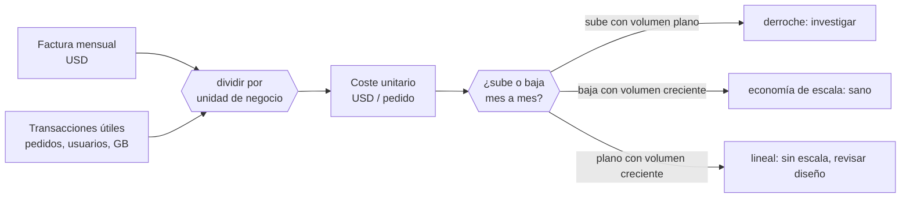

# 011 — Costo, energía, capacidad y medición básica

> [← 010 · Responsabilidad compartida y pensamiento de riesgo](../../part-00-foundations-computing-networking-linux/010-responsabilidad-compartida-y-pensamiento-de-riesgo/README.md) · [Índice de la parte](../README.md) · [012 · Proyecto: servicio local reproducible y observable →](../../part-00-foundations-computing-networking-linux/012-proyecto-servicio-local-reproducible-y-observable/README.md)

**Parte:** 00 — Fundamentos de computación, redes y Linux<br>
**Nivel:** inicial · **Horas estimadas:** 4<br>
**Laboratorio:** `finops` · **Estado:** `EXECUTABLE_CORE`

## 🎯 Propósito

Convertir el coste en una magnitud de ingeniería con la que se decide, no en una factura que se revisa al final del mes. Aquí se establece la unidad económica que el programa usará en las 277 clases restantes: coste por transacción útil. Sin ella, «optimizar costes» es apagar cosas al azar y esperar que nada se rompa.

## 📚 Resultados de aprendizaje

Al finalizar podrás:

1. **Definir** una unidad de coste ligada a algo que el negocio entiende, y calcularla a partir de la factura.
2. **Aplicar** la ley de Little para dimensionar capacidad a partir de tasa de llegada y tiempo de servicio.
3. **Explicar** por qué la latencia se dispara antes de llegar al 100 % de utilización, y a partir de qué punto.
4. **Comparar** modelos de precio —bajo demanda, compromiso, capacidad excedente— con un umbral de utilización calculado.
5. **Estimar** el coste energético de una carga y situarlo frente a su coste monetario.

## 🧩 Conceptos centrales

| Concepto | Comprensión verificable |
|---|---|
| `unidad de coste` | Denominador que convierte la factura en una métrica decidible: coste por pedido, por usuario activo, por GB procesado. Sin denominador, un aumento de factura no distingue crecimiento de derroche. |
| `utilización` | Fracción del tiempo que un recurso está ocupado, entre 0 y 1. Por encima de 0,7 el tiempo de espera crece de forma no lineal, así que perseguir el 100 % es perseguir una cola infinita. |
| `ley de Little` | En un sistema estable, L = λ·W: el número medio de elementos en el sistema es la tasa de llegada por el tiempo medio de permanencia. No supone ninguna distribución, lo que la hace aplicable casi siempre. |
| `coste amortizado` | Coste efectivo de un compromiso repartido en su plazo. Permite comparar un descuento por reserva de 1 o 3 años con el precio bajo demanda sobre la misma base. |
| `PUE` | Power Usage Effectiveness: energía total del centro de datos dividida por la que llega al equipamiento informático. 1,0 sería perfecto; los hiperescalares operan cerca de 1,1 y una sala tradicional ronda 1,8. |

## 🧠 Modelo mental

Antes de alquilar infraestructura remota, aprende a observar una computadora local como un conjunto de procesos, redes, archivos, identidades y recursos medibles.

Aplicado a esta clase, separa siempre cuatro planos: **intención** (qué necesita el usuario),
**configuración** (qué declaramos), **estado observado** (qué existe de verdad) y
**evidencia** (cómo sabemos que cumple). Confundirlos produce diseños que se ven correctos
en un diagrama pero fallan al operar.

## 🗺️ Flujo de razonamiento



## 📖 Desarrollo

### 1. Sin denominador, la factura no dice nada

«La factura subió un 40 %» es una observación inútil hasta que se divide por algo. Con denominador, la misma cifra puede significar tres cosas opuestas:

```text
mes 1:  12.400 USD /  620.000 pedidos = 0,0200 USD/pedido
mes 2:  17.360 USD /  980.000 pedidos = 0,0177 USD/pedido   ← +40 % factura, −11 % unitario
mes 3:  17.360 USD /  610.000 pedidos = 0,0285 USD/pedido   ← +43 % unitario: hay derroche
```

El mes 2 es **crecimiento sano**: se factura más porque se vende más, y cada pedido cuesta menos. El mes 3 con la misma factura es una alarma: el volumen cayó y el coste no.

La unidad debe cumplir tres condiciones para servir:

1. **La entiende el negocio**: pedidos, usuarios activos, GB procesados. No «horas de instancia».
2. **Se puede atribuir**: existe un mecanismo de etiquetado que asigna cada recurso a un producto o equipo.
3. **Se mide igual todos los meses**: cambiar el denominador rompe la serie histórica.

La condición 2 es la que exige trabajo previo: sin etiquetado consistente, el 30-40 % de la factura acaba en un cubo de «sin asignar» que nadie reclama y nadie optimiza. Por eso el etiquetado es la primera tarea de FinOps, antes que cualquier optimización.

### 2. La ley de Little: dimensionar sin adivinar

Para cualquier sistema estable, con independencia de la distribución de llegadas o servicios:

```text
L = λ · W

L = elementos en el sistema (concurrencia)
λ = tasa de llegada (peticiones por segundo)
W = tiempo medio en el sistema (segundos)
```

Sirve para dimensionar antes de desplegar. Con 800 peticiones por segundo y 250 ms de latencia media:

```text
L = 800 × 0,250 = 200 peticiones concurrentes
```

Si cada trabajador atiende una petición a la vez, hacen falta **200 trabajadores** solo para el estado estacionario. Con 40 trabajadores por instancia:

```text
instancias = 200 / 40 = 5   (mínimo teórico, utilización 1,0)
```

Y ese «mínimo teórico» es exactamente el número que no hay que desplegar, por lo que viene a continuación.

La ley también funciona al revés, para detectar incoherencias: si mides 200 conexiones concurrentes y 800 peticiones por segundo, la latencia media **tiene** que ser 250 ms. Si tu panel dice 80 ms, alguna de las tres medidas está mal —normalmente porque se está midiendo la media de una distribución con cola larga—.

### 3. Por qué el 100 % de utilización es una trampa

En un sistema con llegadas aleatorias, el tiempo de espera no crece de forma lineal con la utilización. Para una cola M/M/1:

```text
W = W_servicio / (1 − ρ)          ρ = utilización
```

Con un servicio de 100 ms:

| ρ | Tiempo total | Multiplicador |
|---|---|---|
| 0,50 | 200 ms | 2× |
| 0,70 | 333 ms | 3,3× |
| 0,80 | 500 ms | 5× |
| 0,90 | 1.000 ms | 10× |
| 0,95 | 2.000 ms | 20× |
| 0,99 | 10.000 ms | 100× |

Entre 0,70 y 0,90 la utilización sube 20 puntos y **la latencia se triplica**. Ese es el motivo de que el objetivo operativo habitual sea 0,60-0,70 y no 0,95: el 30 % de capacidad «ociosa» no es derroche, es lo que absorbe la varianza de las llegadas.

Aplicado al cálculo anterior:

```text
mínimo teórico (ρ = 1,0)          5 instancias
objetivo ρ = 0,70                 5 / 0,70 = 7,1 → 8 instancias
tolerancia a la caída de una zona (n+1)      → 9 instancias
```

Las 4 instancias adicionales sobre el mínimo teórico no son exceso: son el precio de un percentil 95 estable y de sobrevivir a la pérdida de una zona. **Optimizar costes recortando ahí es cambiar dinero por incidentes**, y el intercambio hay que hacerlo explícito.

### 4. Modelos de precio: el umbral que decide

Los tres modelos comunes, con el mismo recurso como referencia:

| Modelo | Precio relativo | Compromiso | Riesgo |
|---|---|---|---|
| Bajo demanda | 1,00 | Ninguno | Ninguno |
| Compromiso 1 año | ~0,60 | Pagas uses o no | Sobredimensionar |
| Compromiso 3 años | ~0,40 | Ídem, más largo | Cambio tecnológico |
| Capacidad excedente | ~0,10-0,30 | Ninguno | **Interrupción con preaviso corto** |

El umbral de utilización a partir del cual compensa comprometerse sale de igualar ambos costes:

```text
coste bajo demanda = u × 730 h × P
coste comprometido = 730 h × 0,60 P

umbral: u × P = 0,60 P  →  u = 0,60
```

**Con más del 60 % de uso sostenido, el compromiso a un año sale a cuenta.** Por debajo, no. Ese único número evita la mayoría de las discusiones sobre reservas.

La capacidad excedente merece su propio criterio: cuesta entre un 70 % y un 90 % menos, pero puede retirarse con un preaviso de dos minutos. Es correcta para trabajos por lotes reanudables, colas asíncronas y entornos de pruebas. **Nunca** para un componente cuya caída rompa una petición de usuario, salvo que la arquitectura absorba la pérdida sin degradación visible.

### 5. La energía es el coste que no aparece en la factura

El coste monetario ya incorpora la energía, pero la huella no, y cada vez más organizaciones tienen que declararla.

```text
energía_total = potencia_TI × horas × PUE
```

Para 9 instancias de ~80 W durante un mes:

```text
potencia TI     = 9 × 80 W = 720 W = 0,72 kW
energía TI      = 0,72 kW × 730 h = 525,6 kWh
con PUE 1,12    = 525,6 × 1,12 = 588,7 kWh/mes
```

Y su traducción a emisiones depende por completo de **dónde** se ejecuta:

```text
región con 50 g CO₂e/kWh:  588,7 × 0,050 =  29,4 kg CO₂e/mes
región con 400 g CO₂e/kWh: 588,7 × 0,400 = 235,5 kg CO₂e/mes
```

**Un factor de 8 por la misma carga, con la misma factura.** La elección de región, que en la clase 001 se justificaba por latencia y en la 010 por soberanía del dato, tiene aquí un tercer eje.

Dos matices honestos: los factores de emisión varían por hora según el mix de generación, y el PUE no incluye el coste de fabricación del hardware. Cualquier cifra de este tipo es una estimación con orden de magnitud útil, no una medición.

## 🔬 Ejemplo trabajado

**La factura de CloudShop pasa de 12.400 a 17.360 USD en un mes y dirección pide «bajar costes un 30 %».** El equipo empieza calculando el denominador antes de tocar nada.

```text
mes anterior  12.400 USD / 620.000 pedidos = 0,0200 USD/pedido
mes actual    17.360 USD / 980.000 pedidos = 0,0177 USD/pedido
```

**El coste unitario bajó un 11 %.** El aumento es crecimiento, no derroche, y ese dato cambia la conversación: recortar un 30 % lineal significaría recortar capacidad mientras el volumen sube un 58 %.

Se desglosa por unidad para encontrar dónde sí hay margen:

```text                          USD    USD/pedido   % factura
cómputo (9 instancias)        6.480     0,0066        37 %
base de datos                 4.900     0,0050        28 %
transferencia de salida       3.100     0,0032        18 %
almacenamiento                1.480     0,0015         9 %
observabilidad                1.400     0,0014         8 %
```

Se revisan las dos partidas mayores con los criterios de la clase.

**Cómputo.** Utilización medida sobre 30 días: media 0,58, percentil 95 diario 0,71. Por la ley de Little con λ=800/s y W=250 ms hacen falta 200 concurrentes; a ρ=0,70 son 8 instancias y con tolerancia n+1, nueve. **Están correctamente dimensionadas: no hay recorte sin degradar.** Pero la utilización sostenida del 58 % está cerca del umbral de compromiso:

```text
umbral de compromiso a 1 año: u > 0,60
medido: 0,58 en media, 0,71 en p95
→ comprometer 6 de las 9 instancias (base estable), dejar 3 bajo demanda
ahorro: 6 × 720 USD × 0,40 = 1.728 USD/mes    (−27 % del cómputo)
```

**Transferencia de salida.** 3.100 USD equivalen a unos 34 TB. Se revisa la tasa de acierto del CDN:

```text
aciertos de caché      61 %
salida desde origen    34 TB
```

Subir el acierto al 90 % ajustando `Cache-Control` en los activos con huella —lo de la clase 006— reduce la salida desde origen:

```text
salida estimada  34 TB × (1 − 0,90)/(1 − 0,61) = 8,7 TB
ahorro                         ≈ 2.300 USD/mes    (−74 % de esa partida)
```

Resultado combinado:

```text
ahorro total            1.728 + 2.300 = 4.028 USD/mes  (−23 %)
coste unitario nuevo    13.332 / 980.000 = 0,0136 USD/pedido   (−32 %)
```

**No se llegó al 30 % de la factura, pero sí se superó el 30 % en coste unitario, que es la métrica que el negocio quería sin saber nombrarla.** Y ningún ahorro salió de recortar capacidad: salieron de comprometer la base estable y de dejar de pagar transferencia evitable.

Riesgo residual declarado: el compromiso a un año sobre 6 instancias **deja de ser rentable si el volumen cae más de un 40 %**. Se acepta con revisión trimestral.

## 🧪 Laboratorio guiado

Ejecuta desde la raíz:

```bash
python classes/part-00-foundations-computing-networking-linux/011-costo-energia-capacidad-y-medicion-basica/lab.py
```

El laboratorio selecciona el motor de práctica **`finops`** y produce
`lab_result.json`. El escenario, sus comprobaciones y el artefacto esperado corresponden a
esta clase; no requiere credenciales y deja explícito qué debe revalidarse en un sandbox real.

1. Lee `exercise.steps` y formula una predicción antes de ejecutar.
2. Ejecuta la práctica y verifica todos los elementos de `checks`.
3. Provoca el caso de `negative_test` y explica la señal observada.
4. Materializa `estimacion-de-costo` en `evidence/` usando la plantilla indicada.
5. Para proveedor real, sigue `sandbox.requires`, registra costo y ejecuta `destroy`.

### Evidencia esperada

El artefacto principal es un cálculo trazable con unidad, supuesto y sensibilidad. Además, la entrega debe incluir el comando ejecutado,
la salida estructurada y una conclusión que no exceda lo observado.

## 🏆 Reto verificable

Construye **`estimacion-de-costo`** para el caso CloudShop. Incluye una alternativa descartada,
un supuesto que pueda falsarse, una prueba de fallo y una decisión de rollback.

## ✅ Criterio de aceptación

- [ ] `lab.py` termina con código 0 y genera JSON válido.
- [ ] La entrega conecta al menos tres requisitos con mecanismos verificables.
- [ ] Existe una prueba positiva y una prueba negativa con evidencia.
- [ ] Seguridad, costo y operación aparecen como decisiones, no como anexos.
- [ ] Se declara una limitación y una condición que obligaría a revisar el diseño.
- [ ] Otra persona puede repetir el recorrido sin conocimiento tácito.

## ⚠️ Errores frecuentes

| Síntoma | Causa probable | Corrección |
|---|---|---|
| Se pide recortar un porcentaje de la factura sin más contexto | No hay unidad de coste, así que no se distingue crecimiento de derroche | Divide la factura por una unidad de negocio antes de decidir; el unitario puede bajar mientras la factura sube. |
| La latencia se dispara al subir la utilización del 70 % al 90 % | El tiempo de espera crece como 1/(1−ρ), no linealmente | Fija el objetivo de utilización en 0,60-0,70; la capacidad libre absorbe la varianza. |
| Un compromiso de 3 años se convierte en gasto muerto | Se comprometió capacidad con utilización por debajo del umbral | Compromete solo la base estable, con u > 0,60; deja el pico bajo demanda. |
| Una carga en capacidad excedente rompe peticiones de usuario al ser retirada | Se usó capacidad interrumpible para un componente del camino crítico | Resérvala para trabajos reanudables; el preaviso puede ser de dos minutos. |
| El 35 % de la factura está en «sin asignar» y nadie lo optimiza | Falta etiquetado consistente, así que no hay atribución posible | Impón etiquetas obligatorias en el aprovisionamiento antes de intentar cualquier optimización. |

## 🛡️ Seguridad, ética y costo

Trabaja con cuentas propias o sandboxes autorizados. No publiques secretos, identificadores
reales ni datos personales. Antes de crear recursos pagos define presupuesto, etiquetas y
comando de destrucción; después verifica que no queden recursos huérfanos. Los ejemplos
locales enseñan contratos, pero no certifican cumplimiento ni disponibilidad de producción.

## ❓ Preguntas de comprobación

1. La factura sube un 40 % y el coste unitario baja un 11 %. ¿Hay un problema de costes? Justifica.
2. Con 500 peticiones por segundo y 400 ms de latencia media, ¿cuántas peticiones concurrentes hay en el sistema?
3. ¿Por qué desplegar al 95 % de utilización sale más caro que al 70 %, aunque use menos instancias?
4. ¿A partir de qué utilización sostenida compensa un compromiso de un año al 60 % del precio, y de dónde sale ese umbral?
5. Dos regiones tienen el mismo precio. ¿Qué otro criterio, con qué orden de magnitud, puede decidir entre ellas?

## 🔗 Referencias

- Little, J. D. C. (1961). *A Proof for the Queuing Formula: L = λW*. Operations Research 9(3), 383-387. <https://doi.org/10.1287/opre.9.3.383>
- Storment, J. R. y Fuller, M. (2023). *Cloud FinOps*, 2.ª ed., caps. 6-9 — unidad de coste, etiquetado y modelos de compromiso.
- Gunther, N. (2007). *Guerrilla Capacity Planning* — leyes de escalabilidad y el efecto de la utilización sobre la latencia.
- Barroso, L., Hölzle, U. y Ranganathan, P. (2018). *The Datacenter as a Computer*, 3.ª ed., cap. 6 — PUE, eficiencia y coste total. <https://doi.org/10.2200/S00874ED3V01Y201809CAC046>
- FinOps Foundation (2024). *FinOps Framework* — capacidades de asignación, previsión y optimización de tasa. <https://www.finops.org/framework/>
- Documentación oficial vigente del servicio implementado; registra URL y fecha de consulta.

---

> [Evaluación](assessment.md) · [Contrato de clase](lesson.yaml) · [Índice de la parte](../README.md)

**📥 Descargar:** [Parte 00 en PDF](../../../site/downloads/partes/manual-parte-00-foundations-computing-networking-linux.pdf) · [Manual integral](../../../site/downloads/multi-cloud-engineering-manual-v2.0.pdf)

| Anterior | Índice | Siguiente |
|---|---|---|
| [← 010 · Responsabilidad compartida y pensamiento de riesgo](../../part-00-foundations-computing-networking-linux/010-responsabilidad-compartida-y-pensamiento-de-riesgo/README.md) | [Parte 00](../README.md) · [Programa](../../README.md) | [012 · Proyecto: servicio local reproducible y observable →](../../part-00-foundations-computing-networking-linux/012-proyecto-servicio-local-reproducible-y-observable/README.md) |
