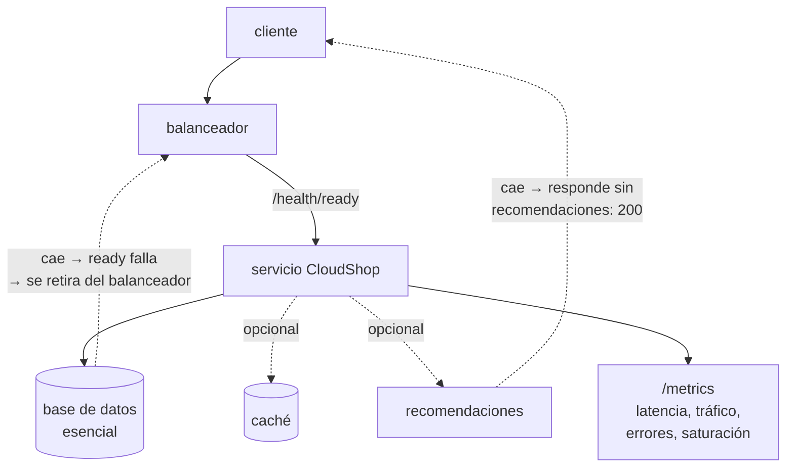

# 012 — Proyecto: servicio local reproducible y observable

> [← 011 · Costo, energía, capacidad y medición básica](../../part-00-foundations-computing-networking-linux/011-costo-energia-capacidad-y-medicion-basica/README.md) · [Índice de la parte](../README.md) · [013 · Definición NIST y características esenciales de cloud →](../../part-01-cloud-principles-strategy-adoption/013-definicion-nist-y-caracteristicas-esenciales-de-cloud/README.md)

**Parte:** 00 — Fundamentos de computación, redes y Linux<br>
**Nivel:** inicial · **Horas estimadas:** 8<br>
**Laboratorio:** `capstone` · **Estado:** `EXECUTABLE_CORE`

## 🎯 Propósito

Integrar las once clases anteriores en un artefacto único: un servicio local que arranca con un comando, se observa, falla de forma controlada y se recupera. Es el punto de partida de CloudShop, el sistema que evolucionará durante las 276 clases restantes hasta operar en tres nubes. Lo que se construye aquí no es un ejercicio: es la línea base contra la que se medirá cada cambio posterior.

## 📚 Resultados de aprendizaje

Al finalizar podrás:

1. **Ensamblar** un servicio con comprobaciones de vida y de disponibilidad distinguiendo correctamente sus semánticas.
2. **Instrumentar** las cuatro señales doradas y justificar por qué la media es insuficiente para la latencia.
3. **Provocar** un fallo de dependencia y demostrar que el servicio degrada en vez de caer.
4. **Establecer** una línea base de rendimiento reproducible que sirva de referencia para comparar cambios futuros.
5. **Documentar** el servicio de modo que otra persona lo levante, lo observe y lo recupere sin conocimiento tácito.

## 🧩 Conceptos centrales

| Concepto | Comprensión verificable |
|---|---|
| `liveness` | Comprobación de si el proceso debe reiniciarse. Debe fallar solo ante un estado irrecuperable: si comprueba dependencias externas, una caída de la base de datos reinicia todas las réplicas y convierte una degradación en una caída total. |
| `readiness` | Comprobación de si el proceso puede recibir tráfico ahora. Sí debe mirar dependencias: al fallar, el balanceador retira la instancia sin matarla, y vuelve a incluirla cuando se recupera. |
| `señales doradas` | Latencia, tráfico, errores y saturación. Cuatro métricas que, según el SRE Book, bastan para detectar la mayoría de los problemas de un servicio orientado a peticiones. |
| `degradación elegante` | Responder con funcionalidad reducida en vez de fallar por completo cuando una dependencia no esencial no está disponible. |
| `línea base` | Medición reproducible del comportamiento actual. Sin ella, cualquier afirmación posterior sobre mejora o regresión es una opinión. |

## 🧠 Modelo mental

Antes de alquilar infraestructura remota, aprende a observar una computadora local como un conjunto de procesos, redes, archivos, identidades y recursos medibles.

Aplicado a esta clase, separa siempre cuatro planos: **intención** (qué necesita el usuario),
**configuración** (qué declaramos), **estado observado** (qué existe de verdad) y
**evidencia** (cómo sabemos que cumple). Confundirlos produce diseños que se ven correctos
en un diagrama pero fallan al operar.

## 🗺️ Flujo de razonamiento



## 📖 Desarrollo

### 1. Liveness y readiness responden a preguntas opuestas

Confundirlas es el error que convierte una degradación en una caída total, y ocurre porque ambas «comprueban si el servicio está bien».

| | Liveness | Readiness |
|---|---|---|
| Pregunta | ¿Hay que reiniciar? | ¿Puede recibir tráfico? |
| Acción al fallar | Matar y reiniciar | Retirar del balanceador |
| ¿Mira dependencias? | **Nunca** | **Sí** |
| Coste de un falso positivo | Reinicio innecesario | Capacidad reducida |

```python
@app.get("/health/live")
def live():
    return {"status": "ok"}          # solo: ¿responde el bucle de eventos?

@app.get("/health/ready")
def ready():
    fallos = []
    if not db.ping(timeout=1.0):
        fallos.append("db")           # esencial
    if fallos:
        raise HTTPException(503, {"no_listo": fallos})
    return {"status": "ok", "degradado": estado_opcionales()}
```

El escenario que justifica la regla: la base de datos se cae 40 segundos. Con liveness mirando la base de datos, **las 9 réplicas fallan la comprobación a la vez y el orquestador las mata todas**; cuando la base vuelve, no hay servicio porque todas están arrancando en frío. Con la separación correcta, las 9 salen del balanceador, siguen vivas, y vuelven a entrar en cuanto la dependencia responde.

Hay una tercera comprobación que conviene desde el principio: **startup**, para procesos con arranque lento. Sin ella hay que relajar el plazo de liveness para todo el ciclo de vida, lo que retrasa la detección de bloqueos reales.

### 2. Las cuatro señales doradas, y por qué la media miente

El SRE Book reduce la instrumentación mínima a cuatro señales:

| Señal | Qué mide | Cómo se instrumenta |
|---|---|---|
| **Latencia** | Cuánto tarda, **separando éxitos de errores** | Histograma, no media |
| **Tráfico** | Demanda: peticiones/s | Contador |
| **Errores** | Tasa de fallo, explícito e implícito | Contador por código |
| **Saturación** | Cuán lleno está el recurso más restrictivo | Medidor |

La separación de latencia entre éxitos y errores no es un detalle: **los errores suelen ser rápidos**, así que mezclarlos baja artificialmente la media justo cuando el servicio está peor.

Y la media es insuficiente por sí misma. Con 1.000 peticiones:

```text
950 peticiones a  50 ms
 50 peticiones a 2.000 ms

media  = (950×50 + 50×2000)/1000 = 147,5 ms   ← parece aceptable
p95    = 50 ms
p99    = 2.000 ms                              ← 1 de cada 100 usuarios espera 2 s
```

La media de 147 ms no la experimenta **nadie**: unos ven 50 ms y otros 2 segundos. Por eso los SLO se fijan sobre percentiles, y por eso las métricas se exportan como histograma —que permite calcular percentiles agregando entre instancias— y no como media previamente calculada, que es matemáticamente imposible de agregar.

La saturación es la más olvidada y la más predictiva: es la única que **avisa antes** de que la latencia y los errores se degraden. Con lo visto en la clase 011, la saturación por encima de 0,7 anticipa el problema que las otras tres señales aún no muestran.

### 3. Degradar en vez de caer

No todas las dependencias son iguales, y tratarlas igual convierte cualquier fallo en una caída completa. Clasificarlas es una decisión de producto, no técnica:

| Dependencia | Clase | Si no está |
|---|---|---|
| Base de datos de pedidos | Esencial | 503: no se puede servir |
| Caché | Opcional | Responder más lento desde origen |
| Recomendaciones | Opcional | Responder sin esa sección |
| Telemetría | Opcional | Registrar localmente y continuar |

```python
async def pagina_producto(pid: str):
    producto = await db.producto(pid)              # esencial: si falla, propaga
    recomendados, degradado = [], []
    try:
        recomendados = await asyncio.wait_for(rec.para(pid), timeout=0.15)
    except (asyncio.TimeoutError, ConnectionError):
        degradado.append("recomendaciones")        # opcional: se anota y sigue
    return {"producto": producto, "recomendados": recomendados, "degradado": degradado}
```

Tres detalles que hacen que esto funcione de verdad:

1. **El plazo es obligatorio.** Sin `timeout`, una dependencia lenta bloquea al llamante y propaga la saturación hacia arriba. Una dependencia opcional sin plazo es una dependencia esencial disfrazada.
2. **La degradación se declara en la respuesta.** El campo `degradado` permite que el cliente y el panel sepan que el 200 no es completo.
3. **El plazo debe ser menor que el del llamante.** Si el usuario espera 300 ms, una dependencia opcional con plazo de 500 ms nunca llega a tiempo y solo añade latencia.

### 4. Una línea base que se pueda repetir

Sin medición previa, «esto mejoró el rendimiento» es una creencia. La línea base debe fijar **carga, duración, entorno y percentiles**, y guardarse junto al código:

```bash
$ hey -z 60s -c 50 -q 20 http://localhost:8080/api/productos/A-1042

Summary:
  Total:        60.0031 secs
  Requests/sec: 987.4210

Latency distribution:
  50% in 0.0384 secs
  95% in 0.0912 secs
  99% in 0.1847 secs

Status code distribution:
  [200] 59248 responses
```

Se registra como contrato comparable:

```json
{"escenario": "productos-lectura", "concurrencia": 50, "duracion_s": 60,
 "rps": 987.4, "p50_ms": 38.4, "p95_ms": 91.2, "p99_ms": 184.7, "errores": 0}
```

Dos verificaciones con lo aprendido en la clase 011. Ley de Little:

```text
L = λ · W = 987 × 0,0384 = 37,9 concurrentes
```

Coherente con los 50 solicitados: el sistema no está saturado, hay holgura. Si `L` hubiera dado 50 exactos, la concurrencia sería el cuello de botella y la medida estaría limitada por el generador de carga, no por el servicio.

Relación p99/p50 = 184,7/38,4 = **4,8×**. Es la métrica que hay que vigilar entre versiones: si sube, la cola se está alargando aunque la media no se mueva.

### 5. Reproducible significa sin conocimiento tácito

El criterio de aceptación del proyecto no es que funcione en tu máquina: es que **otra persona lo levante sin preguntarte nada**. Eso exige que el repositorio contenga:

```text
projects/cloudshop/
├── README.md          qué es, cómo se levanta, cómo se comprueba, cómo se para
├── Dockerfile         entorno de ejecución fijado
├── compose.yaml       el servicio y sus dependencias
├── app.py             el servicio
├── smoke.sh           comprobación de extremo a extremo con código de salida
└── baseline.json      la línea base medida, con su escenario
```

Y que el recorrido completo quepa en cuatro comandos con salida verificable:

```bash
$ docker compose up -d
$ ./smoke.sh                    # sale 0 si todo responde; distinto de 0 si no
$ curl -s localhost:8080/metrics | grep -c '^http_request_duration'
$ docker compose down -v
```

El `smoke.sh` con código de salida no es cosmético: es lo que permite que este mismo recorrido se ejecute en CI en la parte 08 sin cambiar nada. Un script que imprime «OK» pero siempre sale 0 no verifica nada.

Lo que **no** debe estar: credenciales reales, rutas absolutas de tu máquina, dependencias instaladas globalmente y no declaradas, y pasos que solo tú conoces. Cada uno de esos es conocimiento tácito, y el conocimiento tácito es lo que hace que un servicio sea irrecuperable cuando la persona que lo sabe está de vacaciones.

## 🔬 Ejemplo trabajado

**Se ensambla CloudShop v0 y se comprueba con un fallo provocado que degrada en vez de caer.**

Línea base con todas las dependencias sanas:

```bash
$ docker compose up -d && ./smoke.sh
ready: ok  ·  degradado: []
$ hey -z 30s -c 50 http://localhost:8080/api/productos/A-1042 | grep -E '95%|99%|Requests/sec'
  Requests/sec: 987.4210
  95% in 0.0912 secs
  99% in 0.1847 secs
```

**Prueba negativa 1 — cae una dependencia opcional.** Se detiene el servicio de recomendaciones:

```bash
$ docker compose stop recomendaciones
$ curl -s -o /dev/null -w '%{http_code}\n' localhost:8080/api/productos/A-1042
200
$ curl -s localhost:8080/api/productos/A-1042 | jq -c '.degradado'
["recomendaciones"]
$ curl -s localhost:8080/health/ready | jq -c '.'
{"status":"ok","degradado":["recomendaciones"]}
```

Sigue respondiendo 200 y declara la degradación. El impacto en latencia se mide, no se supone:

```text
p95 con recomendaciones     91,2 ms
p95 sin recomendaciones     73,8 ms      ← más rápido: ya no espera esa llamada
```

**Prueba negativa 2 — la dependencia opcional no cae, se vuelve lenta.** Este es el caso que de verdad rompe sistemas, porque nada falla:

```bash
$ docker compose exec recomendaciones tc qdisc add dev eth0 root netem delay 800ms
$ hey -z 30s -c 50 http://localhost:8080/api/productos/A-1042 | grep '95%'
  95% in 0.0947 secs
```

**El p95 apenas se mueve: 94,7 ms frente a 91,2.** El plazo de 150 ms corta la llamada lenta y el resultado es equivalente a que estuviera caída. Sin ese plazo, el p95 habría subido a más de 800 ms y la saturación se habría propagado hacia arriba: cada petición mantendría un trabajador ocupado 800 ms, y por la ley de Little la concurrencia necesaria se multiplicaría por 8.

**Prueba negativa 3 — cae la dependencia esencial.**

```bash
$ docker compose stop db
$ curl -s -o /dev/null -w '%{http_code}\n' localhost:8080/health/ready
503
$ curl -s -o /dev/null -w '%{http_code}\n' localhost:8080/health/live
200                                    # sigue VIVO: no debe reiniciarse
$ docker compose start db && sleep 3
$ curl -s localhost:8080/health/ready | jq -r .status
ok                                     # vuelve solo, sin reiniciar
```

Ese `200` en liveness durante la caída es el resultado que valida el diseño: el orquestador **retira** la instancia del balanceador pero **no la mata**, así que cuando la base vuelve hay capacidad caliente inmediata. Si liveness hubiera consultado la base, las nueve réplicas habrían muerto a la vez y la recuperación habría añadido el arranque en frío al tiempo de indisponibilidad.

**Evidencia registrada** en `evidence/`: `baseline.json`, las tres pruebas negativas con su salida, y una limitación explícita — *la línea base se midió en una sola máquina sin latencia de red entre componentes; los números no son extrapolables a un despliegue distribuido, solo comparables contra sí mismos*.

## 🧪 Laboratorio guiado

Ejecuta desde la raíz:

```bash
python classes/part-00-foundations-computing-networking-linux/012-proyecto-servicio-local-reproducible-y-observable/lab.py
```

El laboratorio selecciona el motor de práctica **`capstone`** y produce
`lab_result.json`. El escenario, sus comprobaciones y el artefacto esperado corresponden a
esta clase; no requiere credenciales y deja explícito qué debe revalidarse en un sandbox real.

1. Lee `exercise.steps` y formula una predicción antes de ejecutar.
2. Ejecuta la práctica y verifica todos los elementos de `checks`.
3. Provoca el caso de `negative_test` y explica la señal observada.
4. Materializa `servicio-local` en `evidence/` usando la plantilla indicada.
5. Para proveedor real, sigue `sandbox.requires`, registra costo y ejecuta `destroy`.

### Evidencia esperada

El artefacto principal es un incremento integrado, demostrable y documentado. Además, la entrega debe incluir el comando ejecutado,
la salida estructurada y una conclusión que no exceda lo observado.

## 🏆 Reto verificable

Construye **`servicio-local`** para el caso CloudShop. Incluye una alternativa descartada,
un supuesto que pueda falsarse, una prueba de fallo y una decisión de rollback.

## ✅ Criterio de aceptación

- [ ] `lab.py` termina con código 0 y genera JSON válido.
- [ ] La entrega conecta al menos tres requisitos con mecanismos verificables.
- [ ] Existe una prueba positiva y una prueba negativa con evidencia.
- [ ] Seguridad, costo y operación aparecen como decisiones, no como anexos.
- [ ] Se declara una limitación y una condición que obligaría a revisar el diseño.
- [ ] Otra persona puede repetir el recorrido sin conocimiento tácito.

## ⚠️ Errores frecuentes

| Síntoma | Causa probable | Corrección |
|---|---|---|
| Cae la base de datos y el orquestador reinicia todas las réplicas a la vez | La comprobación de liveness consulta dependencias externas | Liveness solo mira el propio proceso; las dependencias van en readiness. |
| El panel muestra latencia media aceptable mientras los usuarios se quejan | La media oculta la cola y mezcla errores rápidos con éxitos lentos | Exporta histogramas, separa éxitos de errores y fija los SLO sobre p95 y p99. |
| Una dependencia opcional se vuelve lenta y satura todo el servicio | La llamada no tenía plazo, así que la dependencia opcional era esencial de hecho | Toda llamada opcional necesita timeout menor que el presupuesto del llamante. |
| Nadie puede afirmar si un cambio mejoró o empeoró el rendimiento | No existe una línea base reproducible con escenario y percentiles | Registra carga, duración, entorno y p50/p95/p99 en un fichero versionado. |
| Solo una persona sabe levantar el servicio | El recorrido depende de conocimiento tácito no escrito | Exige que otra persona lo levante siguiendo solo el README, y corrige lo que le falte. |

## 🛡️ Seguridad, ética y costo

Trabaja con cuentas propias o sandboxes autorizados. No publiques secretos, identificadores
reales ni datos personales. Antes de crear recursos pagos define presupuesto, etiquetas y
comando de destrucción; después verifica que no queden recursos huérfanos. Los ejemplos
locales enseñan contratos, pero no certifican cumplimiento ni disponibilidad de producción.

## ❓ Preguntas de comprobación

1. ¿Por qué liveness no debe consultar la base de datos, y qué ocurre exactamente si lo hace durante una caída de 40 s?
2. Con 950 peticiones a 50 ms y 50 a 2.000 ms, ¿cuál es la media y cuál el p99? ¿Cuál describe mejor la experiencia?
3. Una dependencia opcional se vuelve lenta pero no falla. ¿Qué la convierte de hecho en esencial y cómo se evita?
4. ¿Por qué no se pueden agregar medias de latencia entre instancias, y qué formato de métrica sí lo permite?
5. Tu línea base da 987 rps y p50 de 38 ms con concurrencia 50. Por la ley de Little, ¿estaba saturado el sistema?

## 🔗 Referencias

- Beyer, B. et al., eds. (2016). *Site Reliability Engineering*, cap. 6 «Monitoring Distributed Systems» — las cuatro señales doradas. <https://sre.google/sre-book/monitoring-distributed-systems/>
- Kubernetes (2024). *Configure Liveness, Readiness and Startup Probes* — semántica y efectos de cada sonda. <https://kubernetes.io/docs/tasks/configure-pod-container/configure-liveness-readiness-startup-probes/>
- Nygard, M. (2018). *Release It!*, 2.ª ed., caps. 4-5 — patrones de estabilidad: timeouts, bulkheads y circuit breaker.
- Prometheus (2024). *Histograms and summaries* — por qué los histogramas son agregables y los cuantiles precalculados no. <https://prometheus.io/docs/practices/histograms/>
- Dean, J. y Barroso, L. (2013). *The Tail at Scale*. Communications of the ACM 56(2), 74-80. <https://doi.org/10.1145/2408776.2408794>
- Documentación oficial vigente del servicio implementado; registra URL y fecha de consulta.

---

> [Evaluación](assessment.md) · [Contrato de clase](lesson.yaml) · [Índice de la parte](../README.md)

| Anterior | Índice | Siguiente |
|---|---|---|
| [← 011 · Costo, energía, capacidad y medición básica](../../part-00-foundations-computing-networking-linux/011-costo-energia-capacidad-y-medicion-basica/README.md) | [Parte 00](../README.md) · [Programa](../../README.md) | [013 · Definición NIST y características esenciales de cloud →](../../part-01-cloud-principles-strategy-adoption/013-definicion-nist-y-caracteristicas-esenciales-de-cloud/README.md) |
