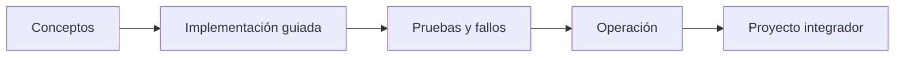

# Parte 00 — Fundamentos de computación, redes y Linux

> Programa · [Índice completo](../README.md) · [Parte 01 →](../part-01-cloud-principles-strategy-adoption/README.md)

**Nivel:** inicial · **Clases:** 12 · **Duración sugerida:** 6–8 semanas

Construir el vocabulario y las destrezas técnicas que la nube da por supuestas.

## Resultados de la parte

Al completar esta parte podrás explicar el dominio con lenguaje independiente del proveedor,
implementar sus mecanismos esenciales, diagnosticar fallos y defender decisiones mediante
evidencia, costo, seguridad y objetivos de confiabilidad.

## Modelo mental

Antes de alquilar infraestructura remota, aprende a observar una computadora local como un conjunto de procesos, redes, archivos, identidades y recursos medibles.

## Secuencia

## Clases

| ID | Clase | Laboratorio | Horas |
|---:|---|---|---:|
| 001 | [Computación digital y modelo mental de la nube](001-computacion-digital-y-modelo-mental-de-la-nube/README.md) | `foundation` | 4 |
| 002 | [Terminal, sistema de archivos, procesos y variables de entorno](002-terminal-sistema-de-archivos-procesos-y-variables-de-entorno/README.md) | `shell` | 4 |
| 003 | [Git, GitHub y trabajo reproducible](003-git-github-y-trabajo-reproducible/README.md) | `git` | 4 |
| 004 | [Python, JSON y automatización mínima](004-python-json-y-automatizacion-minima/README.md) | `automation` | 4 |
| 005 | [Redes por capas, TCP/IP, puertos y sockets](005-redes-por-capas-tcp-ip-puertos-y-sockets/README.md) | `network` | 4 |
| 006 | [DNS, HTTP, HTTPS y TLS de extremo a extremo](006-dns-http-https-y-tls-de-extremo-a-extremo/README.md) | `network` | 4 |
| 007 | [Linux: usuarios, permisos, servicios y logs](007-linux-usuarios-permisos-servicios-y-logs/README.md) | `linux` | 4 |
| 008 | [Virtualización, hipervisores e imágenes](008-virtualizacion-hipervisores-e-imagenes/README.md) | `virtualization` | 4 |
| 009 | [APIs REST, autenticación y contratos](009-apis-rest-autenticacion-y-contratos/README.md) | `api` | 4 |
| 010 | [Responsabilidad compartida y pensamiento de riesgo](010-responsabilidad-compartida-y-pensamiento-de-riesgo/README.md) | `security` | 4 |
| 011 | [Costo, energía, capacidad y medición básica](011-costo-energia-capacidad-y-medicion-basica/README.md) | `finops` | 4 |
| 012 | [Proyecto: servicio local reproducible y observable](012-proyecto-servicio-local-reproducible-y-observable/README.md) | `capstone` | 8 |

## Evaluación de la parte

- 35 % laboratorios y evidencia reproducible.
- 25 % retos verificables.
- 20 % decisiones y ADR.
- 10 % seguridad, confiabilidad y costo.
- 10 % proyecto integrador de la parte.

Se aprueba con 80 % de clases en nivel B o superior y el proyecto integrador reproducible.

## Pauta bibliográfica

- How Linux Works — Brian Ward.
- Computer Networking: A Top-Down Approach — Kurose y Ross.
- Pro Git — Chacon y Straub.
