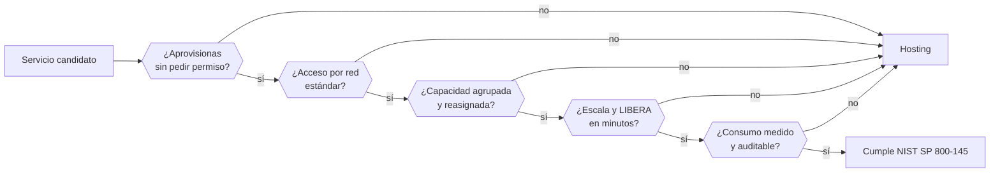

# 013 — Definición NIST y características esenciales de cloud

> [← 012 · Proyecto: servicio local reproducible y observable](../../part-00-foundations-computing-networking-linux/012-proyecto-servicio-local-reproducible-y-observable/README.md) · [Índice de la parte](../README.md) · [014 · Regiones, zonas de disponibilidad, puntos de presencia y edge →](../../part-01-cloud-principles-strategy-adoption/014-regiones-zonas-de-disponibilidad-puntos-de-presencia-y-edge/README.md)

**Parte:** 01 — Principios, estrategia y adopción cloud<br>
**Nivel:** inicial-intermedio · **Horas estimadas:** 4<br>
**Laboratorio:** `foundation` · **Estado:** `EXECUTABLE_CORE`

## 🎯 Propósito

Convertir la definición de NIST en una herramienta de decisión y no en un dato de examen. Cada una de las cinco características esenciales genera una consecuencia arquitectónica concreta, y la quinta —el servicio medido— es la que convierte cada decisión técnica del resto del programa en una decisión económica.

## 📚 Resultados de aprendizaje

Al finalizar podrás:

1. **Auditar** un servicio contra las cinco características y determinar si es cloud o hosting con nombre nuevo.
2. **Derivar** de cada característica al menos una consecuencia de diseño verificable.
3. **Situar** un despliegue en el modelo correcto —público, privado, híbrido o comunitario— por su frontera de control, no por su ubicación.
4. **Explicar** por qué la agrupación de recursos implica riesgo de vecino ruidoso y qué controles lo acotan.
5. **Justificar** con la definición por qué «nube privada» y «centro de datos virtualizado» no son sinónimos.

## 🧩 Conceptos centrales

| Concepto | Comprensión verificable |
|---|---|
| `autoservicio bajo demanda` | Capacidad de aprovisionar sin interacción humana con el proveedor. Su prueba es operativa: si hace falta un ticket o una llamada, no se cumple, y el tiempo de aprovisionamiento deja de ser un parámetro de arquitectura. |
| `agrupación de recursos` | Modelo en el que el proveedor reasigna capacidad física entre clientes de forma opaca. Es lo que abarata el servicio y lo que introduce el riesgo de interferencia entre inquilinos. |
| `elasticidad rápida` | Aprovisionar y liberar en minutos siguiendo la demanda, en ambas direcciones. Sin la dirección de bajada no hay elasticidad: hay aprovisionamiento rápido, que no genera ahorro. |
| `servicio medido` | Medición automática y transparente del consumo, con capacidad de auditarla. Es la característica que convierte la arquitectura en una función de coste. |
| `modelo de despliegue` | Quién controla la infraestructura y para quién opera: público, privado, comunitario o híbrido. Se define por la frontera de control y de inquilinos, no por dónde están los servidores. |

## 🧠 Modelo mental

La nube es un modelo operativo de acceso bajo demanda, no un lugar mágico ni el centro de datos de otra persona.

Aplicado a esta clase, separa siempre cuatro planos: **intención** (qué necesita el usuario),
**configuración** (qué declaramos), **estado observado** (qué existe de verdad) y
**evidencia** (cómo sabemos que cumple). Confundirlos produce diseños que se ven correctos
en un diagrama pero fallan al operar.

## 🗺️ Flujo de razonamiento



## 📖 Desarrollo

### 1. Cinco características, cinco consecuencias de diseño

La definición del **NIST SP 800-145** (Mell y Grance, 2011) no es descriptiva: es una lista de comprobación con consecuencias. Un servicio debe cumplir **las cinco**; fallar una lo saca de la categoría.

| Característica | Prueba operativa | Consecuencia de diseño |
|---|---|---|
| Autoservicio bajo demanda | ¿Aprovisionas sin ticket? | El tiempo de aprovisionamiento pasa de semanas a minutos, así que la capacidad deja de ser una decisión anual |
| Acceso amplio por red | ¿Protocolos estándar, cualquier cliente? | La red es la única frontera: no hay «estar dentro» |
| Agrupación de recursos | ¿El proveedor reasigna sin avisarte? | Tu rendimiento depende de vecinos que no ves |
| Elasticidad rápida | ¿Escala **y libera** en minutos? | La capacidad ociosa se vuelve coste evitable |
| Servicio medido | ¿Consumo auditable por unidad? | Cada bucle mal escrito aparece en la factura |

La columna derecha es la que importa. La cuarta fila tiene un matiz que decide proyectos: **elasticidad exige las dos direcciones**. Un sistema que escala en 2 minutos pero tarda 3 días en liberar capacidad —porque nadie se atreve a apagar— no produce ahorro. Es aprovisionamiento rápido, no elasticidad, y su economía es la de un centro de datos.

La quinta fila es la que reorganiza la ingeniería: en un centro de datos propio, un algoritmo ineficiente consume capacidad ya pagada; en cloud, consume dinero medible atribuible a un equipo. Ese cambio de incentivo es el origen de FinOps, y por eso la clase 011 estableció la unidad de coste antes de entrar en esta parte.

### 2. El modelo de despliegue lo define el control, no la ubicación

La confusión más extendida de esta parte: creer que «privado» significa «en mis instalaciones». NIST define los cuatro modelos por **para quién opera la infraestructura**, no por dónde está:

| Modelo | Inquilinos | Puede estar |
|---|---|---|
| Público | Cualquiera | Solo en el proveedor |
| Privado | Una sola organización | **En tus instalaciones o en un tercero** |
| Comunitario | Varias organizaciones con requisitos compartidos | En cualquiera de ellas o en un tercero |
| Híbrido | Combinación con portabilidad de datos entre ellas | Ambos |

De ahí dos consecuencias que se discuten mal en los comités:

1. **Una nube privada alojada en un tercero sigue siendo privada.** El criterio es la exclusividad de inquilino, no la propiedad del edificio.
2. **Un centro de datos virtualizado no es una nube privada.** Le suele faltar autoservicio (hay que pedir la máquina), elasticidad (no se libera) y medición (no se factura por consumo). Cumple una de cinco.

Y el híbrido tiene un requisito que casi nadie aplica: NIST exige **portabilidad de datos y aplicaciones** entre las partes. Tener servidores propios y además una cuenta en un proveedor no es híbrido: es tener dos cosas separadas. Sin la portabilidad, no hay modelo híbrido, hay coexistencia. Esa distinción reaparecerá con consecuencias de coste en la parte 13.

### 3. Agrupación de recursos: el precio tiene una contrapartida

La agrupación es lo que hace barata la nube: el proveedor amortiza el mismo hardware entre muchos clientes con picos que no coinciden. La contrapartida es el **vecino ruidoso**: tu rendimiento depende de cargas que no ves ni controlas.

Se manifiesta en tres recursos, con síntomas distintos:

| Recurso | Síntoma | Mitigación |
|---|---|---|
| CPU | Latencia irregular sin cambio de carga propia | Instancias con núcleos dedicados |
| E/S de disco | IOPS por debajo de lo esperado a ratos | Volúmenes con IOPS aprovisionadas |
| Red | Throughput variable entre instancias | Instancias con ancho de banda garantizado |

La **variabilidad**, no la media, es lo que hay que medir. Un proveedor puede cumplir su media anunciada y aun así producir un p99 inaceptable, porque la interferencia es esporádica. Es el mismo argumento de la clase 012 sobre por qué la media miente.

El caso especial es el **crédito de CPU** de las instancias ráfaga: acumulan crédito mientras están ociosas y lo gastan al trabajar. Cuando se agota, el rendimiento cae a una fracción del nominal —por ejemplo, al 20 %— sin que ninguna métrica de la aplicación explique el desplome. Diagnosticarlo exige mirar el saldo de créditos, que es una métrica del proveedor y no del sistema operativo. Es la primera vez en el programa en que **una métrica externa a la máquina es imprescindible para explicar su comportamiento**.

### 4. Auditar un servicio con la definición

La utilidad práctica de NIST es cortar discusiones de márketing. Tres casos frecuentes, auditados:

**«Nuestro hosting gestionado es cloud privado.»**

| Característica | ¿Cumple? |
|---|---|
| Autoservicio | No: hay que abrir ticket |
| Acceso por red | Sí |
| Agrupación | Parcial |
| Elasticidad | No: alta en horas, baja en días |
| Medición | No: cuota fija mensual |

**Una de cinco.** Es hosting. La consecuencia no es semántica: si compras esperando elasticidad, el ahorro previsto no llegará y el caso de negocio era falso desde el principio.

**«Somos híbridos porque tenemos servidores y una cuenta en un proveedor.»** Falta la portabilidad de datos y aplicaciones entre ambos. Sin ella no hay conmutación posible, así que tampoco hay la continuidad que se estaba justificando.

**«Un servicio SaaS con precio por asiento no es cloud porque no se mide por consumo.»** Falso: el asiento **es** la unidad de medida, y es auditable. NIST exige medición apropiada al tipo de servicio, no facturación por segundo.

El patrón: **la definición sirve para verificar que la propiedad por la que estás pagando existe de verdad**, no para clasificar por gusto.

### 5. Qué no dice NIST, y por qué importa

Tan útil como lo que define es lo que deja fuera, porque marca dónde el criterio debe ponerlo el arquitecto:

- **No dice nada de seguridad.** Un servicio puede cumplir las cinco características y ser inseguro. La seguridad se reparte con el modelo de responsabilidad compartida de la clase 019.
- **No dice nada de coste.** Cumplir la definición no implica ser barato; implica ser *medible*. Que salga a cuenta depende de la utilización, como se calculó en la clase 011.
- **No dice nada de fiabilidad.** No hay ninguna característica sobre disponibilidad. Esa la fija el SLA, que es un documento distinto con exclusiones propias.
- **No dice nada de portabilidad**, salvo en el modelo híbrido. Cumplir NIST es compatible con un bloqueo total de proveedor.

La última es la más relevante para un programa multi-cloud: **la definición no protege del bloqueo de proveedor**. Un servicio perfectamente conforme puede usar una API propietaria sin equivalente en otro sitio. La portabilidad es una decisión de arquitectura con coste propio —se estudiará en las partes 12 y 13—, no una propiedad que venga incluida.

Y el documento tiene 14 años. Serverless, contenedores gestionados y funciones no existían como categorías cuando se escribió; encajan sin problema en IaaS/PaaS, pero la frontera entre modelos es hoy más difusa de lo que sugiere la clasificación en tres niveles.

## 🔬 Ejemplo trabajado

**El comité de CloudShop evalúa dos ofertas para sacar su plataforma del centro de datos actual, y las dos se presentan como «nube privada».** Se auditan contra las cinco características antes de mirar el precio.

**Oferta A — proveedor local, «cloud privado gestionado».**

```text
autoservicio     ticket con SLA de 4 h laborables       ✗
acceso por red   VPN y API REST propia                  ✓
agrupación       hardware dedicado por cliente          ✗ (no hay agrupación)
elasticidad      alta en 4 h, baja con preaviso de 30 d ✗
medición         cuota fija mensual + extras            ✗
```

**Una de cinco.** Es alojamiento dedicado. No es que sea mala opción: es que **el caso de negocio presentado se apoyaba en ahorro por elasticidad**, y esta oferta no puede producirlo por construcción.

**Oferta B — hiperescalar, cuenta dedicada con conectividad privada.**

```text
autoservicio     API y consola, sin intervención        ✓
acceso por red   protocolos estándar                    ✓
agrupación       multi-inquilino con aislamiento lógico ✓
elasticidad      minutos en ambas direcciones           ✓
medición         por segundo, con etiquetas y export    ✓
```

Cinco de cinco. Es nube pública con conectividad privada, **no nube privada**: comparte hardware con otros inquilinos. La distinción importa porque el requisito regulatorio del cliente exigía «aislamiento de inquilino» y aquí hay agrupación.

Se cuantifica el impacto de la característica que falta en A, con los datos de utilización reales:

```text
capacidad de pico             100 unidades, 3 h/día
capacidad de base              20 unidades, 21 h/día
utilización media = (100×3 + 20×21)/(100×24) = 30 %

Oferta A (sin elasticidad): se paga el pico las 24 h
  100 × 24 × 30 × 0,85 USD                 = 61.200 USD/mes
Oferta B (con elasticidad): se paga el consumo
  (100×3 + 20×21) × 30 × 1,00 USD          = 21.600 USD/mes
```

**39.600 USD/mes de diferencia, y no viene del precio unitario —que es peor en B— sino de la característica 4.** A cobra un 15 % menos por unidad y cuesta casi el triple, porque cobra por capacidad reservada.

Decisión y límite explícito: se elige **B**, y el requisito de aislamiento de inquilino se resuelve con instancias de tenencia dedicada solo para las cargas que lo exigen —un 12 % del total—, no para toda la plataforma. Riesgo residual declarado: la tenencia dedicada elimina la agrupación en esa fracción, así que **ahí no habrá ahorro por elasticidad** y su coste unitario será el de A.

La lección del ejercicio: **las cinco características no son un dato de examen, son las cinco preguntas que revelan si el caso de negocio se sostiene**.

## 🧪 Laboratorio guiado

Ejecuta desde la raíz:

```bash
python classes/part-01-cloud-principles-strategy-adoption/013-definicion-nist-y-caracteristicas-esenciales-de-cloud/lab.py
```

El laboratorio selecciona el motor de práctica **`foundation`** y produce
`lab_result.json`. El escenario, sus comprobaciones y el artefacto esperado corresponden a
esta clase; no requiere credenciales y deja explícito qué debe revalidarse en un sandbox real.

1. Lee `exercise.steps` y formula una predicción antes de ejecutar.
2. Ejecuta la práctica y verifica todos los elementos de `checks`.
3. Provoca el caso de `negative_test` y explica la señal observada.
4. Materializa `matriz-nist` en `evidence/` usando la plantilla indicada.
5. Para proveedor real, sigue `sandbox.requires`, registra costo y ejecuta `destroy`.

### Evidencia esperada

El artefacto principal es un mapa con fronteras, entradas, salidas y supuestos. Además, la entrega debe incluir el comando ejecutado,
la salida estructurada y una conclusión que no exceda lo observado.

## 🏆 Reto verificable

Construye **`matriz-nist`** para el caso CloudShop. Incluye una alternativa descartada,
un supuesto que pueda falsarse, una prueba de fallo y una decisión de rollback.

## ✅ Criterio de aceptación

- [ ] `lab.py` termina con código 0 y genera JSON válido.
- [ ] La entrega conecta al menos tres requisitos con mecanismos verificables.
- [ ] Existe una prueba positiva y una prueba negativa con evidencia.
- [ ] Seguridad, costo y operación aparecen como decisiones, no como anexos.
- [ ] Se declara una limitación y una condición que obligaría a revisar el diseño.
- [ ] Otra persona puede repetir el recorrido sin conocimiento tácito.

## ⚠️ Errores frecuentes

| Síntoma | Causa probable | Corrección |
|---|---|---|
| Se firma un contrato esperando ahorro por elasticidad y la factura no baja | El servicio escala hacia arriba pero no libera capacidad; falla la característica 4 | Exige la prueba en ambas direcciones antes de firmar: aprovisionar y liberar, con tiempos medidos. |
| Se llama nube privada a un centro de datos virtualizado | Se confundió virtualización con las cinco características | Audita las cinco; virtualizar cumple una y el caso de negocio suele apoyarse en las otras cuatro. |
| Se declara arquitectura híbrida sin poder conmutar entre las partes | NIST exige portabilidad de datos y aplicaciones, y solo había coexistencia | Si no hay portabilidad demostrada, no cuentes con la continuidad que justificaba el modelo. |
| El rendimiento cae sin que ninguna métrica del sistema operativo lo explique | Agotamiento de créditos de CPU en una instancia ráfaga: es una métrica del proveedor | Vigila el saldo de créditos junto a las métricas del sistema; la interferencia entre inquilinos no se ve desde dentro. |
| Se asume que cumplir NIST implica portabilidad entre proveedores | La definición no dice nada de portabilidad salvo en el modelo híbrido | Trata la portabilidad como decisión de arquitectura con coste propio, no como propiedad incluida. |

## 🛡️ Seguridad, ética y costo

Trabaja con cuentas propias o sandboxes autorizados. No publiques secretos, identificadores
reales ni datos personales. Antes de crear recursos pagos define presupuesto, etiquetas y
comando de destrucción; después verifica que no queden recursos huérfanos. Los ejemplos
locales enseñan contratos, pero no certifican cumplimiento ni disponibilidad de producción.

## ❓ Preguntas de comprobación

1. Un servicio escala en 2 minutos y libera capacidad en 3 días. ¿Cumple la característica de elasticidad? ¿Qué consecuencia económica tiene?
2. ¿Puede una nube privada estar alojada en un tercero? ¿Qué criterio decide el modelo de despliegue?
3. ¿Qué le falta a un centro de datos virtualizado para cumplir la definición, y cuántas de las cinco cumple?
4. Un SaaS cobra por asiento y no por segundo. ¿Incumple la característica de servicio medido? Justifica.
5. Nombra dos propiedades que NIST no garantiza y que suelen darse por supuestas al elegir proveedor.

## 🔗 Referencias

- Mell, P. y Grance, T. (2011). *The NIST Definition of Cloud Computing*, SP 800-145 — las cinco características, tres modelos de servicio y cuatro de despliegue. <https://doi.org/10.6028/NIST.SP.800-145>
- Liu, F. et al. (2011). *NIST Cloud Computing Reference Architecture*, SP 500-292 — actores, roles y sus relaciones. <https://doi.org/10.6028/NIST.SP.500-292>
- Hohpe, G. (2020). *Cloud Strategy: A Decision-Based Approach* — por qué la definición sirve para decidir y no para clasificar.
- Armbrust, M. et al. (2010). *A View of Cloud Computing*. Communications of the ACM 53(4), 50-58 — obstáculos y oportunidades, incluida la variabilidad de rendimiento. <https://doi.org/10.1145/1721654.1721672>
- Barroso, L., Hölzle, U. y Ranganathan, P. (2018). *The Datacenter as a Computer*, 3.ª ed., cap. 7 — economía de la agrupación de recursos. <https://doi.org/10.2200/S00874ED3V01Y201809CAC046>
- Documentación oficial vigente del servicio implementado; registra URL y fecha de consulta.

---

> [Evaluación](assessment.md) · [Contrato de clase](lesson.yaml) · [Índice de la parte](../README.md)

| Anterior | Índice | Siguiente |
|---|---|---|
| [← 012 · Proyecto: servicio local reproducible y observable](../../part-00-foundations-computing-networking-linux/012-proyecto-servicio-local-reproducible-y-observable/README.md) | [Parte 01](../README.md) · [Programa](../../README.md) | [014 · Regiones, zonas de disponibilidad, puntos de presencia y edge →](../../part-01-cloud-principles-strategy-adoption/014-regiones-zonas-de-disponibilidad-puntos-de-presencia-y-edge/README.md) |
