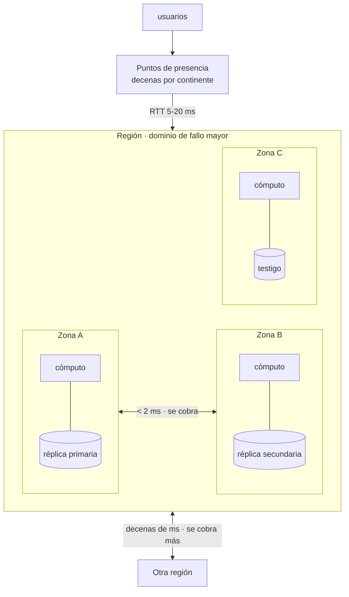

# 014 — Regiones, zonas de disponibilidad, puntos de presencia y edge

> [← Clase anterior](../../part-01-cloud-principles-strategy-adoption/013-definicion-nist-y-caracteristicas-esenciales-de-cloud/README.md) · [Índice de la parte](../README.md) · [Clase siguiente →](../../part-01-cloud-principles-strategy-adoption/015-iaas-paas-saas-caas-y-faas/README.md)

**Parte:** 01 — Principios, estrategia y adopción cloud<br>
**Nivel:** inicial-intermedio · **Horas estimadas:** 4<br>
**Laboratorio:** `architecture` · **Estado:** `EXECUTABLE_CORE`

## 🎯 Propósito

Entender la geografía de una nube como una jerarquía de dominios de fallo con latencias y precios distintos entre niveles. Colocar un componente en el nivel equivocado produce o bien una factura de transferencia inesperada, o bien un sistema que cae entero cuando falla un edificio. Esta clase fija el vocabulario y la aritmética que usarán las partes 13, 16 y 17.

## 📚 Resultados de aprendizaje

Al finalizar podrás:

1. **Distinguir** región, zona de disponibilidad y punto de presencia por su dominio de fallo, su latencia y su precio de transferencia.
2. **Calcular** la disponibilidad compuesta de un despliegue en una, dos y tres zonas.
3. **Anticipar** el coste de transferencia de un diseño antes de desplegarlo, sabiendo qué cruces se cobran.
4. **Justificar** cuándo el edge aporta y cuándo solo añade complejidad.
5. **Reconocer** que las zonas son etiquetas por cuenta y qué implica al comparar despliegues entre cuentas.

## 🧩 Conceptos centrales

| Concepto | Comprensión verificable |
|---|---|
| `región` | Área geográfica con varias zonas independientes. Es la unidad de soberanía del dato y de aislamiento de servicios: un fallo regional es el mayor dominio de fallo que un proveedor reconoce. |
| `zona de disponibilidad` | Uno o más centros de datos con energía, refrigeración y red independientes dentro de una región, separados kilómetros pero conectados con latencia de un dígito de milisegundos. |
| `punto de presencia` | Ubicación de borde que termina conexiones y sirve contenido cacheado cerca del usuario. No ejecuta tu aplicación completa: reduce el RTT del primer tramo. |
| `dominio de fallo` | Conjunto de componentes que caen juntos. El diseño consiste en elegir qué comparte dominio y qué no, porque redundancia dentro del mismo dominio no es redundancia. |
| `transferencia de salida` | Tráfico que sale hacia otra zona, región o internet. Es asimétrico: la entrada suele ser gratis y la salida se cobra, lo que convierte la topología en una decisión de coste. |

## 🧠 Modelo mental

La nube es un modelo operativo de acceso bajo demanda, no un lugar mágico ni el centro de datos de otra persona.

Aplicado a esta clase, separa siempre cuatro planos: **intención** (qué necesita el usuario),
**configuración** (qué declaramos), **estado observado** (qué existe de verdad) y
**evidencia** (cómo sabemos que cumple). Confundirlos produce diseños que se ven correctos
en un diagrama pero fallan al operar.

## 🗺️ Flujo de razonamiento



## 📖 Desarrollo

### 1. Tres niveles, tres órdenes de magnitud

La jerarquía no es organizativa: cada salto cambia latencia, dominio de fallo y precio en un orden de magnitud.

| Nivel | Latencia entre pares | Cae junto por | Transferencia |
|---|---|---|---|
| Dentro de una zona | < 0,5 ms | Rack, sala | Normalmente gratis |
| Entre zonas de una región | 0,5-2 ms | Desastre regional | Se cobra, precio bajo |
| Entre regiones | 10-150 ms | Nada común | Se cobra, precio alto |
| Punto de presencia a usuario | 5-20 ms | Un PoP concreto | Salida a internet, el más caro |

La fila de zonas es la que sostiene la alta disponibilidad: **2 ms es lo bastante bajo para replicar de forma síncrona** una base de datos, y lo bastante independiente para que un incendio, un corte eléctrico o una inundación no alcancen a las dos. Ese es exactamente el punto de equilibrio que buscan los proveedores al situarlas: suficientemente lejos para no compartir riesgo físico, suficientemente cerca para no romper la replicación síncrona.

Entre regiones, los 10-150 ms hacen inviable la replicación síncrona: cada escritura pagaría el RTT completo. Por eso la replicación entre regiones es **asíncrona**, y por eso siempre tiene un RPO mayor que cero. No es una limitación del producto: es la velocidad de la luz de la clase 001 aplicada al diseño de datos.

### 2. Disponibilidad compuesta: la aritmética de las zonas

Si un componente tiene disponibilidad *a* y se despliegan *n* copias en dominios de fallo **independientes**, la disponibilidad del conjunto es:

```text
A(n) = 1 − (1 − a)ⁿ
```

Con una disponibilidad por zona de 99,5 %:

```text
1 zona:  1 − 0,005¹ = 99,5 %      → 3,6 h de caída al mes
2 zonas: 1 − 0,005² = 99,9975 %   → 1,1 min
3 zonas: 1 − 0,005³ = 99,999988 % → 0,3 s
```

El salto de una a dos zonas divide la indisponibilidad por 200. El de dos a tres, por otras 200 — pero en términos absolutos pasa de 1,1 minutos a 0,3 segundos, una mejora que casi ningún negocio percibe. **La tercera zona rara vez se justifica por disponibilidad**; se justifica por quórum, que es otra cosa: los sistemas de consenso necesitan mayoría, y con dos zonas no hay mayoría posible si cae una.

Y la fórmula tiene una condición que se incumple a diario: **exige independencia**. Tres réplicas de cómputo en tres zonas, todas apuntando a una única base de datos en la zona A, tienen la disponibilidad de la zona A. La redundancia se calcula sobre el componente menos redundante, no sobre el más visible.

```text
cómputo 3 zonas (99,999988 %) × base de datos 1 zona (99,5 %) = 99,5 %
```

El cómputo redundante **no aporta nada** mientras la base sea única. Es el error de diseño más común de esta parte.

### 3. La transferencia es asimétrica y decide topologías

El precio de mover un byte depende de qué frontera cruza, y la asimetría entrada/salida moldea las arquitecturas más de lo que se suele reconocer:

| Cruce | Precio orientativo por GB |
|---|---|
| Entrada desde internet | 0,00 USD |
| Dentro de la misma zona | 0,00 USD |
| Entre zonas de una región | ~0,01 USD (cada sentido) |
| Entre regiones | 0,02-0,09 USD |
| Salida a internet | 0,05-0,12 USD |
| Salida vía CDN | 0,02-0,085 USD |

Dos consecuencias prácticas:

**El tráfico entre zonas se cobra en ambos sentidos.** Un diseño que reparte peticiones aleatoriamente entre tres zonas hace que dos tercios de las llamadas internas crucen zona. Con 40 TB mensuales de tráfico interno:

```text
reparto aleatorio: 2/3 × 40 TB × 2 sentidos × 0,01 USD/GB = 546 USD/mes
afinidad de zona:  ~5 % cruza zona                        =  41 USD/mes
```

La **afinidad de zona** —que una petición se resuelva dentro de la zona donde entró— ahorra un orden de magnitud, a cambio de complicar el balanceo y de perder algo de uniformidad de carga. Es una decisión, no una optimización obvia.

**La salida a internet es el precio más alto y el menos vigilado.** Un servicio que devuelve respuestas de 200 KB en lugar de 20 KB multiplica por diez la partida más cara de la factura. Comprimir y paginar no son solo mejoras de latencia.

### 4. Edge: para qué sirve y para qué no

Un punto de presencia reduce el RTT del primer tramo, y eso solo ayuda si el RTT es el componente dominante. Con lo visto en la clase 006, la petición en frío cuesta unos 4 RTT.

**Sirve para**: contenido estático cacheable, terminación de TLS cerca del usuario, absorción de picos y de ataques volumétricos, y lógica de borde muy corta —reescrituras, redirecciones, comprobación de un token—.

**No sirve para**: reducir el tiempo de una consulta a la base de datos, ni para nada que necesite estado consistente, ni cuando la respuesta es personalizada y no cacheable. En esos casos el borde **añade un salto** y empeora la latencia.

```text
sin edge:  usuario ──90 ms── origen                    = 4 × 90  = 360 ms
con edge:  usuario ──10 ms── PoP ──80 ms── origen
  contenido cacheado en el PoP:  4 × 10               =  40 ms   ✓
  contenido NO cacheable:        3 × 10 + 1 × 90 + 10 = 130 ms   ✓ (aún mejor: TLS al borde)
  respuesta dinámica sin reutilizar conexión al origen: puede superar los 360 ms  ✗
```

La tercera línea es la que sorprende: el edge mejora incluso contenido dinámico **si mantiene conexiones calientes hacia el origen**, porque ahorra el establecimiento TCP y TLS. Si no las mantiene, añade un tramo y no ahorra nada. Por eso el `origin shielding` no es un extra: es lo que hace que el borde funcione para contenido no cacheable.

### 5. Las zonas son etiquetas por cuenta

Un detalle operativo que produce errores difíciles de diagnosticar: en varios proveedores, el nombre de zona que ves —`us-east-1a`— **está mapeado de forma distinta en cada cuenta**. La `us-east-1a` de tu cuenta y la de otra pueden ser centros de datos físicos diferentes.

El mapeo se hizo para repartir la carga: si todos los clientes eligen «la primera zona», la primera zona física se satura. Aleatorizar la correspondencia por cuenta distribuye esa preferencia.

Las consecuencias:

1. **Comparar despliegues entre cuentas por nombre de zona no tiene sentido.** «Ambos están en `1a`» no significa que compartan riesgo ni que estén cerca.
2. **Colocar recursos de dos cuentas en la misma zona física** —para latencia o para coste de transferencia— exige el identificador estable de zona (`use1-az4`), no el nombre.
3. **Un incidente que el proveedor comunica por zona física** afecta a nombres distintos según la cuenta.

Además, no todas las regiones tienen el mismo número de zonas —las hay con 3 y con 6— ni todos los servicios están en todas ellas. Diseñar «para tres zonas» y desplegar en una región de dos rompe el supuesto de disponibilidad calculado antes, sin ningún aviso.

## 🔬 Ejemplo trabajado

**CloudShop debe elegir topología para su plataforma de pedidos con dos requisitos: 99,95 % mensual y RPO de 15 minutos.** Se evalúan tres opciones con la misma aritmética.

Disponibilidad objetivo traducida a tiempo:

```text
99,95 % mensual → 0,0005 × 30 × 24 × 60 = 21,6 min de caída permitida
```

**Opción 1 — una zona.** Con 99,5 % por zona:

```text
A = 99,5 %  →  3,6 h/mes    ✗ incumple por un factor de 10
```

**Opción 2 — dos zonas, base de datos con réplica síncrona.**

```text
cómputo:  1 − 0,005² = 99,9975 %
base de datos síncrona entre zonas (latencia 1,4 ms medida)
A compuesta ≈ 99,995 %  →  1,3 min/mes    ✓ cumple con holgura
RPO = 0 (síncrona)                         ✓
```

Coste de transferencia entre zonas, con 40 TB mensuales de tráfico interno:

```text
sin afinidad: 2/3 × 40.000 GB × 2 × 0,01 = 533 USD/mes
con afinidad de zona: ~5 %               =  40 USD/mes
```

**Opción 3 — dos regiones, réplica asíncrona.**

```text
A ≈ 99,999 %                               ✓
RPO: retraso de replicación medido, p95 = 4,2 min   ✓ dentro de los 15
transferencia entre regiones: 40 TB × 0,02 = 800 USD/mes
coste de capacidad duplicada:            ≈ 6.500 USD/mes
```

Comparación final contra los requisitos:

```text                    disponib.   RPO      sobrecoste/mes   ¿cumple?
Opción 1 · 1 zona          99,5 %    0        —                ✗
Opción 2 · 2 zonas        99,995 %   0        40 USD           ✓
Opción 3 · 2 regiones     99,999 %   4,2 min  7.300 USD        ✓
```

**Se elige la opción 2.** La 3 cumple mejor y cuesta 180 veces más; la mejora de 1,3 min a 0,3 min mensuales no la percibe ningún cliente y el requisito es 21,6.

Antes de cerrar se verifica el error clásico —redundancia sobre el componente menos redundante—:

```bash
$ aws rds describe-db-instances --query 'DBInstances[0].[MultiAZ,AvailabilityZone,SecondaryAvailabilityZone]'
[true, "us-east-1a", "us-east-1c"]        # la base SÍ cruza zona
$ aws ec2 describe-availability-zones --query 'AvailabilityZones[].[ZoneName,ZoneId]' --output text
us-east-1a  use1-az4
us-east-1c  use1-az6                       # zonas físicas distintas: independientes
```

Se registra el identificador estable, no el nombre, porque **el nombre no es comparable entre cuentas**.

Límite explícito declarado en el ADR: la opción 2 **no sobrevive a un fallo regional completo**. Ese riesgo se acepta conscientemente; si el negocio cambia el requisito a continuidad regional, la decisión se revisa y el sobrecoste de 7.300 USD/mes pasa a estar justificado. Escribirlo evita que dentro de un año alguien descubra el límite durante un incidente.

## 🧪 Laboratorio guiado

Ejecuta desde la raíz:

```bash
python classes/part-01-cloud-principles-strategy-adoption/014-regiones-zonas-de-disponibilidad-puntos-de-presencia-y-edge/lab.py
```

El laboratorio selecciona el motor de práctica **`architecture`** y produce
`lab_result.json`. El escenario, sus comprobaciones y el artefacto esperado corresponden a
esta clase; no requiere credenciales y deja explícito qué debe revalidarse en un sandbox real.

1. Lee `exercise.steps` y formula una predicción antes de ejecutar.
2. Ejecuta la práctica y verifica todos los elementos de `checks`.
3. Provoca el caso de `negative_test` y explica la señal observada.
4. Materializa `mapa-de-topologia` en `evidence/` usando la plantilla indicada.
5. Para proveedor real, sigue `sandbox.requires`, registra costo y ejecuta `destroy`.

### Evidencia esperada

El artefacto principal es un diagrama acompañado por decisiones y trade-offs. Además, la entrega debe incluir el comando ejecutado,
la salida estructurada y una conclusión que no exceda lo observado.

## 🏆 Reto verificable

Construye **`mapa-de-topologia`** para el caso CloudShop. Incluye una alternativa descartada,
un supuesto que pueda falsarse, una prueba de fallo y una decisión de rollback.

## ✅ Criterio de aceptación

- [ ] `lab.py` termina con código 0 y genera JSON válido.
- [ ] La entrega conecta al menos tres requisitos con mecanismos verificables.
- [ ] Existe una prueba positiva y una prueba negativa con evidencia.
- [ ] Seguridad, costo y operación aparecen como decisiones, no como anexos.
- [ ] Se declara una limitación y una condición que obligaría a revisar el diseño.
- [ ] Otra persona puede repetir el recorrido sin conocimiento tácito.

## ⚠️ Errores frecuentes

| Síntoma | Causa probable | Corrección |
|---|---|---|
| Se despliega cómputo en tres zonas y el sistema cae igual cuando falla una | La base de datos seguía en una sola zona: la disponibilidad la fija el componente menos redundante | Calcula la disponibilidad compuesta de la cadena completa, no del componente más visible. |
| Aparece una partida de transferencia inesperada de cientos de dólares | El tráfico interno cruza zonas y se cobra en ambos sentidos | Aplica afinidad de zona para el tráfico este-oeste y mide qué fracción cruza. |
| Se añade un CDN y la latencia de las respuestas dinámicas empeora | El borde añade un salto y no mantenía conexiones calientes al origen | Activa origin shielding y conexiones persistentes, o no pases el tráfico dinámico por el borde. |
| Dos cuentas creen estar en la misma zona y no lo están | El nombre de zona se mapea distinto por cuenta | Usa el identificador estable de zona para cualquier comparación o colocación entre cuentas. |
| Un diseño calculado para tres zonas se despliega en una región que solo tiene dos | Se asumió un número de zonas uniforme entre regiones | Verifica zonas disponibles y servicios ofrecidos por región antes de fijar el modelo de disponibilidad. |

## 🛡️ Seguridad, ética y costo

Trabaja con cuentas propias o sandboxes autorizados. No publiques secretos, identificadores
reales ni datos personales. Antes de crear recursos pagos define presupuesto, etiquetas y
comando de destrucción; después verifica que no queden recursos huérfanos. Los ejemplos
locales enseñan contratos, pero no certifican cumplimiento ni disponibilidad de producción.

## ❓ Preguntas de comprobación

1. Con 99,5 % por zona, ¿cuánta indisponibilidad mensual queda con una, dos y tres zonas? ¿Qué justifica la tercera?
2. Tres réplicas de cómputo en tres zonas contra una base de datos en una sola. ¿Cuál es la disponibilidad del conjunto?
3. ¿Por qué la replicación entre regiones es asíncrona y qué implica eso para el RPO?
4. ¿En qué caso concreto un punto de presencia empeora la latencia de una respuesta dinámica?
5. ¿Por qué no puedes comparar la zona `1a` de dos cuentas distintas, y qué identificador sí es comparable?

## 🔗 Referencias

- AWS (2024). *Regions, Availability Zones, and Local Zones* — identificadores estables de zona y su mapeo por cuenta. <https://docs.aws.amazon.com/AWSEC2/latest/UserGuide/using-regions-availability-zones.html>
- Microsoft (2024). *Azure regions and availability zones* — modelo de zonas y servicios con soporte por región. <https://learn.microsoft.com/en-us/azure/reliability/availability-zones-overview>
- Google Cloud (2024). *Geography and regions* — jerarquía región/zona y ubicación de recursos. <https://cloud.google.com/docs/geography-and-regions>
- Beyer, B. et al., eds. (2016). *Site Reliability Engineering*, cap. 22 «Addressing Cascading Failures» — independencia de dominios de fallo. <https://sre.google/sre-book/addressing-cascading-failures/>
- Brewer, E. (2012). *CAP Twelve Years Later: How the Rules Have Changed*. IEEE Computer 45(2) — por qué la latencia entre regiones fuerza replicación asíncrona. <https://doi.org/10.1109/MC.2012.37>
- Documentación oficial vigente del servicio implementado; registra URL y fecha de consulta.

---

> [Evaluación](assessment.md) · [Contrato de clase](lesson.yaml) · [Índice de la parte](../README.md)
