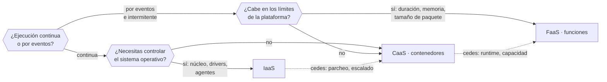

# 015 — IaaS, PaaS, SaaS, CaaS y FaaS

> [← 014 · Regiones, zonas de disponibilidad, puntos de presencia y edge](../../part-01-cloud-principles-strategy-adoption/014-regiones-zonas-de-disponibilidad-puntos-de-presencia-y-edge/README.md) · [Índice de la parte](../README.md) · [016 · Elasticidad, escalabilidad, disponibilidad y resiliencia →](../../part-01-cloud-principles-strategy-adoption/016-elasticidad-escalabilidad-disponibilidad-y-resiliencia/README.md)

**Parte:** 01 — Principios, estrategia y adopción cloud<br>
**Nivel:** inicial-intermedio · **Horas estimadas:** 4<br>
**Laboratorio:** `decision` · **Estado:** `EXECUTABLE_CORE`

## 🎯 Propósito

Elegir modelo de servicio por lo que cede y lo que retiene, no por comodidad aparente. Cada escalón hacia arriba entrega operación al proveedor y a cambio impone sus límites: cuotas, tiempos máximos, runtimes soportados y una forma concreta de bloqueo. Esta clase da el criterio con el que se decidirá entre EC2, Fargate y Lambda —o sus equivalentes— en las partes 17, 18 y 19.

## 📚 Resultados de aprendizaje

Al finalizar podrás:

1. **Situar** una carga en el modelo adecuado a partir de su perfil de ejecución y su tolerancia a límites.
2. **Calcular** el punto de cruce económico entre función y contenedor permanente para una carga dada.
3. **Anticipar** qué límites duros impone cada modelo y cuáles no se pueden negociar.
4. **Distinguir** bloqueo de datos, de API y operativo, y estimar el coste de salida de cada uno.
5. **Justificar** por qué CaaS y FaaS no son escalones sucesivos sino respuestas a preguntas distintas.

## 🧩 Conceptos centrales

| Concepto | Comprensión verificable |
|---|---|
| `arranque en frío` | Latencia adicional cuando no hay instancia caliente y hay que crear el entorno de ejecución. Va de decenas de milisegundos a varios segundos según runtime y tamaño del paquete, y solo afecta a una fracción de las invocaciones. |
| `concurrencia` | Ejecuciones simultáneas. En FaaS es la unidad de escalado y de cuota; en CaaS y IaaS se deriva del número de instancias y de trabajadores por instancia. |
| `bloqueo de proveedor` | Coste de migrar a otro proveedor. No es binario: se descompone en datos, API y operación, y cada componente tiene un coste de salida distinto. |
| `plano de control` | Parte del servicio que gestiona el ciclo de vida —crear, escalar, actualizar—. Al subir de modelo se cede el plano de control y con él la capacidad de intervenir cuando falla. |
| `granularidad de facturación` | Unidad mínima que se cobra: hora, segundo o milisegundo con memoria asignada. Determina si una carga intermitente es barata o ruinosa. |

## 🧠 Modelo mental

La nube es un modelo operativo de acceso bajo demanda, no un lugar mágico ni el centro de datos de otra persona.

Aplicado a esta clase, separa siempre cuatro planos: **intención** (qué necesita el usuario),
**configuración** (qué declaramos), **estado observado** (qué existe de verdad) y
**evidencia** (cómo sabemos que cumple). Confundirlos produce diseños que se ven correctos
en un diagrama pero fallan al operar.

## 🗺️ Flujo de razonamiento



## 📖 Desarrollo

### 1. Cada escalón cede operación y recibe límites

Subir de modelo no es «más fácil»: es un intercambio explícito. Se entrega trabajo operativo y se aceptan restricciones que antes no existían.

| | IaaS | CaaS | FaaS |
|---|---|---|---|
| Tú operas | SO, parches, escalado, runtime | Imagen y réplicas | Solo el código |
| El proveedor opera | Hardware, hipervisor | + SO y orquestación | + capacidad y escalado |
| Unidad de escalado | Instancia (minutos) | Tarea (decenas de s) | Invocación (ms) |
| Facturación | Por segundo, encendido | Por segundo, con tarea viva | Por ms × memoria, solo al ejecutar |
| Límite duro típico | Cuota de instancias | Cuota de tareas | **Duración máxima** |
| Estado local | Persistente | Efímero por tarea | Efímero, no garantizado |

La fila de límites duros es la decisiva y la que más tarde se descubre. En FaaS existe un **techo de duración por invocación** —15 minutos en AWS Lambda, 60 en Cloud Run functions de 2.ª generación, 10 en el plan de consumo de Azure Functions— que no es negociable con soporte. Una carga que hoy tarda 8 minutos y crece un 20 % anual choca contra el techo en tres años, y la migración no será un ajuste de configuración: será reescribir el modelo de ejecución.

La fila de facturación explica el resto: FaaS solo cobra mientras ejecuta. Para una carga que corre 50 ms cada 10 minutos, eso es la diferencia entre pagar 0,4 segundos al día y pagar 24 horas.

### 2. El punto de cruce económico se calcula, no se opina

La comparación entre función y contenedor permanente tiene un umbral concreto. Con precios orientativos:

```text
FaaS:  0,0000166667 USD por GB-segundo + 0,20 USD por millón de invocaciones
CaaS:  ~0,04 USD por hora de 1 vCPU + 2 GB (tarea permanente)
```

Para una función de 512 MB que tarda 200 ms, con *N* invocaciones al mes:

```text
coste FaaS(N) = N × 0,2 s × 0,5 GB × 0,0000166667 + N × 0,0000002
              = N × (1,6667e-6 + 2e-7) = N × 1,8667e-6

coste CaaS    = 730 h × 0,04 = 29,20 USD/mes (fijo)

umbral: N = 29,20 / 1,8667e-6 ≈ 15,6 millones de invocaciones/mes
                                ≈ 6 invocaciones por segundo sostenidas
```

**Por debajo de ~6 invocaciones por segundo sostenidas, la función sale más barata; por encima, el contenedor.** Y el umbral se desplaza con la duración: si la función tardara 2 segundos en vez de 200 ms, el cruce bajaría a 1,56 millones —0,6 por segundo—, porque el coste de FaaS es lineal en el tiempo de ejecución.

Dos matices que el cálculo simple omite:

- El contenedor permanente necesita **al menos dos réplicas** para tolerar fallos, así que su coste real se duplica y el umbral sube.
- FaaS escala a cero, así que en entornos de pruebas o cargas estacionales su ventaja es mayor que la que sugiere la media.

### 3. El arranque en frío importa menos de lo que se teme y más de lo que se mide

El arranque en frío se cita como el argumento contra FaaS y casi siempre se estima mal en ambas direcciones.

Afecta solo a las invocaciones que no encuentran instancia caliente. Con tráfico sostenido, esa fracción es pequeña:

```text
invocaciones/mes            2.000.000
arranques en frío medidos      12.000     → 0,6 %
latencia p50 en caliente          45 ms
latencia p50 en frío             820 ms

impacto en p50 global: despreciable
impacto en p99: el p99 ES el arranque en frío si supera el 1 %
```

La segunda línea es la que se olvida: **con un 0,6 % de arranques en frío, el p99 global no los ve; con un 1,5 %, el p99 pasa a ser el arranque en frío**. La pregunta correcta no es «¿hay arranque en frío?» sino «¿qué percentil de mi SLO cae dentro de esa fracción?».

Los factores que la determinan, por orden de impacto:

1. **Tamaño del paquete**: hay que descargarlo y descomprimirlo. Un artefacto de 250 MB arranca en frío mucho peor que uno de 5 MB.
2. **Runtime**: los que necesitan inicializar una máquina virtual —JVM, .NET— pagan más que los interpretados o compilados a nativo.
3. **Conectividad a red privada**: adjuntar la función a una VPC añadía segundos históricamente; hoy es del orden de decenas de milisegundos, pero conviene medirlo y no asumirlo.

Mitigaciones reales: concurrencia aprovisionada —que **elimina el ahorro de escalar a cero** y cambia la aritmética anterior—, reducir el paquete, y mantener caliente solo la ruta crítica.

### 4. Bloqueo: tres componentes con costes de salida distintos

«Bloqueo de proveedor» se usa como una sola cosa y son tres, con coste de salida muy desigual:

| Tipo | Ejemplo | Coste de salida |
|---|---|---|
| **De datos** | Formato propietario, egreso de 40 TB | Alto: se paga por GB y lleva tiempo |
| **De API** | SDK específico incrustado en el dominio | Medio: reescribir adaptadores |
| **Operativo** | Runbooks, formación, herramientas del equipo | **El más alto y el menos contabilizado** |

El orden habitual de preocupación es el inverso al orden de coste. Se discute mucho sobre no usar un servicio propietario y nada sobre que el equipo solo sabe operar una consola.

El bloqueo **crece con el modelo de servicio**, pero no de forma uniforme:

- **IaaS**: bajo en API —una máquina virtual es una máquina virtual—, alto en datos si el volumen es grande.
- **CaaS**: bajo si la imagen es OCI estándar y el orquestador es Kubernetes; alto si se usan extensiones propietarias del proveedor.
- **FaaS**: alto en API —el modelo de eventos, los disparadores y el formato de entrada son específicos— pero el código de negocio puede aislarse tras un adaptador fino.

La estrategia práctica no es evitar el bloqueo, que es imposible y caro: es **saber cuánto cuesta salir y decidir a sabiendas**. Un servicio propietario que ahorra 30.000 USD al año con un coste de salida estimado de 40.000 es una decisión razonable; el problema es no haber calculado nunca el segundo número.

### 5. CaaS y FaaS no son escalones, son respuestas distintas

La presentación habitual como escalera —IaaS, PaaS, CaaS, FaaS, cada uno «más gestionado»— sugiere que FaaS es la meta. No lo es: responden a preguntas diferentes.

**CaaS responde a**: quiero portabilidad del artefacto y control del entorno de ejecución, sin gestionar sistemas operativos. La imagen OCI corre igual en cualquier sitio; el coste es que sigues decidiendo réplicas, límites y sondas.

**FaaS responde a**: quiero que la unidad de escalado sea la petición y no pagar por capacidad ociosa. El coste es aceptar los límites de la plataforma y un modelo de eventos específico.

Una carga puede ser mala candidata para FaaS y excelente para CaaS **aunque sea moderna y sin estado**: basta con que su duración supere el techo, que necesite conexiones persistentes —WebSocket largo— o que su patrón de tráfico sea sostenido y alto, donde el umbral calculado antes favorece al contenedor.

Y al revés: una tarea programada que corre 3 segundos cada hora es ruinosa como contenedor permanente —730 horas facturadas para 0,73 horas de trabajo, un 0,1 % de utilización— y trivial como función.

**El criterio es el perfil de ejecución, no la modernidad del modelo.**

## 🔬 Ejemplo trabajado

**CloudShop tiene tres cargas que hoy corren en máquinas virtuales y quiere decidir modelo para cada una.** Se aplican las dos preguntas del árbol y la aritmética.

**Carga A — generación de miniaturas al subir una imagen.**

```text
perfil       por eventos, 8.400 invocaciones/día, 1,2 s cada una, 512 MB
límites      duración 1,2 s « techo de 15 min          ✓ cabe
coste FaaS   8.400×30 × 1,2 s × 0,5 GB × 1,6667e-6 + invocaciones
             = 252.000 × 1,0e-6 + 0,05 = 0,30 USD/mes
coste CaaS   2 réplicas × 29,20 = 58,40 USD/mes
utilización  252.000 × 1,2 s / (730×3600) = 11,5 %
```

**FaaS, por un factor de 195.** La utilización del 11,5 % es exactamente el caso que la función resuelve.

**Carga B — API de catálogo.**

```text
perfil       continua, 610 peticiones/s en pico, 45 ms, 512 MB
umbral calculado: ~6 inv/s → 610 está 100 veces por encima
coste FaaS   610×2,6e6 s/mes × 0,045 s × 0,5 × 1,6667e-6 ≈ 1.190 USD/mes
coste CaaS   por ley de Little: L = 610 × 0,045 = 27,5 concurrentes
             a ρ=0,7 → 40 concurrentes → 4 tareas de 16 → 4 × 29,20 = 117 USD/mes
```

**CaaS, por un factor de 10.** Tráfico sostenido y alto: el contenedor gana con holgura.

**Carga C — procesamiento nocturno de conciliación contable.**

```text
perfil       una vez al día, 38 min actuales, crecimiento 20 % anual
límites      38 min > techo de 15 min de FaaS          ✗ no cabe
             y en 3 años serán 66 min
necesita     acceso a un driver de base de datos legado con biblioteca nativa
```

Dos exclusiones independientes: **excede el techo de duración** y necesita control del entorno para una biblioteca nativa. La segunda también descarta CaaS con imágenes mínimas sin capacidad de instalar dependencias del sistema.

```text
resultado    IaaS o CaaS con imagen completa; se elige CaaS como tarea programada
             coste: 38 min/día × 30 = 19 h/mes × 0,04 = 0,76 USD/mes
             frente a una VM encendida 730 h = 29,20 USD/mes
```

**Decisión final y bloqueo estimado:**

```text                modelo   coste/mes   bloqueo de API    salida estimada
A · miniaturas       FaaS      0,30 USD   alto (eventos)    ~2 días de trabajo
B · API catálogo     CaaS    117,00 USD   bajo (OCI)        ~0: imagen portable
C · conciliación     CaaS      0,76 USD   bajo              ~0
```

El bloqueo alto de A se acepta explícitamente: el adaptador de eventos son unas 40 líneas y el resto de la lógica es agnóstica. **Se registra en el ADR que la lógica de negocio no debe importar tipos del SDK del proveedor**, que es lo que convierte dos días en dos meses cuando llega la migración.

Ahorro total frente a las tres máquinas virtuales actuales (3 × 29,20 = 87,60 USD, más operación): el coste baja a 118 USD pero **la carga B pasa de una VM a cuatro tareas**, dimensionadas por la ley de Little en vez de por costumbre. El ahorro real no está en la factura sino en dejar de parchear tres sistemas operativos.

## 🧪 Laboratorio guiado

Ejecuta desde la raíz:

```bash
python classes/part-01-cloud-principles-strategy-adoption/015-iaas-paas-saas-caas-y-faas/lab.py
```

El laboratorio selecciona el motor de práctica **`decision`** y produce
`lab_result.json`. El escenario, sus comprobaciones y el artefacto esperado corresponden a
esta clase; no requiere credenciales y deja explícito qué debe revalidarse en un sandbox real.

1. Lee `exercise.steps` y formula una predicción antes de ejecutar.
2. Ejecuta la práctica y verifica todos los elementos de `checks`.
3. Provoca el caso de `negative_test` y explica la señal observada.
4. Materializa `matriz-de-servicios` en `evidence/` usando la plantilla indicada.
5. Para proveedor real, sigue `sandbox.requires`, registra costo y ejecuta `destroy`.

### Evidencia esperada

El artefacto principal es una matriz de decisión ponderada y un ADR. Además, la entrega debe incluir el comando ejecutado,
la salida estructurada y una conclusión que no exceda lo observado.

## 🏆 Reto verificable

Construye **`matriz-de-servicios`** para el caso CloudShop. Incluye una alternativa descartada,
un supuesto que pueda falsarse, una prueba de fallo y una decisión de rollback.

## ✅ Criterio de aceptación

- [ ] `lab.py` termina con código 0 y genera JSON válido.
- [ ] La entrega conecta al menos tres requisitos con mecanismos verificables.
- [ ] Existe una prueba positiva y una prueba negativa con evidencia.
- [ ] Seguridad, costo y operación aparecen como decisiones, no como anexos.
- [ ] Se declara una limitación y una condición que obligaría a revisar el diseño.
- [ ] Otra persona puede repetir el recorrido sin conocimiento tácito.

## ⚠️ Errores frecuentes

| Síntoma | Causa probable | Corrección |
|---|---|---|
| Una carga migrada a funciones empieza a fallar cuando crece | Se acercó al techo de duración por invocación, que no es negociable | Comprueba el margen contra el techo con la proyección de crecimiento antes de elegir FaaS. |
| El coste de las funciones supera al de los contenedores que sustituyeron | El tráfico sostenido está por encima del punto de cruce | Calcula el umbral con tu duración y memoria reales; con tráfico alto y continuo, el contenedor gana. |
| Se activa concurrencia aprovisionada y desaparece el ahorro esperado | La concurrencia aprovisionada elimina el escalado a cero, que era la fuente del ahorro | Aprovisiona solo la ruta crítica y recalcula el umbral con ese coste fijo incluido. |
| El p99 se dispara aunque el p50 esté bien | La fracción de arranques en frío supera el 1 % y pasa a dominar el percentil del SLO | Mide la fracción real y compárala con el percentil que fija tu SLO, no con la media. |
| Migrar de proveedor cuesta meses pese a usar contenedores portables | El bloqueo operativo —runbooks, herramientas, formación— no se contabilizó | Estima los tres tipos de bloqueo por separado; el operativo suele ser el mayor. |

## 🛡️ Seguridad, ética y costo

Trabaja con cuentas propias o sandboxes autorizados. No publiques secretos, identificadores
reales ni datos personales. Antes de crear recursos pagos define presupuesto, etiquetas y
comando de destrucción; después verifica que no queden recursos huérfanos. Los ejemplos
locales enseñan contratos, pero no certifican cumplimiento ni disponibilidad de producción.

## ❓ Preguntas de comprobación

1. Una función de 512 MB tarda 200 ms. ¿A partir de cuántas invocaciones por segundo sale más barato un contenedor permanente, y cómo cambia si tardara 2 s?
2. ¿Por qué un 0,6 % de arranques en frío no afecta al p99 y un 1,5 % sí?
3. Una carga sin estado, moderna y de 40 minutos. ¿Es candidata a FaaS? Justifica con el límite concreto.
4. Ordena los tres tipos de bloqueo por coste de salida y explica por qué el orden de preocupación suele ser el inverso.
5. Una tarea corre 3 segundos cada hora. ¿Qué utilización tendría como contenedor permanente y qué modelo corresponde?

## 🔗 Referencias

- Mell, P. y Grance, T. (2011). *The NIST Definition of Cloud Computing*, SP 800-145 — los tres modelos de servicio originales. <https://doi.org/10.6028/NIST.SP.800-145>
- AWS (2024). *Lambda quotas* — techo de duración, memoria, tamaño de paquete y concurrencia. <https://docs.aws.amazon.com/lambda/latest/dg/gettingstarted-limits.html>
- Google Cloud (2024). *Cloud Run functions: quotas and limits* — límites de la 1.ª y 2.ª generación. <https://cloud.google.com/functions/quotas>
- Jonas, E. et al. (2019). *Cloud Programming Simplified: A Berkeley View on Serverless Computing* — límites estructurales del modelo de funciones. <https://doi.org/10.48550/arXiv.1902.03383>
- Hohpe, G. (2020). *Cloud Strategy*, cap. sobre bloqueo — descomposición del coste de salida en datos, API y operación.
- Documentación oficial vigente del servicio implementado; registra URL y fecha de consulta.

---

> [Evaluación](assessment.md) · [Contrato de clase](lesson.yaml) · [Índice de la parte](../README.md)

**📥 Descargar:** [Parte 01 en PDF](../../../site/downloads/partes/manual-parte-01-cloud-principles-strategy-adoption.pdf) · [Manual integral](../../../site/downloads/multi-cloud-engineering-manual-v2.0.pdf)

| Anterior | Índice | Siguiente |
|---|---|---|
| [← 014 · Regiones, zonas de disponibilidad, puntos de presencia y edge](../../part-01-cloud-principles-strategy-adoption/014-regiones-zonas-de-disponibilidad-puntos-de-presencia-y-edge/README.md) | [Parte 01](../README.md) · [Programa](../../README.md) | [016 · Elasticidad, escalabilidad, disponibilidad y resiliencia →](../../part-01-cloud-principles-strategy-adoption/016-elasticidad-escalabilidad-disponibilidad-y-resiliencia/README.md) |
