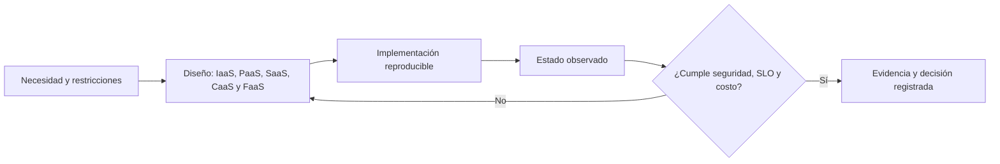

# 015 — IaaS, PaaS, SaaS, CaaS y FaaS

> [← Clase anterior](../../part-01-cloud-principles-strategy-adoption/014-regiones-zonas-de-disponibilidad-puntos-de-presencia-y-edge/README.md) · [Índice de la parte](../README.md) · [Clase siguiente →](../../part-01-cloud-principles-strategy-adoption/016-elasticidad-escalabilidad-disponibilidad-y-resiliencia/README.md)

**Parte:** 01 — Principios, estrategia y adopción cloud  
**Nivel:** inicial-intermedio · **Horas estimadas:** 4  
**Laboratorio:** `decision` · **Estado:** `EXECUTABLE_CORE`

## 🎯 Propósito

Comprender y aplicar **iaas, paas, saas, caas y faas** dentro de una plataforma cloud realista,
produciendo evidencia reproducible y una decisión que explicite seguridad, confiabilidad,
costo y operación. La meta no es memorizar nombres de servicios: es reconocer el problema,
seleccionar una solución proporcional y demostrar qué ocurrió.

## 📚 Resultados de aprendizaje

Al finalizar podrás:

1. **Explicar** iaas, paas, saas, caas y faas con vocabulario independiente del proveedor.
2. **Relacionar** sus componentes con el modelo mental de la parte.
3. **Ejecutar** un laboratorio local determinista y leer su contrato JSON.
4. **Evaluar** al menos una alternativa y justificar el trade-off elegido.
5. **Entregar** `matriz-de-servicios` con evidencia, límites y criterio de reversión.

## 🧩 Conceptos centrales

| Concepto | Comprensión verificable |
|---|---|
| `iaas` | Define su papel en **iaas, paas, saas, caas y faas** y cómo observarlo en un sistema real. |
| `paas` | Define su papel en **iaas, paas, saas, caas y faas** y cómo observarlo en un sistema real. |
| `saas` | Define su papel en **iaas, paas, saas, caas y faas** y cómo observarlo en un sistema real. |
| `caas` | Define su papel en **iaas, paas, saas, caas y faas** y cómo observarlo en un sistema real. |
| `faas` | Define su papel en **iaas, paas, saas, caas y faas** y cómo observarlo en un sistema real. |

## 🧠 Modelo mental

La nube es un modelo operativo de acceso bajo demanda, no un lugar mágico ni el centro de datos de otra persona.

Aplicado a esta clase, separa siempre cuatro planos: **intención** (qué necesita el usuario),
**configuración** (qué declaramos), **estado observado** (qué existe de verdad) y
**evidencia** (cómo sabemos que cumple). Confundirlos produce diseños que se ven correctos
en un diagrama pero fallan al operar.

## 🗺️ Flujo de razonamiento



## 📖 Desarrollo

### 1. Del requisito al mecanismo

Empieza por una frase medible: quién consume la capacidad, bajo qué carga, desde dónde,
con qué datos y qué impacto tendría un fallo. Después identifica el mecanismo de esta clase
que satisface cada restricción. Un producto cloud solo es una implementación posible; el
requisito permanece aunque cambies de AWS a Azure, Google Cloud o infraestructura propia.

### 2. Fronteras y responsabilidades

Documenta quién administra identidad, red, datos, runtime y observabilidad. Marca qué queda
en manos del proveedor y qué sigue siendo responsabilidad del equipo. Cada frontera debe
tener propietario, interfaz, señal operativa y forma de recuperación. Si una responsabilidad
no tiene dueño, el diseño todavía está incompleto.

### 3. Compensaciones que deben quedar visibles

| Dimensión | Pregunta de diseño |
|---|---|
| Confiabilidad | ¿Qué falla, cómo se detecta y cuánto tarda en recuperarse? |
| Seguridad | ¿Qué identidad actúa y cuál es el mínimo privilegio necesario? |
| Costo | ¿Cuál es la unidad de consumo y qué hace crecer la factura? |
| Operación | ¿Qué señal permite diagnosticarlo sin entrar manualmente al servidor? |
| Portabilidad | ¿Qué contrato es estándar y qué decisión es específica del proveedor? |

La respuesta correcta puede ser más simple que la arquitectura inicialmente imaginada. En
cloud, complejidad también consume presupuesto de error, tiempo de equipo y capacidad de
respuesta a incidentes.

## 🔬 Ejemplo trabajado

Una plataforma de pedidos necesita aplicar **iaas, paas, saas, caas y faas**. El equipo registra:

- demanda base de 20 solicitudes/s y pico de 120 solicitudes/s;
- SLO mensual de 99,9 % para operaciones de lectura;
- RPO de 15 minutos y RTO de 60 minutos;
- datos personales que no pueden salir de la región aprobada;
- presupuesto inicial de USD 600/mes.

La decisión se acepta solo si explica cómo la propuesta responde a esas cinco restricciones.
Se descarta cualquier alternativa que dependa de acceso administrativo permanente, no tenga
telemetría o cuyo costo no pueda atribuirse. El resultado esperado no es "usar servicio X",
sino una cadena trazable: requisito → mecanismo → prueba → señal → límite.

## 🧪 Laboratorio guiado

Ejecuta desde la raíz:

```bash
python classes/part-01-cloud-principles-strategy-adoption/015-iaas-paas-saas-caas-y-faas/lab.py
```

El laboratorio reutiliza un motor didáctico probado y produce `lab_result.json`. Su objetivo
es practicar el contrato antes de depender de credenciales o una cuenta con costo.

1. Ejecuta con la semilla predeterminada y conserva la salida.
2. Repite con `--seed 42`; confirma qué cambia y qué permanece estable.
3. Revisa `decision`, `evidence`, `limitations` y `cost_units`.
4. Añade una prueba negativa relacionada con el tema de la clase.
5. Documenta por qué la simulación no equivale a una validación en producción.

### Evidencia esperada

El artefacto principal es una matriz de decisión ponderada y un ADR. Además, la entrega debe incluir el comando ejecutado,
la salida estructurada y una conclusión que no exceda lo observado.

## 🏆 Reto verificable

Construye **`matriz-de-servicios`** para el caso CloudShop. Incluye una alternativa descartada,
un supuesto que pueda falsarse, una prueba de fallo y una decisión de rollback.

## ✅ Criterio de aceptación

- [ ] `lab.py` termina con código 0 y genera JSON válido.
- [ ] La entrega conecta al menos tres requisitos con mecanismos verificables.
- [ ] Existe una prueba positiva y una prueba negativa con evidencia.
- [ ] Seguridad, costo y operación aparecen como decisiones, no como anexos.
- [ ] Se declara una limitación y una condición que obligaría a revisar el diseño.
- [ ] Otra persona puede repetir el recorrido sin conocimiento tácito.

## ⚠️ Errores frecuentes

| Síntoma | Causa probable | Corrección |
|---|---|---|
| El diseño enumera servicios pero no requisitos | Se comenzó por el catálogo del proveedor | Reescribe primero escenarios y restricciones medibles. |
| La demo funciona una vez y se declara lista | Se confundió ejecución con evidencia operacional | Añade repetición, fallo, telemetría y recuperación. |
| Todo tiene permisos administrativos | El laboratorio heredó credenciales humanas | Usa identidad de workload y prueba explícitamente la denegación. |
| No se puede explicar la factura | Faltan unidades y ownership de costo | Etiqueta, estima por unidad y define presupuesto o alerta. |
| La solución se llama multi-cloud pero replica todo | Portabilidad se confundió con duplicación | Define qué riesgo se mitiga y porta solo el contrato necesario. |

## 🛡️ Seguridad, ética y costo

Trabaja con cuentas propias o sandboxes autorizados. No publiques secretos, identificadores
reales ni datos personales. Antes de crear recursos pagos define presupuesto, etiquetas y
comando de destrucción; después verifica que no queden recursos huérfanos. Los ejemplos
locales enseñan contratos, pero no certifican cumplimiento ni disponibilidad de producción.

## ❓ Preguntas de comprobación

1. ¿Qué parte del diseño seguiría siendo válida en otro proveedor?
2. ¿Qué señal distinguiría saturación, fallo de dependencia y error de configuración?
3. ¿Cuál es la unidad de costo y quién puede actuar sobre ella?
4. ¿Qué permiso puede retirarse sin romper el caso de uso?
5. ¿Qué evidencia falta para afirmar que esto está listo para producción?

## 🔗 Referencias

- Cloud Strategy — Gregor Hohpe.
- Cloud FinOps — Storment y Fuller.
- Accelerate — Forsgren, Humble y Kim.
- Documentación oficial vigente del servicio implementado; registra URL y fecha de consulta.

---

> [Evaluación](assessment.md) · [Contrato de clase](lesson.yaml) · [Índice de la parte](../README.md)
