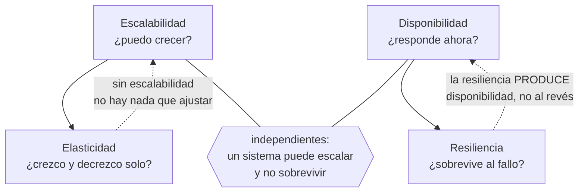

# 016 — Elasticidad, escalabilidad, disponibilidad y resiliencia

> [← 015 · IaaS, PaaS, SaaS, CaaS y FaaS](../../part-01-cloud-principles-strategy-adoption/015-iaas-paas-saas-caas-y-faas/README.md) · [Índice de la parte](../README.md) · [017 · Tenancy, cuentas, suscripciones, proyectos y jerarquías →](../../part-01-cloud-principles-strategy-adoption/017-tenancy-cuentas-suscripciones-proyectos-y-jerarquias/README.md)

**Parte:** 01 — Principios, estrategia y adopción cloud<br>
**Nivel:** inicial-intermedio · **Horas estimadas:** 4<br>
**Laboratorio:** `reliability` · **Estado:** `EXECUTABLE_CORE`

## 🎯 Propósito

Separar cuatro palabras que se usan como sinónimos y significan cosas distintas: elasticidad, escalabilidad, disponibilidad y resiliencia. Confundirlas produce sistemas que escalan pero no sobreviven, o que sobreviven pero cuestan el triple. Aquí se establece la aritmética —ley de Amdahl, ley universal de escalabilidad, disponibilidad compuesta— con la que se dimensionará el resto del programa.

## 📚 Resultados de aprendizaje

Al finalizar podrás:

1. **Definir** las cuatro propiedades por lo que garantizan y por lo que no, con un ejemplo de sistema que cumple una y falla otra.
2. **Aplicar** la ley de Amdahl para acotar la ganancia máxima de paralelizar una carga.
3. **Explicar** por qué a partir de cierto punto añadir nodos empeora el rendimiento, usando la ley universal de escalabilidad.
4. **Dimensionar** un autoescalado con umbrales, periodos de enfriamiento y margen de arranque que no oscile.
5. **Distinguir** MTBF de MTTR y justificar por qué reducir el segundo suele ser más barato que aumentar el primero.

## 🧩 Conceptos centrales

| Concepto | Comprensión verificable |
|---|---|
| `escalabilidad` | Capacidad de aumentar la capacidad al añadir recursos. Es una propiedad del diseño y tiene un techo determinado por la fracción no paralelizable y por el coste de coordinación. |
| `elasticidad` | Capacidad de ajustar la capacidad a la demanda de forma automática y en ambas direcciones. Presupone escalabilidad, pero un sistema escalable puede no ser elástico si nadie automatiza el ajuste. |
| `disponibilidad` | Fracción del tiempo en que el sistema responde correctamente. Se mide como MTBF/(MTBF+MTTR), lo que revela que hay dos palancas y no una. |
| `resiliencia` | Capacidad de seguir prestando servicio, aunque degradado, mientras algo falla, y de recuperarse después. Es lo que hace que un fallo no se convierta en una caída. |
| `coherencia` | En la ley universal de escalabilidad, el coste de mantener sincronizados N nodos. Crece con N² y es lo que hace que añadir nodos llegue a empeorar el rendimiento total. |

## 🧠 Modelo mental

La nube es un modelo operativo de acceso bajo demanda, no un lugar mágico ni el centro de datos de otra persona.

Aplicado a esta clase, separa siempre cuatro planos: **intención** (qué necesita el usuario),
**configuración** (qué declaramos), **estado observado** (qué existe de verdad) y
**evidencia** (cómo sabemos que cumple). Confundirlos produce diseños que se ven correctos
en un diagrama pero fallan al operar.

## 🗺️ Flujo de razonamiento



## 📖 Desarrollo

### 1. Cuatro propiedades, cuatro preguntas distintas

El vocabulario se usa mal a diario y cada confusión tiene un coste concreto:

| Propiedad | Pregunta | Se mide con | Falla cuando |
|---|---|---|---|
| Escalabilidad | ¿Puedo atender más añadiendo recursos? | Rendimiento frente a nodos | Hay un cuello serializado |
| Elasticidad | ¿Se ajusta solo, en ambos sentidos? | Tiempo de reacción y utilización | Solo escala hacia arriba |
| Disponibilidad | ¿Responde ahora? | Tiempo útil / tiempo total | Un componente único cae |
| Resiliencia | ¿Sigue sirviendo mientras falla algo? | Comportamiento bajo fallo inyectado | Todo es esencial |

Las combinaciones que existen en la práctica y demuestran que son independientes:

- **Escalable pero no disponible**: 200 réplicas sin estado contra una única base de datos. Atiende cualquier volumen y cae entera cuando cae la base.
- **Disponible pero no elástico**: tres zonas sobredimensionadas al triple, siempre encendidas. Nunca cae y desperdicia el 70 % del gasto.
- **Elástico pero no resiliente**: escala en 90 segundos y toda dependencia es esencial. Si el servicio de recomendaciones tarda, el catálogo entero devuelve 500.
- **Resiliente pero no escalable**: degrada con elegancia, tiene circuit breakers y plazos, y su cuello de botella serializado le impide pasar de 400 peticiones por segundo hagas lo que hagas.

Cada una necesita un trabajo distinto. Pedir «que escale» cuando el problema es de resiliencia produce más réplicas de algo que sigue cayendo igual.

### 2. La ley de Amdahl pone el techo

Si una fracción *p* del trabajo se puede paralelizar y el resto no, la aceleración con *N* recursos es:

```text
S(N) = 1 / ((1 − p) + p/N)

límite cuando N → ∞:   S(∞) = 1 / (1 − p)
```

La consecuencia es brutal y contraintuitiva:

| Fracción paralelizable | Aceleración máxima | Con 16 nodos |
|---|---|---|
| 50 % | 2× | 1,88× |
| 90 % | 10× | 6,4× |
| 95 % | 20× | 9,1× |
| 99 % | 100× | 13,9× |

Con un 95 % paralelizable, **el 5 % serializado limita la ganancia a 20× por muchos nodos que pongas**. Y con 16 nodos solo se obtiene 9,1× —un 57 % de eficiencia—: la mitad del gasto no produce rendimiento.

Aplicado a una petición web, la fracción serializada suele estar en sitios concretos y localizables:

- Una transacción que toma un bloqueo sobre una fila muy consultada.
- Un contador global incrementado en cada petición.
- Una secuencia de base de datos para generar identificadores.
- Un límite de tasa implementado con un único contador central.

**Encontrar y eliminar el 5 % serializado da más rendimiento que triplicar los nodos.** Ese es el trabajo de ingeniería que un autoescalado no puede sustituir.

### 3. La ley universal de escalabilidad: cuando añadir nodos empeora

Amdahl explica el techo pero no explica algo que se observa en producción: a partir de cierto número de nodos el rendimiento **baja**. Gunther lo modela añadiendo un término de coherencia:

```text
C(N) = N / (1 + σ(N − 1) + κN(N − 1))

σ = contención (serialización, como en Amdahl)
κ = coherencia (coste de sincronizar entre nodos, crece con N²)
```

Con σ = 0,03 y κ = 0,0001:

| N | C(N) | Eficiencia |
|---|---|---|
| 10 | 7,8× | 78 % |
| 20 | 12,7× | 64 % |
| 40 | 17,4× | 44 % |
| **57** | **18,6×** | **33 %** ← máximo |
| 80 | 18,2× | 23 % |
| 120 | 16,6× | 14 % |

**A partir de 57 nodos, cada nodo adicional reduce el rendimiento total.** El término κN² es el coste de que todos se pongan de acuerdo: réplicas que sincronizan estado, nodos de caché que se invalidan entre sí, miembros de un clúster que intercambian latidos.

Esto explica un patrón que de otro modo parece magia: **partir un clúster de 100 nodos en cuatro de 25 mejora el rendimiento agregado**, porque κ actúa dentro de cada partición y no entre ellas. Es el fundamento de la celdas y del particionado que aparecerán en la parte 12.

Ajustar σ y κ a un sistema real requiere medir el rendimiento con varios tamaños de clúster. El valor del modelo no es predecir con precisión, sino **saber que el óptimo existe y es finito**.

### 4. Disponibilidad: dos palancas, una mucho más barata

La definición operativa revela algo que la cifra de «nueves» oculta:

```text
A = MTBF / (MTBF + MTTR)

MTBF = tiempo medio entre fallos
MTTR = tiempo medio de reparación
```

Con MTBF de 30 días y MTTR de 4 horas:

```text
A = 720 / (720 + 4) = 99,45 %
```

Para llegar a 99,95 % hay dos caminos:

```text
A) subir MTBF a 8.000 h (11 meses sin fallos) manteniendo MTTR de 4 h
B) bajar MTTR a 22 min manteniendo MTBF de 30 días
```

**El camino A exige hacer el sistema 11 veces más fiable; el B, detectar y recuperar 11 veces más rápido.** El segundo casi siempre es más barato y, sobre todo, es alcanzable: automatizar la conmutación, tener runbooks ejecutables y alertar sobre síntomas en vez de causas.

Esto reordena las prioridades de inversión. Un equipo que gasta en hacer improbable el fallo obtiene rendimientos decrecientes; uno que gasta en **detectar rápido y recuperar automáticamente** mejora la disponibilidad de forma lineal con el esfuerzo.

Y hay un tercer factor que la fórmula no muestra: reducir el **radio de impacto** cambia el numerador de la ecuación de negocio. Un fallo que afecta al 5 % de los usuarios durante 4 horas no es equivalente a uno que afecta al 100 %, aunque la disponibilidad medida como tiempo sea idéntica. Por eso las celdas y las implantaciones progresivas mejoran la experiencia sin tocar ni MTBF ni MTTR.

### 5. Autoescalado que no oscila

Un autoescalado mal configurado produce **oscilación**: añade capacidad, la métrica baja, retira capacidad, la métrica sube, y el ciclo se repite consumiendo más de lo que ahorra.

Cuatro parámetros y su razón:

```text
umbral de subida    70 %   ← por la clase 011: por encima, la latencia se dispara
umbral de bajada    40 %   ← histéresis: NO 65 %, o entra en ciclo
enfriamiento        300 s  ← > tiempo de arranque + estabilización
margen de arranque  120 s  ← lo que tarda una instancia en servir tráfico
```

La **histéresis** —la banda entre 40 % y 70 %— es lo que evita el ciclo. Si los umbrales estuvieran en 70 % y 65 %, al añadir una instancia sobre nueve la utilización caería de 71 % a 64 % y dispararía inmediatamente la bajada.

El **margen de arranque** impone un límite físico a lo que el autoescalado puede resolver: si una instancia tarda 120 segundos en servir tráfico, un pico que se duplica en 30 segundos **no se puede absorber escalando**. Solo hay tres respuestas posibles:

1. Capacidad preexistente suficiente para el pico (cara pero simple).
2. Encolar y absorber el pico con latencia mayor, no con más capacidad.
3. Rechazar con `429` y `Retry-After`, protegiendo lo que ya está en curso.

La tercera es la que casi nadie implementa y la que evita el colapso: **degradar el servicio a una fracción de los usuarios es preferible a caer para todos**. Es resiliencia, no escalabilidad, y por eso este punto pertenece a esta clase y no a la de capacidad.

## 🔬 Ejemplo trabajado

**El catálogo de CloudShop sufre degradación en las promociones. La propuesta del equipo es «poner más réplicas»: de 12 a 40.** Se comprueba con la aritmética antes de gastar.

Mediciones con distintos tamaños de clúster, a carga saturante:

```text
nodos    rendimiento (rps)    eficiencia
  4          3.100             100 %
  8          5.520              89 %
 12          7.190              77 %
 16          8.320              67 %
 24          9.410              51 %
```

Ajustando la ley universal de escalabilidad a estos puntos:

```text
σ ≈ 0,042    (contención)
κ ≈ 0,00035  (coherencia)

N óptimo = √((1 − σ)/κ) = √(0,958/0,00035) ≈ 52 nodos
C(52) ≈ 11.900 rps
C(40) ≈ 11.400 rps
C(24) ≈  9.410 rps
```

**Pasar de 12 a 40 nodos cuesta 3,3 veces más y produce 1,59 veces el rendimiento.** La eficiencia cae del 77 % al 40 %: se pagan 28 nodos para obtener el trabajo de 11.

Se busca el origen de σ = 0,042 antes de aceptar ese gasto:

```sql
-- consulta más frecuente durante el pico
SELECT stock FROM productos WHERE id = $1 FOR UPDATE;
```

**Un bloqueo pesimista sobre la fila del producto en promoción.** Todas las peticiones del artículo destacado se serializan sobre la misma fila: ese es el 4,2 % que la ley detectaba sin saber dónde estaba.

Corrección: se sustituye por un contador particionado en 16 fragmentos con reconciliación asíncrona, patrón que reaparecerá en la parte 12.

```text
nueva medición tras el cambio:
nodos    rendimiento    eficiencia
 12         9.980          92 %
 16        12.900          89 %
 24        18.100          83 %

σ ≈ 0,008   κ ≈ 0,00009
N óptimo = √(0,992/0,00009) ≈ 105 nodos
```

**Con 16 nodos se obtienen 12.900 rps: más que con 40 nodos del diseño anterior (11.400), a un 40 % del coste.**

```text                     nodos   rps      coste relativo   rps por nodo
propuesta original         40    11.400        3,3×             285
tras eliminar el bloqueo   16    12.900        1,3×             806
```

Se fija el autoescalado con los parámetros calculados:

```text
mínimo 12 · máximo 24 · subida al 70 % · bajada al 40 %
enfriamiento 300 s · margen de arranque medido 118 s
```

Y se añade lo que el autoescalado no puede resolver: el pico de la promoción se duplica en 25 segundos, por debajo de los 118 de arranque. Se implementa **rechazo con `429` y `Retry-After` al superar el 85 % de utilización**, que protege las peticiones en curso en vez de degradar todas.

**La lección: la pregunta no era cuántas réplicas, sino cuál era σ. Encontrar el 4,2 % serializado valió más que triplicar el clúster.**

## 🧪 Laboratorio guiado

Ejecuta desde la raíz:

```bash
python classes/part-01-cloud-principles-strategy-adoption/016-elasticidad-escalabilidad-disponibilidad-y-resiliencia/lab.py
```

El laboratorio selecciona el motor de práctica **`reliability`** y produce
`lab_result.json`. El escenario, sus comprobaciones y el artefacto esperado corresponden a
esta clase; no requiere credenciales y deja explícito qué debe revalidarse en un sandbox real.

1. Lee `exercise.steps` y formula una predicción antes de ejecutar.
2. Ejecuta la práctica y verifica todos los elementos de `checks`.
3. Provoca el caso de `negative_test` y explica la señal observada.
4. Materializa `modelo-de-capacidad` en `evidence/` usando la plantilla indicada.
5. Para proveedor real, sigue `sandbox.requires`, registra costo y ejecuta `destroy`.

### Evidencia esperada

El artefacto principal es un escenario de fallo con objetivo y recuperación medida. Además, la entrega debe incluir el comando ejecutado,
la salida estructurada y una conclusión que no exceda lo observado.

## 🏆 Reto verificable

Construye **`modelo-de-capacidad`** para el caso CloudShop. Incluye una alternativa descartada,
un supuesto que pueda falsarse, una prueba de fallo y una decisión de rollback.

## ✅ Criterio de aceptación

- [ ] `lab.py` termina con código 0 y genera JSON válido.
- [ ] La entrega conecta al menos tres requisitos con mecanismos verificables.
- [ ] Existe una prueba positiva y una prueba negativa con evidencia.
- [ ] Seguridad, costo y operación aparecen como decisiones, no como anexos.
- [ ] Se declara una limitación y una condición que obligaría a revisar el diseño.
- [ ] Otra persona puede repetir el recorrido sin conocimiento tácito.

## ⚠️ Errores frecuentes

| Síntoma | Causa probable | Corrección |
|---|---|---|
| Se añaden nodos y el rendimiento total baja | El término de coherencia κN² supera la ganancia; se pasó el óptimo | Mide con varios tamaños, ajusta σ y κ, y particiona en clústeres menores en vez de crecer uno solo. |
| Escalar de 12 a 40 réplicas mejora un 60 % y cuesta un 230 % más | Hay una fracción serializada que la ley de Amdahl limita | Localiza el cuello serializado —bloqueos, contadores, secuencias— antes de escalar. |
| El autoescalado añade y quita instancias en ciclo continuo | Umbrales de subida y bajada demasiado próximos: no hay histéresis | Separa los umbrales (por ejemplo 70 % y 40 %) y fija un enfriamiento mayor que el arranque. |
| Un pico brusco tumba el servicio pese al autoescalado | El pico crece más rápido que el tiempo de arranque; escalar no llega a tiempo | Añade rechazo con 429 y Retry-After, o capacidad preexistente; el escalado no resuelve picos por debajo del margen de arranque. |
| Se invierte en fiabilidad y la disponibilidad apenas mejora | Se atacó el MTBF, con rendimientos decrecientes, en vez del MTTR | Reduce el tiempo de detección y recuperación: suele ser más barato y escala linealmente con el esfuerzo. |

## 🛡️ Seguridad, ética y costo

Trabaja con cuentas propias o sandboxes autorizados. No publiques secretos, identificadores
reales ni datos personales. Antes de crear recursos pagos define presupuesto, etiquetas y
comando de destrucción; después verifica que no queden recursos huérfanos. Los ejemplos
locales enseñan contratos, pero no certifican cumplimiento ni disponibilidad de producción.

## ❓ Preguntas de comprobación

1. Con un 95 % del trabajo paralelizable, ¿cuál es la aceleración máxima y qué eficiencia obtienes con 16 nodos?
2. ¿Por qué partir un clúster de 100 nodos en cuatro de 25 puede mejorar el rendimiento agregado?
3. Un sistema tiene MTBF de 30 días y MTTR de 4 h. Da dos caminos para llegar a 99,95 % e indica cuál es más barato.
4. ¿Qué ocurre si los umbrales de subida y bajada del autoescalado están en 70 % y 65 %?
5. Un pico duplica el tráfico en 25 s y una instancia tarda 118 s en servir. ¿Qué tres respuestas quedan y cuál protege mejor a los usuarios en curso?

## 🔗 Referencias

- Amdahl, G. (1967). *Validity of the Single Processor Approach to Achieving Large Scale Computing Capabilities*. AFIPS Conference Proceedings. <https://doi.org/10.1145/1465482.1465560>
- Gunther, N. (2007). *Guerrilla Capacity Planning* — ley universal de escalabilidad y ajuste de σ y κ.
- Beyer, B. et al., eds. (2016). *Site Reliability Engineering*, cap. 22 — degradación elegante y rechazo de carga. <https://sre.google/sre-book/addressing-cascading-failures/>
- Nygard, M. (2018). *Release It!*, 2.ª ed., caps. 4-5 — patrones de estabilidad frente a fallo en cascada.
- Fielding, R. y Reschke, J., eds. (2022). *RFC 9110*, sec. 15.5.29 — código 429 y cabecera Retry-After. <https://www.rfc-editor.org/rfc/rfc9110#status.429>
- Documentación oficial vigente del servicio implementado; registra URL y fecha de consulta.

---

> [Evaluación](assessment.md) · [Contrato de clase](lesson.yaml) · [Índice de la parte](../README.md)

| Anterior | Índice | Siguiente |
|---|---|---|
| [← 015 · IaaS, PaaS, SaaS, CaaS y FaaS](../../part-01-cloud-principles-strategy-adoption/015-iaas-paas-saas-caas-y-faas/README.md) | [Parte 01](../README.md) · [Programa](../../README.md) | [017 · Tenancy, cuentas, suscripciones, proyectos y jerarquías →](../../part-01-cloud-principles-strategy-adoption/017-tenancy-cuentas-suscripciones-proyectos-y-jerarquias/README.md) |
