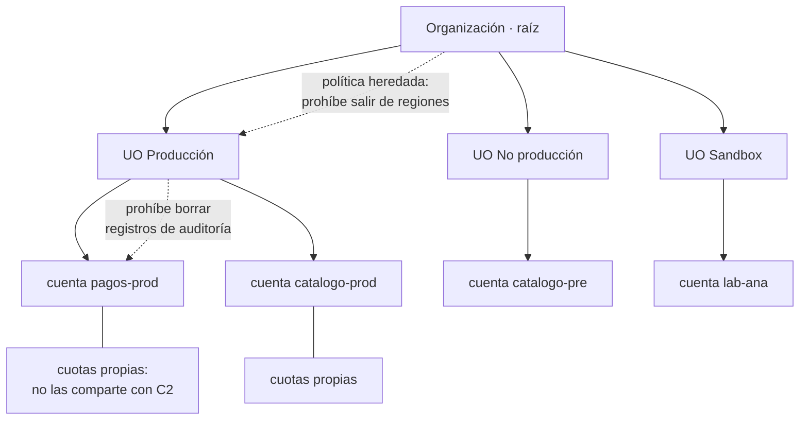

# 017 — Tenancy, cuentas, suscripciones, proyectos y jerarquías

> [← 016 · Elasticidad, escalabilidad, disponibilidad y resiliencia](../../part-01-cloud-principles-strategy-adoption/016-elasticidad-escalabilidad-disponibilidad-y-resiliencia/README.md) · [Índice de la parte](../README.md) · [018 · Identidad, roles, políticas y federación →](../../part-01-cloud-principles-strategy-adoption/018-identidad-roles-politicas-y-federacion/README.md)

**Parte:** 01 — Principios, estrategia y adopción cloud<br>
**Nivel:** inicial-intermedio · **Horas estimadas:** 4<br>
**Laboratorio:** `governance` · **Estado:** `EXECUTABLE_CORE`

## 🎯 Propósito

Diseñar la jerarquía de recursos como el primer control de seguridad y de coste, no como una tarea administrativa. La frontera de cuenta es la única barrera que ningún error de permisos atraviesa, y las cuotas viven en ella: dos razones por las que esta decisión, tomada al principio, condiciona los siguientes cinco años.

## 📚 Resultados de aprendizaje

Al finalizar podrás:

1. **Traducir** la jerarquía de los tres grandes proveedores a un modelo común de contenedor, política heredada y frontera de aislamiento.
2. **Justificar** la separación por cuenta frente a la separación por etiquetas usando radio de impacto y cuotas.
3. **Explicar** por qué una política heredada restrictiva no concede permisos y qué implica al depurar accesos.
4. **Anticipar** qué límites son por cuenta y cómo un vecino interno puede agotarlos.
5. **Diseñar** una estructura de organización que soporte crecimiento sin reorganizaciones destructivas.

## 🧩 Conceptos centrales

| Concepto | Comprensión verificable |
|---|---|
| `frontera de aislamiento` | Límite que un permiso mal concedido no puede atravesar. En los tres grandes proveedores es la cuenta, suscripción o proyecto: dentro se puede fallar en la configuración; fuera hace falta un permiso explícito adicional. |
| `política heredada` | Restricción aplicada a un nodo superior de la jerarquía que acota lo máximo que se puede conceder debajo. No concede nada: solo limita el techo de lo que otras políticas pueden otorgar. |
| `cuota` | Límite de servicio asociado normalmente a la cuenta y la región. Es un recurso compartido entre todo lo que viva en esa cuenta, y por tanto una razón técnica —no organizativa— para separar. |
| `etiqueta` | Par clave-valor sobre un recurso, usado para atribución de coste y automatización. No es una frontera de seguridad: se puede modificar con permisos de escritura sobre el recurso. |
| `unidad organizativa` | Agrupador intermedio en la jerarquía que permite aplicar políticas a un conjunto de cuentas. Su diseño debe reflejar cómo se gobierna, no cómo está el organigrama, porque los organigramas cambian más rápido. |

## 🧠 Modelo mental

La nube es un modelo operativo de acceso bajo demanda, no un lugar mágico ni el centro de datos de otra persona.

Aplicado a esta clase, separa siempre cuatro planos: **intención** (qué necesita el usuario),
**configuración** (qué declaramos), **estado observado** (qué existe de verdad) y
**evidencia** (cómo sabemos que cumple). Confundirlos produce diseños que se ven correctos
en un diagrama pero fallan al operar.

## 🗺️ Flujo de razonamiento



## 📖 Desarrollo

### 1. Un modelo común bajo tres vocabularios

Los tres grandes proveedores implementan la misma idea con nombres distintos. Traducirla evita aprender tres veces lo mismo:

| Concepto | AWS | Azure | Google Cloud |
|---|---|---|---|
| Raíz | Organización | Tenant de Entra ID | Organización |
| Agrupador | Unidad organizativa | Grupo de administración | Carpeta |
| **Frontera de aislamiento** | **Cuenta** | **Suscripción** | **Proyecto** |
| Agrupador interno | — | Grupo de recursos | — |
| Política heredada | SCP | Azure Policy | Restricción de organización |

La fila en negrita es la que importa: **es donde viven las cuotas, la facturación y el aislamiento real**. Todo lo que esté por encima es organización; todo lo que esté por debajo es agrupación conveniente.

Dos diferencias que sí cambian el diseño:

- **Azure tiene un nivel intermedio** —el grupo de recursos— que agrupa recursos con ciclo de vida común dentro de una suscripción. No es frontera de aislamiento, pero sí unidad de borrado: eliminar el grupo elimina todo lo que contiene, lo que es útil para entornos efímeros y peligroso si se confunde con una frontera.
- **Google Cloud permite anidar carpetas** en varios niveles, mientras que AWS limita la profundidad de unidades organizativas a cinco. Diseñar jerarquías profundas es posible en uno y no en el otro.

### 2. Por qué la cuenta y no la etiqueta

La tentación inicial es usar una sola cuenta con etiquetas por entorno y equipo. Es más simple y es incorrecto por tres razones **técnicas**, no organizativas:

**1. Radio de impacto.** Una política de permisos mal escrita alcanza todo lo que hay en la cuenta. Con separación:

```text
cuenta única:      1 error de permisos → producción y desarrollo
cuentas separadas: 1 error de permisos → un entorno de un producto
```

**2. Cuotas.** Casi todos los límites de servicio son por cuenta y región. Un entorno de pruebas que arranca 200 instancias para un experimento **consume la cuota que producción necesitaría** para escalar durante un pico. No es hipotético: es el modo de fallo más frecuente de las cuentas compartidas, y no lo previene ningún permiso.

**3. Atribución de coste.** Una etiqueta puede faltar; una cuenta no. Si el 30 % de los recursos no está etiquetado, ese 30 % del gasto es inatribuible. La cuenta atribuye por construcción.

Y una razón que no es técnica pero pesa: **las etiquetas se pueden cambiar con permisos de escritura sobre el recurso**. Quien pueda modificar una instancia puede cambiar su etiqueta `entorno: produccion` a `entorno: desarrollo`. Una etiqueta no es una frontera de seguridad, es metadato.

Lo que sí resuelven bien las etiquetas: atribución fina **dentro** de una cuenta, automatización y ciclos de vida. Son complementarias, no alternativas.

### 3. Las políticas heredadas limitan, no conceden

Es la fuente de confusión más común al depurar accesos. Una política heredada define el **techo** de lo que se puede conceder por debajo; el permiso efectivo es la intersección:

```text
permiso efectivo = política heredada ∩ permiso de identidad ∩ política de recurso
```

De ahí dos consecuencias:

1. **Adjuntar una política heredada permisiva no da acceso a nadie.** Si nadie tiene un permiso de identidad que lo conceda, no hay acceso.
2. **Una denegación en cualquier nivel gana siempre.** No hay forma de conceder por debajo lo que se denegó arriba, ni siquiera para el administrador de la cuenta.

Ejemplo de política heredada que impide salir de regiones aprobadas:

```json
{
  "Effect": "Deny",
  "NotAction": ["iam:*", "organizations:*", "support:*"],
  "Resource": "*",
  "Condition": {"StringNotEquals": {"aws:RequestedRegion": ["us-east-1", "sa-east-1"]}}
}
```

El `NotAction` con servicios globales no es un detalle: **IAM y facturación no tienen región**, así que sin exceptuarlos la política bloquea la propia administración de la cuenta. Es el error que convierte un guardrail en una cuenta inutilizable.

Al depurar «no tengo permiso» hay que revisar **los tres niveles**, y en ese orden: primero si algo lo deniega arriba —porque ningún cambio abajo lo arreglará—, después el permiso de identidad, y por último la política del recurso.

### 4. Diseñar la jerarquía por gobierno, no por organigrama

El error estructural más caro: modelar unidades organizativas según el organigrama. Los organigramas se reorganizan cada 12-18 meses; mover cuentas entre unidades **cambia las políticas heredadas que se les aplican**, y eso puede romper cargas en producción.

El criterio robusto es agrupar por **qué política se aplica**, que cambia mucho más despacio:

```text
raíz
├── Producción            políticas estrictas: regiones, borrado, cifrado obligatorio
│   ├── pagos-prod
│   └── catalogo-prod
├── No producción         políticas medias: regiones, límite de gasto
│   ├── catalogo-pre
│   └── pagos-pre
├── Sandbox               políticas laxas, presupuesto duro, borrado automático
│   └── lab-<persona>
└── Infraestructura       cuentas compartidas: red, registro de imágenes, auditoría
    ├── red-central
    └── auditoria
```

Si mañana el equipo de pagos se fusiona con el de catálogo, **no hay que mover ninguna cuenta**: las políticas que se les aplican no dependen de quién las gestiona.

Tres cuentas que conviene separar desde el principio:

- **Auditoría**: recibe los registros de todas las demás y solo permite escritura desde ellas. Si un atacante compromete una cuenta, no puede borrar la evidencia de otra.
- **Red central**: la conectividad compartida, para que su ciclo de vida no dependa de un producto.
- **Gestión de identidad**: donde viven los roles que se asumen hacia las demás.

Y una regla operativa: **la cuenta raíz de la organización no debe alojar cargas de trabajo**. Es la única que no puede tener políticas heredadas por encima.

### 5. Cuotas: el límite que se descubre en el peor momento

Las cuotas son el aspecto menos visible de la frontera de cuenta y el que más incidentes causa, porque solo se manifiestan bajo carga.

Categorías, con su comportamiento:

| Tipo | Ejemplo | ¿Ampliable? |
|---|---|---|
| Blanda por cuenta | Número de instancias por región | Sí, con solicitud y días de espera |
| Dura por cuenta | Cuentas por organización | No, o con excepción especial |
| Por recurso | Conexiones por base de datos | Depende del tamaño elegido |
| De tasa | Peticiones por segundo a una API | A veces, con ráfaga limitada |

Dos comportamientos que sorprenden:

**La ampliación no es instantánea.** Solicitar más cuota puede tardar de horas a días. Si se descubre durante un incidente, la cuota **no es una palanca disponible**: hay que haberla ampliado antes. Por eso forma parte del plan de capacidad de la parte 21 y no de la respuesta a incidentes.

**Las cuotas de tasa se aplican al plano de control.** Un bucle que consulta el estado de un recurso cada segundo puede agotar el límite de llamadas a la API de gestión y provocar que **fallen los despliegues** de todo lo demás en esa cuenta, mientras las aplicaciones siguen funcionando con normalidad. El síntoma —«no puedo desplegar pero el servicio va bien»— desconcierta hasta que se conoce la causa.

La consecuencia de diseño: **monitoriza el consumo de cuota como una métrica más**, con alerta al 80 %. Es de las pocas métricas que predicen un fallo con días de antelación.

## 🔬 Ejemplo trabajado

**CloudShop opera todo en una cuenta con etiquetas por entorno. Un despliegue de pruebas deja producción sin capacidad durante el Cyber Monday.** Se reconstruye qué pasó y se rediseña.

La secuencia:

```text
14:02  un experimento de carga en "desarrollo" arranca 180 instancias
14:09  el autoescalado de producción intenta subir de 16 a 24
14:09  falla: VcpuLimitExceeded
14:11  latencia p95 de producción: 91 ms → 2.400 ms
14:22  alguien identifica el experimento y lo detiene
14:26  producción recupera capacidad
```

**24 minutos de degradación.** Ningún permiso estaba mal: el experimento tenía derecho a arrancar instancias en su entorno. El problema es que «su entorno» era una etiqueta y la cuota es de la cuenta.

```bash
$ aws service-quotas get-service-quota --service-code ec2 --quota-code L-1216C47A \
    --query 'Quota.[QuotaName,Value]' --output text
Running On-Demand Standard instances    256
```

```text
256 vCPU de cuota total en la región
producción en régimen              64 vCPU (16 instancias × 4)
producción en pico necesario       96 vCPU (24 × 4)
experimento                       180 vCPU
64 + 180 = 244 → quedan 12 vCPU: solo 3 de las 8 instancias que pedía
```

La etiqueta no separaba nada porque **las cuotas no leen etiquetas**.

Rediseño con separación por cuenta:

```text
raíz
├── Producción           SCP: solo us-east-1 y sa-east-1; prohíbe borrar logs
│   └── cloudshop-prod          cuota propia: 256 vCPU
├── No producción        SCP: mismas regiones; presupuesto 2.000 USD
│   └── cloudshop-pre           cuota propia: 128 vCPU
├── Sandbox              SCP: presupuesto 200 USD; borrado a los 7 días
│   └── lab-*                   cuota propia: 64 vCPU
└── Infraestructura
    ├── red-central
    └── auditoria               recibe logs; nadie más puede borrarlos
```

Se verifica que la política heredada no rompe la administración:

```bash
$ aws organizations describe-policy --policy-id p-regiones --query 'Policy.Content' \
  | jq -r '.Statement[0].NotAction'
["iam:*", "organizations:*", "support:*", "budgets:*", "cloudfront:*"]
```

Los servicios globales quedan exceptuados; sin eso, la política habría bloqueado la gestión de identidades de todas las cuentas hijas.

Y se añade la métrica que habría avisado con días de antelación:

```bash
$ aws cloudwatch put-metric-alarm --alarm-name cuota-vcpu-prod \
    --metric-name ResourceCount --namespace AWS/Usage \
    --threshold 204 --comparison-operator GreaterThanThreshold   # 80 % de 256
```

Resultado en el siguiente evento de alto tráfico:

```text                          antes            después
cuota compartida             sí (256 total)   no (256 solo prod)
degradación por vecino       24 min           0 min
gasto de sandbox atribuible  ~30 % sin asignar  100 % por cuenta
```

**La separación no impidió que alguien arrancara 180 instancias: impidió que eso afectara a producción.** Es exactamente el principio de radio de impacto de la clase 010, aplicado a la frontera que las cuotas respetan.

## 🧪 Laboratorio guiado

Ejecuta desde la raíz:

```bash
python classes/part-01-cloud-principles-strategy-adoption/017-tenancy-cuentas-suscripciones-proyectos-y-jerarquias/lab.py
```

El laboratorio selecciona el motor de práctica **`governance`** y produce
`lab_result.json`. El escenario, sus comprobaciones y el artefacto esperado corresponden a
esta clase; no requiere credenciales y deja explícito qué debe revalidarse en un sandbox real.

1. Lee `exercise.steps` y formula una predicción antes de ejecutar.
2. Ejecuta la práctica y verifica todos los elementos de `checks`.
3. Provoca el caso de `negative_test` y explica la señal observada.
4. Materializa `arbol-de-recursos` en `evidence/` usando la plantilla indicada.
5. Para proveedor real, sigue `sandbox.requires`, registra costo y ejecuta `destroy`.

### Evidencia esperada

El artefacto principal es una jerarquía de política, ownership y evidencia. Además, la entrega debe incluir el comando ejecutado,
la salida estructurada y una conclusión que no exceda lo observado.

## 🏆 Reto verificable

Construye **`arbol-de-recursos`** para el caso CloudShop. Incluye una alternativa descartada,
un supuesto que pueda falsarse, una prueba de fallo y una decisión de rollback.

## ✅ Criterio de aceptación

- [ ] `lab.py` termina con código 0 y genera JSON válido.
- [ ] La entrega conecta al menos tres requisitos con mecanismos verificables.
- [ ] Existe una prueba positiva y una prueba negativa con evidencia.
- [ ] Seguridad, costo y operación aparecen como decisiones, no como anexos.
- [ ] Se declara una limitación y una condición que obligaría a revisar el diseño.
- [ ] Otra persona puede repetir el recorrido sin conocimiento tácito.

## ⚠️ Errores frecuentes

| Síntoma | Causa probable | Corrección |
|---|---|---|
| Un entorno de pruebas deja sin capacidad a producción | Las cuotas son por cuenta y las etiquetas no las separan | Separa entornos por cuenta, suscripción o proyecto; la etiqueta no es una frontera. |
| Una política heredada bloquea la administración de la cuenta | La condición de región alcanzó a servicios globales como IAM y facturación, que no tienen región | Excluye los servicios globales con `NotAction` al restringir por región. |
| Se concede una política heredada permisiva y nadie obtiene acceso | Las políticas heredadas limitan el techo, no conceden permisos | Concede con permisos de identidad; usa la herencia solo como barrera superior. |
| Una reorganización de equipos rompe cargas en producción | La jerarquía se modeló según el organigrama y mover cuentas cambió sus políticas heredadas | Agrupa por régimen de gobierno —producción, no producción, sandbox—, que cambia mucho más despacio. |
| No se puede desplegar aunque las aplicaciones funcionen bien | Se agotó la cuota de tasa del plano de control, normalmente por un bucle de consulta | Monitoriza el consumo de cuota con alerta al 80 % y aplica retroceso en los bucles de consulta. |

## 🛡️ Seguridad, ética y costo

Trabaja con cuentas propias o sandboxes autorizados. No publiques secretos, identificadores
reales ni datos personales. Antes de crear recursos pagos define presupuesto, etiquetas y
comando de destrucción; después verifica que no queden recursos huérfanos. Los ejemplos
locales enseñan contratos, pero no certifican cumplimiento ni disponibilidad de producción.

## ❓ Preguntas de comprobación

1. ¿Cuál es la frontera de aislamiento real en AWS, Azure y Google Cloud, y por qué las etiquetas no la sustituyen?
2. Un desarrollador arranca 180 instancias en «desarrollo» y producción no puede escalar. ¿Qué mecanismo falló y cuál no?
3. Si adjuntas una política heredada que permite todo, ¿quién obtiene acceso? Justifica con la fórmula del permiso efectivo.
4. ¿Por qué restringir por región puede inutilizar una cuenta, y qué excepción lo evita?
5. ¿Por qué la ampliación de cuota no sirve como respuesta durante un incidente?

## 🔗 Referencias

- AWS (2024). *Organizations: service control policies* — evaluación de políticas heredadas y servicios globales. <https://docs.aws.amazon.com/organizations/latest/userguide/orgs_manage_policies_scps.html>
- Microsoft (2024). *Cloud Adoption Framework: resource organization* — grupos de administración, suscripciones y grupos de recursos. <https://learn.microsoft.com/en-us/azure/cloud-adoption-framework/ready/azure-setup-guide/organize-resources>
- Google Cloud (2024). *Resource hierarchy* — organización, carpetas, proyectos y herencia de políticas. <https://cloud.google.com/resource-manager/docs/cloud-platform-resource-hierarchy>
- AWS (2024). *Organizing your AWS environment using multiple accounts* — criterios de separación por cuenta. <https://docs.aws.amazon.com/whitepapers/latest/organizing-your-aws-environment/organizing-your-aws-environment.html>
- Beyer, B. et al., eds. (2018). *The Site Reliability Workbook*, cap. 11 — gestión de capacidad y cuotas. <https://sre.google/workbook/managing-load/>
- Documentación oficial vigente del servicio implementado; registra URL y fecha de consulta.

---

> [Evaluación](assessment.md) · [Contrato de clase](lesson.yaml) · [Índice de la parte](../README.md)

**📥 Descargar:** [Parte 01 en PDF](../../../site/downloads/partes/manual-parte-01-cloud-principles-strategy-adoption.pdf) · [Manual integral](../../../site/downloads/multi-cloud-engineering-manual-v2.0.pdf)

| Anterior | Índice | Siguiente |
|---|---|---|
| [← 016 · Elasticidad, escalabilidad, disponibilidad y resiliencia](../../part-01-cloud-principles-strategy-adoption/016-elasticidad-escalabilidad-disponibilidad-y-resiliencia/README.md) | [Parte 01](../README.md) · [Programa](../../README.md) | [018 · Identidad, roles, políticas y federación →](../../part-01-cloud-principles-strategy-adoption/018-identidad-roles-politicas-y-federacion/README.md) |
