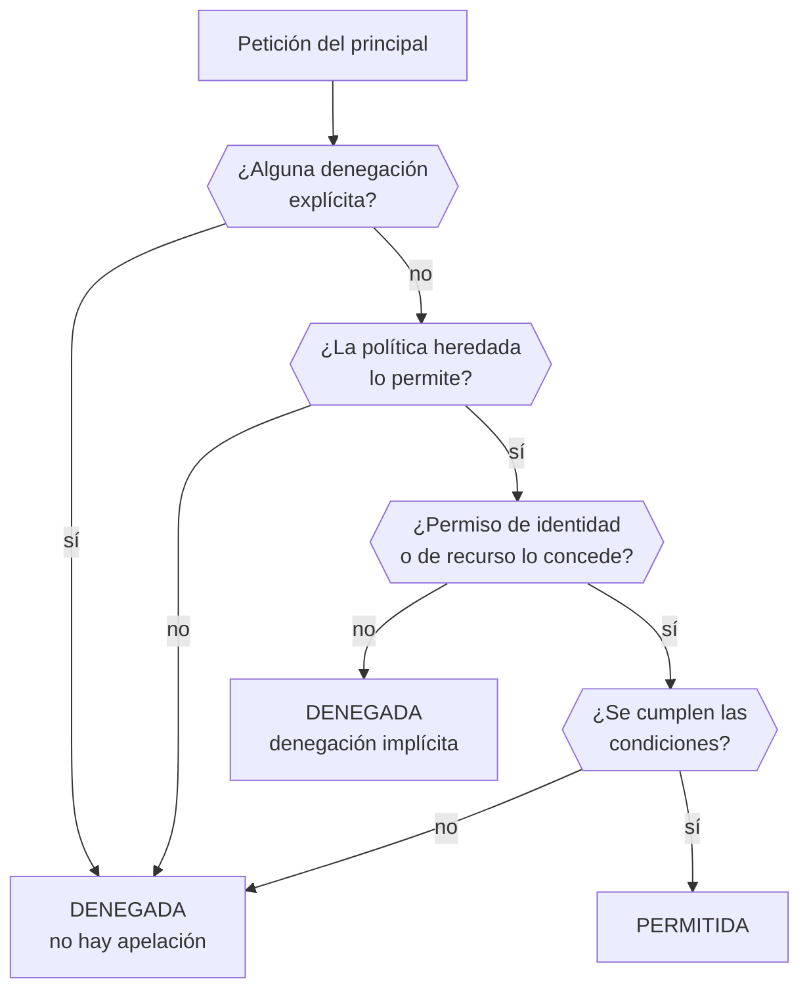

# 018 — Identidad, roles, políticas y federación

> [← 017 · Tenancy, cuentas, suscripciones, proyectos y jerarquías](../../part-01-cloud-principles-strategy-adoption/017-tenancy-cuentas-suscripciones-proyectos-y-jerarquias/README.md) · [Índice de la parte](../README.md) · [019 · Modelo de responsabilidad compartida por servicio →](../../part-01-cloud-principles-strategy-adoption/019-modelo-de-responsabilidad-compartida-por-servicio/README.md)

**Parte:** 01 — Principios, estrategia y adopción cloud<br>
**Nivel:** inicial-intermedio · **Horas estimadas:** 4<br>
**Laboratorio:** `iam` · **Estado:** `EXECUTABLE_CORE`

## 🎯 Propósito

Construir el modelo de identidad que sostiene toda la seguridad cloud: cómo se evalúa una petición, por qué las credenciales de larga vida son el vector de brecha más frecuente y cómo eliminarlas con federación. Es la clase que hace posible que en las partes 08 y 17 un pipeline despliegue en producción sin que exista ningún secreto que robar.

## 📚 Resultados de aprendizaje

Al finalizar podrás:

1. **Reproducir** el orden de evaluación de una petición y predecir el resultado ante políticas en conflicto.
2. **Sustituir** una clave de acceso permanente por una identidad federada con credenciales temporales.
3. **Escribir** una condición de confianza que impida que otro repositorio asuma tu rol.
4. **Distinguir** autenticación, autorización y auditoría, y qué registro responde a cada pregunta forense.
5. **Aplicar** privilegio mínimo de forma iterativa, partiendo de lo que el uso real demuestra necesario.

## 🧩 Conceptos centrales

| Concepto | Comprensión verificable |
|---|---|
| `principal` | Entidad que hace una petición: usuario, rol asumido, servicio o carga de trabajo federada. Lo que importa no es quién es, sino qué permisos tiene en el momento exacto de la llamada. |
| `rol` | Conjunto de permisos que se asume temporalmente, sin credenciales propias permanentes. Al asumirlo se reciben credenciales con caducidad, lo que acota la ventana de uso de una fuga. |
| `política de confianza` | Documento que declara quién puede asumir un rol. Es la puerta: los permisos dicen qué se puede hacer una vez dentro, la confianza dice quién entra. |
| `federación de identidad` | Mecanismo por el que un proveedor externo de identidad emite un token que la nube acepta a cambio de credenciales temporales. Elimina la necesidad de almacenar secretos de larga vida. |
| `privilegio mínimo` | Conceder solo lo que el uso demuestra necesario. No es un estado inicial sino un proceso: se parte de lo observado y se recorta, porque nadie acierta la lista completa por adelantado. |

## 🧠 Modelo mental

La nube es un modelo operativo de acceso bajo demanda, no un lugar mágico ni el centro de datos de otra persona.

Aplicado a esta clase, separa siempre cuatro planos: **intención** (qué necesita el usuario),
**configuración** (qué declaramos), **estado observado** (qué existe de verdad) y
**evidencia** (cómo sabemos que cumple). Confundirlos produce diseños que se ven correctos
en un diagrama pero fallan al operar.

## 🗺️ Flujo de razonamiento



## 📖 Desarrollo

### 1. El orden de evaluación no es negociable

Toda petición pasa por la misma secuencia, y conocerla convierte «no tengo permiso» de misterio en diagnóstico de tres pasos:

1. **Denegación explícita**: si algo la deniega, termina ahí. Ninguna concesión posterior la revierte.
2. **Barreras heredadas**: políticas de organización que acotan el techo. Si no lo permiten, se deniega aunque el permiso de identidad lo conceda.
3. **Concesión**: algún permiso de identidad o de recurso debe permitirlo explícitamente.
4. **Condiciones**: origen, hora, etiquetas, MFA, red. Si no se cumplen, se deniega.

Sin una concesión explícita el resultado es **denegación implícita**, que es la respuesta por defecto. Esa asimetría —todo prohibido salvo lo concedido, y lo denegado no se puede reconceder— es lo que hace el modelo analizable.

La consecuencia práctica al depurar: **empieza por buscar denegaciones**, no concesiones. Añadir permisos a una identidad que choca contra una denegación de organización no cambia nada, y es donde se pierden las tardes.

El caso de la política de recurso merece atención: cuando el recurso está en otra cuenta, hacen falta **las dos** —la de identidad en la cuenta que llama y la de recurso en la que responde—. Una sola no basta, y el mensaje de error no siempre distingue cuál falta.

### 2. Las credenciales de larga vida son el problema, no la solución

Una clave de acceso permanente tiene tres propiedades que la convierten en el vector más explotado:

1. **No caduca**: sigue siendo válida años después de filtrarse.
2. **Es portable**: funciona desde cualquier lugar del mundo.
3. **Es silenciosa**: su uso indebido es indistinguible del legítimo sin análisis de comportamiento.

Los escáneres automáticos de repositorios públicos localizan credenciales expuestas en **minutos**. El patrón es conocido: un desarrollador sube por error un fichero de configuración, lo borra en el commit siguiente, y la credencial sigue en el historial de Git —por lo visto en la clase 003, los objetos no desaparecen— y ya fue recogida.

La alternativa es no tener nada que robar:

```text
clave permanente:  AKIA... + secreto        válida hasta que alguien la revoque
credencial temporal: token de 1 h            inútil después, y ligada a condiciones
```

La jerarquía de preferencia, de mejor a peor:

| Mecanismo | Vida | Dónde vive el secreto |
|---|---|---|
| Identidad de carga (metadata) | minutos | **En ningún sitio** |
| Federación OIDC | ~1 h | En ningún sitio: se intercambia un token firmado |
| Rol asumido con MFA | ~1-12 h | En la sesión |
| Clave permanente en gestor de secretos | indefinida | En el gestor |
| Clave permanente en variable de entorno | indefinida | En todas partes |

Las dos primeras son cualitativamente distintas: **no hay secreto que filtrar**. Las demás solo reducen la probabilidad o la ventana.

### 3. Federación OIDC: desplegar sin secretos

El mecanismo que elimina las claves de los pipelines. El flujo, sin secretos compartidos en ningún punto:

```text
1. El pipeline pide a su plataforma un token OIDC firmado que declara
   quién es: repositorio, rama, entorno, ejecución.
2. Lo presenta al proveedor cloud pidiendo asumir un rol.
3. El proveedor verifica la firma contra las claves públicas de la plataforma
   y comprueba que las declaraciones cumplen la política de confianza.
4. Devuelve credenciales temporales de 1 hora.
```

La política de confianza es donde se juega la seguridad, y donde se comete el error más peligroso:

```json
{
  "Effect": "Allow",
  "Principal": {"Federated": "arn:aws:iam::123456789012:oidc-provider/token.actions.githubusercontent.com"},
  "Action": "sts:AssumeRoleWithWebIdentity",
  "Condition": {
    "StringEquals": {
      "token.actions.githubusercontent.com:aud": "sts.amazonaws.com",
      "token.actions.githubusercontent.com:sub": "repo:miorg/cloudshop:ref:refs/heads/main"
    }
  }
}
```

**La condición sobre `sub` es obligatoria y debe ser precisa.** Los dos errores frecuentes:

```text
"sub": "repo:miorg/*"           → cualquier repositorio de tu organización
sin condición sobre sub         → CUALQUIER repositorio de GitHub del mundo
```

El segundo caso es una brecha total: basta con que alguien cree un repositorio público, ejecute una acción y pida asumir tu rol. La firma será válida porque viene de la misma plataforma; lo único que lo distingue es la declaración `sub`.

Usar `StringLike` con comodines requiere cuidado adicional: `repo:miorg/cloudshop:*` permite cualquier rama y cualquier entorno, incluida una rama que un colaborador externo pueda crear en un fork con permisos de escritura.

### 4. Privilegio mínimo es un proceso, no un estado

Nadie acierta la lista exacta de permisos por adelantado. Intentarlo produce uno de dos resultados: o se concede de más «por si acaso», o se bloquea el trabajo y alguien acaba adjuntando la política de administrador «temporalmente».

El método que funciona parte de lo observado:

```text
1. Conceder amplio en un entorno NO productivo, con registro activado.
2. Ejercitar todos los caminos: éxito, error, reintento, borrado.
3. Extraer del registro los permisos realmente usados.
4. Generar la política a partir de esa lista.
5. Validar en preproducción y recortar lo que sobre.
6. Repetir cada trimestre: los permisos no usados en 90 días se retiran.
```

El paso 2 es el que se olvida y el que causa incidentes: **los caminos de error usan permisos distintos**. Un rol que puede escribir en una cola pero no en su cola de mensajes fallidos funciona perfectamente hasta el primer fallo, y entonces pierde mensajes en silencio.

Los proveedores ofrecen herramientas para el paso 3: analizadores que generan políticas a partir de la actividad registrada, e informes del último acceso por servicio que permiten podar sin adivinar.

Dos límites honestos del método:

- **Un permiso no usado en 90 días puede ser el de la recuperación anual ante desastres.** Antes de retirar hay que comprobar contra los runbooks, no solo contra el registro.
- **Los permisos de solo lectura no son inocuos.** `s3:GetObject` sobre un bucket de facturas es exactamente la brecha de la clase 010. «Solo lectura» describe el verbo, no el impacto.

### 5. Autenticación, autorización y auditoría responden a preguntas distintas

Las tres se confunden y cada una deja rastro en un sitio diferente. Ante un incidente, saber cuál preguntar ahorra horas:

| Pregunta forense | Concepto | Dónde mirar |
|---|---|---|
| ¿Quién era? | Autenticación | Registro del proveedor de identidad |
| ¿Qué podía hacer? | Autorización | Políticas vigentes en ese momento |
| ¿Qué hizo? | Auditoría | Registro de llamadas a la API |

La segunda fila esconde una dificultad real: **las políticas cambian**. Saber qué permisos tenía un principal *en el instante del incidente* exige historial de configuración, no el estado actual. Sin él, la reconstrucción es una conjetura.

Y la tercera tiene un requisito que la clase 017 ya anticipó: **el registro de auditoría debe vivir en otra cuenta**, con escritura permitida y borrado prohibido para todas las demás. Un atacante que compromete una cuenta y puede borrar su propio rastro convierte la auditoría en decorativa.

Tres señales que conviene alertar desde el primer día, porque preceden a casi todo incidente:

- Uso de la identidad raíz de la cuenta.
- Creación de una clave de acceso permanente.
- Cambio en una política de confianza —es cómo se abre la puerta de par en par.

La tercera es la menos vigilada y la más peligrosa: modificar una condición `sub` de una línea puede convertir un rol seguro en uno asumible por cualquiera, y no genera ninguna alerta si nadie la configuró.

## 🔬 Ejemplo trabajado

**El pipeline de CloudShop despliega en producción usando una clave de acceso permanente guardada como secreto del repositorio. Se migra a federación OIDC.**

Estado inicial y su riesgo:

```bash
$ aws iam list-access-keys --user-name ci-deploy
{"AccessKeyMetadata": [{"AccessKeyId": "AKIA...", "CreateDate": "2023-03-14", "Status": "Active"}]}
$ aws iam get-user --user-name ci-deploy --query 'User.PasswordLastUsed'
null
```

```text
antigüedad de la clave       2 años y 5 meses
rotaciones                   0
copias conocidas             secreto del repo, portátil de 2 personas, un runbook
ventana de uso si se filtra  ilimitada
```

**Paso 1 — registrar el proveedor OIDC** (una sola vez por cuenta):

```bash
$ aws iam create-open-id-connect-provider \
    --url https://token.actions.githubusercontent.com \
    --client-id-list sts.amazonaws.com
```

**Paso 2 — política de confianza, con la condición precisa.** Primero se escribe la versión insegura para verla y descartarla:

```json
"Condition": {"StringEquals": {"...:aud": "sts.amazonaws.com"}}
```

Se prueba desde un repositorio de laboratorio ajeno a la organización:

```text
$ (desde otro repo cualquiera) aws sts assume-role-with-web-identity ...
→ ÉXITO. Cualquier repositorio de GitHub podía asumir el rol.
```

Se corrige acotando el sujeto al repositorio, la rama **y** el entorno:

```json
"Condition": {
  "StringEquals": {
    "token.actions.githubusercontent.com:aud": "sts.amazonaws.com",
    "token.actions.githubusercontent.com:sub": "repo:miorg/cloudshop:environment:produccion"
  }
}
```

Se repite la prueba negativa:

```text
desde otro repositorio            → AccessDenied  ✓
desde miorg/cloudshop, rama pre   → AccessDenied  ✓
desde miorg/cloudshop, prod       → credenciales de 1 h  ✓
```

**Paso 3 — recortar los permisos con el uso real.** El rol tenía `PowerUserAccess`. Se extrae lo ejercitado en 30 días de despliegues:

```bash
$ aws accessanalyzer start-policy-generation --policy-generation-details ...
$ aws iam get-service-last-accessed-details --job-id ... \
    --query 'ServicesLastAccessed[?TotalAuthenticatedEntities>`0`].ServiceNamespace'
["s3", "cloudfront", "ecs", "ecr", "logs"]
```

```text
permisos concedidos antes   ~8.000 acciones (PowerUserAccess)
servicios usados en 30 días  5
acciones usadas             34
política final              34 acciones sobre 6 recursos concretos
```

Se ejercitan también los caminos de error antes de aplicar —el paso que se olvida—: un despliegue que falla necesita `ecs:StopTask` y `logs:PutLogEvents` sobre el grupo de errores, que no aparecían en los despliegues correctos.

**Paso 4 — retirar la clave y verificar que nada la usa:**

```bash
$ aws iam update-access-key --user-name ci-deploy --access-key-id AKIA... --status Inactive
# 7 días de observación sin fallos
$ aws iam delete-access-key --user-name ci-deploy --access-key-id AKIA...
$ aws iam delete-user --user-name ci-deploy
```

Resultado:

```text                         antes                  después
credencial               permanente, 2,5 años   token de 1 h
secretos almacenados     4 copias conocidas     0
permisos                 ~8.000 acciones        34 acciones
superficie si se filtra  ilimitada              1 h, solo desde ese repo y entorno
```

**El cambio decisivo no fue reducir permisos: fue que ya no existe nada que filtrar.** Un atacante que consiga el token tiene una hora, y solo desde el contexto exacto que la condición `sub` describe.

## 🧪 Laboratorio guiado

Ejecuta desde la raíz:

```bash
python classes/part-01-cloud-principles-strategy-adoption/018-identidad-roles-politicas-y-federacion/lab.py
```

El laboratorio selecciona el motor de práctica **`iam`** y produce
`lab_result.json`. El escenario, sus comprobaciones y el artefacto esperado corresponden a
esta clase; no requiere credenciales y deja explícito qué debe revalidarse en un sandbox real.

1. Lee `exercise.steps` y formula una predicción antes de ejecutar.
2. Ejecuta la práctica y verifica todos los elementos de `checks`.
3. Provoca el caso de `negative_test` y explica la señal observada.
4. Materializa `matriz-rbac` en `evidence/` usando la plantilla indicada.
5. Para proveedor real, sigue `sandbox.requires`, registra costo y ejecuta `destroy`.

### Evidencia esperada

El artefacto principal es una matriz de acceso mínimo con prueba de denegación. Además, la entrega debe incluir el comando ejecutado,
la salida estructurada y una conclusión que no exceda lo observado.

## 🏆 Reto verificable

Construye **`matriz-rbac`** para el caso CloudShop. Incluye una alternativa descartada,
un supuesto que pueda falsarse, una prueba de fallo y una decisión de rollback.

## ✅ Criterio de aceptación

- [ ] `lab.py` termina con código 0 y genera JSON válido.
- [ ] La entrega conecta al menos tres requisitos con mecanismos verificables.
- [ ] Existe una prueba positiva y una prueba negativa con evidencia.
- [ ] Seguridad, costo y operación aparecen como decisiones, no como anexos.
- [ ] Se declara una limitación y una condición que obligaría a revisar el diseño.
- [ ] Otra persona puede repetir el recorrido sin conocimiento tácito.

## ⚠️ Errores frecuentes

| Síntoma | Causa probable | Corrección |
|---|---|---|
| Cualquier repositorio externo puede asumir el rol de despliegue | La política de confianza no condiciona la declaración `sub` | Condiciona siempre sobre repositorio, rama o entorno; sin ello la firma válida basta para entrar. |
| Se añaden permisos y el acceso sigue denegado | Una denegación explícita o una barrera heredada gana sobre cualquier concesión | Al depurar, busca primero denegaciones y políticas de organización, no concesiones. |
| El pipeline funciona hasta que un despliegue falla, y entonces pierde información | Los caminos de error usan permisos distintos que no se ejercitaron al generar la política | Ejercita éxito, error, reintento y borrado antes de extraer la política del registro. |
| Tras un incidente no se puede saber qué permisos tenía el principal | Solo se conserva el estado actual de las políticas, no su historial | Activa historial de configuración; la autorización de ayer no se deduce de la política de hoy. |
| Un rol de solo lectura provoca una fuga de datos | Se asumió que leer es inocuo; el impacto depende del recurso, no del verbo | Clasifica por sensibilidad del dato: leer facturas no es equivalente a leer métricas. |

## 🛡️ Seguridad, ética y costo

Trabaja con cuentas propias o sandboxes autorizados. No publiques secretos, identificadores
reales ni datos personales. Antes de crear recursos pagos define presupuesto, etiquetas y
comando de destrucción; después verifica que no queden recursos huérfanos. Los ejemplos
locales enseñan contratos, pero no certifican cumplimiento ni disponibilidad de producción.

## ❓ Preguntas de comprobación

1. Una identidad tiene un permiso que concede la acción y una barrera heredada que no la incluye. ¿Cuál gana y por qué?
2. ¿Qué tiene que ocurrir para que un repositorio ajeno pueda asumir tu rol federado, y qué línea lo impide?
3. ¿Por qué generar una política solo con los permisos de los despliegues exitosos deja un fallo latente?
4. ¿Qué registro consultas para responder «qué podía hacer» frente a «qué hizo»?
5. Nombra tres eventos de identidad que conviene alertar desde el primer día y explica por qué el tercero es el menos vigilado.

## 🔗 Referencias

- AWS (2024). *Policy evaluation logic* — orden de evaluación, denegación explícita e implícita. <https://docs.aws.amazon.com/IAM/latest/UserGuide/reference_policies_evaluation-logic.html>
- GitHub (2024). *About security hardening with OpenID Connect* — declaraciones del token y condiciones de confianza. <https://docs.github.com/en/actions/deployment/security-hardening-your-deployments/about-security-hardening-with-openid-connect>
- Sakimura, N. et al. (2014). *OpenID Connect Core 1.0* — semántica de las declaraciones `sub` y `aud`. <https://openid.net/specs/openid-connect-core-1_0.html>
- NIST (2020). *Zero Trust Architecture*, SP 800-207 — verificación por petición y credenciales de vida corta. <https://doi.org/10.6028/NIST.SP.800-207>
- Dotson, C. (2023). *Practical Cloud Security*, 2.ª ed., caps. 4-5 — gestión de identidad y privilegio mínimo iterativo.
- Documentación oficial vigente del servicio implementado; registra URL y fecha de consulta.

---

> [Evaluación](assessment.md) · [Contrato de clase](lesson.yaml) · [Índice de la parte](../README.md)

| Anterior | Índice | Siguiente |
|---|---|---|
| [← 017 · Tenancy, cuentas, suscripciones, proyectos y jerarquías](../../part-01-cloud-principles-strategy-adoption/017-tenancy-cuentas-suscripciones-proyectos-y-jerarquias/README.md) | [Parte 01](../README.md) · [Programa](../../README.md) | [019 · Modelo de responsabilidad compartida por servicio →](../../part-01-cloud-principles-strategy-adoption/019-modelo-de-responsabilidad-compartida-por-servicio/README.md) |
