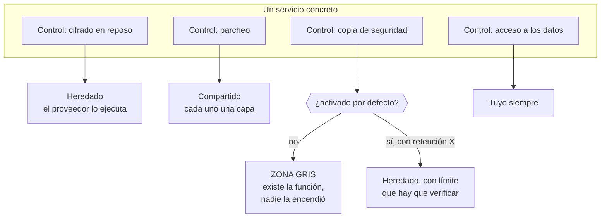

# 019 — Modelo de responsabilidad compartida por servicio

> [← 018 · Identidad, roles, políticas y federación](../../part-01-cloud-principles-strategy-adoption/018-identidad-roles-politicas-y-federacion/README.md) · [Índice de la parte](../README.md) · [020 · TCO, costos variables, unit economics y FinOps →](../../part-01-cloud-principles-strategy-adoption/020-tco-costos-variables-unit-economics-y-finops/README.md)

**Parte:** 01 — Principios, estrategia y adopción cloud<br>
**Nivel:** inicial-intermedio · **Horas estimadas:** 4<br>
**Laboratorio:** `security` · **Estado:** `EXECUTABLE_CORE`

## 🎯 Propósito

Convertir el modelo de responsabilidad compartida de un diagrama de márketing en una matriz operativa por servicio, con controles nombrados y un responsable por cada uno. La clase 010 estableció el principio; aquí se aplica servicio a servicio, que es donde aparecen las zonas grises que nadie reclama hasta que hay un incidente.

## 📚 Resultados de aprendizaje

Al finalizar podrás:

1. **Construir** una matriz RACI de controles para un servicio concreto, distinguiendo quién ejecuta y quién responde.
2. **Localizar** las zonas grises —controles que ambas partes creen del otro— antes de que las encuentre un auditor.
3. **Comparar** el reparto real entre una base de datos autogestionada y una gestionada, con el detalle de qué se hereda.
4. **Interpretar** un informe de cumplimiento del proveedor sabiendo qué controles deja explícitamente al cliente.
5. **Verificar** un control heredado en vez de asumirlo, distinguiendo evidencia de declaración.

## 🧩 Conceptos centrales

| Concepto | Comprensión verificable |
|---|---|
| `control heredado` | Control que el proveedor ejecuta y del que obtienes el beneficio sin implementarlo. Se hereda el control, no la responsabilidad de comprobar que aplica a tu configuración. |
| `control compartido` | Control en el que ambas partes hacen algo distinto sobre la misma capa. El parcheo en IaaS es el ejemplo canónico: el proveedor parchea el hipervisor y tú el sistema operativo huésped. |
| `zona gris` | Control que ninguna de las dos partes ejecuta porque cada una supone que lo hace la otra. Es donde se concentran los hallazgos de auditoría y los incidentes evitables. |
| `RACI` | Reparto de un control en cuatro papeles: quién lo ejecuta, quién responde por él, a quién se consulta y a quién se informa. La distinción entre ejecutar y responder es la que evita las zonas grises. |
| `informe de cumplimiento` | Auditoría independiente sobre los controles del proveedor. Su sección de controles complementarios del usuario enumera lo que deja explícitamente a tu cargo, y es la parte que casi nadie lee. |

## 🧠 Modelo mental

La nube es un modelo operativo de acceso bajo demanda, no un lugar mágico ni el centro de datos de otra persona.

Aplicado a esta clase, separa siempre cuatro planos: **intención** (qué necesita el usuario),
**configuración** (qué declaramos), **estado observado** (qué existe de verdad) y
**evidencia** (cómo sabemos que cumple). Confundirlos produce diseños que se ven correctos
en un diagrama pero fallan al operar.

## 🗺️ Flujo de razonamiento



## 📖 Desarrollo

### 1. Tres clases de control, no dos

La presentación habitual reparte los controles en dos columnas y esa simplificación es la que crea las zonas grises. En la práctica hay tres clases:

| Clase | Quién ejecuta | Tu obligación |
|---|---|---|
| **Heredado** | Solo el proveedor | Verificar que aplica a tu configuración y obtener la evidencia |
| **Compartido** | Ambos, en capas distintas | Ejecutar tu capa y saber dónde está la frontera |
| **Propio** | Solo tú | Todo |

La columna derecha de la primera fila es la que se ignora. Heredar la seguridad física del centro de datos no exime de comprobar que la región que usas está incluida en el informe de cumplimiento; heredar el cifrado de disco no exime de comprobar que está activado en **tu** recurso.

El ejemplo canónico de control **compartido** es el parcheo en IaaS:

```text
hipervisor y firmware  → proveedor, sin aviso ni ventana que tú controles
sistema operativo      → tú
bibliotecas del sistema→ tú
runtime del lenguaje   → tú
dependencias de la app → tú
```

Una vulnerabilidad en el hipervisor la resuelve el proveedor y puede implicar un reinicio de tu instancia con preaviso corto. Una en `glibc` es tuya, aunque el sistema operativo venga de una imagen del proveedor. **La frontera es el hipervisor, no la imagen.**

### 2. Autogestionado frente a gestionado: qué cambia de verdad

Comparar una base de datos instalada por ti con una gestionada, control a control, revela que el reparto no se mueve en bloque:

| Control | En una VM | Servicio gestionado |
|---|---|---|
| Parche del motor | Tú | Proveedor, en ventana que **tú eliges** |
| Cifrado en reposo | Tú lo configuras | Heredado, pero **tú lo activas** |
| Copia de seguridad | Tú | Proveedor ejecuta, **tú fijas retención** |
| Prueba de restauración | Tú | **Tú** — nunca la hace el proveedor |
| Réplica entre zonas | Tú | Proveedor, **si lo activas** |
| Esquema y consultas | Tú | Tú |
| Permisos de acceso | Tú | Tú |
| Clasificación del dato | Tú | Tú |

Dos filas concentran casi todos los incidentes:

**La prueba de restauración nunca es del proveedor.** Que exista una copia no demuestra que se pueda restaurar, ni cuánto tarda. Una copia sin restauración probada es una suposición, y el momento de descubrirlo no puede ser el incidente. Es el control que más se hereda por error.

**Casi todo lo gestionado depende de que lo actives.** Cifrado, réplica, retención extendida, registro de auditoría: el proveedor los ofrece, no los impone. La diferencia entre «el servicio soporta X» y «mi instancia tiene X activado» es exactamente el espacio donde vive la zona gris.

Y hay un control que **empeora** al pasar a gestionado: el acceso del operador del proveedor a los datos. Es un riesgo aceptable y contractualmente acotado, pero existe y hay que nombrarlo en el análisis, no descubrirlo en una auditoría.

### 3. RACI: separar quién ejecuta de quién responde

La distinción entre **ejecutar** y **responder** es la que cierra las zonas grises. Un control puede ejecutarlo el proveedor y seguir siendo tu responsabilidad ante el regulador y ante tus clientes.

Para la copia de seguridad de una base de datos gestionada:

| Actividad | Ejecuta | Responde | Evidencia |
|---|---|---|---|
| Tomar la copia | Proveedor | **Cliente** | Registro de instantáneas |
| Fijar la retención | Cliente | Cliente | Configuración versionada |
| Cifrar la copia | Proveedor | Cliente | Atributo del recurso |
| Probar la restauración | **Cliente** | Cliente | Informe con RTO medido |
| Verificar la integridad | Cliente | Cliente | Suma de comprobación tras restaurar |

La columna «Responde» es **siempre el cliente**. Eso no es una carga retórica: significa que ante un fallo de copia no puedes trasladar la consecuencia al proveedor más allá del crédito del SLA, como se calculó en la clase 010.

La columna «Evidencia» es la que convierte la matriz en algo auditable. Un control sin evidencia es una intención: «el proveedor hace copias» no es evidencia; el identificador de la última instantánea y la fecha de la última restauración probada sí lo son.

Hacer esta tabla para los cinco o seis servicios principales de una plataforma lleva unas horas y localiza las zonas grises **antes** de que las encuentre un auditor o un incidente.

### 4. Leer un informe de cumplimiento por su última sección

Los informes de auditoría del proveedor —SOC 2 Tipo II, ISO 27001, y equivalentes— se usan mal: se archivan como prueba de que «el proveedor es seguro». Lo que contienen es más útil y más incómodo.

Qué mirar, en orden:

1. **Alcance**: qué servicios y qué regiones cubre. Un servicio nuevo o una región recién abierta pueden estar fuera, y entonces no hay nada heredado.
2. **Periodo**: los informes Tipo II cubren un intervalo pasado, típicamente 6 o 12 meses. Un informe cerrado hace ocho meses no dice nada de lo ocurrido después.
3. **Excepciones**: controles con desviaciones detectadas durante la auditoría, y qué se hizo.
4. **Controles complementarios del usuario**: **la sección decisiva**. Enumera lo que el proveedor deja explícitamente a tu cargo para que sus controles funcionen.

La cuarta sección suele contener afirmaciones muy concretas: que configures el cifrado, que gestiones el ciclo de vida de las credenciales, que revises los permisos, que actives el registro. Son exactamente los controles que después aparecen como hallazgos.

**Un informe del proveedor no te certifica.** Si tu organización necesita cumplir una norma, necesitas tu propia auditoría; el informe del proveedor cubre su parte del reparto y **por eso incluye la lista de lo que espera de ti**.

### 5. Verificar lo heredado en vez de asumirlo

Heredar un control no exime de comprobar que aplica. La diferencia entre declaración y evidencia:

```bash
# Declaración: la documentación dice que el servicio soporta cifrado
# Evidencia: mi recurso concreto lo tiene activado
$ aws rds describe-db-instances --db-instance-identifier cloudshop-prod \
    --query 'DBInstances[0].[StorageEncrypted,KmsKeyId,BackupRetentionPeriod,MultiAZ]'
[true, "arn:aws:kms:...:key/1a2b3c", 7, true]
```

Cuatro comprobaciones en una línea, y cada una podría haber sido `false` sin que nada fallara visiblemente. La retención de 7 días es un dato, no una validación: hay que contrastarla con el requisito. Si el requisito legal es 30 días, el control heredado **no cumple** aunque esté activado.

El patrón general, aplicable a cualquier control heredado:

```text
1. ¿Qué afirma el proveedor?          documentación e informe de cumplimiento
2. ¿Aplica a mi recurso?              consulta al plano de control
3. ¿Cumple mi requisito concreto?     comparación con el número exigido
4. ¿Cómo lo demuestro dentro de un año? evidencia versionada y automatizada
```

El paso 4 es el que separa una comprobación puntual de un control: si la verificación no está automatizada, dentro de seis meses nadie sabrá si sigue siendo cierta. Convertir estas comprobaciones en pruebas que fallan el despliegue —lo que en la parte 11 será política como código— es lo que hace que un control heredado sea auditable de forma continua y no una foto de un día.

## 🔬 Ejemplo trabajado

**Una auditoría de CloudShop devuelve un hallazgo: «no se evidencia la capacidad de restauración de la base de datos de pedidos».** El equipo responde que el proveedor hace copias automáticas. Se construye la matriz para verlo.

Estado declarado frente a estado verificado:

```bash
$ aws rds describe-db-instances --db-instance-identifier cloudshop-prod \
    --query 'DBInstances[0].[BackupRetentionPeriod,PreferredBackupWindow,StorageEncrypted]'
[7, "07:00-07:30", true]
$ aws rds describe-db-snapshots --db-instance-identifier cloudshop-prod \
    --snapshot-type automated --query 'length(DBSnapshots)'
7
```

Las copias existen. El hallazgo no era ese:

```text                                 ejecuta      responde   evidencia disponible
tomar la copia                       proveedor    cliente    ✓ 7 instantáneas
cifrar la copia                      proveedor    cliente    ✓ StorageEncrypted
fijar retención                      cliente      cliente    ✓ 7 días
PROBAR LA RESTAURACIÓN               cliente      cliente    ✗ nunca se hizo
verificar integridad tras restaurar  cliente      cliente    ✗
```

**Dos zonas grises.** El equipo heredó «copia de seguridad» completo cuando solo se heredaban dos de sus cinco actividades.

Se ejecuta la restauración por primera vez, en una cuenta de no producción:

```bash
$ aws rds restore-db-instance-from-db-snapshot \
    --db-instance-identifier cloudshop-restore-test \
    --db-snapshot-identifier rds:cloudshop-prod-2026-08-01-07-05
$ time aws rds wait db-instance-available --db-instance-identifier cloudshop-restore-test
real    38m12s
```

```text
RTO comprometido en el plan de continuidad     60 min
RTO medido en la restauración                  38 min  ✓ cumple
RPO implícito (copia diaria a las 07:00)    hasta 24 h
RPO comprometido                               15 min  ✗ INCUMPLE
```

**El segundo hallazgo aparece al medir, no al auditar.** La retención de 7 días cumple el requisito de conservación, pero una copia diaria da un RPO de hasta 24 horas frente a los 15 minutos comprometidos. Nadie lo había notado porque la copia existía y se asumió que eso resolvía el requisito.

Se verifica la integridad, no solo la disponibilidad:

```sql
-- en el original
SELECT count(*), sum(total) FROM pedidos WHERE creado < '2026-08-01 07:00';
 1284471 | 48219338.55
-- en la restaurada
 1284471 | 48219338.55        ✓ coincide
```

Correcciones, separando qué es de cada quién:

```text
RPO      activar recuperación a un instante (heredado, hay que ACTIVARLO)
         → RPO efectivo: 5 min                              ✓
prueba   restauración trimestral automatizada en no producción
         con comparación de recuento y sumas                ✓ cliente
evidencia informe versionado con RTO y RPO medidos          ✓ cliente
control  regla que falla el despliegue si un recurso productivo
         no tiene recuperación a un instante activada       ✓ cliente
```

La última línea es la que convierte el arreglo en un control: sin ella, el próximo recurso que alguien cree volverá a nacer sin la función activada.

**La lección: se heredaba el mecanismo y se creía heredar el resultado.** El proveedor toma copias; que esas copias satisfagan tu RPO y sean restaurables es una afirmación tuya que exige evidencia tuya.

## 🧪 Laboratorio guiado

Ejecuta desde la raíz:

```bash
python classes/part-01-cloud-principles-strategy-adoption/019-modelo-de-responsabilidad-compartida-por-servicio/lab.py
```

El laboratorio selecciona el motor de práctica **`security`** y produce
`lab_result.json`. El escenario, sus comprobaciones y el artefacto esperado corresponden a
esta clase; no requiere credenciales y deja explícito qué debe revalidarse en un sandbox real.

1. Lee `exercise.steps` y formula una predicción antes de ejecutar.
2. Ejecuta la práctica y verifica todos los elementos de `checks`.
3. Provoca el caso de `negative_test` y explica la señal observada.
4. Materializa `raci-de-controles` en `evidence/` usando la plantilla indicada.
5. Para proveedor real, sigue `sandbox.requires`, registra costo y ejecuta `destroy`.

### Evidencia esperada

El artefacto principal es un control con amenaza, mitigación y evidencia. Además, la entrega debe incluir el comando ejecutado,
la salida estructurada y una conclusión que no exceda lo observado.

## 🏆 Reto verificable

Construye **`raci-de-controles`** para el caso CloudShop. Incluye una alternativa descartada,
un supuesto que pueda falsarse, una prueba de fallo y una decisión de rollback.

## ✅ Criterio de aceptación

- [ ] `lab.py` termina con código 0 y genera JSON válido.
- [ ] La entrega conecta al menos tres requisitos con mecanismos verificables.
- [ ] Existe una prueba positiva y una prueba negativa con evidencia.
- [ ] Seguridad, costo y operación aparecen como decisiones, no como anexos.
- [ ] Se declara una limitación y una condición que obligaría a revisar el diseño.
- [ ] Otra persona puede repetir el recorrido sin conocimiento tácito.

## ⚠️ Errores frecuentes

| Síntoma | Causa probable | Corrección |
|---|---|---|
| Una auditoría rechaza la copia de seguridad pese a existir instantáneas | Nunca se probó la restauración: el proveedor toma la copia, el cliente demuestra que sirve | Automatiza una restauración periódica con verificación de integridad y RTO medido. |
| El RPO real es de 24 h aunque el plan comprometa 15 min | Se asumió que existir copia equivale a cumplir el RPO | Activa recuperación a un instante y mide el RPO efectivo, no la frecuencia de la copia. |
| Un recurso nuevo nace sin cifrado ni réplica | Las funciones gestionadas se ofrecen, no se imponen, y no había control que lo exigiera | Convierte la comprobación en política como código que falle el despliegue. |
| Se presenta el informe de cumplimiento del proveedor como prueba propia | El informe cubre la parte del proveedor y enumera lo que deja al cliente | Lee la sección de controles complementarios del usuario: es tu lista de tareas. |
| Se hereda un control de una región o servicio que el informe no cubre | No se revisó el alcance ni el periodo del informe | Comprueba servicios, regiones y ventana temporal antes de dar por heredado un control. |

## 🛡️ Seguridad, ética y costo

Trabaja con cuentas propias o sandboxes autorizados. No publiques secretos, identificadores
reales ni datos personales. Antes de crear recursos pagos define presupuesto, etiquetas y
comando de destrucción; después verifica que no queden recursos huérfanos. Los ejemplos
locales enseñan contratos, pero no certifican cumplimiento ni disponibilidad de producción.

## ❓ Preguntas de comprobación

1. ¿Qué diferencia hay entre control heredado, compartido y propio, y qué obligación te queda en el primero?
2. En una base de datos gestionada, ¿qué actividad de la copia de seguridad nunca ejecuta el proveedor?
3. ¿Por qué la columna «Responde» de la matriz RACI es siempre el cliente, y qué consecuencia práctica tiene?
4. ¿Cuál es la sección más útil de un informe de cumplimiento del proveedor y por qué?
5. Un servicio soporta cifrado en reposo. ¿Qué te falta comprobar antes de darlo por heredado?

## 🔗 Referencias

- AWS (2024). *Shared Responsibility Model* — controles heredados, compartidos y propios del cliente. <https://aws.amazon.com/compliance/shared-responsibility-model/>
- Microsoft (2024). *Shared responsibility in the cloud* — reparto por modelo de servicio con tabla de controles. <https://learn.microsoft.com/en-us/azure/security/fundamentals/shared-responsibility>
- Cloud Security Alliance (2024). *Cloud Controls Matrix* — catálogo de controles con reparto proveedor/cliente. <https://cloudsecurityalliance.org/research/cloud-controls-matrix>
- AICPA (2017). *SOC 2 Trust Services Criteria* — estructura del informe y controles complementarios del usuario. <https://www.aicpa-cima.com/resources/landing/system-and-organization-controls-soc-suite-of-services>
- Dotson, C. (2023). *Practical Cloud Security*, 2.ª ed., cap. 1 — construir la matriz de responsabilidad servicio a servicio.
- Documentación oficial vigente del servicio implementado; registra URL y fecha de consulta.

---

> [Evaluación](assessment.md) · [Contrato de clase](lesson.yaml) · [Índice de la parte](../README.md)

**📥 Descargar:** [Parte 01 en PDF](../../../site/downloads/partes/manual-parte-01-cloud-principles-strategy-adoption.pdf) · [Manual integral](../../../site/downloads/multi-cloud-engineering-manual-v2.0.pdf)

| Anterior | Índice | Siguiente |
|---|---|---|
| [← 018 · Identidad, roles, políticas y federación](../../part-01-cloud-principles-strategy-adoption/018-identidad-roles-politicas-y-federacion/README.md) | [Parte 01](../README.md) · [Programa](../../README.md) | [020 · TCO, costos variables, unit economics y FinOps →](../../part-01-cloud-principles-strategy-adoption/020-tco-costos-variables-unit-economics-y-finops/README.md) |
