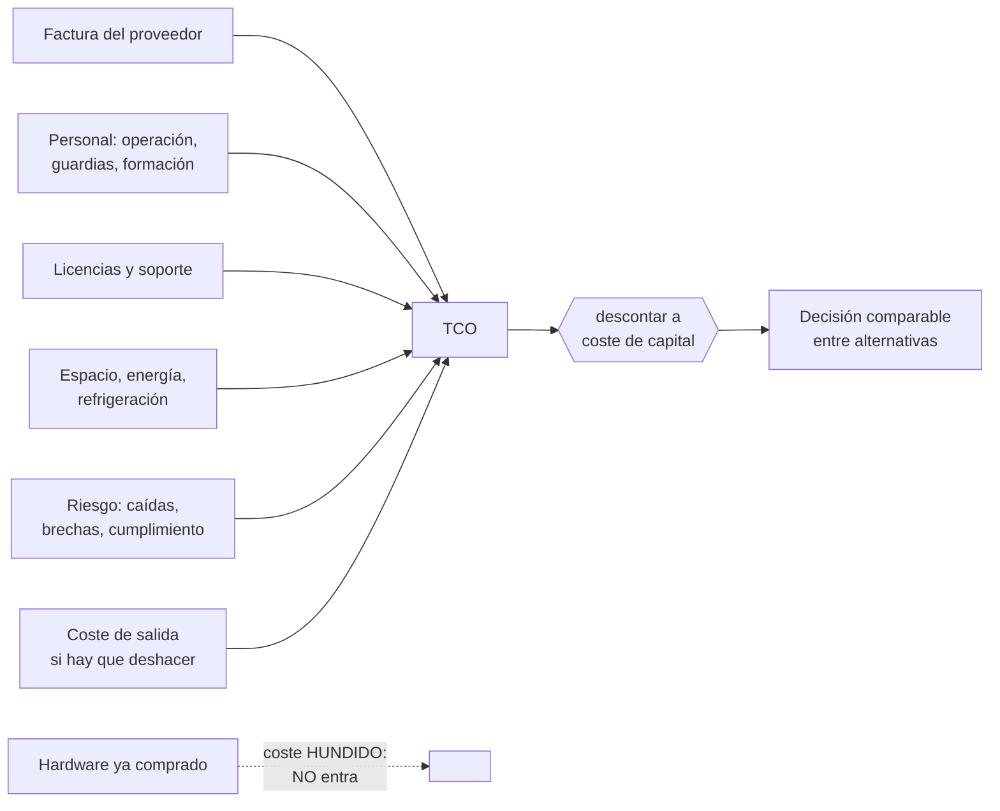

# 020 — TCO, costos variables, unit economics y FinOps

> [← Clase anterior](../../part-01-cloud-principles-strategy-adoption/019-modelo-de-responsabilidad-compartida-por-servicio/README.md) · [Índice de la parte](../README.md) · [Clase siguiente →](../../part-01-cloud-principles-strategy-adoption/021-well-architected-y-atributos-de-calidad/README.md)

**Parte:** 01 — Principios, estrategia y adopción cloud<br>
**Nivel:** inicial-intermedio · **Horas estimadas:** 4<br>
**Laboratorio:** `finops` · **Estado:** `EXECUTABLE_CORE`

## 🎯 Propósito

Construir un caso de coste total defendible ante alguien que sabe de finanzas, no solo de infraestructura. La clase 011 dio la unidad de coste; aquí se añade lo que un TCO honesto incluye y casi ningún cálculo de migración recoge: personal, licencias, amortización pendiente, coste de salida y el valor temporal del dinero.

## 📚 Resultados de aprendizaje

Al finalizar podrás:

1. **Enumerar** las partidas de un TCO que no aparecen en la factura y estimarlas con órdenes de magnitud.
2. **Calcular** el valor actual neto de una migración y explicar por qué comparar totales sin descontar engaña.
3. **Distinguir** coste hundido de coste evitable y por qué el hardware ya comprado no debe entrar en la decisión.
4. **Construir** un modelo de coste unitario que muestre si la escala mejora la economía o solo la traslada.
5. **Presentar** el caso con supuestos explícitos y análisis de sensibilidad sobre los dos que más pesan.

## 🧩 Conceptos centrales

| Concepto | Comprensión verificable |
|---|---|
| `TCO` | Coste total de propiedad: todo lo que cuesta operar una capacidad durante su vida útil, no solo lo que se factura. Incluye personal, licencias, espacio, energía, riesgo y coste de oportunidad. |
| `coste hundido` | Gasto ya realizado e irrecuperable. Es irrelevante para decidir el futuro: incluirlo en la comparación es la falacia del coste hundido, y produce decisiones de mantener sistemas solo porque ya se pagaron. |
| `valor actual neto` | Suma de flujos futuros descontados a una tasa que refleja el coste del capital. Permite comparar alternativas cuyos gastos ocurren en momentos distintos, que es siempre el caso en una migración. |
| `unit economics` | Coste e ingreso por unidad de negocio. Es lo que revela si crecer mejora o empeora el margen, algo que el total absoluto oculta por completo. |
| `coste de salida` | Lo que costaría deshacer la decisión: egreso de datos, reescritura, formación y tiempo. Rara vez se calcula y es lo que convierte una decisión reversible en una irreversible. |

## 🧠 Modelo mental

La nube es un modelo operativo de acceso bajo demanda, no un lugar mágico ni el centro de datos de otra persona.

Aplicado a esta clase, separa siempre cuatro planos: **intención** (qué necesita el usuario),
**configuración** (qué declaramos), **estado observado** (qué existe de verdad) y
**evidencia** (cómo sabemos que cumple). Confundirlos produce diseños que se ven correctos
en un diagrama pero fallan al operar.

## 🗺️ Flujo de razonamiento



## 📖 Desarrollo

### 1. Lo que la factura no incluye suele ser la mitad

Un TCO que solo suma la factura del proveedor subestima sistemáticamente ambos lados de la comparación. Las partidas ausentes, con órdenes de magnitud orientativos:

| Partida | En centro de datos propio | En nube |
|---|---|---|
| Infraestructura | CAPEX amortizado a 3-5 años | Factura mensual |
| **Personal de operación** | 1 persona por ~100-200 servidores | Menor, pero no cero |
| **Guardias** | Rotación completa 24×7 | Rotación completa 24×7 |
| Licencias de virtualización | Significativas | Incluidas o distintas |
| Espacio, energía, refrigeración | Directo | Dentro del precio |
| Renovación de hardware | Ciclo de 4-5 años | No aplica |
| **Sobreaprovisionamiento** | Se compra para el pico | Se paga el consumo |
| **Formación** | Menor, tecnología estable | **Alta y recurrente** |
| Coste de salida | Bajo | Medio-alto |

Dos filas merecen atención porque suelen decidir el resultado:

**Personal.** Es habitual que sea la mayor partida del centro de datos propio y la más ignorada. Una persona dedicada cuesta, con cargas, del orden de 40.000-90.000 USD anuales según el mercado; tres personas superan a mucha infraestructura. La nube reduce esa partida pero **no la elimina**: cambia parcheo de sistemas operativos por gestión de identidades, políticas y costes.

**Formación.** Es la que se olvida en la dirección contraria. Un equipo que domina VMware necesita meses para operar con soltura en un hiperescalar, y el coste no es solo el curso: es la productividad reducida durante la transición y los errores del periodo de aprendizaje.

### 2. El hardware ya comprado no entra en la decisión

La objeción más frecuente contra una migración es «acabamos de invertir 400.000 USD en servidores». Es la **falacia del coste hundido**: ese dinero ya se gastó y no se recupera decidas lo que decidas.

Lo que sí entra es lo **evitable**:

```text
NO entra (hundido):
  compra del hardware ya pagada           400.000 USD

SÍ entra (evitable si migras):
  soporte y mantenimiento restantes        38.000 USD/año
  energía y espacio                        22.000 USD/año
  renovación prevista en 2028             180.000 USD
  valor de reventa hoy                      60.000 USD (ingreso)
```

La pregunta correcta no es «¿amortizamos lo comprado?» sino **«a partir de hoy, ¿qué alternativa cuesta menos?»**. Si operar lo existente cuesta 60.000 USD anuales evitables y la nube cuesta 45.000, migrar ahorra 15.000 al año **por mucho que se hayan pagado 400.000 el año pasado**.

Hay dos matices legítimos que no son la falacia:

1. **El valor de reventa sí entra**, como ingreso, y desaparece con el tiempo: un servidor de tres años vale bastante menos que uno de uno.
2. **Un contrato con penalización por cancelación anticipada** es coste evitable de la opción de migrar, no coste hundido. Hay que incluirlo.

La distinción es la que permite tener una conversación financiera en vez de una emocional.

### 3. Descontar: 100.000 hoy no son 100.000 dentro de tres años

Una migración concentra gastos al principio y ahorros después. Comparar los totales sin descontar favorece artificialmente a la alternativa que gasta tarde.

```text
VAN = Σ  flujo_t / (1 + r)^t
```

Con una tasa de descuento del 10 % —el coste del capital de la organización— y un horizonte de 5 años:

```text
año   flujo neto      factor      valor actual
 0    −250.000        1,000       −250.000     migración e implantación
 1     +85.000        0,909        +77.273
 2     +92.000        0,826        +76.033
 3     +99.000        0,751        +74.380
 4    +106.000        0,683        +72.395
 5    +113.000        0,621        +70.156
                                  ----------
                             VAN = +120.237 USD
```

Sin descontar, la suma sería +245.000. Con descuento, +120.237: **el descuento se come la mitad del beneficio aparente**, porque los ahorros llegan tarde y el gasto es inmediato.

Dos métricas complementarias que la dirección suele pedir:

```text
periodo de recuperación simple: 250.000 / 85.000 ≈ 2,9 años
tasa interna de retorno (TIR):  ≈ 24 %
```

Si la TIR supera el coste de capital, el proyecto crea valor. Con 24 % frente a 10 %, lo crea con holgura — **siempre que los ahorros proyectados se materialicen**, que es donde entra el análisis de sensibilidad.

### 4. Unit economics: la escala puede empeorar el margen

El total absoluto oculta si el negocio mejora al crecer. La descomposición mínima:

```text
margen unitario = ingreso por unidad − coste por unidad
```

Con los datos de una plataforma real:

```text                     mes 1        mes 6        mes 12
pedidos                  620.000      980.000    1.740.000
coste de infraestructura  12.400       17.360       26.100
coste unitario            0,0200       0,0177       0,0150
ingreso por pedido        0,4200       0,4100       0,3900
margen unitario           0,4000       0,3923       0,3750
```

El coste unitario **baja** un 25 %: hay economía de escala. Pero el margen unitario también baja, porque el ingreso por pedido cae más rápido que el coste. **La infraestructura mejora y el negocio empeora**, y solo se ve con las dos series juntas.

El patrón contrario también existe y es más peligroso: un coste unitario que sube con el volumen indica que algo escala peor que linealmente —normalmente el término de coherencia de la clase 016, o transferencia entre zonas que crece con el cuadrado de los nodos—.

Tres preguntas que el modelo debe responder:

1. ¿El coste unitario baja, sube o se mantiene al crecer?
2. ¿Qué partida domina, y cambia esa dominancia con la escala?
3. ¿A qué volumen el coste unitario deja de bajar? Es el punto donde la arquitectura actual agota su economía.

### 5. Supuestos explícitos y sensibilidad sobre los dos que más pesan

Un TCO sin supuestos declarados no es defendible: cualquiera puede rehacerlo con otros números y llegar a la conclusión contraria. La disciplina mínima es listar los supuestos y probar cuánto aguanta la conclusión.

```text
supuestos del modelo
  crecimiento de volumen         +18 % anual
  reducción de personal           1,5 personas
  utilización media               58 %
  tasa de descuento               10 %
  horizonte                       5 años
  inflación de precios cloud       0 % (los proveedores tienden a bajar)
```

El análisis de sensibilidad se hace sobre **los dos supuestos con más peso**, no sobre todos:

```text                          VAN a 5 años
caso base                        +120.237
crecimiento +9 % en vez de +18 %  +71.400
sin reducción de personal          −18.900   ← cambia el signo
utilización 40 % en vez de 58 %   +148.000   (más ahorro por elasticidad)
descuento 15 %                     +82.100
```

**El caso depende críticamente de un supuesto: la reducción de 1,5 personas.** Si no ocurre, el proyecto destruye valor. Eso convierte una decisión técnica en una decisión organizativa, y es exactamente lo que la dirección necesita saber antes de aprobar.

Declararlo tiene una ventaja adicional: convierte el supuesto en un **compromiso verificable**. Si a los doce meses el personal no se ha reducido, no hay que esperar cinco años para saber que el caso no se cumple.

## 🔬 Ejemplo trabajado

**CloudShop evalúa migrar su plataforma del centro de datos actual. El equipo de infraestructura presenta un ahorro del 60 % comparando la factura estimada con el gasto en hardware.** Se rehace el cálculo completo.

**Cálculo original presentado:**

```text
amortización de hardware      95.000 USD/año
factura cloud estimada        38.000 USD/año
"ahorro"                      57.000 USD/año (60 %)
```

**Errores detectados:** incluye coste hundido, omite personal en ambos lados, ignora licencias, no descuenta y no contempla el coste de salida.

**TCO reconstruido, solo con costes evitables desde hoy:**

```text                                    actual      cloud
soporte y mantenimiento de hardware       38.000          0
energía, espacio, refrigeración           22.000          0
licencias de virtualización               31.000          0
personal de operación (3,0 → 1,5 FTE)    186.000     93.000
factura del proveedor                          0     38.000
sobreaprovisionamiento (util. 30 %)   ya incluido    evitado
formación primer año                           0     24.000
                                        --------   --------
coste anual evitable                     277.000    155.000
ahorro anual                                       122.000
```

Más del doble del ahorro que se presentaba —y **por razones distintas**: no viene del hardware sino del personal y las licencias.

**Costes de una sola vez:**

```text
migración e implantación (6 meses, 2 personas)   140.000
doble ejecución durante la transición             46.000
reescritura de dos componentes acoplados          64.000
valor de reventa del hardware                    −60.000
                                                 -------
inversión neta inicial                           190.000
```

**Valor actual neto a 5 años, descontando al 10 %:**

```text
año 0   −190.000   × 1,000 = −190.000
año 1   +122.000   × 0,909 = +110.909
año 2   +122.000   × 0,826 = +100.826
año 3   +122.000   × 0,751 =  +91.660
año 4   +122.000   × 0,683 =  +83.327
año 5   +122.000   × 0,621 =  +75.752
                              --------
                        VAN = +272.474 USD     TIR ≈ 56 %
                        recuperación ≈ 1,6 años
```

**Sensibilidad sobre los dos supuestos dominantes:**

```text                                          VAN
caso base                                   +272.474
personal NO baja de 3,0 a 1,5 FTE            −80.100   ← el caso se cae
migración cuesta el doble (280.000)         +182.474
factura cloud un 40 % mayor (53.200)        +214.800
ambos adversos: sin reducción y +40 % factura −137.700
```

**El proyecto depende de una sola variable: la reducción de personal.** No de la factura, no del coste de migración. Esa es la conclusión que debe llevarse la dirección, y no aparecía en ninguna parte del cálculo original.

Se declara además el **coste de salida**, que nadie había estimado:

```text
egreso de 42 TB a 0,09 USD/GB                   3.780 USD
reescritura de adaptadores propietarios        ~35.000 USD
reformación del equipo                         ~20.000 USD
coste de deshacer la decisión                  ~59.000 USD
```

**Recomendación registrada:** migrar, condicionado a un plan explícito de recolocación de 1,5 personas, con revisión a los 12 meses. Si a esa fecha el personal no se ha reducido, el caso se reevalúa con el coste de salida ya calculado sobre la mesa.

La diferencia entre el primer cálculo y este no es la cifra: es que el segundo **dice de qué depende**.

## 🧪 Laboratorio guiado

Ejecuta desde la raíz:

```bash
python classes/part-01-cloud-principles-strategy-adoption/020-tco-costos-variables-unit-economics-y-finops/lab.py
```

El laboratorio selecciona el motor de práctica **`finops`** y produce
`lab_result.json`. El escenario, sus comprobaciones y el artefacto esperado corresponden a
esta clase; no requiere credenciales y deja explícito qué debe revalidarse en un sandbox real.

1. Lee `exercise.steps` y formula una predicción antes de ejecutar.
2. Ejecuta la práctica y verifica todos los elementos de `checks`.
3. Provoca el caso de `negative_test` y explica la señal observada.
4. Materializa `caso-tco` en `evidence/` usando la plantilla indicada.
5. Para proveedor real, sigue `sandbox.requires`, registra costo y ejecuta `destroy`.

### Evidencia esperada

El artefacto principal es un cálculo trazable con unidad, supuesto y sensibilidad. Además, la entrega debe incluir el comando ejecutado,
la salida estructurada y una conclusión que no exceda lo observado.

## 🏆 Reto verificable

Construye **`caso-tco`** para el caso CloudShop. Incluye una alternativa descartada,
un supuesto que pueda falsarse, una prueba de fallo y una decisión de rollback.

## ✅ Criterio de aceptación

- [ ] `lab.py` termina con código 0 y genera JSON válido.
- [ ] La entrega conecta al menos tres requisitos con mecanismos verificables.
- [ ] Existe una prueba positiva y una prueba negativa con evidencia.
- [ ] Seguridad, costo y operación aparecen como decisiones, no como anexos.
- [ ] Se declara una limitación y una condición que obligaría a revisar el diseño.
- [ ] Otra persona puede repetir el recorrido sin conocimiento tácito.

## ⚠️ Errores frecuentes

| Síntoma | Causa probable | Corrección |
|---|---|---|
| Se rechaza una migración porque «acabamos de comprar el hardware» | Falacia del coste hundido: el gasto ya realizado no se recupera con ninguna decisión | Compara solo costes evitables desde hoy; incluye la reventa como ingreso, no la compra como coste. |
| El ahorro proyectado nunca aparece en las cuentas | El caso dependía de una reducción de personal que no se ejecutó | Declara los supuestos organizativos como compromisos verificables con fecha de revisión. |
| Dos alternativas parecen equivalentes y una es claramente peor | Se compararon totales sin descontar, favoreciendo a la que gasta más tarde | Calcula el VAN con la tasa de coste de capital de la organización. |
| El volumen crece, la factura crece y nadie sabe si eso es bueno | No hay unit economics: falta el coste por unidad junto al ingreso por unidad | Sigue las dos series juntas; el coste unitario puede bajar mientras el margen empeora. |
| Deshacer una decisión resulta imposible por su coste | El coste de salida nunca se estimó, así que la decisión era irreversible sin saberlo | Calcula egreso, reescritura y reformación al decidir, no cuando quieras salir. |

## 🛡️ Seguridad, ética y costo

Trabaja con cuentas propias o sandboxes autorizados. No publiques secretos, identificadores
reales ni datos personales. Antes de crear recursos pagos define presupuesto, etiquetas y
comando de destrucción; después verifica que no queden recursos huérfanos. Los ejemplos
locales enseñan contratos, pero no certifican cumplimiento ni disponibilidad de producción.

## ❓ Preguntas de comprobación

1. Se compraron servidores por 400.000 USD el año pasado. ¿Qué parte de esa cifra entra en la decisión de migrar y cuál no?
2. ¿Por qué comparar el total sin descontar favorece a la alternativa que concentra el gasto al final?
3. El coste unitario baja un 25 % y el margen unitario también baja. ¿Qué está ocurriendo y por qué el total lo oculta?
4. ¿Sobre qué supuestos conviene hacer el análisis de sensibilidad y cómo se eligen?
5. Nombra tres partidas de un TCO que no aparecen en ninguna factura y afectan a ambos lados de la comparación.

## 🔗 Referencias

- Storment, J. R. y Fuller, M. (2023). *Cloud FinOps*, 2.ª ed., caps. 4-6 — modelo de coste unitario y previsión.
- FinOps Foundation (2024). *Unit Economics* — definición y construcción de métricas por unidad de negocio. <https://www.finops.org/framework/capabilities/unit-economics/>
- Brealey, R., Myers, S. y Allen, F. (2020). *Principles of Corporate Finance*, 13.ª ed., caps. 2-6 — VAN, TIR y costes hundidos.
- Hohpe, G. (2020). *Cloud Strategy*, cap. sobre economía — por qué el ahorro de la nube rara vez viene de donde se anuncia.
- Barroso, L., Hölzle, U. y Ranganathan, P. (2018). *The Datacenter as a Computer*, 3.ª ed., cap. 6 — TCO de un centro de datos. <https://doi.org/10.2200/S00874ED3V01Y201809CAC046>
- Documentación oficial vigente del servicio implementado; registra URL y fecha de consulta.

---

> [Evaluación](assessment.md) · [Contrato de clase](lesson.yaml) · [Índice de la parte](../README.md)
