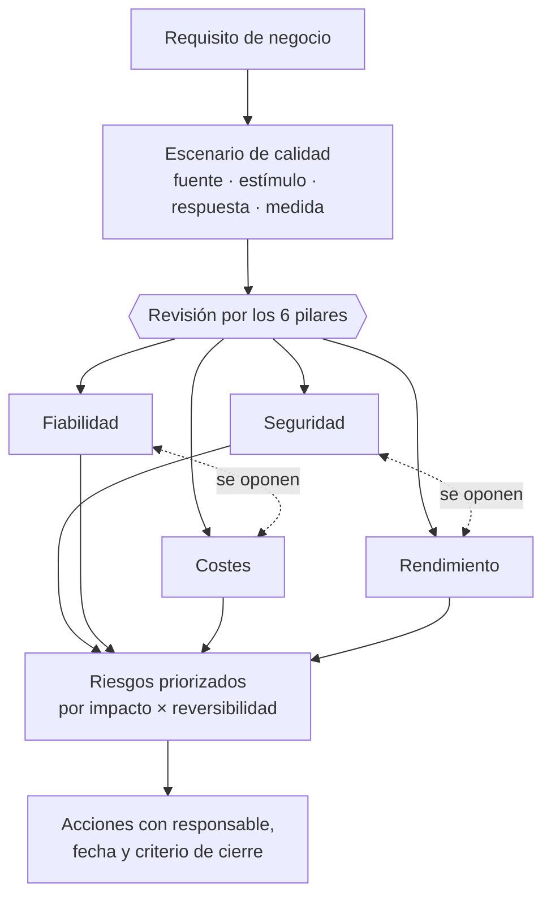

# 021 — Well-Architected y atributos de calidad

> [← 020 · TCO, costos variables, unit economics y FinOps](../../part-01-cloud-principles-strategy-adoption/020-tco-costos-variables-unit-economics-y-finops/README.md) · [Índice de la parte](../README.md) · [022 · Cloud Adoption Framework y modelo operativo →](../../part-01-cloud-principles-strategy-adoption/022-cloud-adoption-framework-y-modelo-operativo/README.md)

**Parte:** 01 — Principios, estrategia y adopción cloud<br>
**Nivel:** inicial-intermedio · **Horas estimadas:** 4<br>
**Laboratorio:** `architecture` · **Estado:** `EXECUTABLE_CORE`

## 🎯 Propósito

Usar los marcos Well-Architected como una lista de preguntas que fuerza a hacer explícitos los compromisos, no como una certificación que se aprueba. Su valor real está en los pilares que se contradicen entre sí: mejorar seguridad suele costar rendimiento, y mejorar coste suele costar fiabilidad. Esta clase enseña a nombrar ese intercambio en vez de fingir que no existe.

## 📚 Resultados de aprendizaje

Al finalizar podrás:

1. **Traducir** un requisito de negocio a atributos de calidad medibles con escenario, estímulo y respuesta.
2. **Identificar** qué pares de pilares se oponen en una decisión concreta y cuantificar el intercambio.
3. **Conducir** una revisión que produzca riesgos priorizados y no una lista de buenas prácticas genéricas.
4. **Distinguir** un riesgo alto de uno medio por su impacto y su reversibilidad, no por su gravedad aparente.
5. **Convertir** los hallazgos en acciones con responsable, fecha y criterio de cierre verificable.

## 🧩 Conceptos centrales

| Concepto | Comprensión verificable |
|---|---|
| `atributo de calidad` | Propiedad no funcional medible: latencia, disponibilidad, coste unitario, tiempo de recuperación. Se especifica con un escenario completo, porque «rápido» y «seguro» no son requisitos verificables. |
| `pilar` | Dimensión de análisis del marco: excelencia operativa, seguridad, fiabilidad, eficiencia de rendimiento, optimización de costes y sostenibilidad. Su utilidad es forzar a mirar las seis, incluidas las incómodas. |
| `escenario de calidad` | Formulación de seis partes —fuente, estímulo, artefacto, entorno, respuesta y medida— que convierte una aspiración en algo comprobable. |
| `compromiso` | Reconocimiento explícito de que mejorar un atributo empeora otro. Un diseño sin compromisos declarados no es equilibrado: es un diseño cuyos costes aún no se han descubierto. |
| `riesgo alto` | Hallazgo cuyo impacto es grave **y** cuya corrección posterior es cara o destructiva. La reversibilidad, no solo la gravedad, es lo que separa el riesgo alto del medio. |

## 🧠 Modelo mental

La nube es un modelo operativo de acceso bajo demanda, no un lugar mágico ni el centro de datos de otra persona.

Aplicado a esta clase, separa siempre cuatro planos: **intención** (qué necesita el usuario),
**configuración** (qué declaramos), **estado observado** (qué existe de verdad) y
**evidencia** (cómo sabemos que cumple). Confundirlos produce diseños que se ven correctos
en un diagrama pero fallan al operar.

## 🗺️ Flujo de razonamiento



## 📖 Desarrollo

### 1. Un atributo sin escenario no es un requisito

«El sistema debe ser rápido y seguro» no se puede verificar, así que no se puede diseñar contra ello. La formulación de seis partes de Bass, Clements y Kazman lo convierte en algo comprobable:

| Parte | Ejemplo |
|---|---|
| Fuente | Un usuario autenticado desde Chile |
| Estímulo | Solicita la página de un producto |
| Artefacto | El servicio de catálogo |
| Entorno | Operación normal, hora punta |
| Respuesta | Devuelve la página completa |
| **Medida** | **p95 < 300 ms, medido en el cliente** |

La última fila es la que hace la diferencia. Y tiene dos detalles que se omiten sistemáticamente:

1. **El percentil**, porque como se vio en la clase 012 la media no la experimenta nadie.
2. **El punto de medición**. «300 ms en el servidor» y «300 ms en el cliente» difieren en todo el tramo de red, que en la clase 001 resultó ser el componente dominante. Un SLO medido en el sitio equivocado se cumple mientras los usuarios se quejan.

El mismo rigor aplica a los demás pilares:

```text
disponibilidad  99,95 % mensual medido sobre peticiones con éxito, excluyendo
                mantenimiento anunciado con 72 h de antelación
coste           ≤ 0,018 USD por pedido a volumen de 1 M/mes
recuperación    RTO 60 min y RPO 15 min, verificados trimestralmente
seguridad       ninguna credencial de larga vida en el camino de despliegue
```

Cada uno tiene número, unidad y método de verificación. Sin los tres, un pilar es una intención.

### 2. Los pilares se contradicen, y ahí está el trabajo

El error más común al usar el marco es tratarlo como una lista donde todo se puede maximizar. Los pares que se oponen, con el mecanismo concreto:

| Par | Por qué chocan | Ejemplo medible |
|---|---|---|
| Seguridad ↔ Rendimiento | Cifrado, inspección y verificación añaden latencia | mTLS entre servicios: +3-8 ms por salto |
| Fiabilidad ↔ Coste | La redundancia se paga aunque no se use | 3 zonas: +50 % de cómputo sobre 2 |
| Rendimiento ↔ Coste | La capacidad libre absorbe varianza | ρ 0,70 en vez de 0,95: +36 % de instancias |
| Operación ↔ Rapidez | Las puertas de calidad frenan la entrega | Revisión obligatoria: +4 h de plazo medio |
| Sostenibilidad ↔ Rendimiento | La región limpia puede estar lejos | +40 ms de latencia por 8× menos CO₂e |

Una revisión útil **cuantifica** estos intercambios en vez de declararlos. «Hay un trade-off entre seguridad y rendimiento» no ayuda a decidir; «mTLS cuesta 6 ms sobre un presupuesto de 300 y elimina la posibilidad de suplantación este-oeste» sí.

Y hay un pilar que se opone a casi todos: **la simplicidad**, que no figura en el marco pero debería. Cada mecanismo añadido —una caché, una cola, una región extra— mejora un atributo y empeora la capacidad del equipo de operar y diagnosticar el sistema. Ese coste no aparece en ninguna métrica hasta el primer incidente a las 3 de la madrugada.

### 3. Priorizar por impacto y reversibilidad

Los marcos clasifican hallazgos en alto, medio y bajo, y la clasificación suele hacerse solo por gravedad. Falta la segunda dimensión: **cuánto cuesta arreglarlo después**.

```text
riesgo = impacto × probabilidad × (coste de corregir tarde / coste de corregir ahora)
```

El tercer factor es el que reordena la lista:

| Hallazgo | Impacto | Corregir ahora | Corregir en 2 años | Prioridad |
|---|---|---|---|---|
| Sin cifrado en tránsito | Alto | 2 días | 1 semana | Media |
| Esquema de datos sin particionar | Medio | 1 semana | **6 meses + migración** | **Alta** |
| Sin alertas de coste | Medio | 1 día | 1 día | Baja |
| Identificadores secuenciales expuestos | Alto | 3 días | **Reescritura de clientes** | **Alta** |

La segunda fila es el patrón clave: un hallazgo de impacto medio con corrección casi irreversible **pesa más** que uno de impacto alto y arreglo trivial. Las decisiones de datos y de contratos públicos son las que más envejecen: cambiar un esquema con 2 TB en producción o un formato de identificador que ya consumen terceros no es lo mismo que activar una opción.

La regla operativa: **decide pronto lo irreversible y tarde lo reversible**. Un hallazgo reversible puede esperar a tener más información; uno irreversible hay que resolverlo mientras el coste sigue siendo bajo.

### 4. Una revisión que produce decisiones, no una lista

Una revisión Well-Architected mal conducida genera 60 recomendaciones genéricas que nadie ejecuta. Bien conducida produce entre 5 y 10 riesgos con dueño.

El guion que funciona:

```text
1. Escenarios primero (30 min)
   ¿Cuáles son los 5 atributos de calidad con número y método de medición?
   Sin esto, la revisión no tiene contra qué contrastar.

2. Recorrido por pilares (2-3 h)
   Para cada pregunta: ¿lo hacemos? ¿cómo lo demostramos? ¿qué evidencia hay?
   "Sí" sin evidencia se registra como "no verificado", que es distinto de "no".

3. Compromisos explícitos (45 min)
   ¿Qué decisión mejora un pilar a costa de otro? ¿Está declarada y aceptada?

4. Priorización (30 min)
   Impacto × reversibilidad. Máximo 10 riesgos; si salen 40, la revisión
   está describiendo el estado, no priorizando.

5. Acciones (30 min)
   Cada riesgo alto: responsable, fecha, criterio de cierre verificable.
```

El paso 2 tiene una regla que cambia el resultado: **distinguir «no» de «no verificado»**. Un equipo suele responder «sí, tenemos copias de seguridad»; la pregunta siguiente —«¿cuándo se restauró por última vez?»— convierte muchos síes en no verificados, que es exactamente el hallazgo de la clase 019.

Y el paso 5 exige un criterio de cierre **comprobable**: «mejorar la seguridad de IAM» no se puede cerrar; «ninguna clave de acceso permanente activa, verificado por una consulta automática semanal» sí.

### 5. Los marcos coinciden más de lo que su vocabulario sugiere

Los tres grandes proveedores tienen su versión y las tres comparten estructura. Traducirlas evita aprender tres veces lo mismo y permite hacer revisiones multi-proveedor:

| Pilar | AWS | Azure | Google Cloud |
|---|---|---|---|
| Operación | Operational Excellence | Operational Excellence | Operational excellence |
| Seguridad | Security | Security | Security, privacy, compliance |
| Fiabilidad | Reliability | Reliability | Reliability |
| Rendimiento | Performance Efficiency | Performance Efficiency | Performance optimization |
| Coste | Cost Optimization | Cost Optimization | Cost optimization |
| Sostenibilidad | Sustainability | — | Sustainability |

Las diferencias reales son de énfasis, no de fondo: AWS incorporó sostenibilidad como pilar en 2021; Azure la trata dentro de otros; Google agrupa privacidad y cumplimiento con seguridad.

El límite honesto de los tres: **están escritos por quien vende la plataforma**. Ninguno pregunta si deberías estar en esa nube, si el bloqueo es aceptable o si la alternativa más barata es no migrar. Son excelentes para revisar *cómo* está construido algo y no sirven para decidir *si* construirlo.

Para esa segunda pregunta hacen falta los criterios de las clases 013, 015 y 020: definición, modelo de servicio y coste total. Un marco Well-Architected aplicado a una decisión que no debió tomarse produce un sistema impecablemente construido sobre una premisa equivocada.

## 🔬 Ejemplo trabajado

**Revisión Well-Architected de la plataforma de pedidos de CloudShop antes de duplicar el volumen.** Se sigue el guion y se cuantifican los compromisos.

**Paso 1 — escenarios de calidad, con medida y punto de medición:**

```text
Q1 latencia      p95 < 300 ms medido en el cliente, hora punta
Q2 disponibilidad 99,95 % mensual sobre peticiones con éxito
Q3 coste          ≤ 0,018 USD/pedido a 1 M pedidos/mes
Q4 recuperación   RTO 60 min · RPO 15 min, verificado cada trimestre
Q5 seguridad      cero credenciales de larga vida en el despliegue
```

**Paso 2 — recorrido, separando «no» de «no verificado»:**

```text                                    respuesta   evidencia
copias de seguridad automáticas          sí          ✓ 7 instantáneas
restauración probada                     "sí"        ✗ NO VERIFICADO
despliegue sin secretos                  sí          ✓ OIDC (clase 018)
límites de tasa por cliente              no          —
particionado del esquema de pedidos      no          —
alertas sobre consumo de cuota           no          —
```

**Paso 3 — compromisos, cuantificados:**

```text
mTLS entre servicios
  seguridad: elimina suplantación este-oeste
  rendimiento: +6 ms medidos sobre 3 saltos → 18 ms del presupuesto de 300 (6 %)
  DECISIÓN: se adopta. 6 % del presupuesto por eliminar una clase entera de ataque.

tercera zona de disponibilidad
  fiabilidad: de 99,995 % a 99,999 % → de 1,3 a 0,3 min/mes
  coste: +50 % de cómputo = +58 USD/mes
  DECISIÓN: NO. El requisito es 21,6 min/mes; ya se cumple con holgura.

utilización objetivo 0,70 en vez de 0,90
  rendimiento: p95 de 91 ms en vez de ~300 ms (clase 011)
  coste: +36 % de instancias
  DECISIÓN: se adopta. Sin ella Q1 no se cumple.
```

**Paso 4 — priorización por impacto × reversibilidad:**

```text                                    impacto  ahora   en 2 años   prioridad
esquema de pedidos sin particionar        medio   1 sem   6 meses+migr   ALTA
restauración nunca probada                alto    2 días  2 días        ALTA
sin límites de tasa por cliente           alto    3 días  3 días        MEDIA
sin alerta de cuota                       medio   1 día   1 día         BAJA
```

El esquema sin particionar sube a **alta pese a impacto medio**: hoy la tabla tiene 180 GB y particionar cuesta una semana; con el volumen duplicado durante dos años serán 1,3 TB y la migración exigirá ventana de indisponibilidad. **Es el único hallazgo cuya ventana de corrección barata se está cerrando.**

La restauración no probada es alta por impacto puro: su coste de corrección no crece, pero el riesgo se materializa en cualquier momento.

**Paso 5 — acciones con criterio de cierre:**

```text
R1  particionar pedidos por mes         Ana   15-09   pg_partman activo y
                                                      consulta p95 < 40 ms
R2  restauración automatizada           Luis  22-08   informe trimestral con
                                                      RTO medido y recuento verificado
R3  límite de tasa por cliente          Ana   30-09   429 con Retry-After bajo
                                                      prueba de carga
R4  alerta de cuota al 80 %             Luis  08-08   alarma disparada en simulacro
```

**Resultado: 4 acciones con dueño y criterio comprobable**, frente a las 34 recomendaciones genéricas que devolvió la herramienta automática. La diferencia la produjo el paso 1: sin los cinco escenarios con número, no había contra qué contrastar y todo parecía igual de importante.

## 🧪 Laboratorio guiado

Ejecuta desde la raíz:

```bash
python classes/part-01-cloud-principles-strategy-adoption/021-well-architected-y-atributos-de-calidad/lab.py
```

El laboratorio selecciona el motor de práctica **`architecture`** y produce
`lab_result.json`. El escenario, sus comprobaciones y el artefacto esperado corresponden a
esta clase; no requiere credenciales y deja explícito qué debe revalidarse en un sandbox real.

1. Lee `exercise.steps` y formula una predicción antes de ejecutar.
2. Ejecuta la práctica y verifica todos los elementos de `checks`.
3. Provoca el caso de `negative_test` y explica la señal observada.
4. Materializa `revision-well-architected` en `evidence/` usando la plantilla indicada.
5. Para proveedor real, sigue `sandbox.requires`, registra costo y ejecuta `destroy`.

### Evidencia esperada

El artefacto principal es un diagrama acompañado por decisiones y trade-offs. Además, la entrega debe incluir el comando ejecutado,
la salida estructurada y una conclusión que no exceda lo observado.

## 🏆 Reto verificable

Construye **`revision-well-architected`** para el caso CloudShop. Incluye una alternativa descartada,
un supuesto que pueda falsarse, una prueba de fallo y una decisión de rollback.

## ✅ Criterio de aceptación

- [ ] `lab.py` termina con código 0 y genera JSON válido.
- [ ] La entrega conecta al menos tres requisitos con mecanismos verificables.
- [ ] Existe una prueba positiva y una prueba negativa con evidencia.
- [ ] Seguridad, costo y operación aparecen como decisiones, no como anexos.
- [ ] Se declara una limitación y una condición que obligaría a revisar el diseño.
- [ ] Otra persona puede repetir el recorrido sin conocimiento tácito.

## ⚠️ Errores frecuentes

| Síntoma | Causa probable | Corrección |
|---|---|---|
| La revisión produce 40 recomendaciones y no se ejecuta ninguna | Se describió el estado en vez de priorizar; faltaban escenarios contra los que contrastar | Empieza por 5 atributos con número y método de medición; limita la salida a 10 riesgos. |
| Un SLO de latencia se cumple mientras los usuarios se quejan | Se mide en el servidor y el tramo dominante es la red | Declara el punto de medición en el escenario; medir en el cliente cambia el número por completo. |
| Un hallazgo de impacto medio se pospone y dos años después cuesta una migración | Se priorizó solo por gravedad, ignorando la reversibilidad | Prioriza por impacto × coste de corregir tarde; decide pronto lo irreversible. |
| El equipo declara tener un control que en realidad nunca se ejerció | No se distinguió «sí» de «sí, pero no verificado» | Pide la evidencia en la misma pregunta; un sí sin evidencia se registra como no verificado. |
| Se construye impecablemente un sistema que no debió existir | El marco revisa cómo está hecho algo, no si debía hacerse | Decide primero con definición, modelo de servicio y TCO; el marco viene después. |

## 🛡️ Seguridad, ética y costo

Trabaja con cuentas propias o sandboxes autorizados. No publiques secretos, identificadores
reales ni datos personales. Antes de crear recursos pagos define presupuesto, etiquetas y
comando de destrucción; después verifica que no queden recursos huérfanos. Los ejemplos
locales enseñan contratos, pero no certifican cumplimiento ni disponibilidad de producción.

## ❓ Preguntas de comprobación

1. Convierte «el sistema debe ser rápido» en un escenario de calidad completo, incluyendo el punto de medición.
2. Nombra dos pares de pilares que se opongan y cuantifica el intercambio con un número concreto.
3. ¿Por qué un hallazgo de impacto medio puede tener más prioridad que uno de impacto alto?
4. ¿Qué diferencia hay entre responder «no» y «no verificado» en una revisión, y cómo se distingue?
5. ¿Qué pregunta importante no responde ningún marco Well-Architected, y con qué criterios se responde?

## 🔗 Referencias

- AWS (2024). *Well-Architected Framework* — seis pilares, preguntas y proceso de revisión. <https://docs.aws.amazon.com/wellarchitected/latest/framework/welcome.html>
- Microsoft (2024). *Azure Well-Architected Framework* — pilares y compromisos entre ellos. <https://learn.microsoft.com/en-us/azure/well-architected/>
- Google Cloud (2024). *Architecture Framework* — pilares y guía de diseño. <https://cloud.google.com/architecture/framework>
- Bass, L., Clements, P. y Kazman, R. (2021). *Software Architecture in Practice*, 4.ª ed., caps. 3-4 — escenarios de atributos de calidad en seis partes.
- Richards, M. y Ford, N. (2020). *Fundamentals of Software Architecture*, cap. 2 — «todo en arquitectura es un compromiso».
- Documentación oficial vigente del servicio implementado; registra URL y fecha de consulta.

---

> [Evaluación](assessment.md) · [Contrato de clase](lesson.yaml) · [Índice de la parte](../README.md)

**📥 Descargar:** [Parte 01 en PDF](../../../site/downloads/partes/manual-parte-01-cloud-principles-strategy-adoption.pdf) · [Manual integral](../../../site/downloads/multi-cloud-engineering-manual-v2.0.pdf)

| Anterior | Índice | Siguiente |
|---|---|---|
| [← 020 · TCO, costos variables, unit economics y FinOps](../../part-01-cloud-principles-strategy-adoption/020-tco-costos-variables-unit-economics-y-finops/README.md) | [Parte 01](../README.md) · [Programa](../../README.md) | [022 · Cloud Adoption Framework y modelo operativo →](../../part-01-cloud-principles-strategy-adoption/022-cloud-adoption-framework-y-modelo-operativo/README.md) |
