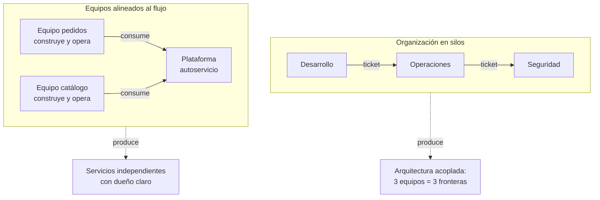

# 022 — Cloud Adoption Framework y modelo operativo

> [← Clase anterior](../../part-01-cloud-principles-strategy-adoption/021-well-architected-y-atributos-de-calidad/README.md) · [Índice de la parte](../README.md) · [Clase siguiente →](../../part-01-cloud-principles-strategy-adoption/023-descubrimiento-y-clasificacion-de-workloads/README.md)

**Parte:** 01 — Principios, estrategia y adopción cloud<br>
**Nivel:** inicial-intermedio · **Horas estimadas:** 4<br>
**Laboratorio:** `governance` · **Estado:** `EXECUTABLE_CORE`

## 🎯 Propósito

Entender por qué las migraciones fracasan por causas organizativas y no técnicas, y qué modelo operativo hay que construir para que la plataforma no se convierta en un cuello de botella. La ley de Conway no es una curiosidad: es la razón por la que una arquitectura de microservicios impuesta a una organización de silos produce un monolito distribuido.

## 📚 Resultados de aprendizaje

Al finalizar podrás:

1. **Aplicar** la ley de Conway en sentido inverso: diseñar equipos para obtener la arquitectura que se quiere.
2. **Elegir** entre los modelos operativos centralizado, descentralizado y de plataforma según tamaño y madurez.
3. **Distinguir** un equipo de plataforma que ofrece un producto de uno que se convierte en un servicio de tickets.
4. **Secuenciar** una adopción por olas con criterios de salida verificables en vez de por fechas.
5. **Reconocer** las señales tempranas de que el modelo operativo elegido está fallando.

## 🧩 Conceptos centrales

| Concepto | Comprensión verificable |
|---|---|
| `ley de Conway` | Las organizaciones producen diseños que replican sus estructuras de comunicación. No es una tendencia evitable con disciplina: es una restricción que conviene usar deliberadamente. |
| `carga cognitiva` | Cantidad de conocimiento que un equipo debe sostener para operar lo suyo. Cuando supera su capacidad, la calidad cae sin que nadie sea negligente; es el límite real al tamaño del dominio de un equipo. |
| `camino dorado` | Trayecto recomendado y bien soportado para hacer algo común. No es obligatorio: compite por ser tan bueno que salirse resulte caro, y esa voluntariedad es lo que lo mantiene honesto. |
| `equipo de plataforma` | Equipo cuyo producto son las capacidades internas que otros consumen en autoservicio. Su métrica no es cuántos tickets cierra, sino cuántos deja de recibir. |
| `ola de adopción` | Grupo de cargas que se migran juntas con un criterio de salida definido. Avanzar por olas con criterio permite aprender; avanzar por fechas produce deuda que se descubre en la última ola. |
| `equipo habilitador` | Equipo que trabaja temporalmente con otros para elevar su capacidad y después se retira. Se distingue del de plataforma en que no deja un servicio permanente, sino conocimiento. |

## 🧠 Modelo mental

La nube es un modelo operativo de acceso bajo demanda, no un lugar mágico ni el centro de datos de otra persona.

Aplicado a esta clase, separa siempre cuatro planos: **intención** (qué necesita el usuario),
**configuración** (qué declaramos), **estado observado** (qué existe de verdad) y
**evidencia** (cómo sabemos que cumple). Confundirlos produce diseños que se ven correctos
en un diagrama pero fallan al operar.

## 🗺️ Flujo de razonamiento



## 📖 Desarrollo

### 1. La ley de Conway, usada al revés

Conway observó en 1968 que **las organizaciones producen diseños que copian sus estructuras de comunicación**. La formulación es descriptiva, pero su uso práctico es prescriptivo: si quieres una arquitectura concreta, organiza los equipos con esa forma.

El caso negativo se repite en todas las migraciones grandes:

```text
organización:  desarrollo → operaciones → seguridad   (tres silos, tickets entre ellos)
se pide:       microservicios independientes
se obtiene:    servicios que no se pueden desplegar sin coordinar tres equipos
               = un monolito distribuido, con lo peor de ambos modelos
```

El resultado no es un fallo de ejecución: es exactamente lo que la estructura de comunicación permite construir. Ningún equipo puede desplegar sin los otros dos, así que la frontera real del sistema son los tres equipos, no los servicios.

La **maniobra de Conway inversa** consiste en cambiar primero la organización:

```text
antes:  3 equipos por función  →  fronteras por capa técnica
después: N equipos por dominio →  fronteras por dominio de negocio
```

Un equipo que construye y opera pedidos —incluyendo su base de datos, su despliegue y su guardia— puede producir un servicio independiente porque **no necesita hablar con nadie para cambiarlo**. Esa autonomía es la condición de la arquitectura, no su consecuencia.

Y el límite es honesto: reorganizar equipos es caro y lento. Por eso conviene hacerlo **antes** de comprometerse con una arquitectura, no después de descubrir que no encaja.

### 2. Tres modelos operativos y cuándo falla cada uno

| Modelo | Cómo funciona | Escala hasta | Falla cuando |
|---|---|---|---|
| **Centralizado** | Un equipo aprovisiona todo por petición | ~5 equipos consumidores | Se convierte en cola: el tiempo de espera domina la entrega |
| **Descentralizado** | Cada equipo hace lo suyo sin capa común | ~10 equipos | Divergencia: 10 formas de desplegar, 10 posturas de seguridad |
| **Plataforma** | Capacidades en autoservicio con guardarraíles | Decenas | El equipo de plataforma se convierte en soporte de tickets |

Los síntomas de que un modelo agotó su rango son medibles:

```text
centralizado agotado:  tiempo de espera para un entorno nuevo > 3 días
                       cola de peticiones creciente semana a semana

descentralizado agotado: n.º de formas distintas de desplegar ≈ n.º de equipos
                         un hallazgo de seguridad exige N correcciones distintas

plataforma degradada:   > 40 % del tiempo del equipo en peticiones puntuales
                        el autoservicio existe y nadie lo usa
```

La tercera fila es la más frecuente y la más silenciosa: un equipo de plataforma que dedica la mayoría de su tiempo a resolver casos particulares **ha vuelto al modelo centralizado** con otro nombre. La causa suele ser que el camino dorado no cubre los casos reales, así que todos se salen de él y piden ayuda.

No hay un modelo correcto: hay un modelo adecuado al tamaño. Imponer plataforma a una organización de tres equipos crea más trabajo del que ahorra.

### 3. Carga cognitiva: el límite que no se negocia

Skelton y Pais sitúan la carga cognitiva como la restricción central del diseño de equipos. Un equipo tiene una capacidad finita de conocimiento sostenido, y cuando el dominio la supera **la calidad cae sin que nadie sea negligente**.

Los tres tipos, y qué hacer con cada uno:

| Tipo | Qué es | Acción |
|---|---|---|
| Intrínseca | Complejidad del dominio: reglas de negocio | Formación; no se puede eliminar |
| Extrínseca | Cómo desplegar, configurar redes, obtener permisos | **Eliminar con plataforma** |
| Pertinente | Diseñar bien lo propio | **Proteger: es donde está el valor** |

El objetivo de una plataforma es reducir la extrínseca para liberar capacidad para la pertinente. Medirlo es posible:

```text
antes de la plataforma
  crear un entorno nuevo        14 pasos, 3 equipos, 4 días
  conocimiento necesario        redes, IAM, DNS, certificados, CI

después
  crear un entorno nuevo        1 comando, 12 minutos
  conocimiento necesario        el nombre del entorno
```

Si un equipo de producto necesita entender redes virtuales, políticas de identidad y emisión de certificados para publicar un servicio, esa carga extrínseca está consumiendo la capacidad que debería ir al dominio. **No es que sean malos ingenieros: es que el sistema les pide sostener demasiado.**

Y el criterio para dimensionar un dominio: si el equipo no puede explicar todo lo que opera en una pizarra durante 15 minutos, el dominio es demasiado grande.

### 4. Camino dorado: voluntario y bueno, o no funciona

Un camino dorado es el trayecto recomendado para hacer algo común. Su propiedad definitoria es que **es voluntario**, y esa voluntariedad es lo que lo mantiene honesto: si nadie lo usa, es que no es bueno, y esa señal es valiosa.

Qué lo hace funcionar:

```text
1. Resuelve el 80 % de los casos, no el 100 %.
   Perseguir el 100 % produce una plataforma que tarda años y no llega.

2. Trae seguridad y cumplimiento incorporados.
   Usarlo debe ser más fácil QUE saltárselo, y además deja el sistema conforme.

3. Permite salirse, con coste explícito.
   Quien se sale asume la operación completa: su propia guardia, su propio parcheo.

4. Se mide por adopción, no por mandato.
   Si hay que obligar, el camino no es lo bastante bueno.
```

El punto 3 es el que evita el fracaso más común. Prohibir salirse convierte la plataforma en un obstáculo y genera infraestructura en la sombra —que es peor, porque nadie la ve—. Permitir salirse **con el coste operativo explícito** hace que la mayoría elija el camino por interés propio.

Métrica de salud de una plataforma, en una línea:

```text
adopción = equipos que usan el camino dorado / equipos totales
```

Por debajo del 60 % hay que preguntar a los que no lo usan **por qué**, no insistir. La respuesta suele ser concreta: no soporta un tipo de carga, la latencia de aprovisionamiento es alta, o el equipo perdió algo que antes controlaba.

### 5. Olas con criterio de salida, no con fechas

Una adopción por fechas produce que la última ola herede toda la deuda de las anteriores. Por olas con criterio de salida verificable, cada una corrige lo aprendido:

```text
Ola 0 · Fundación          cuentas, identidad federada, red, registro de auditoría
  salida: una carga trivial desplegada extremo a extremo sin secretos permanentes

Ola 1 · Piloto (1-2 cargas, sin criticidad)
  salida: RTO y RPO medidos; coste unitario conocido; runbook probado por alguien
          ajeno al equipo que lo escribió

Ola 2 · Camino dorado (3-5 cargas similares)
  salida: la tercera carga se despliega sin intervención de la plataforma
          y en menos de la mitad de tiempo que la primera

Ola 3 · Escala
  salida: adopción > 60 %; ningún equipo bloqueado esperando a la plataforma

Ola 4 · Cargas difíciles
  las que exigen reescritura o tienen dependencias legadas
```

El criterio de la ola 2 es el más revelador: **si la tercera carga sigue necesitando ayuda manual, el camino dorado no existe todavía** y escalar solo multiplicará el trabajo manual.

Y la ola 4 va al final por una razón deliberada: las cargas difíciles consumen mucho tiempo y enseñan poco reutilizable. Empezar por ellas —tentador, porque suelen ser las más visibles— agota el presupuesto político antes de tener nada que mostrar.

La señal de que hay que parar y corregir, en cualquier ola: **el tiempo por carga no baja**. Si migrar la carga número 8 cuesta lo mismo que la número 2, no se está construyendo capacidad reutilizable; se está haciendo el mismo trabajo ocho veces.

## 🔬 Ejemplo trabajado

**CloudShop lleva ocho meses migrando. Han pasado 6 de 40 cargas y el equipo de plataforma está saturado.** Se diagnostica el modelo operativo antes de pedir más gente.

Mediciones del estado actual:

```text
cargas migradas                          6 de 40
tiempo por carga: nº 1                   6 semanas
tiempo por carga: nº 6                   5,5 semanas     ← no baja
tickets al equipo de plataforma/semana   47
tiempo del equipo en tickets             68 %
formas distintas de desplegar             6              ← una por carga
adopción del camino dorado               0 % (no existe)
```

**Dos señales de agotamiento a la vez.** El tiempo por carga no baja: no se está construyendo capacidad reutilizable. Y el 68 % del tiempo en tickets significa que la «plataforma» es un equipo centralizado con otro nombre.

Se revisa la estructura organizativa:

```text
Desarrollo (4 equipos) ──ticket──▶ Plataforma (5 personas) ──ticket──▶ Seguridad (2)
```

Tres silos con tickets entre ellos. **Por la ley de Conway, la arquitectura resultante replicará esa estructura**: ningún servicio podrá desplegarse sin coordinar tres equipos, que es exactamente lo que se observa en las 6 semanas por carga.

Desglose de los 47 tickets semanales:

```text                                     tickets/sem   ¿automatizable?
crear entorno o cuenta                        14         sí
permisos de IAM                               12         sí, con plantillas
reglas de red y DNS                            9         sí
certificados                                   6         sí
casos genuinamente nuevos                      6         no
```

**41 de 47 son repetición.** No hace falta más gente: hace falta convertir esos cuatro tipos en autoservicio.

Intervención, en dos frentes a la vez:

```text
ORGANIZATIVO (Conway inverso)
  seguridad deja de ser puerta y pasa a equipo habilitador:
  escribe las políticas como código, no revisa cada cambio
  los 4 equipos de desarrollo asumen la guardia de lo suyo

PLATAFORMA (camino dorado del 80 %)
  1 comando crea entorno + cuenta + red + rol federado + certificado
  cubre servicios HTTP sin estado: 31 de las 34 cargas restantes
  las 3 que no encajan se salen, con su operación explícitamente propia
```

Resultado seis meses después:

```text                                   antes      después
tiempo por carga (nº 20)               5,5 sem     4 días
tickets/semana                          47          9
tiempo del equipo en tickets            68 %        18 %
formas de desplegar                      6          1 + 3 excepciones
adopción del camino dorado               0 %        84 %
cargas migradas                          6          27
```

**Se migraron 21 cargas en seis meses frente a 6 en ocho, con el mismo número de personas.** El cuello no era capacidad: era que cada carga se resolvía a mano porque la estructura organizativa lo exigía.

Límite declarado: las 3 cargas fuera del camino dorado —dos con dependencias legadas y una con requisitos de latencia especiales— siguen consumiendo tiempo desproporcionado. **Se dejan deliberadamente para el final**, y sus equipos asumen su operación completa. Intentar que el camino dorado las cubriera habría retrasado el 84 % restante.

## 🧪 Laboratorio guiado

Ejecuta desde la raíz:

```bash
python classes/part-01-cloud-principles-strategy-adoption/022-cloud-adoption-framework-y-modelo-operativo/lab.py
```

El laboratorio selecciona el motor de práctica **`governance`** y produce
`lab_result.json`. El escenario, sus comprobaciones y el artefacto esperado corresponden a
esta clase; no requiere credenciales y deja explícito qué debe revalidarse en un sandbox real.

1. Lee `exercise.steps` y formula una predicción antes de ejecutar.
2. Ejecuta la práctica y verifica todos los elementos de `checks`.
3. Provoca el caso de `negative_test` y explica la señal observada.
4. Materializa `backlog-de-adopcion` en `evidence/` usando la plantilla indicada.
5. Para proveedor real, sigue `sandbox.requires`, registra costo y ejecuta `destroy`.

### Evidencia esperada

El artefacto principal es una jerarquía de política, ownership y evidencia. Además, la entrega debe incluir el comando ejecutado,
la salida estructurada y una conclusión que no exceda lo observado.

## 🏆 Reto verificable

Construye **`backlog-de-adopcion`** para el caso CloudShop. Incluye una alternativa descartada,
un supuesto que pueda falsarse, una prueba de fallo y una decisión de rollback.

## ✅ Criterio de aceptación

- [ ] `lab.py` termina con código 0 y genera JSON válido.
- [ ] La entrega conecta al menos tres requisitos con mecanismos verificables.
- [ ] Existe una prueba positiva y una prueba negativa con evidencia.
- [ ] Seguridad, costo y operación aparecen como decisiones, no como anexos.
- [ ] Se declara una limitación y una condición que obligaría a revisar el diseño.
- [ ] Otra persona puede repetir el recorrido sin conocimiento tácito.

## ⚠️ Errores frecuentes

| Síntoma | Causa probable | Corrección |
|---|---|---|
| Se adoptan microservicios y ninguno se puede desplegar de forma independiente | La organización sigue en silos funcionales: la arquitectura replica la comunicación | Reorganiza por dominio antes de comprometerte con la arquitectura; Conway no se evita con disciplina. |
| El equipo de plataforma dedica más de la mitad del tiempo a tickets | El camino dorado no cubre los casos reales, así que todos se salen y piden ayuda | Clasifica los tickets; si más del 80 % es repetición, conviértelos en autoservicio antes de contratar. |
| Migrar la carga número 8 cuesta lo mismo que la número 2 | No se está construyendo capacidad reutilizable: se repite el mismo trabajo | Fija criterios de salida por ola; si el tiempo por carga no baja, para y construye antes de seguir. |
| Existe una plataforma en autoservicio y los equipos no la usan | No resuelve sus casos o les quitó control sin compensación | Pregunta a quienes no la usan; por debajo del 60 % de adopción el problema es el producto, no la disciplina. |
| Se prohíbe salirse del camino dorado y aparece infraestructura en la sombra | La obligatoriedad empuja fuera del radar en vez de fuera del camino | Permite salirse con el coste operativo explícito: guardia y parcheo propios. |

## 🛡️ Seguridad, ética y costo

Trabaja con cuentas propias o sandboxes autorizados. No publiques secretos, identificadores
reales ni datos personales. Antes de crear recursos pagos define presupuesto, etiquetas y
comando de destrucción; después verifica que no queden recursos huérfanos. Los ejemplos
locales enseñan contratos, pero no certifican cumplimiento ni disponibilidad de producción.

## ❓ Preguntas de comprobación

1. ¿Qué arquitectura produce una organización con tres silos funcionales que pide microservicios, y por qué?
2. ¿Qué tres señales medibles indican que un modelo operativo agotó su rango de tamaño?
3. ¿Cuál de los tres tipos de carga cognitiva debe eliminar una plataforma y cuál debe proteger?
4. ¿Por qué el camino dorado debe ser voluntario, y qué pasa si se hace obligatorio?
5. ¿Por qué las cargas más difíciles se dejan para la última ola en vez de atacarlas primero?

## 🔗 Referencias

- Conway, M. (1968). *How Do Committees Invent?*. Datamation 14(5), 28-31. <https://www.melconway.com/Home/Committees_Paper.html>
- Skelton, M. y Pais, M. (2019). *Team Topologies* — cuatro tipos de equipo, carga cognitiva y maniobra de Conway inversa.
- Forsgren, N., Humble, J. y Kim, G. (2018). *Accelerate* — evidencia sobre estructura organizativa y rendimiento de entrega.
- Microsoft (2024). *Cloud Adoption Framework* — fases de estrategia, planificación, preparación y adopción. <https://learn.microsoft.com/en-us/azure/cloud-adoption-framework/>
- AWS (2024). *Cloud Adoption Framework* — seis perspectivas, incluidas las de personas y gobierno. <https://aws.amazon.com/cloud-adoption-framework/>
- Documentación oficial vigente del servicio implementado; registra URL y fecha de consulta.

---

> [Evaluación](assessment.md) · [Contrato de clase](lesson.yaml) · [Índice de la parte](../README.md)
