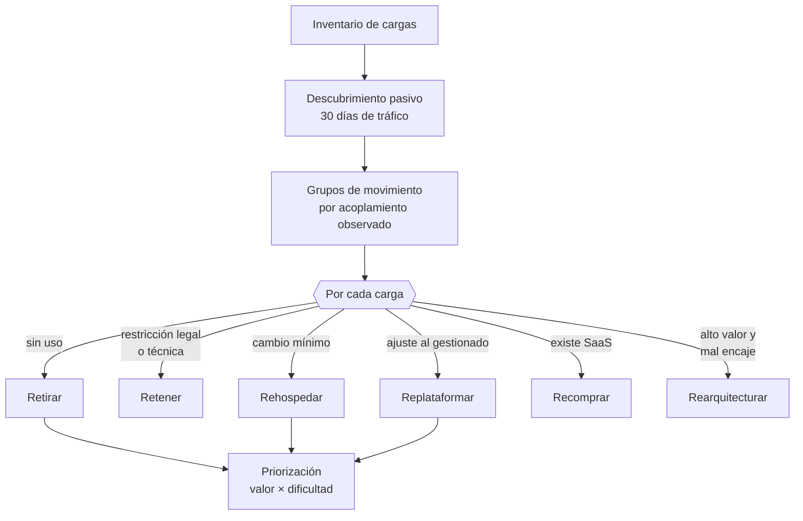

# 023 — Descubrimiento y clasificación de workloads

> [← 022 · Cloud Adoption Framework y modelo operativo](../../part-01-cloud-principles-strategy-adoption/022-cloud-adoption-framework-y-modelo-operativo/README.md) · [Índice de la parte](../README.md) · [024 · Proyecto: decisión de migración sustentada con ADR →](../../part-01-cloud-principles-strategy-adoption/024-proyecto-decision-de-migracion-sustentada-con-adr/README.md)

**Parte:** 01 — Principios, estrategia y adopción cloud<br>
**Nivel:** inicial-intermedio · **Horas estimadas:** 4<br>
**Laboratorio:** `migration` · **Estado:** `EXECUTABLE_CORE`

## 🎯 Propósito

Levantar un inventario de cargas que sirva para decidir, no para archivar. La mayoría de migraciones empieza con una hoja de cálculo de servidores y fracasa porque los servidores no son la unidad de decisión: lo son las cargas, con sus dependencias, sus datos y sus restricciones. Esta clase produce el insumo del ADR de la clase 024.

## 📚 Resultados de aprendizaje

Al finalizar podrás:

1. **Descubrir** dependencias reales por observación de tráfico en vez de por documentación o entrevistas.
2. **Clasificar** cada carga en una de las siete estrategias de migración con un criterio explícito.
3. **Detectar** los grupos de cargas que deben moverse juntas y por qué partirlos rompe el sistema.
4. **Priorizar** por valor y dificultad, situando cada carga en un cuadrante con consecuencia clara.
5. **Reconocer** los datos que hacen inviable una estrategia antes de comprometerse con ella.

## 🧩 Conceptos centrales

| Concepto | Comprensión verificable |
|---|---|
| `carga de trabajo` | Conjunto de recursos y código que entrega una capacidad de negocio identificable. Es la unidad de decisión de una migración: los servidores son un detalle de implementación. |
| `grupo de movimiento` | Conjunto de cargas tan acopladas que deben migrarse a la vez. Determinarlo mal produce llamadas que cruzan la frontera con latencia y coste inesperados. |
| `descubrimiento pasivo` | Identificación de dependencias observando el tráfico real durante un periodo representativo, en lugar de preguntar. Encuentra lo que nadie recuerda y lo que nadie quiere admitir. |
| `gravedad de los datos` | Tendencia de las aplicaciones a permanecer cerca de los datos que consumen. Cuanto mayor es el volumen, más caro es moverlo y más atrae a todo lo demás. |
| `las 7 R` | Estrategias de migración: retirar, retener, reubicar, rehospedar, replataformar, recomprar y rearquitecturar. Ordenadas de menor a mayor coste y beneficio potencial. |

## 🧠 Modelo mental

La nube es un modelo operativo de acceso bajo demanda, no un lugar mágico ni el centro de datos de otra persona.

Aplicado a esta clase, separa siempre cuatro planos: **intención** (qué necesita el usuario),
**configuración** (qué declaramos), **estado observado** (qué existe de verdad) y
**evidencia** (cómo sabemos que cumple). Confundirlos produce diseños que se ven correctos
en un diagrama pero fallan al operar.

## 🗺️ Flujo de razonamiento



## 📖 Desarrollo

### 1. La unidad de decisión es la carga, no el servidor

Un inventario de servidores responde «qué tenemos» y no responde ninguna de las preguntas que importan: qué depende de qué, qué se puede mover solo, qué se rompe si se parte.

El registro mínimo por carga, con lo que cada campo decide:

| Campo | Decide |
|---|---|
| Capacidad de negocio que entrega | Si merece migrarse o retirarse |
| Dependencias entrantes y salientes | Con qué debe moverse |
| Volumen y clasificación del dato | Coste de traslado y restricciones legales |
| Perfil de tráfico | Modelo de servicio adecuado (clase 015) |
| Criticidad y RTO/RPO exigidos | Orden en las olas |
| Dueño técnico y de negocio | Quién decide y quién acepta el riesgo |
| Licencias y su portabilidad | Coste oculto que puede invertir el caso |

La penúltima fila es la que más se olvida y la que más incidentes causa: una carga sin dueño de negocio identificable **no se puede migrar**, porque nadie puede aprobar la ventana de indisponibilidad ni aceptar el riesgo. Encontrar esas cargas huérfanas es uno de los resultados más valiosos del inventario, y a menudo revela candidatas a retirada.

La última fila puede invertir un caso de negocio completo: una licencia por núcleo físico que no se puede trasladar, o que en la nube se cuenta de otra forma, convierte una migración rentable en ruinosa. Hay que comprobarlo antes, no después.

### 2. Descubrir dependencias observando, no preguntando

Preguntar al equipo produce un mapa incompleto por tres razones que no son mala fe: nadie conoce el sistema entero, las integraciones antiguas se olvidan, y algunas conexiones las creó alguien que ya no está.

El descubrimiento pasivo observa el tráfico real:

```bash
# Conexiones establecidas con su proceso, agrupadas por destino
$ ss -tnp state established \
  | awk 'NR>1 {split($4,l,":"); split($5,r,":"); print r[1]":"r[2], $6}' \
  | sort | uniq -c | sort -rn | head -20
```

Un periodo de **al menos 30 días** es imprescindible, y la razón es concreta: los procesos de cierre mensual, las conciliaciones y los informes periódicos solo aparecen una vez al mes. Un descubrimiento de una semana pierde exactamente las dependencias que más duelen al fallar, porque son las que nadie ejercita a diario.

Lo que el descubrimiento encuentra y las entrevistas no:

```text
- servicios que nadie sabía que seguían activos
- clientes externos consumiendo una API que se creía interna
- una tarea programada que escribe en una base de datos de otro sistema
- conexiones salientes a proveedores olvidados
- tráfico hacia una IP sin dueño identificable
```

El último caso es habitual y hay que resolverlo antes de migrar: una dependencia sin dueño es una llamada que dejará de funcionar sin que nadie sepa qué se rompió.

Y una advertencia sobre el método: observar tráfico en producción puede capturar datos sensibles. Hay que limitar la captura a metadatos de conexión —origen, destino, puerto, volumen— y nunca a contenido.

### 3. Las siete estrategias, con su criterio de elección

| Estrategia | Qué es | Cuándo | Coste | Beneficio |
|---|---|---|---|---|
| **Retirar** | Apagar | Sin uso medido en 90 días | Mínimo | Alto: elimina coste y riesgo |
| **Retener** | Dejar donde está | Restricción legal, técnica o retirada próxima | Nulo | Ninguno, y es correcto |
| **Reubicar** | Mover la VM tal cual al hipervisor gestionado | Se necesita salir del centro de datos ya | Bajo | Bajo |
| **Rehospedar** | Mover sin cambios | Plazo corto, carga estándar | Bajo | Bajo-medio |
| **Replataformar** | Ajustes para usar servicios gestionados | Base de datos o cola sustituibles | Medio | Medio-alto |
| **Recomprar** | Sustituir por SaaS | Existe producto y no es diferencial | Medio | Alto si encaja |
| **Rearquitecturar** | Rediseñar | Alto valor y mal encaje con el modelo actual | **Alto** | Alto, con riesgo |

Dos errores de selección que se repiten:

**Rearquitecturar todo.** Es la estrategia más cara y más lenta, y solo se justifica cuando la carga es de alto valor **y** su arquitectura actual impide obtener el beneficio. Aplicarla a una aplicación interna que usan 40 personas consume el presupuesto que necesitaban veinte cargas más rentables.

**No retirar nada.** Es la estrategia con mejor relación coste-beneficio y la que menos se usa, porque exige admitir que algo ya no sirve. Un inventario típico encuentra entre un 10 % y un 30 % de cargas sin uso real; migrarlas cuesta dinero y no aporta nada.

La comprobación de retirada debe ser por **medición**, no por opinión: sin conexiones entrantes durante 90 días, incluido un cierre mensual completo.

### 4. Grupos de movimiento: qué se rompe al partir

Dos cargas que intercambian mucho tráfico con baja tolerancia a latencia forman un grupo y **deben moverse juntas**. Separarlas produce un fallo silencioso: todo funciona en las pruebas y se degrada en producción.

La aritmética de partir un grupo mal:

```text
carga A llama a carga B: 45 veces por petición de usuario
latencia en el mismo centro de datos:  0,4 ms → 45 × 0,4 =  18 ms
latencia si B se queda y A migra:       28 ms → 45 × 28  = 1.260 ms
```

**De 18 ms a 1,26 segundos.** El patrón de 45 llamadas por petición —una consulta dentro de un bucle— es invisible mientras la latencia es de 0,4 ms y catastrófico en cuanto sube. La migración no causó el problema de diseño: lo reveló.

Criterio para formar grupos, a partir del descubrimiento:

```text
forman grupo si:
  llamadas por petición > 10, o
  volumen entre ellas > 1 GB/día, o
  comparten transacciones con consistencia fuerte, o
  comparten la misma base de datos

pueden separarse si:
  la comunicación es asíncrona y tolera segundos
  el volumen es bajo
  hay contrato estable entre ambas
```

La tercera condición es la más rígida: **una transacción que abarca dos sistemas no se puede partir entre nubes** sin cambiar el modelo de consistencia, que es rearquitecturar y no rehospedar. Descubrirlo durante la migración es descubrirlo tarde.

Y existe una salida intermedia legítima: partir el grupo y **aceptar la degradación temporal** durante una ventana corta, con las dos partes reunidas al final de la ola. Lo que no funciona es partirlo indefinidamente.

### 5. La gravedad de los datos decide más que la aplicación

Cuanto mayor es el volumen de datos, más caro es moverlo y más atrae hacia sí a todo lo que lo consume. Esa es la razón por la que las migraciones se planifican **desde los datos hacia arriba** y no al revés.

El tiempo de traslado por red tiene un suelo aritmético:

```text
tiempo = volumen / ancho_de_banda_efectivo

40 TB por un enlace de 1 Gbit/s al 70 % de eficiencia:
  40.000 GB × 8 bit / (1 Gbit/s × 0,70) = 457.143 s ≈ 5,3 días
```

**Cinco días de transferencia continua, durante los cuales los datos siguen cambiando.** Por eso existen dos mecanismos que hay que considerar desde el inventario:

- **Transferencia física**: dispositivos que el proveedor envía, se cargan y se devuelven. Para decenas de TB suele ser más rápido, y el cálculo es sencillo: si el envío tarda menos que la red, gana.
- **Replicación continua con corte final**: se replica en caliente durante días o semanas y se hace un corte corto al final. Es lo que permite ventanas de indisponibilidad de minutos en lugar de días.

Y una restricción que no es técnica: **los datos con residencia obligatoria no se mueven**, por mucho ancho de banda que haya. Detectarlo en el inventario es lo que evita diseñar una arquitectura completa que después resulta ilegal.

La consecuencia práctica sobre el orden de las olas: una carga cuyos datos no se pueden mover **fija la posición de todo su grupo**. No es la aplicación la que decide dónde va: es el dato.

## 🔬 Ejemplo trabajado

**CloudShop inventaría sus 40 cargas antes de decidir el plan de migración.** El resultado reordena por completo el plan inicial, que era «mover todo tal cual en seis meses».

**Descubrimiento pasivo, 34 días** para cubrir un cierre mensual completo:

```text
cargas declaradas por los equipos          40
cargas detectadas con tráfico              43
  → 3 servicios activos que nadie declaró
cargas declaradas SIN tráfico entrante      7
  → candidatas a retirada
dependencias declaradas                    58
dependencias observadas                    91
  → 33 dependencias que nadie recordaba (36 %)
```

Las 33 dependencias no documentadas son el hallazgo que justifica el método: **una de cada tres conexiones reales no estaba en ningún diagrama**.

**Clasificación de las 43 cargas:**

```text                        n.º   criterio aplicado
Retirar                        7   sin tráfico entrante en 34 días, incluido cierre
Retener                        3   1 por residencia de datos, 2 por retirada en 2027
Rehospedar                    18   estándar, plazo corto
Replataformar                  9   base de datos a gestionada, cola a gestionada
Recomprar                      4   correo interno, gestor documental, wiki, tickets
Rearquitecturar                2   catálogo y pedidos: alto valor y mal encaje
```

**Las 7 retiradas ahorran 41.000 USD anuales sin migrar nada.** Es el mejor retorno del proyecto entero y estuvo disponible desde el primer día.

**Grupos de movimiento detectados:**

```text
G1  pedidos + inventario + pagos     transacciones compartidas → INSEPARABLE
G2  catálogo + búsqueda              820 MB/día entre ellos    → juntos
G3  informes + almacén de datos      lote nocturno             → separables
G4  15 cargas independientes         sin acoplamiento          → una a una
```

Se detecta a tiempo un error del plan original, que ponía inventario en la ola 1 y pedidos en la ola 3:

```text
llamadas de pedidos a inventario por transacción:     45
latencia actual (mismo centro de datos):             0,4 ms → 18 ms totales
latencia si se separan (nube ↔ centro de datos):      28 ms → 1.260 ms
presupuesto de la petición:                          300 ms
```

**Habrían roto el SLO por un factor de 4 durante los dos meses entre olas.** El plan se corrige: G1 se mueve completo en una sola ventana.

**Gravedad de los datos** sobre las dos cargas mayores:

```text
almacén de datos históricos      38 TB   residencia obligatoria en Chile
  → RETENER; fija la posición de los informes que lo consumen
base de datos de pedidos         2,4 TB  sin restricción
  → por red al 70 % de 1 Gbit/s: 7,6 h
  → con replicación continua + corte: ventana de 12 min
```

**Priorización final por valor y dificultad:**

```text                              valor  dificultad  ola
7 retiradas                        alto     mínima     0   ← inmediato
4 recompras SaaS                   alto     baja       1
15 cargas independientes           medio    baja       1-2
G2 catálogo + búsqueda             alto     media      2
G1 pedidos + inventario + pagos    alto     ALTA       3   ← una ventana
2 rearquitecturas                  alto     ALTA       4
G3 informes                        bajo     alta       4   ← atado al dato retenido
```

**Cambio respecto al plan inicial:** de «40 cargas en 6 meses» a «7 retiradas esta semana, 19 cargas fáciles en 3 meses, y las 3 difíciles con su ventana propia». El inventario no retrasó el proyecto: evitó que la ola 3 rompiera producción y encontró 41.000 USD anuales de ahorro inmediato.

## 🧪 Laboratorio guiado

Ejecuta desde la raíz:

```bash
python classes/part-01-cloud-principles-strategy-adoption/023-descubrimiento-y-clasificacion-de-workloads/lab.py
```

El laboratorio selecciona el motor de práctica **`migration`** y produce
`lab_result.json`. El escenario, sus comprobaciones y el artefacto esperado corresponden a
esta clase; no requiere credenciales y deja explícito qué debe revalidarse en un sandbox real.

1. Lee `exercise.steps` y formula una predicción antes de ejecutar.
2. Ejecuta la práctica y verifica todos los elementos de `checks`.
3. Provoca el caso de `negative_test` y explica la señal observada.
4. Materializa `inventario-de-workloads` en `evidence/` usando la plantilla indicada.
5. Para proveedor real, sigue `sandbox.requires`, registra costo y ejecuta `destroy`.

### Evidencia esperada

El artefacto principal es un inventario, dependencias, riesgo y oleadas. Además, la entrega debe incluir el comando ejecutado,
la salida estructurada y una conclusión que no exceda lo observado.

## 🏆 Reto verificable

Construye **`inventario-de-workloads`** para el caso CloudShop. Incluye una alternativa descartada,
un supuesto que pueda falsarse, una prueba de fallo y una decisión de rollback.

## ✅ Criterio de aceptación

- [ ] `lab.py` termina con código 0 y genera JSON válido.
- [ ] La entrega conecta al menos tres requisitos con mecanismos verificables.
- [ ] Existe una prueba positiva y una prueba negativa con evidencia.
- [ ] Seguridad, costo y operación aparecen como decisiones, no como anexos.
- [ ] Se declara una limitación y una condición que obligaría a revisar el diseño.
- [ ] Otra persona puede repetir el recorrido sin conocimiento tácito.

## ⚠️ Errores frecuentes

| Síntoma | Causa probable | Corrección |
|---|---|---|
| Aparecen dependencias desconocidas durante la migración | El mapa se construyó por entrevistas; nadie conoce el sistema completo | Descubrimiento pasivo de al menos 30 días para capturar los procesos mensuales. |
| Una carga migrada funciona en pruebas y se degrada en producción | Se partió un grupo de movimiento con muchas llamadas por petición | Agrupa por llamadas por petición y volumen; una transacción compartida es inseparable. |
| Se migran cargas que nadie usa | No se midió el uso real antes de decidir la estrategia | Retira lo que no tenga tráfico entrante en 90 días; es el mayor retorno del proyecto. |
| El caso de negocio se invierte al llegar la factura de licencias | No se comprobó la portabilidad de las licencias ni cómo se cuentan en la nube | Incluye licencias en el inventario y verifica su modelo de conteo antes de decidir. |
| Una arquitectura completa resulta inviable por residencia de datos | La restricción legal se descubrió después de diseñar | Clasifica los datos en el inventario; un dato que no se mueve fija la posición de todo su grupo. |

## 🛡️ Seguridad, ética y costo

Trabaja con cuentas propias o sandboxes autorizados. No publiques secretos, identificadores
reales ni datos personales. Antes de crear recursos pagos define presupuesto, etiquetas y
comando de destrucción; después verifica que no queden recursos huérfanos. Los ejemplos
locales enseñan contratos, pero no certifican cumplimiento ni disponibilidad de producción.

## ❓ Preguntas de comprobación

1. ¿Por qué el descubrimiento pasivo necesita al menos 30 días, y qué dependencias se pierden con una semana?
2. Dos cargas hacen 45 llamadas por petición a 0,4 ms. ¿Qué latencia total tendrán si se separan a 28 ms y qué implica para un SLO de 300 ms?
3. ¿Cuál de las siete estrategias tiene mejor relación coste-beneficio y por qué casi nunca se usa?
4. ¿Qué condición hace que dos cargas sean inseparables incluso con poco tráfico entre ellas?
5. 40 TB por un enlace de 1 Gbit/s al 70 % de eficiencia: ¿cuánto tarda y qué dos alternativas existen?

## 🔗 Referencias

- AWS (2024). *Migration strategies: the 7 Rs* — criterios de elección por estrategia. <https://docs.aws.amazon.com/prescriptive-guidance/latest/large-migration-guide/migration-strategies.html>
- Microsoft (2024). *Cloud Adoption Framework: assess workloads* — inventario, dependencias y clasificación. <https://learn.microsoft.com/en-us/azure/cloud-adoption-framework/plan/discover>
- McCrory, D. (2010). *Data Gravity in the Clouds* — por qué los datos atraen a las aplicaciones. <https://datagravitas.com/2010/12/07/data-gravity-in-the-clouds/>
- Google Cloud (2024). *Migration to Google Cloud: assess and discover workloads* — descubrimiento y agrupación. <https://cloud.google.com/architecture/migration-to-gcp-getting-started>
- Newman, S. (2019). *Monolith to Microservices*, caps. 2-3 — identificar fronteras y grupos acoplados antes de partir.
- Documentación oficial vigente del servicio implementado; registra URL y fecha de consulta.

---

> [Evaluación](assessment.md) · [Contrato de clase](lesson.yaml) · [Índice de la parte](../README.md)

**📥 Descargar:** [Parte 01 en PDF](../../../site/downloads/partes/manual-parte-01-cloud-principles-strategy-adoption.pdf) · [Manual integral](../../../site/downloads/multi-cloud-engineering-manual-v2.0.pdf)

| Anterior | Índice | Siguiente |
|---|---|---|
| [← 022 · Cloud Adoption Framework y modelo operativo](../../part-01-cloud-principles-strategy-adoption/022-cloud-adoption-framework-y-modelo-operativo/README.md) | [Parte 01](../README.md) · [Programa](../../README.md) | [024 · Proyecto: decisión de migración sustentada con ADR →](../../part-01-cloud-principles-strategy-adoption/024-proyecto-decision-de-migracion-sustentada-con-adr/README.md) |
