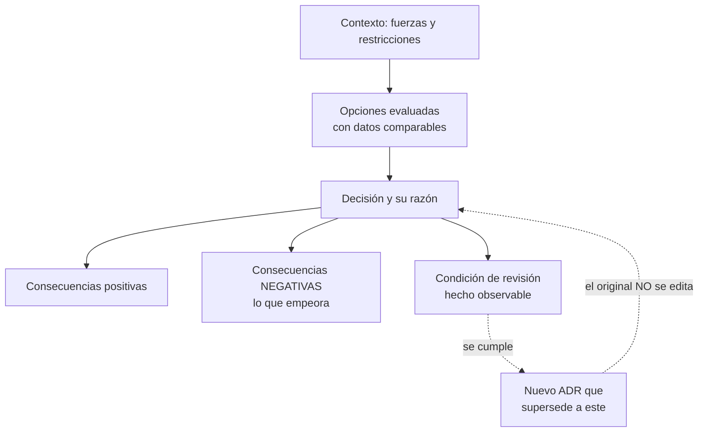

# 024 — Proyecto: decisión de migración sustentada con ADR

> [← 023 · Descubrimiento y clasificación de workloads](../../part-01-cloud-principles-strategy-adoption/023-descubrimiento-y-clasificacion-de-workloads/README.md) · [Índice de la parte](../README.md) · [025 · Organizations, cuentas, OU, SCP y landing zone →](../../part-02-aws-core-platform/025-organizations-cuentas-ou-scp-y-landing-zone/README.md)

**Parte:** 01 — Principios, estrategia y adopción cloud<br>
**Nivel:** inicial-intermedio · **Horas estimadas:** 8<br>
**Laboratorio:** `capstone` · **Estado:** `EXECUTABLE_CORE`

## 🎯 Propósito

Cerrar la parte produciendo el artefacto que la sostiene: un registro de decisión de arquitectura que integra todo lo anterior —definición, topología, modelo de servicio, identidad, responsabilidad, coste y capacidad— en un documento que alguien pueda cuestionar dentro de tres años. Un ADR no documenta lo decidido: documenta **por qué**, y sobre todo qué se descartó y bajo qué condición habría que revisarlo.

## 📚 Resultados de aprendizaje

Al finalizar podrás:

1. **Escribir** un ADR con contexto, opciones evaluadas, decisión, consecuencias y criterio de revisión.
2. **Justificar** el descarte de al menos una alternativa con datos y no con preferencia.
3. **Declarar** las consecuencias negativas de la opción elegida con la misma claridad que las positivas.
4. **Definir** la condición observable que obligaría a reabrir la decisión.
5. **Distinguir** una decisión reversible de una que no lo es, y ajustar el rigor del proceso a esa diferencia.

## 🧩 Conceptos centrales

| Concepto | Comprensión verificable |
|---|---|
| `ADR` | Documento breve e inmutable que registra una decisión de arquitectura con su contexto y consecuencias. Se numera, se versiona junto al código y no se edita: se sustituye por otro que lo supersede. |
| `estado del ADR` | Propuesto, aceptado, rechazado, obsoleto o superseded. La cadena de estados es lo que permite reconstruir la evolución del razonamiento, no solo el resultado final. |
| `decisión irreversible` | Aquella cuyo coste de deshacer es un múltiplo del de tomarla. Merece más análisis, más consenso y una condición de revisión explícita; las reversibles merecen lo contrario. |
| `consecuencia` | Lo que la decisión hace cierto a partir de ahora, tanto favorable como desfavorable. Un ADR sin consecuencias negativas no fue escrito con honestidad. |
| `condición de revisión` | Hecho observable y medible que obligaría a reabrir la decisión. Convierte un documento estático en un compromiso vivo. |

## 🧠 Modelo mental

La nube es un modelo operativo de acceso bajo demanda, no un lugar mágico ni el centro de datos de otra persona.

Aplicado a esta clase, separa siempre cuatro planos: **intención** (qué necesita el usuario),
**configuración** (qué declaramos), **estado observado** (qué existe de verdad) y
**evidencia** (cómo sabemos que cumple). Confundirlos produce diseños que se ven correctos
en un diagrama pero fallan al operar.

## 🗺️ Flujo de razonamiento



## 📖 Desarrollo

### 1. Un ADR registra el razonamiento, no el resultado

Dentro de tres años nadie recordará por qué se eligió aquello, y la persona que lo decidió probablemente ya no esté. Lo que se pierde no es la decisión —esa está en el código— sino **las restricciones que la hicieron razonable**.

Sin ese registro ocurren dos patologías simétricas:

1. **Se revierte una buena decisión** porque su motivo ya no es visible. Alguien ve una elección que hoy parece subóptima y la cambia, sin saber que respondía a una restricción que sigue vigente.
2. **Se mantiene una mala decisión** porque nadie sabe si aún aplica. La restricción desapareció hace dos años y el diseño sigue pagándola.

La estructura mínima, en el formato de Nygard:

```markdown
# ADR-0012: Base de datos gestionada multi-zona para pedidos

**Estado:** Aceptado · 2026-08-01
**Decide:** equipo de plataforma · **Acepta el riesgo:** dirección de tecnología

## Contexto
[Las fuerzas en juego, con números. No la solución.]

## Opciones consideradas
[Al menos dos alternativas reales, comparadas con los mismos criterios.]

## Decisión
[Qué se elige y por qué, ligado a los datos del contexto.]

## Consecuencias
[Positivas y NEGATIVAS. Sin las segundas no es honesto.]

## Condición de revisión
[Hecho observable que obligaría a reabrir esto.]
```

Dos reglas que lo mantienen útil: **vive junto al código**, no en una wiki que se abandona; y **no se edita**. Si la decisión cambia, se escribe otro ADR que la supersede y se enlazan. El historial de razonamiento es el valor, y editar lo destruye.

### 2. El contexto va con números y sin solución dentro

El error más común es escribir la solución en el contexto: «Necesitamos una base de datos gestionada multi-zona porque…». Eso no es contexto, es la decisión disfrazada, y elimina la posibilidad de evaluar alternativas.

El contexto debe enumerar **fuerzas medibles**:

```markdown
## Contexto

- La plataforma sirve 980.000 pedidos/mes con crecimiento del 18 % anual.
- Requisito de disponibilidad: 99,95 % mensual → 21,6 min de caída permitida.
- Requisito de recuperación: RTO 60 min, RPO 15 min.
- Presupuesto de infraestructura: ≤ 0,018 USD por pedido.
- El equipo son 4 personas sin especialista en bases de datos.
- Restricción legal: los datos personales no salen del territorio nacional.
- La región disponible tiene 3 zonas.
```

Siete fuerzas, todas verificables, ninguna sugiere una solución. Con este contexto **otra persona podría llegar a una decisión distinta y defenderla**, que es exactamente la prueba de que el contexto está bien escrito.

La quinta línea merece comentario: las restricciones de equipo son tan legítimas como las técnicas y casi nunca se escriben. «No tenemos especialista en bases de datos» descarta razonablemente opciones que exigirían operarla, y omitirlo hace que la decisión parezca arbitraria a quien lea el documento después.

Y conviene distinguir en el contexto lo que es **dato** de lo que es **supuesto**. El crecimiento del 18 % anual es una proyección, no un hecho; marcarlo como supuesto permite que la condición de revisión lo vigile.

### 3. Las opciones se comparan con los mismos criterios

Un ADR con una sola opción no es una decisión: es un anuncio. Y con opciones evaluadas por criterios distintos, la comparación no significa nada.

La tabla que hace verificable la elección:

```markdown
## Opciones consideradas

| Criterio | A: gestionada multi-zona | B: autogestionada en VM | C: gestionada una zona |
|---|---|---|---|
| Disponibilidad | 99,995 % | 99,5 % | 99,9 % |
| ¿Cumple 99,95 %? | Sí | No | No |
| RPO | 5 min | según operación | 5 min |
| Coste mensual | 4.900 USD | 3.100 USD | 3.400 USD |
| Coste por pedido | 0,0050 | 0,0032 | 0,0035 |
| Carga operativa | Baja | **Alta: parcheo y réplica** | Baja |
| Personal necesario | 0,2 FTE | **1,0 FTE** | 0,2 FTE |
| Coste real con personal | 4.900 | **3.100 + 5.200 = 8.300** | 3.400 |
```

Las dos últimas filas son las que cambian el resultado y las que casi nunca se incluyen. La opción B parece **la más barata** por infraestructura y es **la más cara** en total, porque exige una persona dedicada. Sin esa fila, el ADR habría elegido mal y con apariencia de rigor.

El criterio de descarte debe ser explícito y ligado al contexto:

```markdown
- **B se descarta** por dos motivos independientes: no alcanza el requisito de
  disponibilidad (99,5 % frente a 99,95 %) y exige 1,0 FTE que el equipo de
  4 personas no tiene.
- **C se descarta** por disponibilidad (99,9 % → 43 min/mes frente a 21,6 permitidos),
  pese a ser 1.500 USD/mes más barata.
```

Cada descarte cita el número del contexto que lo justifica. Eso es lo que permite que dentro de tres años alguien compruebe si el motivo sigue vigente.

### 4. Las consecuencias negativas son la parte honesta

Un ADR que solo enumera ventajas describe una compra, no una decisión. Toda elección de arquitectura empeora algo, y escribirlo tiene dos efectos prácticos: obliga a mirarlo antes de comprometerse, y evita que en el futuro se presente como un fallo lo que fue una elección consciente.

```markdown
## Consecuencias

### Positivas
- Disponibilidad de 99,995 %, con margen sobre el requisito.
- RPO de 5 min frente a los 15 exigidos.
- El parcheo del motor deja de consumir tiempo del equipo.

### Negativas
- **Coste por pedido de 0,0050 USD frente a 0,0035 de la opción C**: 43 % más
  caro por un requisito de disponibilidad que ninguna medición de negocio ha
  validado todavía.
- **Bloqueo de proveedor medio**: la conmutación automática y el punto de
  recuperación son propietarios. Migrar exigiría rediseñar la continuidad.
- **Pérdida de control sobre la ventana de parcheo**: se elige el intervalo,
  no la versión ni la fecha exacta.
- **El operador del proveedor tiene acceso técnico a los datos**, acotado por
  contrato pero real. Aceptado por dirección de tecnología.
```

La primera consecuencia negativa es la más valiosa del documento: **admite que el requisito que justifica el sobrecoste no está validado**. Eso convierte una suposición invisible en algo que alguien puede refutar con datos, y es justo lo que la condición de revisión debe vigilar.

La cuarta muestra otro patrón útil: nombrar un riesgo residual **y quién lo acepta**. Sin la segunda parte, el riesgo queda huérfano, que es como acaban la mayoría.

### 5. Ajustar el rigor a la reversibilidad

No todas las decisiones merecen el mismo proceso. Bezos las clasificó en dos tipos y la distinción es operativamente útil:

| Tipo | Coste de deshacer | Proceso adecuado |
|---|---|---|
| **Reversible** | Bajo, días | Decide rápido, prueba, corrige |
| **Irreversible** | Alto o destructivo | ADR completo, consenso, condición de revisión |

Ejemplos del programa, con su coste real de reversión:

```text
reversible      elegir una biblioteca de registro          horas
reversible      umbrales del autoescalado                  minutos
semi            modelo de servicio: contenedor o función   semanas
IRREVERSIBLE    esquema y particionado de datos            meses + ventana
IRREVERSIBLE    formato de identificadores públicos        rompe a terceros
IRREVERSIBLE    región donde residen los datos             coste de egreso + legal
```

Aplicar el proceso pesado a una decisión reversible es la forma más común de que un equipo se vuelva lento sin ganar nada. Aplicar el ligero a una irreversible es cómo se acumulan las restricciones que dentro de dos años nadie puede quitar.

La **condición de revisión** es lo que mantiene vivo el ADR, y debe ser observable:

```markdown
## Condición de revisión

Esta decisión se reabre si ocurre cualquiera de:

1. El coste de la base de datos supera el 35 % de la factura total.
2. Se mide durante dos trimestres que la disponibilidad real del negocio no
   se ve afectada por caídas menores de 40 min/mes (invalidaría el requisito
   que justifica el sobrecoste).
3. El volumen supera 5 M de pedidos/mes, donde el particionado obliga a
   revisar el modelo de datos completo.
```

Cada condición es un número comprobable, no una impresión. La segunda es la más valiosa: **describe cómo se demostraría que la propia decisión fue innecesariamente cara**, que es la prueba definitiva de que el ADR se escribió con honestidad.

## 🔬 Ejemplo trabajado

**ADR-0012 de CloudShop, escrito con todo lo acumulado en la parte 01.**

```markdown
# ADR-0012: Base de datos gestionada multi-zona para pedidos

**Estado:** Aceptado · 2026-08-01
**Supersede:** ninguno · **Superseded por:** —
**Decide:** equipo de plataforma · **Acepta el riesgo:** dirección de tecnología

## Contexto

- 980.000 pedidos/mes, crecimiento proyectado del 18 % anual [SUPUESTO].
- Disponibilidad exigida 99,95 % mensual → 21,6 min de caída permitida [DATO].
- RTO 60 min, RPO 15 min, del plan de continuidad vigente [DATO].
- Presupuesto ≤ 0,018 USD/pedido; hoy el total es 0,0177 [DATO].
- Equipo de 4 personas, sin especialista en bases de datos [DATO].
- Datos personales con residencia nacional obligatoria [DATO, legal].
- La región disponible tiene 3 zonas [DATO].

## Opciones consideradas

| Criterio | A: gestionada multi-zona | B: autogestionada | C: gestionada 1 zona |
|---|---|---|---|
| Disponibilidad | 99,995 % | 99,5 % | 99,9 % |
| Caída mensual | 1,3 min | 3,6 h | 43 min |
| ¿Cumple 21,6 min? | Sí | No | **No** |
| RPO | 5 min | variable | 5 min |
| Infraestructura | 4.900 USD | 3.100 USD | 3.400 USD |
| Personal | 0,2 FTE | 1,0 FTE (5.200 USD) | 0,2 FTE |
| **Coste total** | **4.900** | **8.300** | 3.400 |

**B se descarta** por dos motivos independientes: incumple la disponibilidad
(3,6 h frente a 21,6 min) y exige 1,0 FTE inexistente. Es además la más cara
en total pese a ser la más barata en infraestructura.

**C se descarta** solo por disponibilidad: 43 min/mes frente a 21,6 permitidos.
Es 1.500 USD/mes más barata y sería la elección si el requisito cambiara.

## Decisión

Se adopta **A**: base de datos gestionada con réplica síncrona entre dos zonas
y recuperación a un instante activada.

Coste unitario resultante: 4.900 / 980.000 = 0,0050 USD/pedido; el total sube
de 0,0177 a 0,0192 USD/pedido, **por encima del presupuesto de 0,018**. Se
compensa con la optimización de transferencia identificada en la clase 011
(−2.300 USD/mes), que deja el unitario en 0,0169. Ambas acciones van juntas.

## Consecuencias

### Positivas
- 1,3 min/mes de caída frente a 21,6 permitidos.
- RPO de 5 min frente a 15 exigidos.
- El parcheo del motor sale del trabajo del equipo (≈ 0,8 FTE liberados).

### Negativas
- **43 % más cara que C** por un requisito de disponibilidad que ninguna
  medición de impacto de negocio ha validado.
- **Bloqueo medio**: conmutación y punto de recuperación son propietarios.
  Coste de salida estimado: 3.780 USD de egreso + ~35.000 de rediseño.
- Se elige la ventana de parcheo, no la versión ni la fecha.
- El operador del proveedor tiene acceso técnico a los datos, acotado por
  contrato. Riesgo aceptado por dirección de tecnología.
- **No sobrevive a un fallo regional completo.** Aceptado: la continuidad
  regional no es requisito hoy.

## Condición de revisión

1. El coste de la base supera el 35 % de la factura total.
2. Dos trimestres consecutivos sin impacto de negocio atribuible a caídas
   menores de 40 min/mes → invalidaría el requisito y haría preferible C.
3. El volumen supera 5 M pedidos/mes → obliga a revisar el particionado.
4. Aparece requisito de continuidad regional → reabre con opción multi-región.

## Verificación

- [ ] Restauración probada con RTO medido, trimestral (clase 019).
- [ ] Alerta si la retención baja de 7 días o se desactiva el punto de recuperación.
- [ ] Revisión de las condiciones 1 y 2 en el comité trimestral de arquitectura.
```

**Lo que hace útil a este ADR** no es la decisión —A era razonablemente evidente— sino tres cosas que un documento típico omite: la fila de personal que invierte el orden de coste de B, la admisión de que el requisito que justifica el sobrecoste no está validado, y una condición de revisión que describe **cómo se demostraría que la decisión fue innecesariamente cara**.

## 🧪 Laboratorio guiado

Ejecuta desde la raíz:

```bash
python classes/part-01-cloud-principles-strategy-adoption/024-proyecto-decision-de-migracion-sustentada-con-adr/lab.py
```

El laboratorio selecciona el motor de práctica **`capstone`** y produce
`lab_result.json`. El escenario, sus comprobaciones y el artefacto esperado corresponden a
esta clase; no requiere credenciales y deja explícito qué debe revalidarse en un sandbox real.

1. Lee `exercise.steps` y formula una predicción antes de ejecutar.
2. Ejecuta la práctica y verifica todos los elementos de `checks`.
3. Provoca el caso de `negative_test` y explica la señal observada.
4. Materializa `adr-de-migracion` en `evidence/` usando la plantilla indicada.
5. Para proveedor real, sigue `sandbox.requires`, registra costo y ejecuta `destroy`.

### Evidencia esperada

El artefacto principal es un incremento integrado, demostrable y documentado. Además, la entrega debe incluir el comando ejecutado,
la salida estructurada y una conclusión que no exceda lo observado.

## 🏆 Reto verificable

Construye **`adr-de-migracion`** para el caso CloudShop. Incluye una alternativa descartada,
un supuesto que pueda falsarse, una prueba de fallo y una decisión de rollback.

## ✅ Criterio de aceptación

- [ ] `lab.py` termina con código 0 y genera JSON válido.
- [ ] La entrega conecta al menos tres requisitos con mecanismos verificables.
- [ ] Existe una prueba positiva y una prueba negativa con evidencia.
- [ ] Seguridad, costo y operación aparecen como decisiones, no como anexos.
- [ ] Se declara una limitación y una condición que obligaría a revisar el diseño.
- [ ] Otra persona puede repetir el recorrido sin conocimiento tácito.

## ⚠️ Errores frecuentes

| Síntoma | Causa probable | Corrección |
|---|---|---|
| Se revierte una decisión y se rompe algo que nadie sabía que dependía de ella | El ADR no registró la restricción que la hacía razonable | Escribe el contexto con fuerzas medibles; el código dice qué se hizo, el ADR por qué. |
| El ADR presenta una sola opción y parece una decisión | Es un anuncio: sin alternativas comparadas no hay razonamiento verificable | Evalúa al menos dos opciones reales con los mismos criterios y cita el número que descarta cada una. |
| La opción más barata en infraestructura resulta la más cara en total | No se incluyó el coste de personal en la comparación | Añade carga operativa y FTE necesarios como criterio; suele invertir el orden. |
| Años después nadie sabe si la decisión sigue siendo válida | No hay condición de revisión observable | Define hechos medibles que obliguen a reabrir, incluido uno que demostraría que fue innecesaria. |
| Un equipo se vuelve lento decidiendo cosas triviales | Se aplica el proceso de decisión irreversible a decisiones reversibles | Clasifica por coste de deshacer: reversible se decide rápido y se corrige; irreversible merece el ADR completo. |

## 🛡️ Seguridad, ética y costo

Trabaja con cuentas propias o sandboxes autorizados. No publiques secretos, identificadores
reales ni datos personales. Antes de crear recursos pagos define presupuesto, etiquetas y
comando de destrucción; después verifica que no queden recursos huérfanos. Los ejemplos
locales enseñan contratos, pero no certifican cumplimiento ni disponibilidad de producción.

## ❓ Preguntas de comprobación

1. ¿Por qué un ADR no se edita cuando la decisión cambia, y qué se hace en su lugar?
2. ¿Cómo distingues un contexto bien escrito de uno que ya contiene la solución?
3. ¿Qué criterio incluido en la comparación invirtió el orden de coste entre las opciones A y B?
4. ¿Qué le falta a un ADR que solo enumera consecuencias positivas?
5. Escribe una condición de revisión que demostraría que la decisión tomada fue innecesariamente cara.

## 🔗 Referencias

- Nygard, M. (2011). *Documenting Architecture Decisions* — formato original de los ADR. <https://www.cognitect.com/blog/2011/11/15/documenting-architecture-decisions>
- Keeling, M. y Runde, J. (2017). *Share the Load: Distribute Design Authority with Architecture Decision Records*. Agile Alliance. <https://www.agilealliance.org/resources/experience-reports/distribute-design-authority-with-architecture-decision-records/>
- Bezos, J. (2016). *Letter to Shareholders* — decisiones de tipo 1 y tipo 2 según su reversibilidad. <https://www.sec.gov/Archives/edgar/data/1018724/000119312516530910/d168744dex991.htm>
- Ford, N., Parsons, R. y Kua, P. (2017). *Building Evolutionary Architectures*, cap. 2 — funciones de aptitud y decisiones con condición de revisión.
- Richards, M. y Ford, N. (2020). *Fundamentals of Software Architecture*, cap. 19 — registro y comunicación de decisiones.
- Documentación oficial vigente del servicio implementado; registra URL y fecha de consulta.

---

> [Evaluación](assessment.md) · [Contrato de clase](lesson.yaml) · [Índice de la parte](../README.md)

**📥 Descargar:** [Parte 01 en PDF](../../../site/downloads/partes/manual-parte-01-cloud-principles-strategy-adoption.pdf) · [Manual integral](../../../site/downloads/multi-cloud-engineering-manual-v2.0.pdf)

| Anterior | Índice | Siguiente |
|---|---|---|
| [← 023 · Descubrimiento y clasificación de workloads](../../part-01-cloud-principles-strategy-adoption/023-descubrimiento-y-clasificacion-de-workloads/README.md) | [Parte 01](../README.md) · [Programa](../../README.md) | [025 · Organizations, cuentas, OU, SCP y landing zone →](../../part-02-aws-core-platform/025-organizations-cuentas-ou-scp-y-landing-zone/README.md) |
