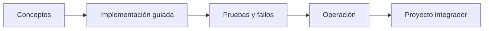

# Parte 01 — Principios, estrategia y adopción cloud

> [← Parte 00](../part-00-foundations-computing-networking-linux/README.md) · [Índice completo](../README.md) · [Parte 02 →](../part-02-aws-core-platform/README.md)

**📥 Descargar:** [Esta parte en PDF](../../site/downloads/partes/manual-parte-01-cloud-principles-strategy-adoption.pdf) · [Manual integral](../../site/downloads/multi-cloud-engineering-manual-v2.0.pdf)

**Nivel:** inicial-intermedio · **Clases:** 12 · **Duración sugerida:** 6–8 semanas

Decidir cuándo, por qué y cómo adoptar nube con criterios técnicos y económicos.

## Resultados de la parte

Al completar esta parte podrás explicar el dominio con lenguaje independiente del proveedor,
implementar sus mecanismos esenciales, diagnosticar fallos y defender decisiones mediante
evidencia, costo, seguridad y objetivos de confiabilidad.

## Modelo mental

La nube es un modelo operativo de acceso bajo demanda, no un lugar mágico ni el centro de datos de otra persona.

## Secuencia

## Clases

| ID | Clase | Laboratorio | Horas |
|---:|---|---|---:|
| 013 | [Definición NIST y características esenciales de cloud](013-definicion-nist-y-caracteristicas-esenciales-de-cloud/README.md) | `foundation` | 4 |
| 014 | [Regiones, zonas de disponibilidad, puntos de presencia y edge](014-regiones-zonas-de-disponibilidad-puntos-de-presencia-y-edge/README.md) | `architecture` | 4 |
| 015 | [IaaS, PaaS, SaaS, CaaS y FaaS](015-iaas-paas-saas-caas-y-faas/README.md) | `decision` | 4 |
| 016 | [Elasticidad, escalabilidad, disponibilidad y resiliencia](016-elasticidad-escalabilidad-disponibilidad-y-resiliencia/README.md) | `reliability` | 4 |
| 017 | [Tenancy, cuentas, suscripciones, proyectos y jerarquías](017-tenancy-cuentas-suscripciones-proyectos-y-jerarquias/README.md) | `governance` | 4 |
| 018 | [Identidad, roles, políticas y federación](018-identidad-roles-politicas-y-federacion/README.md) | `iam` | 4 |
| 019 | [Modelo de responsabilidad compartida por servicio](019-modelo-de-responsabilidad-compartida-por-servicio/README.md) | `security` | 4 |
| 020 | [TCO, costos variables, unit economics y FinOps](020-tco-costos-variables-unit-economics-y-finops/README.md) | `finops` | 4 |
| 021 | [Well-Architected y atributos de calidad](021-well-architected-y-atributos-de-calidad/README.md) | `architecture` | 4 |
| 022 | [Cloud Adoption Framework y modelo operativo](022-cloud-adoption-framework-y-modelo-operativo/README.md) | `governance` | 4 |
| 023 | [Descubrimiento y clasificación de workloads](023-descubrimiento-y-clasificacion-de-workloads/README.md) | `migration` | 4 |
| 024 | [Proyecto: decisión de migración sustentada con ADR](024-proyecto-decision-de-migracion-sustentada-con-adr/README.md) | `capstone` | 8 |

## Evaluación de la parte

- 35 % laboratorios y evidencia reproducible.
- 25 % retos verificables.
- 20 % decisiones y ADR.
- 10 % seguridad, confiabilidad y costo.
- 10 % proyecto integrador de la parte.

Se aprueba con 80 % de clases en nivel B o superior y el proyecto integrador reproducible.

## Pauta bibliográfica

- Cloud Strategy — Gregor Hohpe.
- Cloud FinOps — Storment y Fuller.
- Accelerate — Forsgren, Humble y Kim.
