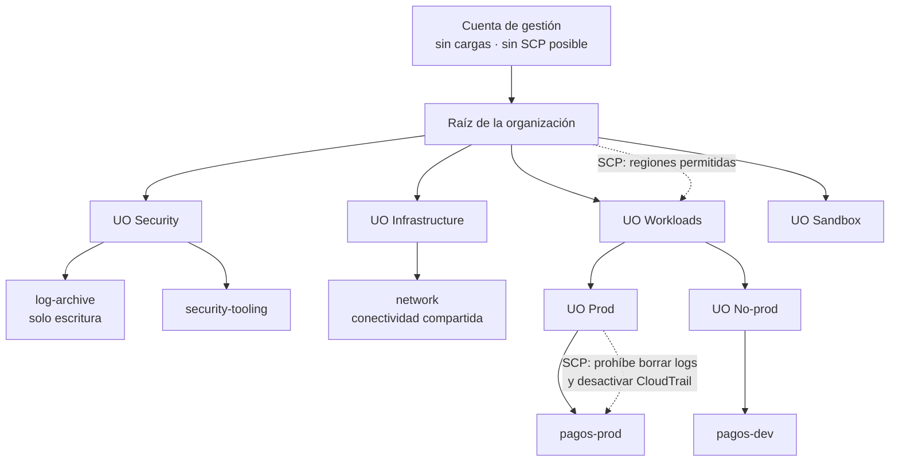

# 025 — Organizations, cuentas, OU, SCP y landing zone

> [← 024 · Proyecto: decisión de migración sustentada con ADR](../../part-01-cloud-principles-strategy-adoption/024-proyecto-decision-de-migracion-sustentada-con-adr/README.md) · [Índice de la parte](../README.md) · [026 · IAM, roles, políticas, STS y federación →](../../part-02-aws-core-platform/026-iam-roles-politicas-sts-y-federacion/README.md)

**Parte:** 02 — AWS: plataforma esencial<br>
**Nivel:** intermedio · **Horas estimadas:** 4<br>
**Laboratorio:** `governance` · **Estado:** `EXECUTABLE_CORE`

## 🎯 Propósito

Construir la estructura de cuentas que sostendrá todo lo que se despliegue en AWS durante el resto del programa. Es la decisión más irreversible de la parte: mover cuentas entre unidades organizativas cambia las políticas que se les aplican, y separar más tarde una cuenta compartida exige migrar recursos. Aquí se aplica a AWS lo que la clase 017 estableció de forma neutral.

## 📚 Resultados de aprendizaje

Al finalizar podrás:

1. **Diseñar** una jerarquía de unidades organizativas por régimen de gobierno y no por organigrama.
2. **Escribir** una SCP que restrinja sin inutilizar la cuenta, exceptuando correctamente los servicios globales.
3. **Explicar** por qué una SCP no concede permisos y qué implica al depurar un acceso denegado.
4. **Desplegar** una landing zone con cuentas de auditoría, red y seguridad separadas desde el inicio.
5. **Verificar** que los guardarraíles funcionan mediante prueba negativa, no por inspección de la configuración.

## 🧩 Conceptos centrales

| Concepto | Comprensión verificable |
|---|---|
| `SCP` | Service Control Policy: política heredada que define el techo máximo de permisos de las cuentas bajo una unidad organizativa. Nunca concede: solo limita lo que otras políticas pueden otorgar. |
| `landing zone` | Estructura base de cuentas, red, identidad y registro sobre la que se despliega todo lo demás. Su valor está en existir antes de la primera carga, porque retrofitarla es caro. |
| `cuenta de gestión` | La que crea la organización. No admite SCP sobre sí misma, así que no debe alojar cargas: cualquier compromiso ahí no tiene barrera superior que lo contenga. |
| `guardarraíl preventivo` | Control que impide la acción antes de que ocurra, normalmente una SCP. Se distingue del detectivo, que avisa después, y exige prueba negativa para demostrar que efectivamente deniega. |
| `cuenta de auditoría` | Destino centralizado de registros de todas las demás, con escritura permitida y borrado prohibido. Es lo que evita que quien comprometa una cuenta pueda borrar su propio rastro. |

## 🧠 Modelo mental

Una cuenta AWS es una frontera de seguridad y facturación; los servicios se combinan mediante contratos, no como una lista de productos aislados.

Aplicado a esta clase, separa siempre cuatro planos: **intención** (qué necesita el usuario),
**configuración** (qué declaramos), **estado observado** (qué existe de verdad) y
**evidencia** (cómo sabemos que cumple). Confundirlos produce diseños que se ven correctos
en un diagrama pero fallan al operar.

## 🗺️ Flujo de razonamiento



## 📖 Desarrollo

### 1. La cuenta de gestión no aloja cargas

AWS Organizations tiene una asimetría deliberada: **la cuenta de gestión no puede tener SCP aplicadas sobre sí misma**. Es la única de toda la organización sin barrera superior.

La consecuencia es directa: cualquier recurso que viva ahí opera sin los guardarraíles que protegen a las demás, y cualquier credencial comprometida en esa cuenta tiene el poder de modificar la organización entera —crear cuentas, mover unidades, desactivar políticas—.

Lo que sí pertenece a la cuenta de gestión:

```text
- la propia organización y sus SCP
- la agregación de facturación
- nada más
```

Y lo que hay que hacer con ella el primer día:

```bash
# Activar MFA en el usuario raíz y no volver a usarlo
$ aws iam get-account-summary --query 'SummaryMap.AccountMFAEnabled'
1
# Cero claves de acceso del usuario raíz
$ aws iam get-account-summary --query 'SummaryMap.AccountAccessKeysPresent'
0
# Alerta ante cualquier uso del usuario raíz
```

La tercera línea es el control más rentable de toda la landing zone: el uso del usuario raíz es un evento que debería ocurrir **una o dos veces al año** —para tareas que solo él puede hacer— y cualquier otra aparición merece una llamada telefónica.

AWS Control Tower automatiza buena parte de esta estructura, y conviene saber qué hace por debajo antes de usarlo: crea las unidades organizativas Security y Sandbox, las cuentas de archivo de registros y de auditoría, y aplica un conjunto de guardarraíles. Usarlo sin entender la estructura produce dependencia de la herramienta para operaciones que después hay que hacer a mano.

### 2. SCP: el orden de evaluación decide el diagnóstico

Una SCP **no concede nada**. Es un filtro sobre lo que las políticas de identidad pueden otorgar dentro de esa rama de la organización:

```text
permiso efectivo = SCP ∩ política de identidad ∩ política de recurso ∩ límite de permisos
```

Dos consecuencias operativas:

1. Adjuntar una SCP con `Allow: *` no da acceso a nadie. Si ninguna política de identidad lo concede, no hay permiso.
2. Un `Deny` en la SCP **gana sobre cualquier concesión**, incluida la del administrador de la cuenta. No hay escalada posible desde dentro.

Las SCP admiten dos estrategias, y mezclarlas causa confusión:

```text
lista de permitidos (allowlist):  quitar FullAWSAccess y enumerar lo permitido
  → muy restrictivo, alto mantenimiento: cada servicio nuevo exige tocar la SCP

lista de denegados (denylist):    mantener FullAWSAccess y denegar lo prohibido
  → lo habitual: menos mantenimiento, protege contra lo que se sabe peligroso
```

El error de diagnóstico más caro es buscar el problema en la política de identidad cuando lo deniega una SCP. El mensaje de error de AWS lo distingue, y conviene leerlo con atención:

```text
AccessDenied ... with an explicit deny in a service control policy
AccessDenied ... with an explicit deny in an identity-based policy
AccessDenied ... no identity-based policy allows the action
```

La tercera es denegación implícita —falta conceder—; las dos primeras dicen exactamente qué documento hay que revisar. Añadir permisos ante la primera no cambia nada.

### 3. Restringir regiones sin romper la cuenta

La SCP más común y la que más cuentas ha inutilizado. Restringir por región parece trivial hasta que se descubre que **varios servicios de AWS son globales y sus llamadas se emiten contra `us-east-1`**.

La versión que rompe:

```json
{
  "Effect": "Deny",
  "Action": "*",
  "Resource": "*",
  "Condition": {"StringNotEquals": {"aws:RequestedRegion": ["us-east-1", "sa-east-1"]}}
}
```

En cuanto se aplica, deja de funcionar IAM, la facturación, el soporte y Route 53 desde cualquier contexto que no resuelva a esas regiones. Y con `Action: "*"` se bloquea incluso la posibilidad de quitar la política desde la propia cuenta.

La versión correcta excluye los servicios sin región:

```json
{
  "Effect": "Deny",
  "NotAction": [
    "iam:*", "organizations:*", "support:*", "sts:*",
    "route53:*", "cloudfront:*", "budgets:*", "ce:*",
    "health:*", "waf:*", "shield:*"
  ],
  "Resource": "*",
  "Condition": {
    "StringNotEquals": {"aws:RequestedRegion": ["us-east-1", "sa-east-1"]}
  }
}
```

Y un matiz sobre `sts:*`: excluirlo es necesario porque el punto de acceso global de STS resuelve a `us-east-1`; sin la excepción, asumir roles falla desde otras regiones.

**Toda SCP debe probarse en una cuenta de sandbox antes de aplicarla a una unidad organizativa productiva.** No hay simulador que capture todos los casos, y el coste de equivocarse es una cuenta que no se puede administrar.

### 4. Cuentas de la base: auditoría, red y seguridad

Tres cuentas que conviene separar desde el primer día, porque retrofitarlas exige mover recursos con estado:

**Archivo de registros (`log-archive`).** Recibe CloudTrail, Config y logs de acceso de todas las cuentas. Su política de bucket permite escritura desde la organización y **prohíbe el borrado a todo el mundo**, incluido su propio administrador:

```json
{
  "Effect": "Deny",
  "Principal": "*",
  "Action": ["s3:DeleteObject", "s3:DeleteObjectVersion", "s3:PutBucketPolicy"],
  "Resource": "arn:aws:s3:::org-log-archive/*"
}
```

Con bloqueo de objetos en modo cumplimiento, ni siquiera la cuenta raíz puede borrarlos antes de que expire la retención. Ese es el punto: **un atacante que compromete una cuenta no puede borrar la evidencia de lo que hizo**.

**Red (`network`).** Aloja el Transit Gateway, las zonas privadas de DNS y los endpoints compartidos. Separarla evita que el ciclo de vida de la conectividad dependa de un producto concreto, y permite que el equipo de red tenga permisos ahí sin tenerlos en las cuentas de carga.

**Herramientas de seguridad (`security-tooling`).** Cuenta delegada como administradora de GuardDuty, Security Hub y Config. La delegación es importante: permite operar esos servicios en toda la organización **sin usar la cuenta de gestión**, que es donde no hay barreras.

Las tres tienen algo en común: su valor aparece durante un incidente, y para entonces ya no se pueden crear.

### 5. Un guardarraíl sin prueba negativa es una intención

Configurar una SCP no demuestra que deniegue. La configuración puede estar adjuntada a la unidad equivocada, tener una condición que nunca se cumple, o quedar anulada por un `NotAction` demasiado amplio.

La verificación exige **intentar la acción y comprobar que falla**:

```bash
# Prueba negativa 1: región no permitida
$ aws ec2 describe-instances --region eu-west-1
An error occurred (UnauthorizedOperation) ... with an explicit deny in a
service control policy                                          ✓ deniega

# Prueba negativa 2: desactivar el rastro de auditoría
$ aws cloudtrail stop-logging --name org-trail
An error occurred (AccessDeniedException) ... explicit deny in a service
control policy                                                  ✓ deniega

# Prueba positiva: lo que debe seguir funcionando
$ aws iam list-roles --max-items 1 >/dev/null && echo "IAM operativo  ✓"
$ aws sts get-caller-identity >/dev/null && echo "STS operativo  ✓"
```

Las dos últimas líneas son tan importantes como las dos primeras: **una SCP que deniega lo que debe y también lo que no, es un fallo igual de grave**, solo que se descubre más tarde y en peor momento.

El simulador de políticas de IAM ayuda pero no basta: no evalúa SCP en todos los escenarios ni captura las llamadas que los servicios hacen entre sí. La única evidencia válida es el intento real desde una cuenta bajo la unidad organizativa correspondiente.

Estas pruebas deben ser **automáticas y periódicas**, no de una sola vez. Una SCP correcta hoy puede quedar anulada mañana por otra adjuntada a un nivel distinto de la jerarquía, sin que nadie modifique la primera.

## 🔬 Ejemplo trabajado

**CloudShop opera en una sola cuenta de AWS y migra a una landing zone.** Se ejecuta y se verifica paso a paso.

Estado inicial y sus tres riesgos concretos:

```bash
$ aws organizations describe-organization 2>&1 | head -1
AWSOrganizationsNotInUseException
$ aws cloudtrail describe-trails --query 'trailList[0].[Name,S3BucketName,IsMultiRegionTrail]' --output text
cloudshop-trail   cloudshop-logs   False
```

```text
1. Sin organización: no hay SCP posible, ningún guardarraíl preventivo.
2. CloudTrail en la MISMA cuenta: quien la comprometa borra su rastro.
3. Rastro de una sola región: la actividad en otras regiones es invisible.
```

**Paso 1 — organización y unidades por régimen de gobierno**, no por equipo:

```bash
$ aws organizations create-organization --feature-set ALL
$ for uo in Security Infrastructure Workloads Sandbox; do
    aws organizations create-organizational-unit --parent-id r-abcd --name $uo
  done
$ aws organizations create-organizational-unit --parent-id ou-work --name Prod
$ aws organizations create-organizational-unit --parent-id ou-work --name NonProd
```

**Paso 2 — cuentas de la base:**

```text
log-archive        Security         destino de logs, borrado prohibido
security-tooling   Security         administrador delegado de GuardDuty y Config
network            Infrastructure   Transit Gateway y DNS privado
cloudshop-prod     Workloads/Prod   la carga actual, migrada aquí
cloudshop-dev      Workloads/NonProd
```

**Paso 3 — SCP de regiones, probada antes en Sandbox:**

```bash
$ aws organizations attach-policy --policy-id p-regiones --target-id ou-sandbox
# desde una cuenta de sandbox:
$ aws ec2 describe-instances --region ap-south-1
AccessDenied ... explicit deny in a service control policy      ✓
$ aws iam list-roles --max-items 1 >/dev/null && echo ok
ok                                                              ✓ IAM intacto
$ aws sts get-caller-identity >/dev/null && echo ok
ok                                                              ✓ STS intacto
```

La primera versión de la SCP **sí rompió STS**: sin `sts:*` en el `NotAction`, asumir roles desde `sa-east-1` fallaba porque el punto de acceso global resuelve a `us-east-1`. Se detectó en sandbox, que es exactamente para lo que sirve.

Solo entonces se aplica a Workloads.

**Paso 4 — SCP de protección de la evidencia sobre Prod:**

```json
{
  "Effect": "Deny",
  "Action": [
    "cloudtrail:StopLogging", "cloudtrail:DeleteTrail",
    "config:DeleteConfigurationRecorder", "config:StopConfigurationRecorder",
    "guardduty:DeleteDetector", "guardduty:DisassociateFromMasterAccount"
  ],
  "Resource": "*"
}
```

```bash
$ aws cloudtrail stop-logging --name org-trail   # desde cloudshop-prod
AccessDeniedException ... explicit deny in a service control policy   ✓
```

**Paso 5 — verificación del aislamiento de cuotas**, que era el fallo de la clase 017:

```bash
$ for c in cloudshop-prod cloudshop-dev; do
    printf "%-18s " $c
    aws service-quotas get-service-quota --service-code ec2 \
      --quota-code L-1216C47A --profile $c --query 'Quota.Value' --output text
  done
cloudshop-prod     256
cloudshop-dev      128
```

Cuotas independientes: un experimento en desarrollo ya no puede consumir la capacidad de producción.

**Resultado, con las pruebas que lo demuestran:**

```text                                         antes    después   evidencia
cuentas                                        1          5      —
guardarraíles preventivos                      0          2      prueba negativa ✓
logs borrables por quien compromete la cuenta  sí         no     stop-logging denegado ✓
cuota compartida entre entornos                sí         no     256 y 128 separadas ✓
visibilidad multi-región                       no         sí     rastro de organización ✓
```

**Lo que hizo útil el ejercicio no fue la estructura sino las pruebas negativas.** La primera SCP parecía correcta por inspección y rompía STS; solo intentar la acción lo reveló.

## 🧪 Laboratorio guiado

Ejecuta desde la raíz:

```bash
python classes/part-02-aws-core-platform/025-organizations-cuentas-ou-scp-y-landing-zone/lab.py
```

El laboratorio selecciona el motor de práctica **`governance`** y produce
`lab_result.json`. El escenario, sus comprobaciones y el artefacto esperado corresponden a
esta clase; no requiere credenciales y deja explícito qué debe revalidarse en un sandbox real.

1. Lee `exercise.steps` y formula una predicción antes de ejecutar.
2. Ejecuta la práctica y verifica todos los elementos de `checks`.
3. Provoca el caso de `negative_test` y explica la señal observada.
4. Materializa `landing-zone-aws` en `evidence/` usando la plantilla indicada.
5. Para proveedor real, sigue `sandbox.requires`, registra costo y ejecuta `destroy`.

### Evidencia esperada

El artefacto principal es una jerarquía de política, ownership y evidencia. Además, la entrega debe incluir el comando ejecutado,
la salida estructurada y una conclusión que no exceda lo observado.

## 🏆 Reto verificable

Construye **`landing-zone-aws`** para el caso CloudShop. Incluye una alternativa descartada,
un supuesto que pueda falsarse, una prueba de fallo y una decisión de rollback.

## ✅ Criterio de aceptación

- [ ] `lab.py` termina con código 0 y genera JSON válido.
- [ ] La entrega conecta al menos tres requisitos con mecanismos verificables.
- [ ] Existe una prueba positiva y una prueba negativa con evidencia.
- [ ] Seguridad, costo y operación aparecen como decisiones, no como anexos.
- [ ] Se declara una limitación y una condición que obligaría a revisar el diseño.
- [ ] Otra persona puede repetir el recorrido sin conocimiento tácito.

## ⚠️ Errores frecuentes

| Síntoma | Causa probable | Corrección |
|---|---|---|
| Tras aplicar una SCP de regiones deja de funcionar IAM y no se puede quitar la política | Los servicios globales emiten contra us-east-1 y no se exceptuaron | Usa `NotAction` con iam, organizations, sts, route53, cloudfront y facturación; prueba siempre en sandbox primero. |
| Se añaden permisos a un rol y el acceso sigue denegado | Lo deniega una SCP, y ninguna concesión posterior la revierte | Lee el mensaje: «explicit deny in a service control policy» indica qué documento revisar. |
| Un atacante borra los registros de la cuenta que comprometió | CloudTrail escribía en la misma cuenta y nada impedía detenerlo | Cuenta de archivo separada, bloqueo de objetos y SCP que deniegue StopLogging y DeleteTrail. |
| La cuenta de gestión aloja cargas de trabajo | Es la única sin SCP posible: no tiene barrera superior | Deja en ella solo la organización y la facturación; mueve todo lo demás a cuentas bajo unidades organizativas. |
| Un guardarraíl configurado no impide la acción que debía impedir | Se verificó por inspección de la configuración y no por intento real | Prueba negativa automatizada y periódica, más prueba positiva de lo que debe seguir funcionando. |

## 🛡️ Seguridad, ética y costo

Trabaja con cuentas propias o sandboxes autorizados. No publiques secretos, identificadores
reales ni datos personales. Antes de crear recursos pagos define presupuesto, etiquetas y
comando de destrucción; después verifica que no queden recursos huérfanos. Los ejemplos
locales enseñan contratos, pero no certifican cumplimiento ni disponibilidad de producción.

## ❓ Preguntas de comprobación

1. ¿Por qué la cuenta de gestión no debe alojar cargas de trabajo?
2. Adjuntas una SCP con `Allow: *` a una unidad organizativa. ¿Quién obtiene acceso y por qué?
3. ¿Qué servicios hay que exceptuar al restringir regiones, y qué ocurre concretamente si olvidas `sts:*`?
4. ¿Qué dos propiedades debe tener la cuenta de archivo de registros para que la evidencia sobreviva a un compromiso?
5. ¿Por qué una prueba negativa no basta sin su prueba positiva correspondiente?

## 🔗 Referencias

- AWS (2024). *Organizations: service control policies* — evaluación, estrategias y límites. <https://docs.aws.amazon.com/organizations/latest/userguide/orgs_manage_policies_scps.html>
- AWS (2024). *Organizing your AWS environment using multiple accounts* — cuentas de la base y unidades recomendadas. <https://docs.aws.amazon.com/whitepapers/latest/organizing-your-aws-environment/organizing-your-aws-environment.html>
- AWS (2024). *Control Tower: how controls work* — guardarraíles preventivos y detectivos. <https://docs.aws.amazon.com/controltower/latest/controlreference/controls.html>
- AWS (2024). *CloudTrail: security best practices* — rastro de organización, validación de integridad y bloqueo de objetos. <https://docs.aws.amazon.com/awscloudtrail/latest/userguide/best-practices-security.html>
- AWS (2024). *AWS services that work with IAM* — qué servicios son globales y cómo se comportan con condiciones de región. <https://docs.aws.amazon.com/IAM/latest/UserGuide/reference_aws-services-that-work-with-iam.html>
- Documentación oficial vigente del servicio implementado; registra URL y fecha de consulta.

---

> [Evaluación](assessment.md) · [Contrato de clase](lesson.yaml) · [Índice de la parte](../README.md)

| Anterior | Índice | Siguiente |
|---|---|---|
| [← 024 · Proyecto: decisión de migración sustentada con ADR](../../part-01-cloud-principles-strategy-adoption/024-proyecto-decision-de-migracion-sustentada-con-adr/README.md) | [Parte 02](../README.md) · [Programa](../../README.md) | [026 · IAM, roles, políticas, STS y federación →](../../part-02-aws-core-platform/026-iam-roles-politicas-sts-y-federacion/README.md) |
