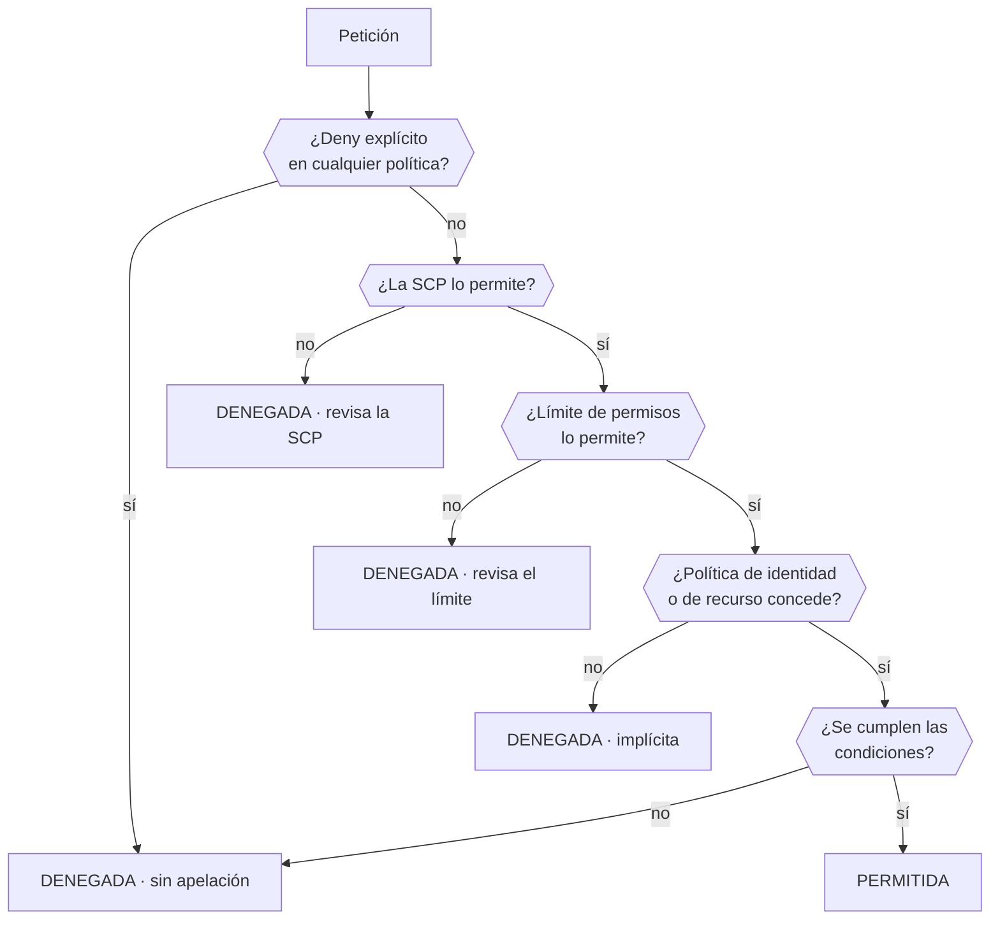

# 026 — IAM, roles, políticas, STS y federación

> [← 025 · Organizations, cuentas, OU, SCP y landing zone](../../part-02-aws-core-platform/025-organizations-cuentas-ou-scp-y-landing-zone/README.md) · [Índice de la parte](../README.md) · [027 · VPC, subredes, rutas, NAT, endpoints y seguridad →](../../part-02-aws-core-platform/027-vpc-subredes-rutas-nat-endpoints-y-seguridad/README.md)

**Parte:** 02 — AWS: plataforma esencial<br>
**Nivel:** intermedio · **Horas estimadas:** 4<br>
**Laboratorio:** `iam` · **Estado:** `EXECUTABLE_CORE`

## 🎯 Propósito

Dominar el modelo de identidad de AWS hasta poder predecir el resultado de una petición sin ejecutarla, y sustituir toda credencial de larga vida por identidad temporal. Es la clase que hace posible que en la parte 17 un pipeline despliegue sin secretos, y la que explica por qué la mayoría de brechas en AWS no son fallos de AWS.

## 📚 Resultados de aprendizaje

Al finalizar podrás:

1. **Reproducir** el orden de evaluación de una petición y predecir el resultado ante políticas en conflicto.
2. **Escribir** una política con condiciones que acoten origen, etiqueta y presencia de MFA.
3. **Configurar** federación OIDC desde un pipeline con una condición de sujeto que impida la suplantación.
4. **Usar** límites de permisos para delegar creación de roles sin permitir escalada de privilegios.
5. **Diagnosticar** un acceso denegado leyendo el mensaje para saber qué documento revisar.

## 🧩 Conceptos centrales

| Concepto | Comprensión verificable |
|---|---|
| `rol` | Identidad sin credenciales permanentes que se asume temporalmente. Tiene dos documentos: la política de confianza —quién puede asumirlo— y las de permisos —qué puede hacer una vez dentro—. |
| `política de confianza` | Documento que declara qué principales pueden asumir el rol y bajo qué condiciones. Es la puerta de entrada, y un error aquí es más grave que uno en los permisos. |
| `límite de permisos` | Política adjunta a una identidad que define el techo de lo que puede hacer, aunque otras políticas concedan más. Permite delegar la creación de roles sin permitir escalada. |
| `confused deputy` | Ataque en el que un tercero legítimo es inducido a actuar contra un recurso ajeno. Se mitiga con condiciones sobre la cuenta de origen y el identificador externo. |
| `clave de condición` | Atributo evaluable de la petición: origen, hora, MFA, etiquetas, VPC. Convierte una política de «puede» en «puede, si además se cumple esto». |

## 🧠 Modelo mental

Una cuenta AWS es una frontera de seguridad y facturación; los servicios se combinan mediante contratos, no como una lista de productos aislados.

Aplicado a esta clase, separa siempre cuatro planos: **intención** (qué necesita el usuario),
**configuración** (qué declaramos), **estado observado** (qué existe de verdad) y
**evidencia** (cómo sabemos que cumple). Confundirlos produce diseños que se ven correctos
en un diagrama pero fallan al operar.

## 🗺️ Flujo de razonamiento



## 📖 Desarrollo

### 1. El orden de evaluación, y cómo leer el error

AWS evalúa cada petición en una secuencia fija. Conocerla convierte «no tengo permiso» en un diagnóstico de un minuto:

1. **Deny explícito** en cualquier política → denegada, sin excepción.
2. **SCP** de la organización → si no lo permite, denegada.
3. **Límite de permisos**, si existe → si no lo permite, denegada.
4. **Política de identidad o de recurso** → alguna debe conceder.
5. **Condiciones** → deben cumplirse todas.

El mensaje de error dice **exactamente dónde mirar**, y casi nadie lo lee:

```text
"...with an explicit deny in a service control policy"
  → revisa las SCP. Añadir permisos a la identidad no hará nada.

"...with an explicit deny in a permissions boundary"
  → revisa el límite de permisos del rol.

"...with an explicit deny in an identity-based policy"
  → hay un Deny en la política del rol o del usuario.

"...because no identity-based policy allows the action"
  → denegación implícita: falta conceder. Este es el único caso en que
    añadir un permiso resuelve el problema.
```

Solo el cuarto caso se arregla concediendo. Los tres primeros exigen tocar otro documento, y perseguirlos con más permisos es la causa habitual de que un rol acabe con `AdministratorAccess`.

Hay un matiz sobre acceso entre cuentas: cuando el recurso está en otra cuenta hacen falta **las dos** políticas —la de identidad en la cuenta que llama y la de recurso en la que responde—. Una sola nunca basta, y el mensaje no siempre distingue cuál falta.

### 2. Condiciones: donde una política deja de ser un cheque en blanco

Un permiso sin condiciones es válido desde cualquier lugar, a cualquier hora y en cualquier contexto. Las claves de condición acotan eso:

```json
{
  "Effect": "Allow",
  "Action": ["s3:GetObject", "s3:PutObject"],
  "Resource": "arn:aws:s3:::cloudshop-facturas/*",
  "Condition": {
    "Bool": {"aws:MultiFactorAuthPresent": "true"},
    "StringEquals": {"aws:PrincipalTag/equipo": "finanzas"},
    "IpAddress": {"aws:SourceIp": ["203.0.113.0/24"]},
    "DateLessThan": {"aws:CurrentTime": "2026-12-31T23:59:59Z"}
  }
}
```

Las cuatro condiciones se combinan con **Y lógico**: todas deben cumplirse. Dentro de una misma clave con varios valores, la relación es **O**.

Dos condiciones merecen atención especial:

**`aws:PrincipalTag`** habilita control de acceso por atributos: en vez de una política por equipo, una sola política que compara la etiqueta del principal con la del recurso. Escala mucho mejor que enumerar.

**`aws:SourceIp` no funciona como se espera con endpoints de VPC.** Cuando la llamada viaja por un endpoint, la IP de origen es privada y la condición falla. Para ese caso hay que usar `aws:SourceVpce` o `aws:SourceVpc`, y es un fallo que se descubre justo después de endurecer la red.

Y una condición que evita el *confused deputy* al conceder acceso a un tercero:

```json
"Condition": {"StringEquals": {"sts:ExternalId": "identificador-unico-por-cliente"}}
```

Sin ella, un proveedor que gestiona varias cuentas podría ser inducido a actuar contra la tuya usando su propio rol legítimo.

### 3. Federación OIDC: desplegar sin ningún secreto

El mecanismo que elimina las claves de acceso de los pipelines, aplicado a AWS. El intercambio, sin secreto compartido en ningún punto:

```text
1. El pipeline pide a su plataforma un token OIDC que declara quién es.
2. Llama a sts:AssumeRoleWithWebIdentity presentando ese token.
3. AWS verifica la firma contra las claves públicas del emisor y comprueba
   que las declaraciones cumplen la política de confianza.
4. Devuelve credenciales temporales de 1 hora.
```

La política de confianza es donde se juega todo:

```json
{
  "Effect": "Allow",
  "Principal": {"Federated": "arn:aws:iam::123456789012:oidc-provider/token.actions.githubusercontent.com"},
  "Action": "sts:AssumeRoleWithWebIdentity",
  "Condition": {
    "StringEquals": {
      "token.actions.githubusercontent.com:aud": "sts.amazonaws.com",
      "token.actions.githubusercontent.com:sub": "repo:miorg/cloudshop:environment:produccion"
    }
  }
}
```

**Sin la condición sobre `sub`, cualquier repositorio de GitHub del mundo puede asumir el rol.** La firma será válida porque procede del mismo emisor; lo único que distingue a tu repositorio de otro es esa declaración.

Los errores por grado de peligro:

```text
sin condición sobre sub                    → cualquiera, en cualquier parte
"sub": "repo:miorg/*"                      → cualquier repositorio de tu organización
StringLike "repo:miorg/cloudshop:*"        → cualquier rama, incluida una de un fork
StringEquals "...:environment:produccion"  → correcto
```

Usar `environment` en lugar de `ref` añade una capa: los entornos de GitHub admiten revisores obligatorios, así que el rol solo es asumible tras una aprobación humana.

### 4. Límites de permisos: delegar sin permitir escalada

El problema: quieres que los equipos creen sus propios roles sin abrir la puerta a que se concedan `AdministratorAccess`. Conceder `iam:CreateRole` y `iam:AttachRolePolicy` es, de hecho, conceder administrador.

Un **límite de permisos** define el techo de lo que una identidad puede hacer, con independencia de lo que sus políticas concedan:

```json
// Límite: nada fuera de estos servicios, y prohibido tocar IAM salvo lo mínimo
{
  "Version": "2012-10-17",
  "Statement": [
    {"Effect": "Allow", "Action": ["s3:*", "dynamodb:*", "logs:*", "sqs:*"], "Resource": "*"},
    {"Effect": "Deny", "Action": ["iam:*", "organizations:*", "account:*"], "Resource": "*"}
  ]
}
```

Y la política que permite delegar **obligando** a aplicar ese límite:

```json
{
  "Effect": "Allow",
  "Action": ["iam:CreateRole", "iam:AttachRolePolicy"],
  "Resource": "arn:aws:iam::*:role/equipos/*",
  "Condition": {
    "StringEquals": {"iam:PermissionsBoundary": "arn:aws:iam::123456789012:policy/limite-equipos"}
  }
}
```

La condición es la clave: **solo se pueden crear roles que lleven el límite adjunto**. Sin ella, el equipo crearía roles sin límite y la delegación sería una escalada.

Falta una pieza para cerrarlo del todo:

```json
{"Effect": "Deny", "Action": ["iam:DeleteRolePermissionsBoundary", "iam:PutRolePermissionsBoundary"], "Resource": "*"}
```

Sin esta denegación, el equipo podría crear el rol con límite y quitárselo después. Es el hueco que convierte un diseño correcto en uno inútil, y no es evidente hasta que alguien lo prueba.

### 5. Privilegio mínimo con las herramientas de AWS

Adivinar la lista de permisos produce o bien exceso o bien bloqueo. AWS ofrece tres herramientas para partir de lo observado:

```bash
# 1. Qué servicios ha usado realmente un rol
$ aws iam generate-service-last-accessed-details --arn arn:aws:iam::...:role/ci-deploy
$ aws iam get-service-last-accessed-details --job-id ... \
    --query 'ServicesLastAccessed[?TotalAuthenticatedEntities>`0`].[ServiceName,LastAuthenticated]'

# 2. Generar una política a partir de la actividad de CloudTrail
$ aws accessanalyzer start-policy-generation --policy-generation-details \
    '{"principalArn":"arn:aws:iam::...:role/ci-deploy"}' --cloud-trail-details ...

# 3. Validar la política antes de aplicarla
$ aws accessanalyzer validate-policy --policy-document file://politica.json \
    --policy-type IDENTITY_POLICY --query 'findings[?findingType==`SECURITY_WARNING`]'
```

La tercera detecta patrones peligrosos que pasan desapercibidos: comodines en el principal, `iam:PassRole` sin restricción de recurso, o acciones que permiten escalada.

**`iam:PassRole` merece atención propia.** Permite entregar un rol a un servicio, y sin restricción de recurso equivale a conceder cualquier permiso que exista en la cuenta: basta con pasar un rol de administrador a una función o a una instancia que tú controlas.

```json
// Peligroso
{"Effect": "Allow", "Action": "iam:PassRole", "Resource": "*"}

// Correcto: solo roles concretos y solo al servicio esperado
{
  "Effect": "Allow", "Action": "iam:PassRole",
  "Resource": "arn:aws:iam::*:role/cloudshop-tarea-*",
  "Condition": {"StringEquals": {"iam:PassedToService": "ecs-tasks.amazonaws.com"}}
}
```

Y el límite del método basado en registros, ya señalado en la clase 018: **los caminos de error usan permisos distintos**. Un rol que escribe en una cola pero no en su cola de mensajes fallidos funciona hasta el primer fallo.

## 🔬 Ejemplo trabajado

**El pipeline de CloudShop despliega en producción con una clave de acceso de 2 años y medio y `PowerUserAccess`.** Se migra a OIDC con privilegio mínimo, verificando cada paso.

Estado inicial:

```bash
$ aws iam list-access-keys --user-name ci-deploy \
    --query 'AccessKeyMetadata[0].[CreateDate,Status]' --output text
2023-03-14T10:22:00Z   Active
$ aws iam list-attached-user-policies --user-name ci-deploy --query 'AttachedPolicies[].PolicyName'
["PowerUserAccess"]
```

```text
antigüedad          2 años 5 meses, 0 rotaciones
copias conocidas    secreto del repositorio, 2 portátiles, 1 runbook
permisos            ~8.000 acciones
ventana si se filtra ilimitada
```

**Paso 1 — proveedor OIDC y prueba de la política de confianza insegura**, para verla fallar:

```bash
$ aws iam create-open-id-connect-provider \
    --url https://token.actions.githubusercontent.com --client-id-list sts.amazonaws.com
```

Con la condición solo sobre `aud`, desde un repositorio de laboratorio ajeno a la organización:

```text
$ aws sts assume-role-with-web-identity --role-arn ...:role/ci-deploy-oidc ...
{"Credentials": {...}}          ← ÉXITO desde un repositorio ajeno
```

Se corrige acotando el sujeto al entorno:

```bash
$ aws iam update-assume-role-policy --role-name ci-deploy-oidc \
    --policy-document file://confianza.json    # sub: repo:miorg/cloudshop:environment:produccion
```

Pruebas negativas y positiva:

```text
desde otro repositorio                 → AccessDenied  ✓
desde miorg/cloudshop, rama de trabajo → AccessDenied  ✓
desde miorg/cloudshop, entorno prod    → credenciales de 1 h  ✓
```

**Paso 2 — recortar permisos con lo observado en 30 días:**

```bash
$ aws accessanalyzer start-policy-generation --policy-generation-details \
    '{"principalArn":"arn:aws:iam::123456789012:user/ci-deploy"}'
$ aws accessanalyzer get-generated-policy --job-id ... \
    --query 'generatedPolicyResult.generatedPolicies[0].policy' | jq -r '.Statement[].Action' | wc -l
34
```

```text
permisos concedidos antes    ~8.000 acciones
acciones realmente usadas        34
servicios usados                  5   (s3, cloudfront, ecs, ecr, logs)
```

Se ejercitan también los caminos de error antes de aplicar. Aparecen dos acciones más que ningún despliegue correcto usaba:

```text
ecs:StopTask                 al abortar un despliegue fallido
logs:PutLogEvents sobre el grupo de errores
```

**Paso 3 — validar la política antes de aplicarla:**

```bash
$ aws accessanalyzer validate-policy --policy-document file://ci-deploy.json \
    --policy-type IDENTITY_POLICY \
    --query 'findings[?findingType==`SECURITY_WARNING`].[issueCode,learnMoreLink]' --output text
PASS_ROLE_WITH_STAR_IN_RESOURCE   https://docs.aws.amazon.com/...
```

**El validador detecta el fallo que la generación automática no evita**: `iam:PassRole` con `Resource: "*"`, que permite pasar cualquier rol —incluido uno de administrador— a un servicio controlado por el pipeline. Se acota:

```json
{
  "Effect": "Allow", "Action": "iam:PassRole",
  "Resource": "arn:aws:iam::*:role/cloudshop-tarea-*",
  "Condition": {"StringEquals": {"iam:PassedToService": "ecs-tasks.amazonaws.com"}}
}
```

```bash
$ aws accessanalyzer validate-policy ... --query 'findings[?findingType==`SECURITY_WARNING`]'
[]                                                              ✓
```

**Paso 4 — retirar la credencial, con observación previa:**

```bash
$ aws iam update-access-key --user-name ci-deploy --access-key-id AKIA... --status Inactive
# 7 días sin fallos ni llamadas registradas con esa clave
$ aws iam delete-access-key --user-name ci-deploy --access-key-id AKIA...
$ aws iam delete-user --user-name ci-deploy
```

**Resultado:**

```text                          antes                 después
credencial                permanente, 2,5 años   token de 1 h
secretos almacenados      4 copias               0
acciones permitidas       ~8.000                 36
iam:PassRole              sin restricción        1 patrón, 1 servicio
superficie si se filtra   ilimitada              1 h, solo ese repo y entorno
```

**El paso que más aportó fue el validador**, no la generación automática: la política generada a partir del uso real contenía un `PassRole` sin acotar que habría permitido escalar a administrador desde el propio pipeline.

## 🧪 Laboratorio guiado

Ejecuta desde la raíz:

```bash
python classes/part-02-aws-core-platform/026-iam-roles-politicas-sts-y-federacion/lab.py
```

El laboratorio selecciona el motor de práctica **`iam`** y produce
`lab_result.json`. El escenario, sus comprobaciones y el artefacto esperado corresponden a
esta clase; no requiere credenciales y deja explícito qué debe revalidarse en un sandbox real.

1. Lee `exercise.steps` y formula una predicción antes de ejecutar.
2. Ejecuta la práctica y verifica todos los elementos de `checks`.
3. Provoca el caso de `negative_test` y explica la señal observada.
4. Materializa `politica-iam-aws` en `evidence/` usando la plantilla indicada.
5. Para proveedor real, sigue `sandbox.requires`, registra costo y ejecuta `destroy`.

### Evidencia esperada

El artefacto principal es una matriz de acceso mínimo con prueba de denegación. Además, la entrega debe incluir el comando ejecutado,
la salida estructurada y una conclusión que no exceda lo observado.

## 🏆 Reto verificable

Construye **`politica-iam-aws`** para el caso CloudShop. Incluye una alternativa descartada,
un supuesto que pueda falsarse, una prueba de fallo y una decisión de rollback.

## ✅ Criterio de aceptación

- [ ] `lab.py` termina con código 0 y genera JSON válido.
- [ ] La entrega conecta al menos tres requisitos con mecanismos verificables.
- [ ] Existe una prueba positiva y una prueba negativa con evidencia.
- [ ] Seguridad, costo y operación aparecen como decisiones, no como anexos.
- [ ] Se declara una limitación y una condición que obligaría a revisar el diseño.
- [ ] Otra persona puede repetir el recorrido sin conocimiento tácito.

## ⚠️ Errores frecuentes

| Síntoma | Causa probable | Corrección |
|---|---|---|
| Cualquier repositorio de GitHub puede asumir el rol de despliegue | La política de confianza no condiciona la declaración `sub` | Condiciona con StringEquals sobre repositorio y entorno; `repo:org/*` o StringLike con comodín no bastan. |
| Se conceden más permisos y el acceso sigue denegado | El deny está en una SCP o en un límite de permisos | Lee el mensaje de error: nombra el documento exacto que deniega. |
| Una política endurecida con `aws:SourceIp` rompe el acceso desde la VPC | A través de un endpoint de VPC la IP de origen es privada | Usa `aws:SourceVpce` o `aws:SourceVpc` para tráfico que viaja por endpoints. |
| Un equipo con permiso para crear roles se concede administrador | Se delegó `iam:CreateRole` sin exigir límite de permisos ni impedir retirarlo | Condiciona con `iam:PermissionsBoundary` y deniega Put/DeleteRolePermissionsBoundary. |
| Un pipeline con permisos mínimos consigue privilegios de administrador | `iam:PassRole` con Resource `*` permite pasar cualquier rol a un servicio propio | Acota PassRole por patrón de recurso y por `iam:PassedToService`. |

## 🛡️ Seguridad, ética y costo

Trabaja con cuentas propias o sandboxes autorizados. No publiques secretos, identificadores
reales ni datos personales. Antes de crear recursos pagos define presupuesto, etiquetas y
comando de destrucción; después verifica que no queden recursos huérfanos. Los ejemplos
locales enseñan contratos, pero no certifican cumplimiento ni disponibilidad de producción.

## ❓ Preguntas de comprobación

1. Un error dice «explicit deny in a service control policy». ¿Sirve de algo añadir permisos al rol? ¿Qué documento revisas?
2. ¿Por qué `aws:SourceIp` deja de funcionar cuando el tráfico pasa por un endpoint de VPC, y qué clave se usa entonces?
3. ¿Qué dos piezas hacen falta para delegar la creación de roles sin permitir escalada de privilegios?
4. ¿Por qué `iam:PassRole` con `Resource: "*"` equivale a conceder administrador?
5. ¿Qué distingue exactamente tu repositorio del de un atacante en un intercambio OIDC?

## 🔗 Referencias

- AWS (2024). *Policy evaluation logic* — orden de evaluación completo con SCP y límites de permisos. <https://docs.aws.amazon.com/IAM/latest/UserGuide/reference_policies_evaluation-logic.html>
- AWS (2024). *Global condition context keys* — catálogo de claves de condición y su comportamiento. <https://docs.aws.amazon.com/IAM/latest/UserGuide/reference_policies_condition-keys.html>
- AWS (2024). *Permissions boundaries for IAM entities* — delegación segura de creación de roles. <https://docs.aws.amazon.com/IAM/latest/UserGuide/access_policies_boundaries.html>
- AWS (2024). *IAM Access Analyzer policy validation* — comprobaciones de seguridad antes de aplicar una política. <https://docs.aws.amazon.com/IAM/latest/UserGuide/access-analyzer-policy-validation.html>
- Hardt, D., ed. (2012). *RFC 6749: The OAuth 2.0 Authorization Framework* — base del intercambio de token por credenciales. <https://www.rfc-editor.org/rfc/rfc6749>
- Documentación oficial vigente del servicio implementado; registra URL y fecha de consulta.

---

> [Evaluación](assessment.md) · [Contrato de clase](lesson.yaml) · [Índice de la parte](../README.md)

| Anterior | Índice | Siguiente |
|---|---|---|
| [← 025 · Organizations, cuentas, OU, SCP y landing zone](../../part-02-aws-core-platform/025-organizations-cuentas-ou-scp-y-landing-zone/README.md) | [Parte 02](../README.md) · [Programa](../../README.md) | [027 · VPC, subredes, rutas, NAT, endpoints y seguridad →](../../part-02-aws-core-platform/027-vpc-subredes-rutas-nat-endpoints-y-seguridad/README.md) |
