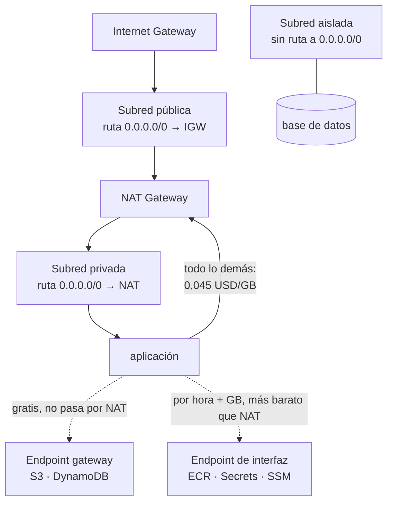

# 027 — VPC, subredes, rutas, NAT, endpoints y seguridad

> [← Clase anterior](../../part-02-aws-core-platform/026-iam-roles-politicas-sts-y-federacion/README.md) · [Índice de la parte](../README.md) · [Clase siguiente →](../../part-02-aws-core-platform/028-ec2-ami-ebs-y-seleccion-de-capacidad/README.md)

**Parte:** 02 — AWS: plataforma esencial<br>
**Nivel:** intermedio · **Horas estimadas:** 4<br>
**Laboratorio:** `network` · **Estado:** `EXECUTABLE_CORE`

## 🎯 Propósito

Diseñar una VPC entendiendo qué componente decide cada cosa: la tabla de rutas determina por dónde sale el tráfico, el grupo de seguridad quién puede hablar, y la elección entre NAT y endpoint decide una partida de la factura que suele sorprender. Es la base de las clases 028 a 036 y el origen de la mayoría de incidentes de conectividad del programa.

## 📚 Resultados de aprendizaje

Al finalizar podrás:

1. **Planificar** un rango CIDR que admita crecimiento y no colisione con la red corporativa ni con futuros pares.
2. **Determinar** si una subred es pública o privada por su tabla de rutas, no por su nombre.
3. **Elegir** entre grupo de seguridad y ACL de red sabiendo cuál tiene estado y cuál no.
4. **Calcular** el ahorro de sustituir tráfico por NAT gateway por endpoints de VPC.
5. **Diagnosticar** un fallo de conectividad recorriendo las capas en orden y con los registros de flujo.

## 🧩 Conceptos centrales

| Concepto | Comprensión verificable |
|---|---|
| `tabla de rutas` | Conjunto de reglas que decide por dónde sale el tráfico de una subred. Es lo único que hace pública a una subred: una ruta hacia una puerta de enlace de internet. |
| `grupo de seguridad` | Cortafuegos con estado a nivel de interfaz de red. Solo tiene reglas de permiso y la respuesta al tráfico permitido vuelve automáticamente, sin regla de salida que la autorice. |
| `ACL de red` | Cortafuegos sin estado a nivel de subred. Admite denegaciones explícitas, y al no tener estado exige regla de vuelta para los puertos efímeros. |
| `NAT gateway` | Servicio que permite salida a internet desde subredes privadas. Cobra por hora y **por GB procesado**, lo que lo convierte en una de las partidas más caras y menos vigiladas. |
| `endpoint de VPC` | Ruta privada hacia un servicio de AWS sin pasar por internet. Los de tipo gateway —S3 y DynamoDB— son gratuitos; los de interfaz cobran por hora y por GB, pero menos que el NAT. |

## 🧠 Modelo mental

Una cuenta AWS es una frontera de seguridad y facturación; los servicios se combinan mediante contratos, no como una lista de productos aislados.

Aplicado a esta clase, separa siempre cuatro planos: **intención** (qué necesita el usuario),
**configuración** (qué declaramos), **estado observado** (qué existe de verdad) y
**evidencia** (cómo sabemos que cumple). Confundirlos produce diseños que se ven correctos
en un diagrama pero fallan al operar.

## 🗺️ Flujo de razonamiento



## 📖 Desarrollo

### 1. Planificar el CIDR antes de crear nada

El rango de una VPC **no se puede cambiar**; solo se pueden añadir bloques secundarios, con restricciones. Un error aquí se paga durante años.

Tres reglas que evitan los problemas más caros:

**1. No solapar con nada con lo que puedas necesitar hablar.** Si la red corporativa usa `10.0.0.0/8` y creas la VPC en `10.0.0.0/16`, la VPN o el emparejamiento serán imposibles: el enrutamiento no admite solapamiento. Un registro central de rangos asignados es más barato que una migración.

**2. Dimensionar con holgura.** AWS admite de `/16` a `/28`. Un `/16` da 65.536 direcciones y **no cuesta nada reservarlo**; un `/24` se agota en cuanto se añaden zonas o servicios que consumen direcciones.

**3. Contar las direcciones que AWS reserva.** En cada subred se reservan **5**, no 2:

```text
Subred 10.20.1.0/24 → 256 direcciones teóricas
  .0    dirección de red
  .1    puerta de enlace de la VPC
  .2    servidor DNS
  .3    reservada para uso futuro
  .255  difusión
  ------------------------------
  251 direcciones utilizables
```

Un esquema que crece sin colisiones:

```text
VPC produccion     10.20.0.0/16
  pública    zona a  10.20.0.0/20    4.091 utilizables
  pública    zona b  10.20.16.0/20
  privada    zona a  10.20.32.0/20
  privada    zona b  10.20.48.0/20
  aislada    zona a  10.20.64.0/20
  aislada    zona b  10.20.80.0/20
  libre              10.20.96.0/19   reservado para crecer
```

El bloque libre al final no es desperdicio: es lo que permite añadir una tercera zona sin rehacer el esquema.

### 2. Pública o privada lo decide la tabla de rutas

Los nombres «pública» y «privada» son convención humana. Lo único que hace pública a una subred es **una ruta hacia una puerta de enlace de internet**:

```text
Subred pública        0.0.0.0/0 → igw-xxxx
Subred privada        0.0.0.0/0 → nat-xxxx
Subred aislada        sin ruta hacia 0.0.0.0/0
```

De ahí un fallo que aparece con regularidad: **una subred llamada «privada» con ruta al IGW es pública**, y cualquier recurso con IP pública en ella es accesible desde internet. El nombre no protege nada.

La comprobación es directa:

```bash
$ aws ec2 describe-route-tables \
    --filters Name=association.subnet-id,Values=subnet-0a1b2c \
    --query 'RouteTables[0].Routes[?DestinationCidrBlock==`0.0.0.0/0`].GatewayId' --output text
igw-0f9e8d          # es PÚBLICA, se llame como se llame
```

Y hay una segunda condición para que una instancia sea alcanzable desde internet: necesita **IP pública** además de la ruta. Una instancia sin IP pública en una subred pública no es accesible desde fuera, aunque sí puede salir si hay NAT.

La tercera categoría —**aislada**, sin ruta a internet en absoluto— es donde deben vivir las bases de datos. No es lo mismo que privada: una subred privada puede iniciar conexiones salientes a internet a través del NAT, y eso es exactamente lo que usa un atacante para exfiltrar datos o descargar herramientas.

### 3. Grupo de seguridad y ACL: con estado y sin estado

La diferencia decisiva:

| | Grupo de seguridad | ACL de red |
|---|---|---|
| Ámbito | Interfaz de red | Subred entera |
| Estado | **Con estado** | **Sin estado** |
| Reglas | Solo permitir | Permitir y denegar |
| Evaluación | Todas las reglas | Por orden de número |
| Referencia a otro grupo | **Sí** | No, solo CIDR |

**Con estado** significa que la respuesta al tráfico permitido vuelve automáticamente. Si un grupo permite entrada al 443, la respuesta sale sin necesidad de regla de salida.

**Sin estado** significa que hay que autorizar ambos sentidos. Este es el error clásico de las ACL:

```text
ACL con entrada 443 permitida y salida solo 443:
  petición entrante al 443           ✓ permitida
  respuesta desde el 443 hacia el
  puerto efímero del cliente (52341) ✗ BLOQUEADA
```

La conexión se establece y se cuelga. Hay que permitir la salida hacia el rango efímero `1024-65535`, y es la causa habitual de que «el firewall parece bien configurado y no funciona».

La capacidad de **referenciar otro grupo de seguridad** en vez de un CIDR es lo que hace mantenible el diseño:

```bash
$ aws ec2 authorize-security-group-ingress --group-id sg-db \
    --protocol tcp --port 5432 --source-group sg-app
```

Esto dice «lo que esté en sg-app puede hablar con la base de datos», y sigue siendo cierto cuando las instancias cambian de IP, se escalan o se sustituyen. Un CIDR fijo exige mantenimiento cada vez que la topología cambia.

La recomendación práctica: **grupos de seguridad para casi todo, ACL solo para denegaciones amplias** —bloquear un rango de IP concreto—, porque su falta de estado las hace fáciles de configurar mal.

### 4. NAT gateway: la partida cara que nadie mira

Un NAT gateway cobra dos veces: por hora de existencia y **por GB procesado**. La segunda es la que sorprende.

```text
precio por hora            ~0,045 USD  →  32,85 USD/mes
precio por GB procesado    ~0,045 USD
```

Con 8 TB mensuales de tráfico saliente hacia servicios de AWS:

```text
8.000 GB × 0,045 = 360 USD/mes solo de procesamiento
más 32,85 de la hora, por cada NAT
con un NAT por zona (3 zonas): 98,55 + 360 = 458,55 USD/mes
```

Y lo importante: **buena parte de ese tráfico no necesita salir a internet**. Descargar imágenes de ECR, leer secretos, escribir logs o hablar con S3 son llamadas a servicios de AWS que un endpoint resuelve por la red interna.

```text                              coste por GB
tráfico por NAT gateway            0,045 USD
tráfico por endpoint de interfaz   0,010 USD
tráfico por endpoint gateway       0,000 USD   ← S3 y DynamoDB
```

El endpoint **gateway** es gratuito y se instala como una ruta en la tabla; no tener uno para S3 es dinero regalado sin ninguna contrapartida. El de **interfaz** cuesta 0,01 USD por hora por zona más 0,01 por GB, así que compensa a partir de un volumen modesto:

```text
umbral del endpoint de interfaz (1 zona):
  7,30 USD/mes de coste fijo / (0,045 − 0,010) USD/GB ≈ 209 GB/mes
```

Por encima de ~209 GB mensuales hacia ese servicio, el endpoint sale más barato. Y además del ahorro, aporta seguridad: el tráfico no sale de la red de AWS, lo que permite subredes aisladas que hablan con los servicios que necesitan **sin ninguna ruta a internet**.

### 5. Diagnóstico de conectividad, de abajo hacia arriba

El orden ahorra horas porque cada paso descarta una capa completa:

```bash
# 1. ¿Existe ruta hacia el destino?
$ aws ec2 describe-route-tables --filters Name=association.subnet-id,Values=subnet-xxx \
    --query 'RouteTables[0].Routes[].[DestinationCidrBlock,GatewayId,NatGatewayId]' --output text

# 2. ¿Lo permite la ACL de la subred, en AMBOS sentidos?
$ aws ec2 describe-network-acls --filters Name=association.subnet-id,Values=subnet-xxx \
    --query 'NetworkAcls[0].Entries[?RuleNumber<`32767`]'

# 3. ¿Lo permite el grupo de seguridad de origen y el de destino?
$ aws ec2 describe-security-groups --group-ids sg-app sg-db \
    --query 'SecurityGroups[].[GroupId,IpPermissions[].FromPort]'

# 4. Analizador de accesibilidad: evalúa la ruta completa
$ aws ec2 create-network-insights-path --source i-origen --destination i-destino \
    --protocol tcp --destination-port 5432
$ aws ec2 start-network-insights-analysis --network-insights-path-id nip-xxx
```

El paso 4 es el más rentable y el menos usado: **evalúa la configuración completa y dice qué componente bloquea**, sin necesidad de tráfico real.

Y cuando la configuración parece correcta pero algo falla, los registros de flujo dan el veredicto:

```bash
$ aws logs filter-log-events --log-group-name /aws/vpc/flowlogs \
    --filter-pattern '[version, account, eni, source, destination, srcport,
                      destport=5432, protocol, packets, bytes, start, end,
                      action=REJECT, status]' --max-items 5
```

Un `REJECT` indica que una regla lo bloqueó y hay que revisar grupos y ACL. **La ausencia total de registros es un diagnóstico distinto y más útil**: significa que el paquete nunca llegó a la interfaz, así que el problema está en enrutamiento o resolución de nombres, no en el firewall.

## 🔬 Ejemplo trabajado

**La factura de red de CloudShop es de 1.180 USD/mes y nadie sabe explicarla. Además, la base de datos está en una subred llamada «privada».** Se auditan ambas cosas.

**Parte 1 — de dónde viene el gasto:**

```bash
$ aws ce get-cost-and-usage --time-period Start=2026-07-01,End=2026-08-01 \
    --granularity MONTHLY --metrics UnblendedCost \
    --filter '{"Dimensions":{"Key":"USAGE_TYPE_GROUP","Values":["EC2: NAT Gateway"]}}' \
    --query 'ResultsByTime[0].Total.UnblendedCost.Amount' --output text
842.31
```

**842 USD de 1.180 son NAT gateway.** Se desglosa qué tráfico lo atraviesa con los registros de flujo:

```text
destino                        GB/mes    % del tráfico por NAT
S3 (misma región)               9.140          49 %
ECR (descarga de imágenes)      4.620          25 %
Secrets Manager y SSM             310           2 %
CloudWatch Logs                 1.850          10 %
internet real (APIs de terceros) 2.680         14 %
                               ------
total                          18.600 GB
```

**El 86 % del tráfico que paga NAT no va a internet: va a servicios de AWS de la misma región.**

Cálculo del cambio a endpoints:

```text
actual
  3 NAT × 32,85 USD/mes de hora            =    98,55
  18.600 GB × 0,045 USD                    =   837,00
                                              --------
                                                935,55

con endpoints
  gateway S3 (gratis)          9.140 GB   →      0,00
  interfaz ECR   3 zonas × 7,30 + 4.620 × 0,010 = 68,10
  interfaz Secrets+SSM  2 svc × 3 × 7,30 + 310 × 0,010 = 46,90
  interfaz Logs  3 × 7,30 + 1.850 × 0,010  =    40,40
  NAT solo para internet real
    3 × 32,85 + 2.680 × 0,045              =   219,15
                                              --------
                                                374,55

ahorro: 935,55 − 374,55 = 561 USD/mes  (−60 %)
```

Se verifica el umbral antes de crear cada endpoint de interfaz, para no añadir coste fijo sin retorno:

```text
Secrets Manager: 310 GB/mes
  coste fijo 3 zonas: 21,90 USD
  ahorro por GB: 310 × (0,045 − 0,010) = 10,85 USD
  → NO compensa por volumen, pero SÍ por seguridad: permite que la subred
    aislada lea secretos sin ninguna ruta a internet. Se crea igualmente,
    con el sobrecoste de 11 USD/mes declarado como decisión de seguridad.
```

**Parte 2 — la subred «privada» de la base de datos:**

```bash
$ aws ec2 describe-route-tables \
    --filters Name=association.subnet-id,Values=subnet-0db1 \
    --query 'RouteTables[0].Routes[].[DestinationCidrBlock,GatewayId,NatGatewayId]' --output text
10.20.0.0/16    local     None
0.0.0.0/0       None      nat-0a7f
```

No es pública —sale por NAT, no por IGW— pero **sí puede iniciar conexiones salientes a internet**. Para una base de datos eso es un camino de exfiltración que no aporta nada:

```bash
$ aws ec2 create-route-table --vpc-id vpc-0c1d --tag-specifications \
    'ResourceType=route-table,Tags=[{Key=Name,Value=aislada}]'
# sin ruta 0.0.0.0/0; solo local y los endpoints necesarios
$ aws ec2 associate-route-table --route-table-id rtb-nueva --subnet-id subnet-0db1
```

Prueba negativa desde la instancia de base de datos:

```text
$ curl -m 5 https://example.com
curl: (28) Connection timed out                    ✓ sin salida a internet
$ aws secretsmanager get-secret-value --secret-id cloudshop/db --query Name
"cloudshop/db"                                     ✓ sigue accediendo por endpoint
```

**Resultado:**

```text                                  antes        después
coste de red                        1.180 USD     619 USD    (−48 %)
tráfico por NAT                    18.600 GB     2.680 GB
salida a internet desde la BD          sí            no
endpoints                               0             5
```

**El diagnóstico no fue de red sino de rutas.** El 86 % del gasto venía de que todo el tráfico interno salía por un componente pensado para internet, y la base de datos tenía un camino de salida que nadie había decidido darle: lo heredó de la tabla de rutas por defecto.

## 🧪 Laboratorio guiado

Ejecuta desde la raíz:

```bash
python classes/part-02-aws-core-platform/027-vpc-subredes-rutas-nat-endpoints-y-seguridad/lab.py
```

El laboratorio selecciona el motor de práctica **`network`** y produce
`lab_result.json`. El escenario, sus comprobaciones y el artefacto esperado corresponden a
esta clase; no requiere credenciales y deja explícito qué debe revalidarse en un sandbox real.

1. Lee `exercise.steps` y formula una predicción antes de ejecutar.
2. Ejecuta la práctica y verifica todos los elementos de `checks`.
3. Provoca el caso de `negative_test` y explica la señal observada.
4. Materializa `vpc-aws` en `evidence/` usando la plantilla indicada.
5. Para proveedor real, sigue `sandbox.requires`, registra costo y ejecuta `destroy`.

### Evidencia esperada

El artefacto principal es una topología con rutas, puertos y controles. Además, la entrega debe incluir el comando ejecutado,
la salida estructurada y una conclusión que no exceda lo observado.

## 🏆 Reto verificable

Construye **`vpc-aws`** para el caso CloudShop. Incluye una alternativa descartada,
un supuesto que pueda falsarse, una prueba de fallo y una decisión de rollback.

## ✅ Criterio de aceptación

- [ ] `lab.py` termina con código 0 y genera JSON válido.
- [ ] La entrega conecta al menos tres requisitos con mecanismos verificables.
- [ ] Existe una prueba positiva y una prueba negativa con evidencia.
- [ ] Seguridad, costo y operación aparecen como decisiones, no como anexos.
- [ ] Se declara una limitación y una condición que obligaría a revisar el diseño.
- [ ] Otra persona puede repetir el recorrido sin conocimiento tácito.

## ⚠️ Errores frecuentes

| Síntoma | Causa probable | Corrección |
|---|---|---|
| Una subred llamada «privada» resulta accesible desde internet | Su tabla de rutas apunta a la puerta de enlace de internet: el nombre no decide nada | Verifica la ruta 0.0.0.0/0; pública, privada y aislada se distinguen solo por ahí. |
| Una conexión se establece y se cuelga pese a que el firewall permite el puerto | La ACL de red no tiene estado y falta permitir la vuelta por el rango efímero | Autoriza 1024-65535 en el sentido de retorno, o usa grupos de seguridad, que sí tienen estado. |
| La factura de NAT gateway es la mayor partida de red | El tráfico hacia servicios de AWS de la misma región atraviesa el NAT y paga 0,045 USD/GB | Endpoint gateway para S3 y DynamoDB (gratis) y de interfaz por encima de ~209 GB/mes. |
| No se puede ampliar el rango de la VPC ni emparejar con la red corporativa | El CIDR se solapa y no se puede cambiar tras la creación | Planifica el rango contra un registro central antes de crear nada; deja bloques libres para crecer. |
| Una base de datos puede iniciar conexiones salientes a internet | Está en subred privada con ruta al NAT, heredada de la tabla por defecto | Usa subred aislada sin ruta a 0.0.0.0/0 y endpoints para lo que necesite; verifica con prueba negativa. |

## 🛡️ Seguridad, ética y costo

Trabaja con cuentas propias o sandboxes autorizados. No publiques secretos, identificadores
reales ni datos personales. Antes de crear recursos pagos define presupuesto, etiquetas y
comando de destrucción; después verifica que no queden recursos huérfanos. Los ejemplos
locales enseñan contratos, pero no certifican cumplimiento ni disponibilidad de producción.

## ❓ Preguntas de comprobación

1. ¿Cuántas direcciones utilizables tiene una subred `/24` en AWS y por qué no son 254?
2. ¿Qué convierte a una subred en pública, y basta con eso para que una instancia sea alcanzable desde internet?
3. Una ACL permite entrada al 443 y salida solo por el 443. ¿Qué ocurre y por qué?
4. A partir de cuántos GB mensuales compensa un endpoint de interfaz frente al NAT, y de dónde sale ese número?
5. Los registros de flujo no muestran ninguna entrada para una conexión fallida. ¿Qué te dice eso frente a un REJECT?

## 🔗 Referencias

- AWS (2024). *VPC user guide: subnets and routing* — direcciones reservadas y tablas de rutas. <https://docs.aws.amazon.com/vpc/latest/userguide/configure-subnets.html>
- AWS (2024). *Compare security groups and network ACLs* — con estado frente a sin estado. <https://docs.aws.amazon.com/vpc/latest/userguide/infrastructure-security.html>
- AWS (2024). *AWS PrivateLink and VPC endpoints* — tipos de endpoint, precios y restricciones. <https://docs.aws.amazon.com/vpc/latest/privatelink/what-is-privatelink.html>
- AWS (2024). *VPC Flow Logs* — formato de registro y campos para diagnóstico. <https://docs.aws.amazon.com/vpc/latest/userguide/flow-logs.html>
- AWS (2024). *Reachability Analyzer* — análisis estático de la ruta entre dos recursos. <https://docs.aws.amazon.com/vpc/latest/reachability/what-is-reachability-analyzer.html>
- Documentación oficial vigente del servicio implementado; registra URL y fecha de consulta.

---

> [Evaluación](assessment.md) · [Contrato de clase](lesson.yaml) · [Índice de la parte](../README.md)
