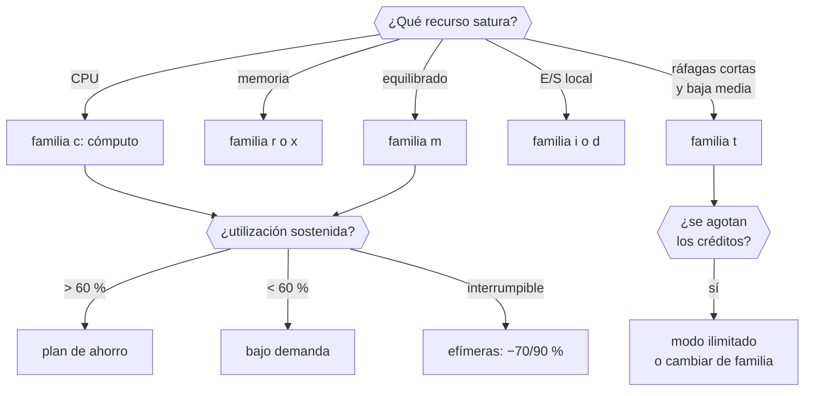

# 028 — EC2, AMI, EBS y selección de capacidad

> [← 027 · VPC, subredes, rutas, NAT, endpoints y seguridad](../../part-02-aws-core-platform/027-vpc-subredes-rutas-nat-endpoints-y-seguridad/README.md) · [Índice de la parte](../README.md) · [029 · Elastic Load Balancing y Auto Scaling →](../../part-02-aws-core-platform/029-elastic-load-balancing-y-auto-scaling/README.md)

**Parte:** 02 — AWS: plataforma esencial<br>
**Nivel:** intermedio · **Horas estimadas:** 4<br>
**Laboratorio:** `compute` · **Estado:** `EXECUTABLE_CORE`

## 🎯 Propósito

Elegir capacidad de cómputo con criterio medible en vez de por costumbre. La familia de instancia, el tipo de volumen y el modelo de compra son tres decisiones independientes, y equivocarse en cualquiera produce o bien un cuello de botella invisible o bien una factura que triplica lo necesario.

## 📚 Resultados de aprendizaje

Al finalizar podrás:

1. **Descifrar** el nombre de una instancia y deducir familia, generación, procesador y capacidades adicionales.
2. **Elegir** tipo de volumen a partir de IOPS, throughput y patrón de acceso, no por tamaño.
3. **Detectar** el agotamiento de créditos de una instancia ráfaga y decidir entre modo ilimitado o cambiar de familia.
4. **Calcular** el umbral de utilización a partir del cual compensa un plan de ahorro frente a bajo demanda.
5. **Construir** una AMI reproducible y explicar por qué el estado local es el enemigo de la elasticidad.

## 🧩 Conceptos centrales

| Concepto | Comprensión verificable |
|---|---|
| `familia de instancia` | Perfil de recursos optimizado para un uso: propósito general, cómputo, memoria, almacenamiento o aceleración. Elegir mal la familia produce que se pague de más en la dimensión que no se usa. |
| `crédito de CPU` | Saldo que acumulan las instancias ráfaga mientras están ociosas y gastan al trabajar. Al agotarse, el rendimiento cae a la línea base sin que ninguna métrica de la aplicación lo explique. |
| `IOPS` | Operaciones de entrada/salida por segundo. Junto con el throughput y el tamaño de bloque determina el rendimiento real de un volumen: 16.000 IOPS de 4 KB no equivalen a 16.000 de 256 KB. |
| `AMI` | Imagen de máquina que define el estado inicial de una instancia. Construirla de forma reproducible es lo que permite sustituir instancias en lugar de repararlas. |
| `instancia efímera` | Instancia que puede reclamarse con dos minutos de preaviso a cambio de un descuento de hasta el 90 %. Correcta para trabajo interrumpible; nunca para el camino crítico de una petición. |

## 🧠 Modelo mental

Una cuenta AWS es una frontera de seguridad y facturación; los servicios se combinan mediante contratos, no como una lista de productos aislados.

Aplicado a esta clase, separa siempre cuatro planos: **intención** (qué necesita el usuario),
**configuración** (qué declaramos), **estado observado** (qué existe de verdad) y
**evidencia** (cómo sabemos que cumple). Confundirlos produce diseños que se ven correctos
en un diagrama pero fallan al operar.

## 🗺️ Flujo de razonamiento



## 📖 Desarrollo

### 1. El nombre de la instancia es una especificación

`m7g.2xlarge` no es un código arbitrario: cada carácter dice algo, y leerlo evita elegir a ciegas.

```text
m      familia: propósito general (c=cómputo, r=memoria, i=E/S, t=ráfaga)
7      generación: cuanto mayor, mejor relación precio-rendimiento
g      procesador: g=Graviton (ARM), i=Intel, a=AMD; sin letra = Intel
.2xlarge  tamaño: 8 vCPU y 32 GB
```

Sufijos adicionales que cambian el precio y el comportamiento:

| Sufijo | Significa |
|---|---|
| `d` | Almacenamiento NVMe local, efímero |
| `n` | Ancho de banda de red mejorado |
| `e` | Memoria o almacenamiento ampliados |
| `flex` | Rendimiento sostenido reducido, más barato |

La **generación** es la palanca más rentable y la más ignorada: pasar de la 5 a la 7 suele dar mejor rendimiento por menos dinero, y el cambio no requiere tocar la aplicación salvo por la arquitectura del procesador.

Sobre **Graviton**: es ARM, así que exige binarios para `arm64`. Para lenguajes interpretados o con máquina virtual —Python, Java, Node— el cambio suele ser transparente; para binarios compilados o imágenes de contenedor hay que reconstruir. La relación precio-rendimiento típicamente mejora entre un 20 % y un 40 %, así que la reconstrucción se amortiza rápido en flotas grandes.

El tamaño escala linealmente dentro de la familia: `2xlarge` es exactamente el doble de `xlarge` en vCPU, memoria, red y precio. Eso hace que la aritmética de dimensionado sea directa.

### 2. Créditos de CPU: el desplome que no aparece en las métricas

Las instancias de la familia `t` no ofrecen su vCPU completa de forma continua. Tienen una **línea base** —un porcentaje del rendimiento nominal— y acumulan créditos mientras consumen por debajo de ella.

```text
t3.medium: línea base 20 % por vCPU
  ociosa al 5 %   → acumula créditos
  al 80 % de CPU  → gasta créditos
  saldo a cero    → el rendimiento se limita al 20 %
```

El síntoma es característico y desconcierta: la aplicación se vuelve cuatro o cinco veces más lenta **sin ningún cambio en el código, la carga ni la configuración**. Ninguna métrica del sistema operativo lo explica, porque desde dentro la CPU parece ocupada y disponible.

El diagnóstico exige una métrica del proveedor, no del sistema:

```bash
$ aws cloudwatch get-metric-statistics --namespace AWS/EC2 \
    --metric-name CPUCreditBalance --dimensions Name=InstanceId,Value=i-0a1b2c \
    --start-time 2026-08-01T00:00:00Z --end-time 2026-08-01T12:00:00Z \
    --period 300 --statistics Minimum --query 'Datapoints[?Minimum<`10`]|length(@)'
17
```

Diecisiete intervalos con el saldo por debajo de 10 créditos: la instancia lleva horas limitada.

Dos salidas, con consecuencias distintas:

```text
modo ilimitado   permite superar la línea base pagando el exceso.
                 Correcto para picos ocasionales; ruinoso si la carga es
                 sostenida, porque el sobrecargo puede superar el precio
                 de una instancia normal.
cambiar familia  si la utilización media supera la línea base de forma
                 sostenida, la familia t es la elección equivocada.
```

La regla: **la familia `t` es para cargas con media baja y picos cortos**. Si la media supera la línea base, el descuento desaparece y el riesgo permanece.

### 3. Volúmenes: IOPS, throughput y tamaño de bloque

Elegir volumen por tamaño es el error más común. Lo que decide el rendimiento son tres números y su interacción:

| Tipo | IOPS máx | Throughput máx | Precio relativo | Para |
|---|---|---|---|---|
| `gp3` | 16.000 | 1.000 MB/s | 1,0 | Propósito general; IOPS y throughput independientes del tamaño |
| `gp2` | 3 por GB, tope 16.000 | 250 MB/s | 1,25 | Generación anterior: el rendimiento depende del tamaño |
| `io2` | 256.000 | 4.000 MB/s | 3-5 | Bases de datos exigentes, con durabilidad mayor |
| `st1` | 500 | 500 MB/s | 0,3 | Lectura secuencial grande: logs, big data |

La diferencia entre `gp2` y `gp3` es económicamente relevante: en `gp2` **hay que sobredimensionar el tamaño para obtener IOPS**. Para 6.000 IOPS hacen falta 2.000 GB aunque solo se usen 200. En `gp3` se configuran por separado:

```text
gp2 para 6.000 IOPS:  2.000 GB × 0,10 USD/GB          = 200,00 USD/mes
gp3 equivalente:       200 GB × 0,08 + 3.000 IOPS extra × 0,005
                     =  16,00 + 15,00                 =  31,00 USD/mes
```

**Un factor de 6,5 por la misma capacidad efectiva.** Migrar de `gp2` a `gp3` es de las optimizaciones de mayor retorno y menor riesgo que existen.

Y el detalle que descoloca al medir: **una operación de E/S se cuenta hasta 256 KB**. Una lectura de 1 MB consume 4 IOPS, no 1. Por eso una carga secuencial agota antes el throughput que las IOPS, y una aleatoria de bloques pequeños agota antes las IOPS:

```text
16.000 IOPS × 4 KB   =   64 MB/s  ← limita el IOPS
16.000 IOPS × 256 KB = 4.096 MB/s ← limita el throughput (tope 1.000)
```

Hay un segundo límite que se olvida: **la instancia también tiene un tope de ancho de banda hacia EBS**, independiente del volumen. Un `gp3` de 1.000 MB/s conectado a una instancia con 600 MB/s de ancho de banda entrega 600.

### 4. Modelos de compra y el umbral que los separa

Cuatro formas de pagar el mismo cómputo:

| Modelo | Descuento | Compromiso | Riesgo |
|---|---|---|---|
| Bajo demanda | 0 % | Ninguno | Ninguno |
| Savings Plan 1 año | ~28 % | Gasto por hora, no instancia concreta | Sobredimensionar |
| Savings Plan 3 años | ~45 % | Ídem | Cambio tecnológico |
| Efímeras | 70-90 % | Ninguno | **Reclamación con 2 min de aviso** |

El umbral de utilización a partir del cual compensa comprometerse sale de igualar costes, como en la clase 015:

```text
u × 730 h × P = 730 h × 0,72 P   →   u = 0,72
```

**Con más del 72 % de uso sostenido, el plan de un año sale a cuenta.** Y hay un matiz que lo hace más atractivo de lo que parece: los Savings Plans de cómputo comprometen **gasto por hora**, no un tipo de instancia. Se puede cambiar de familia, de tamaño y de región sin perder el descuento, lo que elimina buena parte del riesgo de sobredimensionar.

Las **instancias efímeras** merecen su propio criterio. El descuento es enorme y el riesgo concreto: dos minutos de preaviso. Son correctas para trabajo por lotes reanudable, transcodificación, entrenamiento con puntos de control y entornos de prueba. No lo son para nada que sostenga una petición de usuario, salvo que la arquitectura absorba la pérdida sin degradación visible.

La estrategia habitual en una flota:

```text
base estable (60 % de la capacidad)  → Savings Plan
variación previsible (25 %)          → bajo demanda
picos y lotes (15 %)                 → efímeras
```

### 5. El estado local es el enemigo de la elasticidad

Una instancia que guarda estado en su disco no se puede sustituir: hay que repararla. Y reparar es lo contrario de operar en cloud.

La distinción práctica, con lo que hay que hacer con cada cosa:

```text
logs        → fuera del host, a un recolector (clase 007)
sesiones    → almacén compartido, no memoria del proceso
ficheros    → almacenamiento de objetos o sistema de ficheros compartido
caché       → externa; si es local, debe poder perderse sin consecuencias
datos       → base de datos gestionada
configuración → parámetros o secretos, inyectados al arrancar
```

Si todo eso está fuera, una instancia es **desechable**: se puede terminar y crear otra sin ceremonia. Esa propiedad es la que hacen posibles el autoescalado, los despliegues sin interrupción y el parcheo por sustitución.

Y exige una AMI reproducible. Construirla a mano —arrancar, instalar, guardar imagen— produce una imagen que nadie sabe recrear:

```hcl
# Fragmento de plantilla declarativa
source "amazon-ebs" "cloudshop" {
  source_ami_filter {
    filters = { name = "al2023-ami-*-arm64" }
    owners  = ["amazon"]
    most_recent = true
  }
  instance_type = "t4g.small"
  ami_name      = "cloudshop-{{timestamp}}"
}
```

Dos propiedades que hay que exigir a la imagen:

1. **Reproducible**: la misma plantilla produce una imagen funcionalmente equivalente.
2. **Fechada e inmutable**: nunca se sobrescribe una AMI; se crea otra y se cambia la referencia. Es la misma lógica de la clase 003 sobre etiquetas mutables.

Y una advertencia de seguridad: **una AMI compartida por error es pública para siempre a efectos prácticos**. Antes de compartir hay que comprobar que no contiene claves, historial de shell ni datos residuales.

## 🔬 Ejemplo trabajado

**El servicio de catálogo de CloudShop se degrada cada día entre las 11:00 y las 14:00. No hay despliegues ni aumento de tráfico en esa franja.**

Las métricas de la aplicación no explican nada:

```text
peticiones/s        estables en 340
tasa de error       0,02 %, sin cambio
CPU del sistema     94 % durante la degradación
latencia p95        88 ms → 410 ms
```

La CPU al 94 % sugiere saturación, pero el tráfico no subió. Se mira la métrica del proveedor:

```bash
$ aws cloudwatch get-metric-statistics --namespace AWS/EC2 \
    --metric-name CPUCreditBalance --dimensions Name=InstanceId,Value=i-0a1b2c \
    --start-time 2026-08-01T08:00:00Z --end-time 2026-08-01T15:00:00Z \
    --period 3600 --statistics Average --query 'Datapoints[].[Timestamp,Average]' --output text | sort
2026-08-01T08:00:00Z    142.0
2026-08-01T10:00:00Z     38.0
2026-08-01T11:00:00Z      0.0        ← agotados
2026-08-01T14:00:00Z      0.0
```

**Créditos agotados a las 11:00.** Las instancias son `t3.large` con línea base del 30 %; al agotar el saldo, el rendimiento se limita a esa fracción:

```text
rendimiento nominal      2 vCPU
línea base 30 %          0,6 vCPU efectivas
factor de degradación    3,3×
latencia observada       88 × 3,3 = 290 ms teórico; medido 410 con encolamiento
```

Se comprueba la utilización media real para elegir la salida:

```text
utilización media diaria    47 %
línea base de t3.large      30 %
```

**La media supera la línea base**, así que la familia `t` es la elección equivocada: el modo ilimitado cobraría el exceso todo el día. Se dimensiona una alternativa por la ley de Little:

```text
λ = 340 peticiones/s, W = 0,088 s → L = 30 concurrentes
a ρ = 0,70 → 43 concurrentes → con 16 por instancia, 3 instancias
```

Comparación de tres opciones para 3 instancias:

```text                              vCPU  precio/mes  ¿sostiene?
3 × t3.large (actual)               6    182,50 USD   no: se limita
3 × t3.large modo ilimitado         6    182,50 + ~95 sobrecargo = 277,50
3 × m7g.large (Graviton)            6    139,00 USD   sí, sostenido
```

**`m7g.large` cuesta menos que la opción actual degradada y sostiene el rendimiento.** Requiere reconstruir la imagen para `arm64`; la aplicación es Python y la reconstrucción resultó transparente salvo por una dependencia con extensión nativa.

Se aprovecha para revisar los volúmenes:

```bash
$ aws ec2 describe-volumes --filters Name=attachment.instance-id,Values=i-0a1b2c \
    --query 'Volumes[].[VolumeType,Size,Iops]' --output text
gp2     500     1500
```

```text
gp2 de 500 GB: 1.500 IOPS, uso real 92 GB → se pagaba tamaño para obtener IOPS
gp3 de 120 GB con 3.000 IOPS configurados:
  gp2: 500 × 0,10                        = 50,00 USD/mes
  gp3: 120 × 0,08                        =  9,60 USD/mes
  (3.000 IOPS entran en la base gratuita)
  ahorro por instancia                    = 40,40 USD/mes
```

**Resultado combinado:**

```text                          antes        después
instancias              3 × t3.large   3 × m7g.large
cómputo                   182,50 USD     139,00 USD
almacenamiento            150,00 USD      28,80 USD
total                     332,50 USD     167,80 USD   (−50 %)
latencia p95 11:00-14:00      410 ms          91 ms
degradación diaria           3 horas        ninguna
```

**El diagnóstico no estaba en la aplicación ni en el sistema operativo: estaba en una métrica que solo el proveedor publica.** Y la corrección salió más barata que el problema.

## 🧪 Laboratorio guiado

Ejecuta desde la raíz:

```bash
python classes/part-02-aws-core-platform/028-ec2-ami-ebs-y-seleccion-de-capacidad/lab.py
```

El laboratorio selecciona el motor de práctica **`compute`** y produce
`lab_result.json`. El escenario, sus comprobaciones y el artefacto esperado corresponden a
esta clase; no requiere credenciales y deja explícito qué debe revalidarse en un sandbox real.

1. Lee `exercise.steps` y formula una predicción antes de ejecutar.
2. Ejecuta la práctica y verifica todos los elementos de `checks`.
3. Provoca el caso de `negative_test` y explica la señal observada.
4. Materializa `instancia-aws` en `evidence/` usando la plantilla indicada.
5. Para proveedor real, sigue `sandbox.requires`, registra costo y ejecuta `destroy`.

### Evidencia esperada

El artefacto principal es una selección de capacidad justificada y observable. Además, la entrega debe incluir el comando ejecutado,
la salida estructurada y una conclusión que no exceda lo observado.

## 🏆 Reto verificable

Construye **`instancia-aws`** para el caso CloudShop. Incluye una alternativa descartada,
un supuesto que pueda falsarse, una prueba de fallo y una decisión de rollback.

## ✅ Criterio de aceptación

- [ ] `lab.py` termina con código 0 y genera JSON válido.
- [ ] La entrega conecta al menos tres requisitos con mecanismos verificables.
- [ ] Existe una prueba positiva y una prueba negativa con evidencia.
- [ ] Seguridad, costo y operación aparecen como decisiones, no como anexos.
- [ ] Se declara una limitación y una condición que obligaría a revisar el diseño.
- [ ] Otra persona puede repetir el recorrido sin conocimiento tácito.

## ⚠️ Errores frecuentes

| Síntoma | Causa probable | Corrección |
|---|---|---|
| El rendimiento se desploma a diario sin cambios de código ni de carga | Agotamiento de créditos de CPU en una instancia ráfaga | Vigila `CPUCreditBalance`; si la media supera la línea base, cambia de familia en vez de activar modo ilimitado. |
| Se paga un volumen enorme del que se usa una fracción | En `gp2` las IOPS dependen del tamaño, así que hay que sobredimensionar | Migra a `gp3` y configura IOPS y throughput por separado; el ahorro suele superar el 60 %. |
| Un volumen con 1.000 MB/s entrega bastante menos | La instancia tiene su propio tope de ancho de banda hacia EBS | Comprueba el límite de la instancia además del volumen; el menor de los dos manda. |
| Una instancia no se puede sustituir sin perder datos | Guarda estado local: sesiones, ficheros o logs | Externaliza todo el estado; una instancia que no es desechable impide el autoescalado y el parcheo por sustitución. |
| Un trabajo en instancias efímeras pierde horas de progreso | Se usó capacidad interrumpible sin puntos de control | Reserva las efímeras para trabajo reanudable con checkpoints; el preaviso es de dos minutos. |

## 🛡️ Seguridad, ética y costo

Trabaja con cuentas propias o sandboxes autorizados. No publiques secretos, identificadores
reales ni datos personales. Antes de crear recursos pagos define presupuesto, etiquetas y
comando de destrucción; después verifica que no queden recursos huérfanos. Los ejemplos
locales enseñan contratos, pero no certifican cumplimiento ni disponibilidad de producción.

## ❓ Preguntas de comprobación

1. Descompón `c7gn.4xlarge`: ¿qué dice cada parte del nombre?
2. Una instancia `t3` tiene utilización media del 47 % y línea base del 30 %. ¿Conviene modo ilimitado? Justifica.
3. ¿Cuántas IOPS consume una lectura secuencial de 1 MB, y por qué eso cambia qué límite alcanzas antes?
4. ¿Por qué `gp3` con 200 GB puede rendir más que `gp2` con 2.000 GB y costar seis veces menos?
5. ¿A partir de qué utilización sostenida compensa un Savings Plan de un año, y qué riesgo elimina que comprometa gasto y no tipo de instancia?

## 🔗 Referencias

- AWS (2024). *Amazon EC2 instance types* — nomenclatura, familias y capacidades adicionales. <https://docs.aws.amazon.com/ec2/latest/instancetypes/instance-types.html>
- AWS (2024). *Burstable performance instances* — línea base, créditos y modo ilimitado. <https://docs.aws.amazon.com/AWSEC2/latest/UserGuide/burstable-performance-instances.html>
- AWS (2024). *Amazon EBS volume types* — IOPS, throughput y tamaño de operación de E/S. <https://docs.aws.amazon.com/ebs/latest/userguide/ebs-volume-types.html>
- AWS (2024). *Savings Plans* — compromiso por gasto horario frente a instancias reservadas. <https://docs.aws.amazon.com/savingsplans/latest/userguide/what-is-savings-plans.html>
- AWS (2024). *Spot Instances: interruption notices* — preaviso de dos minutos y patrones de uso seguro. <https://docs.aws.amazon.com/AWSEC2/latest/UserGuide/spot-interruptions.html>
- Documentación oficial vigente del servicio implementado; registra URL y fecha de consulta.

---

> [Evaluación](assessment.md) · [Contrato de clase](lesson.yaml) · [Índice de la parte](../README.md)

| Anterior | Índice | Siguiente |
|---|---|---|
| [← 027 · VPC, subredes, rutas, NAT, endpoints y seguridad](../../part-02-aws-core-platform/027-vpc-subredes-rutas-nat-endpoints-y-seguridad/README.md) | [Parte 02](../README.md) · [Programa](../../README.md) | [029 · Elastic Load Balancing y Auto Scaling →](../../part-02-aws-core-platform/029-elastic-load-balancing-y-auto-scaling/README.md) |
