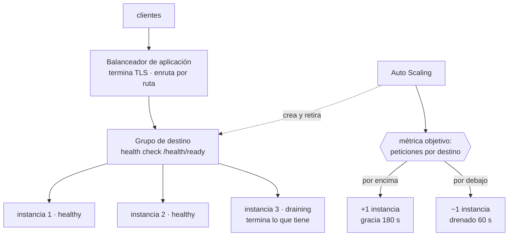

# 029 — Elastic Load Balancing y Auto Scaling

> [← Clase anterior](../../part-02-aws-core-platform/028-ec2-ami-ebs-y-seleccion-de-capacidad/README.md) · [Índice de la parte](../README.md) · [Clase siguiente →](../../part-02-aws-core-platform/030-s3-objetos-versionado-lifecycle-y-replicacion/README.md)

**Parte:** 02 — AWS: plataforma esencial<br>
**Nivel:** intermedio · **Horas estimadas:** 4<br>
**Laboratorio:** `reliability` · **Estado:** `EXECUTABLE_CORE`

## 🎯 Propósito

Construir una capa elástica que reparta tráfico y ajuste capacidad sin oscilar ni tumbar el servicio al desplegar. Aquí se aplican a AWS los cálculos de la clase 016 —histéresis, margen de arranque, rechazo de carga— y se añade lo que ninguna fórmula anticipa: que el drenado de conexiones y el tipo de comprobación de estado deciden si un despliegue pierde peticiones.

## 📚 Resultados de aprendizaje

Al finalizar podrás:

1. **Elegir** entre balanceador de aplicación y de red según protocolo, latencia y necesidad de terminar TLS.
2. **Configurar** comprobaciones de estado que distingan una instancia arrancando de una averiada.
3. **Dimensionar** un grupo de autoescalado con umbrales, enfriamiento y periodo de gracia coherentes.
4. **Evitar** la pérdida de peticiones al reducir capacidad, mediante drenado de conexiones.
5. **Diagnosticar** un 502 y un 504 del balanceador sabiendo qué componente señala cada uno.

## 🧩 Conceptos centrales

| Concepto | Comprensión verificable |
|---|---|
| `grupo de destino` | Conjunto de destinos que reciben tráfico, con su propia comprobación de estado y política de enrutamiento. Es la unidad sobre la que actúan el balanceador y el autoescalado. |
| `comprobación de estado` | Sondeo periódico que decide si un destino recibe tráfico. Debe reflejar readiness —¿puede servir?— y no liveness, por lo visto en la clase 012. |
| `drenado de conexiones` | Periodo durante el cual un destino que se retira deja de recibir peticiones nuevas pero termina las que tiene en curso. Sin él, reducir capacidad corta transacciones a medias. |
| `periodo de gracia` | Tiempo que el autoescalado espera antes de evaluar la salud de una instancia recién creada. Corto de más, mata instancias que aún arrancan y entra en bucle. |
| `seguimiento de objetivo` | Política de escalado que ajusta capacidad para mantener una métrica en un valor deseado. Gestiona la histéresis automáticamente, a diferencia de las políticas por umbral. |

## 🧠 Modelo mental

Una cuenta AWS es una frontera de seguridad y facturación; los servicios se combinan mediante contratos, no como una lista de productos aislados.

Aplicado a esta clase, separa siempre cuatro planos: **intención** (qué necesita el usuario),
**configuración** (qué declaramos), **estado observado** (qué existe de verdad) y
**evidencia** (cómo sabemos que cumple). Confundirlos produce diseños que se ven correctos
en un diagrama pero fallan al operar.

## 🗺️ Flujo de razonamiento



## 📖 Desarrollo

### 1. Cuatro balanceadores, tres decisiones

| | Aplicación (ALB) | Red (NLB) | Gateway (GWLB) |
|---|---|---|---|
| Capa | 7 (HTTP) | 4 (TCP/UDP) | 3 (GENEVE) |
| Enruta por | Ruta, host, cabecera, método | Puerto | Todo el paquete |
| Termina TLS | Sí | Sí, opcionalmente | No |
| IP fija | No | **Sí, por zona** | No |
| Latencia añadida | ~5-10 ms | **~1 ms** | Depende |
| Preserva IP de origen | En cabecera `X-Forwarded-For` | **En el paquete** | Sí |

Tres criterios deciden:

**Protocolo.** Si es HTTP y hace falta enrutar por ruta o host, ALB. Si es TCP, UDP o un protocolo propio, NLB.

**IP fija.** El NLB tiene una IP estática por zona; el ALB resuelve por DNS y sus IP cambian. Esto importa cuando un cliente externo debe incluir tu servicio en una lista de permitidos: con ALB no hay IP estable que dar.

**IP de origen.** El NLB preserva la IP del cliente en el propio paquete; el ALB la pone en `X-Forwarded-For`. Una aplicación que aplica límites de tasa por IP y lee la IP de la conexión verá la del balanceador —y limitará a todos como si fueran uno— salvo que lea la cabecera. Es un fallo que solo aparece bajo ataque.

Y un detalle de coste: ambos cobran por hora **y por unidad de capacidad consumida**, una métrica compuesta de conexiones nuevas, conexiones activas, ancho de banda y reglas evaluadas. La dimensión que domine determina la factura, y suele ser conexiones nuevas por segundo en servicios que no reutilizan conexión —lo de la clase 005—.

### 2. La comprobación de estado debe reflejar readiness

Un balanceador retira del reparto lo que falla la comprobación. Por tanto la comprobación debe responder «¿puede servir ahora?» y no «¿está el proceso vivo?».

```text
camino          /health/ready       ← no /  ni /health/live
intervalo       10 s
plazo           5 s                 ← menor que el intervalo
umbral sano     2 comprobaciones    ← vuelve rápido
umbral insano   3 comprobaciones    ← no se va por un fallo aislado
códigos válidos 200
```

La asimetría entre los dos umbrales es deliberada: **entrar rápido y salir despacio**. Un fallo aislado no debe retirar un destino sano, pero un destino que se recupera debe volver a recibir tráfico cuanto antes.

El tiempo de detección se calcula:

```text
detección de fallo = intervalo × umbral insano = 10 × 3 = 30 s
```

Treinta segundos durante los cuales una fracción del tráfico va a un destino averiado. Bajarlo tiene coste: intervalos muy cortos generan carga de sondeo y falsos positivos bajo saturación. Con nueve destinos y 10 segundos son 54 sondeos por minuto, despreciable; con 200 destinos y 5 segundos son 2.400, que ya se nota.

El error que convierte una degradación en caída total, ya visto en la clase 012: **si `/health/ready` comprueba la base de datos y esta cae, los nueve destinos fallan a la vez y el balanceador se queda sin ninguno sano**. AWS mitiga esto con el modo *fail open* —si ningún destino está sano, envía tráfico a todos—, pero apoyarse en eso es apoyarse en un comportamiento de emergencia. Lo correcto es que la comprobación distinga dependencias esenciales de opcionales.

### 3. Autoescalado: los cuatro parámetros y su interacción

El seguimiento de objetivo es preferible a los umbrales manuales porque **gestiona la histéresis solo**: se declara el valor deseado de una métrica y el servicio calcula los ajustes.

```bash
$ aws autoscaling put-scaling-policy --auto-scaling-group-name cloudshop-asg \
    --policy-name seguimiento-peticiones --policy-type TargetTrackingScaling \
    --target-tracking-configuration '{
      "PredefinedMetricSpecification": {
        "PredefinedMetricType": "ALBRequestCountPerTarget",
        "ResourceLabel": "app/cloudshop-alb/50dc.../targetgroup/cloudshop-tg/6d0e..."
      },
      "TargetValue": 420.0,
      "ScaleInCooldown": 300,
      "ScaleOutCooldown": 60
    }'
```

Cuatro decisiones en ese documento:

**La métrica.** `ALBRequestCountPerTarget` es mejor que la CPU para servicios web: mide demanda directamente y no depende de que el trabajo sea de cómputo. Una carga limitada por E/S nunca dispara un escalado basado en CPU aunque esté saturada.

**El valor objetivo.** Se deriva de la capacidad medida por destino y del objetivo de utilización de la clase 016:

```text
capacidad por destino a saturación   600 peticiones/s
objetivo de utilización              0,70
valor objetivo                       420 peticiones/s
```

**Los enfriamientos asimétricos.** Subir rápido (60 s) y bajar despacio (300 s). Retirar capacidad demasiado pronto es lo que produce oscilación, y el coste de sobrar una instancia unos minutos es mucho menor que el de faltar.

**El periodo de gracia**, que se configura en el grupo:

```text
periodo de gracia > tiempo de arranque hasta servir tráfico
medido: 118 s  →  se fija en 180 s
```

Si la gracia es menor que el arranque, el grupo marca insanas a las instancias nuevas, las termina y crea otras: un bucle que consume dinero y nunca converge.

### 4. Drenado: por qué reducir capacidad pierde peticiones

Cuando el autoescalado retira una instancia, el balanceador deja de enviarle peticiones nuevas **pero puede tener transacciones en curso**. Sin drenado, esas se cortan.

```text
drenado 0 s    la instancia se termina de inmediato
               → peticiones en vuelo cortadas → errores para el usuario
drenado 60 s   deja de recibir nuevas, termina las que tiene
               → cero errores si ninguna dura más de 60 s
```

El valor debe ser **mayor que la petición más larga**:

```bash
$ aws elbv2 modify-target-group-attributes --target-group-arn arn:...:targetgroup/... \
    --attributes Key=deregistration_delay.timeout_seconds,Value=60
```

Y hay una segunda pieza que casi siempre falta: **la aplicación debe cooperar**. El balanceador deja de enviar tráfico, pero el orquestador envía `SIGTERM` a la instancia. Si el proceso no lo atrapa y cierra de inmediato, el drenado del balanceador no sirve de nada —lo de la clase 002—:

```python
def apagar(signum, frame):
    servidor.stop_accepting()      # no aceptar conexiones nuevas
    servidor.wait_for_inflight(55) # terminar las en curso, con margen
    sys.exit(0)

signal.signal(signal.SIGTERM, apagar)
```

Hay un orden que importa y que se equivoca a menudo: el proceso debe **primero fallar la comprobación de readiness** y solo después dejar de aceptar conexiones. Si deja de aceptar antes de que el balanceador se entere, hay una ventana de segundos en la que el balanceador sigue enviando tráfico a un puerto cerrado, y el usuario recibe un 502.

La secuencia correcta, con sus tiempos:

```text
t+0   llega SIGTERM
t+0   /health/ready empieza a devolver 503
t+30  el balanceador ha detectado el fallo (intervalo × umbral) y deja de enviar
t+30  el proceso deja de aceptar conexiones nuevas
t+85  terminan las peticiones en curso
t+85  el proceso sale con 0
```

### 5. 502 y 504 del balanceador señalan cosas distintas

Los errores del balanceador se distinguen de los de la aplicación en las métricas y en los logs, y confundirlos alarga los incidentes:

| Código | Métrica de CloudWatch | Qué ocurrió | Dónde mirar |
|---|---|---|---|
| 502 | `HTTPCode_ELB_502_Count` | El destino cerró la conexión o devolvió algo inválido | Logs del destino |
| 503 | `HTTPCode_ELB_503_Count` | **No hay destinos sanos** | Comprobación de estado |
| 504 | `HTTPCode_ELB_504_Count` | El destino no respondió dentro del plazo | Latencia y saturación del destino |

La causa más frecuente de **502 sin ningún error en la aplicación** es una discordancia de tiempos de espera:

```text
tiempo de espera del balanceador   60 s
tiempo de espera keep-alive del destino  5 s     ← MENOR
```

El destino cierra la conexión inactiva a los 5 segundos; el balanceador, que la creía viva, envía una petición por ella y recibe un cierre. El resultado es un 502 intermitente, con más frecuencia cuanto menor sea el tráfico —porque las conexiones se quedan inactivas—.

**La regla: el keep-alive del destino debe ser mayor que el tiempo de espera de inactividad del balanceador.** Con 60 s en el balanceador, 75 s en el destino.

Y los logs del balanceador dan el detalle que las métricas no:

```text
request_processing_time  target_processing_time  response_processing_time
     0.001                      -1                        -1
```

Un `-1` en `target_processing_time` significa que **el destino nunca respondió**: el problema no está en la aplicación sino en la conexión hacia ella. Distinguir eso de un `59.998` —el destino tardó y agotó el plazo— cambia por completo dónde hay que buscar.

## 🔬 Ejemplo trabajado

**Cada despliegue de CloudShop produce entre 200 y 400 errores 502, y el autoescalado oscila creando y destruyendo instancias.** Se atacan los dos problemas.

**Problema 1 — errores en cada despliegue.**

```bash
$ aws elbv2 describe-target-group-attributes --target-group-arn arn:...:targetgroup/cloudshop-tg \
    --query 'Attributes[?Key==`deregistration_delay.timeout_seconds`].Value' --output text
0
```

**Drenado a cero**: las instancias se terminan con peticiones en vuelo. Se mide la duración de las peticiones para elegir el valor:

```text
p50   38 ms
p95   91 ms
p99  185 ms
máx  4,2 s   (exportación de informes)
```

Se fija en 60 s, con margen amplio sobre los 4,2 s del peor caso.

Pero al repetir el despliegue siguen apareciendo 502, solo que menos:

```text
antes del cambio   340 errores
después            96 errores
```

La aplicación no atrapaba `SIGTERM`. Se añade el manejador y se comprueba el orden:

```text
versión inicial:  SIGTERM → cierra el socket inmediatamente
                  el balanceador tarda 30 s en enterarse → 502 durante 30 s
versión correcta: SIGTERM → /health/ready devuelve 503
                            espera 35 s (intervalo 10 × umbral 3 + margen)
                            deja de aceptar y drena lo en curso
```

```text
tras el arreglo completo:  0 errores en 5 despliegues consecutivos
```

**Problema 2 — oscilación del autoescalado.**

```bash
$ aws autoscaling describe-scaling-activities --auto-scaling-group-name cloudshop-asg \
    --max-items 8 --query 'Activities[].[StartTime,Description]' --output text
2026-08-01T11:42  Terminating EC2 instance: i-0f3a
2026-08-01T11:39  Launching a new EC2 instance: i-0f3a
2026-08-01T11:36  Terminating EC2 instance: i-0c8b
2026-08-01T11:33  Launching a new EC2 instance: i-0c8b
```

**Crea y destruye cada 3 minutos.** La configuración:

```text
política       umbral simple: sube al 70 % de CPU, baja al 65 %
enfriamiento   120 s
gracia         60 s
tiempo de arranque medido  118 s
```

Dos fallos independientes:

```text
1. Histéresis insuficiente: con 8 instancias al 71 %, añadir una baja
   la utilización a 63 % → dispara la reducción → vuelve a 71 %.
2. Gracia (60 s) < arranque (118 s): las instancias nuevas se marcan
   insanas antes de poder servir y se terminan.
```

Se sustituye por seguimiento de objetivo sobre peticiones por destino:

```text
capacidad medida por destino a saturación   600 peticiones/s
objetivo 0,70                               420 peticiones/s
enfriamiento de subida                       60 s
enfriamiento de bajada                      300 s
periodo de gracia                           180 s   (> 118 medidos)
```

Se elige peticiones por destino y no CPU porque el servicio pasa el 60 % del tiempo esperando a la base de datos: la CPU nunca refleja la saturación real.

**Resultado en 7 días:**

```text                                  antes      después
errores 502 por despliegue             340          0
actividades de escalado/día             48          6
instancias en régimen               6-11 osc.     7-9
p95 en hora punta                    410 ms      94 ms
coste mensual de cómputo             412 USD    338 USD
```

**El coste bajó un 18 % al dejar de oscilar**: cada instancia creada y destruida a los 3 minutos se facturaba igual y no llegaba a servir tráfico útil.

## 🧪 Laboratorio guiado

Ejecuta desde la raíz:

```bash
python classes/part-02-aws-core-platform/029-elastic-load-balancing-y-auto-scaling/lab.py
```

El laboratorio selecciona el motor de práctica **`reliability`** y produce
`lab_result.json`. El escenario, sus comprobaciones y el artefacto esperado corresponden a
esta clase; no requiere credenciales y deja explícito qué debe revalidarse en un sandbox real.

1. Lee `exercise.steps` y formula una predicción antes de ejecutar.
2. Ejecuta la práctica y verifica todos los elementos de `checks`.
3. Provoca el caso de `negative_test` y explica la señal observada.
4. Materializa `servicio-elastico-aws` en `evidence/` usando la plantilla indicada.
5. Para proveedor real, sigue `sandbox.requires`, registra costo y ejecuta `destroy`.

### Evidencia esperada

El artefacto principal es un escenario de fallo con objetivo y recuperación medida. Además, la entrega debe incluir el comando ejecutado,
la salida estructurada y una conclusión que no exceda lo observado.

## 🏆 Reto verificable

Construye **`servicio-elastico-aws`** para el caso CloudShop. Incluye una alternativa descartada,
un supuesto que pueda falsarse, una prueba de fallo y una decisión de rollback.

## ✅ Criterio de aceptación

- [ ] `lab.py` termina con código 0 y genera JSON válido.
- [ ] La entrega conecta al menos tres requisitos con mecanismos verificables.
- [ ] Existe una prueba positiva y una prueba negativa con evidencia.
- [ ] Seguridad, costo y operación aparecen como decisiones, no como anexos.
- [ ] Se declara una limitación y una condición que obligaría a revisar el diseño.
- [ ] Otra persona puede repetir el recorrido sin conocimiento tácito.

## ⚠️ Errores frecuentes

| Síntoma | Causa probable | Corrección |
|---|---|---|
| Cada despliegue produce cientos de 502 | Drenado a cero: las instancias se terminan con peticiones en vuelo | Fija el drenado por encima de la petición más larga y atrapa SIGTERM en la aplicación. |
| Se configura el drenado y siguen apareciendo 502, aunque menos | La aplicación cierra el socket antes de que el balanceador detecte el cambio de estado | Al recibir SIGTERM, falla readiness primero y espera intervalo × umbral antes de dejar de aceptar. |
| El autoescalado crea y destruye instancias cada pocos minutos | Umbrales de subida y bajada demasiado próximos, o gracia menor que el arranque | Usa seguimiento de objetivo y fija la gracia por encima del arranque medido. |
| El servicio se satura y el autoescalado no reacciona | La métrica es la CPU y la carga está limitada por E/S | Escala por peticiones por destino o por una métrica que refleje la demanda real. |
| Aparecen 502 intermitentes, más frecuentes con poco tráfico | El keep-alive del destino es menor que el tiempo de espera del balanceador | Configura el keep-alive del destino por encima del plazo de inactividad del balanceador. |

## 🛡️ Seguridad, ética y costo

Trabaja con cuentas propias o sandboxes autorizados. No publiques secretos, identificadores
reales ni datos personales. Antes de crear recursos pagos define presupuesto, etiquetas y
comando de destrucción; después verifica que no queden recursos huérfanos. Los ejemplos
locales enseñan contratos, pero no certifican cumplimiento ni disponibilidad de producción.

## ❓ Preguntas de comprobación

1. ¿En qué dos casos concretos necesitas un balanceador de red en vez de uno de aplicación?
2. Con intervalo de 10 s y umbral insano de 3, ¿cuánto tarda en detectarse un fallo y qué ocurre entretanto?
3. ¿Por qué los umbrales sano e insano deben ser asimétricos, y en qué dirección?
4. Describe la secuencia correcta desde que llega SIGTERM hasta que el proceso sale sin perder peticiones.
5. Un log del balanceador muestra `target_processing_time = -1`. ¿Qué significa y dónde buscas?

## 🔗 Referencias

- AWS (2024). *Application Load Balancer: target groups and health checks* — parámetros y semántica. <https://docs.aws.amazon.com/elasticloadbalancing/latest/application/target-group-health-checks.html>
- AWS (2024). *Deregistration delay* — drenado de conexiones y su interacción con el ciclo de vida. <https://docs.aws.amazon.com/elasticloadbalancing/latest/application/edit-target-group-attributes.html>
- AWS (2024). *Target tracking scaling policies* — métricas predefinidas y enfriamientos. <https://docs.aws.amazon.com/autoscaling/ec2/userguide/as-scaling-target-tracking.html>
- AWS (2024). *Troubleshoot your Application Load Balancer* — causas de 502, 503 y 504 y campos del log de acceso. <https://docs.aws.amazon.com/elasticloadbalancing/latest/application/load-balancer-troubleshooting.html>
- Beyer, B. et al., eds. (2016). *Site Reliability Engineering*, cap. 20 — reparto de carga y comprobaciones de salud. <https://sre.google/sre-book/load-balancing-datacenter/>
- Documentación oficial vigente del servicio implementado; registra URL y fecha de consulta.

---

> [Evaluación](assessment.md) · [Contrato de clase](lesson.yaml) · [Índice de la parte](../README.md)
