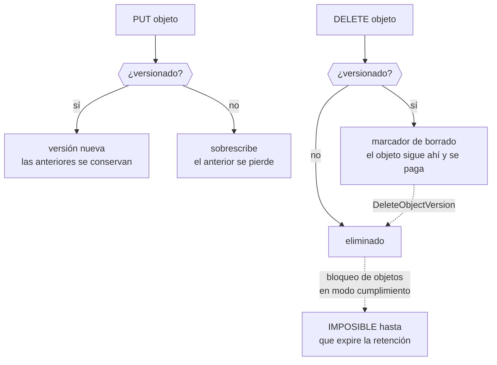

# 030 — S3: objetos, versionado, lifecycle y replicación

> [← Clase anterior](../../part-02-aws-core-platform/029-elastic-load-balancing-y-auto-scaling/README.md) · [Índice de la parte](../README.md) · [Clase siguiente →](../../part-02-aws-core-platform/031-rds-dynamodb-y-elasticache-decision-de-datos/README.md)

**Parte:** 02 — AWS: plataforma esencial<br>
**Nivel:** intermedio · **Horas estimadas:** 4<br>
**Laboratorio:** `storage` · **Estado:** `EXECUTABLE_CORE`

## 🎯 Propósito

Operar almacenamiento de objetos entendiendo qué garantiza y qué no. Los once nueves de durabilidad no protegen de un borrado autorizado —lo estableció la clase 010— y el modelo de acceso de S3 es el origen de una parte desproporcionada de las brechas públicas atribuidas a la nube. Aquí se convierte todo eso en configuración verificable.

## 📚 Resultados de aprendizaje

Al finalizar podrás:

1. **Explicar** por qué el versionado y el bloqueo de objetos son controles distintos y qué protege cada uno.
2. **Diseñar** una política de ciclo de vida que reduzca coste sin romper la recuperación ni el cumplimiento.
3. **Calcular** si una transición a una clase más fría ahorra, contando el mínimo de días y el coste de recuperación.
4. **Bloquear** el acceso público en todos los niveles y verificarlo con prueba negativa.
5. **Distinguir** replicación de copia de seguridad, y por qué la primera propaga los borrados.

## 🧩 Conceptos centrales

| Concepto | Comprensión verificable |
|---|---|
| `versionado` | Conservar todas las versiones de un objeto, incluidas las borradas mediante un marcador. Protege del error humano, pero no de quien tenga permiso para borrar versiones. |
| `bloqueo de objetos` | Retención inmutable que impide borrar o sobrescribir durante un periodo. En modo cumplimiento **ni siquiera la cuenta raíz puede saltárselo**, que es lo que lo hace útil frente a ransomware. |
| `clase de almacenamiento` | Perfil de coste y acceso: estándar, infrecuente, archivo. Las frías cobran menos por GB y añaden coste de recuperación, mínimos de duración y a veces latencia de horas. |
| `marcador de borrado` | Versión especial que oculta un objeto sin eliminarlo. Explica por qué un bucket versionado sigue creciendo y costando después de «vaciarlo». |
| `punto de acceso` | Endpoint con su propia política, asociado a un bucket. Permite dar permisos acotados por aplicación sin que la política del bucket crezca sin control. |

## 🧠 Modelo mental

Una cuenta AWS es una frontera de seguridad y facturación; los servicios se combinan mediante contratos, no como una lista de productos aislados.

Aplicado a esta clase, separa siempre cuatro planos: **intención** (qué necesita el usuario),
**configuración** (qué declaramos), **estado observado** (qué existe de verdad) y
**evidencia** (cómo sabemos que cumple). Confundirlos produce diseños que se ven correctos
en un diagrama pero fallan al operar.

## 🗺️ Flujo de razonamiento



## 📖 Desarrollo

### 1. Versionado y bloqueo protegen de cosas distintas

Se confunden y cubren riesgos que no se solapan:

| Riesgo | Versionado | Bloqueo de objetos |
|---|---|---|
| Sobrescritura accidental | ✓ | ✓ |
| Borrado accidental | ✓ | ✓ |
| **Borrado deliberado con permisos** | ✗ | ✓ |
| **Ransomware con credenciales válidas** | ✗ | ✓ |
| Corrupción por fallo de disco | ✓ (11 nueves) | ✓ |

Las dos filas centrales son la diferencia. Con versionado, quien tenga `s3:DeleteObjectVersion` borra todas las versiones y el objeto desaparece de verdad. El bloqueo en **modo cumplimiento** lo impide hasta que expire la retención, y no admite excepción para nadie —incluida la cuenta raíz—.

```bash
$ aws s3api put-object-lock-configuration --bucket cloudshop-facturas \
    --object-lock-configuration '{"ObjectLockEnabled":"Enabled",
      "Rule":{"DefaultRetention":{"Mode":"COMPLIANCE","Days":2555}}}'
```

Los dos modos no son intercambiables:

```text
GOVERNANCE  quien tenga s3:BypassGovernanceRetention puede saltárselo.
            Útil para protección operativa con escape controlado.
COMPLIANCE  nadie puede. Ni el administrador, ni la raíz, ni AWS.
            Es el único que protege frente a un atacante con permisos.
```

Y una advertencia que hay que entender antes de activarlo: **el modo cumplimiento no se puede reducir ni desactivar**. Un objeto con 7 años de retención ocupará y costará 7 años. Es exactamente lo que se quiere para evidencia legal y una trampa cara si se aplica por defecto a todo un bucket de datos operativos.

El bloqueo exige versionado activado y **solo puede habilitarse al crear el bucket**, o mediante una solicitud a soporte. Otra razón para decidirlo al principio.

### 2. El marcador de borrado explica la factura que no baja

En un bucket versionado, `DELETE` no borra: **crea un marcador** que oculta el objeto. Las versiones anteriores siguen ahí y siguen facturándose.

```bash
$ aws s3 rm s3://cloudshop-datos/informe.csv
delete: s3://cloudshop-datos/informe.csv
$ aws s3 ls s3://cloudshop-datos/informe.csv
# vacío: parece borrado
$ aws s3api list-object-versions --bucket cloudshop-datos --prefix informe.csv \
    --query '[Versions[].[Size,VersionId],DeleteMarkers[].VersionId]'
[[[4823901, "3HL4kqt..."]], ["Ktr5nQ..."]]
```

El objeto de 4,8 MB sigue existiendo y pagándose. En un bucket con años de operación, las versiones no vigentes pueden ser **la mayor parte del almacenamiento**:

```bash
$ aws s3api list-object-versions --bucket cloudshop-datos --output json \
  | jq '{vigentes: ([.Versions[]|select(.IsLatest)|.Size]|add),
         antiguas: ([.Versions[]|select(.IsLatest|not)|.Size]|add)}'
{"vigentes": 412000000000, "antiguas": 1840000000000}
```

**1,84 TB de versiones antiguas frente a 412 GB vigentes: el 82 % del coste es historial.**

La solución no es desactivar el versionado —se perdería la protección— sino caducar lo antiguo con ciclo de vida:

```json
{
  "Rules": [{
    "ID": "caducar-versiones-antiguas",
    "Status": "Enabled",
    "Filter": {"Prefix": ""},
    "NoncurrentVersionExpiration": {"NoncurrentDays": 90, "NewerNoncurrentVersions": 3},
    "Expiration": {"ExpiredObjectDeleteMarker": true},
    "AbortIncompleteMultipartUpload": {"DaysAfterInitiation": 7}
  }]
}
```

La última regla merece mención aparte: **las subidas multiparte abandonadas no aparecen en ningún listado normal y se facturan indefinidamente**. Es una partida invisible que en buckets con mucha escritura fallida puede alcanzar cientos de gigabytes.

### 3. Clases de almacenamiento: el ahorro que a veces no lo es

| Clase | USD/GB/mes | Recuperación | Mínimo | Latencia |
|---|---|---|---|---|
| Standard | 0,023 | 0 | — | ms |
| Intelligent-Tiering | 0,023 → 0,0125 | 0 | — | ms |
| Standard-IA | 0,0125 | 0,01 USD/GB | **30 días** | ms |
| Glacier Instant | 0,004 | 0,03 USD/GB | **90 días** | ms |
| Glacier Flexible | 0,0036 | 0,01-0,03 | **90 días** | min-horas |
| Deep Archive | 0,00099 | 0,02 USD/GB | **180 días** | 12 h |

Las dos columnas de la derecha son las que invalidan la mitad de las transiciones que se configuran:

**El mínimo de duración se factura completo.** Un objeto movido a Standard-IA y borrado a los 10 días paga 30. Para datos con vida corta, la transición cuesta más de lo que ahorra.

**La recuperación se cobra.** Si los datos se leen con frecuencia, el coste de acceso supera el ahorro de almacenamiento:

```text
1 TB en Standard:      1.024 × 0,023 = 23,55 USD/mes
1 TB en Standard-IA:   1.024 × 0,0125 = 12,80 USD/mes
ahorro bruto                          = 10,75 USD/mes

umbral de lecturas: 10,75 / 0,01 USD/GB = 1.075 GB/mes
→ si se lee más del 105 % del volumen al mes, Standard-IA sale MÁS CARO
```

Y hay un coste que se olvida: **la propia transición cuesta** unos 0,01 USD por cada 1.000 objetos. Con 40 millones de objetos pequeños, mover a otra clase cuesta 400 USD de una vez, y si los objetos son de 20 KB el ahorro mensual puede no compensarlo nunca.

De ahí que **Intelligent-Tiering** sea razonable cuando el patrón de acceso es desconocido: mueve automáticamente según el uso real, sin coste de recuperación, a cambio de una pequeña tarifa de monitorización por objeto que solo compensa con objetos mayores de 128 KB.

### 4. Bloquear el acceso público en todos los niveles

Las brechas de almacenamiento expuesto siguen ocurriendo porque hay **cuatro mecanismos independientes** que pueden conceder acceso público, y bloquear uno no bloquea los demás:

```text
1. ACL del bucket
2. ACL del objeto
3. Política del bucket
4. Política del punto de acceso
```

El bloqueo de acceso público los cubre todos, y debe aplicarse **a nivel de cuenta**, no solo de bucket:

```bash
$ aws s3control put-public-access-block --account-id 123456789012 \
    --public-access-block-configuration \
    'BlockPublicAcls=true,IgnorePublicAcls=true,BlockPublicPolicy=true,RestrictPublicBuckets=true'
```

Los cuatro parámetros hacen cosas distintas y hay que entender por qué son cuatro:

```text
BlockPublicAcls        impide CREAR ACL públicas nuevas
IgnorePublicAcls       IGNORA las ACL públicas que ya existan
BlockPublicPolicy      impide crear políticas públicas nuevas
RestrictPublicBuckets  bloquea el acceso a través de políticas ya existentes
```

Las de «crear» no arreglan lo que ya está mal; las de «ignorar» y «restringir» sí. Aplicar solo las dos primeras deja abierto lo que ya estaba abierto, que es exactamente el caso de la brecha de la clase 010.

La verificación **no puede ser por inspección**:

```bash
$ curl -s -o /dev/null -w '%{http_code}\n' https://cloudshop-facturas.s3.amazonaws.com/f-1042.pdf
403                                                    ✓ sin credenciales
$ aws s3api put-bucket-acl --bucket cloudshop-facturas --acl public-read
AccessDenied ... blocked by the public access block    ✓ no se puede abrir
$ aws s3api get-object --bucket cloudshop-facturas --key f-1042.pdf /dev/null
{"ContentLength": 48219}                               ✓ con credenciales sí
```

Las tres pruebas juntas: **niega sin credenciales, impide abrirlo, y permite el acceso legítimo**. Solo la primera no demuestra nada — el objeto podría estar simplemente mal nombrado.

### 5. Replicación no es copia de seguridad

La confusión es cara. La replicación copia cambios a otro bucket, y **un borrado es un cambio**:

```text
replicación   protege de: pérdida de una región, latencia de lectura lejana
              NO protege de: borrado, cifrado por ransomware, corrupción lógica
              porque propaga esas operaciones al destino

copia de seguridad  protege de: todo lo anterior
              porque es un punto en el tiempo aislado del origen
```

Hay un matiz importante: por defecto **la replicación no replica los borrados** —los marcadores de borrado no se replican salvo que se active `DeleteMarkerReplication`—. Eso da una protección parcial, pero no cubre el caso peligroso: si un atacante borra *versiones* con `DeleteObjectVersion`, esa operación sí se propaga.

La configuración que sí resiste:

```text
origen    versionado + bloqueo de objetos + política que deniega DeleteObjectVersion
destino   cuenta DISTINTA, con sus propias credenciales y su propio bloqueo
```

La cuenta distinta es la pieza decisiva, por lo visto en la clase 017: si el destino está en la misma cuenta, unas credenciales comprometidas alcanzan ambos. Con cuentas separadas, el atacante necesita comprometer dos.

Y como estableció la clase 019, nada de esto vale sin la prueba:

```bash
$ aws s3api list-object-versions --bucket cloudshop-backup --prefix f-1042.pdf \
    --query 'Versions[0].[VersionId,LastModified]' --output text
3sL9mQt...   2026-08-01T07:12:44Z
$ aws s3api get-object --bucket cloudshop-backup --key f-1042.pdf \
    --version-id 3sL9mQt... /tmp/r.pdf && sha256sum /tmp/r.pdf
```

Restaurar y **comparar la suma de comprobación** con el original. Que exista la copia no demuestra que sea recuperable ni que sea correcta.

## 🔬 Ejemplo trabajado

**Auditoría del almacenamiento de CloudShop: 2,25 TB facturados, un bucket con facturas de clientes y ninguna prueba de recuperación.**

**Hallazgo 1 — el 82 % del coste es historial invisible:**

```bash
$ aws s3api list-object-versions --bucket cloudshop-datos --output json \
  | jq '{vigentes:([.Versions[]|select(.IsLatest)|.Size]|add),
         antiguas:([.Versions[]|select(.IsLatest|not)|.Size]|add),
         marcadores:(.DeleteMarkers|length)}'
{"vigentes": 412000000000, "antiguas": 1840000000000, "marcadores": 28417}
```

```text
vigentes     412 GB ×  0,023 =  9,48 USD/mes
antiguas   1.840 GB ×  0,023 = 42,32 USD/mes   ← el 82 %
```

Se añaden subidas multiparte abandonadas, que no salían en ningún listado:

```bash
$ aws s3api list-multipart-uploads --bucket cloudshop-datos --query 'length(Uploads)'
1247
```

**1.247 subidas incompletas**, algunas de 2024, facturándose desde entonces.

Ciclo de vida aplicado:

```json
{"Rules":[{"ID":"limpieza","Status":"Enabled","Filter":{"Prefix":""},
  "NoncurrentVersionExpiration":{"NoncurrentDays":90,"NewerNoncurrentVersions":3},
  "Expiration":{"ExpiredObjectDeleteMarker":true},
  "AbortIncompleteMultipartUpload":{"DaysAfterInitiation":7}}]}
```

```text
almacenamiento tras 90 días:  412 GB vigentes + ~180 GB de historial reciente
coste            51,80 → 13,62 USD/mes   (−74 %)
```

**Hallazgo 2 — una transición configurada que costaba dinero.** El equipo había movido las miniaturas a Standard-IA:

```text
objetos           38.400.000 miniaturas de ~18 KB
volumen           691 GB
lecturas/mes      1.240 GB   (las miniaturas se leen constantemente)

Standard:     691 × 0,023                     = 15,89 USD/mes
Standard-IA:  691 × 0,0125 + 1.240 × 0,01     =  8,64 + 12,40 = 21,04 USD/mes
```

**La transición encarecía un 32 %.** Además, los objetos de 18 KB están por debajo del umbral de 128 KB, así que ni Intelligent-Tiering compensaría. Se devuelven a Standard.

**Hallazgo 3 — el bucket de facturas.**

```bash
$ aws s3api get-public-access-block --bucket cloudshop-facturas \
    --query 'PublicAccessBlockConfiguration' --output json
{"BlockPublicAcls": true, "IgnorePublicAcls": false,
 "BlockPublicPolicy": true, "RestrictPublicBuckets": false}
```

**Dos de cuatro.** Impide crear accesos públicos nuevos y **no restringe los que ya existen**. La política del bucket tenía un `Principal: "*"` de 2024, exactamente el caso de la clase 010.

```bash
$ curl -s -o /dev/null -w '%{http_code}\n' https://cloudshop-facturas.s3.amazonaws.com/f-1042.pdf
200                                                    ← accesible sin credenciales
```

Corrección en los cuatro parámetros y a nivel de cuenta:

```bash
$ aws s3control put-public-access-block --account-id 123456789012 \
    --public-access-block-configuration \
    'BlockPublicAcls=true,IgnorePublicAcls=true,BlockPublicPolicy=true,RestrictPublicBuckets=true'
$ curl -s -o /dev/null -w '%{http_code}\n' https://cloudshop-facturas.s3.amazonaws.com/f-1042.pdf
403                                                    ✓
$ aws s3api put-bucket-acl --bucket cloudshop-facturas --acl public-read
AccessDenied                                           ✓ no se puede reabrir
$ aws s3api get-object --bucket cloudshop-facturas --key f-1042.pdf /dev/null >/dev/null && echo ok
ok                                                     ✓ acceso legítimo intacto
```

Y se añade retención inmutable, que el versionado por sí solo no daba:

```text
bloqueo de objetos en modo cumplimiento, 2.555 días (7 años de retención legal)
réplica a bucket en cuenta distinta, con su propio bloqueo
restauración probada: objeto recuperado y sha256 idéntico al original  ✓
```

**Resultado:**

```text                                antes       después
coste de almacenamiento            67,69 USD    29,51 USD   (−56 %)
facturas accesibles sin credencial     sí          no
borrado de versiones posible           sí          no (cumplimiento)
restauración probada                   nunca      sí, con hash verificado
subidas abandonadas                   1.247          0
```

## 🧪 Laboratorio guiado

Ejecuta desde la raíz:

```bash
python classes/part-02-aws-core-platform/030-s3-objetos-versionado-lifecycle-y-replicacion/lab.py
```

El laboratorio selecciona el motor de práctica **`storage`** y produce
`lab_result.json`. El escenario, sus comprobaciones y el artefacto esperado corresponden a
esta clase; no requiere credenciales y deja explícito qué debe revalidarse en un sandbox real.

1. Lee `exercise.steps` y formula una predicción antes de ejecutar.
2. Ejecuta la práctica y verifica todos los elementos de `checks`.
3. Provoca el caso de `negative_test` y explica la señal observada.
4. Materializa `bucket-gobernado-aws` en `evidence/` usando la plantilla indicada.
5. Para proveedor real, sigue `sandbox.requires`, registra costo y ejecuta `destroy`.

### Evidencia esperada

El artefacto principal es una política de durabilidad, acceso, retención y costo. Además, la entrega debe incluir el comando ejecutado,
la salida estructurada y una conclusión que no exceda lo observado.

## 🏆 Reto verificable

Construye **`bucket-gobernado-aws`** para el caso CloudShop. Incluye una alternativa descartada,
un supuesto que pueda falsarse, una prueba de fallo y una decisión de rollback.

## ✅ Criterio de aceptación

- [ ] `lab.py` termina con código 0 y genera JSON válido.
- [ ] La entrega conecta al menos tres requisitos con mecanismos verificables.
- [ ] Existe una prueba positiva y una prueba negativa con evidencia.
- [ ] Seguridad, costo y operación aparecen como decisiones, no como anexos.
- [ ] Se declara una limitación y una condición que obligaría a revisar el diseño.
- [ ] Otra persona puede repetir el recorrido sin conocimiento tácito.

## ⚠️ Errores frecuentes

| Síntoma | Causa probable | Corrección |
|---|---|---|
| La factura de almacenamiento no baja después de borrar objetos | En un bucket versionado, DELETE crea un marcador y las versiones siguen facturándose | Ciclo de vida con `NoncurrentVersionExpiration` y limpieza de marcadores caducados. |
| Se factura almacenamiento que no aparece en ningún listado | Subidas multiparte abandonadas: invisibles en `s3 ls` y facturadas indefinidamente | Añade `AbortIncompleteMultipartUpload` al ciclo de vida. |
| Mover datos a una clase más fría encarece la factura | El coste de recuperación y el mínimo de duración superan el ahorro por GB | Calcula el umbral de lecturas; con acceso frecuente u objetos pequeños, la clase fría pierde. |
| Se activa el bloqueo de acceso público y el bucket sigue expuesto | Solo se activaron los parámetros de «crear», no los de «ignorar» y «restringir» | Activa los cuatro y a nivel de cuenta; verifica con petición sin credenciales. |
| Un borrado malicioso se propaga al bucket réplica | La replicación copia cambios, y borrar versiones es un cambio | Réplica en cuenta distinta con bloqueo de objetos propio; la replicación no sustituye a la copia de seguridad. |

## 🛡️ Seguridad, ética y costo

Trabaja con cuentas propias o sandboxes autorizados. No publiques secretos, identificadores
reales ni datos personales. Antes de crear recursos pagos define presupuesto, etiquetas y
comando de destrucción; después verifica que no queden recursos huérfanos. Los ejemplos
locales enseñan contratos, pero no certifican cumplimiento ni disponibilidad de producción.

## ❓ Preguntas de comprobación

1. ¿Qué riesgo cubre el bloqueo de objetos que el versionado no cubre, y por qué el modo cumplimiento es el único que sirve ahí?
2. Tras `aws s3 rm`, el objeto no aparece en el listado. ¿Se está pagando? Justifica.
3. 1 TB en Standard-IA se lee 1,5 TB al mes. ¿Ahorra frente a Standard? Haz el cálculo.
4. ¿Cuál de los cuatro parámetros de bloqueo público cierra un bucket que YA estaba expuesto?
5. ¿Por qué una réplica en la misma cuenta no protege de unas credenciales comprometidas?

## 🔗 Referencias

- AWS (2024). *Using versioning in S3 buckets* — versiones, marcadores de borrado y facturación. <https://docs.aws.amazon.com/AmazonS3/latest/userguide/Versioning.html>
- AWS (2024). *S3 Object Lock* — modos gobernanza y cumplimiento, y sus límites. <https://docs.aws.amazon.com/AmazonS3/latest/userguide/object-lock.html>
- AWS (2024). *Blocking public access to your Amazon S3 storage* — semántica de los cuatro parámetros. <https://docs.aws.amazon.com/AmazonS3/latest/userguide/access-control-block-public-access.html>
- AWS (2024). *Managing your storage lifecycle* — transiciones, mínimos de duración y limpieza de multiparte. <https://docs.aws.amazon.com/AmazonS3/latest/userguide/object-lifecycle-mgmt.html>
- AWS (2024). *S3 storage classes* — precios, latencias de recuperación y umbrales de tamaño. <https://docs.aws.amazon.com/AmazonS3/latest/userguide/storage-class-intro.html>
- Documentación oficial vigente del servicio implementado; registra URL y fecha de consulta.

---

> [Evaluación](assessment.md) · [Contrato de clase](lesson.yaml) · [Índice de la parte](../README.md)
