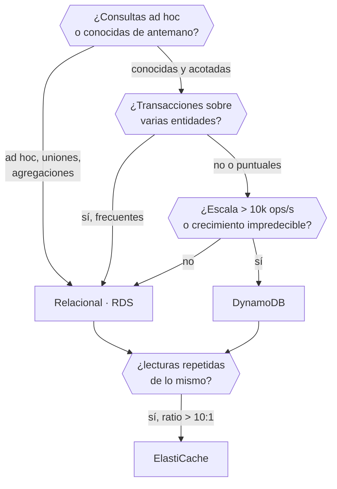

# 031 — RDS, DynamoDB y ElastiCache: decisión de datos

> [← Clase anterior](../../part-02-aws-core-platform/030-s3-objetos-versionado-lifecycle-y-replicacion/README.md) · [Índice de la parte](../README.md) · [Clase siguiente →](../../part-02-aws-core-platform/032-lambda-api-gateway-y-step-functions/README.md)

**Parte:** 02 — AWS: plataforma esencial<br>
**Nivel:** intermedio · **Horas estimadas:** 4<br>
**Laboratorio:** `data` · **Estado:** `EXECUTABLE_CORE`

## 🎯 Propósito

Elegir motor de datos a partir de los patrones de acceso, no del catálogo del proveedor. Es la decisión más irreversible de la parte —cambiar de motor con terabytes en producción es una migración, no un ajuste— y la que más determina el coste y la latencia del sistema durante años.

## 📚 Resultados de aprendizaje

Al finalizar podrás:

1. **Derivar** el modelo de datos desde los patrones de acceso en lugar de normalizar primero y consultar después.
2. **Distinguir** cuándo una carga necesita transacciones multiclave y cuándo no, con consecuencias de elección.
3. **Dimensionar** capacidad en DynamoDB y detectar una clave de partición mal elegida antes de que sature.
4. **Justificar** una caché por el patrón de lectura y explicar sus dos modos de invalidación.
5. **Calcular** el coste de las tres opciones para una carga concreta y no solo su idoneidad técnica.

## 🧩 Conceptos centrales

| Concepto | Comprensión verificable |
|---|---|
| `patrón de acceso` | Consulta concreta que la aplicación hará, con su frecuencia y su latencia exigida. En almacenes no relacionales es la entrada del diseño; enumerarlos mal produce un modelo que no se puede consultar. |
| `clave de partición` | Atributo que determina en qué partición física vive un elemento. Una clave con pocos valores distintos concentra el tráfico en pocas particiones y produce una partición caliente. |
| `partición caliente` | Partición que recibe una fracción desproporcionada del tráfico y satura antes que el resto. Se manifiesta como limitación de tasa mientras la capacidad agregada parece sobrada. |
| `índice secundario global` | Proyección de una tabla con otra clave, que permite consultas por atributos distintos. Tiene su propia capacidad y se actualiza de forma asíncrona: es coherente en último término. |
| `invalidación de caché` | Mecanismo para que la copia deje de servirse cuando el origen cambia. Los dos modos —caducidad y escritura activa— tienen fallos distintos: datos obsoletos frente a complejidad y acoplamiento. |

## 🧠 Modelo mental

Una cuenta AWS es una frontera de seguridad y facturación; los servicios se combinan mediante contratos, no como una lista de productos aislados.

Aplicado a esta clase, separa siempre cuatro planos: **intención** (qué necesita el usuario),
**configuración** (qué declaramos), **estado observado** (qué existe de verdad) y
**evidencia** (cómo sabemos que cumple). Confundirlos produce diseños que se ven correctos
en un diagrama pero fallan al operar.

## 🗺️ Flujo de razonamiento



## 📖 Desarrollo

### 1. Los patrones de acceso van primero

En un motor relacional se normaliza el modelo y después se consulta como haga falta: el optimizador se encarga. En un almacén de clave-valor no hay optimizador, así que **el modelo debe derivarse de las consultas**.

La disciplina es enumerar los patrones antes de diseñar nada:

```text
P1  obtener un pedido por su id                        12.000/min   < 10 ms
P2  listar los pedidos de un cliente, más recientes     3.400/min   < 30 ms
P3  listar los pedidos de un estado en una fecha           40/min   < 2 s
P4  total facturado por mes                                 2/día   < 30 s
```

Con esa lista, la elección se decide sola:

- **P1 y P2** son consultas por clave conocida: un almacén de clave-valor las sirve con latencia de un dígito de milisegundos y escala sin límite práctico.
- **P3** necesita un índice secundario.
- **P4** es una agregación analítica: no pertenece al almacén operativo, y forzarla ahí degrada P1 y P2.

El error clásico es diseñar el modelo relacional primero, migrarlo tal cual a un almacén no relacional y descubrir que P2 requiere escanear la tabla entera. **Un escaneo completo en un almacén de clave-valor no es una consulta lenta: es una consulta que cuesta dinero proporcional al tamaño y que empeora cada mes.**

Y el criterio inverso también aplica: si los patrones de acceso **no se pueden enumerar** —porque el negocio hace preguntas nuevas cada semana—, un motor relacional es la elección correcta, y no una concesión.

### 2. Transacciones: qué se pierde y qué cuesta recuperarlo

Un motor relacional da atomicidad sobre varias tablas con una sola sentencia. En un almacén de clave-valor eso existe pero con límites duros que hay que conocer antes de diseñar:

```text
DynamoDB TransactWriteItems:
  hasta 100 elementos por transacción
  máximo 4 MB en total
  consume el DOBLE de capacidad de escritura
  no puede abarcar regiones
```

La consecuencia de diseño: **si la operación central del negocio toca cinco entidades y ocurre miles de veces por segundo, el coste doble y el límite de 100 elementos importan**. Si ocurre decenas de veces por minuto, no.

La alternativa cuando la transacción no cabe es el patrón de saga: descomponer en pasos con compensación. No es gratis:

```text
transacción     todo o nada, garantizado por el motor
saga            pasos independientes con compensación explícita
                → hay estados intermedios visibles
                → la compensación puede fallar y hay que reintentarla
                → el código de compensación se ejercita poco y suele estar mal probado
```

La regla práctica: **elegir saga por diseño, no por descubrir tarde que la transacción no cabía**. Un sistema que necesita compensación en su camino principal está pagando complejidad permanente por una decisión de motor.

Y una precisión sobre consistencia: DynamoDB ofrece lectura fuertemente consistente en la tabla base —cuesta el doble de capacidad de lectura— pero **los índices secundarios globales son siempre coherentes en último término**. Una escritura seguida de una consulta por índice puede no ver el cambio. Ese retraso es de milisegundos en régimen normal y puede crecer bajo carga.

### 3. La clave de partición decide si escala

DynamoDB reparte los datos por el hash de la clave de partición. Una clave con pocos valores distintos concentra el tráfico:

```text
clave = estado_pedido    (5 valores: nuevo, pagado, enviado, entregado, cancelado)
  → 5 particiones lógicas para toda la tabla
  → el 80 % del tráfico va a "nuevo"
  → esa partición satura mientras la capacidad agregada parece sobrada
```

El síntoma es característico y desconcierta: `ProvisionedThroughputExceededException` con la capacidad global muy por debajo del límite. La partición está limitada a **3.000 unidades de lectura y 1.000 de escritura por segundo**, sea cual sea la capacidad total de la tabla.

Una clave adecuada tiene alta cardinalidad y reparto uniforme:

```text
clave = pedido_id (UUID)          → millones de valores, reparto uniforme  ✓
clave = cliente_id                → miles de valores, pero un cliente grande
                                    puede concentrar tráfico              ~
clave = fecha (2026-08-01)        → todo el tráfico del día en una         ✗
```

El segundo caso es el más traicionero: funciona en pruebas y falla cuando un cliente crece. La mitigación es **añadir sufijo de dispersión**:

```text
clave = f"{cliente_id}#{hash(pedido_id) % 10}"
  → reparte cada cliente en 10 particiones
  → coste: consultar todos los pedidos de un cliente exige 10 consultas
```

Es un intercambio explícito: se gana reparto y se pierde simplicidad de consulta. Como todo en esta clase, la decisión debe estar escrita.

Y el modo **bajo demanda** no elimina el problema: escala automáticamente la capacidad total, pero el límite por partición sigue existiendo. Una clave mal elegida satura igual, solo que la factura crece antes de que se note.

### 4. Caché: cuándo aporta y cómo se invalida

Una caché solo aporta si el mismo dato se lee muchas más veces de las que se escribe. El indicador es la relación lectura-escritura:

```text
ratio < 3:1     la caché añade complejidad y poco beneficio
ratio 10:1      empieza a compensar
ratio > 100:1   claramente rentable
```

Y el ahorro se calcula, no se supone:

```text
lecturas/mes                    840.000.000
tasa de acierto medida                 92 %
lecturas evitadas al origen     772.800.000
coste evitado (0,25 USD por millón de lecturas fuertes) = 193 USD/mes
coste de la caché (cache.r7g.large × 2)                 = 208 USD/mes
```

**No compensa por coste con esos números**; compensa por **latencia**, que es otra justificación válida y que hay que declarar como tal:

```text
latencia desde el origen    8-12 ms
latencia desde la caché    0,3-0,8 ms
```

Los dos modos de invalidación tienen fallos distintos:

| Modo | Cómo | Fallo característico |
|---|---|---|
| **Caducidad** | TTL fijo; se relee al expirar | Datos obsoletos hasta el TTL |
| **Escritura activa** | La escritura actualiza caché y origen | Se desincroniza si una de las dos falla |

El segundo parece mejor y acopla la escritura a la disponibilidad de la caché. Si la caché no responde, ¿falla la escritura o se queda desincronizada? Ninguna respuesta es buena, y por eso **la caducidad suele ser preferible salvo que la obsolescencia sea inaceptable**.

Hay un tercer fallo que afecta a ambos, la **estampida**: cuando una clave muy consultada caduca, todas las peticiones simultáneas van al origen a la vez. Se mitiga con bloqueo de recálculo o con caducidad aleatorizada —el mismo jitter de la clase 004—.

### 5. El coste también decide, y a veces al revés

Comparar motores solo por idoneidad técnica lleva a decisiones caras. Los tres modelos de precio son estructuralmente distintos:

```text
RDS         por hora de instancia + almacenamiento + E/S
            → coste fijo, predecible, independiente del tráfico

DynamoDB    por unidades de lectura y escritura consumidas + almacenamiento
            → coste proporcional al tráfico, cero si no hay uso

ElastiCache por hora de nodo
            → coste fijo
```

Para una carga con tráfico muy variable, DynamoDB bajo demanda puede ser mucho más barato:

```text
carga con 2 horas de pico al día y el resto casi inactiva
RDS db.r6g.xlarge Multi-AZ:   730 h × 0,96 USD          = 700,80 USD/mes
DynamoDB bajo demanda:
  escrituras 42 M × 1,25 USD/millón                     =  52,50
  lecturas  310 M × 0,25 USD/millón                     =  77,50
  almacenamiento 180 GB × 0,25                          =  45,00
                                                          --------
                                                          175,00 USD/mes
```

Pero con tráfico alto y sostenido se invierte:

```text
tráfico sostenido de 4.000 escrituras/s
DynamoDB bajo demanda: 10.368 M escrituras × 1,25/millón = 12.960 USD/mes
DynamoDB aprovisionado con autoescalado                  ≈  2.600 USD/mes
RDS db.r6g.4xlarge Multi-AZ                              ≈  2.800 USD/mes
```

**Bajo demanda cuesta cinco veces más que aprovisionado con tráfico predecible.** La regla: bajo demanda para tráfico variable o desconocido; aprovisionado con autoescalado cuando el patrón se estabiliza.

Y una partida que se olvida: en RDS, **la E/S se factura aparte** en algunas clases de almacenamiento. Una consulta sin índice que escanea millones de filas no solo es lenta: aparece en la factura.

## 🔬 Ejemplo trabajado

**CloudShop tiene los pedidos en RDS PostgreSQL. La tabla ha llegado a 180 GB, el p95 de la consulta principal es de 340 ms y la factura de base de datos es de 4.900 USD/mes.** Se evalúa el cambio.

Primero, los patrones de acceso reales, medidos en 30 días:

```sql
SELECT queryid, calls, mean_exec_time, rows
FROM pg_stat_statements ORDER BY calls DESC LIMIT 4;
```

```text                                          llamadas/día   media    filas
P1  SELECT * FROM pedidos WHERE id = $1          17.280.000    2,1 ms      1
P2  SELECT * FROM pedidos WHERE cliente_id = $1
      ORDER BY creado DESC LIMIT 20               4.896.000  312,0 ms     20
P3  SELECT * FROM pedidos WHERE estado=$1
      AND creado > $2                                57.600  890,0 ms  ~4000
P4  agregación mensual por mes                           60  8.400 ms      1
```

**P2 domina el problema**: 4,9 millones de llamadas diarias a 312 ms. Antes de cambiar de motor se comprueba si es un problema de índice:

```sql
EXPLAIN (ANALYZE, BUFFERS) SELECT * FROM pedidos
  WHERE cliente_id = 8241 ORDER BY creado DESC LIMIT 20;
```

```text
Index Scan using idx_pedidos_cliente on pedidos  (cost=0.56..18402.11)
  Rows Removed by Filter: 0
  Buffers: shared hit=142 read=8891           ← 8.891 bloques de disco
  Execution Time: 309.442 ms
```

El índice existe pero **es solo sobre `cliente_id`**: PostgreSQL lo usa para filtrar y después ordena 12.400 filas para devolver 20. Se prueba un índice compuesto:

```sql
CREATE INDEX CONCURRENTLY idx_pedidos_cliente_creado
  ON pedidos (cliente_id, creado DESC);
```

```text
Execution Time: 1.284 ms      ← de 312 ms a 1,3 ms
Buffers: shared hit=24 read=0
```

**Un índice compuesto resolvió el 96 % del problema.** El motor no era el problema: el modelo de índices sí.

Se reevalúa la situación con ese dato:

```text                     antes         tras el índice
p95 global                340 ms          38 ms
E/S facturada          1,2 TB/mes      0,18 TB/mes
coste                 4.900 USD       4.130 USD
```

Ahora sí se compara con la alternativa, con los patrones ya optimizados:

```text                              RDS (con índice)   DynamoDB
P1 por id                              2,1 ms            3 ms
P2 por cliente, ordenado               1,3 ms            4 ms   (clave compuesta)
P3 por estado y fecha                 890 ms           GSI, ~40 ms
P4 agregación mensual                8.400 ms          NO SOPORTADO
transacciones multiclave                 sí             límite 100 elementos
coste mensual estimado             4.130 USD         1.980 USD
migración                                —          ~3 meses + reescritura
```

**P4 es el bloqueo**: la agregación mensual no existe en DynamoDB sin exportar a otro sistema. Y la migración cuesta tres meses para ahorrar 2.150 USD al mes, con recuperación en 4 meses de trabajo de dos personas.

**Decisión: quedarse en RDS.** Se añaden dos mejoras acotadas:

```text
1. Caché para P1, que es el 78 % del tráfico
   ratio lectura/escritura medido: 47:1  → compensa
   tasa de acierto esperada 90 %
   latencia 2,1 ms → 0,4 ms
   coste: +104 USD/mes

2. P4 a una réplica de lectura, para que la agregación de 8,4 s
   deje de competir con el tráfico operativo
   coste: +380 USD/mes
```

```text                          inicial    final
p95                            340 ms     31 ms
coste                        4.900 USD  4.614 USD
esfuerzo                         —       2 días
```

**La lección: se estaba evaluando un cambio de motor de tres meses para resolver un problema que era un índice mal definido.** El análisis de patrones de acceso —que se hizo para elegir motor— acabó descartando el cambio.

## 🧪 Laboratorio guiado

Ejecuta desde la raíz:

```bash
python classes/part-02-aws-core-platform/031-rds-dynamodb-y-elasticache-decision-de-datos/lab.py
```

El laboratorio selecciona el motor de práctica **`data`** y produce
`lab_result.json`. El escenario, sus comprobaciones y el artefacto esperado corresponden a
esta clase; no requiere credenciales y deja explícito qué debe revalidarse en un sandbox real.

1. Lee `exercise.steps` y formula una predicción antes de ejecutar.
2. Ejecuta la práctica y verifica todos los elementos de `checks`.
3. Provoca el caso de `negative_test` y explica la señal observada.
4. Materializa `matriz-datos-aws` en `evidence/` usando la plantilla indicada.
5. Para proveedor real, sigue `sandbox.requires`, registra costo y ejecuta `destroy`.

### Evidencia esperada

El artefacto principal es un modelo de datos ligado a patrones de acceso. Además, la entrega debe incluir el comando ejecutado,
la salida estructurada y una conclusión que no exceda lo observado.

## 🏆 Reto verificable

Construye **`matriz-datos-aws`** para el caso CloudShop. Incluye una alternativa descartada,
un supuesto que pueda falsarse, una prueba de fallo y una decisión de rollback.

## ✅ Criterio de aceptación

- [ ] `lab.py` termina con código 0 y genera JSON válido.
- [ ] La entrega conecta al menos tres requisitos con mecanismos verificables.
- [ ] Existe una prueba positiva y una prueba negativa con evidencia.
- [ ] Seguridad, costo y operación aparecen como decisiones, no como anexos.
- [ ] Se declara una limitación y una condición que obligaría a revisar el diseño.
- [ ] Otra persona puede repetir el recorrido sin conocimiento tácito.

## ⚠️ Errores frecuentes

| Síntoma | Causa probable | Corrección |
|---|---|---|
| Una consulta usa el índice y aun así tarda cientos de milisegundos | El índice filtra pero no cubre el orden, así que el motor ordena miles de filas | Índice compuesto que incluya las columnas de ordenación; comprueba con EXPLAIN ANALYZE y los bloques leídos. |
| DynamoDB limita la tasa con la capacidad global muy por debajo del límite | Partición caliente: la clave tiene poca cardinalidad o un valor concentra el tráfico | Elige una clave de alta cardinalidad o añade sufijo de dispersión, asumiendo el coste de consulta múltiple. |
| Una escritura seguida de consulta por índice secundario no ve el cambio | Los índices secundarios globales son coherentes en último término | Consulta la tabla base cuando necesites leer lo que acabas de escribir. |
| El coste de DynamoDB se dispara al estabilizarse el tráfico | Bajo demanda cuesta varias veces más que aprovisionado con carga predecible | Cambia a aprovisionado con autoescalado en cuanto el patrón sea estable. |
| Al caducar una clave muy consultada, el origen recibe una avalancha | Estampida de caché: todas las peticiones recalculan a la vez | Caducidad aleatorizada o bloqueo de recálculo, igual que el jitter en los reintentos. |

## 🛡️ Seguridad, ética y costo

Trabaja con cuentas propias o sandboxes autorizados. No publiques secretos, identificadores
reales ni datos personales. Antes de crear recursos pagos define presupuesto, etiquetas y
comando de destrucción; después verifica que no queden recursos huérfanos. Los ejemplos
locales enseñan contratos, pero no certifican cumplimiento ni disponibilidad de producción.

## ❓ Preguntas de comprobación

1. ¿Por qué en un almacén de clave-valor los patrones de acceso van antes que el modelo, y qué pasa si se invierte el orden?
2. Una tabla tiene la clave de partición `fecha`. ¿Qué ocurrirá y por qué el modo bajo demanda no lo resuelve?
3. ¿Qué le cuesta a una transacción de DynamoDB en capacidad, y cuál es su límite de elementos?
4. Con ratio lectura/escritura de 3:1, ¿conviene una caché? ¿Y qué otra justificación podría hacerla válida igualmente?
5. ¿En qué caso bajo demanda es cinco veces más caro que aprovisionado, y por qué?

## 🔗 Referencias

- AWS (2024). *DynamoDB best practices: partition key design* — cardinalidad, particiones calientes y dispersión. <https://docs.aws.amazon.com/amazondynamodb/latest/developerguide/bp-partition-key-design.html>
- AWS (2024). *DynamoDB transactions* — límites de elementos, tamaño y consumo de capacidad. <https://docs.aws.amazon.com/amazondynamodb/latest/developerguide/transaction-apis.html>
- Kleppmann, M. (2017). *Designing Data-Intensive Applications*, caps. 2-3 — modelos de datos, índices y motores de almacenamiento.
- PostgreSQL (2024). *Using EXPLAIN* — lectura de planes y coste de E/S. <https://www.postgresql.org/docs/current/using-explain.html>
- AWS (2024). *ElastiCache caching strategies* — caducidad, escritura activa y mitigación de estampidas. <https://docs.aws.amazon.com/AmazonElastiCache/latest/dg/Strategies.html>
- Documentación oficial vigente del servicio implementado; registra URL y fecha de consulta.

---

> [Evaluación](assessment.md) · [Contrato de clase](lesson.yaml) · [Índice de la parte](../README.md)
