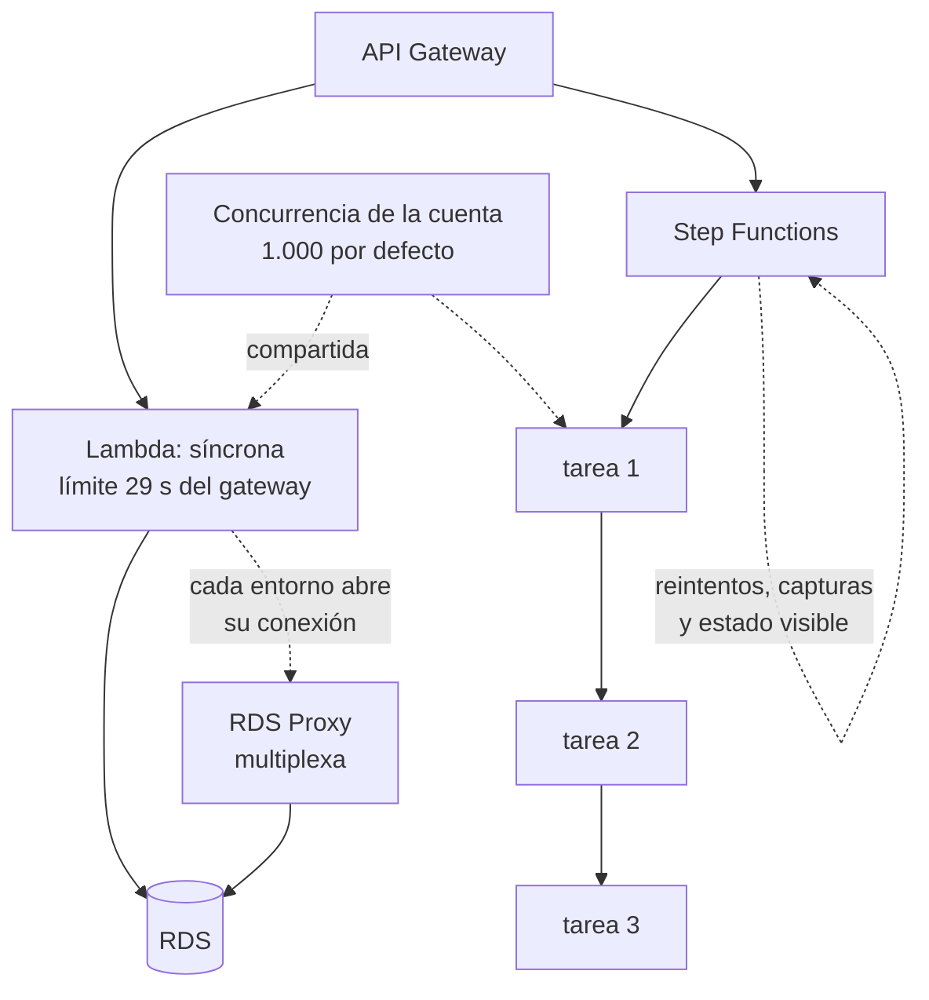

# 032 — Lambda, API Gateway y Step Functions

> [← 031 · RDS, DynamoDB y ElastiCache: decisión de datos](../../part-02-aws-core-platform/031-rds-dynamodb-y-elasticache-decision-de-datos/README.md) · [Índice de la parte](../README.md) · [033 · SQS, SNS y EventBridge →](../../part-02-aws-core-platform/033-sqs-sns-y-eventbridge/README.md)

**Parte:** 02 — AWS: plataforma esencial<br>
**Nivel:** intermedio · **Horas estimadas:** 4<br>
**Laboratorio:** `serverless` · **Estado:** `EXECUTABLE_CORE`

## 🎯 Propósito

Construir una API serverless sabiendo dónde están sus límites duros y cuáles son negociables. La clase 015 dio el criterio para elegir el modelo; aquí se aplica a AWS y se añade lo que decide si funciona en producción: la concurrencia como recurso compartido de la cuenta, el arranque en frío frente al percentil del SLO, y por qué una función que llama a una base relacional agota sus conexiones.

## 📚 Resultados de aprendizaje

Al finalizar podrás:

1. **Calcular** la concurrencia que consumirá una función a partir de su tasa de invocación y su duración.
2. **Anticipar** el efecto de una función que agota la concurrencia de la cuenta sobre las demás.
3. **Decidir** entre concurrencia aprovisionada y optimización del paquete según el percentil del SLO.
4. **Resolver** el agotamiento de conexiones al llamar a una base de datos relacional desde funciones.
5. **Elegir** entre orquestación con máquina de estados y coreografía por eventos según trazabilidad y acoplamiento.

## 🧩 Conceptos centrales

| Concepto | Comprensión verificable |
|---|---|
| `concurrencia` | Invocaciones ejecutándose simultáneamente. Es el recurso limitado de Lambda y se comparte entre todas las funciones de la cuenta y región: 1.000 por defecto. |
| `concurrencia reservada` | Porción de la concurrencia de la cuenta apartada para una función. Actúa a la vez como garantía —nadie se la quita— y como techo —no puede superarla—. |
| `concurrencia aprovisionada` | Entornos inicializados y mantenidos calientes. Elimina el arranque en frío y elimina también el ahorro de escalar a cero: se paga aunque no se invoque. |
| `proxy de conexiones` | Capa que multiplexa conexiones hacia una base de datos relacional. Resuelve que cada entorno de ejecución abra la suya y agote el límite del motor. |
| `máquina de estados` | Orquestador que define el flujo de forma explícita, con reintentos, capturas y estado visible. Se opone a la coreografía, donde cada componente reacciona a eventos sin visión global. |

## 🧠 Modelo mental

Una cuenta AWS es una frontera de seguridad y facturación; los servicios se combinan mediante contratos, no como una lista de productos aislados.

Aplicado a esta clase, separa siempre cuatro planos: **intención** (qué necesita el usuario),
**configuración** (qué declaramos), **estado observado** (qué existe de verdad) y
**evidencia** (cómo sabemos que cumple). Confundirlos produce diseños que se ven correctos
en un diagrama pero fallan al operar.

## 🗺️ Flujo de razonamiento



## 📖 Desarrollo

### 1. La concurrencia es el recurso que se agota, no la CPU

Lambda no escala por CPU ni por memoria: escala creando entornos de ejecución. El número de entornos simultáneos es la **concurrencia**, y se calcula con la ley de Little de la clase 011:

```text
concurrencia = invocaciones por segundo × duración en segundos
```

```text
800 inv/s × 0,250 s = 200 concurrentes
```

El límite por defecto es **1.000 por cuenta y región**, compartido entre todas las funciones. De ahí el modo de fallo más desconcertante del modelo:

```text
función A: procesamiento por lotes, 900 concurrentes durante 10 minutos
función B: API de pagos, necesita 120
→ B recibe TooManyRequestsException y devuelve 429 a los usuarios
→ B no cambió, no tiene errores, y su código está perfecto
```

Es exactamente el problema de vecino ruidoso de la clase 017, dentro de la misma cuenta. Y la solución es la misma: **acotar**.

```bash
# Techo para el proceso por lotes: no puede consumir más de 200
$ aws lambda put-function-concurrency --function-name lotes --reserved-concurrent-executions 200
# Garantía para la API crítica: 300 apartados, nadie se los quita
$ aws lambda put-function-concurrency --function-name pagos-api --reserved-concurrent-executions 300
```

La concurrencia reservada tiene un doble filo que hay que entender: **es garantía y es techo**. La función con 300 reservados nunca bajará de 300 disponibles y **nunca pasará de 300**, aunque el resto de la cuenta esté ocioso. Reservar de menos convierte la protección en una limitación.

Y hay un límite adicional sobre el ritmo de crecimiento: la concurrencia sube en incrementos de 1.000 por minuto por región tras la ráfaga inicial. Un pico que necesite 5.000 concurrentes en 30 segundos **no se puede absorber escalando**, igual que en la clase 016.

### 2. Arranque en frío: comparar con el percentil del SLO

La pregunta útil no es «¿hay arranque en frío?» sino «¿qué fracción de invocaciones lo sufre y dónde cae el percentil de mi SLO?».

```text
invocaciones/mes         2.000.000
arranques en frío           12.000   → 0,6 %
latencia p50 en caliente        45 ms
latencia en frío               820 ms

SLO al p95  → el 0,6 % no lo alcanza; el p95 sigue siendo ~90 ms   ✓
SLO al p99  → el 0,6 % está dentro del 1 % peor; el p99 ES el frío  ✗
```

Factores que determinan la latencia de arranque, por impacto:

```text
tamaño del paquete       250 MB descomprimido tarda mucho más que 5 MB
runtime                  JVM y .NET inicializan máquina virtual
inicialización propia    conexiones, carga de configuración, SDK
```

La inicialización propia es la más controlable y la peor aprovechada. El código fuera del manejador se ejecuta **una vez por entorno**, no por invocación:

```python
# Fuera del manejador: se paga una vez por entorno
import boto3
cliente = boto3.client("dynamodb")      # reutilizado en invocaciones siguientes
config = cargar_configuracion()

def handler(event, context):
    return cliente.get_item(...)         # sin coste de inicialización
```

Ponerlo dentro del manejador multiplica el coste por cada invocación, no solo por cada arranque.

La **concurrencia aprovisionada** elimina el frío y cambia la economía por completo:

```text
10 entornos aprovisionados de 512 MB:
  10 × 0,5 GB × 730 h × 0,0000097222 USD/GB-s × 3600 = 127,80 USD/mes
  se paga estén o no invocándose
```

Con eso, el cálculo de la clase 015 cambia: ya no se escala a cero, así que el umbral frente a un contenedor permanente se desplaza a favor del contenedor.

### 3. Funciones y bases de datos relacionales: el choque de modelos

Una función escala a cientos de entornos y **cada entorno abre su propia conexión**. Un motor relacional tiene un límite de conexiones muy inferior:

```text
concurrencia de la función       400 entornos
conexiones por entorno             1
max_connections de la instancia  200      ← se agota al 50 % de la concurrencia
```

El síntoma: `FATAL: sorry, too many clients already`. Y no se arregla subiendo `max_connections`, porque cada conexión de PostgreSQL consume memoria del servidor y a partir de cierto punto degrada el motor entero.

Las tres respuestas, de peor a mejor:

```text
1. Reservar concurrencia por debajo del límite de conexiones
   → funciona y desperdicia la elasticidad que motivó usar funciones

2. Cerrar la conexión al final de cada invocación
   → añade el coste de establecerla a cada llamada (decenas de ms)

3. Proxy de conexiones
   → multiplexa: 400 entornos comparten un pool de 50 conexiones reales
```

La tercera es la correcta, y tiene un matiz que decide si funciona: el proxy **solo puede reutilizar conexiones si la sesión no tiene estado**. Una transacción abierta, una tabla temporal o una variable de sesión fuerzan a fijar la conexión a ese cliente hasta que termine, y con suficientes clientes fijados el pool se agota igual.

```text
sin estado de sesión   reutilización alta, el proxy cumple su función
con transacciones largas  fijación de conexión, el proxy no ayuda
```

Y una alternativa estructural: **si la carga es de funciones, un almacén de clave-valor encaja mejor que uno relacional**, porque su modelo de acceso es sin conexión persistente. Es la decisión de la clase 031 vista desde el otro lado.

### 4. Los límites del gateway y cómo se rodean

API Gateway impone restricciones que no dependen de Lambda y que hay que conocer antes de diseñar:

| Límite | Valor | Negociable |
|---|---|---|
| Tiempo de espera de integración | **29 s** | No |
| Tamaño de carga útil | 10 MB | No |
| Peticiones por segundo | 10.000 por región | Sí, con solicitud |
| Ráfaga | 5.000 | Sí |

Los dos primeros son duros y determinan la arquitectura:

**29 segundos** es menos que los 15 minutos de Lambda. Una función que tarda 2 minutos funciona invocada directamente y **falla siempre** a través del gateway. El patrón correcto es asíncrono:

```text
POST /informes  → 202 Accepted, devuelve id de trabajo
                  encola el trabajo
GET /informes/{id} → 200 con estado, o 303 al resultado cuando termina
```

**10 MB de carga útil** hace inviable subir ficheros grandes por la API. La solución es no pasarlos por ella:

```text
POST /subidas   → devuelve una URL prefirmada de S3
cliente         → sube directamente a S3, sin límite del gateway
S3              → emite evento que dispara el procesamiento
```

Esto además ahorra dinero: los bytes no atraviesan el gateway ni la función.

Y una decisión que se toma al principio y cuesta cambiar: **HTTP API frente a REST API**. La primera cuesta aproximadamente un 70 % menos y tiene menos funciones —sin planes de uso, sin caché, sin validación de solicitud—. Empezar por REST API «por si acaso» es una de las formas más comunes de pagar de más sin usar nada de lo que se paga.

### 5. Orquestación frente a coreografía

Un flujo de varios pasos se puede construir de dos formas, y la elección determina cuánto cuesta diagnosticar un fallo:

| | Orquestación (máquina de estados) | Coreografía (eventos) |
|---|---|---|
| Flujo | Explícito en un sitio | Emergente, repartido |
| Estado | Visible y consultable | Hay que reconstruirlo |
| Reintentos y compensación | Declarativos | En cada componente |
| Acoplamiento | Mayor: el orquestador conoce los pasos | Menor |
| Diagnóstico | Se ve dónde falló | Hay que correlacionar trazas |
| Coste | Por transición de estado | Por evento |

La orquestación se declara y el motor se encarga de reintentar:

```json
{
  "Type": "Task",
  "Resource": "arn:aws:lambda:...:function:cobrar",
  "Retry": [{
    "ErrorEquals": ["States.TaskFailed"],
    "IntervalSeconds": 2, "MaxAttempts": 3, "BackoffRate": 2.0
  }],
  "Catch": [{"ErrorEquals": ["States.ALL"], "Next": "CompensarReserva"}]
}
```

Esas nueve líneas sustituyen a código de reintento con retroceso exponencial repartido por varios servicios, y —más importante— **hacen visible la compensación**, que en coreografía suele estar implícita y sin probar.

El criterio práctico:

```text
orquestación   flujos de negocio con compensación, pasos con orden,
               necesidad de auditar dónde quedó cada ejecución
coreografía    reacciones independientes, muchos consumidores del mismo hecho,
               equipos que no deben coordinarse para añadir un consumidor
```

Y sobre coste: Step Functions Standard cobra por transición de estado, lo que en flujos muy repetitivos se acumula. El modo **Express** cuesta por duración y es mucho más barato para flujos cortos de alto volumen, a cambio de garantía «al menos una vez» en vez de «exactamente una vez» —lo que exige idempotencia en los pasos, como en la clase 009—.

## 🔬 Ejemplo trabajado

**La API de pagos de CloudShop empieza a devolver 429 sin que su tráfico haya cambiado, y en el mismo día aparecen errores de conexión contra la base de datos.**

**Síntoma 1 — 429 sin cambio de tráfico:**

```bash
$ aws cloudwatch get-metric-statistics --namespace AWS/Lambda \
    --metric-name Throttles --dimensions Name=FunctionName,Value=pagos-api \
    --start-time 2026-08-01T09:00:00Z --end-time 2026-08-01T12:00:00Z \
    --period 300 --statistics Sum --query 'sum(Datapoints[].Sum)'
8412.0
$ aws lambda get-account-settings --query 'AccountLimit.ConcurrentExecutions'
1000
```

Se busca quién consume la concurrencia:

```bash
$ for f in pagos-api catalogo informes-lotes notificaciones; do
    printf "%-18s " $f
    aws cloudwatch get-metric-statistics --namespace AWS/Lambda \
      --metric-name ConcurrentExecutions --dimensions Name=FunctionName,Value=$f \
      --start-time 2026-08-01T10:00:00Z --end-time 2026-08-01T11:00:00Z \
      --period 3600 --statistics Maximum --query 'Datapoints[0].Maximum'
  done
pagos-api          118.0
catalogo            94.0
informes-lotes     742.0        ← 
notificaciones      46.0
```

**`informes-lotes` consume 742 de los 1.000.** Se lanzó un reproceso histórico esa mañana. La API de pagos no cambió: se quedó sin sitio.

Verificación con la ley de Little de lo que cada una necesita:

```text
pagos-api      340 inv/s × 0,32 s = 109 concurrentes → observado 118  ✓
informes-lotes  62 inv/s × 12,0 s = 744              → observado 742  ✓
```

Corrección con techo y garantía:

```bash
$ aws lambda put-function-concurrency --function-name informes-lotes \
    --reserved-concurrent-executions 200
$ aws lambda put-function-concurrency --function-name pagos-api \
    --reserved-concurrent-executions 250      # 118 observados + margen
```

```text
con 200 reservados, informes-lotes tarda 3,7× más (62 → 16,7 inv/s efectivas)
y es trabajo por lotes sin plazo: aceptable y declarado
```

**Síntoma 2 — conexiones agotadas.** Aparece al aumentar la concurrencia:

```text
FATAL: sorry, too many clients already
```

```bash
$ aws rds describe-db-parameters --db-parameter-group-name cloudshop-pg \
    --query 'Parameters[?ParameterName==`max_connections`].ParameterValue' --output text
200
```

```text
concurrencia combinada de las funciones que tocan la base:  118 + 94 + 200 = 412
conexiones disponibles                                             200
→ se agotan al 48 % de la concurrencia
```

Se evalúan las tres salidas:

```text
1. bajar la concurrencia por debajo de 200 → renuncia a la elasticidad
2. cerrar conexión por invocación         → +18 ms medidos por llamada
3. proxy de conexiones                    → multiplexa
```

Se elige el proxy y se comprueba la condición que decide si sirve:

```bash
$ aws rds create-db-proxy --db-proxy-name cloudshop-proxy \
    --engine-family POSTGRESQL --require-tls ...
$ aws cloudwatch get-metric-statistics --namespace AWS/RDS \
    --metric-name DatabaseConnectionsCurrentlySessionPinned \
    --dimensions Name=ProxyName,Value=cloudshop-proxy \
    --period 300 --statistics Maximum --query 'Datapoints[0].Maximum'
3.0
```

**Solo 3 conexiones fijadas de 412 clientes**: el código no usa transacciones largas ni estado de sesión, así que la multiplexación funciona.

```text                              antes      después
conexiones reales al motor          412 (falla)   47
concurrencia sostenible             ~190         412
latencia p95 de pagos-api           340 ms      112 ms
throttles/hora                      2.804          0
```

**Los dos síntomas tenían la misma raíz**: recursos compartidos sin acotar —concurrencia de la cuenta y conexiones del motor—. Ninguno era un problema de la función que fallaba.

## 🧪 Laboratorio guiado

Ejecuta desde la raíz:

```bash
python classes/part-02-aws-core-platform/032-lambda-api-gateway-y-step-functions/lab.py
```

El laboratorio selecciona el motor de práctica **`serverless`** y produce
`lab_result.json`. El escenario, sus comprobaciones y el artefacto esperado corresponden a
esta clase; no requiere credenciales y deja explícito qué debe revalidarse en un sandbox real.

1. Lee `exercise.steps` y formula una predicción antes de ejecutar.
2. Ejecuta la práctica y verifica todos los elementos de `checks`.
3. Provoca el caso de `negative_test` y explica la señal observada.
4. Materializa `api-serverless-aws` en `evidence/` usando la plantilla indicada.
5. Para proveedor real, sigue `sandbox.requires`, registra costo y ejecuta `destroy`.

### Evidencia esperada

El artefacto principal es una función con límites, reintentos e idempotencia. Además, la entrega debe incluir el comando ejecutado,
la salida estructurada y una conclusión que no exceda lo observado.

## 🏆 Reto verificable

Construye **`api-serverless-aws`** para el caso CloudShop. Incluye una alternativa descartada,
un supuesto que pueda falsarse, una prueba de fallo y una decisión de rollback.

## ✅ Criterio de aceptación

- [ ] `lab.py` termina con código 0 y genera JSON válido.
- [ ] La entrega conecta al menos tres requisitos con mecanismos verificables.
- [ ] Existe una prueba positiva y una prueba negativa con evidencia.
- [ ] Seguridad, costo y operación aparecen como decisiones, no como anexos.
- [ ] Se declara una limitación y una condición que obligaría a revisar el diseño.
- [ ] Otra persona puede repetir el recorrido sin conocimiento tácito.

## ⚠️ Errores frecuentes

| Síntoma | Causa probable | Corrección |
|---|---|---|
| Una función devuelve 429 sin que su tráfico haya cambiado | Otra función consumió la concurrencia compartida de la cuenta | Reserva concurrencia como techo para lo interrumpible y como garantía para lo crítico. |
| Reservar concurrencia protege la función pero la limita en el pico | La concurrencia reservada es garantía y también techo | Dimensiona el reservado por encima del máximo observado más margen; reservar de menos es limitarse. |
| Errores de conexión contra la base de datos al escalar la función | Cada entorno abre su conexión y el motor tiene un límite muy inferior | Usa un proxy de conexiones y comprueba la métrica de conexiones fijadas para saber si multiplexa. |
| Una función de 2 minutos falla siempre a través del gateway | El tiempo de espera de integración es de 29 s y no es negociable | Patrón asíncrono: 202 con identificador de trabajo y consulta posterior del estado. |
| El p99 se dispara aunque el p50 sea excelente | La fracción de arranques en frío cae dentro del percentil del SLO | Compara la fracción medida con el percentil exigido; reduce el paquete o aprovisiona solo la ruta crítica. |

## 🛡️ Seguridad, ética y costo

Trabaja con cuentas propias o sandboxes autorizados. No publiques secretos, identificadores
reales ni datos personales. Antes de crear recursos pagos define presupuesto, etiquetas y
comando de destrucción; después verifica que no queden recursos huérfanos. Los ejemplos
locales enseñan contratos, pero no certifican cumplimiento ni disponibilidad de producción.

## ❓ Preguntas de comprobación

1. Una función se invoca 500 veces por segundo y dura 400 ms. ¿Cuánta concurrencia consume y qué fracción del límite por defecto?
2. ¿Por qué la concurrencia reservada puede empeorar el rendimiento de la función que pretende proteger?
3. ¿Por qué subir `max_connections` no resuelve el agotamiento de conexiones desde funciones?
4. ¿Qué límite del gateway hace imposible una integración síncrona de 2 minutos, y qué patrón lo rodea?
5. ¿Qué garantiza el modo Express de una máquina de estados y qué exige a cambio a los pasos?

## 🔗 Referencias

- AWS (2024). *Lambda function scaling and concurrency* — límites de cuenta, reserva y ritmo de crecimiento. <https://docs.aws.amazon.com/lambda/latest/dg/lambda-concurrency.html>
- AWS (2024). *Provisioned concurrency* — coste y efecto sobre el arranque en frío. <https://docs.aws.amazon.com/lambda/latest/dg/provisioned-concurrency.html>
- AWS (2024). *Using Amazon RDS Proxy* — multiplexación, fijación de sesión y sus causas. <https://docs.aws.amazon.com/AmazonRDS/latest/UserGuide/rds-proxy.html>
- AWS (2024). *API Gateway quotas and important notes* — tiempo de espera de 29 s y tamaño de carga útil. <https://docs.aws.amazon.com/apigateway/latest/developerguide/limits.html>
- AWS (2024). *Step Functions: Standard vs Express workflows* — garantías de ejecución y modelo de precio. <https://docs.aws.amazon.com/step-functions/latest/dg/concepts-standard-vs-express.html>
- Documentación oficial vigente del servicio implementado; registra URL y fecha de consulta.

---

> [Evaluación](assessment.md) · [Contrato de clase](lesson.yaml) · [Índice de la parte](../README.md)

**📥 Descargar:** [Parte 02 en PDF](../../../site/downloads/partes/manual-parte-02-aws-core-platform.pdf) · [Recorrido de AWS en PDF](../../../site/downloads/nubes/manual-aws.pdf) · [Manual integral](../../../site/downloads/multi-cloud-engineering-manual-v2.0.pdf)

| Anterior | Índice | Siguiente |
|---|---|---|
| [← 031 · RDS, DynamoDB y ElastiCache: decisión de datos](../../part-02-aws-core-platform/031-rds-dynamodb-y-elasticache-decision-de-datos/README.md) | [Parte 02](../README.md) · [Programa](../../README.md) | [033 · SQS, SNS y EventBridge →](../../part-02-aws-core-platform/033-sqs-sns-y-eventbridge/README.md) |
