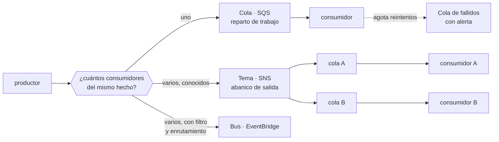

# 033 — SQS, SNS y EventBridge

> [← 032 · Lambda, API Gateway y Step Functions](../../part-02-aws-core-platform/032-lambda-api-gateway-y-step-functions/README.md) · [Índice de la parte](../README.md) · [034 · CloudWatch, CloudTrail, Config y Systems Manager →](../../part-02-aws-core-platform/034-cloudwatch-cloudtrail-config-y-systems-manager/README.md)

**Parte:** 02 — AWS: plataforma esencial<br>
**Nivel:** intermedio · **Horas estimadas:** 4<br>
**Laboratorio:** `messaging` · **Estado:** `EXECUTABLE_CORE`

## 🎯 Propósito

Diseñar comunicación asíncrona sabiendo qué garantiza cada servicio y qué hay que construir encima. La entrega «exactamente una vez» no existe en la red —lo estableció la clase 009— así que el receptor debe ser idempotente. Aquí se elige entre cola, tema y bus por acoplamiento y garantías, y se construye la cola de mensajes fallidos que evita perder trabajo en silencio.

## 📚 Resultados de aprendizaje

Al finalizar podrás:

1. **Elegir** entre cola, tema y bus a partir del número de consumidores y del acoplamiento deseado.
2. **Configurar** el tiempo de invisibilidad coherente con la duración del procesamiento y el número de reintentos.
3. **Construir** una cola de mensajes fallidos con alerta y procedimiento de reproceso.
4. **Explicar** por qué una cola FIFO limita el rendimiento y cuándo ese coste se justifica.
5. **Diagnosticar** mensajes procesados varias veces distinguiendo duplicado de entrega de fallo de idempotencia.

## 🧩 Conceptos centrales

| Concepto | Comprensión verificable |
|---|---|
| `tiempo de invisibilidad` | Periodo durante el cual un mensaje leído no es visible para otros consumidores. Si expira antes de que el consumidor termine, otro lo recibe y el mensaje se procesa dos veces. |
| `cola de mensajes fallidos` | Destino de los mensajes que agotaron sus reintentos. Sin ella, un mensaje envenenado se reintenta indefinidamente y bloquea la cola; con ella, el fallo queda aislado y visible. |
| `abanico de salida` | Patrón en el que un mensaje llega a varios consumidores independientes. Un tema lo hace en el momento; una cola, no: el mensaje lo consume uno solo. |
| `entrega al menos una vez` | Garantía de que un mensaje llegará, posiblemente más de una vez. Es lo que ofrecen las colas estándar, y obliga a que el receptor sea idempotente. |
| `mensaje envenenado` | Mensaje que provoca un fallo determinista en el consumidor. Sin cola de fallidos, se reintenta para siempre y consume capacidad que otros mensajes necesitan. |

## 🧠 Modelo mental

Una cuenta AWS es una frontera de seguridad y facturación; los servicios se combinan mediante contratos, no como una lista de productos aislados.

Aplicado a esta clase, separa siempre cuatro planos: **intención** (qué necesita el usuario),
**configuración** (qué declaramos), **estado observado** (qué existe de verdad) y
**evidencia** (cómo sabemos que cumple). Confundirlos produce diseños que se ven correctos
en un diagrama pero fallan al operar.

## 🗺️ Flujo de razonamiento



## 📖 Desarrollo

### 1. Cola, tema y bus: tres formas de desacoplar

| | Cola (SQS) | Tema (SNS) | Bus (EventBridge) |
|---|---|---|---|
| Consumidores del mismo mensaje | **Uno** | Todos los suscritos | Los que casen con la regla |
| Persistencia | Hasta 14 días | **Ninguna**: si no hay suscriptor, se pierde | Reproducible con archivo |
| Filtrado | No | Por atributos | **Por contenido completo** |
| Reintentos | Del consumidor | Del suscriptor | Con cola de fallidos por regla |
| Latencia típica | ms | ms | ~0,5 s |

La primera fila es la distinción fundamental: **una cola reparte trabajo, un tema difunde un hecho**. Si diez consumidores leen de la misma cola, cada mensaje lo procesa uno solo; eso es correcto para repartir carga y erróneo si los diez deben enterarse.

La segunda fila es la que produce pérdidas silenciosas: **SNS no persiste**. Si un suscriptor está caído cuando llega el mensaje, lo pierde. Por eso el patrón robusto es siempre **tema seguido de cola por consumidor**:

```text
SNS tema "pedido-creado"
  ├── cola facturacion   → consumidor de facturación
  ├── cola inventario    → consumidor de inventario
  └── cola analitica     → consumidor de analítica
```

Cada consumidor tiene su propia cola con su propio ritmo, sus propios reintentos y su propia cola de fallidos. Si el de analítica cae dos horas, sus mensajes esperan en su cola sin afectar a los demás.

EventBridge añade filtrado por contenido y enrutamiento declarativo, a cambio de más latencia:

```json
{"detail-type": ["pedido-creado"], "detail": {"importe": [{"numeric": [">", 1000]}]}}
```

Esa regla entrega solo los pedidos por encima de 1.000. Con SNS habría que filtrar en el consumidor y pagar por procesar lo que se descarta.

### 2. El tiempo de invisibilidad es la causa de los duplicados

Cuando un consumidor lee un mensaje, este se vuelve invisible durante un tiempo configurable. Si el consumidor no lo borra antes de que expire, **el mensaje vuelve a estar disponible y otro lo procesa**.

```text
tiempo de invisibilidad   30 s
duración del procesado    45 s      ← MAYOR

t+0   consumidor A lee el mensaje
t+30  expira la invisibilidad; el mensaje reaparece
t+30  consumidor B lo lee y empieza a procesarlo
t+45  A termina y lo borra
t+75  B termina: el efecto se aplicó DOS VECES
```

La regla de dimensionado:

```text
invisibilidad ≥ duración del p99 del procesamiento × margen
```

Con un p99 de 45 s, un valor de 120 s es razonable. Y cuando la duración es muy variable, el consumidor puede extenderla mientras trabaja:

```bash
$ aws sqs change-message-visibility --queue-url $URL \
    --receipt-handle $RH --visibility-timeout 300
```

El efecto compuesto con el número de reintentos es el que sorprende:

```text
invisibilidad 120 s, maxReceiveCount 5
→ un mensaje envenenado tarda 120 × 5 = 10 minutos en llegar a la cola de fallidos
→ durante ese tiempo ocupa capacidad de consumo 5 veces
```

Y el límite superior: **la invisibilidad máxima es de 12 horas**. Un procesamiento que pueda tardar más no cabe en el modelo y necesita otro diseño —un trabajo asíncrono con estado propio—.

Un último detalle que confunde al depurar: si el consumidor falla y **no** borra el mensaje, no hace falta esperar a la invisibilidad para reintentarlo si el consumidor la reduce a cero explícitamente al capturar el error. Eso acelera el reintento de fallos transitorios sin tocar la configuración.

### 3. La cola de mensajes fallidos no es opcional

Sin ella, un mensaje que provoca un fallo determinista se reintenta indefinidamente. Consume capacidad de consumo, llena los logs de errores repetidos y **retrasa a los mensajes correctos** que están detrás.

```bash
$ aws sqs set-queue-attributes --queue-url $URL --attributes '{
    "RedrivePolicy": "{\"deadLetterTargetArn\":\"arn:aws:sqs:...:pedidos-dlq\",
                       \"maxReceiveCount\":\"5\"}",
    "VisibilityTimeout": "120",
    "MessageRetentionPeriod": "1209600"
  }'
```

Tres decisiones en esa configuración:

**`maxReceiveCount`.** Demasiado bajo (2) envía a fallidos por errores transitorios de red; demasiado alto (20) tarda horas en aislar un envenenado. Entre 3 y 5 cubre los fallos transitorios sin retrasar el aislamiento.

**La retención de la cola de fallidos debe ser mayor que la de origen.** Si ambas son de 14 días, un mensaje que llega a fallidos el día 13 solo se conserva un día más. La cola de fallidos debe tener 14 días **contados desde su llegada**, y por eso conviene revisar que el mensaje no envejezca antes de que alguien lo mire.

**La alerta.** Una cola de fallidos sin alerta es un cubo donde el trabajo desaparece en silencio, que es peor que no tenerla porque da falsa sensación de control:

```bash
$ aws cloudwatch put-metric-alarm --alarm-name pedidos-dlq-no-vacia \
    --metric-name ApproximateNumberOfMessagesVisible --namespace AWS/SQS \
    --dimensions Name=QueueName,Value=pedidos-dlq \
    --statistic Maximum --period 300 --threshold 0 \
    --comparison-operator GreaterThanThreshold --evaluation-periods 1
```

El umbral es **cero**: cualquier mensaje en fallidos merece atención. Y hace falta un procedimiento de reproceso escrito, porque el momento de improvisarlo no puede ser durante un incidente.

### 4. FIFO: qué garantiza y qué cuesta

Las colas FIFO añaden orden estricto y deduplicación, y ambas cosas se pagan:

| | Estándar | FIFO |
|---|---|---|
| Rendimiento | Prácticamente ilimitado | **300 msg/s**, 3.000 con lotes |
| Orden | Mejor esfuerzo | Estricto **dentro del grupo** |
| Entrega | Al menos una vez | Exactamente una vez, ventana de 5 min |
| Alto rendimiento | — | Hasta 70.000/s con particionado por grupo |

La frase clave está en la fila del orden: **el orden es estricto dentro de un grupo de mensajes, no en toda la cola**. El identificador de grupo es lo que decide el paralelismo:

```text
grupo = "global"        → orden total, un solo consumidor efectivo, 300 msg/s
grupo = pedido_id       → orden por pedido, miles de grupos en paralelo
```

La segunda opción es casi siempre la correcta: rara vez se necesita orden global. Lo que se necesita es que **los eventos de un mismo pedido lleguen en orden**, y para eso el grupo debe ser el identificador del pedido.

La deduplicación tiene un límite temporal que hay que conocer: **5 minutos**. Dos mensajes idénticos separados por 6 minutos se entregan ambos. Por eso la deduplicación de FIFO **no sustituye a la idempotencia del receptor**, solo reduce su frecuencia de activación.

La pregunta antes de elegir FIFO:

```text
¿el orden importa de verdad, o solo lo parece?
  "el pago debe ir después de la reserva"  → sí, importa
  "prefiero que lleguen en orden"          → no justifica el coste
```

Muchos sistemas que creen necesitar orden lo que necesitan es **idempotencia y detección de eventos fuera de orden** —descartar una actualización con marca de tiempo anterior a la ya aplicada—, que escala sin límite.

### 5. Duplicado de entrega frente a fallo de idempotencia

Cuando aparece un efecto duplicado hay dos causas posibles y se corrigen en sitios distintos:

```text
duplicado de ENTREGA      el mismo mensaje se entregó dos veces
  → normal en entrega al menos una vez
  → se corrige con idempotencia en el consumidor

fallo de IDEMPOTENCIA     el consumidor no reconoció que ya lo había procesado
  → es un defecto
  → se corrige en la lógica del consumidor
```

Distinguirlas exige registrar el identificador del mensaje:

```python
def handler(event, context):
    for registro in event["Records"]:
        mid = registro["messageId"]
        veces = int(registro["attributes"]["ApproximateReceiveCount"])
        log.info("procesando", extra={"message_id": mid, "recepcion": veces})
        if ya_procesado(mid):
            log.info("duplicado descartado", extra={"message_id": mid})
            continue
        procesar(registro)
        marcar_procesado(mid)     # en la MISMA transacción que el efecto
```

El comentario de la última línea es el mismo punto de la clase 009: **si marcar y aplicar el efecto no son atómicos, existe una ventana en la que el efecto ocurrió y la marca no**, y el reintento duplica.

`ApproximateReceiveCount` es la métrica que separa los diagnósticos:

```text
contador = 1 y efecto duplicado   → fallo de idempotencia: el consumidor falló
contador > 1 y efecto duplicado   → duplicado de entrega no manejado
contador > 1 y sin duplicado      → funcionando como debe
```

Y un consejo operativo: **alertar cuando `ApproximateReceiveCount` supere 2 de forma sostenida**. No es un fallo por sí mismo, pero indica que algo está reintentando más de lo normal —invisibilidad corta, consumidor lento o errores transitorios frecuentes— y precede a problemas mayores.

## 🔬 Ejemplo trabajado

**Durante una promoción, 1.847 pedidos de CloudShop se facturan dos veces y 312 no se facturan en absoluto.** Dos síntomas opuestos, causas distintas.

**Síntoma 1 — facturación duplicada.**

```bash
$ aws sqs get-queue-attributes --queue-url $URL_FACTURACION \
    --attribute-names VisibilityTimeout ApproximateNumberOfMessagesNotVisible
{"VisibilityTimeout": "30", "ApproximateNumberOfMessagesNotVisible": "412"}
```

Se mide cuánto tarda el consumidor:

```text
p50   8,2 s
p95  28,4 s
p99  51,7 s      ← mayor que la invisibilidad de 30 s
```

```text
invocaciones en el pico          42.000
fracción por encima de 30 s        4,4 %  → 1.848 mensajes
duplicados observados                     1.847
```

**Cuadra exactamente.** El 4,4 % de los mensajes tarda más que la invisibilidad, reaparece y lo procesa otro consumidor. No es un fallo del código: es un parámetro mal dimensionado.

Se comprueba si además había fallo de idempotencia:

```bash
$ aws logs filter-log-events --log-group-name /aws/lambda/facturacion \
    --filter-pattern '"duplicado descartado"' --start-time 1785540000000 \
    --query 'length(events)'
0
```

**Cero descartes**: el consumidor no comprobaba duplicados en absoluto. Los dos arreglos son necesarios y ninguno basta solo.

```bash
$ aws sqs set-queue-attributes --queue-url $URL_FACTURACION \
    --attributes VisibilityTimeout=180        # 3,5× el p99
```

```python
# y en el consumidor, marca y efecto en la misma transacción
with db.transaction():
    if db.execute("INSERT INTO procesados(message_id) VALUES(%s) "
                  "ON CONFLICT DO NOTHING", [mid]).rowcount == 0:
        return            # ya procesado
    facturar(pedido)
```

**Síntoma 2 — 312 pedidos sin facturar.**

```bash
$ aws sqs get-queue-attributes --queue-url $URL_FACTURACION \
    --attribute-names RedrivePolicy
{}
```

**No había cola de mensajes fallidos.** Se reconstruye qué pasó con los logs:

```bash
$ aws logs filter-log-events --log-group-name /aws/lambda/facturacion \
    --filter-pattern 'ERROR' --query 'events[0].message' --output text
ERROR ValueError: importe negativo en pedido A-88213
```

312 pedidos de una promoción con descuento superior al importe generaban un valor negativo. El consumidor fallaba, el mensaje volvía a la cola, y así **indefinidamente**:

```text
mensajes envenenados                    312
reintentos por mensaje en 4 horas    ~480   (cada 30 s)
invocaciones desperdiciadas       ~149.760
```

Además de perder esos pedidos, **consumían capacidad que retrasaba a los buenos**, lo que agravó el síntoma 1 al alargar los tiempos de procesamiento.

```bash
$ aws sqs create-queue --queue-name facturacion-dlq \
    --attributes MessageRetentionPeriod=1209600
$ aws sqs set-queue-attributes --queue-url $URL_FACTURACION --attributes '{
    "RedrivePolicy":"{\"deadLetterTargetArn\":\"arn:...:facturacion-dlq\",
                      \"maxReceiveCount\":\"4\"}"}'
$ aws cloudwatch put-metric-alarm --alarm-name facturacion-dlq-no-vacia \
    --metric-name ApproximateNumberOfMessagesVisible --namespace AWS/SQS \
    --dimensions Name=QueueName,Value=facturacion-dlq \
    --statistic Maximum --period 300 --threshold 0 \
    --comparison-operator GreaterThanThreshold --evaluation-periods 1
```

Y se reprocesan los 312 tras corregir la validación:

```bash
$ aws sqs start-message-move-task \
    --source-arn arn:aws:sqs:...:facturacion-dlq \
    --destination-arn arn:aws:sqs:...:facturacion
```

**Resultado en la promoción siguiente:**

```text                              antes      después
pedidos duplicados                 1.847         0
pedidos sin facturar                 312         0
invocaciones desperdiciadas      149.760         0
p95 de la cola                      28,4 s     9,1 s
mensajes en cola de fallidos          n/a         7  (con alerta y reproceso)
```

Los 7 de la cola de fallidos son el resultado correcto: **fallos reales, aislados, visibles y recuperables**, en vez de trabajo que desaparece.

## 🧪 Laboratorio guiado

Ejecuta desde la raíz:

```bash
python classes/part-02-aws-core-platform/033-sqs-sns-y-eventbridge/lab.py
```

El laboratorio selecciona el motor de práctica **`messaging`** y produce
`lab_result.json`. El escenario, sus comprobaciones y el artefacto esperado corresponden a
esta clase; no requiere credenciales y deja explícito qué debe revalidarse en un sandbox real.

1. Lee `exercise.steps` y formula una predicción antes de ejecutar.
2. Ejecuta la práctica y verifica todos los elementos de `checks`.
3. Provoca el caso de `negative_test` y explica la señal observada.
4. Materializa `flujo-eventos-aws` en `evidence/` usando la plantilla indicada.
5. Para proveedor real, sigue `sandbox.requires`, registra costo y ejecuta `destroy`.

### Evidencia esperada

El artefacto principal es un flujo que declara orden, entrega y manejo de errores. Además, la entrega debe incluir el comando ejecutado,
la salida estructurada y una conclusión que no exceda lo observado.

## 🏆 Reto verificable

Construye **`flujo-eventos-aws`** para el caso CloudShop. Incluye una alternativa descartada,
un supuesto que pueda falsarse, una prueba de fallo y una decisión de rollback.

## ✅ Criterio de aceptación

- [ ] `lab.py` termina con código 0 y genera JSON válido.
- [ ] La entrega conecta al menos tres requisitos con mecanismos verificables.
- [ ] Existe una prueba positiva y una prueba negativa con evidencia.
- [ ] Seguridad, costo y operación aparecen como decisiones, no como anexos.
- [ ] Se declara una limitación y una condición que obligaría a revisar el diseño.
- [ ] Otra persona puede repetir el recorrido sin conocimiento tácito.

## ⚠️ Errores frecuentes

| Síntoma | Causa probable | Corrección |
|---|---|---|
| Un porcentaje de mensajes produce efecto duplicado | El procesamiento supera el tiempo de invisibilidad y el mensaje reaparece | Dimensiona la invisibilidad por encima del p99 del procesamiento, o extiéndela mientras trabajas. |
| Trabajo que desaparece sin dejar rastro | No hay cola de mensajes fallidos: los envenenados se reintentan hasta caducar | Configura cola de fallidos con `maxReceiveCount` entre 3 y 5 y alerta con umbral cero. |
| Un suscriptor pierde mensajes mientras está caído | SNS no persiste: si no hay quien reciba, el mensaje se pierde | Patrón tema seguido de cola por consumidor; cada uno con su ritmo y sus reintentos. |
| Una cola FIFO no supera 300 mensajes por segundo | Todos los mensajes usan el mismo identificador de grupo, así que no hay paralelismo | Usa el identificador de la entidad como grupo; el orden estricto es por grupo, no por cola. |
| Aparece un duplicado con `ApproximateReceiveCount` igual a 1 | No es duplicado de entrega: es un fallo de idempotencia en el consumidor | Marca el mensaje como procesado en la misma transacción que el efecto. |

## 🛡️ Seguridad, ética y costo

Trabaja con cuentas propias o sandboxes autorizados. No publiques secretos, identificadores
reales ni datos personales. Antes de crear recursos pagos define presupuesto, etiquetas y
comando de destrucción; después verifica que no queden recursos huérfanos. Los ejemplos
locales enseñan contratos, pero no certifican cumplimiento ni disponibilidad de producción.

## ❓ Preguntas de comprobación

1. ¿Por qué el patrón robusto es tema seguido de cola por consumidor en vez de suscribir consumidores directamente al tema?
2. El procesamiento tiene un p99 de 50 s y la invisibilidad es de 30 s. ¿Qué fracción se duplicará y por qué?
3. Con invisibilidad de 120 s y `maxReceiveCount` de 5, ¿cuánto tarda un mensaje envenenado en aislarse?
4. ¿Por qué la deduplicación de FIFO no sustituye a la idempotencia del receptor?
5. Ves un efecto duplicado con `ApproximateReceiveCount = 1`. ¿Dónde está el fallo?

## 🔗 Referencias

- AWS (2024). *Amazon SQS visibility timeout* — semántica, extensión y límite de 12 horas. <https://docs.aws.amazon.com/AWSSimpleQueueService/latest/SQSDeveloperGuide/sqs-visibility-timeout.html>
- AWS (2024). *Amazon SQS dead-letter queues* — política de reenvío y reproceso. <https://docs.aws.amazon.com/AWSSimpleQueueService/latest/SQSDeveloperGuide/sqs-dead-letter-queues.html>
- AWS (2024). *FIFO queues: message groups and throughput* — orden por grupo y límites. <https://docs.aws.amazon.com/AWSSimpleQueueService/latest/SQSDeveloperGuide/FIFO-queues.html>
- AWS (2024). *EventBridge event patterns* — filtrado por contenido y enrutamiento declarativo. <https://docs.aws.amazon.com/eventbridge/latest/userguide/eb-event-patterns.html>
- Hohpe, G. y Woolf, B. (2003). *Enterprise Integration Patterns* — canal punto a punto, publicación-suscripción y canal de mensajes inválidos.
- Documentación oficial vigente del servicio implementado; registra URL y fecha de consulta.

---

> [Evaluación](assessment.md) · [Contrato de clase](lesson.yaml) · [Índice de la parte](../README.md)

**📥 Descargar:** [Parte 02 en PDF](../../../site/downloads/partes/manual-parte-02-aws-core-platform.pdf) · [Recorrido de AWS en PDF](../../../site/downloads/nubes/manual-aws.pdf) · [Manual integral](../../../site/downloads/multi-cloud-engineering-manual-v2.0.pdf)

| Anterior | Índice | Siguiente |
|---|---|---|
| [← 032 · Lambda, API Gateway y Step Functions](../../part-02-aws-core-platform/032-lambda-api-gateway-y-step-functions/README.md) | [Parte 02](../README.md) · [Programa](../../README.md) | [034 · CloudWatch, CloudTrail, Config y Systems Manager →](../../part-02-aws-core-platform/034-cloudwatch-cloudtrail-config-y-systems-manager/README.md) |
