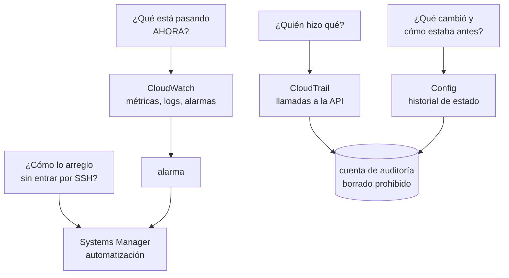

# 034 — CloudWatch, CloudTrail, Config y Systems Manager

> [← 033 · SQS, SNS y EventBridge](../../part-02-aws-core-platform/033-sqs-sns-y-eventbridge/README.md) · [Índice de la parte](../README.md) · [035 · KMS, Secrets Manager, WAF y controles de seguridad →](../../part-02-aws-core-platform/035-kms-secrets-manager-waf-y-controles-de-seguridad/README.md)

**Parte:** 02 — AWS: plataforma esencial<br>
**Nivel:** intermedio · **Horas estimadas:** 4<br>
**Laboratorio:** `observability` · **Estado:** `EXECUTABLE_CORE`

## 🎯 Propósito

Construir la evidencia operativa que permite responder tres preguntas distintas durante un incidente: qué está pasando, quién hizo qué y qué cambió. Cada una se responde con un servicio diferente, y confundirlos hace que se busque durante horas en el sitio equivocado. Aquí se aterriza en AWS lo que la clase 012 estableció sobre señales.

## 📚 Resultados de aprendizaje

Al finalizar podrás:

1. **Asignar** cada pregunta forense al servicio que la responde y saber qué no responde ninguno.
2. **Diseñar** métricas y filtros que no multipliquen el coste por la dimensionalidad.
3. **Consultar** registros de auditoría para reconstruir quién ejecutó una acción y desde dónde.
4. **Detectar** desviaciones de configuración con reglas que se evalúan de forma continua.
5. **Ejecutar** una operación en una flota sin abrir puertos ni mantener claves de acceso.

## 🧩 Conceptos centrales

| Concepto | Comprensión verificable |
|---|---|
| `cardinalidad` | Número de combinaciones distintas de dimensiones de una métrica. Cada combinación es una serie temporal facturada por separado, así que una dimensión con muchos valores multiplica el coste. |
| `métrica de filtro` | Métrica derivada de patrones en los logs. Convierte texto en series temporales sin instrumentar el código, a cambio de depender del formato del mensaje. |
| `registro de auditoría` | Historial de llamadas a la API con identidad, origen, parámetros y resultado. Responde «quién hizo qué», que ninguna métrica ni log de aplicación responde. |
| `elemento de configuración` | Instantánea del estado de un recurso en un momento dado. Permite comparar cómo estaba antes y después de un cambio, que es distinto de saber quién lo hizo. |
| `documento de automatización` | Procedimiento declarativo ejecutable sobre una flota, con parámetros y control de errores. Convierte un runbook escrito en uno ejecutable y auditable. |

## 🧠 Modelo mental

Una cuenta AWS es una frontera de seguridad y facturación; los servicios se combinan mediante contratos, no como una lista de productos aislados.

Aplicado a esta clase, separa siempre cuatro planos: **intención** (qué necesita el usuario),
**configuración** (qué declaramos), **estado observado** (qué existe de verdad) y
**evidencia** (cómo sabemos que cumple). Confundirlos produce diseños que se ven correctos
en un diagrama pero fallan al operar.

## 🗺️ Flujo de razonamiento



## 📖 Desarrollo

### 1. Cuatro preguntas, cuatro servicios

Durante un incidente se hacen preguntas distintas y cada una tiene su fuente. Buscar en la equivocada es la causa más común de que un diagnóstico tarde horas:

| Pregunta | Servicio | Qué **no** responde |
|---|---|---|
| ¿Qué está pasando ahora? | CloudWatch | Quién lo provocó |
| ¿Quién hizo qué y desde dónde? | CloudTrail | Cómo estaba antes |
| ¿Qué cambió y cuál era el estado previo? | Config | Quién lo cambió |
| ¿Cómo actúo sobre la flota? | Systems Manager | — |

Las dos filas centrales se confunden constantemente y son complementarias:

```text
CloudTrail dice:  "a las 14:22, el rol ci-deploy llamó a ModifyDBInstance
                   desde 203.0.113.40 con estos parámetros"
Config dice:      "a las 14:22, la instancia pasó de BackupRetentionPeriod=7
                   a BackupRetentionPeriod=0"
```

CloudTrail da el **actor y la intención**; Config da el **estado antes y después**. Para reconstruir un incidente hacen falta los dos, y por eso ambos deben escribir en la cuenta de auditoría de la clase 025.

Y hay una pregunta que **ninguno responde**: por qué. Eso solo está en el ADR, el ticket o la conversación. Es la razón por la que la clase 024 insistía en registrar el razonamiento: la telemetría reconstruye el qué con precisión y nunca el motivo.

### 2. La cardinalidad multiplica la factura

Cada combinación distinta de dimensiones es una **métrica personalizada facturada por separado**, a unos 0,30 USD al mes. La aritmética se dispara rápido:

```text
métrica: latencia_peticion
dimensiones: servicio (8) × endpoint (40) × código (12) × instancia (24)

series = 8 × 40 × 12 × 24 = 92.160
coste  = 92.160 × 0,30 = 27.648 USD/mes
```

**Casi 28.000 dólares al mes en métricas**, por añadir dos dimensiones que parecían útiles. Y la mayoría de esas series no se consulta nunca.

La dimensión culpable suele ser identificable: `instancia` tiene 24 valores hoy y crecerá con el autoescalado, además de generar series que mueren en cada despliegue. **Un identificador efímero nunca debe ser dimensión de una métrica.**

```text
sin la dimensión instancia: 8 × 40 × 12 = 3.840 series → 1.152 USD/mes
agrupando códigos en clases (2xx, 4xx, 5xx): 8 × 40 × 3 = 960 → 288 USD/mes
```

Un factor de 96 respecto al diseño inicial, sin perder capacidad de diagnóstico: si hace falta saber qué instancia concreta falló, eso está en los **logs**, que se cobran por volumen ingerido y no por combinación.

La regla práctica:

```text
métrica  → pocas dimensiones, valores acotados y estables
log      → todo el detalle, incluidos identificadores
traza    → la relación entre servicios de una petición concreta
```

Y una forma económica de obtener métricas sin instrumentar: el formato de métrica embebida, que permite emitir un log estructurado del que CloudWatch extrae métricas automáticamente, pagando la ingesta del log en vez de la publicación de cada métrica.

### 3. Consultar registros de auditoría para reconstruir un incidente

CloudTrail responde quién hizo qué, y la consulta directa por atributos es limitada. Para investigaciones reales conviene usar el lago de datos o consultas sobre el bucket:

```bash
# Búsqueda rápida por evento, últimos 90 días
$ aws cloudtrail lookup-events \
    --lookup-attributes AttributeKey=EventName,AttributeValue=DeleteBucketPolicy \
    --query 'Events[].[EventTime,Username,CloudTrailEvent]' --output text | head -3
```

Y el detalle completo del evento, que es donde está lo útil:

```json
{
  "eventTime": "2026-08-01T14:22:08Z",
  "userIdentity": {
    "type": "AssumedRole",
    "arn": "arn:aws:sts::123456789012:assumed-role/ci-deploy/despliegue-4821",
    "sessionContext": {"attributes": {"mfaAuthenticated": "false"}}
  },
  "sourceIPAddress": "203.0.113.40",
  "userAgent": "aws-cli/2.15.0",
  "requestParameters": {"bucketName": "cloudshop-facturas"},
  "errorCode": null
}
```

Tres campos que suelen decidir la investigación:

- **`sessionContext`** indica si hubo MFA. Una acción sensible sin MFA es un hallazgo por sí misma.
- **`sourceIPAddress`** distingue una acción desde el pipeline de una desde un portátil.
- **`errorCode`** revela los intentos **fallidos**, que son la señal más útil de un ataque en curso: alguien probando permisos que no tiene.

Dos límites que conviene conocer: el historial de consulta directa cubre **90 días**; más atrás hay que ir al bucket. Y **los eventos de datos no se registran por defecto** —lecturas de objetos, invocaciones de funciones—: si hacen falta, hay que activarlos explícitamente y su volumen puede ser enorme.

Esa segunda limitación es exactamente lo que impidió, en la brecha de la clase 010, saber cuántas veces se descargaron las facturas: los eventos de gestión estaban registrados y los de datos no.

### 4. Config: qué cambió y detección continua de desviaciones

Config graba el estado de cada recurso a lo largo del tiempo, lo que permite responder cómo estaba antes de un cambio:

```bash
$ aws configservice get-resource-config-history \
    --resource-type AWS::RDS::DBInstance --resource-id db-ABCD1234 \
    --query 'configurationItems[0:2].[configurationItemCaptureTime,
             configuration.backupRetentionPeriod]' --output text
2026-08-01T14:22:31Z    0
2026-07-15T09:11:02Z    7
```

Y sobre ese historial se evalúan reglas de forma continua:

```bash
$ aws configservice put-config-rule --config-rule '{
    "ConfigRuleName": "rds-retencion-minima",
    "Source": {"Owner": "AWS", "SourceIdentifier": "DB_INSTANCE_BACKUP_ENABLED"},
    "InputParameters": "{\"backupRetentionPeriod\":\"7\"}"
  }'
```

La distinción con las SCP de la clase 025 importa:

```text
SCP           preventiva: impide que la acción ocurra
regla Config  detectiva: la acción ocurre y se marca como no conforme
```

Son complementarias y ninguna sustituye a la otra. Hay controles que no se pueden prevenir sin bloquear trabajo legítimo, y ahí la detección con corrección automática es la respuesta:

```bash
$ aws configservice put-remediation-configurations --remediation-configurations '[{
    "ConfigRuleName": "rds-retencion-minima",
    "TargetType": "SSM_DOCUMENT",
    "TargetId": "AWSConfigRemediation-ModifyRDSInstanceBackupRetention",
    "Automatic": true,
    "MaximumAutomaticAttempts": 3
  }]'
```

Una advertencia sobre el coste: Config cobra **por elemento de configuración registrado**. En un entorno con autoescalado agresivo, cada instancia creada y destruida genera varios elementos, y la factura puede crecer de forma inesperada. Se acota limitando los tipos de recurso grabados a los que de verdad importan.

### 5. Operar la flota sin puertos abiertos ni claves

Systems Manager permite ejecutar comandos y sesiones interactivas **sin abrir el puerto 22, sin claves SSH y sin IP pública**. El agente inicia una conexión saliente, así que la instancia puede vivir en una subred aislada —la de la clase 027—.

```bash
# Sesión interactiva, auditada y sin SSH
$ aws ssm start-session --target i-0a1b2c3d

# Comando en toda una flota por etiqueta
$ aws ssm send-command --document-name AWS-RunShellScript \
    --targets Key=tag:Entorno,Values=produccion \
    --parameters 'commands=["systemctl restart cloudshop"]' \
    --max-concurrency 10% --max-errors 2
```

Los dos últimos parámetros son la diferencia entre una operación y un incidente: **`max-concurrency` limita cuántas instancias se tocan a la vez** y `max-errors` detiene la ejecución si demasiadas fallan. Sin ellos, un comando erróneo se aplica a las 200 instancias simultáneamente.

La ventaja sobre SSH no es la comodidad, son tres propiedades:

```text
1. Auditado: cada sesión y cada comando quedan en CloudTrail
2. Sin credenciales de larga vida: usa el rol de instancia
3. Sin superficie de red: ningún puerto entrante abierto
```

Y los runbooks se vuelven ejecutables en vez de escritos:

```yaml
schemaVersion: '0.3'
parameters:
  InstanceId: {type: String}
mainSteps:
  - name: DrenarDelBalanceador
    action: aws:executeAwsApi
    inputs: {Service: elbv2, Api: DeregisterTargets, ...}
  - name: EsperarDrenado
    action: aws:sleep
    inputs: {Duration: PT90S}
  - name: Reiniciar
    action: aws:runCommand
    inputs: {DocumentName: AWS-RunShellScript, ...}
```

La diferencia con un runbook en una wiki: **este se ejecuta igual a las 3 de la madrugada que en un simulacro**, no depende de que alguien recuerde el orden, y su ejecución queda registrada.

## 🔬 Ejemplo trabajado

**A las 14:31 el equipo de CloudShop recibe una alerta: la retención de copias de la base de datos de producción es cero.** Se reconstruye el incidente completo con los cuatro servicios.

**¿Qué está pasando?** — CloudWatch dio la alerta, pero no dice más:

```bash
$ aws cloudwatch describe-alarms --alarm-names config-rds-retencion \
    --query 'MetricAlarms[0].[StateValue,StateUpdatedTimestamp]' --output text
ALARM   2026-08-01T14:31:12Z
```

**¿Qué cambió y cómo estaba antes?** — Config:

```bash
$ aws configservice get-resource-config-history --resource-type AWS::RDS::DBInstance \
    --resource-id db-ABCD1234 --limit 2 \
    --query 'configurationItems[].[configurationItemCaptureTime,
             configuration.backupRetentionPeriod,configuration.multiAZ]' --output text
2026-08-01T14:22:31Z    0     true
2026-07-15T09:11:02Z    7     true
```

De 7 días a 0 a las 14:22. Nueve minutos antes de la alerta.

**¿Quién lo hizo?** — CloudTrail:

```bash
$ aws cloudtrail lookup-events \
    --lookup-attributes AttributeKey=ResourceName,AttributeValue=db-ABCD1234 \
    --start-time 2026-08-01T14:00:00Z \
  | jq -r '.Events[0].CloudTrailEvent | fromjson
           | [.eventTime, .userIdentity.arn, .sourceIPAddress,
              .requestParameters.backupRetentionPeriod] | @tsv'
2026-08-01T14:22:08Z  arn:aws:sts::...:assumed-role/ci-deploy/despliegue-4821  203.0.113.40  0
```

**Fue el pipeline**, no una persona. Se busca el origen en el cambio de infraestructura:

```text
el módulo de Terraform tenía backup_retention_period sin declarar
→ el proveedor aplicó su valor por defecto: 0
→ el plan mostraba el cambio y nadie lo leyó
```

Se comprueba si hubo más recursos afectados por la misma causa:

```bash
$ aws configservice select-resource-config \
    --expression "SELECT resourceId WHERE resourceType='AWS::RDS::DBInstance'
                  AND configuration.backupRetentionPeriod = 0"
{"Results": ["{\"resourceId\":\"db-ABCD1234\"}", "{\"resourceId\":\"db-EFGH5678\"}"]}
```

**Dos instancias**, no una. La segunda no tenía alerta porque la regla solo cubría producción.

**Cuánto tiempo estuvo sin protección:**

```text
cambio                14:22:08
detección              14:31:12   (9 min: la regla se evalúa cada 10 min)
corrección             14:38:00
ventana sin copias      15 min 52 s
copias perdidas         ninguna: las anteriores se conservan 7 días desde su creación
```

**Correcciones, separadas por tipo de control:**

```text
PREVENTIVO   SCP que deniega ModifyDBInstance con BackupRetentionPeriod=0
             probado con prueba negativa:
             $ aws rds modify-db-instance --backup-retention-period 0 ...
             AccessDenied ... explicit deny in a service control policy  ✓

DETECTIVO    regla de Config ampliada a todas las cuentas, no solo producción
             corrección automática que restaura 7 días

ORIGEN       el módulo de Terraform declara el valor explícitamente
             y una prueba de política rechaza el plan si es menor que 7

OPERATIVO    documento de automatización para verificar retención en la flota,
             ejecutable en simulacro
```

Y se detecta un hueco al revisar el registro: **los eventos de datos no estaban activados**, así que no se puede saber si alguien accedió a las copias durante la ventana. Se activan para los buckets de copias, con el coste declarado:

```text
eventos de datos en 3 buckets: ~2,4 M eventos/mes × 0,10 USD/100k = 2,40 USD/mes
```

**Resultado: el incidente se reconstruyó completo en 12 minutos** porque cada pregunta tenía su fuente. Sin Config no se habría sabido el estado anterior; sin CloudTrail, que fue el pipeline y no una persona; y sin la consulta agregada, que había una segunda instancia afectada.

## 🧪 Laboratorio guiado

Ejecuta desde la raíz:

```bash
python classes/part-02-aws-core-platform/034-cloudwatch-cloudtrail-config-y-systems-manager/lab.py
```

El laboratorio selecciona el motor de práctica **`observability`** y produce
`lab_result.json`. El escenario, sus comprobaciones y el artefacto esperado corresponden a
esta clase; no requiere credenciales y deja explícito qué debe revalidarse en un sandbox real.

1. Lee `exercise.steps` y formula una predicción antes de ejecutar.
2. Ejecuta la práctica y verifica todos los elementos de `checks`.
3. Provoca el caso de `negative_test` y explica la señal observada.
4. Materializa `evidencia-operativa-aws` en `evidence/` usando la plantilla indicada.
5. Para proveedor real, sigue `sandbox.requires`, registra costo y ejecuta `destroy`.

### Evidencia esperada

El artefacto principal es telemetría correlacionada con una pregunta operativa. Además, la entrega debe incluir el comando ejecutado,
la salida estructurada y una conclusión que no exceda lo observado.

## 🏆 Reto verificable

Construye **`evidencia-operativa-aws`** para el caso CloudShop. Incluye una alternativa descartada,
un supuesto que pueda falsarse, una prueba de fallo y una decisión de rollback.

## ✅ Criterio de aceptación

- [ ] `lab.py` termina con código 0 y genera JSON válido.
- [ ] La entrega conecta al menos tres requisitos con mecanismos verificables.
- [ ] Existe una prueba positiva y una prueba negativa con evidencia.
- [ ] Seguridad, costo y operación aparecen como decisiones, no como anexos.
- [ ] Se declara una limitación y una condición que obligaría a revisar el diseño.
- [ ] Otra persona puede repetir el recorrido sin conocimiento tácito.

## ⚠️ Errores frecuentes

| Síntoma | Causa probable | Corrección |
|---|---|---|
| La factura de métricas personalizadas es de miles de dólares | Una dimensión de alta cardinalidad multiplica las series facturadas | Saca los identificadores efímeros de las dimensiones; ese detalle va en los logs, que se cobran por volumen. |
| Tras un incidente no se sabe si alguien accedió a los datos | Los eventos de datos de CloudTrail no se registran por defecto | Actívalos para los recursos sensibles y asume su coste; los de gestión no cubren lecturas de objetos. |
| Se sabe qué cambió pero no quién, o al revés | Se consultó un solo servicio: Config da el estado y CloudTrail el actor | Usa ambos: son complementarios y ninguno responde la pregunta del otro. |
| Un comando erróneo se aplica a toda la flota a la vez | Se ejecutó sin limitar concurrencia ni tolerancia a errores | Usa `max-concurrency` y `max-errors` en toda ejecución sobre flota. |
| La factura de Config crece de forma inesperada | Se graban todos los tipos de recurso y el autoescalado genera elementos continuamente | Limita los tipos grabados a los que importan para el cumplimiento y el diagnóstico. |

## 🛡️ Seguridad, ética y costo

Trabaja con cuentas propias o sandboxes autorizados. No publiques secretos, identificadores
reales ni datos personales. Antes de crear recursos pagos define presupuesto, etiquetas y
comando de destrucción; después verifica que no queden recursos huérfanos. Los ejemplos
locales enseñan contratos, pero no certifican cumplimiento ni disponibilidad de producción.

## ❓ Preguntas de comprobación

1. ¿Qué servicio responde «quién lo hizo» y cuál «cómo estaba antes»? ¿Por qué hacen falta los dos?
2. Una métrica con 4 dimensiones de 8, 40, 12 y 24 valores. ¿Cuántas series genera y cuál eliminarías primero?
3. ¿Qué campo de un evento de auditoría revela un ataque en curso mejor que las acciones exitosas?
4. ¿Qué diferencia hay entre una SCP y una regla de Config, y por qué ninguna sustituye a la otra?
5. ¿Qué tres propiedades aporta una sesión gestionada frente a SSH, más allá de la comodidad?

## 🔗 Referencias

- AWS (2024). *CloudWatch: publishing custom metrics and dimensions* — cardinalidad y facturación por serie. <https://docs.aws.amazon.com/AmazonCloudWatch/latest/monitoring/publishingMetrics.html>
- AWS (2024). *CloudWatch Embedded Metric Format* — métricas desde logs estructurados. <https://docs.aws.amazon.com/AmazonCloudWatch/latest/monitoring/CloudWatch_Embedded_Metric_Format.html>
- AWS (2024). *CloudTrail: logging data events* — qué se registra por defecto y qué hay que activar. <https://docs.aws.amazon.com/awscloudtrail/latest/userguide/logging-data-events-with-cloudtrail.html>
- AWS (2024). *AWS Config rules and remediation* — evaluación continua y corrección automática. <https://docs.aws.amazon.com/config/latest/developerguide/evaluate-config.html>
- AWS (2024). *Systems Manager Session Manager* — acceso sin puertos abiertos ni claves, con auditoría. <https://docs.aws.amazon.com/systems-manager/latest/userguide/session-manager.html>
- Documentación oficial vigente del servicio implementado; registra URL y fecha de consulta.

---

> [Evaluación](assessment.md) · [Contrato de clase](lesson.yaml) · [Índice de la parte](../README.md)

**📥 Descargar:** [Parte 02 en PDF](../../../site/downloads/partes/manual-parte-02-aws-core-platform.pdf) · [Recorrido de AWS en PDF](../../../site/downloads/nubes/manual-aws.pdf) · [Manual integral](../../../site/downloads/multi-cloud-engineering-manual-v2.0.pdf)

| Anterior | Índice | Siguiente |
|---|---|---|
| [← 033 · SQS, SNS y EventBridge](../../part-02-aws-core-platform/033-sqs-sns-y-eventbridge/README.md) | [Parte 02](../README.md) · [Programa](../../README.md) | [035 · KMS, Secrets Manager, WAF y controles de seguridad →](../../part-02-aws-core-platform/035-kms-secrets-manager-waf-y-controles-de-seguridad/README.md) |
