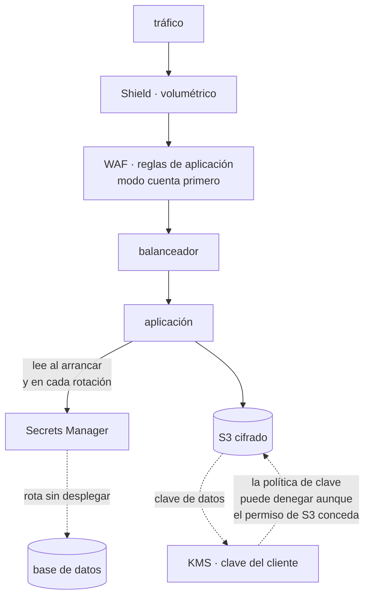

# 035 — KMS, Secrets Manager, WAF y controles de seguridad

> [← Clase anterior](../../part-02-aws-core-platform/034-cloudwatch-cloudtrail-config-y-systems-manager/README.md) · [Índice de la parte](../README.md) · [Clase siguiente →](../../part-02-aws-core-platform/036-proyecto-aplicacion-de-tres-capas-en-aws/README.md)

**Parte:** 02 — AWS: plataforma esencial<br>
**Nivel:** intermedio · **Horas estimadas:** 4<br>
**Laboratorio:** `security` · **Estado:** `EXECUTABLE_CORE`

## 🎯 Propósito

Aplicar defensa en profundidad a la plataforma AWS: cifrado con control de claves propio, secretos que rotan sin desplegar, y filtrado en el borde. La clase 026 cubrió quién puede hacer qué; esta cubre qué ocurre cuando esa barrera falla, que es la única suposición razonable a la hora de diseñar seguridad.

## 📚 Resultados de aprendizaje

Al finalizar podrás:

1. **Distinguir** clave gestionada por el proveedor, gestionada por el cliente y material importado, con sus consecuencias.
2. **Escribir** una política de clave que impida el acceso incluso a quien tenga permisos sobre el recurso cifrado.
3. **Rotar** un secreto sin desplegar la aplicación, entendiendo la fase de dos versiones.
4. **Configurar** reglas de borde que corten ataques volumétricos y de aplicación sin bloquear tráfico legítimo.
5. **Verificar** cada control con prueba negativa, no con inspección de la configuración.

## 🧩 Conceptos centrales

| Concepto | Comprensión verificable |
|---|---|
| `cifrado de sobre` | Cifrar los datos con una clave de datos y esa clave con una clave maestra. Permite cifrar volúmenes grandes sin llamar al servicio de claves por cada operación y rotar la maestra sin recifrar los datos. |
| `política de clave` | Documento que gobierna quién puede usar y administrar una clave. Es independiente de los permisos sobre el recurso cifrado: sin acceso a la clave, el acceso al dato no sirve. |
| `rotación de secretos` | Sustitución periódica de una credencial sin intervención humana. Exige una fase en la que dos versiones son válidas, o la rotación corta las conexiones en curso. |
| `regla gestionada` | Conjunto de reglas de filtrado mantenido por el proveedor o un tercero. Ahorra escribirlas y exige medirlas en modo cuenta antes de bloquear, porque generan falsos positivos. |
| `modo cuenta` | Configuración en la que una regla registra las coincidencias sin bloquear. Es el único modo seguro de introducir reglas nuevas en un servicio con tráfico real. |

## 🧠 Modelo mental

Una cuenta AWS es una frontera de seguridad y facturación; los servicios se combinan mediante contratos, no como una lista de productos aislados.

Aplicado a esta clase, separa siempre cuatro planos: **intención** (qué necesita el usuario),
**configuración** (qué declaramos), **estado observado** (qué existe de verdad) y
**evidencia** (cómo sabemos que cumple). Confundirlos produce diseños que se ven correctos
en un diagrama pero fallan al operar.

## 🗺️ Flujo de razonamiento



## 📖 Desarrollo

### 1. Tres tipos de clave, tres niveles de control

| Tipo | Quién controla | Se puede | Coste |
|---|---|---|---|
| Gestionada por AWS | AWS | Nada: no se ve ni se audita su uso por separado | Gratis |
| **Gestionada por el cliente** | Tú | Política propia, rotación, desactivación, auditoría | 1 USD/mes + uso |
| Material importado | Tú, fuera de AWS | Todo lo anterior más control del material | 1 USD/mes + uso |

La diferencia práctica entre la primera y la segunda es mayor de lo que sugiere la tabla:

```text
clave gestionada por AWS
  no puedes escribir su política
  no puedes desactivarla
  no puedes impedir que otro principal de la cuenta la use
  → el cifrado protege del disco físico y de poco más

clave del cliente
  su política es una segunda barrera independiente de la del recurso
  se puede desactivar y con ello hacer ilegibles los datos al instante
  su uso se audita como evento propio
```

Esa segunda barrera es lo que convierte el cifrado en un control real. Con clave del cliente, alguien con permiso de lectura sobre el bucket **pero sin permiso sobre la clave no puede leer nada**:

```json
{
  "Sid": "Solo el rol de la aplicación descifra",
  "Effect": "Allow",
  "Principal": {"AWS": "arn:aws:iam::123456789012:role/cloudshop-app"},
  "Action": ["kms:Decrypt", "kms:GenerateDataKey"],
  "Resource": "*",
  "Condition": {"StringEquals": {"kms:ViaService": "s3.sa-east-1.amazonaws.com"}}
}
```

La condición `kms:ViaService` añade una restricción útil: la clave solo se puede usar **a través de S3**, no directamente. Alguien que consiga el permiso no puede descifrar objetos que haya copiado a otro sitio.

Y el cifrado de sobre explica por qué esto no arruina el rendimiento: KMS no cifra los datos, cifra la **clave de datos** que sí los cifra. Un objeto de 5 GB implica una llamada a KMS, no cinco mil.

### 2. Rotación de claves: lo que rota y lo que no

La rotación automática de una clave de KMS crea material criptográfico nuevo **y conserva el anterior**:

```text
los datos cifrados con el material antiguo NO se recifran
KMS guarda todas las versiones y usa la correcta al descifrar
las escrituras nuevas usan el material nuevo
```

Eso tiene dos consecuencias que sorprenden:

1. **La rotación no invalida el material antiguo.** Si alguien lo obtuvo, sigue sirviendo para lo cifrado antes. Rotar reduce la exposición futura, no la pasada.
2. **No hay que hacer nada al rotar.** No hay migración, no hay ventana, no hay recifrado. Por eso activarla no tiene coste operativo y no activarla no tiene excusa.

```bash
$ aws kms enable-key-rotation --key-id 1a2b3c4d --rotation-period-in-days 365
$ aws kms get-key-rotation-status --key-id 1a2b3c4d --query 'KeyRotationEnabled'
true
```

La acción que **sí** invalida el acceso es desactivar la clave:

```bash
$ aws kms disable-key --key-id 1a2b3c4d
# a partir de aquí, ningún descifrado funciona
```

Es la respuesta correcta ante un compromiso confirmado, y por eso **la clave debe estar en una cuenta donde el atacante no tenga permisos**. Si la clave y los datos comparten cuenta y credenciales, desactivarla no es una opción disponible durante el incidente.

Y el borrado de una clave tiene una salvaguarda deliberada: un periodo de espera de entre 7 y 30 días, irreversible después. **Borrar una clave hace ilegibles todos los datos cifrados con ella, para siempre.** No hay recuperación, ni por soporte. Es el equivalente criptográfico de un borrado seguro y hay que tratarlo con el mismo cuidado.

### 3. Rotar secretos sin cortar conexiones

Un secreto que rota mal corta las conexiones activas. La estrategia de cuatro pasos existe para evitarlo:

```text
createSecret   genera la credencial nueva, la guarda como AWSPENDING
setSecret      la aplica en el servicio destino (crea el usuario nuevo)
testSecret     comprueba que funciona
finishSecret   mueve la etiqueta AWSCURRENT a la nueva versión
```

Durante los pasos 1 a 3 **ambas credenciales son válidas**. Esa ventana es lo que permite que las conexiones en curso terminen con la antigua mientras las nuevas usan la nueva.

La estrategia de **usuario alterno** lo lleva más lejos y es la recomendada para bases de datos:

```text
usuario_a  activo, contraseña vigente
usuario_b  se rota este; cuando termina, se conmuta la etiqueta
siguiente rotación: se rota usuario_a
```

Así nunca se toca la credencial que la aplicación está usando en ese momento.

El error que anula todo esto: **cachear el secreto indefinidamente en la aplicación**.

```python
# mal: se lee una vez al arrancar y nunca más
SECRETO = obtener_secreto("cloudshop/db")

# bien: caché con caducidad y reintento ante fallo de autenticación
_cache = {"valor": None, "expira": 0}
def secreto():
    if time.time() > _cache["expira"]:
        _cache.update(valor=obtener_secreto("cloudshop/db"), expira=time.time() + 300)
    return _cache["valor"]

def conectar():
    try:
        return db.connect(**secreto())
    except AuthenticationError:
        _cache["expira"] = 0          # forzar relectura: quizá rotó
        return db.connect(**secreto())
```

El bloque `except` es la pieza que hace la rotación transparente: si la autenticación falla, se relee el secreto antes de rendirse. Sin él, la aplicación falla hasta que alguien la reinicie, y la rotación automática se convierte en una fuente de incidentes programados.

### 4. Filtrado en el borde: medir antes de bloquear

Las reglas gestionadas de WAF cubren categorías conocidas —inyección SQL, cruce de sitios, entradas maliciosas— y **generan falsos positivos con tráfico real**. Activarlas en modo bloqueo directamente es una forma fiable de cortar usuarios legítimos.

El procedimiento seguro:

```text
1. Añadir la regla en modo cuenta
2. Observar 7-14 días de tráfico real, incluido un cierre de mes
3. Revisar las coincidencias: ¿son ataques o tráfico propio?
4. Excluir las reglas concretas que producen falsos positivos
5. Pasar a bloqueo
```

El paso 3 es donde aparecen las sorpresas: un campo de texto libre donde los usuarios escriben comillas o guiones dispara reglas de inyección; una carga de fichero grande dispara reglas de tamaño de cuerpo.

```bash
$ aws wafv2 get-sampled-requests --web-acl-arn $ACL --rule-metric-name AWSManagedRulesCommonRuleSet \
    --scope REGIONAL --time-window StartTime=...,EndTime=... --max-items 100 \
  | jq -r '.SampledRequests[] | [.Request.URI, .RuleNameWithinRuleGroup] | @tsv' \
  | sort | uniq -c | sort -rn | head -5
```

La regla más útil y la más barata de todas no es de contenido, es de **tasa**:

```json
{
  "Name": "limite-por-ip",
  "Priority": 1,
  "Statement": {"RateBasedStatement": {"Limit": 2000, "AggregateKeyType": "IP"}},
  "Action": {"Block": {}}
}
```

Corta la fuerza bruta y el rastreo agresivo sin necesidad de entender el contenido. Dos matices: la ventana de evaluación es de **5 minutos**, así que un pico corto puede pasar; y agregando por IP se penaliza a redes con NAT compartida —una oficina entera sale por una IP—, para lo que conviene agregar por otra clave, como una cabecera de sesión.

Y la capa anterior: la protección volumétrica estándar cubre ataques de red sin coste. El nivel avanzado añade respuesta gestionada y **protección de costes frente al escalado provocado por un ataque**, que es un riesgo real: un ataque que no tumba el servicio pero dispara el autoescalado produce una factura, no una caída.

### 5. Cada control necesita su prueba negativa

Igual que en la clase 025, la configuración no demuestra el efecto. Cada control de esta clase tiene su comprobación:

```bash
# 1. La política de clave deniega a quien no debe
$ aws s3api get-object --bucket cloudshop-facturas --key f-1042.pdf /tmp/x \
    --profile rol-sin-permiso-de-clave
An error occurred (AccessDenied) ... not authorized to perform: kms:Decrypt   ✓

# 2. El secreto rotado sigue funcionando sin desplegar
$ aws secretsmanager rotate-secret --secret-id cloudshop/db
$ sleep 60 && curl -s -o /dev/null -w '%{http_code}\n' https://api.cloudshop.cl/health/ready
200                                                                            ✓

# 3. La regla de tasa corta el exceso
$ for i in $(seq 1 2500); do curl -s -o /dev/null https://api.cloudshop.cl/productos; done
$ curl -s -o /dev/null -w '%{http_code}\n' https://api.cloudshop.cl/productos
403                                                                            ✓

# 4. El tráfico legítimo NO se bloquea
$ curl -s -o /dev/null -w '%{http_code}\n' -X POST https://api.cloudshop.cl/opiniones \
    -d '{"texto":"El envío llegó rápido; muy bien -- lo recomiendo"}'
200                                                                            ✓
```

La cuarta es tan importante como las tres primeras y casi nunca se hace: ese texto contiene `--` y `;`, que las reglas de inyección marcan. **Un control que bloquea tráfico legítimo es un incidente igual que uno que deja pasar un ataque**, con la diferencia de que se descubre cuando los usuarios se quejan.

Y todas deben ser **automáticas y periódicas**. Una política de clave correcta hoy puede quedar anulada mañana por otra concesión; una exclusión de WAF puede volverse innecesaria o insuficiente cuando cambia el tráfico.

## 🔬 Ejemplo trabajado

**Una revisión de seguridad de CloudShop encuentra tres huecos: cifrado con clave gestionada por AWS, la contraseña de la base de datos en una variable de entorno desde hace 14 meses, y ninguna protección de aplicación en el borde.**

**Hueco 1 — el cifrado no protegía de nada útil.**

```bash
$ aws s3api get-bucket-encryption --bucket cloudshop-facturas \
    --query 'ServerSideEncryptionConfiguration.Rules[0].ApplyServerSideEncryptionByDefault'
{"SSEAlgorithm": "AES256"}          # clave gestionada por AWS
```

Con esa configuración, **cualquiera con `s3:GetObject` lee los objetos**: no hay segunda barrera. Se migra a clave del cliente:

```bash
$ aws kms create-key --description "cloudshop facturas" --policy file://politica-clave.json
$ aws s3api put-bucket-encryption --bucket cloudshop-facturas \
    --server-side-encryption-configuration '{"Rules":[{
      "ApplyServerSideEncryptionByDefault":{"SSEAlgorithm":"aws:kms",
        "KMSMasterKeyID":"arn:aws:kms:...:key/1a2b3c4d"},
      "BucketKeyEnabled":true}]}'
```

`BucketKeyEnabled` reduce las llamadas a KMS reutilizando una clave a nivel de bucket:

```text
sin clave de bucket: 1 llamada por objeto → 8,4 M llamadas/mes × 0,03/10k = 25,20 USD
con clave de bucket: ~99 % menos          →                                 0,28 USD
```

Prueba negativa con un rol que tiene permiso sobre S3 y no sobre la clave:

```text
AccessDenied ... not authorized to perform: kms:Decrypt   ✓
```

**Hueco 2 — la contraseña en variable de entorno.**

```bash
$ aws ecs describe-task-definition --task-definition cloudshop-api:41 \
    --query 'taskDefinition.containerDefinitions[0].environment[?name==`DB_PASSWORD`].name' --output text
DB_PASSWORD
```

Una variable de entorno es visible en la definición de tarea, en los logs de despliegue y para cualquiera que pueda describirla. Se migra:

```bash
$ aws secretsmanager create-secret --name cloudshop/db \
    --secret-string '{"username":"cloudshop_a","password":"..."}'
$ aws secretsmanager rotate-secret --secret-id cloudshop/db \
    --rotation-lambda-arn arn:...:function:SecretsManagerRDSPostgreSQLRotationMultiUser \
    --rotation-rules AutomaticallyAfterDays=30
```

La primera rotación **cortó el servicio 4 minutos**. La causa:

```python
SECRETO = obtener_secreto("cloudshop/db")   # leído una vez al arrancar
```

La aplicación cacheaba el secreto indefinidamente. Se corrige con caducidad y relectura ante fallo de autenticación, y se repite la prueba:

```text
rotación #2:  0 s de indisponibilidad, 0 errores    ✓
```

**Hueco 3 — nada en el borde.** Se añaden reglas gestionadas en modo cuenta:

```text
tras 10 días en modo cuenta:
  coincidencias totales                    18.412
  ataques reales (inyección, rastreo)      17.903
  FALSOS POSITIVOS                            509
```

Los 509 se concentran en un sitio:

```bash
$ aws wafv2 get-sampled-requests ... | jq -r '.SampledRequests[].Request.URI' \
  | sort | uniq -c | sort -rn | head -2
    486 /opiniones
     23 /soporte/adjuntar
```

Opiniones de clientes con guiones y comillas disparaban `SQLi_BODY`. Se excluye esa regla **solo para esa ruta**, no globalmente:

```text
scope-down statement: NOT (URI = "/opiniones")
→ la regla sigue activa en todo lo demás
```

Y se añade la regla de tasa, que resultó ser la más efectiva:

```text
límite 2.000 peticiones / 5 min por IP
bloqueos en la primera semana: 41 IP
tráfico malicioso cortado: 63 % del total de bloqueos
```

**Resultado, con las cuatro pruebas:**

```text                                      antes    después   prueba
cifrado con segunda barrera                 no        sí       kms:Decrypt denegado ✓
secreto en variable de entorno              sí        no       rotación sin caída ✓
rotación automática                         no        30 días  ejecutada 2 veces ✓
filtrado de aplicación                      no        sí       exceso bloqueado ✓
tráfico legítimo con caracteres especiales  n/a       pasa     opinión con -- : 200 ✓
coste añadido                                —      +38 USD/mes
```

**Los 509 falsos positivos son el dato que justifica el modo cuenta**: activadas en bloqueo desde el principio, habrían impedido escribir opiniones a 486 clientes sin que nadie relacionara la causa.

## 🧪 Laboratorio guiado

Ejecuta desde la raíz:

```bash
python classes/part-02-aws-core-platform/035-kms-secrets-manager-waf-y-controles-de-seguridad/lab.py
```

El laboratorio selecciona el motor de práctica **`security`** y produce
`lab_result.json`. El escenario, sus comprobaciones y el artefacto esperado corresponden a
esta clase; no requiere credenciales y deja explícito qué debe revalidarse en un sandbox real.

1. Lee `exercise.steps` y formula una predicción antes de ejecutar.
2. Ejecuta la práctica y verifica todos los elementos de `checks`.
3. Provoca el caso de `negative_test` y explica la señal observada.
4. Materializa `controles-aws` en `evidence/` usando la plantilla indicada.
5. Para proveedor real, sigue `sandbox.requires`, registra costo y ejecuta `destroy`.

### Evidencia esperada

El artefacto principal es un control con amenaza, mitigación y evidencia. Además, la entrega debe incluir el comando ejecutado,
la salida estructurada y una conclusión que no exceda lo observado.

## 🏆 Reto verificable

Construye **`controles-aws`** para el caso CloudShop. Incluye una alternativa descartada,
un supuesto que pueda falsarse, una prueba de fallo y una decisión de rollback.

## ✅ Criterio de aceptación

- [ ] `lab.py` termina con código 0 y genera JSON válido.
- [ ] La entrega conecta al menos tres requisitos con mecanismos verificables.
- [ ] Existe una prueba positiva y una prueba negativa con evidencia.
- [ ] Seguridad, costo y operación aparecen como decisiones, no como anexos.
- [ ] Se declara una limitación y una condición que obligaría a revisar el diseño.
- [ ] Otra persona puede repetir el recorrido sin conocimiento tácito.

## ⚠️ Errores frecuentes

| Síntoma | Causa probable | Corrección |
|---|---|---|
| El cifrado está activado y cualquiera con permiso de lectura ve los datos | Clave gestionada por AWS: no hay política propia que actúe como segunda barrera | Usa clave del cliente con política que restrinja el descifrado a los roles previstos. |
| La primera rotación automática corta el servicio | La aplicación lee el secreto una vez al arrancar y lo cachea indefinidamente | Caché con caducidad y relectura ante fallo de autenticación. |
| Activar reglas de WAF bloquea a usuarios legítimos | Se pasó a bloqueo sin medir falsos positivos con tráfico real | Modo cuenta 7-14 días, excluye reglas concretas por ruta y solo entonces bloquea. |
| La factura de KMS crece con el volumen de objetos | Una llamada a KMS por objeto sin clave de bucket | Activa la clave de bucket: reduce las llamadas en torno al 99 %. |
| Durante un compromiso no se puede revocar el acceso a los datos | La clave vive en la misma cuenta que el atacante controla | Sitúa la clave en una cuenta separada; desactivarla es la palanca de emergencia. |

## 🛡️ Seguridad, ética y costo

Trabaja con cuentas propias o sandboxes autorizados. No publiques secretos, identificadores
reales ni datos personales. Antes de crear recursos pagos define presupuesto, etiquetas y
comando de destrucción; después verifica que no queden recursos huérfanos. Los ejemplos
locales enseñan contratos, pero no certifican cumplimiento ni disponibilidad de producción.

## ❓ Preguntas de comprobación

1. ¿Qué aporta una clave gestionada por el cliente que una gestionada por AWS no puede aportar?
2. ¿Recifra la rotación de una clave de KMS los datos existentes? ¿Qué implica eso si el material antiguo se filtró?
3. ¿Por qué la rotación de secretos necesita una fase con dos versiones válidas?
4. ¿Qué código debe tener una aplicación para que una rotación automática le resulte transparente?
5. ¿Por qué una prueba de que el tráfico legítimo pasa es tan necesaria como la de que el ataque se bloquea?

## 🔗 Referencias

- AWS (2024). *AWS KMS: key policies* — segunda barrera independiente de los permisos sobre el recurso. <https://docs.aws.amazon.com/kms/latest/developerguide/key-policies.html>
- AWS (2024). *Rotating AWS KMS keys* — qué rota, qué se conserva y por qué no hay recifrado. <https://docs.aws.amazon.com/kms/latest/developerguide/rotate-keys.html>
- AWS (2024). *Secrets Manager rotation* — los cuatro pasos y la estrategia de usuario alterno. <https://docs.aws.amazon.com/secretsmanager/latest/userguide/rotating-secrets.html>
- AWS (2024). *AWS WAF managed rule groups* — modo cuenta, exclusiones y sentencias de reducción de alcance. <https://docs.aws.amazon.com/waf/latest/developerguide/waf-managed-rule-groups.html>
- AWS (2024). *S3 Bucket Keys* — reducción de llamadas a KMS y su efecto en el coste. <https://docs.aws.amazon.com/AmazonS3/latest/userguide/bucket-key.html>
- Documentación oficial vigente del servicio implementado; registra URL y fecha de consulta.

---

> [Evaluación](assessment.md) · [Contrato de clase](lesson.yaml) · [Índice de la parte](../README.md)
