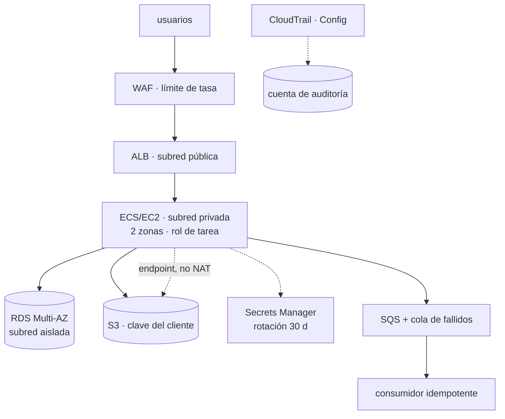

# 036 — Proyecto: aplicación de tres capas en AWS

> [← 035 · KMS, Secrets Manager, WAF y controles de seguridad](../../part-02-aws-core-platform/035-kms-secrets-manager-waf-y-controles-de-seguridad/README.md) · [Índice de la parte](../README.md) · [037 · Tenant, management groups, suscripciones y resource groups →](../../part-03-azure-core-platform/037-tenant-management-groups-suscripciones-y-resource-groups/README.md)

**Parte:** 02 — AWS: plataforma esencial<br>
**Nivel:** intermedio · **Horas estimadas:** 8<br>
**Laboratorio:** `capstone` · **Estado:** `EXECUTABLE_CORE`

## 🎯 Propósito

Integrar las once clases anteriores en una plataforma que funcione, se observe, falle de forma controlada y cueste lo que se decidió que costara. No es un ejercicio de montar servicios: es demostrar con evidencia que cada decisión de las clases 025 a 035 produce el efecto que se le atribuyó, incluidas las que resulten estar mal.

## 📚 Resultados de aprendizaje

Al finalizar podrás:

1. **Ensamblar** una aplicación de tres capas con las decisiones de las once clases previas, cada una justificada.
2. **Demostrar** con prueba negativa que los controles de identidad, red y cifrado deniegan lo que deben.
3. **Medir** una línea base de latencia y coste unitario que sirva de referencia para las partes siguientes.
4. **Provocar** tres fallos —zona, dependencia y credencial— y documentar el comportamiento observado.
5. **Entregar** un paquete de evidencia que otra persona pueda verificar sin conocimiento tácito.

## 🧩 Conceptos centrales

| Concepto | Comprensión verificable |
|---|---|
| `paquete de evidencia` | Conjunto de salidas reproducibles que respaldan cada afirmación del diseño. Sustituye a «está bien configurado» por el comando ejecutado y su resultado. |
| `prueba de fallo` | Inyección deliberada de una avería para observar el comportamiento real. Un diseño resiliente que nunca se probó es una hipótesis, no una propiedad. |
| `línea base` | Medición inicial de latencia, rendimiento y coste unitario contra la que se comparará todo cambio posterior. Sin ella, «mejoró» es una opinión. |
| `criterio de aceptación` | Condición verificable que decide si el trabajo está terminado. Debe poder evaluarla alguien distinto de quien lo construyó. |
| `riesgo residual` | Lo que sigue siendo vulnerable tras aplicar los controles. Nombrarlo es parte de la entrega; omitirlo convierte un límite conocido en una sorpresa futura. |

## 🧠 Modelo mental

Una cuenta AWS es una frontera de seguridad y facturación; los servicios se combinan mediante contratos, no como una lista de productos aislados.

Aplicado a esta clase, separa siempre cuatro planos: **intención** (qué necesita el usuario),
**configuración** (qué declaramos), **estado observado** (qué existe de verdad) y
**evidencia** (cómo sabemos que cumple). Confundirlos produce diseños que se ven correctos
en un diagrama pero fallan al operar.

## 🗺️ Flujo de razonamiento



## 📖 Desarrollo

### 1. La arquitectura y de dónde sale cada decisión

Nada en este capstone es una elección nueva: todo procede de una clase anterior, y esa trazabilidad es lo que hay que poder defender.

| Componente | Decisión | Viene de |
|---|---|---|
| Cuentas separadas por entorno | Cuotas y radio de impacto | 017, 025 |
| Rol federado para el pipeline | Cero credenciales de larga vida | 018, 026 |
| Subred aislada para la base | Sin ruta a internet | 027 |
| Endpoints en vez de NAT | 86 % del tráfico no va a internet | 027 |
| `m7g` en vez de `t3` | La media supera la línea base | 028 |
| Seguimiento de objetivo | Histéresis automática | 016, 029 |
| Drenado de 60 s | Mayor que la petición más larga | 029 |
| Bloqueo de objetos | El versionado no frena un borrado con permisos | 010, 030 |
| Índice compuesto | El orden estaba fuera del índice | 031 |
| Cola con fallidos e idempotencia | Entrega al menos una vez | 009, 033 |
| Clave del cliente | Segunda barrera independiente | 035 |
| Modo cuenta antes de bloquear | 509 falsos positivos medidos | 035 |

La columna derecha es el entregable real. **Una arquitectura sin esa columna es una lista de servicios**, y es exactamente lo que la clase 021 identificaba como diseño sin compromisos declarados.

Y hay decisiones que se toman **en contra** de lo que parece mejor, y también se registran: dos zonas en vez de tres porque el requisito es 21,6 min/mes y con dos ya sobran 20; RDS en vez de DynamoDB porque la agregación mensual no tiene equivalente. Justificar lo que **no** se hizo es tan parte de la defensa como lo que sí.

### 2. Cada control necesita su prueba negativa

La configuración no demuestra el efecto. El paquete de evidencia se construye ejecutando intentos que deben fallar **y** intentos que deben funcionar:

```bash
# Identidad: un repositorio ajeno no puede asumir el rol
$ (desde repo externo) aws sts assume-role-with-web-identity ...
AccessDenied                                                          ✓

# Red: la base de datos no alcanza internet
$ aws ssm start-session --target $ID_BASTION
$ curl -m 5 https://example.com
curl: (28) Connection timed out                                        ✓
$ aws secretsmanager get-secret-value --secret-id cloudshop/db --query Name
"cloudshop/db"                                                        ✓ el endpoint sí

# Cifrado: sin permiso de clave no se lee, aunque haya permiso de S3
$ aws s3api get-object --bucket cloudshop-facturas --key f.pdf /tmp/x --profile sin-kms
not authorized to perform: kms:Decrypt                                 ✓

# Almacenamiento: no se puede reabrir al público
$ aws s3api put-bucket-acl --bucket cloudshop-facturas --acl public-read
AccessDenied ... blocked by the public access block                    ✓

# Guardarraíl: no se puede desactivar la auditoría
$ aws cloudtrail stop-logging --name org-trail
AccessDenied ... explicit deny in a service control policy             ✓
```

Y las positivas, que son las que se olvidan:

```bash
$ curl -s -o /dev/null -w '%{http_code}\n' https://api.cloudshop.cl/health/ready
200                                                                   ✓
$ curl -s -X POST https://api.cloudshop.cl/opiniones \
    -d '{"texto":"llegó rápido -- muy bien"}' -o /dev/null -w '%{http_code}\n'
200                                                                   ✓ WAF no bloquea
```

**Cinco negativas y dos positivas.** Un control que deniega todo también «pasa» las cinco primeras, y solo las positivas distinguen seguridad de indisponibilidad.

### 3. La línea base es el entregable que más dura

Las partes 03 a 23 compararán contra estos números, así que hay que medirlos bien y guardarlos versionados.

```bash
$ hey -z 120s -c 50 https://api.cloudshop.cl/productos/A-1042

Summary:
  Requests/sec: 987.42
Latency distribution:
  50% in 0.0384 secs
  95% in 0.0912 secs
  99% in 0.1847 secs
Status code distribution:
  [200] 118496 responses
```

Se verifica la coherencia con la ley de Little de la clase 011:

```text
L = λ × W = 987 × 0,0384 = 37,9 concurrentes
solicitados: 50 → hay holgura; la medida no está limitada por el generador  ✓
```

Si `L` hubiera dado 50 exactos, el número mediría el generador de carga y no el servicio.

Y el coste unitario, con el denominador de la clase 011:

```text                              USD/mes
cómputo (3 × m7g.large)              139,00
base de datos (Multi-AZ)             412,00
almacenamiento y endpoints            58,80
balanceador y WAF                     47,20
observabilidad                        31,40
                                     -------
total                                688,40

pedidos/mes                          980.000
coste unitario            688,40 / 980.000 = 0,000702 USD/pedido
```

Se registra como contrato comparable, con el escenario incluido:

```json
{"escenario":"productos-lectura","concurrencia":50,"duracion_s":120,
 "rps":987.4,"p50_ms":38.4,"p95_ms":91.2,"p99_ms":184.7,"errores":0,
 "coste_mensual_usd":688.40,"coste_unitario_usd":0.000702,
 "zonas":2,"instancias":3,"fecha":"2026-08-01"}
```

La relación **p99/p50 = 4,8×** es la métrica a vigilar entre versiones: si crece, la cola se alarga aunque la media no se mueva.

### 4. Tres fallos provocados y lo que enseña cada uno

**Fallo 1 — pérdida de una zona.**

```bash
$ aws ec2 modify-network-acl-entry --network-acl-id $ACL_ZONA_B \
    --rule-number 100 --egress --protocol -1 --rule-action deny --cidr-block 0.0.0.0/0
```

```text
t+0    se aísla la zona B
t+31   el balanceador marca insanos sus destinos (10 s × 3)
t+31   el tráfico se concentra en la zona A
t+34   RDS conmuta a la réplica de la zona A
t+96   el autoescalado añade 2 instancias en A
p95 durante la ventana:  91 ms → 214 ms → 97 ms
errores:  0
```

Los 31 segundos de detección son el coste de los parámetros de la clase 029. Bajarlos aumentaría los falsos positivos.

**Fallo 2 — dependencia opcional degradada.** No caída, sino lenta, que es el caso que rompe sistemas:

```bash
$ aws ssm send-command --targets Key=tag:Servicio,Values=recomendaciones \
    --document-name AWS-RunShellScript \
    --parameters 'commands=["tc qdisc add dev eth0 root netem delay 800ms"]'
```

```text
p95 sin degradación   91,2 ms
p95 con la dependencia a 800 ms   94,7 ms
```

El plazo de 150 ms corta la llamada. **Sin él, cada petición ocuparía un trabajador 800 ms y por la ley de Little la concurrencia necesaria se multiplicaría por ocho.**

**Fallo 3 — credencial comprometida.** Se simula qué obtiene un atacante con el rol de tarea:

```bash
$ aws iam list-users                    AccessDenied     ✓
$ aws rds delete-db-instance ...        AccessDenied     ✓
$ aws s3 rm s3://cloudshop-facturas/... AccessDenied     ✓ (bloqueo de objetos)
$ aws s3 ls s3://cloudshop-facturas/    lista objetos    ← SÍ puede
$ aws s3 cp s3://cloudshop-facturas/f-1042.pdf .   descarga    ← SÍ puede
```

**El rol puede leer y exfiltrar las facturas.** No es un fallo de configuración: es el permiso que la aplicación necesita. El control que queda es detectivo —alerta por volumen anómalo de lecturas— y hay que declararlo como riesgo residual, no ocultarlo.

### 5. La entrega: sin conocimiento tácito

El criterio de aceptación no es que funcione, sino que **otra persona lo verifique sin preguntarte nada**.

```text
capstone-aws/
├── README.md          qué es, cómo se despliega, cómo se comprueba, cómo se retira
├── infra/             la infraestructura declarada, no clicada
├── evidencia/
│   ├── negativas.md   los 5 intentos que deben fallar, con su salida
│   ├── positivas.md   los 2 que deben funcionar
│   ├── baseline.json  la línea base con su escenario
│   ├── fallo-zona.md  cronología medida
│   ├── fallo-dep.md   p95 con y sin degradación
│   └── fallo-cred.md  qué obtiene un atacante con el rol de tarea
├── adr/               las decisiones con sus alternativas descartadas
└── verify.sh          ejecuta todas las comprobaciones y sale != 0 si alguna falla
```

`verify.sh` es la pieza que convierte la evidencia en algo vivo:

```bash
$ ./verify.sh
✓ rol federado deniega desde repositorio ajeno
✓ base de datos sin salida a internet
✓ objeto no legible sin permiso de clave
✓ bucket no reabrible al público
✓ CloudTrail no desactivable
✓ salud del servicio: 200
✓ opinión con caracteres especiales: 200
7/7 comprobaciones correctas
```

Un script que imprime «OK» y siempre sale 0 no verifica nada: **el código de salida es el contrato**, como en la clase 012. Y con él, estas mismas comprobaciones se ejecutan en CI en la parte 08 sin cambiar una línea.

**Riesgos residuales que se entregan declarados:**

```text
1. El rol de tarea puede leer y exfiltrar facturas. Mitigación detectiva
   (alerta por volumen), no preventiva. Aceptado por el responsable de datos.
2. No sobrevive a un fallo regional completo. Aceptado: no es requisito hoy.
3. La línea base se midió con datos sintéticos; la distribución real de
   tamaños de pedido puede diferir.
4. El WAF excluye la regla de inyección en /opiniones. Compensado con
   validación y consultas parametrizadas en esa ruta.
```

Esa lista es la parte más valiosa de la entrega. **Un capstone sin riesgos residuales declarados no es que no los tenga: es que no los buscó.**

## 🔬 Ejemplo trabajado

**Entrega del capstone de la parte 02, con las cifras que se llevan a la parte 03.**

**Verificación completa:**

```bash
$ ./verify.sh
✓ rol federado deniega desde repositorio ajeno       AccessDenied
✓ base de datos sin salida a internet                timeout a los 5 s
✓ objeto no legible sin permiso de clave             kms:Decrypt denegado
✓ bucket no reabrible al público                     bloqueado
✓ CloudTrail no desactivable                         deny de SCP
✓ salud del servicio                                 200
✓ opinión con " -- " y ";"                           200
7/7 correctas
```

**Línea base:**

```text
rps 987,4 · p50 38,4 ms · p95 91,2 ms · p99 184,7 ms · errores 0
L = 987 × 0,0384 = 37,9 de 50 solicitados → medida válida
p99/p50 = 4,8×
coste 688,40 USD/mes · 0,000702 USD/pedido
```

**Los tres fallos, con lo aprendido en cada uno:**

```text                    detección   p95 durante   errores   lección
zona aislada               31 s        214 ms        0       el coste de detección
                                                             son los parámetros de salud
dependencia a 800 ms        —          94,7 ms       0       el plazo hizo el trabajo;
                                                             sin él, ×8 de concurrencia
credencial comprometida     —            —           —       lee facturas: riesgo residual
```

**Un hallazgo que la prueba de fallo destapó y la configuración no.** Durante el aislamiento de la zona B:

```bash
$ aws logs filter-log-events --log-group-name /aws/ecs/cloudshop \
    --filter-pattern 'ERROR' --start-time ... --query 'length(events)'
0
$ aws sqs get-queue-attributes --queue-url $URL_DLQ \
    --attribute-names ApproximateNumberOfMessagesVisible
{"ApproximateNumberOfMessagesVisible": "14"}
```

**14 mensajes en la cola de fallidos** sin ningún error en los logs. El consumidor vivía solo en la zona B; al aislarla, sus mensajes agotaron reintentos mientras el servicio HTTP —que sí estaba en dos zonas— seguía en verde.

```text
síntoma observable   ninguno: cero errores, p95 aceptable, alarmas en verde
consecuencia real    14 pedidos sin facturar
causa                el consumidor asíncrono no estaba en dos zonas
```

Se corrige y se añade lo que faltaba:

```text
1. consumidor desplegado en dos zonas
2. alerta sobre la cola de fallidos con umbral cero (clase 033)
3. la prueba de fallo de zona pasa a incluir la ruta asíncrona,
   no solo la síncrona
```

**El valor del capstone fue este hallazgo.** Todo estaba correctamente configurado, todas las pruebas negativas pasaban, y había un camino —el asíncrono— que nadie había probado porque el fallo no era visible desde fuera.

**Se entrega a la parte 03 con:**

```text
línea base       para comparar la misma aplicación en Azure
ADR              9 decisiones con sus alternativas descartadas
4 riesgos residuales declarados y aceptados por su responsable
verify.sh        reutilizable, con código de salida
```

Y la pregunta que abre la parte siguiente: **de estas nueve decisiones, ¿cuáles son de arquitectura y cuáles son de proveedor?** Las primeras deberían reaparecer en Azure con otro nombre; las segundas, no reaparecer en absoluto.

## 🧪 Laboratorio guiado

Ejecuta desde la raíz:

```bash
python classes/part-02-aws-core-platform/036-proyecto-aplicacion-de-tres-capas-en-aws/lab.py
```

El laboratorio selecciona el motor de práctica **`capstone`** y produce
`lab_result.json`. El escenario, sus comprobaciones y el artefacto esperado corresponden a
esta clase; no requiere credenciales y deja explícito qué debe revalidarse en un sandbox real.

1. Lee `exercise.steps` y formula una predicción antes de ejecutar.
2. Ejecuta la práctica y verifica todos los elementos de `checks`.
3. Provoca el caso de `negative_test` y explica la señal observada.
4. Materializa `plataforma-aws` en `evidence/` usando la plantilla indicada.
5. Para proveedor real, sigue `sandbox.requires`, registra costo y ejecuta `destroy`.

### Evidencia esperada

El artefacto principal es un incremento integrado, demostrable y documentado. Además, la entrega debe incluir el comando ejecutado,
la salida estructurada y una conclusión que no exceda lo observado.

## 🏆 Reto verificable

Construye **`plataforma-aws`** para el caso CloudShop. Incluye una alternativa descartada,
un supuesto que pueda falsarse, una prueba de fallo y una decisión de rollback.

## ✅ Criterio de aceptación

- [ ] `lab.py` termina con código 0 y genera JSON válido.
- [ ] La entrega conecta al menos tres requisitos con mecanismos verificables.
- [ ] Existe una prueba positiva y una prueba negativa con evidencia.
- [ ] Seguridad, costo y operación aparecen como decisiones, no como anexos.
- [ ] Se declara una limitación y una condición que obligaría a revisar el diseño.
- [ ] Otra persona puede repetir el recorrido sin conocimiento tácito.

## ⚠️ Errores frecuentes

| Síntoma | Causa probable | Corrección |
|---|---|---|
| El capstone es una lista de servicios desplegados | Falta la trazabilidad de cada decisión a la clase y al requisito que la motivó | Cada componente debe citar qué requisito satisface y qué alternativa se descartó. |
| Todas las pruebas negativas pasan y el sistema no funciona | Un control que deniega todo también las pasa; faltan las pruebas positivas | Empareja cada prueba negativa con una positiva del acceso legítimo. |
| Un fallo de zona deja trabajo asíncrono sin procesar y nada lo detecta | Solo se probó el camino síncrono, que sí estaba en dos zonas | Incluye colas y consumidores en la prueba de fallo, y alerta sobre la cola de fallidos. |
| No se puede afirmar si un cambio posterior mejoró o empeoró | No hay línea base con escenario, percentiles y coste unitario | Registra la medición versionada junto al código, con la carga y la duración usadas. |
| La entrega depende de que su autor explique algo | Conocimiento tácito no escrito y verificación no automatizada | Exige que otra persona ejecute `verify.sh` sin ayuda; lo que pregunte es lo que falta en el README. |

## 🛡️ Seguridad, ética y costo

Trabaja con cuentas propias o sandboxes autorizados. No publiques secretos, identificadores
reales ni datos personales. Antes de crear recursos pagos define presupuesto, etiquetas y
comando de destrucción; después verifica que no queden recursos huérfanos. Los ejemplos
locales enseñan contratos, pero no certifican cumplimiento ni disponibilidad de producción.

## ❓ Preguntas de comprobación

1. Elige tres componentes de tu capstone y di de qué clase y de qué requisito procede cada decisión.
2. ¿Por qué cinco pruebas negativas correctas no demuestran que el sistema sea seguro Y usable?
3. Tu medición da L = 50 con concurrencia solicitada de 50. ¿Qué estás midiendo en realidad?
4. Durante un fallo de zona no hay errores ni alarmas, pero se pierden pedidos. ¿Dónde buscarías?
5. De las decisiones de tu capstone, ¿cuáles esperas volver a tomar en Azure y cuáles no reaparecerán?

## 🔗 Referencias

- AWS (2024). *Well-Architected Framework: the review process* — cómo estructurar la revisión de una carga. <https://docs.aws.amazon.com/wellarchitected/latest/framework/the-review-process.html>
- AWS (2024). *Fault Injection Service* — inyección controlada de fallos de zona, red y recursos. <https://docs.aws.amazon.com/fis/latest/userguide/what-is.html>
- Beyer, B. et al., eds. (2018). *The Site Reliability Workbook*, cap. 5 — pruebas de fiabilidad y game days. <https://sre.google/workbook/testing-reliability/>
- Nygard, M. (2018). *Release It!*, 2.ª ed., cap. 5 — plazos, mamparos y degradación bajo dependencia lenta.
- Nygard, M. (2011). *Documenting Architecture Decisions* — formato de los ADR que acompañan la entrega. <https://www.cognitect.com/blog/2011/11/15/documenting-architecture-decisions>
- Documentación oficial vigente del servicio implementado; registra URL y fecha de consulta.

---

> [Evaluación](assessment.md) · [Contrato de clase](lesson.yaml) · [Índice de la parte](../README.md)

**📥 Descargar:** [Parte 02 en PDF](../../../site/downloads/partes/manual-parte-02-aws-core-platform.pdf) · [Recorrido de AWS en PDF](../../../site/downloads/nubes/manual-aws.pdf) · [Manual integral](../../../site/downloads/multi-cloud-engineering-manual-v2.0.pdf)

| Anterior | Índice | Siguiente |
|---|---|---|
| [← 035 · KMS, Secrets Manager, WAF y controles de seguridad](../../part-02-aws-core-platform/035-kms-secrets-manager-waf-y-controles-de-seguridad/README.md) | [Parte 02](../README.md) · [Programa](../../README.md) | [037 · Tenant, management groups, suscripciones y resource groups →](../../part-03-azure-core-platform/037-tenant-management-groups-suscripciones-y-resource-groups/README.md) |
