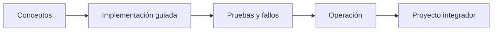

# Parte 02 — AWS: plataforma esencial

> [← Parte 01](../part-01-cloud-principles-strategy-adoption/README.md) · [Índice completo](../README.md) · [Parte 03 →](../part-03-azure-core-platform/README.md)

**📥 Descargar:** [Esta parte en PDF](../../site/downloads/partes/manual-parte-02-aws-core-platform.pdf) · [Recorrido de AWS en PDF](../../site/downloads/nubes/manual-aws.pdf) · [Manual integral](../../site/downloads/multi-cloud-engineering-manual-v2.0.pdf)

**Nivel:** intermedio · **Clases:** 12 · **Duración sugerida:** 6–8 semanas

Diseñar y operar una carga completa en AWS con controles explícitos.

## Resultados de la parte

Al completar esta parte podrás explicar el dominio con lenguaje independiente del proveedor,
implementar sus mecanismos esenciales, diagnosticar fallos y defender decisiones mediante
evidencia, costo, seguridad y objetivos de confiabilidad.

## Modelo mental

Una cuenta AWS es una frontera de seguridad y facturación; los servicios se combinan mediante contratos, no como una lista de productos aislados.

## Secuencia

## Clases

| ID | Clase | Laboratorio | Horas |
|---:|---|---|---:|
| 025 | [Organizations, cuentas, OU, SCP y landing zone](025-organizations-cuentas-ou-scp-y-landing-zone/README.md) | `governance` | 4 |
| 026 | [IAM, roles, políticas, STS y federación](026-iam-roles-politicas-sts-y-federacion/README.md) | `iam` | 4 |
| 027 | [VPC, subredes, rutas, NAT, endpoints y seguridad](027-vpc-subredes-rutas-nat-endpoints-y-seguridad/README.md) | `network` | 4 |
| 028 | [EC2, AMI, EBS y selección de capacidad](028-ec2-ami-ebs-y-seleccion-de-capacidad/README.md) | `compute` | 4 |
| 029 | [Elastic Load Balancing y Auto Scaling](029-elastic-load-balancing-y-auto-scaling/README.md) | `reliability` | 4 |
| 030 | [S3: objetos, versionado, lifecycle y replicación](030-s3-objetos-versionado-lifecycle-y-replicacion/README.md) | `storage` | 4 |
| 031 | [RDS, DynamoDB y ElastiCache: decisión de datos](031-rds-dynamodb-y-elasticache-decision-de-datos/README.md) | `data` | 4 |
| 032 | [Lambda, API Gateway y Step Functions](032-lambda-api-gateway-y-step-functions/README.md) | `serverless` | 4 |
| 033 | [SQS, SNS y EventBridge](033-sqs-sns-y-eventbridge/README.md) | `messaging` | 4 |
| 034 | [CloudWatch, CloudTrail, Config y Systems Manager](034-cloudwatch-cloudtrail-config-y-systems-manager/README.md) | `observability` | 4 |
| 035 | [KMS, Secrets Manager, WAF y controles de seguridad](035-kms-secrets-manager-waf-y-controles-de-seguridad/README.md) | `security` | 4 |
| 036 | [Proyecto: aplicación de tres capas en AWS](036-proyecto-aplicacion-de-tres-capas-en-aws/README.md) | `capstone` | 8 |

## Evaluación de la parte

- 35 % laboratorios y evidencia reproducible.
- 25 % retos verificables.
- 20 % decisiones y ADR.
- 10 % seguridad, confiabilidad y costo.
- 10 % proyecto integrador de la parte.

Se aprueba con 80 % de clases en nivel B o superior y el proyecto integrador reproducible.

## Pauta bibliográfica

- AWS Well-Architected Framework — AWS.
- AWS Cookbook — John Culkin y Mike Zazon.
- Amazon Web Services in Action — Wittig y Wittig.
