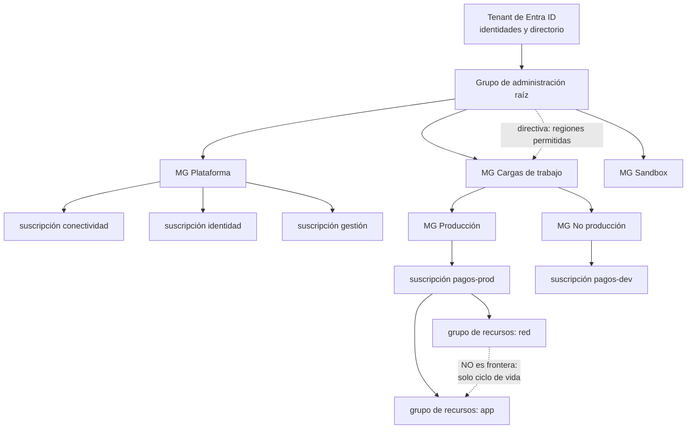

# 037 — Tenant, management groups, suscripciones y resource groups

> [← 036 · Proyecto: aplicación de tres capas en AWS](../../part-02-aws-core-platform/036-proyecto-aplicacion-de-tres-capas-en-aws/README.md) · [Índice de la parte](../README.md) · [038 · Microsoft Entra ID, RBAC, managed identities y PIM →](../../part-03-azure-core-platform/038-microsoft-entra-id-rbac-managed-identities-y-pim/README.md)

**Parte:** 03 — Azure: plataforma esencial<br>
**Nivel:** intermedio · **Horas estimadas:** 4<br>
**Laboratorio:** `governance` · **Estado:** `EXECUTABLE_CORE`

## 🎯 Propósito

Construir la jerarquía de Azure y descubrir en qué se parece y en qué no a la de AWS. El ejercicio central de esta parte no es aprender nombres nuevos: es distinguir qué decisiones de la parte 02 eran de arquitectura —y reaparecen— y cuáles eran de proveedor, que es la pregunta con la que cerró la clase 036.

## 📚 Resultados de aprendizaje

Al finalizar podrás:

1. **Traducir** la jerarquía de Azure a los conceptos neutrales de la clase 017 y señalar dónde no hay equivalencia.
2. **Explicar** por qué el grupo de recursos no es una frontera de aislamiento y qué sí lo es.
3. **Escribir** una directiva que restrinja regiones sin bloquear los recursos globales.
4. **Distinguir** cuota de suscripción de límite de servicio y anticipar cuál se agota antes.
5. **Diseñar** grupos de administración por régimen de gobierno, no por organigrama.

## 🧩 Conceptos centrales

| Concepto | Comprensión verificable |
|---|---|
| `tenant` | Instancia de Microsoft Entra ID que contiene identidades y suscripciones. Es la raíz de la jerarquía y el equivalente conceptual de la organización, con una diferencia importante: la identidad vive ahí, no en la suscripción. |
| `suscripción` | Frontera de aislamiento, facturación y cuota. Es el equivalente funcional de la cuenta de AWS y del proyecto de Google Cloud. |
| `grupo de recursos` | Contenedor de recursos con ciclo de vida común dentro de una suscripción. No aísla nada: es unidad de despliegue y de borrado, y confundirlo con frontera de seguridad es el error más frecuente al llegar de AWS. |
| `directiva` | Regla que evalúa recursos y puede auditar, denegar, modificar o desplegar. A diferencia de una SCP, puede corregir además de prohibir, y se aplica también a lo que ya existe. |
| `grupo de administración` | Agrupador de suscripciones sobre el que se heredan directivas y asignaciones de rol. Admite hasta seis niveles de profundidad bajo la raíz. |

## 🧠 Modelo mental

En Azure, identidad y jerarquía organizacional preceden al recurso: tenant, management group, suscripción y resource group determinan el alcance de control.

Aplicado a esta clase, separa siempre cuatro planos: **intención** (qué necesita el usuario),
**configuración** (qué declaramos), **estado observado** (qué existe de verdad) y
**evidencia** (cómo sabemos que cumple). Confundirlos produce diseños que se ven correctos
en un diagrama pero fallan al operar.

## 🗺️ Flujo de razonamiento



## 📖 Desarrollo

### 1. El mapa de equivalencias, y dónde se rompe

| Concepto neutral (clase 017) | AWS | Azure | Google Cloud |
|---|---|---|---|
| Raíz | Organización | **Tenant** | Organización |
| Agrupador | Unidad organizativa | **Grupo de administración** | Carpeta |
| **Frontera de aislamiento** | Cuenta | **Suscripción** | Proyecto |
| Agrupador interno | — | **Grupo de recursos** | — |
| Política heredada | SCP | **Azure Policy** | Restricción de organización |

Dos diferencias cambian el diseño y no son cosméticas:

**La identidad vive en el tenant, no en la suscripción.** En AWS cada cuenta tiene su propio IAM y el acceso entre cuentas exige asumir roles. En Azure, un usuario del tenant puede tener asignaciones de rol en varias suscripciones sin ningún salto: **la frontera de identidad y la de aislamiento no coinciden**. Eso simplifica la operación y hace que una identidad comprometida alcance potencialmente más superficie, así que la separación por asignaciones de rol importa más que en AWS.

**Existe un nivel intermedio que AWS no tiene.** El grupo de recursos agrupa recursos con ciclo de vida común. Su propiedad más útil es que **borrarlo borra todo lo que contiene**, lo que lo hace excelente para entornos efímeros y peligroso si se confunde con una frontera de seguridad.

Y una asimetría de las directivas frente a las SCP: **Azure Policy puede modificar y desplegar, no solo denegar**. Una directiva con efecto `DeployIfNotExists` puede añadir el diagnóstico que falta a un recurso recién creado. Es más potente y exige más cuidado: una directiva de corrección mal escrita cambia recursos en producción sin que nadie lo pida.

### 2. El grupo de recursos no aísla

Es el error de traducción más común al llegar de AWS. Un grupo de recursos parece una cuenta pequeña y no lo es:

```text
grupo de recursos
  ✓ ciclo de vida común: se borra entero
  ✓ ámbito de asignación de roles
  ✓ ámbito de aplicación de directivas
  ✗ NO tiene cuotas propias
  ✗ NO es frontera de facturación
  ✗ NO impide que un recurso hable con otro de otro grupo
```

Las dos primeras exclusiones son las que producen incidentes. **Las cuotas son de la suscripción**, así que dos grupos de recursos en la misma suscripción compiten por los mismos núcleos disponibles — exactamente el problema de la clase 017 con otro nombre:

```bash
$ az vm list-usage --location brazilsouth --query "[?contains(name.value,'cores')].{n:name.value,u:currentValue,l:limit}" -o table
n                        u     l
-----------------------  ----  ----
cores                    186   200
standardDSv3Family       142   150
```

186 de 200 núcleos consumidos en la suscripción, sin importar en cuántos grupos de recursos estén repartidos. Un experimento en el grupo «desarrollo» deja sin capacidad al grupo «producción» si comparten suscripción.

La tercera exclusión también sorprende: **no hay aislamiento de red entre grupos de recursos**. Dos máquinas en la misma red virtual se hablan aunque estén en grupos distintos; el aislamiento de red lo dan la red virtual y los grupos de seguridad, no la organización de recursos.

La regla de traducción: **donde en AWS separarías por cuenta, en Azure separa por suscripción**. El grupo de recursos es la unidad de despliegue, no de aislamiento.

### 3. Directivas: cuatro efectos y cuándo usar cada uno

Azure Policy va más allá de prohibir:

| Efecto | Qué hace | Cuándo |
|---|---|---|
| `Audit` | Marca no conforme, no impide | **Siempre primero**: medir antes de bloquear |
| `Deny` | Impide la creación o el cambio | Controles duros, tras medir |
| `Modify` | Añade o cambia propiedades | Etiquetas obligatorias |
| `DeployIfNotExists` | Despliega un recurso asociado | Diagnóstico, agentes, copias |

La disciplina es la misma que con el WAF de la clase 035: **empezar en `Audit`**. Una directiva `Deny` aplicada sin medir bloquea despliegues legítimos, y el equipo la desactiva en el primer incidente en vez de corregirla.

```bash
$ az policy assignment create --name regiones-permitidas \
    --scope /providers/Microsoft.Management/managementGroups/mg-cargas \
    --policy "e56962a6-4747-49cd-b67b-bf8b01975c4c" \
    --params '{"listOfAllowedLocations":{"value":["brazilsouth","eastus"]}}' \
    --enforcement-mode DoNotEnforce      # equivale a Audit
```

Y la restricción de regiones tiene aquí el mismo problema que en la clase 025, con distinta solución. **Varios tipos de recurso son globales** y su ubicación declarada es `global`:

```text
Microsoft.Network/trafficManagerProfiles
Microsoft.Network/dnsZones
Microsoft.Cdn/profiles
Microsoft.ManagedIdentity/userAssignedIdentities  (en algunos casos)
```

La directiva integrada de ubicaciones permitidas **ya excluye los recursos globales**, pero una escrita a mano no. Comprobarlo antes de aplicarla evita bloquear la creación de zonas DNS sin entender por qué.

Y un detalle operativo: **las directivas evalúan lo existente, no solo lo nuevo**. Tras asignar una, aparece un informe de conformidad de todo lo que ya estaba. Es una ventaja sobre las SCP —que solo actúan sobre peticiones nuevas— y también una fuente de ruido inicial que hay que triar.

### 4. Cuotas: dos límites que se confunden

Azure tiene dos clases de límite y se agotan por motivos distintos:

```text
cuota de suscripción    núcleos por familia y región, IP públicas, redes virtuales
                        → ampliable con solicitud, tarda horas o días

límite de servicio      reglas por grupo de seguridad, tamaño de plantilla,
                        recursos por grupo de recursos
                        → normalmente NO ampliable
```

La primera es la que aparece en el autoescalado y la segunda en el despliegue. Un caso frecuente del segundo tipo:

```text
límite de reglas por grupo de seguridad de red: 1.000
un equipo genera una regla por cliente autorizado
→ el despliegue falla al llegar a 1.000 y NO se puede ampliar
→ la corrección exige rediseñar: grupos de seguridad de aplicación
  o listas de prefijos en vez de reglas individuales
```

La consulta de cuotas debe formar parte del plan de capacidad, no de la respuesta a incidentes:

```bash
$ az vm list-usage --location brazilsouth -o json \
  | jq -r '.[] | select((.currentValue / .limit) > 0.8)
           | "\(.name.value): \(.currentValue)/\(.limit)"'
standardDSv3Family: 142/150
```

El 80 % como umbral de alerta, igual que en la clase 017. **Ampliar una cuota tarda horas o días**, así que descubrirla durante un pico significa que ya no es una palanca disponible.

Y una diferencia con AWS que conviene saber: en Azure las cuotas de núcleos son **por familia de máquina virtual además de por total**. Tener 60 núcleos libres del total no sirve si la familia concreta que necesitas está al límite, y el mensaje de error no siempre lo deja claro.

### 5. Grupos de administración por gobierno, no por organigrama

El mismo criterio de la clase 017: agrupar por **qué directiva se aplica**, porque los organigramas se reorganizan y mover suscripciones entre grupos cambia las directivas heredadas.

La estructura de referencia de Microsoft para escala empresarial:

```text
raíz
├── Plataforma           directivas estrictas, la opera el equipo central
│   ├── conectividad     redes virtuales de concentrador, DNS privado
│   ├── identidad        controladores de dominio, servicios de identidad
│   └── gestión          registros, copias, automatización
├── Cargas de trabajo
│   ├── Producción       regiones, cifrado obligatorio, diagnóstico forzado
│   └── No producción    regiones, límite de gasto
├── Sandbox              directivas laxas, presupuesto duro, caducidad
└── Desmantelado         suscripciones en retirada, solo lectura
```

Dos elementos que AWS no tiene explícitos y aquí conviene aprovechar:

**El grupo «Desmantelado»** recoge suscripciones que se van a cerrar, con directivas que impiden crear nada nuevo. Evita que una suscripción en retirada siga acumulando recursos durante meses.

**La separación de plataforma en tres suscripciones** —conectividad, identidad y gestión— responde a que cada una tiene un ciclo de vida y un equipo distintos. Es el equivalente a las cuentas de red, seguridad y auditoría de la clase 025.

Y una restricción práctica: **la profundidad máxima es de seis niveles** bajo la raíz. Suficiente, pero conviene no gastarlos en reflejar jerarquías organizativas que cambiarán.

Un recurso que **no** debe alojar cargas: el grupo de administración raíz. Igual que la cuenta de gestión de AWS, es el único punto sin nada por encima, y las asignaciones que se hacen ahí se heredan a todo el tenant.

## 🔬 Ejemplo trabajado

**CloudShop despliega en Azure la misma aplicación de la parte 02. El equipo replica la estructura de AWS literalmente: un grupo de recursos por lo que allí era una cuenta.** A las tres semanas, un despliegue de pruebas deja producción sin capacidad.

El incidente, idéntico al de la clase 017 con otro vocabulario:

```bash
$ az vm list-usage --location brazilsouth \
    --query "[?name.value=='standardDSv3Family'].{u:currentValue,l:limit}" -o tsv
148   150
$ az group list --query "[].name" -o tsv
rg-cloudshop-prod
rg-cloudshop-dev
rg-cloudshop-red
```

**Tres grupos de recursos en una sola suscripción.** El equipo tradujo «cuenta» por «grupo de recursos» y las cuotas no lo respetan:

```text
cuota de la familia DSv3      150 núcleos
producción en régimen          88
experimento en rg-dev          60
total                         148 → producción no puede escalar
```

Se verifica que el grupo de recursos tampoco aísla la red:

```bash
$ az network vnet subnet list -g rg-cloudshop-red --vnet-name vnet-cloudshop \
    --query "[].name" -o tsv
snet-prod
snet-dev
# una VM de rg-dev en snet-dev alcanza una de rg-prod en snet-prod:
$ az network watcher test-ip-flow --vm vm-dev-01 --direction Outbound \
    --local 10.30.2.4:0 --remote 10.30.1.7:5432 --protocol TCP -o tsv --query access
Allow
```

**Ni cuotas ni red separadas.** La traducción era incorrecta.

**Rediseño con la equivalencia correcta:**

```text
tenant cloudshop
└── mg-raiz
    ├── mg-plataforma
    │   └── sub-conectividad      red de concentrador, DNS privado
    ├── mg-cargas
    │   ├── mg-produccion
    │   │   └── sub-cloudshop-prod    cuota propia
    │   └── mg-no-produccion
    │       └── sub-cloudshop-dev     cuota propia
    └── mg-sandbox
        └── sub-lab-*                 presupuesto duro
```

**Directiva de regiones, primero en modo auditoría:**

```bash
$ az policy assignment create --name regiones --display-name "Regiones permitidas" \
    --scope /providers/Microsoft.Management/managementGroups/mg-cargas \
    --policy e56962a6-4747-49cd-b67b-bf8b01975c4c \
    --params '{"listOfAllowedLocations":{"value":["brazilsouth","eastus2"]}}' \
    --enforcement-mode DoNotEnforce
```

Tras 7 días, el informe de conformidad revela algo que nadie había notado:

```bash
$ az policy state summarize --management-group mg-cargas \
    --query "policyAssignments[0].results.{conformes:compliantResources,no:nonCompliantResources}"
{"conformes": 214, "no": 9}
$ az policy state list --management-group mg-cargas --filter "complianceState eq 'NonCompliant'" \
    --query "[].{r:resourceId,loc:resourceLocation}" -o tsv | awk '{print $2}' | sort | uniq -c
      7 westeurope
      2 global
```

**Siete recursos en una región no aprobada** —creados durante una prueba y olvidados— y **dos globales**, que son zonas DNS y no deben bloquearse. La directiva integrada ya los excluye; una escrita a mano los habría bloqueado.

Se migran los siete, se comprueba que la conformidad llega al 100 % y solo entonces se pasa a bloqueo:

```bash
$ az policy assignment update --name regiones --enforcement-mode Default
$ az group create --name rg-prueba --location westeurope
(RequestDisallowedByPolicy) Resource 'rg-prueba' was disallowed by policy   ✓
$ az network dns zone create -g rg-cloudshop-red -n cloudshop.cl
{... "location": "global" ...}                                              ✓ no bloqueado
```

**Resultado, con la comparación que interesa para el resto del programa:**

```text                                    AWS (parte 02)     Azure (parte 03)
frontera de aislamiento                  cuenta             suscripción
agrupador de gobierno                    unidad organizativa grupo de administración
cuota compartida entre entornos          no                 no (tras el rediseño)
política heredada                        SCP (solo denegar)  Directiva (auditar,
                                                             denegar, modificar,
                                                             desplegar)
identidad                                por cuenta          por tenant  ← DIFIERE
nivel intermedio                         —                   grupo de recursos ← DIFIERE
```

**Las dos últimas filas son las decisiones de proveedor**; el resto reaparece con otro nombre. Esa distinción es la que pedía la pregunta de cierre de la clase 036, y es la que hará que la parte 13 pueda hablar de portabilidad con criterio.

## 🧪 Laboratorio guiado

Ejecuta desde la raíz:

```bash
python classes/part-03-azure-core-platform/037-tenant-management-groups-suscripciones-y-resource-groups/lab.py
```

El laboratorio selecciona el motor de práctica **`governance`** y produce
`lab_result.json`. El escenario, sus comprobaciones y el artefacto esperado corresponden a
esta clase; no requiere credenciales y deja explícito qué debe revalidarse en un sandbox real.

1. Lee `exercise.steps` y formula una predicción antes de ejecutar.
2. Ejecuta la práctica y verifica todos los elementos de `checks`.
3. Provoca el caso de `negative_test` y explica la señal observada.
4. Materializa `jerarquia-azure` en `evidence/` usando la plantilla indicada.
5. Para proveedor real, sigue `sandbox.requires`, registra costo y ejecuta `destroy`.

### Evidencia esperada

El artefacto principal es una jerarquía de política, ownership y evidencia. Además, la entrega debe incluir el comando ejecutado,
la salida estructurada y una conclusión que no exceda lo observado.

## 🏆 Reto verificable

Construye **`jerarquia-azure`** para el caso CloudShop. Incluye una alternativa descartada,
un supuesto que pueda falsarse, una prueba de fallo y una decisión de rollback.

## ✅ Criterio de aceptación

- [ ] `lab.py` termina con código 0 y genera JSON válido.
- [ ] La entrega conecta al menos tres requisitos con mecanismos verificables.
- [ ] Existe una prueba positiva y una prueba negativa con evidencia.
- [ ] Seguridad, costo y operación aparecen como decisiones, no como anexos.
- [ ] Se declara una limitación y una condición que obligaría a revisar el diseño.
- [ ] Otra persona puede repetir el recorrido sin conocimiento tácito.

## ⚠️ Errores frecuentes

| Síntoma | Causa probable | Corrección |
|---|---|---|
| Un entorno de pruebas deja sin capacidad a producción pese a estar en otro grupo de recursos | Las cuotas son de la suscripción; el grupo de recursos no aísla | Separa por suscripción donde en AWS separarías por cuenta; el grupo de recursos es ciclo de vida. |
| Una directiva de regiones bloquea la creación de zonas DNS | Los recursos globales declaran ubicación `global` y una directiva casera no los excluye | Usa la directiva integrada de ubicaciones permitidas, que ya los contempla. |
| Se aplica una directiva `Deny` y se paran despliegues legítimos | No se midió la conformidad del estado existente antes de bloquear | Asigna en modo auditoría, revisa el informe una o dos semanas y solo entonces refuerza. |
| Hay núcleos libres en la suscripción y la creación falla igual | La cuota es por familia de máquina además de por total | Consulta el uso por familia; el total disponible no garantiza capacidad de la familia que necesitas. |
| Un despliegue falla al superar el número de reglas de un grupo de seguridad | Es un límite de servicio, no una cuota: no se amplía | Rediseña con grupos de seguridad de aplicación o listas de prefijos en vez de reglas individuales. |

## 🛡️ Seguridad, ética y costo

Trabaja con cuentas propias o sandboxes autorizados. No publiques secretos, identificadores
reales ni datos personales. Antes de crear recursos pagos define presupuesto, etiquetas y
comando de destrucción; después verifica que no queden recursos huérfanos. Los ejemplos
locales enseñan contratos, pero no certifican cumplimiento ni disponibilidad de producción.

## ❓ Preguntas de comprobación

1. ¿Cuál es la frontera de aislamiento en Azure y por qué el grupo de recursos no lo es?
2. Nombra las dos diferencias estructurales entre la jerarquía de AWS y la de Azure que sí cambian el diseño.
3. ¿Qué puede hacer una directiva de Azure que una SCP no puede, y qué cuidado adicional exige?
4. Tienes 60 núcleos libres en la suscripción y la creación de una máquina falla. ¿Qué compruebas?
5. ¿Por qué una directiva se asigna primero en modo auditoría, y qué información produce esa fase?

## 🔗 Referencias

- Microsoft (2024). *Organize your Azure resources with management groups* — jerarquía, herencia y profundidad máxima. <https://learn.microsoft.com/en-us/azure/governance/management-groups/overview>
- Microsoft (2024). *Azure Policy: understand policy effects* — audit, deny, modify y deployIfNotExists. <https://learn.microsoft.com/en-us/azure/governance/policy/concepts/effects>
- Microsoft (2024). *Azure subscription and service limits, quotas, and constraints* — cuotas ampliables y límites duros. <https://learn.microsoft.com/en-us/azure/azure-resource-manager/management/azure-subscription-service-limits>
- Microsoft (2024). *Cloud Adoption Framework: enterprise-scale landing zones* — estructura de grupos de administración de referencia. <https://learn.microsoft.com/en-us/azure/cloud-adoption-framework/ready/landing-zone/>
- Microsoft (2024). *Azure Resource Manager: resource groups* — ámbito, ciclo de vida y qué no aísla. <https://learn.microsoft.com/en-us/azure/azure-resource-manager/management/manage-resource-groups-portal>
- Documentación oficial vigente del servicio implementado; registra URL y fecha de consulta.

---

> [Evaluación](assessment.md) · [Contrato de clase](lesson.yaml) · [Índice de la parte](../README.md)

**📥 Descargar:** [Parte 03 en PDF](../../../site/downloads/partes/manual-parte-03-azure-core-platform.pdf) · [Recorrido de Azure en PDF](../../../site/downloads/nubes/manual-azure.pdf) · [Manual integral](../../../site/downloads/multi-cloud-engineering-manual-v2.0.pdf)

| Anterior | Índice | Siguiente |
|---|---|---|
| [← 036 · Proyecto: aplicación de tres capas en AWS](../../part-02-aws-core-platform/036-proyecto-aplicacion-de-tres-capas-en-aws/README.md) | [Parte 03](../README.md) · [Programa](../../README.md) | [038 · Microsoft Entra ID, RBAC, managed identities y PIM →](../../part-03-azure-core-platform/038-microsoft-entra-id-rbac-managed-identities-y-pim/README.md) |
