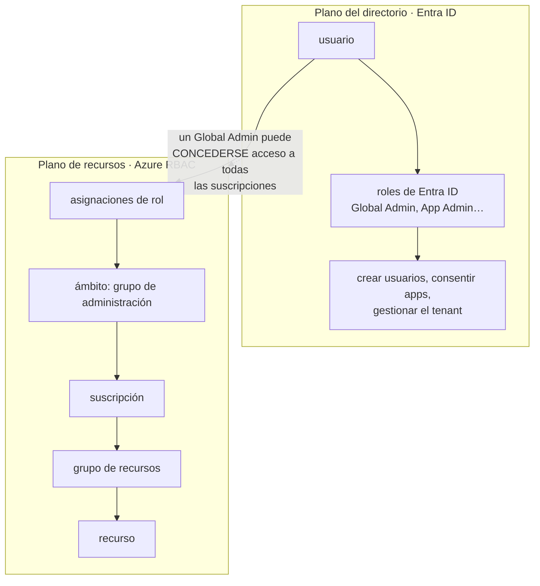

# 038 — Microsoft Entra ID, RBAC, managed identities y PIM

> [← 037 · Tenant, management groups, suscripciones y resource groups](../../part-03-azure-core-platform/037-tenant-management-groups-suscripciones-y-resource-groups/README.md) · [Índice de la parte](../README.md) · [039 · Virtual Network, subredes, NSG, UDR, peering y Private Link →](../../part-03-azure-core-platform/039-virtual-network-subredes-nsg-udr-peering-y-private-link/README.md)

**Parte:** 03 — Azure: plataforma esencial<br>
**Nivel:** intermedio · **Horas estimadas:** 4<br>
**Laboratorio:** `iam` · **Estado:** `EXECUTABLE_CORE`

## 🎯 Propósito

Dominar el modelo de identidad de Azure, que difiere del de AWS en algo estructural: el directorio es del tenant y los permisos sobre recursos son otra cosa. Confundir un rol de Entra ID con uno de Azure RBAC es la causa de la mitad de los problemas de acceso al llegar de AWS, y de una parte de las escaladas de privilegio.

## 📚 Resultados de aprendizaje

Al finalizar podrás:

1. **Distinguir** roles de Entra ID de roles de Azure RBAC y saber cuál gobierna cada acción.
2. **Explicar** por qué una denegación de Azure RBAC no es equivalente a un `Deny` de IAM y qué la sustituye.
3. **Sustituir** secretos de aplicación por identidades administradas y por federación desde un pipeline.
4. **Aplicar** acceso con privilegios mínimos en el tiempo mediante activación con caducidad y aprobación.
5. **Diagnosticar** un acceso denegado sabiendo en qué ámbito y en qué sistema de roles buscar.

## 🧩 Conceptos centrales

| Concepto | Comprensión verificable |
|---|---|
| `rol de Entra ID` | Permiso sobre el directorio: crear usuarios, conceder consentimiento a aplicaciones, gestionar el propio tenant. No otorga ningún permiso sobre recursos de Azure. |
| `rol de Azure RBAC` | Permiso sobre recursos, asignado en un ámbito —grupo de administración, suscripción, grupo de recursos o recurso—. Se hereda hacia abajo y es acumulativo. |
| `identidad administrada` | Identidad que Azure crea y rota por ti, asociada a un recurso. Elimina el secreto: no hay nada que guardar ni que filtrar. |
| `asignación de denegación` | Mecanismo que bloquea acciones con independencia de los roles concedidos. A diferencia de IAM, **no se puede crear directamente**: solo la generan servicios como los blueprints o los entornos gestionados. |
| `acceso con privilegios mínimos en el tiempo` | Modelo en el que un rol privilegiado no está activo permanentemente: se activa por un periodo acotado, con justificación y posible aprobación. |

## 🧠 Modelo mental

En Azure, identidad y jerarquía organizacional preceden al recurso: tenant, management group, suscripción y resource group determinan el alcance de control.

Aplicado a esta clase, separa siempre cuatro planos: **intención** (qué necesita el usuario),
**configuración** (qué declaramos), **estado observado** (qué existe de verdad) y
**evidencia** (cómo sabemos que cumple). Confundirlos produce diseños que se ven correctos
en un diagrama pero fallan al operar.

## 🗺️ Flujo de razonamiento



## 📖 Desarrollo

### 1. Dos sistemas de roles que no se solapan

Azure tiene **dos planos de autorización independientes**, y esa es la diferencia estructural con AWS:

| | Roles de Entra ID | Roles de Azure RBAC |
|---|---|---|
| Gobiernan | El directorio | Los recursos |
| Ejemplos | Global Administrator, User Administrator | Owner, Contributor, Reader |
| Ámbito | Todo el tenant o unidades administrativas | Grupo de administración → recurso |
| Pregunta que responden | ¿Puedes crear un usuario? | ¿Puedes crear una máquina virtual? |

Un *Global Administrator* **no tiene por defecto ningún permiso sobre recursos**. Puede crear usuarios y consentir aplicaciones, y no puede leer una base de datos.

Pero hay una conexión peligrosa que conviene conocer:

```bash
# Un Global Administrator puede concederse a sí mismo acceso a TODAS las suscripciones
$ az rest --method post --url "https://management.azure.com/providers/Microsoft.Authorization/elevateAccess?api-version=2016-07-01"
```

Esa llamada le asigna *User Access Administrator* en el ámbito raíz. Es una función legítima —recuperar el control de una suscripción huérfana— y una escalada completa. **Debe alertarse siempre**, y el número de Global Administrators debe ser mínimo: entre dos y cuatro, todos con acceso privilegiado en el tiempo.

Al depurar «no tengo permiso», la primera pregunta es **en qué plano está la acción**. Crear un grupo de recursos es RBAC; invitar a un usuario externo es Entra ID. Añadir permisos en el plano equivocado no cambia nada, igual que añadir permisos de identidad contra un `Deny` de SCP en la clase 026.

### 2. RBAC es aditivo y las denegaciones no se crean a mano

El modelo de evaluación de Azure RBAC es más simple que el de AWS y su simplicidad tiene una consecuencia importante:

```text
permiso efectivo = unión de todas las asignaciones en todos los ámbitos heredados
                   menos las asignaciones de denegación (que no puedes crear)
```

**Es aditivo.** No existe un `Deny` que puedas escribir para excluir una acción concreta de un rol amplio. Si alguien tiene *Contributor* en la suscripción, tiene todo lo que ese rol incluye sobre todo lo que hay debajo, y no hay forma de restarle una acción con otra asignación.

Las dos formas reales de acotar:

```text
1. Rol personalizado con NotActions
   define exactamente lo que incluye y lo que excluye

2. Azure Policy con efecto Deny
   no es autorización, es gobierno: impide la operación aunque el rol la permita
```

La segunda es la que sustituye funcionalmente al `Deny` de IAM, y opera en otro plano: **el rol dice que puedes y la directiva impide que ocurra**. Al diagnosticar, el mensaje de error las distingue:

```text
AuthorizationFailed              → falta el rol
RequestDisallowedByPolicy        → el rol lo permite y la directiva lo impide
```

Un rol personalizado con exclusiones:

```json
{
  "Name": "Colaborador sin borrado",
  "Actions": ["Microsoft.Compute/*", "Microsoft.Network/*", "Microsoft.Storage/*"],
  "NotActions": [
    "Microsoft.Compute/virtualMachines/delete",
    "Microsoft.Storage/storageAccounts/delete"
  ],
  "AssignableScopes": ["/subscriptions/aaaa-bbbb"]
}
```

Y una precisión que evita sorpresas: **`NotActions` no es una denegación**. Si otra asignación concede esa misma acción, se permite. Solo excluye la acción *de ese rol*.

### 3. Identidades administradas: el secreto que no existe

Es el equivalente al rol de instancia de AWS, con dos variantes:

| | Asignada por el sistema | Asignada por el usuario |
|---|---|---|
| Ciclo de vida | Ligado al recurso: se borra con él | Independiente |
| Compartible | No | **Sí, entre varios recursos** |
| Cuándo | Un recurso único | Flotas y despliegues azul-verde |

La segunda es la que conviene en una flota: si la identidad estuviera ligada al recurso, cada instancia nueva tendría una identidad distinta y habría que asignarle roles al crearla. Con identidad asignada por el usuario, **los roles se conceden una vez y todas las instancias los heredan**.

El código no maneja ningún secreto:

```python
from azure.identity import DefaultAzureCredential
from azure.keyvault.secrets import SecretClient

cred = DefaultAzureCredential()          # detecta la identidad administrada
cliente = SecretClient("https://kv-cloudshop.vault.azure.net", cred)
secreto = cliente.get_secret("db-password").value
```

`DefaultAzureCredential` prueba varias fuentes en orden: variables de entorno, identidad administrada, credenciales del desarrollador. Eso hace que el mismo código funcione en local y en producción, y también esconde una trampa: **si la identidad administrada falla, puede caer silenciosamente a otra credencial** y funcionar por el motivo equivocado. En producción conviene fijar la fuente explícitamente.

Para el pipeline, la equivalencia con la federación OIDC de la clase 026:

```bash
$ az ad app federated-credential create --id $APP_ID --parameters '{
    "name": "github-produccion",
    "issuer": "https://token.actions.githubusercontent.com",
    "subject": "repo:miorg/cloudshop:environment:produccion",
    "audiences": ["api://AzureADTokenExchange"]
  }'
```

El campo `subject` cumple exactamente la misma función crítica que en AWS: **sin él acotado, cualquier repositorio puede obtener el token**. Y aquí hay un detalle propio: el valor es de coincidencia exacta, no admite comodines, lo que elimina el error de usar `StringLike` con un patrón demasiado amplio.

### 4. Privilegio mínimo en el tiempo, no solo en el alcance

El privilegio mínimo clásico acota **qué** puedes hacer. Añadir la dimensión temporal acota **cuándo**:

```text
modelo permanente   el rol está activo 24×7
                    una credencial comprometida a las 3 de la madrugada
                    tiene los mismos permisos que a mediodía

modelo elegible     el rol existe pero está inactivo
                    se activa por 1-8 h, con justificación y a veces aprobación
                    fuera de esa ventana, el permiso no existe
```

La reducción de superficie es aritmética:

```text
rol permanente:  720 h/mes de exposición
rol elegible activado 4 h/semana: 16 h/mes
reducción: 97,8 %
```

La configuración añade tres controles a la activación:

```text
duración máxima          8 h, no indefinida
justificación            obligatoria y registrada
aprobación               para los roles más sensibles
notificación             a un segundo par al activarse
```

La última es la más rentable y la menos usada: **si alguien activa un rol privilegiado y otra persona lo ve al instante**, un uso indebido se detecta en minutos en vez de en la revisión trimestral.

Los roles que deberían ser siempre elegibles y nunca permanentes:

```text
Global Administrator          (Entra ID)
Privileged Role Administrator (Entra ID)
Owner y User Access Administrator en suscripciones de producción (RBAC)
```

Y una excepción deliberada: **conviene mantener dos cuentas de emergencia con acceso permanente**, excluidas de acceso condicional y con credenciales en custodia física. Son la salida si el sistema de activación o el proveedor de identidad falla. Su uso debe alertar de inmediato, y su existencia hay que documentarla — porque una cuenta de emergencia olvidada es una puerta trasera.

### 5. Diagnosticar un acceso denegado

El orden que acota el problema en minutos:

```bash
# 1. ¿Qué roles tengo y en qué ámbito?
$ az role assignment list --assignee $UPN --all -o table --include-inherited

# 2. ¿La acción concreta está en alguno de esos roles?
$ az role definition list --name "Storage Blob Data Reader" \
    --query "[0].permissions[0].{a:actions,da:dataActions}"

# 3. ¿Lo impide una directiva en vez de faltar el rol?
$ az policy state list --resource $ID --filter "complianceState eq 'NonCompliant'" \
    --query "[].policyDefinitionName"
```

El paso 2 esconde la sutileza que más confunde en Azure: **existen `actions` y `dataActions`, y son planos distintos**.

```text
actions      operaciones sobre el recurso: crear la cuenta de almacenamiento,
             leer sus claves, cambiar su configuración
dataActions  operaciones sobre los DATOS: leer un blob concreto
```

Un rol *Contributor* sobre una cuenta de almacenamiento **no permite leer los blobs** — permite gestionarla y obtener sus claves, que es otra cosa. Leerlos exige un rol con `dataActions`, como *Storage Blob Data Reader*.

Eso produce el error más desconcertante para quien llega de AWS: alguien con *Owner* sobre la suscripción recibe `AuthorizationPermissionMismatch` al listar blobs. No es un fallo: es que *Owner* concede `actions` y no `dataActions` sobre datos.

Y el mensaje de error distingue los tres casos:

```text
AuthorizationFailed                  falta el rol de gestión
AuthorizationPermissionMismatch      falta el rol de DATOS
RequestDisallowedByPolicy            hay rol y una directiva lo impide
```

Leerlo ahorra la búsqueda en el plano equivocado, igual que en la clase 026.

## 🔬 Ejemplo trabajado

**Al desplegar CloudShop en Azure, el equipo replica el rol del pipeline de AWS y se encuentra con tres problemas en dos días.**

**Problema 1 — el pipeline no puede leer el almacenamiento pese a ser Owner.**

```bash
$ az role assignment list --assignee $APP_ID --all --query "[].{rol:roleDefinitionName,ambito:scope}" -o tsv
Owner    /subscriptions/aaaa-bbbb
$ az storage blob list --account-name stcloudshop --container-name facturas --auth-mode login
AuthorizationPermissionMismatch
```

**Owner sobre la suscripción y no puede listar blobs.** La causa es la separación entre `actions` y `dataActions`:

```bash
$ az role definition list --name Owner --query "[0].permissions[0].dataActions" -o tsv
(vacío)
```

Owner no tiene ninguna `dataAction`. Se asigna el rol de datos, acotado al contenedor:

```bash
$ az role assignment create --assignee $APP_ID \
    --role "Storage Blob Data Contributor" \
    --scope "/subscriptions/aaaa-bbbb/resourceGroups/rg-prod/providers/\
Microsoft.Storage/storageAccounts/stcloudshop/blobServices/default/containers/facturas"
$ az storage blob list --account-name stcloudshop --container-name facturas --auth-mode login -o tsv | wc -l
412                                                                       ✓
```

Y se aprovecha para quitar *Owner*, que estaba de más:

```text
antes:   Owner sobre la suscripción entera
después: Storage Blob Data Contributor sobre UN contenedor
         + Website Contributor sobre el grupo de recursos de la app
```

**Problema 2 — el pipeline usaba un secreto de aplicación.**

```bash
$ az ad app credential list --id $APP_ID --query "[].{fin:endDateTime}" -o tsv
2027-03-14T10:22:00Z
```

Un secreto con dos años de vigencia, guardado en el repositorio. Se sustituye por federación:

```bash
$ az ad app federated-credential create --id $APP_ID --parameters '{
    "name":"github-produccion",
    "issuer":"https://token.actions.githubusercontent.com",
    "subject":"repo:miorg/cloudshop:environment:produccion",
    "audiences":["api://AzureADTokenExchange"]}'
$ az ad app credential delete --id $APP_ID --key-id $KEY_ID
```

Pruebas del sujeto, igual que en la clase 026:

```text
desde otro repositorio                    AADSTS70021: no matching federated identity  ✓
desde miorg/cloudshop, rama de trabajo    AADSTS70021                                  ✓
desde miorg/cloudshop, entorno produccion token emitido                                ✓
```

**Problema 3 — un despliegue legítimo bloqueado.**

```text
RequestDisallowedByPolicy: Resource 'st-cloudshop-tmp' was disallowed by policy
  'Storage accounts should restrict network access'
```

El mensaje **no dice `AuthorizationFailed`**, así que no falta rol: hay rol y una directiva lo impide. Añadir permisos no habría servido de nada.

```bash
$ az policy assignment show --name red-almacenamiento --query "parameters" -o json
{"effect":{"value":"Deny"}}
```

La cuenta temporal se creaba sin restricción de red. Se corrige en la plantilla, no en la directiva.

**Revisión final de la superficie de identidad:**

```bash
$ az role assignment list --all --query "[?roleDefinitionName=='Owner']\
.{p:principalName,a:scope}" -o tsv | wc -l
11
```

**Once asignaciones de Owner.** Se reducen a dos y el resto pasa a elegible con activación:

```text                              antes         después
Owner permanentes                   11             2 (emergencia, documentadas)
Owner elegibles                      0             9 (activación de 8 h con justificación)
Global Administrators                6             3, todos elegibles
secretos de aplicación               1             0
exposición de roles privilegiados  720 h/mes    ~22 h/mes   (−97 %)
```

**La lección que traslada esta clase al resto del programa**: el modelo de identidad de Azure se parece al de AWS en el objetivo y difiere en la mecánica. Traducir literalmente —«Owner es como AdministratorAccess»— produce a la vez permisos de más en el plano de gestión y permisos de menos en el plano de datos.

## 🧪 Laboratorio guiado

Ejecuta desde la raíz:

```bash
python classes/part-03-azure-core-platform/038-microsoft-entra-id-rbac-managed-identities-y-pim/lab.py
```

El laboratorio selecciona el motor de práctica **`iam`** y produce
`lab_result.json`. El escenario, sus comprobaciones y el artefacto esperado corresponden a
esta clase; no requiere credenciales y deja explícito qué debe revalidarse en un sandbox real.

1. Lee `exercise.steps` y formula una predicción antes de ejecutar.
2. Ejecuta la práctica y verifica todos los elementos de `checks`.
3. Provoca el caso de `negative_test` y explica la señal observada.
4. Materializa `identidad-azure` en `evidence/` usando la plantilla indicada.
5. Para proveedor real, sigue `sandbox.requires`, registra costo y ejecuta `destroy`.

### Evidencia esperada

El artefacto principal es una matriz de acceso mínimo con prueba de denegación. Además, la entrega debe incluir el comando ejecutado,
la salida estructurada y una conclusión que no exceda lo observado.

## 🏆 Reto verificable

Construye **`identidad-azure`** para el caso CloudShop. Incluye una alternativa descartada,
un supuesto que pueda falsarse, una prueba de fallo y una decisión de rollback.

## ✅ Criterio de aceptación

- [ ] `lab.py` termina con código 0 y genera JSON válido.
- [ ] La entrega conecta al menos tres requisitos con mecanismos verificables.
- [ ] Existe una prueba positiva y una prueba negativa con evidencia.
- [ ] Seguridad, costo y operación aparecen como decisiones, no como anexos.
- [ ] Se declara una limitación y una condición que obligaría a revisar el diseño.
- [ ] Otra persona puede repetir el recorrido sin conocimiento tácito.

## ⚠️ Errores frecuentes

| Síntoma | Causa probable | Corrección |
|---|---|---|
| Un principal con Owner recibe `AuthorizationPermissionMismatch` al leer datos | Owner concede `actions` y no `dataActions`: son planos distintos | Asigna un rol de datos como Storage Blob Data Reader, acotado al contenedor. |
| Se añaden roles y el despliegue sigue fallando | El error es `RequestDisallowedByPolicy`: hay rol y una directiva lo impide | Lee el código de error; con directivas, la corrección va en la plantilla o en la directiva, no en los roles. |
| No se puede excluir una acción concreta de un rol amplio | Azure RBAC es aditivo y las asignaciones de denegación no se crean a mano | Usa un rol personalizado con `NotActions` o una directiva con efecto Deny. |
| Un Global Administrator obtiene acceso a todas las suscripciones | La elevación de acceso es una función legítima del rol | Minimiza los Global Administrators, hazlos elegibles y alerta siempre sobre `elevateAccess`. |
| Cada instancia nueva de una flota necesita asignaciones de rol propias | Se usó identidad asignada por el sistema, ligada al ciclo de vida del recurso | Usa identidad asignada por el usuario: los roles se conceden una vez y las instancias la comparten. |

## 🛡️ Seguridad, ética y costo

Trabaja con cuentas propias o sandboxes autorizados. No publiques secretos, identificadores
reales ni datos personales. Antes de crear recursos pagos define presupuesto, etiquetas y
comando de destrucción; después verifica que no queden recursos huérfanos. Los ejemplos
locales enseñan contratos, pero no certifican cumplimiento ni disponibilidad de producción.

## ❓ Preguntas de comprobación

1. ¿Qué puede hacer un Global Administrator sobre los recursos de una suscripción, y cómo puede cambiar eso?
2. ¿Por qué `NotActions` en un rol personalizado no equivale a un `Deny` de IAM?
3. Un principal con Owner no puede listar blobs. ¿Cuál es la causa y cuál el arreglo?
4. ¿Qué distingue `AuthorizationFailed` de `RequestDisallowedByPolicy` y qué corrige cada uno?
5. ¿Cuánto se reduce la exposición al pasar un rol de permanente a elegible activado 4 h por semana?

## 🔗 Referencias

- Microsoft (2024). *Azure RBAC vs Microsoft Entra roles* — los dos planos y qué gobierna cada uno. <https://learn.microsoft.com/en-us/entra/identity/role-based-access-control/custom-overview>
- Microsoft (2024). *Understand Azure role definitions* — actions, notActions, dataActions y su evaluación. <https://learn.microsoft.com/en-us/azure/role-based-access-control/role-definitions>
- Microsoft (2024). *Managed identities for Azure resources* — asignadas por el sistema y por el usuario. <https://learn.microsoft.com/en-us/entra/identity/managed-identities-azure-resources/overview>
- Microsoft (2024). *Workload identity federation* — credenciales federadas y coincidencia exacta del sujeto. <https://learn.microsoft.com/en-us/entra/workload-id/workload-identity-federation>
- Microsoft (2024). *Privileged Identity Management* — activación con caducidad, justificación y aprobación. <https://learn.microsoft.com/en-us/entra/id-governance/privileged-identity-management/pim-configure>
- Documentación oficial vigente del servicio implementado; registra URL y fecha de consulta.

---

> [Evaluación](assessment.md) · [Contrato de clase](lesson.yaml) · [Índice de la parte](../README.md)

| Anterior | Índice | Siguiente |
|---|---|---|
| [← 037 · Tenant, management groups, suscripciones y resource groups](../../part-03-azure-core-platform/037-tenant-management-groups-suscripciones-y-resource-groups/README.md) | [Parte 03](../README.md) · [Programa](../../README.md) | [039 · Virtual Network, subredes, NSG, UDR, peering y Private Link →](../../part-03-azure-core-platform/039-virtual-network-subredes-nsg-udr-peering-y-private-link/README.md) |
