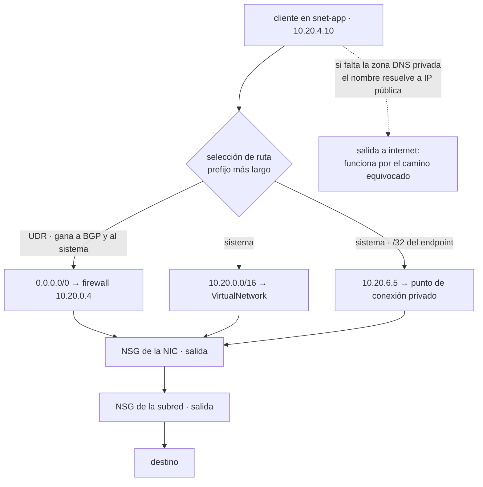

# 039 — Virtual Network, subredes, NSG, UDR, peering y Private Link

> [← 038 · Microsoft Entra ID, RBAC, managed identities y PIM](../../part-03-azure-core-platform/038-microsoft-entra-id-rbac-managed-identities-y-pim/README.md) · [Índice de la parte](../README.md) · [040 · Virtual Machines, Scale Sets y Load Balancer →](../../part-03-azure-core-platform/040-virtual-machines-scale-sets-y-load-balancer/README.md)

**Parte:** 03 — Azure: plataforma esencial<br>
**Nivel:** intermedio · **Horas estimadas:** 4<br>
**Laboratorio:** `network` · **Estado:** `EXECUTABLE_CORE`

## 🎯 Propósito

Diseñar la red de Azure sabiendo dónde falla la traducción literal desde una VPC. Tres puntos concretos rompen el modelo mental de la clase 027: no existe la subred privada por defecto, hay dos grupos de seguridad de red evaluándose en cadena y ambos deben permitir, y un punto de conexión privado sin zona DNS no falla — funciona por el camino público mientras crees que es privado. Es la base de las clases 040 a 048 y el origen de la mayoría de incidentes de conectividad de la parte.

## 📚 Resultados de aprendizaje

Al finalizar podrás:

1. **Planificar** el espacio de direcciones contando las cinco IP reservadas por subred y las subredes de nombre obligatorio.
2. **Explicar** por qué una subred de Azure alcanza internet sin ninguna ruta declarada y qué cambió el 30 de septiembre de 2025.
3. **Aplicar** reglas de NSG sabiendo que subred y NIC se evalúan en cadena y que las reglas por defecto permiten todo dentro de la red virtual.
4. **Decidir** entre endpoint de servicio y punto de conexión privado con criterio de alcance, origen y costo.
5. **Diagnosticar** conectividad de abajo hacia arriba distinguiendo ruta, NSG y resolución de nombres.

## 🧩 Conceptos centrales

| Concepto | Comprensión verificable |
|---|---|
| `red virtual y espacio de direcciones` | Ámbito de direccionamiento privado dentro de una región. Azure reserva **cinco direcciones por subred** —las cuatro primeras y la última—, así que una /24 ofrece 251 utilizables, no 254. |
| `subred de nombre reservado` | Subredes cuyo nombre es parte de la API: `GatewaySubnet`, `AzureFirewallSubnet`, `AzureBastionSubnet`. Escrito de otra forma, el servicio simplemente no se puede crear ahí. |
| `ruta del sistema` | Ruta que Azure crea sin que la declares, incluida `0.0.0.0/0 → Internet` en **toda** subred. Es la razón de que no exista una subred privada por omisión. |
| `UDR` | Tabla de rutas definida por el usuario. Se elige por prefijo más largo y, a igualdad de prefijo, **UDR gana a BGP y BGP gana al sistema**. |
| `NSG` | Filtro con estado que puede aplicarse a la subred y a la NIC a la vez. Ambos se evalúan y **ambos deben permitir**; la primera regla que coincide decide. |
| `punto de conexión privado` | Interfaz de red con IP privada de tu subred que representa a un recurso concreto. Sin la zona DNS privada correspondiente no da error: el nombre sigue resolviendo a la IP pública. |

## 🧠 Modelo mental

En Azure, identidad y jerarquía organizacional preceden al recurso: tenant, management group, suscripción y resource group determinan el alcance de control.

Aplicado a esta clase, separa siempre cuatro planos: **intención** (qué necesita el usuario),
**configuración** (qué declaramos), **estado observado** (qué existe de verdad) y
**evidencia** (cómo sabemos que cumple). Confundirlos produce diseños que se ven correctos
en un diagrama pero fallan al operar.

## 🗺️ Flujo de razonamiento



## 📖 Desarrollo

### 1. Cinco direcciones y tres nombres que no puedes elegir

El direccionamiento se planifica antes de crear nada, por la misma razón que en la clase 027: **el emparejamiento entre redes virtuales rechaza espacios solapados**, y dos equipos que eligieron `10.0.0.0/16` cada uno por su cuenta ya no pueden conectarse sin rehacer una de las dos.

Azure reserva cinco direcciones por subred, igual que AWS, pero con otros papeles:

```text
10.20.1.0    identificador de red
10.20.1.1    puerta de enlace predeterminada
10.20.1.2    servicio DNS de Azure
10.20.1.3    reservada
10.20.1.255  difusión
→ una /24 ofrece 251 direcciones utilizables
```

Hasta aquí, aritmética conocida. Lo que no existe en AWS son las **subredes cuyo nombre forma parte del contrato**:

| Nombre exacto | Tamaño mínimo | Para qué |
|---|---|---|
| `GatewaySubnet` | /27 recomendado | Puertas de enlace de VPN y ExpressRoute |
| `AzureFirewallSubnet` | /26 | Azure Firewall |
| `AzureFirewallManagementSubnet` | /26 | Plano de gestión del firewall forzado |
| `AzureBastionSubnet` | /26 | Bastion |

**El nombre no es una convención, es la API.** Una subred llamada `snet-gateway` con el tamaño correcto no sirve: la puerta de enlace no se puede crear ahí. Y el orden importa, porque estas subredes deben caber en el espacio que ya repartiste: descubrir que hace falta una /26 para el firewall cuando solo quedan /28 libres obliga a ampliar el espacio de direcciones de la red virtual y a recrear emparejamientos.

Un reparto que deja sitio a lo que vendrá en las clases 040 a 048:

```text
vnet-hub    10.20.0.0/22
  AzureFirewallSubnet   10.20.0.0/26
  AzureBastionSubnet    10.20.0.64/26
  GatewaySubnet         10.20.0.128/27
  snet-dns              10.20.0.160/28

vnet-spoke-app  10.20.4.0/22
  snet-app              10.20.4.0/24    (251 utilizables)
  snet-datos            10.20.5.0/24
  snet-endpoints        10.20.6.0/26    (puntos de conexión privados)
  snet-integracion      10.20.6.64/26   (delegada a App Service)
```

La última merece una nota: una subred **delegada** a un servicio —App Service, Container Apps, bases de datos flexibles— queda bajo control de ese servicio y no admite otros recursos. Se decide al crearla y cambiarla implica vaciarla, así que conviene reservarla desde el principio aunque todavía no se use.

### 2. No existe la subred privada: toda subred sale a internet

Esta es la diferencia estructural con AWS, y la que más incidentes produce al llegar.

En AWS, «pública» y «privada» son propiedades de la **tabla de rutas**: una subred es pública porque su tabla apunta a una puerta de enlace de internet, y es privada porque no lo hace. En Azure no hay puerta de enlace que adjuntar. Toda subred nace con esta ruta del sistema:

```text
0.0.0.0/0  →  Internet
```

Una máquina virtual sin IP pública, sin UDR y sin NAT **alcanza internet igualmente**, mediante una traducción de direcciones implícita con una IP que elige la plataforma. Se llama acceso saliente predeterminado y tiene tres consecuencias:

```text
1. La salida no está controlada: cualquier proceso sale sin que nadie lo declare.
2. La IP de origen no es estable ni tuya: no puede figurar en la lista de
   permitidos de un tercero, porque cambia sin aviso.
3. Los puertos de traducción son escasos y no se pueden dimensionar.
```

**Qué cambió.** Desde el 30 de septiembre de 2025 el acceso saliente predeterminado está retirado para las redes virtuales **nuevas**: un despliegue nuevo debe declarar cómo sale. Las redes virtuales creadas antes lo conservan, así que la pregunta útil sobre una plataforma existente no es «¿tenemos salida implícita?» sino **«¿de qué fecha es esta red virtual?»**.

Las tres formas explícitas de salir, y por qué no son intercambiables:

| Mecanismo | Puertos de traducción | Cuándo |
|---|---|---|
| IP pública en la NIC | 64.000 por instancia | Una máquina suelta; no escala ni se audita bien |
| Regla de salida del balanceador | 64.000 **repartidos** entre las instancias | Flotas pequeñas y estables |
| NAT Gateway | 64.512 por IP, asignados bajo demanda, hasta 16 IP | Recomendado por defecto |

El reparto de la segunda opción es la trampa aritmética:

```text
64.000 puertos / 100 instancias = 640 puertos por instancia
un servicio que abre 200 conexiones cortas por segundo al mismo destino,
con 240 s de espera antes de reutilizar el puerto → agotamiento en segundos
```

El síntoma es característico y desorienta: **conexiones que fallan por tiempo de espera solo hacia un destino concreto**, mientras el resto de la red funciona. El NAT Gateway lo elimina porque asigna puertos bajo demanda en vez de repartirlos por adelantado.

Su costo tiene la misma forma que el de AWS, así que la lección de la clase 027 se traslada entera:

```text
precio por hora         ~0,045 USD  →  32,85 USD/mes
precio por GB procesado ~0,045 USD
```

Y para conseguir de verdad una subred sin salida hacen falta **tres cosas, no una**:

```bash
# 1. desactivar el acceso saliente predeterminado en la subred
$ az network vnet subnet update -g rg-red --vnet-name vnet-spoke-app -n snet-datos \
    --default-outbound-access false

# 2. ninguna UDR que envíe 0.0.0.0/0 a Internet
# 3. NSG que deniegue la salida a la etiqueta Internet
$ az network nsg rule create -g rg-red --nsg-name nsg-datos -n deny-internet-out \
    --priority 4000 --direction Outbound --access Deny \
    --source-address-prefixes '*' --destination-address-prefixes Internet \
    --destination-port-ranges '*' --protocol '*'
```

Saltarse la primera es el error habitual: la regla de NSG bloquea el tráfico, pero la ruta sigue existiendo y basta con que alguien afloje el NSG para que la salida vuelva sin que nadie lo note.

### 3. Dos NSG en cadena y una regla por defecto que lo permite todo dentro

El NSG **tiene estado**, en la subred y en la NIC. Esto elimina de golpe la trampa de las ACL de red de AWS —aquellas reglas de vuelta para los puertos efímeros de la clase 027—, y a cambio introduce otra.

```text
entrada:  NSG de la subred  →  NSG de la NIC   →  máquina
salida:   NSG de la NIC     →  NSG de la subred →  red
```

**Ambos se evalúan y ambos deben permitir.** Un NSG de subred impecable no sirve de nada si la NIC tiene otro que deniega, y el mensaje de error no dice cuál de los dos fue. Por eso conviene una regla de equipo simple: **NSG en la subred, salvo excepción documentada**. Dos capas de filtrado en manos de dos equipos distintos producen incidentes que nadie sabe reproducir.

Las reglas por defecto, que no se pueden borrar y sí sobrescribir con prioridad menor:

```text
entrada  65000  AllowVnetInBound              VirtualNetwork → VirtualNetwork
         65001  AllowAzureLoadBalancerInBound AzureLoadBalancer → *
         65500  DenyAllInBound

salida   65000  AllowVnetOutBound             VirtualNetwork → VirtualNetwork
         65001  AllowInternetOutBound         * → Internet
         65500  DenyAllOutBound
```

La primera es la que cambia el modelo mental. `VirtualNetwork` no significa «esta subred»: incluye **toda la red virtual, las redes emparejadas y los rangos anunciados desde la red corporativa**. Es decir:

```text
AWS    dos instancias con grupos de seguridad distintos NO se hablan
       hasta que una regla lo permita
Azure  dos subredes cualesquiera de la red virtual SÍ se hablan,
       en todos los puertos, desde el primer minuto
```

La segmentación entre subredes en Azure es trabajo explícito, no un estado inicial. Denegar el tráfico lateral y abrir solo lo necesario:

```bash
$ az network nsg rule create -g rg-red --nsg-name nsg-datos -n allow-app-5432 \
    --priority 100 --direction Inbound --access Allow --protocol Tcp \
    --source-address-prefixes 10.20.4.0/24 --destination-port-ranges 5432

$ az network nsg rule create -g rg-red --nsg-name nsg-datos -n deny-lateral \
    --priority 200 --direction Inbound --access Deny --protocol '*' \
    --source-address-prefixes VirtualNetwork --destination-port-ranges '*'
```

Se evalúa por prioridad ascendente y **la primera coincidencia decide**: la 100 permite la aplicación y la 200 corta todo lo demás que venga de dentro, incluida la sonda del balanceador si no se tuvo cuidado. Ese es el incidente clásico, porque `AllowAzureLoadBalancerInBound` vive en la 65001 y cualquier denegación de usuario la sobrescribe:

```text
sonda bloqueada → todas las instancias marcadas como no sanas
                → el balanceador deja de enviar tráfico
                → 502 en el frontal, y las máquinas están perfectamente vivas
```

La corrección es una regla de permiso con la **etiqueta de servicio** `AzureLoadBalancer` por encima de la denegación. Las etiquetas de servicio son la mejora real frente a mantener listas de IP a mano:

```text
VirtualNetwork      la red virtual, las emparejadas y lo anunciado desde on-premises
AzureLoadBalancer   las sondas de estado de la plataforma
Internet            todo lo que no es privado ni de Azure
Storage.WestEurope  los rangos de almacenamiento de una región concreta
AzureMonitor, Sql, AzureKeyVault…
```

Microsoft actualiza los rangos; tus reglas no cambian. Y para el equivalente al grupo de seguridad que referencia a otro grupo de seguridad —que en Azure no existe tal cual— está el **grupo de seguridad de aplicación**: una etiqueta que se asigna a NIC y se usa como origen o destino en las reglas, en lugar de un CIDR. Permite escribir «los servidores web pueden hablar con los de base de datos» sin depender de cómo se repartieron las subredes.

### 4. UDR, emparejamiento y las dos formas de dejar la red sin salida

La selección de ruta sigue dos criterios, en este orden:

```text
1. prefijo más largo (la ruta más específica gana)
2. a igualdad de prefijo:  UDR  >  BGP  >  sistema
```

Forzar todo el tráfico saliente por un firewall es una UDR de una línea sobre la subred de carga de trabajo:

```bash
$ az network route-table route create -g rg-red --route-table-name rt-app \
    -n via-firewall --address-prefix 0.0.0.0/0 \
    --next-hop-type VirtualAppliance --next-hop-ip-address 10.20.0.4
```

Y tiene dos formas conocidas de provocar una caída total:

**La primera: aplicar esa misma UDR a la subred del firewall.** El firewall enruta hacia sí mismo, el tráfico entra en bucle y la salida desaparece para toda la red. La regla es que `AzureFirewallSubnet` y `GatewaySubnet` no llevan una ruta por defecto hacia el propio dispositivo; asociar la tabla «a todas las subredes por comodidad» es exactamente cómo ocurre.

**La segunda: el enrutamiento asimétrico.** El tráfico entra por la IP pública del balanceador y, con la UDR puesta, la respuesta intenta salir por el firewall. El firewall ve un paquete de vuelta de una conexión que nunca vio empezar y lo descarta. El síntoma engaña: **la conexión se establece y se queda colgada hasta agotar el tiempo**, así que parece un problema de la aplicación. La corrección es una ruta más específica que devuelva ese tráfico por donde entró, o mover la entrada detrás del mismo dispositivo que inspecciona la salida.

Sobre el **emparejamiento**, tres propiedades que hay que tener presentes a la vez:

```text
no es transitivo        radio A ↔ concentrador ↔ radio B  NO da  A ↔ B
es bidireccional        hay que crearlo en los dos sentidos o queda a medias
se factura en los dos   se paga el GB que sale y el GB que entra
```

La no transitividad se resuelve como en AWS, con distinta mecánica: una UDR en cada radio que envíe el rango del otro al firewall del concentrador, **más** dos interruptores del emparejamiento que casi siempre se olvidan:

```text
allowForwardedTraffic   sin él, la red emparejada descarta el tráfico cuyo
                        origen no le pertenece — es decir, todo lo reenviado
allowGatewayTransit /   permiten que los radios usen la puerta de enlace
useRemoteGateways       del concentrador en vez de tener una cada uno
```

El coste conviene calcularlo antes de dibujar el diagrama, porque un concentrador cobra el tránsito dos veces. Para 900 GB mensuales entre dos radios de la misma región:

```text                                        USD/mes
emparejamiento radio A ↔ concentrador
  900 GB salida × 0,01 + 900 GB entrada × 0,01   18,00
emparejamiento concentrador ↔ radio B
  900 GB salida × 0,01 + 900 GB entrada × 0,01   18,00
proceso de datos del firewall  900 × 0,016       14,40
                                               ───────
                                                 50,40

emparejamiento directo A ↔ B                     18,00
```

**Inspeccionar ese tráfico cuesta 32,40 USD al mes.** No es una cifra que descalifique el diseño; es una cifra que hay que poder decir en voz alta. La decisión defendible es la que elige el concentrador porque el tráfico entre radios debe inspeccionarse, no la que lo elige porque el diagrama de referencia lo dibujaba así.

### 5. Endpoint de servicio y punto de conexión privado: el que falla es el DNS

Dos mecanismos para llegar a un servicio de plataforma sin pasar por internet, con nombres parecidos y comportamientos distintos:

| | Endpoint de servicio | Punto de conexión privado |
|---|---|---|
| Qué hace | Añade una ruta optimizada y presenta la identidad de la subred al servicio | Crea una NIC con IP privada **de tu subred** que representa al recurso |
| Dirección de destino | La IP **pública** del servicio | Una IP **privada** tuya |
| DNS | Sin cambios | **Hay que cambiarlo** |
| Alcance | El servicio en la región, acotado por el cortafuegos del recurso | Un recurso concreto, e incluso un subrecurso (`blob`, `file`, `table`) |
| Desde on-premises o red emparejada | **No funciona** | Sí |
| Costo | Gratuito | ~0,01 USD/h + 0,01 USD/GB procesado |

La equivalencia con la clase 027 es casi exacta: el endpoint de servicio se comporta como el **endpoint de tipo gateway** de AWS —gratuito, basado en ruta, regional, inútil desde la red corporativa— y el punto de conexión privado como el **endpoint de interfaz**: una interfaz de red con IP privada, con costo por hora y por GB, alcanzable desde fuera de la red virtual.

Y aquí está el fallo más peligroso de esta clase, porque **no se manifiesta como un error**.

Crear el punto de conexión privado no cambia nada para el cliente. El nombre público sigue existiendo y sigue resolviendo hacia fuera:

```text
stcloudshop.blob.core.windows.net
  → CNAME stcloudshop.privatelink.blob.core.windows.net
    → 20.60.x.x        (IP pública, si no hay zona privada)
    → 10.20.6.5        (IP del endpoint, si la zona privada está enlazada)
```

Sin la zona DNS privada, la aplicación **sigue funcionando**: sale a internet por el NAT, llega al almacenamiento por su IP pública y devuelve datos correctos. El punto de conexión privado está creado, facturado y sin usar. No hay alerta, no hay excepción, no hay traza roja en ningún panel. La única señal es una consulta:

```bash
$ nslookup stcloudshop.blob.core.windows.net      # desde dentro de snet-app
Address: 10.20.6.5                                 ✓
```

Los tres pasos completos, en orden:

```bash
# 1. la zona privada, con el nombre EXACTO que corresponde al servicio
$ az network private-dns zone create -g rg-red -n privatelink.blob.core.windows.net

# 2. enlazarla a cada red virtual que deba resolverlo
$ az network private-dns link vnet create -g rg-red -n link-spoke-app \
    -z privatelink.blob.core.windows.net -v vnet-spoke-app -e false

# 3. cerrar la puerta pública del recurso
$ az storage account update -n stcloudshop --public-network-access Disabled
```

El tercero es el que convierte esto en un control. Con la puerta pública abierta, el camino privado es solo **un camino más**: bonito en el diagrama e irrelevante para el auditor, porque cualquiera con la clave sigue entrando desde internet.

Dos detalles que ahorran una tarde de depuración:

**Las zonas se centralizan.** Una zona por nombre de servicio, alojada en la suscripción de conectividad y enlazada a todas las redes virtuales. Si cada equipo crea la suya, dos endpoints del mismo servicio en redes distintas producen resoluciones incoherentes según desde dónde preguntes. Lo sostenible es una directiva de Azure que registre automáticamente cada punto de conexión nuevo en la zona correcta — el mismo patrón de gobierno de la clase 037: la regla se aplica sola en vez de recordarse.

**El NSG sobre el endpoint puede estar sin efecto.** La subred tiene un interruptor, `privateEndpointNetworkPolicies`, que decide si los NSG y las UDR se aplican al punto de conexión. Si está deshabilitado, tus reglas se ignoran en silencio y el panel las muestra igualmente. Comprobarlo forma parte de la evidencia:

```bash
$ az network vnet subnet show -g rg-red --vnet-name vnet-spoke-app -n snet-endpoints \
    --query privateEndpointNetworkPolicies -o tsv
Enabled                                            ✓
```

## 🔬 Ejemplo trabajado

**CloudShop traslada a Azure la VPC diseñada en la clase 027. El plano se copia en una tarde y produce cuatro incidentes en tres semanas — cada uno en uno de los puntos donde la traducción no era válida.**

El punto de partida, traducido literalmente:

```text
vnet-spoke-app 10.20.4.0/22
  snet-app     10.20.4.0/24   sin IP pública  → «privada»
  snet-datos   10.20.5.0/24   sin IP pública  → «privada»
```

**Incidente 1 — las subredes privadas no eran privadas.**

Una revisión de dependencias detecta que el servicio de catálogo descarga paquetes durante el arranque. No debería tener salida.

```bash
$ ssh app-01 'curl -s ifconfig.io'
20.103.44.187
```

Hay salida, y con una IP que nadie declaró. Es el acceso saliente predeterminado: la red virtual se creó en 2024 y lo conserva. Se corrige con NAT Gateway explícito y se cierra la subred de datos:

```bash
$ az network nat gateway create -g rg-red -n natgw-spoke-app \
    --public-ip-addresses pip-nat --idle-timeout 10
$ az network vnet subnet update -g rg-red --vnet-name vnet-spoke-app -n snet-app \
    --nat-gateway natgw-spoke-app
$ az network vnet subnet update -g rg-red --vnet-name vnet-spoke-app -n snet-datos \
    --default-outbound-access false
$ ssh datos-01 'curl -s --max-time 5 ifconfig.io; echo rc=$?'
rc=28                                                                       ✓
```

El tráfico de salida medido es de **3,2 TB/mes**, de los cuales 2,4 TB son lecturas y escrituras contra el almacenamiento:

```text                                          USD/mes
NAT Gateway  32,85 + 3.200 × 0,045              176,85
```

**Incidente 2 — 502 en el frontal con todas las máquinas vivas.**

Al aplicar segmentación se añadió una denegación del tráfico lateral:

```text
200  deny-lateral   Inbound  VirtualNetwork → *  Deny
```

A los diez minutos, el balanceador devuelve 502 y las cuatro instancias figuran como no sanas. Ninguna se ha caído.

```bash
$ az network watcher test-ip-flow --vm app-01 --direction Inbound --protocol TCP \
    --local 10.20.4.10:8080 --remote 168.63.129.16:60000
Access: Deny   RuleName: deny-lateral
```

La sonda de estado llega desde `AzureLoadBalancer`, permitida por defecto en la prioridad 65001 — y la regla 200 la sobrescribe. Se antepone el permiso explícito:

```bash
$ az network nsg rule create -g rg-red --nsg-name nsg-app -n allow-lb-probe \
    --priority 100 --direction Inbound --access Allow --protocol '*' \
    --source-address-prefixes AzureLoadBalancer --destination-port-ranges '*'
$ az network lb show -g rg-red -n lb-app --query "probes[0].name" -o tsv && \
  curl -s -o /dev/null -w '%{http_code}\n' https://cloudshop.example
200                                                                         ✓
```

**Incidente 3 — dos radios que no se ven, y la factura de arreglarlo.**

El servicio de pedidos, en `vnet-spoke-app`, debe llamar al de facturación, en `vnet-spoke-fin`. Ambos están emparejados con el concentrador y no se alcanzan entre sí: el emparejamiento no es transitivo. Se añaden las UDR hacia el firewall y sigue sin funcionar.

```bash
$ az network vnet peering show -g rg-red --vnet-name vnet-spoke-app -n to-hub \
    --query "{fwd:allowForwardedTraffic}" -o tsv
False
```

El concentrador descartaba el tráfico reenviado. Con el interruptor activado en los cuatro emparejamientos —dos por sentido— la ruta se completa. El volumen entre radios es de **900 GB/mes**:

```text                                                  USD/mes
vía concentrador con inspección                          50,40
emparejamiento directo entre radios, sin inspección      18,00
diferencia: el precio de inspeccionar                    32,40
```

Se deja el paso por el concentrador y se anota el motivo: son llamadas que cruzan una frontera de datos de pago y deben registrarse. La cifra queda escrita en la decisión, no descubierta en la factura.

**Incidente 4 — el punto de conexión privado que llevaba cuatro meses sin usarse.**

Una auditoría pide evidencia de que el acceso al almacenamiento no cruza internet. El endpoint existe desde el primer despliegue y la aplicación funciona sin fallos.

```bash
$ ssh app-01 'nslookup stcloudshop.blob.core.windows.net | tail -2'
Address: 20.60.191.132
```

**Una IP pública.** Nunca se creó la zona DNS privada, así que el tráfico salía por el NAT y volvía por la puerta pública del almacenamiento. Todo funcionaba, y ninguna de las dos afirmaciones del diagrama era cierta.

```bash
$ az network private-dns zone create -g rg-hub -n privatelink.blob.core.windows.net
$ az network private-dns link vnet create -g rg-hub -n link-spoke-app \
    -z privatelink.blob.core.windows.net -v vnet-spoke-app -e false
$ az storage account update -n stcloudshop --public-network-access Disabled

$ ssh app-01 'nslookup stcloudshop.blob.core.windows.net | tail -2'
Address: 10.20.6.5                                                          ✓
$ curl -s -o /dev/null -w '%{http_code}\n' \
    https://stcloudshop.blob.core.windows.net/facturas   # desde fuera de la red
403                                                                         ✓
```

La prueba negativa es la mitad que faltaba: que resuelva a una IP privada demuestra que el camino existe; que desde fuera devuelva 403 demuestra que **es el único**.

Y se recuperan 2,4 TB del NAT:

```text                                          antes      después
tráfico por NAT Gateway              3.200 GB      800 GB
costo del NAT   32,85 + GB × 0,045    176,85       68,85
punto de conexión privado (7,30 + 2.400 × 0,01)     0,00 → ya facturado    31,30
                                    ─────────    ─────────
                                      176,85       100,15   (−43 %)
```

El punto de conexión ya se estaba pagando desde el primer día. Enlazar la zona DNS no añadió costo: **hizo que el gasto sirviera para algo**.

**Resumen del rediseño:**

```text                                   traducción literal   después
subredes con salida no declarada              2                0
camino de datos al almacenamiento          internet          privado
acceso público al almacenamiento           habilitado        deshabilitado
tráfico lateral permitido por defecto      todos los puertos  5432 desde snet-app
salida mensual por NAT                     3,2 TB            0,8 TB
costo mensual de red                       227,25 USD        150,55 USD
```

**La lección que esta clase traslada al resto de la parte**: en Azure, la conectividad es el estado por defecto y el aislamiento es trabajo explícito. Al revisar un diseño heredado, la pregunta útil no es «¿qué hemos abierto?» sino **«¿qué hemos cerrado, y cómo lo demostramos?»**.

## 🧪 Laboratorio guiado

Ejecuta desde la raíz:

```bash
python classes/part-03-azure-core-platform/039-virtual-network-subredes-nsg-udr-peering-y-private-link/lab.py
```

El laboratorio selecciona el motor de práctica **`network`** y produce
`lab_result.json`. El escenario, sus comprobaciones y el artefacto esperado corresponden a
esta clase; no requiere credenciales y deja explícito qué debe revalidarse en un sandbox real.

1. Lee `exercise.steps` y formula una predicción antes de ejecutar.
2. Ejecuta la práctica y verifica todos los elementos de `checks`.
3. Provoca el caso de `negative_test` y explica la señal observada.
4. Materializa `vnet-azure` en `evidence/` usando la plantilla indicada.
5. Para proveedor real, sigue `sandbox.requires`, registra costo y ejecuta `destroy`.

### Evidencia esperada

El artefacto principal es una topología con rutas, puertos y controles. Además, la entrega debe incluir el comando ejecutado,
la salida estructurada y una conclusión que no exceda lo observado.

## 🏆 Reto verificable

Construye **`vnet-azure`** para el caso CloudShop. Incluye una alternativa descartada,
un supuesto que pueda falsarse, una prueba de fallo y una decisión de rollback.

## ✅ Criterio de aceptación

- [ ] `lab.py` termina con código 0 y genera JSON válido.
- [ ] La entrega conecta al menos tres requisitos con mecanismos verificables.
- [ ] Existe una prueba positiva y una prueba negativa con evidencia.
- [ ] Seguridad, costo y operación aparecen como decisiones, no como anexos.
- [ ] Se declara una limitación y una condición que obligaría a revisar el diseño.
- [ ] Otra persona puede repetir el recorrido sin conocimiento tácito.

## ⚠️ Errores frecuentes

| Síntoma | Causa probable | Corrección |
|---|---|---|
| Una máquina sin IP pública en una subred «privada» descarga desde internet | La ruta del sistema `0.0.0.0/0 → Internet` existe en toda subred y el acceso saliente predeterminado la resuelve | Declara la salida con NAT Gateway y desactiva `defaultOutboundAccess` en las subredes que no deben salir; el NSG por sí solo no basta. |
| El balanceador devuelve 502 y todas las instancias figuran como no sanas, pero están vivas | Una regla de denegación de usuario sobrescribe `AllowAzureLoadBalancerInBound`, que vive en la prioridad 65001 | Añade un permiso explícito para la etiqueta `AzureLoadBalancer` con prioridad menor que la denegación. |
| Dos subredes se hablan en todos los puertos sin que nadie lo haya permitido | `AllowVnetInBound` permite por defecto todo el tráfico de la red virtual, las emparejadas y lo anunciado desde on-premises | La segmentación es explícita: permite lo necesario y deniega el resto del origen `VirtualNetwork`. |
| El punto de conexión privado existe, la aplicación funciona y el tráfico sigue saliendo a internet | Falta la zona DNS privada enlazada, así que el nombre resuelve a la IP pública del servicio | Crea y enlaza `privatelink.<servicio>`, verifica con `nslookup` desde dentro y deshabilita el acceso público del recurso. |
| La conexión se establece y se queda colgada hasta agotar el tiempo de espera | Enrutamiento asimétrico: la entrada llega por el balanceador y la UDR devuelve la respuesta por el firewall, que nunca vio empezar la conexión | Añade una ruta más específica que devuelva ese tráfico por donde entró, o unifica entrada y salida en el mismo dispositivo. |
| Se pierde la salida de toda la red al aplicar una tabla de rutas | La UDR con `0.0.0.0/0 → dispositivo virtual` se asoció también a `AzureFirewallSubnet` o a `GatewaySubnet` | Asocia las tablas de rutas subred por subred; esas dos nunca llevan la ruta por defecto hacia el propio dispositivo. |

## 🛡️ Seguridad, ética y costo

Trabaja con cuentas propias o sandboxes autorizados. No publiques secretos, identificadores
reales ni datos personales. Antes de crear recursos pagos define presupuesto, etiquetas y
comando de destrucción; después verifica que no queden recursos huérfanos. Los ejemplos
locales enseñan contratos, pero no certifican cumplimiento ni disponibilidad de producción.

## ❓ Preguntas de comprobación

1. ¿Por qué una máquina virtual sin IP pública y sin UDR alcanza internet, y qué tres cambios hacen falta para impedirlo?
2. Un NSG de subred permite el tráfico y la conexión falla. ¿Dónde más hay que mirar y por qué el error no lo indica?
3. ¿Qué permite `AllowVnetInBound` exactamente, y en qué se diferencia del comportamiento por defecto entre grupos de seguridad de AWS?
4. ¿Cuándo elegirías un endpoint de servicio en vez de un punto de conexión privado, y qué requisito descarta al primero?
5. El `nslookup` de una cuenta de almacenamiento devuelve una IP pública desde dentro de la red virtual y la aplicación funciona. ¿Qué está ocurriendo y qué evidencia demuestra la corrección?

## 🔗 Referencias

- Microsoft (2025). *Default outbound access in Azure* — la salida implícita y su retirada para redes virtuales nuevas. <https://learn.microsoft.com/en-us/azure/virtual-network/ip-services/default-outbound-access>
- Microsoft (2025). *Network security groups* — reglas por defecto, evaluación en subred y NIC, y etiquetas de servicio. <https://learn.microsoft.com/en-us/azure/virtual-network/network-security-groups-overview>
- Microsoft (2025). *Virtual network traffic routing* — rutas del sistema y precedencia entre UDR, BGP y sistema. <https://learn.microsoft.com/en-us/azure/virtual-network/virtual-networks-udr-overview>
- Microsoft (2025). *Private endpoint DNS configuration* — zonas `privatelink`, enlaces a redes virtuales y resolución desde on-premises. <https://learn.microsoft.com/en-us/azure/private-link/private-endpoint-dns>
- Microsoft (2025). *Hub-spoke network topology* — transitividad, tráfico reenviado y tránsito de puerta de enlace. <https://learn.microsoft.com/en-us/azure/architecture/networking/architecture/hub-spoke>
- Documentación oficial vigente del servicio implementado; registra URL y fecha de consulta.

---

> [Evaluación](assessment.md) · [Contrato de clase](lesson.yaml) · [Índice de la parte](../README.md)

**📥 Descargar:** [Parte 03 en PDF](../../../site/downloads/partes/manual-parte-03-azure-core-platform.pdf) · [Recorrido de Azure en PDF](../../../site/downloads/nubes/manual-azure.pdf) · [Manual integral](../../../site/downloads/multi-cloud-engineering-manual-v2.0.pdf)

| Anterior | Índice | Siguiente |
|---|---|---|
| [← 038 · Microsoft Entra ID, RBAC, managed identities y PIM](../../part-03-azure-core-platform/038-microsoft-entra-id-rbac-managed-identities-y-pim/README.md) | [Parte 03](../README.md) · [Programa](../../README.md) | [040 · Virtual Machines, Scale Sets y Load Balancer →](../../part-03-azure-core-platform/040-virtual-machines-scale-sets-y-load-balancer/README.md) |
