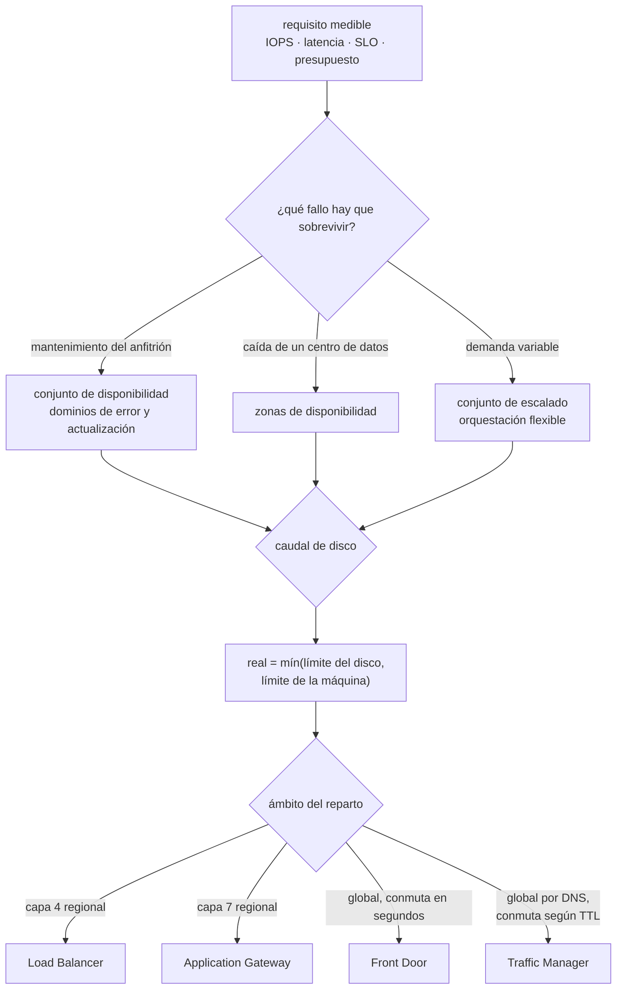

# 040 — Virtual Machines, Scale Sets y Load Balancer

> [← Clase anterior](../../part-03-azure-core-platform/039-virtual-network-subredes-nsg-udr-peering-y-private-link/README.md) · [Índice de la parte](../README.md) · [Clase siguiente →](../../part-03-azure-core-platform/041-blob-storage-files-redundancia-y-lifecycle/README.md)

**Parte:** 03 — Azure: plataforma esencial<br>
**Nivel:** intermedio · **Horas estimadas:** 4<br>
**Laboratorio:** `compute` · **Estado:** `EXECUTABLE_CORE`

## 🎯 Propósito

Dimensionar cómputo en Azure sabiendo que hay dos límites de disco y casi siempre manda el que no compraste: el de la máquina. Las clases 028 y 029 dejaron el criterio —familia, IOPS, elasticidad, comprobación de estado—; aquí cambian las piezas y aparecen decisiones que en AWS no existen: los dominios de actualización, las dos orquestaciones de un conjunto de escalado, cuatro balanceadores con un reparto distinto y un aviso de desalojo de 30 segundos en vez de dos minutos.

## 📚 Resultados de aprendizaje

Al finalizar podrás:

1. **Leer** el nombre de un tamaño de máquina virtual como una especificación y detectar qué falta cuando no lleva `s` ni `d`.
2. **Distinguir** el límite de IOPS del disco del límite de la máquina y localizar cuál es el cuello de botella real.
3. **Elegir** entre conjunto de disponibilidad, zonas y conjunto de escalado según el fallo que se quiere sobrevivir.
4. **Configurar** un conjunto de escalado con orquestación flexible, mezcla de prioridades y política de reducción explícita.
5. **Seleccionar** entre los cuatro balanceadores de Azure a partir del ámbito, la capa y el tiempo de conmutación aceptable.

## 🧩 Conceptos centrales

| Concepto | Comprensión verificable |
|---|---|
| `tamaño de máquina virtual` | Cadena con estructura: familia, número de vCPU y letras aditivas. `s` habilita discos premium, `d` añade disco temporal local, `a` indica AMD, `p` indica ARM. Sin la letra, la capacidad **no existe**. |
| `límite de la máquina frente al del disco` | Cada tamaño tiene un tope propio de IOPS y de rendimiento de disco, distinto del que ofrece el disco. El caudal real es **el menor de los dos**. |
| `almacenamiento en caché del host` | Modo de caché del disco en el anfitrión: `None`, `ReadOnly` o `ReadWrite`. Cambia el límite aplicable y, en discos de registro de transacciones, `ReadWrite` puede costar datos. |
| `dominio de actualización` | Grupo de máquinas que el mantenimiento planificado de la plataforma reinicia a la vez. Un conjunto de disponibilidad con cinco garantiza que como mucho una quinta parte se reinicie de golpe. |
| `orquestación flexible` | Modo de conjunto de escalado en el que las instancias son máquinas virtuales reales, gestionables una a una y con tamaños o prioridades mezcladas. Es el modo por defecto. |
| `aviso de desalojo` | Notificación de eventos programados que anuncia el desalojo de una máquina de excedente. En Azure son **30 segundos**, no dos minutos: solo sirve para abortar, no para drenar. |

## 🧠 Modelo mental

En Azure, identidad y jerarquía organizacional preceden al recurso: tenant, management group, suscripción y resource group determinan el alcance de control.

Aplicado a esta clase, separa siempre cuatro planos: **intención** (qué necesita el usuario),
**configuración** (qué declaramos), **estado observado** (qué existe de verdad) y
**evidencia** (cómo sabemos que cumple). Confundirlos produce diseños que se ven correctos
en un diagrama pero fallan al operar.

## 🗺️ Flujo de razonamiento



## 📖 Desarrollo

### 1. Las letras del tamaño son la especificación

La clase 028 dejó establecido que el nombre de una instancia es una especificación, no una etiqueta. En Azure el alfabeto es otro y el orden importa:

```text
Standard_D8ads_v6
         │ │││ └── generación
         │ ││└──── s : admite discos premium
         │ │└───── d : incluye disco temporal local
         │ └────── a : procesador AMD
         └──────── D8 : familia de propósito general, 8 vCPU
```

Las familias, en una línea cada una:

```text
B   ráfaga con créditos      cargas ociosas la mayor parte del tiempo
D   propósito general        4 GB de memoria por vCPU
E   memoria                  8 GB por vCPU — bases de datos, cachés
F   cómputo                  2 GB por vCPU — cálculo, compilación
L   almacenamiento           NVMe local grande y muy rápido
M   memoria extrema          cargas SAP y bases de datos monolíticas
N   GPU
```

Las dos letras que más problemas dan son las que **no** están:

**Sin `s`**, el tamaño no admite discos premium. Se descubre al desplegar, con un error de compatibilidad que no menciona la letra, y obliga a cambiar el tamaño —y por tanto a reiniciar— con la plantilla ya en producción.

**Sin `d`**, no hay disco temporal local. Y aquí está el error silencioso: mucha automatización heredada asume que existe `/mnt` en Linux o `D:` en Windows porque «siempre estuvo ahí». En un `D8s_v5` no está. El servicio arranca, escribe en la raíz del disco del sistema operativo, y semanas después el disco se llena o el rendimiento cae, porque el disco del sistema no está dimensionado para eso.

Y una advertencia sobre el disco temporal cuando **sí** existe: es efímero de verdad. Se borra al desasignar la máquina y al moverla de anfitrión, sin aviso y sin copia. Sirve para archivos de intercambio, cachés reconstruibles y ficheros temporales de compilación. Poner ahí datos de una base de datos es la versión de Azure del problema que cerró la clase 028: **el estado local es el enemigo de la elasticidad**, y en este caso ni siquiera hay que escalar para perderlo.

Sobre la familia **B** basta con una nota, porque el mecanismo de créditos ya se trabajó en 028: es el mismo desplome, con distinta contabilidad. La diferencia práctica es que la señal se llama `CPU Credits Remaining` y hay que graficarla junto al porcentaje de CPU. Sin ella, un servicio que agota créditos aparece en el panel como una CPU al 20 % —el límite base— mientras las latencias se disparan, exactamente el falso negativo que describía aquella clase.

### 2. Dos límites de disco, y casi siempre manda el que no compraste

Este es el punto donde Azure se aparta más de AWS, y produce la conversación de «duplicamos el disco y no cambió nada».

En el SSD premium clásico, **el rendimiento se compra comprando tamaño**. No hay un parámetro de IOPS que ajustar: cada escalón de tamaño trae su cifra:

```text
P10    128 GiB      500 IOPS     100 MB/s
P20    512 GiB    2.300 IOPS     150 MB/s
P30  1.024 GiB    5.000 IOPS     200 MB/s
P40  2.048 GiB    7.500 IOPS     250 MB/s
```

Quien viene de `gp3` —donde IOPS y tamaño se compran por separado— compra tamaño que no necesita para conseguir IOPS que sí. Las alternativas modernas lo desacoplan: **SSD premium v2** y **Ultra Disk** permiten fijar tamaño, IOPS y rendimiento de forma independiente, que es el comportamiento esperado; a cambio, no admiten caché del host y v2 tiene restricciones de zona.

Pero la cifra del disco es solo la mitad. **Cada tamaño de máquina tiene su propio tope de IOPS y de MB/s**, y el caudal real es el menor de los dos:

```text                 IOPS sin caché   MB/s sin caché
Standard_D2s_v5         3.750             85
Standard_D4s_v5         6.400            145
Standard_D8s_v5        12.800            290
Standard_D16s_v5       25.600            600
```

```text
P40 (7.500 IOPS) en un D2s_v5 (3.750)  →  real: 3.750
cambiar a P50 no mueve la cifra
cambiar a D8s_v5 la sube a 7.500
```

La regla operativa es corta: **antes de comprar disco, mira la fila de la máquina**. Y para diagnosticar, la señal que lo distingue es la profundidad de cola junto al porcentaje de uso del disco: si el disco no está saturado y la cola crece, el techo es de la máquina.

La **caché del host** añade un tercer factor y una decisión con consecuencias:

```text
None       lecturas y escrituras van al disco
           → discos de registro de transacciones y cargas de escritura intensa
ReadOnly   lecturas desde la memoria del anfitrión, escrituras al disco
           → discos de datos con lectura predominante; suele ser la mejor opción
ReadWrite  escrituras confirmadas en la caché del anfitrión
           → solo el disco del sistema operativo
```

`ReadWrite` en un disco de datos o de registro es un error con consecuencias reales: si el anfitrión se reinicia de forma no ordenada, las escrituras confirmadas a la aplicación y aún no bajadas al disco **se pierden**, y un motor transaccional se encuentra con un registro incoherente. El motivo por el que ocurre es prosaico: `ReadWrite` es el valor por defecto del disco del sistema, y quien copia la plantilla lo arrastra al resto.

Y un detalle contable: la caché cambia el límite aplicable. Un `D8s_v5` tiene un tope con caché mayor que sin ella, pero **ese tope solo aplica a lo que la caché sirve**. Contar con el número grande para dimensionar una carga de escritura es contar con capacidad que no se va a usar.

### 3. Tres formas de sobrevivir y no todas se combinan

Azure separa en tres construcciones lo que AWS resuelve casi todo con zonas:

| | Qué fallo sobrevive | Ámbito | SLA orientativo |
|---|---|---|---|
| Máquina única con disco premium | Ninguno estructural | Un anfitrión | ~99,9 % |
| Conjunto de disponibilidad | Fallo de bastidor y mantenimiento planificado | Un centro de datos | ~99,95 % |
| Zonas de disponibilidad | Caída de un centro de datos completo | Una región | ~99,99 % |

El **conjunto de disponibilidad** no tiene equivalente directo en AWS y aporta algo que las zonas no dan: los **dominios de actualización**. Son la unidad del mantenimiento planificado de la plataforma:

```text
dominios de error        (hasta 3)  bastidores distintos: alimentación y red
dominios de actualización (hasta 20) grupos que se reinician por separado
                                     al actualizar el anfitrión
```

Con cinco dominios de actualización y diez máquinas, un mantenimiento reinicia como mucho dos a la vez. Sin conjunto de disponibilidad, nada impide que la plataforma reinicie las diez.

La restricción que hay que conocer antes de dibujar: **conjunto de disponibilidad y zonas son excluyentes**. Una máquina está en uno o en otras, y cambiar de decisión implica recrearla. En una región con zonas, la elección casi siempre es zonas; el conjunto de disponibilidad queda para regiones sin ellas.

El **conjunto de escalado** es la pieza que integra ambas cosas con elasticidad, y tiene dos modos:

| | Uniforme | **Flexible** |
|---|---|---|
| Las instancias son | Objetos del conjunto | Máquinas virtuales reales |
| Tamaños mezclados | No | **Sí** |
| Excedente y bajo demanda mezclados | No | **Sí** |
| Gestión individual | Limitada | `az vm` funciona sobre ellas |
| Reparto por dominios de error | Implícito | Explícito y configurable |

**Flexible es el modo por defecto y el que conviene** salvo que se necesite escalar a miles de instancias idénticas muy rápido. La razón práctica: permite mezclar prioridades —una base bajo demanda y el pico en excedente— y deja diagnosticar una instancia concreta con las mismas herramientas que cualquier otra máquina.

El autoescalado vive en Azure Monitor, no en el conjunto. Los cuatro parámetros y el efecto de la histéresis ya se trabajaron en la clase 029; lo que cambia aquí son dos cosas concretas:

```text
política de reducción    Default | NewestVM | OldestVM
                         decide a quién apagar; con Default, el reparto
                         entre zonas se mantiene equilibrado
perfiles                 por defecto + perfiles con horario
                         para carga predecible, un perfil horario evita
                         escalar por reacción
```

Y la trampa compartida con AWS, que conviene repetir porque cuesta una noche: **la memoria no es una métrica del anfitrión**. El porcentaje de CPU se publica sin instalar nada; la memoria y el espacio en disco exigen el agente de Azure Monitor. Una regla de escalado por memoria configurada sin agente no falla: **no dispara nunca**.

### 4. Cuatro balanceadores y la conmutación que depende del TTL

El reparto de Azure no coincide con el de AWS, y traducir «esto es el ALB» produce elecciones equivocadas:

| Servicio | Capa | Ámbito | Conmuta en | Equivalente aproximado |
|---|---|---|---|---|
| Load Balancer | 4 | Regional | Segundos | Network Load Balancer |
| Application Gateway | 7 | Regional | Segundos | Application Load Balancer + WAF |
| Front Door | 7 | **Global**, anycast | Segundos | CloudFront + enrutamiento global |
| Traffic Manager | DNS | **Global** | **Lo que dure el TTL y la caché del cliente** | Políticas de enrutamiento de Route 53 |

La fila que hay que leer dos veces es la última. Traffic Manager no ve el tráfico: responde consultas de DNS. Cuando una región cae, la conmutación no ocurre hasta que cada cliente vuelve a resolver el nombre, y los clientes no respetan el TTL de forma uniforme:

```text
TTL de 60 s + caché del resolutor + caché de la JVM o del navegador
→ conmutación observada de varios minutos, con una cola larga
   de clientes que siguen yendo a la región caída
```

Para un requisito de conmutación en segundos, la respuesta es Front Door: el cliente conecta siempre a la misma dirección anycast y el borde decide a qué origen enviar. Traffic Manager sigue siendo útil para lo que sí resuelve bien: dirigir por proximidad geográfica, repartir entre destinos que no son HTTP y encaminar hacia recursos fuera de Azure.

Sobre el **Load Balancer** estándar hay cuatro hechos que producen incidentes:

**Es denegar por defecto.** El SKU básico se retiró el 30 de septiembre de 2025, y el estándar no acepta tráfico entrante si un NSG no lo permite explícitamente — el básico sí lo aceptaba. Una migración literal deja el servicio inalcanzable con toda la configuración aparentemente correcta.

**No da salida por tener entrada.** Una regla de balanceo entrante no proporciona conectividad saliente. Unido a la retirada del acceso saliente predeterminado de la clase 039, un despliegue nuevo se queda literalmente sin salida hasta que se declara un NAT Gateway o una regla de salida.

**Las sondas llegan desde `168.63.129.16`.** Es una dirección virtual de la plataforma, la misma que sirve DHCP, DNS y el canal del agente de la máquina. Bloquearla no solo tumba las sondas: deja al agente sin comunicación, así que las extensiones dejan de responder y las operaciones desde el portal se quedan colgadas. Es un fallo con dos síntomas que parecen no tener relación.

**La sonda debe reflejar disponibilidad real.** Vale aquí íntegra la lección de la clase 029: un `/` que devuelve 200 mientras la base de datos no responde mantiene en rotación a una instancia que no puede servir. La forma correcta es un punto de comprobación que verifique las dependencias críticas, con un umbral de fallos consecutivos que tolere un parpadeo.

Un detalle propio de Azure que aparece en migraciones de bases de datos con clúster: la **IP flotante** —retorno directo desde el servidor— hace que el destino vea la dirección del frontal en lugar de la suya. Es imprescindible para grupos de disponibilidad de SQL Server y rompe cualquier servicio que no espere ese comportamiento. Y la regla de **puertos de alta disponibilidad**, que balancea todos los puertos y protocolos a la vez, existe para poner dispositivos virtuales de red en alta disponibilidad detrás de un balanceador interno: es la pieza que faltaba en el diseño de concentrador y radio de la clase 039.

### 5. Excedente: 30 segundos cambian el diseño

Las máquinas de excedente cuestan entre un 60 % y un 90 % menos y se retiran cuando Azure necesita la capacidad. La clase 028 fijó el criterio de los modelos de compra; lo que cambia aquí es un número:

```text
AWS   aviso de interrupción de excedente   ~120 s
Azure aviso de desalojo                     ~30 s
```

Treinta segundos no dan para drenar conexiones, terminar una petición larga ni volcar un estado grande. Dan para **abortar de forma ordenada**: dejar de aceptar trabajo, confirmar o descartar la unidad en curso y salir. Cualquier diseño que dependa de un drenado educado sobre excedente en Azure está apostando a que el aviso llegue antes de lo prometido.

El aviso se consulta contra el servicio de metadatos, no llega solo:

```bash
$ curl -s -H Metadata:true \
    "http://169.254.169.254/metadata/scheduledevents?api-version=2020-07-01" | jq -r \
    '.Events[] | "\(.EventType) \(.NotBefore)"'
Preempt  Mon, 03 Aug 2026 11:42:07 GMT
```

Y la política de desalojo decide qué queda después:

```text
Deallocate   la máquina se detiene y se conserva; sigue pagando el disco
             y puede volver a arrancar cuando haya capacidad
Delete       se elimina; no queda nada que pagar ni que recuperar
```

Para un conjunto de escalado, `Delete` es casi siempre lo correcto: máquinas desasignadas que nadie recuerda son una partida silenciosa en la factura y una lista de recursos huérfanos. `Deallocate` tiene sentido en una estación de trabajo con estado en su disco.

La forma sensata de usar excedente es mezclarlo, y para eso hace falta orquestación flexible:

```bash
$ az vmss create -g rg-app -n vmss-catalogo --orchestration-mode Flexible \
    --instance-count 4 --zones 1 2 3 \
    --priority Spot --eviction-policy Delete --max-price -1
```

```text
base bajo demanda   capacidad mínima que sostiene el SLO aunque se vaya todo el excedente
pico en excedente   el resto
```

El dimensionado de la base no es una preferencia: es **la carga que el servicio debe seguir atendiendo si el excedente desaparece entero en el mismo minuto**, que es un escenario real cuando la región se queda sin capacidad. Y `--max-price -1` significa «acepto pagar hasta el precio bajo demanda», que evita un desalojo por precio además del desalojo por capacidad: fijar un máximo bajo añade una segunda causa de interrupción que casi nunca compensa.

## 🔬 Ejemplo trabajado

**CloudShop traslada la capa de cómputo a Azure con la arquitectura de las clases 028 y 029. La traducción es correcta en el papel y produce cuatro problemas medibles.**

Punto de partida:

```text
base de datos   Standard_D2s_v5  + disco P40 (2 TiB, 7.500 IOPS), caché ReadWrite
catálogo        4 × Standard_D4s_v5 en conjunto de escalado uniforme
reparto         Load Balancer básico + Traffic Manager entre dos regiones
```

**Problema 1 — se duplicó el disco y el rendimiento no se movió.**

La base de datos se queda en 3.750 IOPS bajo carga, con la cola de disco creciendo.

```bash
$ az monitor metrics list --resource $VM_ID --metric "Data Disk IOPS Consumed Percentage" \
    --aggregation Maximum --interval PT1M --query "value[0].timeseries[0].data[-3:].maximum"
[49.8, 50.1, 49.9]
```

**El disco está al 50 %.** No es el disco. La fila de la máquina lo explica:

```text
P40             7.500 IOPS
D2s_v5          3.750 IOPS sin caché   ← el techo real
```

Se corrige por el lado correcto y se aprovecha para dejar de pagar tamaño que no se usa:

```text                                     antes            después
máquina           D2s_v5 (3.750 IOPS)   D8s_v5 (12.800 IOPS)
disco             P40 · 2 TiB · ~259     P30 · 1 TiB · ~135
IOPS reales             3.750                  5.000
costo de disco     259 USD/mes            135 USD/mes
```

El volumen ocupado eran 640 GiB: la P40 se había comprado por sus IOPS, que la máquina nunca dejó alcanzar.

**Problema 2 — un reinicio del anfitrión deja el registro de transacciones incoherente.**

Durante un mantenimiento no planificado, el motor no arranca y reporta escrituras confirmadas que no están en disco.

```bash
$ az vm show -g rg-datos -n vm-db-01 \
    --query "storageProfile.dataDisks[].{lun:lun,cache:caching}" -o tsv
0   ReadWrite
1   ReadWrite
```

Ambos discos de datos con `ReadWrite`, heredado de la plantilla del disco del sistema. Se corrige por función:

```bash
$ az vm update -g rg-datos -n vm-db-01 --disk-caching 0=ReadOnly 1=None
```

```text
LUN 0  datos      ReadOnly   lectura predominante, la caché ayuda
LUN 1  registro   None       ninguna escritura confirmada fuera del disco
```

Y se añade la consecuencia operativa que faltaba: la restauración se prueba, no se supone. La prueba de recuperación pasa a ejecutarse mensualmente con evidencia, siguiendo el criterio de la clase 030 — replicación no es copia de seguridad.

**Problema 3 — la migración del balanceador deja el servicio inalcanzable.**

Al sustituir el balanceador básico por el estándar, el frontal deja de responder. La configuración es idéntica.

```bash
$ az network watcher test-ip-flow --vm cat-01 --direction Inbound --protocol TCP \
    --local 10.20.4.11:8080 --remote 168.63.129.16:62000
Access: Deny   RuleName: defaultSecurityRules/DenyAllInBound
```

Dos cosas a la vez: el estándar es denegar por defecto y no había NSG que permitiera nada, porque el básico nunca lo había exigido. Además, no había salida.

```bash
$ az network nsg rule create -g rg-red --nsg-name nsg-app -n allow-lb-probe \
    --priority 100 --direction Inbound --access Allow --protocol '*' \
    --source-address-prefixes AzureLoadBalancer --destination-port-ranges '*'
$ az network nsg rule create -g rg-red --nsg-name nsg-app -n allow-appgw-8080 \
    --priority 110 --direction Inbound --access Allow --protocol Tcp \
    --source-address-prefixes 10.20.4.128/26 --destination-port-ranges 8080
$ az network vnet subnet update -g rg-red --vnet-name vnet-spoke-app -n snet-app \
    --nat-gateway natgw-spoke-app
```

Y se corrige la sonda, que apuntaba a `/`:

```text
antes    GET /          200 mientras la base de datos no respondía
después  GET /readyz    comprueba base de datos y caché;
                        3 fallos consecutivos para retirar de rotación
```

**Problema 4 — una conmutación de región que tardó nueve minutos.**

Un simulacro corta la región primaria. Traffic Manager marca el destino como degradado en 40 s; el tráfico tarda mucho más en moverse.

```text
t+0:00   se corta la región primaria
t+0:40   Traffic Manager marca el destino como degradado
t+1:10   el DNS ya devuelve la región secundaria
t+9:20   el último cliente deja de intentar contra la región caída
```

Los nueve minutos no son del servicio: son de la caché de DNS de los clientes, que no respetan el TTL de 60 s. Se antepone Front Door para el tráfico HTTP y se conserva Traffic Manager solo para el enrutamiento geográfico de un servicio que no es HTTP:

```text
simulacro repetido con Front Door
t+0:00   se corta la región primaria
t+0:35   el borde deja de enviar al origen caído
t+0:41   error observado por el cliente: ninguno tras el reintento
```

**Y una revisión de costo que no estaba en el plan.** El conjunto de escalado uniforme no permitía mezclar prioridades. Al pasarlo a flexible:

```text                                antes                después
orquestación                 uniforme             flexible
capacidad base           4 × D4s_v5 bajo demanda   2 × D4s_v5 bajo demanda
pico                     escala en bajo demanda    hasta 6 × D4s_v5 excedente
costo mensual de cómputo      ~702 USD               ~412 USD
disco de base de datos         259 USD                135 USD
                            ──────────             ──────────
                               961 USD                547 USD   (−43 %)
```

La base de dos instancias bajo demanda no es un número redondeado a ojo: es la capacidad que sostiene el percentil 95 de tráfico observado si **todo** el excedente desaparece en el mismo minuto. Se comprobó apagando las seis instancias de excedente a la vez y midiendo la latencia resultante:

```text
con 2 bajo demanda y 0 excedente, a carga de p95
p99 de latencia   340 ms  (SLO: 500 ms)                                     ✓
```

**La lección que esta clase traslada al resto de la parte**: en Azure el cuello de botella rara vez está donde se compró la capacidad. El disco, la máquina y la caché tienen topes distintos, y el balanceador y el DNS tienen tiempos de reacción distintos. La cifra que importa siempre es **el mínimo de la cadena**, y es la que hay que medir antes de firmar un SLO.

## 🧪 Laboratorio guiado

Ejecuta desde la raíz:

```bash
python classes/part-03-azure-core-platform/040-virtual-machines-scale-sets-y-load-balancer/lab.py
```

El laboratorio selecciona el motor de práctica **`compute`** y produce
`lab_result.json`. El escenario, sus comprobaciones y el artefacto esperado corresponden a
esta clase; no requiere credenciales y deja explícito qué debe revalidarse en un sandbox real.

1. Lee `exercise.steps` y formula una predicción antes de ejecutar.
2. Ejecuta la práctica y verifica todos los elementos de `checks`.
3. Provoca el caso de `negative_test` y explica la señal observada.
4. Materializa `servicio-elastico-azure` en `evidence/` usando la plantilla indicada.
5. Para proveedor real, sigue `sandbox.requires`, registra costo y ejecuta `destroy`.

### Evidencia esperada

El artefacto principal es una selección de capacidad justificada y observable. Además, la entrega debe incluir el comando ejecutado,
la salida estructurada y una conclusión que no exceda lo observado.

## 🏆 Reto verificable

Construye **`servicio-elastico-azure`** para el caso CloudShop. Incluye una alternativa descartada,
un supuesto que pueda falsarse, una prueba de fallo y una decisión de rollback.

## ✅ Criterio de aceptación

- [ ] `lab.py` termina con código 0 y genera JSON válido.
- [ ] La entrega conecta al menos tres requisitos con mecanismos verificables.
- [ ] Existe una prueba positiva y una prueba negativa con evidencia.
- [ ] Seguridad, costo y operación aparecen como decisiones, no como anexos.
- [ ] Se declara una limitación y una condición que obligaría a revisar el diseño.
- [ ] Otra persona puede repetir el recorrido sin conocimiento tácito.

## ⚠️ Errores frecuentes

| Síntoma | Causa probable | Corrección |
|---|---|---|
| Se aumenta el tamaño del disco y el rendimiento no cambia | El tope efectivo es el de la máquina virtual, no el del disco | Consulta las IOPS y MB/s sin caché del tamaño elegido; el caudal real es el mínimo de los dos y se corrige cambiando de tamaño. |
| La automatización falla porque `/mnt` o `D:` no existe | El tamaño elegido no lleva la letra `d`, así que no tiene disco temporal local | Elige un tamaño con `d` o retira la dependencia del disco temporal; nunca guardes ahí datos que deban sobrevivir. |
| Tras un reinicio no ordenado del anfitrión, el motor transaccional reporta escrituras perdidas | El disco de registro tenía caché `ReadWrite`, heredada de la plantilla del disco del sistema | `None` en el disco de registro, `ReadOnly` en los de datos con lectura predominante; `ReadWrite` solo en el disco del sistema. |
| Al migrar del balanceador básico al estándar, el servicio queda inalcanzable | El estándar deniega el tráfico entrante salvo que un NSG lo permita, y no proporciona salida por tener reglas de entrada | Añade reglas de NSG para la etiqueta `AzureLoadBalancer` y para el origen real, y declara la salida con NAT Gateway. |
| La regla de autoescalado por memoria nunca dispara | La memoria no es una métrica del anfitrión: requiere el agente de Azure Monitor | Instala el agente y verifica que la métrica llega antes de confiar la elasticidad a esa regla. |
| La conmutación entre regiones tarda minutos pese a que la sonda detecta el fallo en segundos | Traffic Manager conmuta por DNS y los clientes cachean más allá del TTL | Usa Front Door para el tráfico HTTP; reserva Traffic Manager para enrutamiento geográfico y destinos que no son HTTP. |

## 🛡️ Seguridad, ética y costo

Trabaja con cuentas propias o sandboxes autorizados. No publiques secretos, identificadores
reales ni datos personales. Antes de crear recursos pagos define presupuesto, etiquetas y
comando de destrucción; después verifica que no queden recursos huérfanos. Los ejemplos
locales enseñan contratos, pero no certifican cumplimiento ni disponibilidad de producción.

## ❓ Preguntas de comprobación

1. ¿Qué capacidades pierdes con un tamaño sin `s` y sin `d`, y cuándo lo descubrirías en cada caso?
2. Un disco P40 rinde 3.750 IOPS. ¿Qué medirías para decidir si el problema es el disco o la máquina?
3. ¿Qué aporta un conjunto de disponibilidad que las zonas no dan, y por qué no se pueden combinar?
4. ¿Por qué la orquestación flexible permite una estrategia de costo que la uniforme no?
5. El aviso de desalojo de excedente es de 30 segundos. ¿Qué diseños quedan descartados y cómo se dimensiona la capacidad base?

## 🔗 Referencias

- Microsoft (2025). *Sizes for virtual machines in Azure* — nomenclatura, letras aditivas y límites por tamaño. <https://learn.microsoft.com/en-us/azure/virtual-machines/sizes/overview>
- Microsoft (2025). *Azure managed disk types* — escalones de rendimiento, SSD premium v2 y Ultra Disk. <https://learn.microsoft.com/en-us/azure/virtual-machines/disks-types>
- Microsoft (2025). *Virtual Machine Scale Sets orchestration modes* — flexible frente a uniforme. <https://learn.microsoft.com/en-us/azure/virtual-machine-scale-sets/virtual-machine-scale-sets-orchestration-modes>
- Microsoft (2025). *Load-balancing options* — Load Balancer, Application Gateway, Front Door y Traffic Manager. <https://learn.microsoft.com/en-us/azure/architecture/guide/technology-choices/load-balancing-overview>
- Microsoft (2025). *Azure Spot Virtual Machines* — aviso de desalojo, políticas y precio máximo. <https://learn.microsoft.com/en-us/azure/virtual-machines/spot-vms>
- Documentación oficial vigente del servicio implementado; registra URL y fecha de consulta.

---

> [Evaluación](assessment.md) · [Contrato de clase](lesson.yaml) · [Índice de la parte](../README.md)
