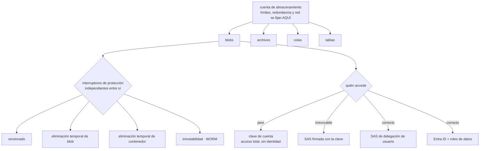

# 041 — Blob Storage, Files, redundancia y lifecycle

> [← 040 · Virtual Machines, Scale Sets y Load Balancer](../../part-03-azure-core-platform/040-virtual-machines-scale-sets-y-load-balancer/README.md) · [Índice de la parte](../README.md) · [042 · Azure SQL, Cosmos DB y Azure Cache for Redis →](../../part-03-azure-core-platform/042-azure-sql-cosmos-db-y-azure-cache-for-redis/README.md)

**Parte:** 03 — Azure: plataforma esencial<br>
**Nivel:** intermedio · **Horas estimadas:** 4<br>
**Laboratorio:** `storage` · **Estado:** `EXECUTABLE_CORE`

## 🎯 Propósito

Operar el almacenamiento de Azure sabiendo que la unidad de configuración no es el contenedor sino la cuenta, y que casi todo lo que protege los datos son interruptores separados que hay que activar uno a uno. La clase 030 dejó el criterio —versionado, clases, público bloqueado, replicación no es copia—; aquí cambia dónde vive cada control, y aparecen tres decisiones que en AWS no existen: la región emparejada no se elige, la conmutación la inicias tú, y borrar un contenedor no es lo mismo que borrar sus blobs.

## 📚 Resultados de aprendizaje

Al finalizar podrás:

1. **Dimensionar** cuentas de almacenamiento sabiendo qué límites son de la cuenta y qué configuraciones arrastra todo lo que hay dentro.
2. **Elegir** redundancia distinguiendo lo que protege de lo que cuesta, y sabiendo qué ocurre con la cuenta después de una conmutación.
3. **Calcular** el punto de equilibrio de un nivel de acceso frío antes de mover datos a él.
4. **Configurar** los interruptores de protección —versionado, eliminación temporal de blob y de contenedor, inmutabilidad— y demostrar cada uno con una prueba de recuperación.
5. **Sustituir** claves de cuenta y firmas irrevocables por identidad y firmas de delegación de usuario.

## 🧩 Conceptos centrales

| Concepto | Comprensión verificable |
|---|---|
| `cuenta de almacenamiento` | Unidad de configuración, facturación y límites. Contiene blobs, archivos, colas y tablas a la vez, y su nombre es una etiqueta DNS **global**: 3 a 24 caracteres, minúsculas y dígitos, sin guiones. |
| `región emparejada` | Destino de la replicación geográfica, **asignado por Microsoft** y no elegible. Si el dato no puede salir de una jurisdicción, esa asignación puede descartar la redundancia geográfica. |
| `conmutación de cuenta` | Cambio de la región principal a la secundaria. La inicia el cliente, pierde lo no replicado y deja la cuenta **como LRS**, lo que obliga a reconfigurar la redundancia después. |
| `eliminación temporal` | Dos interruptores independientes: uno para blobs y otro para contenedores. Activar el primero **no protege** de borrar el contenedor entero. |
| `firma de delegación de usuario` | SAS firmada con una clave derivada de Entra ID en vez de con la clave de la cuenta. Caduca en 7 días como máximo y **se puede revocar** sin romper el resto. |
| `regla de ciclo de vida` | Directiva JSON de la cuenta que mueve o borra por antigüedad. Si solo apunta a `baseBlob`, las versiones e instantáneas se quedan y la factura no baja. |

## 🧠 Modelo mental

En Azure, identidad y jerarquía organizacional preceden al recurso: tenant, management group, suscripción y resource group determinan el alcance de control.

Aplicado a esta clase, separa siempre cuatro planos: **intención** (qué necesita el usuario),
**configuración** (qué declaramos), **estado observado** (qué existe de verdad) y
**evidencia** (cómo sabemos que cumple). Confundirlos produce diseños que se ven correctos
en un diagrama pero fallan al operar.

## 🗺️ Flujo de razonamiento



## 📖 Desarrollo

### 1. La cuenta es la unidad, y arrastra todo lo que hay dentro

En AWS el bucket es la unidad: sus políticas, su cifrado y su bloqueo de acceso público valen para él y para nadie más. En Azure la unidad es **la cuenta de almacenamiento**, y dentro de ella conviven cuatro servicios:

```text
cuenta stcloudshopprod
  ├─ blobs      objetos
  ├─ archivos   recursos compartidos SMB y NFS
  ├─ colas      mensajería simple
  └─ tablas     clave-valor
```

Lo que se decide en la cuenta y **no** se puede matizar por contenedor:

```text
redundancia (LRS, ZRS, GRS, GZRS)
reglas de red y punto de conexión privado
versión mínima de TLS
acceso con clave compartida habilitado o no
acceso público anónimo permitido o no
nivel de acceso por defecto
cifrado y clave gestionada por el cliente
```

Esa lista es la razón por la que **una cuenta para todo es un error de diseño**, aunque parezca ordenado. Datos con requisitos distintos de residencia, de retención o de exposición terminan compartiendo la misma configuración, y el único modo de separarlos después es copiar terabytes.

Además la cuenta tiene límites propios que un bucket no tiene:

```text
capacidad                     5 PiB (ampliable por solicitud)
frecuencia de solicitudes    ~20.000 por segundo
salida en la región primaria  límite por cuenta, no por contenedor
```

Un servicio ruidoso puede limitar a los demás inquilinos de la misma cuenta. El síntoma es un `503 ServerBusy` intermitente en un servicio que no cambió nada, causado por otro que sí. La respuesta a `x-ms-request-id` y el contador `Throttling Error` lo identifican en un minuto; el arreglo es repartir en varias cuentas, no reintentar más fuerte.

Y el nombre importa más de lo que parece: es una etiqueta DNS global, de 3 a 24 caracteres, minúsculas y dígitos, **sin guiones ni puntos**. Una convención de nombres que incluya guiones —muy común al llegar de AWS— no se puede aplicar aquí, así que conviene fijarla antes de crear la primera:

```text
st  cloudshop  prod  weu  01
│   │          │     │    └── secuencia
│   │          │     └─────── región
│   │          └───────────── entorno
│   └──────────────────────── sistema
└──────────────────────────── tipo de recurso
```

### 2. Redundancia: la región no se elige y la conmutación la inicias tú

Cinco opciones, dos ejes: cuántas copias y dónde.

| | Copias | Sobrevive a | Lectura en la secundaria |
|---|---|---|---|
| LRS | 3 en un centro de datos | Fallo de disco o bastidor | — |
| ZRS | 3 en tres zonas | Caída de un centro de datos | — |
| GRS | 3 locales + 3 remotas | Caída de la región | No |
| GZRS | 3 zonas + 3 remotas | Caída de la región, con zonas en la principal | No |
| RA-GRS / RA-GZRS | Igual | Igual | **Sí**, con un nombre `-secondary` |

Tres hechos cambian cómo se diseña con esto, y ninguno tiene equivalente directo en la replicación entre regiones de AWS:

**La región emparejada la asigna Microsoft.** No se elige el destino. Para una carga sujeta a residencia de datos, eso puede descalificar la redundancia geográfica entera: si el par asignado está fuera de la jurisdicción aprobada, la opción correcta es ZRS más una **replicación de objetos** explícita hacia una cuenta en la región que sí lo está. Es más trabajo y es la única que se puede documentar ante un auditor.

**La replicación es asíncrona y su retraso no es un compromiso de servicio.** El indicador es `Last Sync Time`, y es la única fuente honesta del RPO real:

```bash
$ az storage account show -n stcloudshopprod -g rg-datos \
    --expand geoReplicationStats --query "geoReplicationStats.lastSyncTime" -o tsv
2026-08-01T09:47:12Z
```

Todo lo escrito después de esa marca **no está** en la secundaria. Un RPO declarado de 15 minutos que no se contrasta con esta métrica es una aspiración, no un dato.

**La conmutación no es automática y deja la cuenta en LRS.** Nadie la ejecuta por ti: es una operación que inicia el cliente, y después de completarse la cuenta queda como LRS en la que era región secundaria. Es decir:

```text
antes del incidente   GRS   principal weu, secundaria nue
durante la conmutación      se pierde lo posterior a lastSyncTime
después                LRS   una sola región, sin redundancia geográfica
acción pendiente             reconfigurar a GRS y esperar la replicación inicial
```

Ese último renglón es el que sorprende: justo después de un incidente regional, la plataforma está **menos** protegida que antes, y volver a estarlo tarda lo que tarde copiar todo el volumen. Un plan de recuperación que no incluya ese paso está incompleto.

Y el cambio entre modelos tampoco es un interruptor: pasar de LRS a ZRS exige una conversión —solicitada o mediante copia manual—, con ventana y sin garantía de instantaneidad. Conviene elegir bien al crear la cuenta, porque corregirlo después cuesta tiempo y tráfico.

### 3. Niveles de acceso: calcula el punto de equilibrio antes de mover nada

Cuatro niveles, con mínimos de permanencia que son la mitad de la decisión:

| | Almacenamiento aprox. | Permanencia mínima | Recuperación |
|---|---|---|---|
| Caliente | ~0,0184 USD/GiB/mes | — | Inmediata |
| Frío (*cool*) | ~0,0100 | 30 días | Inmediata, con cargo por GiB |
| Muy frío (*cold*) | ~0,0036 | 90 días | Inmediata, con cargo mayor |
| Archivo | ~0,0010 | 180 días | **Hay que rehidratar**: hasta 15 h |

La clase 030 ya estableció que el ahorro por nivel a veces no lo es. Aquí está la aritmética con las cifras de Azure, para 1 TiB:

```text
ahorro mensual al pasar de caliente a frío
  (0,0184 − 0,0100) × 1.024 GiB = 8,60 USD/mes

coste de leer ese TiB una vez al mes
  1.024 GiB × 0,01 USD/GiB de recuperación = 10,24 USD
```

**Leer el conjunto entero una sola vez al mes ya destruye el ahorro.** El punto de equilibrio está en releer menos del 84 % del volumen cada mes; por encima, el nivel frío sale más caro que el caliente además de más lento.

Y encima está la penalización por eliminación temprana, que se cobra **prorrateada**: borrar a los 10 días un blob en nivel frío factura los 20 días restantes de los 30 mínimos. En un flujo con mucha rotación —archivos temporales, informes diarios que se sustituyen— mover al nivel frío puede multiplicar la factura en lugar de reducirla.

El nivel **archivo** es una decisión distinta, no un escalón más: el blob no se puede leer. Hay que rehidratarlo, y eso tiene tiempo y precio:

```text
prioridad estándar   hasta 15 h
prioridad alta       menos de 1 h para blobs de menos de 10 GiB, con sobrecoste
```

Quince horas es incompatible con casi cualquier RTO de servicio y perfectamente compatible con una obligación legal de conservar siete años. Esa es la frontera: **archivo es para lo que hay que guardar, no para lo que hay que poder leer**.

Las reglas de ciclo de vida automatizan el movimiento, y tienen dos comportamientos que hay que anticipar:

```json
{
  "rules": [{
    "name": "facturas",
    "type": "Lifecycle",
    "definition": {
      "filters": {"blobTypes": ["blockBlob"], "prefixMatch": ["facturas/"]},
      "actions": {
        "baseBlob": {
          "tierToCool":    {"daysAfterModificationGreaterThan": 30},
          "tierToArchive": {"daysAfterModificationGreaterThan": 365}
        },
        "version":  {"delete": {"daysAfterCreationGreaterThan": 90}},
        "snapshot": {"delete": {"daysAfterCreationGreaterThan": 90}}
      }
    }
  }]
}
```

**Primero**: las secciones `version` y `snapshot` son las que casi nadie escribe, y son la causa de que la factura no baje después de una limpieza. Con versionado activo, borrar un blob no libera nada: crea una versión. Es el mismo mecanismo que el marcador de borrado de la clase 030, con otro nombre y la misma consecuencia contable.

**Segundo**: la directiva se evalúa una vez al día y la primera ejecución puede tardar hasta 48 horas. No es un fallo de configuración, es su cadencia; comprobarla a los diez minutos y volver a escribirla es la forma habitual de perder una tarde.

Y `daysAfterLastAccessTimeGreaterThan` —mover por último acceso en vez de por última modificación— exige activar el seguimiento de acceso, que **tiene su propio costo por transacción**. En un contenedor con lecturas muy frecuentes puede costar más que lo que ahorra el cambio de nivel.

### 4. Cuatro interruptores para proteger lo mismo, y ninguno cubre al otro

Aquí está la trampa más cara de esta clase. Los mecanismos de protección son **independientes**, y activar el evidente deja el hueco:

```text
versionado                        conserva una versión por cada sobrescritura o borrado
eliminación temporal de blob      recupera blobs borrados durante N días
eliminación temporal de contenedor recupera CONTENEDORES borrados durante N días
restauración a un punto anterior  devuelve un rango de blobs a un instante
inmutabilidad                     impide modificar o borrar durante un plazo
```

**La eliminación temporal de blob no protege de borrar el contenedor.** Es literal: con eliminación temporal de blob a 7 días y eliminación temporal de contenedor desactivada, un `az storage container delete` se lleva todo el contenido de forma irreversible. El interruptor que parecía cubrirlo cubría otra cosa.

La configuración completa, y su dependencia entre piezas:

```bash
$ az storage account blob-service-properties update -n stcloudshopprod -g rg-datos \
    --enable-versioning true \
    --enable-delete-retention true --delete-retention-days 30 \
    --enable-container-delete-retention true --container-delete-retention-days 30 \
    --enable-change-feed true \
    --enable-restore-policy true --restore-days 29
```

La restauración a un punto anterior **exige** versionado, fuente de cambios y eliminación temporal de blob, y su ventana debe ser menor que la de retención. Activarla suelta da un error que no explica cuál de las tres falta.

La **inmutabilidad** es otra cosa y responde a otro requisito. Se aplica a contenedor o a versión, en dos formas:

```text
retención por tiempo   ningún borrado ni modificación durante N días
retención legal        indefinida hasta que se retire la etiqueta
```

Y el matiz que la hace útil ante un auditor: mientras la directiva está **bloqueada**, el plazo se puede alargar y **no se puede acortar ni eliminar** — tampoco por el propietario de la suscripción, tampoco por un administrador global. Es la diferencia entre una política y un control: la política la cambia quien tiene permiso, el control no lo cambia nadie. La contrapartida hay que aceptarla de antemano: **la cuenta no se puede borrar mientras haya datos bajo retención**, ni siquiera si se creó por error con un plazo de siete años.

Una última pieza que la clase 030 dejó dicha y aquí tiene dos interruptores en vez de uno: el acceso público anónimo se controla **en la cuenta y en el contenedor**, y basta con que el de la cuenta esté abierto y alguien marque un contenedor como público para exponerlo:

```bash
$ az storage account update -n stcloudshopprod -g rg-datos \
    --allow-blob-public-access false
```

Con eso, ningún contenedor puede ser público aunque su configuración diga que lo es. Es el equivalente al bloqueo en el nivel de la cuenta, y es el que hay que auditar: comprobar contenedor por contenedor es trabajo que se deshace solo.

### 5. Claves, firmas y la que no se puede revocar

Cuatro formas de acceder, ordenadas de peor a mejor:

**Clave de cuenta.** Dos claves, rotables. Conceden **acceso total a los cuatro servicios** de la cuenta y no llevan identidad: el registro dice qué se hizo, no quién. Una clave filtrada es la cuenta entera. La instrucción es desactivarlas:

```bash
$ az storage account update -n stcloudshopprod -g rg-datos --allow-shared-key-access false
```

**SAS firmada con la clave de cuenta.** Es cómoda y tiene un defecto que define la decisión: **no se puede revocar**. Una firma emitida con vencimiento en 2029 sigue siendo válida hasta 2029, y la única forma de invalidarla es rotar la clave con la que se firmó — lo que rompe a la vez a todos los demás que la usan. El repositorio se limpia, la firma sigue funcionando.

Un paliativo parcial es la **directiva de acceso almacenada**: la firma referencia una directiva del contenedor y borrar la directiva invalida las firmas asociadas. Requiere haberlo previsto al emitirlas.

**SAS de delegación de usuario.** Se firma con una clave derivada de Entra ID, no con la clave de cuenta:

```bash
$ az storage blob generate-sas --account-name stcloudshopprod \
    --container-name facturas --name 2026-07.pdf \
    --permissions r --expiry 2026-08-01T18:00Z --as-user --auth-mode login -o tsv
```

Caduca en **7 días como máximo**, hereda los permisos del principal que la emite —no puede conceder más de lo que ese principal tiene— y **se revoca** retirando el rol o revocando las claves de delegación, sin tocar nada más. Es la opción correcta para dar acceso temporal a un objeto concreto.

**Entra ID con roles de datos.** Es la vía por defecto para servicios. Y aquí vuelve, con consecuencias, la distinción de la clase 038:

```text
Storage Account Contributor       gestiona la cuenta y LEE SUS CLAVES
                                  → sin dataActions, pero con la clave se accede a todo
Storage Blob Data Reader          lee los datos, no gestiona la cuenta
Storage Blob Data Contributor     lee y escribe los datos
```

La primera fila es una escalada disfrazada de permiso administrativo: quien puede leer las claves puede hacer todo lo que hacen las claves, sin necesitar ningún rol de datos y sin dejar rastro de identidad. Con `allowSharedKeyAccess` desactivado, ese camino se cierra: la clave existe y no sirve para autenticarse.

Y para **Azure Files** conviene anticipar una decisión de identidad, porque no es simétrica con los blobs:

| | Estándar | Premium |
|---|---|---|
| Soporte | HDD, cobro por transacción | SSD, **capacidad aprovisionada** |
| Rendimiento | Variable | IOPS en función de los GiB aprovisionados |
| NFS | No | Sí, con punto de conexión privado |
| Se factura | Lo usado | **Lo aprovisionado** |

La última fila es la que produce facturas inesperadas: un recurso compartido premium de 5 TiB aprovisionado y 300 GiB usados factura 5 TiB. Y para SMB con identidad de dominio hace falta integrar con AD DS o con Entra Domain Services; sin eso, el acceso es con clave de cuenta, que es justo lo que se acaba de desactivar. Conviene resolverlo antes de migrar un recurso compartido de archivos, no después.

## 🔬 Ejemplo trabajado

**CloudShop lleva a Azure el almacenamiento diseñado en la clase 030. La configuración inicial parece completa: versionado activo, replicación geográfica y niveles de acceso. Cuatro sucesos demuestran que ninguna de las tres cosas hacía lo que el equipo creía.**

Estado inicial:

```text
cuenta stcloudshopprod  GRS  ·  una sola cuenta para facturas, medios y registros
versionado                      activo
eliminación temporal de blob    7 días
eliminación temporal de contenedor  desactivada
acceso con clave compartida     habilitado
```

**Suceso 1 — un contenedor borrado por error se lleva 412 GiB.**

Un script de limpieza mal parametrizado borra `facturas` en lugar de `facturas-tmp`.

```bash
$ az storage container restore -n facturas --account-name stcloudshopprod
ERROR: Container soft delete is not enabled for this account.
```

La eliminación temporal de blob estaba activa y no cubría esto. No hay recuperación. Se reconstruye desde el sistema de facturación —tres días de trabajo— y se cierran los cuatro interruptores, no uno:

```bash
$ az storage account blob-service-properties update -n stcloudshopprod -g rg-datos \
    --enable-versioning true \
    --enable-delete-retention true --delete-retention-days 30 \
    --enable-container-delete-retention true --container-delete-retention-days 30 \
    --enable-change-feed true --enable-restore-policy true --restore-days 29
```

Y se prueba la recuperación en lugar de suponerla:

```bash
$ az storage container delete -n prueba-recuperacion --account-name stcloudshopprod
$ az storage container restore -n prueba-recuperacion --account-name stcloudshopprod
$ az storage blob list -c prueba-recuperacion --account-name stcloudshopprod -o tsv | wc -l
50                                                                          ✓
```

Además, las facturas tienen obligación legal de siete años, así que se añade inmutabilidad bloqueada — con la consecuencia aceptada por escrito de que la cuenta ya no se podrá eliminar durante ese plazo.

**Suceso 2 — se borran 3 TiB y la factura no baja.**

```text
datos visibles      1,8 TiB
facturado           4,9 TiB
```

```bash
$ az storage account show -n stcloudshopprod -g rg-datos \
    --query "{v:blobServiceProperties.isVersioningEnabled}"
$ az storage account management-policy show --account-name stcloudshopprod -g rg-datos \
    --query "policy.rules[0].definition.actions" -o json
{"baseBlob": {"tierToCool": {"daysAfterModificationGreaterThan": 30}}}
```

La regla solo tocaba `baseBlob`. Con versionado activo, cada borrado había creado una versión que nadie retiraba nunca. Es el marcador de borrado de la clase 030 con otro nombre. Se completa la directiva con `version` y `snapshot`, y se espera a su cadencia diaria en lugar de reescribirla:

```text                       antes    a las 48 h
facturado                 4,9 TiB     1,9 TiB
costo mensual de blobs    92,20 USD   35,80 USD
```

**Suceso 3 — una firma en una aplicación móvil, válida hasta 2029.**

Una revisión de seguridad encuentra una SAS incrustada en el paquete de la aplicación.

```text
se=2029-01-01T00%3A00%3A00Z&sp=racwdl&sr=c&sig=…
```

Permisos de lectura, escritura, borrado y listado sobre el contenedor entero, durante tres años. Firmada con la clave de la cuenta, así que **revocarla exige rotar la clave**, y la clave la usan seis servicios más.

La secuencia, en este orden y no en otro:

```text
1. migrar los seis servicios a identidad administrada + roles de datos
2. verificar que ninguno usa ya la clave  (métrica de autenticación por clave = 0)
3. rotar las dos claves  → la firma de 2029 deja de valer
4. desactivar el acceso con clave compartida
5. la aplicación móvil pasa a pedir una SAS de delegación de usuario
   al backend, de 15 minutos y para un solo blob
```

```bash
$ az storage account update -n stcloudshopprod -g rg-datos --allow-shared-key-access false
$ az storage blob list -c facturas --account-name stcloudshopprod \
    --account-key $CLAVE_ANTIGUA -o tsv
KeyBasedAuthenticationNotPermitted                                          ✓
```

**Suceso 4 — el simulacro de región revela dos supuestos falsos.**

El plan decía «GRS conmuta a la región emparejada». El simulacro mide otra cosa:

```bash
$ az storage account show -n stcloudshopprod -g rg-datos --expand geoReplicationStats \
    --query "geoReplicationStats.{estado:status,ultima:lastSyncTime}" -o tsv
Live   2026-08-01T09:36:00Z
```

Con la hora del corte a las 09:47, el RPO real de ese momento era de **11 minutos**, no de cero. Y la conmutación no ocurre sola: hay que ejecutarla, y al terminar la cuenta queda como LRS.

```text                                  supuesto        medido
conmutación                          automática      manual, ~1 h
RPO                                    0 min          11 min
redundancia después de conmutar         GRS            LRS
```

Además, la región emparejada asignada estaba fuera de la jurisdicción aprobada para los datos de facturación. La corrección separa lo que nunca debió compartir cuenta:

```text                      antes                      después
facturas   ┐                              GZRS + replicación de objetos
medios     ├─ una cuenta GRS               a una región elegida y aprobada
registros  ┘                 medios:      GRS, ciclo de vida a frío a 30 días
                             registros:   LRS, borrado a 90 días
```

**Resumen del rediseño:**

```text                                      antes        después
cuentas de almacenamiento                     1             3
interruptores de protección activos           2 de 5        5 de 5
recuperación de contenedor probada            no            sí, mensual
acceso con clave compartida                   sí            no
firmas irrevocables en circulación            1             0
RPO documentado y medido                      no            sí, 11 min
datos facturados                            4,9 TiB       1,9 TiB
costo mensual de almacenamiento            92,20 USD     41,60 USD
```

**La lección que esta clase traslada al resto de la parte**: en Azure, la protección de datos no es una propiedad que se activa sino una lista de interruptores independientes, y ninguno de ellos cubre el hueco del de al lado. La única forma honesta de saber cuáles están activos es **borrar algo a propósito y recuperarlo**.

## 🧪 Laboratorio guiado

Ejecuta desde la raíz:

```bash
python classes/part-03-azure-core-platform/041-blob-storage-files-redundancia-y-lifecycle/lab.py
```

El laboratorio selecciona el motor de práctica **`storage`** y produce
`lab_result.json`. El escenario, sus comprobaciones y el artefacto esperado corresponden a
esta clase; no requiere credenciales y deja explícito qué debe revalidarse en un sandbox real.

1. Lee `exercise.steps` y formula una predicción antes de ejecutar.
2. Ejecuta la práctica y verifica todos los elementos de `checks`.
3. Provoca el caso de `negative_test` y explica la señal observada.
4. Materializa `storage-gobernado-azure` en `evidence/` usando la plantilla indicada.
5. Para proveedor real, sigue `sandbox.requires`, registra costo y ejecuta `destroy`.

### Evidencia esperada

El artefacto principal es una política de durabilidad, acceso, retención y costo. Además, la entrega debe incluir el comando ejecutado,
la salida estructurada y una conclusión que no exceda lo observado.

## 🏆 Reto verificable

Construye **`storage-gobernado-azure`** para el caso CloudShop. Incluye una alternativa descartada,
un supuesto que pueda falsarse, una prueba de fallo y una decisión de rollback.

## ✅ Criterio de aceptación

- [ ] `lab.py` termina con código 0 y genera JSON válido.
- [ ] La entrega conecta al menos tres requisitos con mecanismos verificables.
- [ ] Existe una prueba positiva y una prueba negativa con evidencia.
- [ ] Seguridad, costo y operación aparecen como decisiones, no como anexos.
- [ ] Se declara una limitación y una condición que obligaría a revisar el diseño.
- [ ] Otra persona puede repetir el recorrido sin conocimiento tácito.

## ⚠️ Errores frecuentes

| Síntoma | Causa probable | Corrección |
|---|---|---|
| Se borra un contenedor y no hay forma de recuperarlo pese a tener eliminación temporal | La eliminación temporal de blob y la de contenedor son interruptores distintos | Activa ambos y demuéstralo borrando y restaurando un contenedor de prueba cada mes. |
| Se liberan terabytes y la factura no cambia | Con versionado activo, borrar crea una versión, y la regla de ciclo de vida solo apuntaba a `baseBlob` | Añade las secciones `version` y `snapshot` a la directiva y espera a su evaluación diaria. |
| Una SAS filtrada no se puede revocar sin romper otros servicios | Se firmó con la clave de la cuenta, así que solo se invalida rotando esa clave | Migra los servicios a identidad, rota las claves, desactiva el acceso con clave compartida y emite SAS de delegación de usuario. |
| Tras una conmutación regional la cuenta ya no tiene redundancia geográfica | La conmutación deja la cuenta como LRS en la región secundaria | Incluye en el plan de recuperación el paso de reconfigurar la redundancia y el tiempo de la replicación inicial. |
| Mover datos al nivel frío aumenta el costo en vez de reducirlo | Los cargos por recuperación y la penalización por eliminación temprana superan el ahorro de almacenamiento | Calcula el punto de equilibrio con el volumen releído al mes antes de aplicar la regla. |
| Un principal sin roles de datos accede a todos los blobs | Tenía un rol de gestión que permite leer las claves de la cuenta | Desactiva `allowSharedKeyAccess`: la clave sigue existiendo y deja de servir para autenticarse. |

## 🛡️ Seguridad, ética y costo

Trabaja con cuentas propias o sandboxes autorizados. No publiques secretos, identificadores
reales ni datos personales. Antes de crear recursos pagos define presupuesto, etiquetas y
comando de destrucción; después verifica que no queden recursos huérfanos. Los ejemplos
locales enseñan contratos, pero no certifican cumplimiento ni disponibilidad de producción.

## ❓ Preguntas de comprobación

1. ¿Qué configuraciones se deciden en la cuenta y no se pueden matizar por contenedor, y qué implica eso para el diseño?
2. ¿Por qué la redundancia geográfica puede quedar descartada por un requisito de residencia de datos?
3. Con 1 TiB, ¿a partir de qué volumen releído al mes deja de compensar el nivel frío?
4. Tienes versionado y eliminación temporal de blob activos. ¿De qué pérdida NO estás protegido?
5. ¿Qué diferencia operativa concreta hay entre una SAS firmada con la clave de cuenta y una de delegación de usuario?

## 🔗 Referencias

- Microsoft (2025). *Azure Storage redundancy* — LRS a GZRS, región emparejada y lectura en la secundaria. <https://learn.microsoft.com/en-us/azure/storage/common/storage-redundancy>
- Microsoft (2025). *Disaster recovery and storage account failover* — conmutación iniciada por el cliente, `lastSyncTime` y estado posterior. <https://learn.microsoft.com/en-us/azure/storage/common/storage-disaster-recovery-guidance>
- Microsoft (2025). *Access tiers for blob data* — niveles, permanencia mínima y rehidratación desde archivo. <https://learn.microsoft.com/en-us/azure/storage/blobs/access-tiers-overview>
- Microsoft (2025). *Data protection overview* — versionado, eliminación temporal, restauración a un punto anterior e inmutabilidad. <https://learn.microsoft.com/en-us/azure/storage/blobs/data-protection-overview>
- Microsoft (2025). *Grant limited access with shared access signatures* — tipos de SAS y delegación de usuario. <https://learn.microsoft.com/en-us/azure/storage/common/storage-sas-overview>
- Documentación oficial vigente del servicio implementado; registra URL y fecha de consulta.

---

> [Evaluación](assessment.md) · [Contrato de clase](lesson.yaml) · [Índice de la parte](../README.md)

**📥 Descargar:** [Parte 03 en PDF](../../../site/downloads/partes/manual-parte-03-azure-core-platform.pdf) · [Recorrido de Azure en PDF](../../../site/downloads/nubes/manual-azure.pdf) · [Manual integral](../../../site/downloads/multi-cloud-engineering-manual-v2.0.pdf)

| Anterior | Índice | Siguiente |
|---|---|---|
| [← 040 · Virtual Machines, Scale Sets y Load Balancer](../../part-03-azure-core-platform/040-virtual-machines-scale-sets-y-load-balancer/README.md) | [Parte 03](../README.md) · [Programa](../../README.md) | [042 · Azure SQL, Cosmos DB y Azure Cache for Redis →](../../part-03-azure-core-platform/042-azure-sql-cosmos-db-y-azure-cache-for-redis/README.md) |
