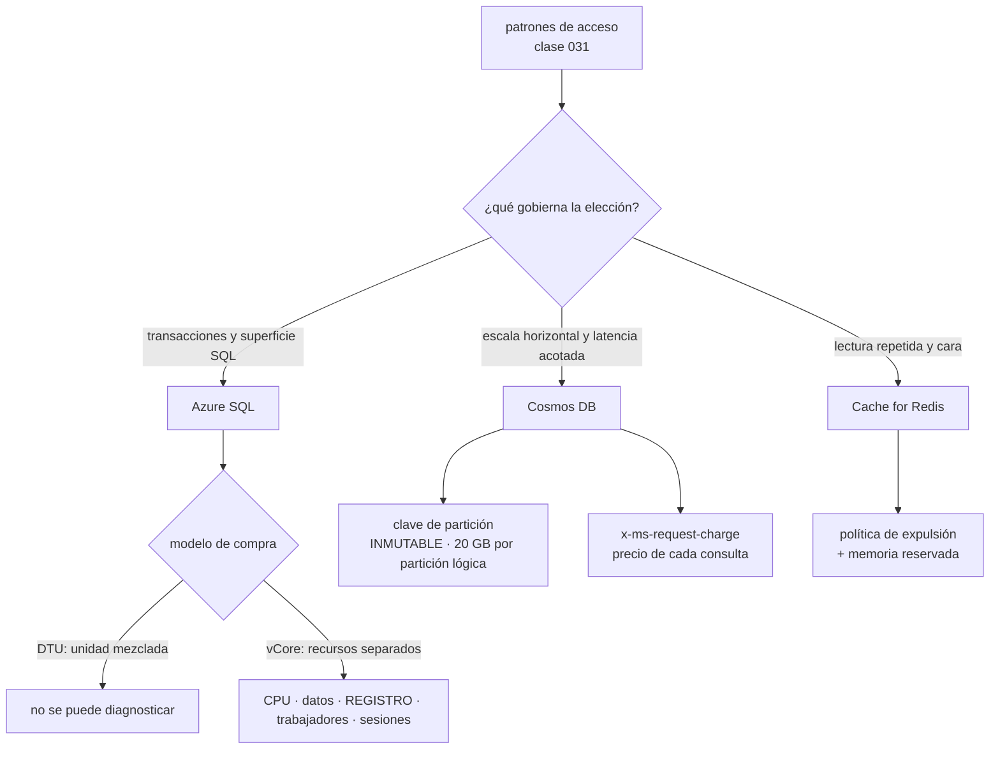

# 042 — Azure SQL, Cosmos DB y Azure Cache for Redis

> [← 041 · Blob Storage, Files, redundancia y lifecycle](../../part-03-azure-core-platform/041-blob-storage-files-redundancia-y-lifecycle/README.md) · [Índice de la parte](../README.md) · [043 · App Service, Functions y Container Apps →](../../part-03-azure-core-platform/043-app-service-functions-y-container-apps/README.md)

**Parte:** 03 — Azure: plataforma esencial<br>
**Nivel:** intermedio · **Horas estimadas:** 4<br>
**Laboratorio:** `data` · **Estado:** `EXECUTABLE_CORE`

## 🎯 Propósito

Elegir y operar los motores de datos de Azure con la disciplina de la clase 031 —los patrones de acceso primero— y con tres precisiones que solo aparecen aquí: el modelo de compra decide si vas a poder diagnosticar, la unidad de solicitud de Cosmos DB pone precio a cada consulta en la cabecera de la respuesta, y dos decisiones de esta clase son puertas de un solo sentido que no se corrigen editando una plantilla.

## 📚 Resultados de aprendizaje

Al finalizar podrás:

1. **Diagnosticar** una base de datos lenta identificando cuál de los cinco límites se agotó, y no solo la CPU.
2. **Elegir** modelo de compra y nivel de servicio a partir de la latencia de E/S exigida y de la capacidad de diagnóstico.
3. **Diseñar** una clave de partición sabiendo que es inmutable y que la partición lógica tiene un tope duro de 20 GB.
4. **Calcular** cuándo el escalado automático de Cosmos DB cuesta más que aprovisionar el pico.
5. **Configurar** una caché con política de expulsión y reserva de memoria que no se bloquee al llenarse.

## 🧩 Conceptos centrales

| Concepto | Comprensión verificable |
|---|---|
| `DTU frente a vCore` | La DTU es una unidad mezclada de CPU, memoria y E/S: cuando se agota, **no dice cuál**. El modelo vCore expone los recursos por separado y es el único que permite diagnosticar. |
| `gobernador de velocidad de registro` | Límite de MB/s de escritura en el registro de transacciones, independiente de la CPU. Es el techo que más se alcanza y el que menos se mira. |
| `unidad de solicitud (RU)` | Moneda única de Cosmos DB: toda lectura, escritura y consulta cuesta RU. La cabecera `x-ms-request-charge` devuelve **el precio exacto de cada operación**. |
| `partición lógica` | Conjunto de documentos con la misma clave de partición. Tiene un tope **duro** de 20 GB: al alcanzarlo las escrituras fallan, no se ralentizan. |
| `coherencia de sesión` | Nivel por defecto de Cosmos DB: garantiza leer lo que tú escribiste **mientras se propague el testigo de sesión**. Si el cliente se comparte entre usuarios sin propagarlo, la garantía desaparece en silencio. |
| `política de expulsión` | Regla que decide qué claves se descartan cuando la caché se llena. `volatile-lru` —la de por defecto— solo expulsa claves con vencimiento: sin TTL, la caché se llena y deja de aceptar escrituras. |

## 🧠 Modelo mental

En Azure, identidad y jerarquía organizacional preceden al recurso: tenant, management group, suscripción y resource group determinan el alcance de control.

Aplicado a esta clase, separa siempre cuatro planos: **intención** (qué necesita el usuario),
**configuración** (qué declaramos), **estado observado** (qué existe de verdad) y
**evidencia** (cómo sabemos que cumple). Confundirlos produce diseños que se ven correctos
en un diagrama pero fallan al operar.

## 🗺️ Flujo de razonamiento



## 📖 Desarrollo

### 1. El modelo de compra decide si vas a poder diagnosticar

Azure SQL se compra de dos formas, y la elección no es de precio sino de **observabilidad**.

La **DTU** es una unidad mezclada de CPU, memoria y E/S. Cuando una base de datos S3 «está al 100 %», el panel no dice al 100 % de qué. Se sube de nivel, mejora un poco, y a las tres semanas vuelve el mismo síntoma: se compró más de todo para resolver la escasez de uno.

El modelo **vCore** expone los recursos por separado, y con él la vista que resuelve la mayoría de los casos:

```sql
SELECT TOP 5 end_time,
       avg_cpu_percent, avg_data_io_percent, avg_log_write_percent,
       max_worker_percent, max_session_percent
FROM sys.dm_db_resource_stats ORDER BY end_time DESC;
```

```text
end_time   cpu   data_io   log_write   worker   session
21:14:00   18,2    31,0      100,0       12,4      3,1
```

**CPU al 18 % y registro al 100 %.** Ese es el patrón que casi nadie busca. El gobernador de velocidad de registro limita los MB/s que pueden confirmarse en el registro de transacciones, y es independiente del resto. Un proceso de importación por lotes lo satura mientras todo lo demás parece ocioso, y el tipo de espera lo confirma:

```sql
SELECT wait_type, wait_time_ms FROM sys.dm_os_wait_stats
WHERE wait_type LIKE 'LOG_RATE_GOVERNOR' OR wait_type = 'WRITELOG';
```

Las correcciones no pasan por más CPU: reducir el registro generado —cargas mínimamente registradas, lotes más pequeños con menos transacciones abiertas, índices que no se reconstruyan durante la ventana— o elegir un nivel con más caudal de registro.

Las cinco columnas cubren cinco agotamientos distintos:

```text
avg_cpu_percent        consultas caras o falta de índices
avg_data_io_percent    lecturas que no caben en memoria
avg_log_write_percent  escritura por lotes, reconstrucción de índices
max_worker_percent     demasiadas conexiones activas: falta agrupación
max_session_percent    conexiones abiertas sin cerrar
```

Las dos últimas son la firma de un problema de aplicación, no de base de datos, y subir de nivel las empeora porque permite abrir más.

La elección de **nivel de servicio** es una decisión de latencia, y su precio es conocido:

| | Almacenamiento | Latencia de E/S | Réplica de lectura | Costo relativo |
|---|---|---|---|---|
| Propósito general | Remoto | ~5-10 ms | No | 1× |
| Crítico para la empresa | SSD local + réplicas | ~1-2 ms | **Sí, incluida** | ~2,7× |
| Hiperescala | Servidores de páginas | Variable | Hasta 4 | Intermedio |

Y dos avisos sobre las opciones que parecen atractivas:

**Sin servidor** pausa la base tras un periodo de inactividad y cobra por vCore-segundo. Reanudarla tarda cerca de un minuto: la primera petición después de la pausa **agota su tiempo de espera**. Es excelente para desarrollo e intermitencia real, y una fuente de incidentes si se pone delante de un servicio con tráfico esporádico y usuarios reales.

**Hiperescala** escala a 100 TB y restaura en minutos en vez de horas. Es una puerta de un solo sentido en la práctica: entrar es sencillo y volver no. Se decide con el mismo criterio que cualquier decisión irreversible de la clase 026 — con evidencia, no por si acaso.

Y una elección que no es de tamaño sino de **compatibilidad**: la instancia administrada existe para lo que la base de datos única no tiene —agente SQL, consultas entre bases de datos, Service Broker, CLR—. Una migración heredada que falla lo hace por ausencia de esas funciones, no por rendimiento; comprobarlo antes ahorra rehacer el plan a medias.

Un último punto sobre las copias de seguridad, que aquí son automáticas y crean una falsa sensación de seguridad: la restauración a un punto anterior cubre de 1 a 35 días y la retención a largo plazo llega a 10 años. Pero las copias **cuelgan del servidor lógico**: eliminar una base de datos conserva sus copias hasta que expire la retención, y **eliminar el servidor se lleva las de todas sus bases a la vez**. Es el borrado que no tiene vuelta atrás.

### 2. Cosmos DB: la cabecera que pone precio a cada consulta

Cosmos DB tiene una virtud pedagógica que ningún otro motor del programa ofrece: **devuelve el costo de cada operación en la respuesta**.

```text
x-ms-request-charge: 2.87        lectura puntual con clave de partición
x-ms-request-charge: 1240.15     la misma consulta sin clave de partición
```

La clase 031 argumentaba que los patrones de acceso van primero. Aquí ese argumento deja de ser una recomendación y se convierte en una factura por línea: una consulta que abanica sobre todas las particiones cuesta **432 veces más** que la lectura equivalente dirigida. Instrumentar esa cabecera en el registro de la aplicación es la mejor inversión de esta clase, porque convierte una discusión de diseño en un número que cualquiera puede ver.

La **clave de partición** concentra las dos decisiones irreversibles:

```text
tope duro por partición lógica     20 GB
tope de rendimiento por partición  10.000 RU/s
al alcanzar el tope de tamaño      las escrituras FALLAN con 403
                                   (no se ralentizan: fallan)
cambiar la clave de partición      IMPOSIBLE: hay que crear otro contenedor
                                   y migrar los documentos
```

El fallo con 403 es cualitativamente distinto de la limitación por throughput: no es un `429` que el SDK reintenta, es un rechazo definitivo de la escritura mientras esa partición siga llena. Y como el tope es por partición **lógica** y no por contenedor, un contenedor de 4 TB puede estar rechazando escrituras porque una sola clave concentra 20 GB.

Los criterios para elegirla, en orden:

```text
1. cardinalidad alta          muchos valores distintos, ninguno dominante
2. reparto uniforme           de escrituras y de almacenamiento
3. presente en las consultas  si no, todas abanican
```

Cuando ninguna propiedad natural cumple las tres, la salida es una **clave sintética**: concatenar dos campos, o añadir un sufijo calculado que reparta. Se decide al crear el contenedor, con los patrones de acceso escritos delante, porque después el arreglo cuesta una migración.

El **modelo de rendimiento** tiene tres opciones y una aritmética que conviene hacer:

```text
aprovisionado manual   se paga el pico declarado, 24 h al día
escalado automático    escala entre el 10 % y el 100 % del máximo,
                       y se factura a 1,5× la tarifa por RU
sin servidor           por operación; tope de 5.000 RU/s y 50 GB por contenedor
```

El factor 1,5 fija el punto de equilibrio: **el escalado automático solo compensa por debajo del 66 % de utilización media**. Con un contenedor que sostiene 8.200 RU/s de forma estable y un máximo de 10.000:

```text
escalado automático   8.200/100 × 0,012 USD/h = 0,984 → ~718 USD/mes
aprovisionado manual 10.000/100 × 0,008 USD/h = 0,800 → ~584 USD/mes
diferencia por pagar elasticidad que no se usa:      ~134 USD/mes
```

Y una lectura contraria a la intuición sobre los errores: en Cosmos DB, **un `429` no es un fallo**. Es la señal de control de flujo, viene con `x-ms-retry-after-ms` y el SDK reintenta solo. Una tasa de `429` sostenida en cero significa que se está pagando capacidad ociosa. Lo que sí hay que alertar es la tasa de `429` que el SDK **no consigue** resolver dentro del presupuesto de reintentos, porque esa sí llega al usuario.

Los **cinco niveles de coherencia** son el diferenciador del servicio y admiten un resumen operativo corto:

```text
fuerte              lectura siempre actualizada; NO disponible con escritura
                    multirregión; lecturas al doble de RU
obsolescencia       retraso acotado por operaciones o por tiempo
  acotada           lecturas al doble de RU
sesión (por defecto) lees lo que tú escribiste, dentro de tu sesión
prefijo coherente   nunca ves escrituras desordenadas
eventual            lo más barato y lo más rápido
```

La trampa está en la de sesión, que es la que casi todo el mundo usa: la garantía viaja en un **testigo de sesión**. Si el cliente es un objeto compartido entre peticiones de usuarios distintos y el testigo no se propaga, un usuario puede no leer lo que acaba de escribir. No hay error, no hay alerta: solo un comportamiento intermitente que en desarrollo nunca se reproduce porque hay una sola instancia.

Y con escritura multirregión, los conflictos se resuelven por defecto con **el último que escribe gana**, comparando la marca de tiempo. Es determinista y **pierde datos en silencio**. Si esa pérdida no es aceptable —dos almacenes actualizando el mismo inventario—, hay que escribir un procedimiento de resolución o renunciar a la escritura multirregión.

### 3. Redis: la caché que se llena y deja de aceptar escrituras

La clase 031 dejó el criterio de cuándo una caché aporta y cómo se invalida. Lo que se añade aquí son tres decisiones de plataforma que producen incidentes con un patrón reconocible.

**El nivel decide si hay SLA.** El nivel básico es un nodo único **sin acuerdo de nivel de servicio y sin réplica**: un reinicio de mantenimiento vacía la caché y corta las conexiones. Es perfectamente válido para desarrollo y es el error de producción más repetido, porque funciona durante meses hasta el primer mantenimiento.

```text
básico       nodo único, sin SLA            desarrollo
estándar     réplica principal-secundaria    producción básica
premium      persistencia, clúster, red virtual, zonas
empresa      módulos de Redis y replicación geográfica activa
```

**La política de expulsión por defecto no expulsa casi nada.** `volatile-lru` solo considera candidatas las claves **con vencimiento**. Si parte de las claves se escribe sin TTL —muy habitual: sesiones, catálogos «que se refrescan solos», banderas—, esas claves nunca salen. La caché se llena de lo que no puede expulsar y responde a las escrituras con un error de memoria:

```text
síntoma      OOM command not allowed when used memory > 'maxmemory'
señal        used_memory al máximo y evicted_keys = 0
causa        volatile-lru + claves sin TTL
```

La combinación `evicted_keys = 0` con memoria al máximo es diagnóstica: una caché sana **expulsa**. Que no expulse nada y esté llena significa que no puede.

Dos correcciones, y conviene aplicar las dos:

```text
1. allkeys-lru  → cualquier clave es candidata; la caché nunca se bloquea
2. TTL siempre  → una clave sin vencimiento en una caché es una fuga de memoria
```

**La memoria reservada no es opcional.** Redis necesita memoria libre para replicar, para persistir y para la fragmentación. Sin `maxmemory-reserved`, la operación de guardado intenta duplicar estructuras en una instancia ya llena y el nodo se queda sin memoria durante la copia. La reserva se configura como porcentaje y su ausencia produce caídas justo durante el mantenimiento, que es cuando peor sientan.

Y un detalle de cliente que aparece en casi toda migración desde .NET: el multiplexor de conexión **debe ser único y de larga vida**. Crear uno por petición agota los puertos de salida de la máquina —el mismo agotamiento de puertos de traducción de la clase 040— y produce tiempos de espera que parecen de la caché y son del cliente:

```text
un multiplexor por proceso, compartido y reutilizado          correcto
un multiplexor por petición                                   agota puertos
```

Por último, escalar una caché no es una operación transparente: cambiar de tamaño o de número de particiones reconfigura los nodos, cierra conexiones y, según el camino, **puede vaciar el contenido**. Toda aplicación que use caché debe funcionar —más lenta— con la caché vacía o inaccesible. Si no puede, no es una caché: es una base de datos sin copia de seguridad.

### 4. Las dos puertas de un solo sentido de esta clase

La clase 026 introdujo la distinción entre decisiones reversibles e irreversibles. Esta clase contiene dos de las irreversibles más caras del programa, y conviene tratarlas de forma explícita:

```text
1. la clave de partición de un contenedor de Cosmos DB
2. la eliminación de un servidor lógico de Azure SQL
```

**La clave de partición** no se edita. Corregirla implica crear un contenedor nuevo y mover los documentos, y ese movimiento consume RU en los dos contenedores a la vez, así que la migración compite con el tráfico de producción por la misma capacidad. El procedimiento sensato:

```text
1. crear el contenedor destino con la nueva clave
2. aprovisionar capacidad extra TEMPORAL en ambos
3. copiar con la fuente de cambios, no con una consulta de barrido
4. doble escritura durante la ventana de corte
5. verificar recuentos por partición antes de conmutar lecturas
6. devolver la capacidad extra
```

El paso 3 importa: leer el origen con una consulta que abanica multiplica el costo y castiga a las particiones ya saturadas. La fuente de cambios lee en orden de partición y es la vía prevista para esto.

**El servidor lógico** concentra las copias de seguridad de todas sus bases de datos. Eliminarlo las elimina. La protección es doble y ambas mitades hacen falta:

```bash
# 1. bloqueo de recurso: impide el borrado incluso a un propietario
$ az lock create --name no-borrar-sql --lock-type CanNotDelete \
    --resource-group rg-datos --resource-name sql-cloudshop-prod \
    --resource-type Microsoft.Sql/servers

# 2. retención a largo plazo: copias que NO cuelgan del ciclo de vida del servidor
$ az sql db ltr-policy set -g rg-datos -s sql-cloudshop-prod -n pedidos \
    --weekly-retention P4W --monthly-retention P12M --yearly-retention P7Y --week-of-year 1
```

El bloqueo de recurso es el mecanismo de gobierno de la clase 037 aplicado al caso concreto: no depende de que nadie se equivoque. Y conviene saber su límite: **un bloqueo impide borrar, no impide vaciar**. Un `DROP TABLE` pasa igual; para eso está la restauración a un punto anterior, que hay que haber probado.

La prueba, que es la parte que se omite:

```bash
$ az sql db restore -g rg-datos -s sql-cloudshop-prod -n pedidos \
    --dest-name pedidos-prueba --time "2026-07-31T22:00:00"
$ sqlcmd -S sql-cloudshop-prod.database.windows.net -d pedidos-prueba \
    -Q "SELECT COUNT(*) FROM dbo.pedidos WHERE creado < '2026-07-31 22:00'"
1284391                                                                     ✓
$ az sql db delete -g rg-datos -s sql-cloudshop-prod -n pedidos-prueba --yes
```

Una restauración deja una base de datos **nueva**: no sobrescribe la original. Eso la hace segura de ensayar en producción, y es la razón por la que no hay excusa para no haberla ensayado nunca. El dato que hay que registrar de esa prueba no es que funcionó, sino **cuánto tardó**: ese número es el RTO real, y suele ser bastante mayor que el que figura en el plan.

### 5. Elegir entre los tres sin repetir la discusión cada trimestre

Los tres motores resuelven cosas distintas y la conversación se repite porque nadie escribe el criterio. Escrito, cabe en una tabla:

| Pregunta | Azure SQL | Cosmos DB | Redis |
|---|---|---|---|
| ¿Transacciones entre varias entidades? | Sí | Dentro de una partición lógica | No |
| ¿Consultas no previstas? | Sí | Caras: abanican | No |
| ¿Latencia de un dígito de milisegundo? | Solo crítico para la empresa | Sí | Sí |
| ¿Escala de escritura horizontal? | Limitada | Sí, si la clave reparte | — |
| ¿Fuente de verdad? | Sí | Sí | **Nunca** |

La última fila es la que hay que defender cuando alguien propone «guardar el carrito solo en la caché porque es más rápido»: un dato que solo existe en una caché es un dato que se pierde en el próximo mantenimiento.

Y sobre el costo, la clase 031 avisaba de que a veces decide al revés de lo esperado. Aquí ocurre por una razón concreta: **el precio de Cosmos DB depende del diseño, no del volumen**. La misma carga puede costar 584 o 4.900 USD al mes según cómo reparta la clave de partición y cuántas consultas abaniquen. Ningún ajuste de infraestructura compensa un modelo de datos que obliga a leer todas las particiones para responder una pregunta frecuente.

La forma de mantener esa disciplina sin auditorías periódicas es hacer visible el número:

```python
respuesta = contenedor.query_items(consulta, partition_key=cliente_id)
log.info("consulta=%s ru=%.2f", nombre, contenedor.client_connection.last_response_headers[
    "x-ms-request-charge"])
```

Con ese registro, una consulta cara aparece en el panel el día que se despliega, no en la factura del mes siguiente. Es el mismo principio que la etiqueta de costo de la clase 025 aplicado a la operación individual: **lo que no tiene número no se discute, se opina**.

## 🔬 Ejemplo trabajado

**CloudShop lleva a Azure su capa de datos. El catálogo va a Cosmos DB, los pedidos a Azure SQL y las sesiones a Redis. Los tres funcionan durante seis semanas y luego fallan por motivos distintos — y ninguno es el que el panel sugiere.**

**Caso 1 — «la base de datos está lenta» con la CPU al 18 %.**

La importación nocturna de catálogo pasa de 40 minutos a más de tres horas. El panel de la base de datos S3 —modelo DTU— muestra 100 % de DTU.

```text
DTU al 100 %  →  ¿de qué?
```

No se puede saber. Se migra a vCore, propósito general, 4 vCore, y la vista aparece:

```text
end_time   cpu   data_io   log_write   worker   session
02:41:00   18,2    24,7      100,0        9,1      2,4
```

El techo es el registro de transacciones. La importación insertaba fila a fila dentro de una transacción por fila:

```text                                    antes        después
tamaño de lote                       1 fila     5.000 filas
reconstrucción de índices          durante      después
registro generado por 1 M de filas   4,1 GB       0,9 GB
durante la ventana
duración de la importación         3 h 12 min    26 min
```

No hizo falta subir de nivel. La conclusión que se documenta: **el modelo DTU no era caro, era ciego**.

**Caso 2 — el percentil 99 de los pedidos no baja de 40 ms.**

Con el registro resuelto, la latencia de lectura sigue alta. La E/S de datos está en el 24 % y la latencia por operación es de 7 ms: es el almacenamiento remoto del nivel de propósito general.

```text                          propósito general   crítico para la empresa
latencia de E/S                  ~7 ms                ~1,5 ms
p99 de la operación de pedido    41 ms                 9 ms
réplica de lectura               no                    incluida
costo mensual de cómputo        ~365 USD              ~985 USD
```

La decisión no se aplica a todo: solo la base de datos de pedidos sube de nivel. Catálogo e informes se quedan en propósito general, y los informes pasan a leer de la réplica que el nivel crítico incluye, lo que además quita carga de la principal.

```text                        antes              después
pedidos      propósito general 365    crítico 985
catálogo     propósito general 365    propósito general 365
informes     propósito general 365    réplica de lectura de pedidos: 0
                            ────────           ────────
                             1.095 USD          1.350 USD
```

Cuesta 255 USD más al mes y elimina una base de datos entera. El p99 pasa de 41 a 9 ms.

**Caso 3 — las escrituras del catálogo empiezan a fallar con 403.**

No es limitación por throughput: es un rechazo.

```text
403 · Partition key reaching storage quota
```

La clave de partición era `/pais`, y el 82 % de los documentos son de un solo país:

```bash
$ az cosmosdb sql container show -a cosmos-cloudshop -d tienda -n catalogo \
    -g rg-datos --query "resource.partitionKey.paths" -o tsv
/pais
```

```text
partición "CL"    19,8 GB  ← contra el tope de 20 GB
partición "AR"     1,4 GB
partición "PE"     0,9 GB
resto             < 0,3 GB
```

La clave es inmutable. Se migra a `/categoriaId` —cardinalidad alta, reparto uniforme y presente en el 94 % de las consultas— con fuente de cambios y doble escritura:

```text
capacidad temporal extra durante la migración   +6.000 RU/s durante 9 h
documentos migrados                             41,2 millones
mayor partición resultante                       1,1 GB
corte de servicio                                ninguno
```

Y con la cabecera instrumentada aparece lo que llevaba seis semanas escondido:

```text                                          antes      después
lectura de ficha por id (con clave)             2,87 RU     2,87 RU
listado por categoría                       1.240,15 RU     8,44 RU
RU/s medias del contenedor                     8.200        2.100
```

**Caso 4 — el modelo de rendimiento que costaba de más.**

Con 8.200 RU/s estables antes de la migración, el contenedor estaba en escalado automático con máximo 10.000. La utilización media era del 82 %, muy por encima del punto de equilibrio del 66 %:

```text                                    USD/mes
escalado automático a 8.200 RU/s medias    718
aprovisionado manual a 10.000 RU/s         584
```

Después de la migración, con 2.100 RU/s medias y picos de 6.000, la aritmética se invierte y el escalado automático vuelve a ser lo correcto:

```text
escalado automático, máx. 6.000, media 2.100   ~184 USD/mes
aprovisionado manual a 6.000                   ~350 USD/mes
```

El criterio queda escrito para no repetir la discusión: **por encima del 66 % de utilización media, manual; por debajo, automático**, y se revisa cuando el patrón de carga cambie.

**Caso 5 — la caché deja de aceptar escrituras un domingo.**

```text
OOM command not allowed when used memory > 'maxmemory'
used_memory       6,0 GB / 6,0 GB
evicted_keys      0
```

Memoria llena y ninguna expulsión: la política era `volatile-lru` y el 61 % de las claves —sesiones y banderas de configuración— se escribía sin vencimiento. Además la instancia era de nivel básico, así que el reinicio de mantenimiento de esa madrugada había vaciado la caché sin réplica que la sostuviera.

```text                                antes             después
nivel                              básico            estándar con réplica
política de expulsión           volatile-lru        allkeys-lru
claves sin TTL                       61 %                 0 %
memoria reservada                    0 %                 25 %
multiplexor de conexión         uno por petición    uno por proceso
prueba con caché vacía             nunca            en cada despliegue
```

La última fila es la que convierte esto en un diseño: la aplicación se despliega con una prueba que arranca con la caché vacía y comprueba que responde —más lenta— sin errores.

**Resumen de la capa de datos:**

```text                                        antes         después
modelo de compra de Azure SQL                 DTU           vCore
cuello de botella identificable               no            sí, cinco señales
p99 de la operación de pedido                41 ms           9 ms
importación nocturna                      3 h 12 min        26 min
escrituras rechazadas en Cosmos DB         sí (403)          0
RU/s medias del catálogo                    8.200          2.100
bases de datos SQL                             3              2
costo mensual de la capa de datos          2.190 USD      1.640 USD
```

**La lección que esta clase traslada al resto de la parte**: los tres motores tienen un límite que no es la CPU y que el panel por defecto no muestra —el registro en SQL, la partición lógica en Cosmos, la política de expulsión en Redis—. Un servicio de datos que solo se vigila por CPU está vigilando el recurso que casi nunca se agota primero.

## 🧪 Laboratorio guiado

Ejecuta desde la raíz:

```bash
python classes/part-03-azure-core-platform/042-azure-sql-cosmos-db-y-azure-cache-for-redis/lab.py
```

El laboratorio selecciona el motor de práctica **`data`** y produce
`lab_result.json`. El escenario, sus comprobaciones y el artefacto esperado corresponden a
esta clase; no requiere credenciales y deja explícito qué debe revalidarse en un sandbox real.

1. Lee `exercise.steps` y formula una predicción antes de ejecutar.
2. Ejecuta la práctica y verifica todos los elementos de `checks`.
3. Provoca el caso de `negative_test` y explica la señal observada.
4. Materializa `matriz-datos-azure` en `evidence/` usando la plantilla indicada.
5. Para proveedor real, sigue `sandbox.requires`, registra costo y ejecuta `destroy`.

### Evidencia esperada

El artefacto principal es un modelo de datos ligado a patrones de acceso. Además, la entrega debe incluir el comando ejecutado,
la salida estructurada y una conclusión que no exceda lo observado.

## 🏆 Reto verificable

Construye **`matriz-datos-azure`** para el caso CloudShop. Incluye una alternativa descartada,
un supuesto que pueda falsarse, una prueba de fallo y una decisión de rollback.

## ✅ Criterio de aceptación

- [ ] `lab.py` termina con código 0 y genera JSON válido.
- [ ] La entrega conecta al menos tres requisitos con mecanismos verificables.
- [ ] Existe una prueba positiva y una prueba negativa con evidencia.
- [ ] Seguridad, costo y operación aparecen como decisiones, no como anexos.
- [ ] Se declara una limitación y una condición que obligaría a revisar el diseño.
- [ ] Otra persona puede repetir el recorrido sin conocimiento tácito.

## ⚠️ Errores frecuentes

| Síntoma | Causa probable | Corrección |
|---|---|---|
| La base de datos está al 100 % y no se sabe de qué recurso | El modelo DTU mezcla CPU, memoria y E/S en una sola unidad | Migra a vCore y consulta `sys.dm_db_resource_stats`: cinco columnas, cinco agotamientos distintos. |
| Un proceso por lotes va lentísimo con la CPU al 18 % | El gobernador de velocidad de registro está al 100 % | Reduce el registro generado —lotes mayores, menos transacciones, índices fuera de la ventana— antes de subir de nivel. |
| Las escrituras en Cosmos DB fallan con 403 y no con 429 | Una partición lógica alcanzó el tope duro de 20 GB | La clave es inmutable: crea otro contenedor con una clave que reparta y migra con la fuente de cambios y doble escritura. |
| Una consulta frecuente cuesta cientos de RU | Abanica sobre todas las particiones porque la clave no está en el filtro | Registra `x-ms-request-charge` en cada consulta y rediseña la clave o el modelo para que la consulta sea dirigida. |
| La caché responde con error de memoria y no ha expulsado ninguna clave | La política `volatile-lru` solo expulsa claves con vencimiento y muchas se escriben sin TTL | Cambia a `allkeys-lru`, exige TTL en todas las escrituras y reserva memoria para replicación y fragmentación. |
| Al eliminar un servidor lógico desaparecen las copias de seguridad de todas sus bases | La restauración a un punto anterior cuelga del servidor, no de la base de datos | Bloqueo de recurso contra el borrado y retención a largo plazo, con una prueba de restauración cuya duración se registra como RTO real. |

## 🛡️ Seguridad, ética y costo

Trabaja con cuentas propias o sandboxes autorizados. No publiques secretos, identificadores
reales ni datos personales. Antes de crear recursos pagos define presupuesto, etiquetas y
comando de destrucción; después verifica que no queden recursos huérfanos. Los ejemplos
locales enseñan contratos, pero no certifican cumplimiento ni disponibilidad de producción.

## ❓ Preguntas de comprobación

1. El panel muestra 100 % de DTU. ¿Qué información te falta y cómo la obtienes?
2. ¿Qué distingue un 403 de un 429 en Cosmos DB, y por qué solo uno de los dos lo resuelve el SDK?
3. ¿A partir de qué utilización media deja de compensar el escalado automático, y por qué ese número?
4. Una caché tiene la memoria llena y `evicted_keys` en cero. ¿Qué está ocurriendo?
5. ¿Qué dos decisiones de esta clase no se pueden deshacer editando una plantilla, y cómo se protege cada una?

## 🔗 Referencias

- Microsoft (2025). *vCore purchasing model for Azure SQL Database* — recursos separados y niveles de servicio. <https://learn.microsoft.com/en-us/azure/azure-sql/database/service-tiers-sql-database-vcore>
- Microsoft (2025). *Resource limits and `sys.dm_db_resource_stats`* — CPU, E/S de datos, velocidad de registro, trabajadores y sesiones. <https://learn.microsoft.com/en-us/azure/azure-sql/database/resource-limits-logical-server>
- Microsoft (2025). *Partitioning and horizontal scaling in Azure Cosmos DB* — partición lógica, tope de 20 GB y claves sintéticas. <https://learn.microsoft.com/en-us/azure/cosmos-db/partitioning-overview>
- Microsoft (2025). *Consistency levels in Azure Cosmos DB* — los cinco niveles, testigo de sesión y costo en RU. <https://learn.microsoft.com/en-us/azure/cosmos-db/consistency-levels>
- Microsoft (2025). *Azure Cache for Redis best practices* — niveles, políticas de expulsión, memoria reservada y conexiones. <https://learn.microsoft.com/en-us/azure/azure-cache-for-redis/cache-best-practices-development>
- Documentación oficial vigente del servicio implementado; registra URL y fecha de consulta.

---

> [Evaluación](assessment.md) · [Contrato de clase](lesson.yaml) · [Índice de la parte](../README.md)

**📥 Descargar:** [Parte 03 en PDF](../../../site/downloads/partes/manual-parte-03-azure-core-platform.pdf) · [Recorrido de Azure en PDF](../../../site/downloads/nubes/manual-azure.pdf) · [Manual integral](../../../site/downloads/multi-cloud-engineering-manual-v2.0.pdf)

| Anterior | Índice | Siguiente |
|---|---|---|
| [← 041 · Blob Storage, Files, redundancia y lifecycle](../../part-03-azure-core-platform/041-blob-storage-files-redundancia-y-lifecycle/README.md) | [Parte 03](../README.md) · [Programa](../../README.md) | [043 · App Service, Functions y Container Apps →](../../part-03-azure-core-platform/043-app-service-functions-y-container-apps/README.md) |
