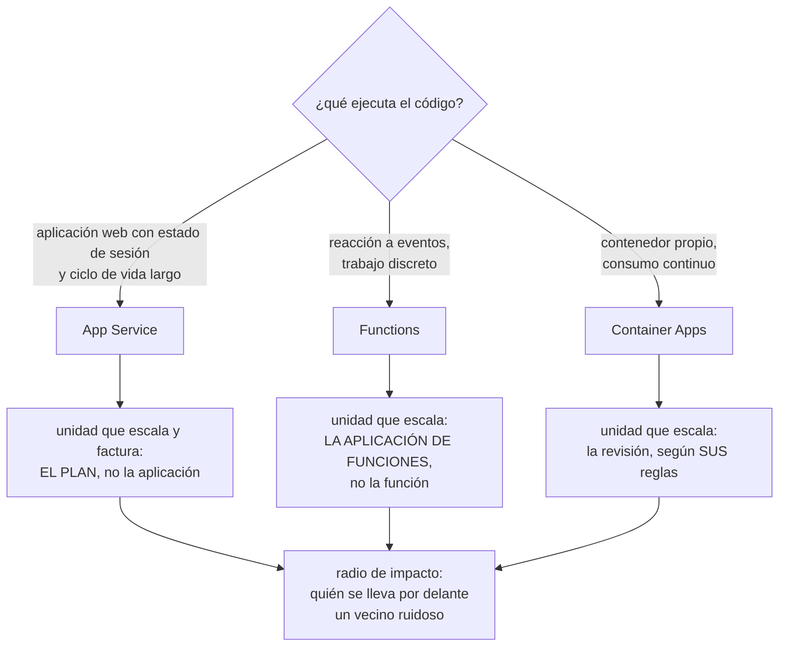

# 043 — App Service, Functions y Container Apps

> [← 042 · Azure SQL, Cosmos DB y Azure Cache for Redis](../../part-03-azure-core-platform/042-azure-sql-cosmos-db-y-azure-cache-for-redis/README.md) · [Índice de la parte](../README.md) · [044 · Service Bus, Event Grid y Event Hubs →](../../part-03-azure-core-platform/044-service-bus-event-grid-y-event-hubs/README.md)

**Parte:** 03 — Azure: plataforma esencial<br>
**Nivel:** intermedio · **Horas estimadas:** 4<br>
**Laboratorio:** `serverless` · **Estado:** `EXECUTABLE_CORE`

## 🎯 Propósito

Elegir dónde corre la aplicación en Azure sabiendo cuál es la unidad que escala y cuál es la que factura, porque en las tres opciones son distintas y ninguna coincide con la de AWS. El plan de App Service escala para todas sus aplicaciones a la vez, la aplicación de funciones escala para todas sus funciones a la vez, y una aplicación de contenedor escala por la regla que le pongas —y si esa regla es la equivocada, se apaga y deja de trabajar sin dar ningún error.

## 📚 Resultados de aprendizaje

Al finalizar podrás:

1. **Identificar** la unidad de escalado y la unidad de facturación de App Service, Functions y Container Apps, y el radio de impacto de cada una.
2. **Elegir** plan de hospedaje de funciones a partir de duración máxima, acceso a red privada y tolerancia al arranque en frío.
3. **Diagnosticar** el agotamiento de puertos de traducción de salida, que se manifiesta como fallo del destino y no del origen.
4. **Configurar** un intercambio de espacios con calentamiento y ajustes fijados al espacio, y explicar qué se lleva el intercambio.
5. **Definir** reglas de escalado que no apaguen a un consumidor que sigue teniendo trabajo pendiente.

## 🧩 Conceptos centrales

| Concepto | Comprensión verificable |
|---|---|
| `plan de App Service` | Conjunto de máquinas que ejecuta **todas** las aplicaciones asignadas a él. Se factura el plan, no la aplicación, y el escalado es del plan: diez aplicaciones compiten por la misma CPU. |
| `Always On` | Ajuste que impide que la aplicación se descargue tras unos veinte minutos sin tráfico. Sin él, la primera petición tras el silencio paga un arranque completo. |
| `ajuste fijado al espacio` | Configuración marcada para **quedarse en el espacio** durante un intercambio. Lo que no está marcado viaja con la aplicación: una cadena de conexión de pruebas puede acabar en producción. |
| `puertos de traducción de salida` | Cupo de conexiones salientes por instancia —128 por defecto en App Service—. Al agotarse, las llamadas a servicios externos fallan de forma intermitente y el error parece del destino. |
| `plan de hospedaje de funciones` | Decide tres cosas a la vez: duración máxima de una ejecución, si hay acceso a red virtual y si existe arranque en frío. No es una decisión de precio. |
| `regla de escalado` | Señal que determina cuántas réplicas hay. Una aplicación de contenedor con una única regla HTTP se reduce a cero aunque tenga una cola llena esperando. |

## 🧠 Modelo mental

En Azure, identidad y jerarquía organizacional preceden al recurso: tenant, management group, suscripción y resource group determinan el alcance de control.

Aplicado a esta clase, separa siempre cuatro planos: **intención** (qué necesita el usuario),
**configuración** (qué declaramos), **estado observado** (qué existe de verdad) y
**evidencia** (cómo sabemos que cumple). Confundirlos produce diseños que se ven correctos
en un diagrama pero fallan al operar.

## 🗺️ Flujo de razonamiento



## 📖 Desarrollo

### 1. El plan es la unidad, no la aplicación

Es la primera sorpresa al llegar de AWS, donde cada servicio escala por su cuenta. En App Service se compra un **plan** —un conjunto de máquinas— y las aplicaciones se asignan a él:

```text
plan asp-cloudshop-prod  (2 × P1v3)
  ├─ tienda            tráfico de clientes
  ├─ admin             uso interno
  ├─ informes          trabajo nocturno pesado
  └─ webhooks          picos impredecibles
```

Las cuatro comparten CPU, memoria y **conexiones salientes**. El trabajo nocturno de `informes` degrada la tienda, y el panel de la tienda no muestra nada raro: su código no cambió y su CPU no subió, subió la del vecino.

La regla de diseño se deduce sola: **el plan es la frontera del radio de impacto**. Se reparten aplicaciones por plan según qué debe seguir en pie cuando otra cosa se rompa, no según qué es más barato de agrupar. Y como el escalado también es del plan, escalar por culpa de `informes` multiplica el costo de las cuatro.

Dos ajustes del plan que producen incidentes por sí solos:

**Always On.** Sin él, la aplicación se descarga tras unos veinte minutos sin tráfico y la siguiente petición paga el arranque completo del proceso. En un servicio interno que se usa dos veces al día, todo el mundo lo percibe como «esto va lentísimo» y las métricas medias no lo muestran, porque afecta a una petición de cada cien. Tampoco los trabajos programados dentro del proceso sobreviven a la descarga: se planifican y no se ejecutan.

**Escalado del plan.** El escalado automático es de Azure Monitor, con las mismas reglas de la clase 029, y con una diferencia de tiempos: añadir una instancia a un plan tarda entre uno y tres minutos, no segundos. Una regla que reaccione a un pico de 60 segundos llega siempre tarde. Para carga predecible —los picos de una tienda lo son— un perfil por horario evita escalar por reacción.

Y el agotamiento de conexiones salientes merece su propio párrafo porque **el error apunta al sitio equivocado**. Cada instancia dispone de unos 128 puertos de traducción hacia un mismo destino. Un cliente HTTP que se crea y se descarta en cada petición no reutiliza conexiones, y en cuanto el tráfico sube:

```text
síntoma    tiempos de espera intermitentes hacia la pasarela de pago
           el resto de la aplicación funciona
lectura    parece que la pasarela de pago falla
señal real métrica "SNAT Connection Count" al máximo
           y "SNAT Port Usage" en ascenso
```

Las tres correcciones, en orden de eficacia:

```text
1. reutilizar el cliente HTTP (una instancia por proceso, no por petición)
2. integración con red virtual + NAT Gateway  → 64.512 puertos por IP (clase 039)
3. punto de conexión privado para los destinos que sean de Azure
   → no consumen puertos de traducción en absoluto
```

La tercera es la que más rinde en una plataforma que ya hizo el trabajo de la clase 039: el tráfico a almacenamiento, bases de datos y colas deja de salir, deja de contar y deja de fallar.

Un apunte sobre la red que se confunde en casi todos los equipos: **la integración con red virtual es de salida**. Permite que la aplicación alcance recursos privados; no hace que la aplicación sea privada. Para eso hace falta un **punto de conexión privado** hacia la propia aplicación, que es la otra dirección y otro recurso.

### 2. Espacios de implementación: qué viaja y qué se queda

Un espacio es una instancia paralela de la aplicación con su propio nombre de host. El intercambio no vuelve a desplegar nada: **cambia de sitio la configuración y redirige el tráfico**, lo que hace que la vuelta atrás sea igual de rápida que la ida. Esa es toda su virtud, y es grande: un despliegue que se puede revertir en quince segundos cambia el apetito de riesgo de un equipo.

La parte que hay que dominar es qué se lleva el intercambio:

```text
viaja con la aplicación   código, ajustes NO marcados, cadenas de conexión NO marcadas,
                          configuración de tiempo de ejecución
se queda en el espacio    ajustes marcados como fijados al espacio,
                          nombre de host, certificados, escalado,
                          configuración de red privada
```

La primera línea contiene el incidente clásico: si la cadena de conexión a la base de datos de pruebas **no** está marcada como fijada al espacio, el intercambio la lleva a producción. La aplicación arranca sin errores y empieza a escribir pedidos reales en la base de datos de pruebas. No hay excepción, no hay alerta; solo datos en el sitio equivocado.

```bash
$ az webapp config appsettings set -g rg-app -n app-tienda --slot staging \
    --slot-settings DB_CONNECTION=... APPINSIGHTS_KEY=...
$ az webapp config appsettings list -g rg-app -n app-tienda --slot staging \
    --query "[?slotSetting].name" -o tsv
DB_CONNECTION
APPINSIGHTS_KEY                                                             ✓
```

La comprobación de esa lista debería formar parte de la revisión de cada ajuste nuevo, porque el valor por defecto es el peligroso: **lo que no se marca, viaja**.

La segunda pieza es el **calentamiento**. El intercambio reinicia la aplicación en el espacio de destino, así que sin calentamiento las primeras peticiones tras el intercambio pagan el arranque completo. Azure espera a que la aplicación responda antes de completar el intercambio si se le indica qué pedir:

```xml
<applicationInitialization>
  <add initializationPage="/readyz" />
  <add initializationPage="/api/catalogo?limit=1" />
</applicationInitialization>
```

Y vale aquí, entera, la lección de la clase 029: la ruta de calentamiento debe **ejercitar las dependencias**, no devolver 200 desde memoria. Un `/readyz` que comprueba base de datos y caché convierte el intercambio en una prueba de humo automática; un `/` estático lo convierte en un ritual.

El patrón completo que conviene dejar escrito:

```text
1. desplegar en el espacio de preparación
2. ejecutar pruebas contra el nombre de host del espacio
3. intercambiar con calentamiento
4. observar cinco minutos las señales de error y latencia
5. si algo se degrada, intercambiar de vuelta — no desplegar la versión anterior
```

El paso 5 es la razón de todo lo demás: la reversión es un intercambio, no un despliegue. Un equipo que responde a un despliegue malo desplegando otra vez tarda entre diez y cuarenta minutos; uno que intercambia tarda menos de un minuto.

### 3. Functions: el plan decide tres cosas y ninguna es el precio

La clase 032 estableció que en serverless la concurrencia es el recurso que se agota y que el arranque en frío se compara con el percentil del SLO, no con la media. Ese método se traslada tal cual. Lo que cambia en Azure es que **el plan de hospedaje decide simultáneamente tres cosas** que en Lambda son ajustes independientes:

| | Duración máxima | Red virtual | Arranque en frío |
|---|---|---|---|
| Consumo | 5 min por defecto, **10 como tope** | No | Sí |
| Consumo flexible | 30 min por defecto | **Sí** | Se mitiga con instancias siempre listas |
| Premium | Sin tope práctico (60 min por defecto) | Sí | No: instancias precalentadas |
| Dedicado (plan de App Service) | Sin tope | Sí | No, con Always On |

El tope de diez minutos del plan de consumo es duro y no se negocia con una solicitud de soporte. Un proceso de facturación mensual que tarda catorce minutos **no** se arregla subiendo la memoria: se arregla partiéndolo o llevándolo a Durable Functions, que es el mecanismo de orquestación de la clase 032 con estado gestionado por la plataforma.

Y aquí está la diferencia estructural con AWS, la que produce el incidente que nadie anticipa:

```text
AWS Lambda    escala POR FUNCIÓN
Azure         escala POR APLICACIÓN DE FUNCIONES
```

Todas las funciones de una misma aplicación comparten el plan, el proceso anfitrión y la decisión de escalado. Consecuencia directa: una avalancha de mensajes en una cola hace que el controlador escale la aplicación entera, y la función HTTP que atiende un webhook de pago **compite por el mismo anfitrión** con el procesador de la cola. Su percentil 99 se dispara sin que su tráfico haya cambiado.

La regla que evita la clase entera de problemas: **una aplicación de funciones por perfil de carga**, no por dominio funcional. Lo que responde a un usuario y lo que procesa en segundo plano no viven juntos, aunque compartan repositorio y despliegue.

Sobre el arranque en frío, los tres factores que más pesan y se pueden controlar:

```text
tamaño del paquete       menos dependencias, arranque más corto
lenguaje                 los tiempos de ejecución interpretados arrancan antes
                         que los que compilan al vuelo
instancias siempre listas convierten el arranque en frío en un costo fijo
```

La tercera es un intercambio explícito: se paga por tener instancias vivas para no pagar latencia. Cuánto vale eso lo decide el SLO, con el método de la clase 032: si el percentil 99 del objetivo es de 500 ms y un arranque en frío cuesta 2,3 s, basta con que ocurra en el 1,2 % de las peticiones para incumplirlo. Ese cálculo es el que justifica el gasto, no la incomodidad de verlo en una traza.

### 4. Container Apps: la regla que apaga al que tenía trabajo

Container Apps ejecuta contenedores sobre Kubernetes con KEDA y Dapr debajo, sin exponer ninguno de los tres. La parte 06 entra en Kubernetes; aquí importa lo que se decide sin verlo.

La **regla de escalado** es la pieza central, y su valor por defecto contiene una trampa cara. Una aplicación con regla HTTP se reduce a cero cuando no hay peticiones. Eso es correcto para un servicio web y es **destructivo para un consumidor de cola**:

```text
consumidor con regla HTTP únicamente
  no recibe peticiones HTTP nunca  →  0 réplicas
  la cola crece                    →  sigue en 0 réplicas
  nadie recibe un error            →  nadie se entera
```

El síntoma no es un fallo: es trabajo que no se hace. Se descubre cuando alguien pregunta por qué no llegan los correos de confirmación, con cuarenta mil mensajes acumulados. La corrección es una regla que mire la señal correcta:

```yaml
scale:
  minReplicas: 1          # un consumidor no baja de uno
  maxReplicas: 20
  rules:
    - name: cola-pedidos
      custom:
        type: azure-servicebus
        metadata:
          queueName: pedidos
          messageCount: "20"     # una réplica por cada 20 mensajes pendientes
```

`minReplicas: 1` en un consumidor no es desperdicio: es la diferencia entre un retraso de segundos y un retraso que dura hasta que alguien lo note. Reducir a cero está bien donde el disparador es la propia llegada de la petición.

Las **revisiones** son la otra pieza: cada despliegue crea una revisión inmutable y el tráfico se reparte entre ellas por porcentaje.

```bash
$ az containerapp ingress traffic set -g rg-app -n ca-pedidos \
    --revision-weight pedidos--v7=90 pedidos--v8=10
```

Es un despliegue canario sin infraestructura adicional, y su valor depende por completo de tener una señal por revisión. Repartir 90/10 sin poder comparar la tasa de error de cada una es repartir a ciegas; la clase 045 monta esa parte.

Los **perfiles de carga de trabajo** deciden dónde corre cada contenedor:

```text
consumo    se paga por vCPU-segundo y GiB-segundo, escala a cero
dedicado   máquinas reservadas, precio por hora, aislamiento y tamaños grandes
```

El de consumo es el correcto por defecto; el dedicado aparece cuando hace falta más memoria de la que el de consumo ofrece, aislamiento de cómputo o costo predecible con carga estable — el mismo razonamiento de los modelos de compra de la clase 028.

Y la tabla que cierra la elección de la clase, que es el entregable real:

| Pregunta | App Service | Functions | Container Apps |
|---|---|---|---|
| ¿Contenedor propio con dependencias del sistema? | Limitado | No | **Sí** |
| ¿Reducir a cero? | No | **Sí** | **Sí** |
| ¿Ejecución de más de 30 min? | Sí | Solo en Premium o dedicado | **Sí** |
| ¿Despliegue canario integrado? | Espacios | Espacios | **Revisiones con peso** |
| ¿Escala por longitud de cola? | Con métrica personalizada | **Sí, nativo** | **Sí, nativo** |
| Unidad de escalado | El plan | La aplicación de funciones | La revisión |

La última fila es la que hay que llevarse. Las tres opciones escalan; lo que las distingue es **qué se arrastra cuando escalan**.

### 5. Salir a la red privada desde una plataforma administrada

Las tres opciones corren fuera de tu red virtual por defecto. Como la clase 039 terminó cerrando el acceso público de la base de datos y del almacenamiento, este es el punto donde ambas decisiones se encuentran — y donde una plataforma bien diseñada deja de funcionar por hacerlo bien.

El mapa de lo que hace falta en cada caso:

```text
App Service        integración regional con red virtual (salida)
                   + punto de conexión privado hacia la app (entrada privada)
Functions          plan de consumo: NO hay acceso a red virtual
                   consumo flexible, premium o dedicado: sí
Container Apps     el entorno se despliega EN una subred delegada
                   → la decisión se toma al crear el entorno, no después
```

La segunda línea es la que rompe migraciones: un conjunto de funciones en plan de consumo no puede alcanzar una base de datos con acceso público deshabilitado. No es un problema de reglas de red que se arregle abriendo un puerto — **no hay ruta**. La corrección es cambiar de plan, y cambiar de plan cambia el precio, así que el requisito de red debe entrar en la elección desde el principio y no aparecer al final.

La tercera es una decisión de un solo sentido más: la subred del entorno de Container Apps se fija al crearlo y no se cambia. Junto con el tamaño —el entorno exige un bloque de direcciones considerable— es exactamente el tipo de reserva que la planificación de la clase 039 debía haber previsto.

Y hay un detalle de DNS que reproduce el fallo silencioso de aquella clase. Con integración de red virtual, la aplicación resuelve nombres usando el DNS de la red virtual **solo si se le indica**:

```bash
$ az webapp config appsettings set -g rg-app -n app-tienda --settings \
    WEBSITE_VNET_ROUTE_ALL=1 WEBSITE_DNS_SERVER=168.63.129.16
```

Sin el primero, únicamente el tráfico hacia rangos privados entra por la red virtual y el resto sale por internet. Sin el segundo, la zona DNS privada no se consulta y el nombre del almacenamiento vuelve a resolver a su IP pública. Es el mismo síntoma de la clase 039 con otro origen: **todo funciona y nada es privado**, hasta que se cierra el acceso público y entonces deja de funcionar de golpe.

La comprobación honesta es siempre la misma y cuesta un minuto:

```bash
$ az webapp ssh -g rg-app -n app-tienda --command \
    "nslookup stcloudshopprod.blob.core.windows.net"
Address: 10.20.6.5                                                          ✓
```

## 🔬 Ejemplo trabajado

**CloudShop lleva a Azure su capa de aplicación: tienda y administración en App Service, procesamiento de pedidos en Functions y el consumidor de notificaciones en Container Apps. Cinco semanas después hay cinco incidentes, y cuatro de ellos apuntan al componente equivocado.**

Punto de partida:

```text
plan asp-cloudshop-prod (2 × P1v3, ~248 USD/mes)
  tienda · admin · informes · webhooks
func-cloudshop (plan de consumo)
  procesar-pedido (cola) · webhook-pago (HTTP) · facturar-mes (temporizador)
ca-notificaciones (Container Apps, regla HTTP, mín. 0)
```

**Incidente 1 — la tienda se degrada cada noche a las 02:00.**

El percentil 99 de la tienda pasa de 180 ms a 1,9 s durante veinte minutos. Su CPU no sube.

```bash
$ az monitor metrics list --resource $PLAN_ID --metric CpuPercentage \
    --aggregation Maximum --interval PT5M --query "value[0].timeseries[0].data[-6:]"
[31.0, 94.2, 97.8, 96.1, 92.4, 28.7]
```

La CPU **del plan** al 97 %: es `informes`, que genera el cierre diario. Las cuatro aplicaciones comparten las dos instancias. Se separa por radio de impacto:

```text                        antes                    después
asp-prod   tienda, admin,     tienda, webhooks   2 × P1v3   248 USD
           informes, webhooks
asp-interno    —              admin, informes    1 × P1v3   124 USD
                            ──────────           ──────────────────
                              248 USD                   372 USD
```

Cuesta 124 USD más al mes. El p99 nocturno de la tienda vuelve a 180 ms y el cierre diario deja de tener que competir por CPU: baja de 20 a 11 minutos.

**Incidente 2 — la pasarela de pago «falla» en los picos.**

Tiempos de espera intermitentes hacia el proveedor de pago, siempre por encima de 400 peticiones por minuto. El proveedor confirma que no ve las solicitudes.

```bash
$ az monitor metrics list --resource $APP_ID --metric SnatConnectionCount \
    --aggregation Total --interval PT1M --query "value[0].timeseries[0].data[-3:]"
[128, 128, 128]
```

El cupo de puertos, clavado en el techo. El código creaba un cliente HTTP por petición.

```text                                    antes        después
cliente HTTP                       uno por petición  uno por proceso
puertos en uso en el pico              128 (tope)         19
integración con red virtual              no          sí + NAT Gateway
fallos hacia la pasarela              3,1 %           0,0 %
```

Y se aprovecha para que el tráfico hacia almacenamiento y base de datos deje de contar: con puntos de conexión privados, esas llamadas no consumen ningún puerto de traducción.

**Incidente 3 — un intercambio de espacios escribe pedidos en la base de datos de pruebas.**

Durante cincuenta minutos, 214 pedidos acaban en el entorno equivocado. La aplicación no dio un solo error.

```bash
$ az webapp config appsettings list -g rg-app -n app-tienda --slot staging \
    --query "[?slotSetting].name" -o tsv
APPINSIGHTS_KEY
```

`DB_CONNECTION` no estaba marcada, así que viajó con la aplicación. Se corrige y se añade el calentamiento que faltaba:

```text                                    antes            después
ajustes fijados al espacio                 1                 6
ruta de calentamiento                 ninguna          /readyz con dependencias
primeras peticiones tras intercambiar  2,4 s p99         190 ms p99
reversión ensayada                       no          sí, 14 s medidos
```

Los 214 pedidos se recuperan de la base de pruebas y se reinsertan. La medida que evita la repetición no es la corrección: es la comprobación de la lista de ajustes fijados en cada revisión de configuración.

**Incidente 4 — el webhook de pago se degrada cuando llega una avalancha de pedidos.**

Y el cierre mensual, además, se corta a los diez minutos:

```text
FunctionTimeoutException: Timeout value of 00:10:00 exceeded
```

Dos problemas con la misma raíz: tres funciones muy distintas en una sola aplicación con plan de consumo. Se separan por perfil de carga y por requisito:

```text                        antes                         después
webhook-pago     consumo, compartido        consumo flexible, app propia,
                                            2 instancias siempre listas
procesar-pedido  consumo, compartido        consumo flexible, app propia
facturar-mes     consumo, corta a 10 min    Durable Functions, en la app de proceso
```

```text                                antes      después
p99 del webhook durante avalancha    4,8 s      210 ms
cierre mensual                     no termina   38 min, en 6 etapas
acceso a la base de datos privada   imposible   sí (consumo flexible)
costo mensual de funciones         ~28 USD     ~96 USD
```

Los 68 USD adicionales compran tres cosas que el plan de consumo no podía dar: aislamiento entre cargas, acceso a la red privada y un proceso largo que termina.

**Incidente 5 — 41.000 notificaciones sin enviar.**

Nadie recibe los correos de confirmación desde hace dos días. La aplicación de contenedor está sana y en cero réplicas.

```bash
$ az containerapp show -g rg-app -n ca-notificaciones \
    --query "properties.template.scale" -o json
{"minReplicas": 0, "maxReplicas": 10, "rules": [{"name": "http", "http": {"metadata": {"concurrentRequests": "50"}}}]}
```

La única regla miraba peticiones HTTP, y el consumidor no recibe ninguna: lee de una cola. Con cero peticiones, cero réplicas, y nadie vacía la cola. **No hubo ningún error que alertar.**

```text                            antes              después
regla de escalado              HTTP              longitud de cola
réplicas mínimas                 0                    1
mensajes pendientes           41.000                 < 30
alerta sobre profundidad de cola  no        sí, > 500 durante 5 min
```

La alerta sobre la profundidad de la cola es la corrección de fondo: el consumidor puede volver a fallar por otro motivo, y lo que hay que detectar es **trabajo que se acumula**, no procesos que se caen.

**Resumen de la capa de aplicación:**

```text                                      antes         después
planes de App Service                         1             2
aplicaciones de funciones                     1             2
fallos hacia la pasarela de pago            3,1 %          0,0 %
p99 nocturno de la tienda                   1,9 s         180 ms
p99 del webhook en avalancha                4,8 s         210 ms
cierre mensual                            no termina      38 min
trabajo en segundo plano detenido        2 días sin señal  alerta a 5 min
costo mensual de cómputo de aplicación     276 USD        468 USD
```

**La lección que esta clase traslada al resto de la parte**: en las tres plataformas administradas, lo que hay que preguntar antes de desplegar no es cuánto escala, sino **qué más se lleva consigo cuando escala** — y qué señal existe cuando decide no escalar en absoluto. Un componente en cero réplicas con trabajo pendiente es el fallo más silencioso de esta parte, porque desde fuera es indistinguible de un sistema en reposo.

## 🧪 Laboratorio guiado

Ejecuta desde la raíz:

```bash
python classes/part-03-azure-core-platform/043-app-service-functions-y-container-apps/lab.py
```

El laboratorio selecciona el motor de práctica **`serverless`** y produce
`lab_result.json`. El escenario, sus comprobaciones y el artefacto esperado corresponden a
esta clase; no requiere credenciales y deja explícito qué debe revalidarse en un sandbox real.

1. Lee `exercise.steps` y formula una predicción antes de ejecutar.
2. Ejecuta la práctica y verifica todos los elementos de `checks`.
3. Provoca el caso de `negative_test` y explica la señal observada.
4. Materializa `api-plataforma-azure` en `evidence/` usando la plantilla indicada.
5. Para proveedor real, sigue `sandbox.requires`, registra costo y ejecuta `destroy`.

### Evidencia esperada

El artefacto principal es una función con límites, reintentos e idempotencia. Además, la entrega debe incluir el comando ejecutado,
la salida estructurada y una conclusión que no exceda lo observado.

## 🏆 Reto verificable

Construye **`api-plataforma-azure`** para el caso CloudShop. Incluye una alternativa descartada,
un supuesto que pueda falsarse, una prueba de fallo y una decisión de rollback.

## ✅ Criterio de aceptación

- [ ] `lab.py` termina con código 0 y genera JSON válido.
- [ ] La entrega conecta al menos tres requisitos con mecanismos verificables.
- [ ] Existe una prueba positiva y una prueba negativa con evidencia.
- [ ] Seguridad, costo y operación aparecen como decisiones, no como anexos.
- [ ] Se declara una limitación y una condición que obligaría a revisar el diseño.
- [ ] Otra persona puede repetir el recorrido sin conocimiento tácito.

## ⚠️ Errores frecuentes

| Síntoma | Causa probable | Corrección |
|---|---|---|
| Una aplicación se degrada sin que su tráfico ni su CPU hayan cambiado | Comparte plan de App Service con otra que consume la CPU del plan | Reparte las aplicaciones por radio de impacto: el plan es la frontera, no una agrupación de conveniencia. |
| Fallos intermitentes hacia un servicio externo que confirma no recibir las solicitudes | Agotamiento de puertos de traducción de salida por crear un cliente HTTP en cada petición | Reutiliza el cliente, integra con red virtual y NAT Gateway, y usa puntos de conexión privados para los destinos de Azure. |
| Tras un intercambio de espacios, la aplicación escribe en la base de datos equivocada | La cadena de conexión no estaba marcada como fijada al espacio, así que viajó con la aplicación | Marca como fijado al espacio todo lo que identifique al entorno y revisa la lista en cada cambio de configuración. |
| Una función HTTP se degrada cuando llega una avalancha a una cola distinta | En Azure el escalado es por aplicación de funciones, no por función | Una aplicación de funciones por perfil de carga: lo que responde a un usuario no convive con lo que procesa en segundo plano. |
| Un proceso largo se corta a los diez minutos y subir la memoria no lo arregla | El plan de consumo tiene un tope duro de diez minutos por ejecución | Parte el trabajo con Durable Functions o usa consumo flexible, premium o dedicado. |
| Una cola crece durante días sin que nadie reciba un error | El consumidor tiene una regla de escalado HTTP y se redujo a cero réplicas | Escala por longitud de cola, fija un mínimo de una réplica y alerta sobre la profundidad de la cola, no sobre la salud del proceso. |

## 🛡️ Seguridad, ética y costo

Trabaja con cuentas propias o sandboxes autorizados. No publiques secretos, identificadores
reales ni datos personales. Antes de crear recursos pagos define presupuesto, etiquetas y
comando de destrucción; después verifica que no queden recursos huérfanos. Los ejemplos
locales enseñan contratos, pero no certifican cumplimiento ni disponibilidad de producción.

## ❓ Preguntas de comprobación

1. ¿Cuál es la unidad de escalado en App Service, Functions y Container Apps, y qué se arrastra en cada caso?
2. Un servicio externo falla de forma intermitente solo en los picos. ¿Qué métrica confirma que el problema es tuyo?
3. ¿Qué viaja y qué se queda en un intercambio de espacios, y cuál es el valor por defecto peligroso?
4. ¿Por qué un proceso de catorce minutos no se arregla con más memoria en el plan de consumo?
5. Un consumidor de cola está en cero réplicas y no hay ningún error. ¿Qué señal debería haber existido?

## 🔗 Referencias

- Microsoft (2025). *App Service plan overview* — la unidad de escalado y facturación, y el efecto de compartirla. <https://learn.microsoft.com/en-us/azure/app-service/overview-hosting-plans>
- Microsoft (2025). *Set up staging environments in App Service* — intercambio, ajustes fijados al espacio y calentamiento. <https://learn.microsoft.com/en-us/azure/app-service/deploy-staging-slots>
- Microsoft (2025). *Azure Functions hosting options* — duración máxima, red virtual y arranque en frío por plan. <https://learn.microsoft.com/en-us/azure/azure-functions/functions-scale>
- Microsoft (2025). *Set scaling rules in Azure Container Apps* — reglas KEDA, réplicas mínimas y escaladores de cola. <https://learn.microsoft.com/en-us/azure/container-apps/scale-app>
- Microsoft (2025). *Troubleshoot SNAT port exhaustion* — cupo por instancia, métricas y mitigaciones. <https://learn.microsoft.com/en-us/azure/app-service/troubleshoot-intermittent-outbound-connection-errors>
- Documentación oficial vigente del servicio implementado; registra URL y fecha de consulta.

---

> [Evaluación](assessment.md) · [Contrato de clase](lesson.yaml) · [Índice de la parte](../README.md)

| Anterior | Índice | Siguiente |
|---|---|---|
| [← 042 · Azure SQL, Cosmos DB y Azure Cache for Redis](../../part-03-azure-core-platform/042-azure-sql-cosmos-db-y-azure-cache-for-redis/README.md) | [Parte 03](../README.md) · [Programa](../../README.md) | [044 · Service Bus, Event Grid y Event Hubs →](../../part-03-azure-core-platform/044-service-bus-event-grid-y-event-hubs/README.md) |
